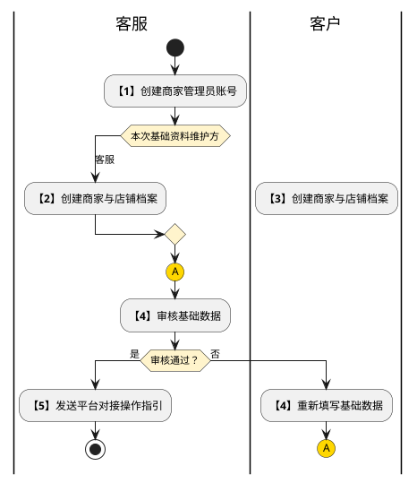
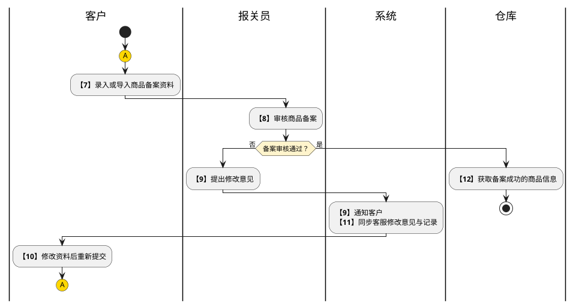
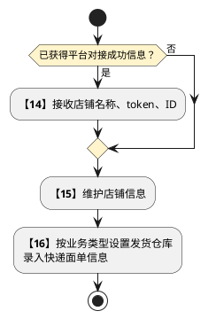
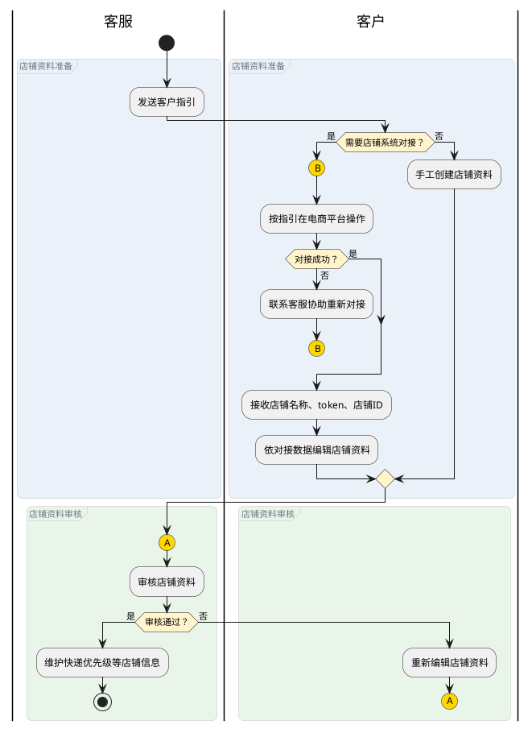

# 第057篇

> 本篇定位：客户门户与业务前置；主要内容：账号店铺、商品备案与审核、知识库、面单和业务前置；文档角色：模块档；文档ID：793342989B

共用定义见[运营支撑实体](../PRD.高捷物流系统.第08册.运营支撑/PRD.高捷物流系统.第066篇.数据字典.7A3D9E1F50.md#doc-7A3D9E1F50-operations-model)、[门户与业务前置权限](../PRD.高捷物流系统.第08册.运营支撑/PRD.高捷物流系统.第067篇.角色与访问权限.5E31456F30.md#doc-5E31456F30-portal-access)。

## 1. 业务范围与协作

客户开展业务前，维护客户与店铺档案、备案商品和充值资金；客服、报关员与财务在数字化平台完成对应审核。

### 1.1 门户共用操作与业务入口

本篇列表默认每页 50 条。新增使用提交、取消入口，修改使用保存、取消入口；提交成功显示成功提示。输入不符合规范或缺少必填值时标识对应字段，并禁用提交、保存入口。

| 系统 | 一级菜单 | 二级菜单 | 说明 |
| --- | --- | --- | --- |
| 客户门户 | 基础信息 | 客户档案 | 展示客户档案信息，提供客户修改档案入口 |
| 客户门户 | 基础信息 | 店铺档案 | 展示店铺档案信息，提供客户修改店铺档案入口 |
| 客户门户 | 基础信息 | 账号管理 | 展示账号信息，提供客户创建子账号入口。 |
| 客户门户 | 商品备案 | 商品备案 | 展示商品备案信息，为客户提供商品备案的新建和编辑入口。 |
|  | 税金管理 | 税金余额列表 | 展示店铺税金余额情况，并提供税金或其他资金充值入口 |
|  | 税金管理 | 充值记录 | 记录客户充值情况 |
|  | 税金管理 | 扣款记录 | 记录税金扣款情况 |
|  | 税金管理 | 税金看板 | 提供不同申报类型的税金看板 |
|  | 账单管理 | 税金账单 | 客户确认税金账单，实行对账功能；完整定义见[税金账户与账单](../PRD.高捷物流系统.第06册.财务管理/PRD.高捷物流系统.第049篇.税金账户与账单.D17737280F.md#doc-D17737280F-tax-account-scope) |
|  | 知识库 |  | 展示客户可查看的知识库文档，便于客户开展业务。 |
| 数字化平台 | 客户管理 | 账号管理 | 展示客户账号 |
| 数字化平台 | 客户管理 | 店铺管理 | 展示店铺信息 |
| 数字化平台 | 商品备案 | 备案审核 | 展示商品备案审核状态及修改意见 |
|  | 快递派送 | 区域规则 | 配置负责派送不同城市的快递公司。 |

| 专用名词 | 名词解释 |
| --- | --- |
| 电商企业备案名称 | 纳入海关注册登记的参与跨境电子商务业务的企业名称；不同店铺可关联一个电商企业备案名称。 |
| 商品备案 | 报关行会协助商家核实商品是否能够以跨境电商模式进口和备案，并在收到商家提供的商品备案资料后向海关递交资料、录入商品信息到海关系统。 |

| 用户角色 | 描述 |
| --- | --- |
| 客户 | 可在客户门户维护档案信息 |
| 客服 | 可在数字化平台编辑客户档案信息 |
| 报关员 | 可在数字化平台审核商品信息 |
| 财务 | 可在数字化平台审核充值金额 |

### 1.2 客户业务准备协作流程

| 步骤 | 步骤描述 | 角色 | 流程描述 | 下一步骤 |
| --- | --- | --- | --- | --- |
| 1 | 创建客户账号 | 客服 | 创建电商平台上或自有erp上的商家管理员账号 | 2/3 |
| 2 | 维护基础数据 | 客服 | 创建商家档案、创建店铺档案 | 4 |
| 3 | 维护基础数据 | 客户 | 创建商家档案、创建店铺档案（没有和电商平台对接的商家可直接创建店铺档案） | 4 |
| 4 | 审核基础数据 | 客服 | 审核客户上传的基础数据，审核成功后，走下一步，审核失败，客户重新填写基础数据。 | 5 |
| 5 | 发送客户指引 | 客服 | 发送给客户在电商平台上跟数字化平台对接的操作指引 | 6/7 |
| 6 | 资金充值 | 客户 | 商家在客户门户上进行包括税金和其他类型资金在内的充值。 | 13 |
| 7 | 填写商品备案 | 客户 | 商家在客户门户上进行商品备案信息的录入或导入。 | 8 |
| 8 | 审核商品备案 | 报关员 | 报关员在后台对客户上传的商品备案信息进行审核 | 9 |
| 9 | 通知修改意见 | 报关员、系统 | 对于备案审核失败的商品明细提出修改意见，系统传送修改意见给客户并同步客服。 | 10/11 |
| 10 | 修改后重提 | 客户 | 客户接受修改意见，对商品备案信息进行编辑，重新提交给报关员审核。 | 返回审核；来源总表与场景连接差异见 OPS-51 |
| 11 | 收到通知 | 客服 | 客服同步收到报关员通知，查看修改意见和修改记录，不替代重新审核。 | 后续依赖见 OPS-51 |
| 12 | 获取备案成功的商品信息 | 仓库 | 仓库可看到备案成功的商品备案信息 | 14 |
| 13 | 审核资金充值 | 财务 | 线上充值不需财务审核，线下充值需要财务进行审核。审核成功后，系统充值成功。审核失败后让客户重新充值。 | 14 |
| 14 | 接受平台对接信息 | 客户 | 客户根据操作指引在电商平台上操作完成后，客户门户可收到电商平台对接成功的店铺信息，包括店铺名称，token，id等。 | 15 |
| 15 | 维护店铺信息 | 客户 | 客户依照对接数据依次对店铺进行进行店铺档案维护。没对接成功的客户可直接维护店铺档案。 | 16 |
| 16 | 建立指定发货仓库 | 客户 | 设置店铺下不同业务类型的小订单从指定仓库发货的发货规则，并依照不同发货仓库录入快递面单信息。 |  |

流程表中的资金充值、商品备案与店铺对接是按场景适用的准备事项；其先后和共同前置关系尚未完整定义，见 OPS-51。下列三图分别展开账号与基础档案准备（第 1—5 步）、商品备案（第 7—12 步）和店铺对接配置（第 14—16 步）；第 6、13 步展开见[资金充值流程](../PRD.高捷物流系统.第06册.财务管理/PRD.高捷物流系统.第049篇.税金账户与账单.D17737280F.md#doc-D17737280F-tax-recharge-flow)。各场景不串成必经或并行条件。

账号与基础档案准备图的连接符 `A` 返回第 4 步复核入口；本图在发送指引后结束，不决定后续准备事项的启动顺序。未对接平台的客户也可直接创建店铺档案。

第 11 步的客服接收、查看修改意见与记录属于同步通知，不是客户重提的前置条件；图中同步客服的通知节点覆盖该旁路，不虚构等待客服查看完成的汇合。连接符 `A` 返回第 7 步提交入口，备案成功商品不得由客户覆盖，修改须通知客服处理。

店铺对接配置图承接客户依据操作指引进行的对接结果；未对接成功也可直接维护店铺档案，不以本图推定备案、充值和对接的共同完成条件。

## 2. 客户门户：登陆

客户门户账号不能自行注册，由平台管理员在运维后台开通并设置权限（主账号），限定只有一个主账号（以免后期开放注册验证主体规则太复杂）；主账号开通后，可自行登录客户门户创建子账号并设置账号权限（仅限创建子账号），其中最多可开设30个子账号

账号类型和说明

**界面原型概述 · 客户门户：登陆**

| 字段或控件 | 个别界面约束或可见反馈 |
| --- | --- |
| 主账号 | 现阶段不支持自行注册，不存在游客身份；限定1个主账号具备最高权限，即可查看，操作所有主体内店铺的内容；后续如果需要开放注册，则需要验证主体，哪个账号提交验证则哪个账号作为主账号，主账号具有客户门户主体内业务所有权限 |
| 子账号 | 限定数量30个（由后台控制，系统设置需要加全局设置），需要绑定店铺（支持绑定多店铺）并仅限查看及操作具有权限店铺内的业务 |

**界面原型概述 · 客户门户：登陆**

| 字段或控件 | 个别界面约束或可见反馈 |
| --- | --- |
| 账号 | 必填；登录账号格式为姓名拼音全称并区分大小写；客户门户内可填写手机号；后续开放注册后，需支持手机号登录，通过手机号自行改密，找回密码 |
| 密码 | 凭证生成、强度、重置与可见边界见 OPS-09。 |

场景说明

| 场景类型 | 提示内容 |
| --- | --- |
| 必填未填 | 请输入账号密码 |
| 账号不存在 | 此账号不存在 |
| 密码不正确 | 密码不正确 |
| 禁止登录 | 此账号已禁止登录 |

## 3. 数字化平台：客户管理

**业务范围**：为电商平台上的商家或自有erp系统等商家创建账号

**参与角色**：电商客服、商家管理员

**业务结果**：商家管理员主账号创建成功、商家子账号创建成功。

**处理规则**：客服在数字化平台创建商家管理员主账号。
在权限配置上配置该管理员账号的权限。
商家在客户门户上登录管理员账号。
商家在客户门户上创建子账号。
商家为子账号配置数据权限和资源权限。
其他员工用子账号登录客户门户系统。

**分支与异常**：3a、商家登录管理员账号失败
3a-01、联系客服重新获取账号密码
3b、商家登录后看不到相应的菜单和数据
3b-01、联系客服重新配置权限
6a：商家员工登录子账号失败
6a-01、联系商家管理员重新获取账号密码
6b、商家员工登录后看不到相应的菜单和数据
6b-01、联系商家管理员重新配置权限

### 3.1 账号管理列表

账号列表页面管理所有客户的管理员账号信息。一个客户仅存在一个管理员账号。管理员账号由客服在后台创建。

查询：在不选择任何查询字段下，点击“查询”按钮，默认所有查询条件。选择对应的查询条件，则显示符合结果的数据。查询出的数据，按照系统记录的“创建时间”倒序排列。

重置：重置所有查询条件。

新建账号：点进后进入账号创建页面

发送指引：点进后进入发送指引弹窗，选择不同类型的文件发送到客户的业务负责人邮箱。

编辑：进入该账号的账号编辑页面，展示当前客户管理员账号下的所有子账号。

**界面原型概述 · 账号管理列表**

- **区域字段或业务元素**：账号名称、账号密码、账号类型、所属店铺、状态。
- **区域级通用规则**：展示当前记录，字段只读；操作入口按本场景的业务资格开放。

| 字段或控件特例 | 界面特例或可见反馈 |
| --- | --- |
| 账号名称 | 取客户创建账号资料时的登录名称；展示全部 |
| 账号密码 | 凭证生成、强度、重置与可见边界见 OPS-09。 |
| 账号类型 | 由客服创建的管理员账号为主账号；由客户创建的账号为子账号；展示全部 |
| 所属店铺 | 客户创建账号资料时选择；最多展示两个店铺名称，当所属超过两个时，列表字段尾部展示《...》，当光标悬浮在该字段上，展示全部店铺名称。 |
| 状态 | 账号的当前状态；《状态》为已启用，默认《操作》为禁用；当点击《操作》禁用时，更改《状态》为已禁用，《操作》为启用。 |

查看：进入该账号的查看页面

禁用：当禁用该账号时，该主账号下的所有子账号（包括主账号）被禁用

启用：当启用该账号时，该主账号下的所有子账号（包括主账号）被启用

**界面原型概述 · 账号管理列表 · 筛选项定义**

- **区域字段或业务元素**：公司名称、客户简称。
- **区域级通用规则**：展示当前记录，字段只读；操作入口按本场景的业务资格开放。

| 字段或控件特例 | 界面特例或可见反馈 |
| --- | --- |
| 公司名称 | 按输入选择，模糊搜索 |
| 客户简称 | 按输入选择，模糊搜索 |

#### 3.1.1 客户账号生成规则

| 业务字段 | 规则与形成结果 |
| --- | --- |
| 客户账号 | 创建账号成功后系统自动生成 |
| 客户密码 | 系统随机生成密码 |

**界面原型概述 · 账号管理列表 · 筛选项定义**

- **区域字段或业务元素**：公司名称、客户简称、客户账号、客户密码。
- **区域级通用规则**：展示当前记录，字段只读；操作入口按本场景的业务资格开放。

| 字段或控件特例 | 界面特例或可见反馈 |
| --- | --- |
| 公司名称 | 客服创建账号时录入 |
| 客户简称 | 客服创建账号时录入 |
| 客户账号 | 按[本区域业务规则](#doc-793342989B-b84d0a754a57)展示或校验 |
| 客户密码 | 按[本区域业务规则](#doc-793342989B-b84d0a754a57)展示或校验 |

### 3.2 账号创建

账号新建页面是客服用于创建客户账号的页面。

账号支持创建与密码重置；初始凭证、重置交付及可见边界见 OPS-09。

取消：点击取消，回到账号管理列表。

#### 3.2.1 客户账号唯一性规则

| 业务字段 | 规则与形成结果 |
| --- | --- |
| 客户公司名称 | 去重校验 |
| 客户简称 | 去重校验 |

**界面原型概述 · 账号创建**

| 字段或控件 | 个别界面约束或可见反馈 |
| --- | --- |
| 客户公司名称 | 必填；只读；按[本区域业务规则](#doc-793342989B-f5e24daf58dc)展示或校验 |
| 客户简称 | 必填；按[本区域业务规则](#doc-793342989B-f5e24daf58dc)展示或校验 |
| 跟单客服 | 带出人力中心电商客服的全部名字 |

## 4. 客户门户：基础信息

### 4.1 客户档案协作

**业务范围**：客户或客服创建客户档案

**参与角色**：电商客服、商家管理员

**前置条件**：创建商家账号成功

**业务结果**：客户档案经由客服审核成功。

**处理规则**：商家在客户门户上创建商家档案。
客服在数字化平台进行商家档案的审核。
审核成功后，为该客户进行账期等业务资料的编辑。
客服主管进行客户档案审核。

**分支与异常**：1a、商家不创建商家档案
1a-01、联系客服，由客服在数字化平台创建包括业务资料在内的商家档案。
1a-02、客服主管进行审核。
4a、客户档案审核失败
4a-01、联系客户，由客户或客服重新编辑客户档案。
4a-02、客服主管进行审核。

### 4.2 店铺对接与档案协作

**业务范围**：创建商家名下的店铺档案

**参与角色**：电商客服、商家管理员

**前置条件**：商家管理员主账号创建成功

**业务结果**：商家店铺档案经由客服审核成功。

**处理规则**：客服向商家发送“客户指引”，指引客户在电商平台上进行对接操作。
客户在电商平台上（如抖音、拼多多）操作。
操作成功后，商家在客户门户上接受到对接数据（店铺名称、token、店铺id）
商家依照对接数据在客户门户上编辑店铺资料
客服在数字化平台上审核店铺资料
审核成功后，编辑该店铺资料，维护店铺的快递优先级等信息。

**分支与异常**：1a：商家没有店铺系统对接需求
1a-01:商家在客户门户上直接手工创建店铺资料。
1a-02:客服进行店铺资料审核
3a：对接失败
3a-01:联系客服，重新进行店铺系统对接
5a：审核店铺资料失败
5a-01:客户重新编辑店铺资料
5a-02:客服进行审核

**店铺对接与资料审核协作图**

连接符 `B` 表示对接失败后由客户联系客服重新操作，连接符 `A` 返回客服审核入口。图只展开本节店铺资料协作，不改变[客户业务准备协作流程](#doc-793342989B-customer-preparation-flow)中备案、充值和店铺配置之间尚未确认的依赖。

### 4.3 客户档案

客户用于创建和维护客户档案的页面，包括基本信息、联系人信息、银行账号信息、邮箱收件人信息。

新建档案：客户为初次登录时，进入客户引导页面，页面展示《欢迎使用高捷客户门户系统，为了便于您开展业务，请事先准备营业执照、联系人邮箱等材料，进行接下来的档案维护。》引导客户点击《新建档案》操作按钮，点击后进行档案新增操作。

添加一行：当点击《添加一行》时，下方列表默认展示一行，字段规则与原先列表字段保持一致。

编辑：编辑该行明细上可编辑的字段

删除：添加一行后，操作栏按钮默认《删除》，当点击删除后，该行明细被删除。

提交：当客户点击《提交》后，回到客户档案首页，回显所有字段信息。此时右上角展示状态；当客户资料被审核后，根据审核结果变更状态为《审核成功》和《审核驳回》。当状态=待审核时，不允许客户编辑资料。当状态=审核成功或审核驳回时，可编辑客户资料。

客户提交后，客户资料进入业务运营平台。跟单客服针对该档案进行编辑。点击编辑后，编辑客户未填写的内容。提交后客服主管对档案进行审核。

当客服主管审核成功后，客户在客户门户再次编辑提交后，客户资料直接由主管进行审核。

#### 4.3.1 客户资料规则

| 业务字段 | 规则与形成结果 |
| --- | --- |
| 公司名称 | 去重校验 |

**界面原型概述 · 客户档案**

| 字段或控件 | 个别界面约束或可见反馈 |
| --- | --- |
| 公司名称 | 必填；只读；按[本区域业务规则](#doc-793342989B-bccd82588dfa)展示或校验 |
| 境内外关系 | 必填；境内/境外 |
| 公司地址 | 必填；当《境内外关系》选择为境内时，公司地址取省市区地址。 当《境内外关系》选择为为境外时，公司地址取国家名称 |
| 公司详细地址 | 字符限制：2-500；公司详细地址信息，允许中文、英文、数字、特殊字符 |
| 营业期限 | 必填；可在选择项选择截止营业年限或勾选《长期》。当勾选长期时，营业期限不与选择，置灰。 |
| 营业执照 | 必填；允许上传pdf、图片，大小不超过25MB |
| 营业执照号 | 必填；字符限制：5-200；允许中文、字母、数字、特殊字符。 |
| 银行名称 | 必填；字符限制：5-20；允许中文、字母、数字、特殊字符。 |
| 开户行名称 | 必填；字符限制：5-100；允许中文、字母、数字、特殊字符。 |
| 账户名称 | 必填；字符限制：2-100；允许中文、字母、数字、特殊字符。 |
| 银行账号 | 必填；字符限制：2-100；允许中文、字母、数字、特殊字符。 |
| 是否为基本户 | 必填；《是》或《否》，单选 |
| 联系人类型 | 默认展示三行，分为展示《负责人》、《业务联系人》、《财务联系人》，置灰，不予修改 |
| 联系人姓名 | 必填；字符限制：2-100；允许中文、字母、数字、特殊字符。 |
| 联系人电话 | 必填；字符限制：2-100；允许中文、字母、数字、特殊字符。 |
| 联系人传真 | 字符限制：2-100；允许中文、字母、数字、特殊字符。 |
| 联系人电子邮箱 | 必填；字符限制：2-100；允许中文、字母、数字、特殊字符。 |
| 备注 | 字符限制：2-200；允许中文、字母、数字、特殊字符。 |

### 4.4 店铺档案列表

客户用于展示店铺信息的管理页面

查询：在不选择任何查询字段下，点击“查询”按钮，默认所有查询条件。选择对应的查询条件，则显示符合结果的数据。查询出的数据，按照系统记录的“创建时间”倒序排列。

重置：重置所有查询条件。

新增店铺：进入店铺新增页面。

**界面原型概述 · 店铺档案列表 · 筛选项定义**

- **区域字段或业务元素**：店铺名称、店铺ID。
- **区域级通用规则**：展示当前记录，字段只读；操作入口按本场景的业务资格开放。

| 字段或控件特例 | 界面特例或可见反馈 |
| --- | --- |
| 店铺名称 | 按输入选择，模糊搜索 |
| 店铺ID | 按输入选择，精确搜索 |

**界面原型概述 · 店铺档案列表 · 筛选项定义**

- **区域字段或业务元素**：店铺名称、店铺ID、平台、电商企业备案号、电商企业备案名称、状态、操作。
- **区域级通用规则**：展示当前记录，字段只读；操作入口按本场景的业务资格开放。

| 字段或控件特例 | 界面特例或可见反馈 |
| --- | --- |
| 店铺名称 | 客户创建店铺资料时录入 |
| 店铺ID | 客户创建店铺资料时录入 |
| 平台 | 客户创建店铺资料时录入 |
| 电商企业备案号 | 客户创建店铺资料时录入 |
| 电商企业备案名称 | 客户创建店铺资料时录入 |
| 状态 | 展示店铺审核状态；未确认/已确认/已驳回与待审核/审核成功/审核失败的术语映射见 OPS-24。 |
| 操作 | 当状态=待审核时，功能按钮为“查看”；当状态=审核成功时，功能按钮为“查看、编辑”；当状态=审核失败时，功能按钮为“查看、编辑”；点击“查看”，进入查看页面；点击“编辑”，进入编辑页面 |

### 4.5 店铺档案创建

客户用于创建店铺档案

添加一行：当点击《添加一行》时，下方列表默认展示一行，字段规则与原先列表字段保持一致。在选择业务类型和发货仓库时，系统做唯一性校验，不允许同一业务类型下的同一发货仓库有两条发货明细。

原“业务模式”改名为“申报模式”，取值“BBC/BC/CC”，支持单选；新增“账册名称”，取值数据字典商品备案账册名称，支持单选。当申报模式=BBC时，账册名称为必填；当申报模式=BC或CC时，账册名称不必填

删除：点击，该行明细删除。

提交：当客户点击《提交》后，回到店铺档案列表页，新增一条店铺明细，店铺状态=待审核。

#### 4.5.1 店铺资料规则

| 业务字段 | 规则与形成结果 |
| --- | --- |
| 店铺名称 | 去重校验 |

**界面原型概述 · 店铺档案创建**

- **区域字段或业务元素**：店铺名称、平台选择、店铺ID、电商企业备案号、电商企业备案名称、店铺链接、平台网址、业务类型、发货仓库、发件人姓名、发件人联系电话、发件人地址。
- **区域级通用规则**：必填。

| 字段或控件特例 | 界面特例或可见反馈 |
| --- | --- |
| 店铺名称 | 只读；按[本区域业务规则](#doc-793342989B-11c7c3bc91d2)展示或校验 |
| 平台选择 | 抖音/拼多多 |
| 店铺ID | 只读；平台店铺的id名称 |
| 电商企业备案号 | 字符限制：2-200；允许数字、字母、特殊字符 |
| 电商企业备案名称 | 字符限制：2-100；允许数字、字母、特殊字符 |
| 店铺链接 | 字符限制：2-250；允许数字、字母、特殊字符 |
| 平台网址 | 字符限制：2-250；允许数字、字母、特殊字符 |
| 业务类型 | BBC/BC/CC，单选 |
| 发货仓库 | 取客服创建的仓库名称，单选。 |
| 发件人姓名 | 字符限制：2-100；允许数字、字母、特殊字符 |
| 发件人联系电话 | 字符限制：2-100；允许数字、字母、特殊字符 |
| 发件人地址 | 字符限制：2-200；允许数字、字母、特殊字符 |

### 4.6 账号列表

用于客户管理所有子账号的页面

查询：在不选择任何查询字段下，点击“查询”按钮，默认所有查询条件。选择对应的查询条件，则显示符合结果的数据。查询出的数据，按照系统记录的“创建时间”倒序排列。

重置：重置所有查询条件。

新建账号：点击后进入新建账号页面

批量操作：批量操作选择项，可在勾选一个或多条账号明细后进行点击批量禁用或批量启用。当在未勾选明细时点击批量禁用或批量选用，则弹出弹窗提示“请勾选一条或多条账号信息”。

改密：点击后弹出改密码弹窗。提示输入新密码。主账号登录人可拥有所有账号（包括主账号和子账号）的编辑和改密权限。子账号登录人仅可拥有当前子账号的编辑和改密权限。

禁用：可对状态=已启用的账号进行禁用。主账号登录人可禁用所有账号，子账号登录人仅支持禁用当前子账号。

启用：可对状态=已禁用的账号进行启用。主账号登录人可启用所有账号，子账号登录人仅支持启用当前子账号。

**界面原型概述 · 账号列表 · 筛选项定义**

- **区域字段或业务元素**：登陆账号、账号状态、所属店铺、姓名。
- **区域级通用规则**：展示当前记录，字段只读；操作入口按本场景的业务资格开放。

| 字段或控件特例 | 界面特例或可见反馈 |
| --- | --- |
| 登录账号 | 按输入选择，精确搜索 |
| 账号状态 | 已启用/已禁用 |
| 所属店铺 | 按选择查询，取当前账户可查看的所有店铺名称，支持多选 |
| 姓名 | 取账号录入时的名字 |

**界面原型概述 · 账号列表 · 筛选项定义**

- **区域字段或业务元素**：登录账号、姓名、手机号、所属组织、所属店铺、账号类型、创建时间、状态。
- **区域级通用规则**：展示当前记录，字段只读；操作入口按本场景的业务资格开放。

| 字段或控件特例 | 界面特例或可见反馈 |
| --- | --- |
| 登录账号 | 客户创建账号资料时录入；按查询结果和数据权限展示所有，主账号登录展示全部，子账号登录展示当前账号 |
| 姓名 | 客户创建账号资料时录入；按查询结果和数据权限展示所有，主账号登录展示全部，子账号登录展示当前账号 |
| 手机号 | 客户创建账号资料时录入；按查询结果和数据权限展示所有，主账号登录展示全部，子账号登录展示当前账号 |
| 所属组织 | 默认为当前公司名称；按查询结果和数据权限展示所有，主账号登录展示全部，子账号登录展示当前账号 |
| 所属店铺 | 客户创建账号资料时录入；按查询结果和数据权限展示所有，主账号登录展示全部，子账号登录展示当前账号 |
| 账号类型 | 由客服创建的管理员账号为主账号；由客户创建的账号为子账号；按查询结果和数据权限展示所有，主账号登录展示全部，子账号登录展示当前账号 |
| 创建时间 | 客户创建账号资料时系统自动赋值，格式是2021.01.12  14:00；按查询结果和数据权限展示所有，主账号登录展示全部，子账号登录展示当前账号 |
| 状态 | 账号的当前状态；按查询结果和数据权限展示所有，主账号登录展示全部，子账号登录展示当前账号 |

### 4.7 账号创建

用于客户新增子账号的页面。

保存：点击保存，生成一条子账号。

返回：回到账号列表。

权限设置：点击权限设置tab按钮，进入菜单权限配置页面。勾选菜单进行资源权限配置

当勾选一级菜单后，旗下所有二级菜单默认被勾选；当有一个或多个二级菜单被勾选，上级菜单默认被勾选；当某一级菜单下的所有二级菜单未选中时，则默认该一级菜单不勾选。配置菜单权限后，默认拥有该菜单的所有功能操作权限。

**界面原型概述 · 账号创建**

| 字段或控件 | 个别界面约束或可见反馈 |
| --- | --- |
| 登录账号 | 必填；只读；用于登录的账号 |
| 姓名 | 必填；用户管理及搜索 |
| 手机号 | 必填；仅限支持移动手机号，预留字段 |
| 所属组织 | 必填条件待确认（默认）；默认为主账号对应的组织，可以不展示，但是必须预留该字段 |
| 所属店铺 | 必填；支持多选，子账号绑定主体后可选择主体下面的店铺；暂不限制绑定数量。当选择多家店铺时，当前账户可 看到多家店铺的店铺数据。如该店铺的订单、该店铺的税金余额等。 |
| 状态 | 必填；默认：启用/禁用；必选，新建是默认启用 |

## 5. 数字化平台：店铺管理

### 5.1 店铺列表

店铺列表页面管理所有客户的店铺信息。

查询：在不选择任何查询字段下，点击“查询”按钮，默认所有查询条件。选择对应的查询条件，则显示符合结果的数据。查询出的数据，按照系统记录的“创建时间”倒序排列。

重置：重置所有查询条件。

查看：查看该客户管理员账号和管理员旗下的所有子账号

编辑：进入客户账号编辑页面，可编辑跟单客服和密码。

禁用：点击禁用后，禁用该客户管理员账号和旗下所有子账号。仅状态=已启用的管理员账号可禁用。

启用：点击启用后，启用该客户管理员账号。仅状态=已禁用的管理员账号可启用。

**界面原型概述 · 店铺列表**

- **区域字段或业务元素**：公司名称、客户简称、店铺名称、平台名称、店铺id、税金余额。
- **区域级通用规则**：展示当前记录，字段只读；操作入口按本场景的业务资格开放。

| 字段或控件特例 | 界面特例或可见反馈 |
| --- | --- |
| 公司名称 | 客服创建店铺时录入 |
| 客户简称 | 客服创建店铺时录入 |
| 店铺名称 | 客服创建店铺时录入 |
| 平台名称 | 客服创建店铺时录入 |
| 店铺id | 客服创建店铺时录入 |
| 税金余额 | 依照店铺查处当前税金余额 |

### 5.2 店铺创建

原型页面用于客服创建店铺信息的页面。

添加一行：当点击《添加一行》时，下方列表默认展示一行，字段规则与原先列表字段保持一致。

删除：添加一行后，操作栏按钮默认《删除》，当点击删除后，该行明细被删除。

原“业务模式”改名为“申报模式”，取值“BBC/BC/CC”，支持单选；新增“账册名称”，取值数据字典商品备案账册名称，支持单选。当申报模式=BBC时，账册名称为必填；当申报模式=BC或CC时，账册名称不必填

按区域快递优先规则：当勾选时，取区域快递规则。取订单派送的区域所属快递。当不勾选时，按照下方输入的第一、第二、第三快递公司优先级发送快递。当第一优先级快递公司无法派送快递时，发送消息通知给客服并自动选择第二优先级的快递公司进行派送。

#### 5.2.1 店铺创建唯一性规则

| 业务字段 | 规则与形成结果 |
| --- | --- |
| 客户公司名称 | 去重校验 |
| 客户简称 | 去重校验 |
| 店铺名称 | 去重校验 |

**界面原型概述 · 店铺创建**

| 字段或控件 | 个别界面约束或可见反馈 |
| --- | --- |
| 客户公司名称 | 必填；只读；按[本区域业务规则](#doc-793342989B-c6d215742d60)展示或校验 |
| 客户简称 | 必填；按[本区域业务规则](#doc-793342989B-c6d215742d60)展示或校验 |
| 店铺名称 | 按[本区域业务规则](#doc-793342989B-c6d215742d60)展示或校验 |
| 平台选择 | 必填；抖音/拼多多 |
| 店铺id | 必填；字符限制：2-20；允许数字、字母、特殊字符 |
| 电商企业备案号 | 必填；字符限制：2-50；允许数字、字母、特殊字符 |
| 电商企业备案名称 | 必填；字符限制：2-100；允许数字、字母、特殊字符 |
| 店铺链接 | 必填；字符限制：2-250；允许数字、字母、特殊字符 |
| 平台网址 | 必填；字符限制：2-250；允许数字、字母、特殊字符 |
| 业务类型 | 必填；BBC/BC/CC，单选 |
| 发货仓库 | 必填；取客服创建的仓库名称，单选。 |
| 发件人姓名 | 必填；字符限制：2-100；允许数字、字母、特殊字符 |
| 发件人联系电话 | 必填；字符限制：2-100；允许数字、字母、特殊字符 |
| 发件人地址 | 必填；字符限制：2-200；允许数字、字母、特殊字符 |
| 跟单客服 | 必填；取电商客服账号名称 |
| 税金警戒线 | 必填；允许四位小数 |

## 6. 客户门户：商品备案

**业务范围**：商家为实现海关要求，进行业务准备前商品备案工作。

**参与角色**：报关员、商家管理员

**前置条件**：创建商家账号成功

**业务结果**：报关员审核商品备案信息成功。

**处理规则**：商家在客户门户上导入商品备案信息。
报关员在数字化平台导出客户的商品备案信息。
线下对商品备案信息批量提出修改意见。
将审核状态和修改意见导入到数字化平台，根据审核状态判定该商品明细“备案成功”或“备案失败”。
客户在前台门户上获取备案状态。
客户在前台门户导出备案失败的商品备案明细。
客户在线下进行商品备案修改。
客户导入修改后的商品备案明细，覆盖原数据。保留历史操作记录。
提交后经由报关员在数字化平台进行备案审核。
商品备案审核成功。

**分支与异常**：1a、导入失败。
1a-01:提示“SKU0002该行明细不符合校验规则，请重新导入”
3a、报关员在线上对备案商品提出修改意见。
3a-01:报关员针对该商品的某个字段在线上针对性的填写修改意见。
3a-02:提交后，该商品状态=备案失败。
8a：客户导入时，新导入的数据里包含备案成功的商品明细。
8a-01:系统自动过滤备案成功的商品明细，不允许覆盖原数据。客户需要修改备案成功的商品明细时，通知客服进行修改。

### 6.1 商品备案列表

客户用于创建和查看商品备案信息的页面。

查询：在不选择任何查询字段下，点击“查询”按钮，默认所有查询条件。选择对应的查询条件，则显示符合结果的数据。查询出的数据，按照系统记录的录入时间倒序排列。

重置：重置所有查询条件。

删除：支持勾选一条或多条商品明细后，点击《删除》，一次性删除多条商品备案信息。仅可删除状态=待提交的商品明细。

**导入操作**

- **模板与资料下载**：点击“导入”打开弹窗，下载当前申报模式页签对应的模板；例如，BBC页签提供BBC模板。可同时下载参考资料《税号明细》《正面清单》。
- **文件上传**：在线下编辑文件后，点击“上传文件”上传。
- **校验结果**：系统按字段规则解析文件。符合规则的商品明细状态为“待提交”；不符合规则的明细自动过滤，并提示“商品条形码XXX不符合导入规则，已过滤”。
- **重复数据覆盖**：再次导入时，按商品条形码匹配，可覆盖原有未提交或备案失败的数据。系统提示“当前有X条商品信息被修改，确认要覆盖原数据么”；点击“确认”覆盖，点击“取消”不覆盖。

导出：点击后按查询条件导出明细。

新增：点击后进入新增商品备案信息页面。

查看：点击后进入该商品的查看页面。 查看页面展示该商品行信息和操作日志。

审核日志记录该商品明细的操作日志。《操作人》取操作该商品明细的不同用户的账号名称，《操作名称》取操作业务上的功能，包括：创建、提交、审核、编辑。《操作时间》记录操作时间。《操作内容》根据操作名称变更。

创建：创建SKU编码0000001.

提交：提交至审核。

审核：审核成功/审核失败（如果是审核失败，需标记报关员输入的审核意见）

变更：编辑HS编码 032133 变更为 2412222.

**界面原型概述 · 商品备案列表 · 筛选项定义**

- **区域字段或业务元素**：商品ID、状态、货号编码、更新时间、商品条形码。
- **区域级通用规则**：展示当前记录，字段只读；操作入口按本场景的业务资格开放。

| 字段或控件特例 | 界面特例或可见反馈 |
| --- | --- |
| 商品ID | 按输入查询，模糊搜索 |
| 状态 | 未提交/待审核/备案成功/备案失败 |
| 货号编码 | 商品身份、唯一性和必填关系见 OPS-17。 |
| 更新时间 | 开始日期-结束日期，精确到时分秒 |
| 商品条形码 | 商品身份、唯一性和必填关系见 OPS-17。 |

#### 6.1.1 商品备案状态规则

| 业务字段 | 规则与形成结果 |
| --- | --- |
| 商品ID | 导入后系统自动生成的商品ID |
| 状态 | 未提交：新建或导入的未进行提交的备案信息 待审核：已提交，但报关员未在后台进行审核的商品 备案成功：已提交，并且报关员在后台审核成功的商品 备案失败：已提交，并且报关员在后台审核失败的商品 |
| 启用状态 | 启用/禁用；仅展示。默认备案成功的为启用状态；报关员点击禁用后，为禁用状态。 |
| 操作 | 状态=未提交，操作为《提交、查看、编辑、删除》 状态=待审核，操作为《查看》 状态=备案成功时，操作为《查看》 状态=备案失败时，操作为《编辑、查看》；点击提交，该明细状态变为待审核。 点击查看，进入查看页面。 点击编辑，进入编辑页面；编辑后提交=待审核状态，编辑后保存=未提交状态 |

**界面原型概述 · 商品备案列表 · 筛选项定义**

- **区域字段或业务元素**：商品ID、货号编码、商品条形码、海关备案号、品牌、商品名称、HS编码、规格型号、单位、海关备案单位代码、净重（KG）、毛重（KG）、第一法定单位代码、第二法定单位代码、第一法定数量、第二法定数量、原产国代码、原产国名称、组成成分、申报要素、生产厂家、生产厂家地址、单价、172洋葱、175加工区、220抖音3pl、226抖音4pl、224洋葱保税外借、241得物、业务模式、条码备注、英文品名、行邮税号、审核意见、状态、启用状态、操作。
- **区域级通用规则**：展示当前记录，字段只读；操作入口按本场景的业务资格开放。

| 字段或控件特例 | 界面特例或可见反馈 |
| --- | --- |
| 商品ID | 按[本区域业务规则](#doc-793342989B-178cd08f1dab)展示或校验 |
| 货号编码 | 显示客户自编编码；唯一性组合见 OPS-17。 |
| 商品条形码 | 商品的条形码，客户创建或导入备案信息时录入 |
| 海关备案号 | 客户创建或导入备案信息时录入 |
| 品牌 | 客户创建或导入备案信息时录入 |
| 商品名称 | 客户创建或导入备案信息时录入 |
| HS编码 | 客户创建或导入备案信息时录入 |
| 规格型号 | 客户创建或导入备案信息时录入 |
| 单位 | 客户创建或导入备案信息时录入 |
| 海关备案单位代码 | 客户创建或导入备案信息时录入 |
| 净重（KG） | 客户创建或导入备案信息时录入 |
| 毛重（KG） | 客户创建或导入备案信息时录入 |
| 第一法定单位代码 | 客户创建或导入备案信息时录入 |
| 第二法定单位代码 | 客户创建或导入备案信息时录入 |
| 第一法定数量 | 客户创建或导入备案信息时录入 |
| 第二法定数量 | 客户创建或导入备案信息时录入 |
| 原产国代码 | 客户创建或导入备案信息时录入 |
| 原产国名称 | 客户创建或导入备案信息时录入 |
| 组成成分 | 客户创建或导入备案信息时录入 |
| 申报要素 | 客户创建或导入备案信息时录入 |
| 生产厂家 | 客户创建或导入备案信息时录入 |
| 生产厂家地址 | 客户创建或导入备案信息时录入 |
| 单价 | 客户创建或导入备案信息时录入 |
| 172洋葱 | 如果取值为“是”或空，则由客户创建或导入备案信息时输入“是”或空； 如果取值是数字，则是由报关员申报核注清单后，海关回传的账册序号 |
| 175加工区 | 如果取值为“是”或空，则由客户创建或导入备案信息时输入“是”或空； 如果取值是数字，则是由报关员申报核注清单后，海关回传的账册序号 |
| 220抖音3pl | 如果取值为“是”或空，则由客户创建或导入备案信息时输入“是”或空； 如果取值是数字，则是由报关员申报核注清单后，海关回传的账册序号 |
| 226抖音4pl | 如果取值为“是”或空，则由客户创建或导入备案信息时输入“是”或空； 如果取值是数字，则是由报关员申报核注清单后，海关回传的账册序号 |
| 224洋葱保税外借 | 如果取值为“是”或空，则由客户创建或导入备案信息时输入“是”或空； 如果取值是数字，则是由报关员申报核注清单后，海关回传的账册序号 |
| 241得物 | 如果取值为“是”或空，则由客户创建或导入备案信息时输入“是”或空； 如果取值是数字，则是由报关员申报核注清单后，海关回传的账册序号 |
| 业务模式 | 客户创建或导入备案信息时输入“集货”或“备货” |
| 条码备注 | 客户创建或导入备案信息时输入，允许填写多个 |
| 商品名称 | 取商品品名 |
| 英文品名 | 取英文品名 |
| 规格型号 | 取规格型号 |
| 行邮税号 | 取行邮税号 |
| 审核意见 | 取报关员对于该商品的审核意见 |
| 状态 | 按[本区域业务规则](#doc-793342989B-178cd08f1dab)展示或校验 |
| 启用状态 | 按[本区域业务规则](#doc-793342989B-178cd08f1dab)展示或校验 |
| 操作 | 按[本区域业务规则](#doc-793342989B-178cd08f1dab)展示或校验 |

客户用于管理商品备案信息的页面

批量查询：点击后弹出“批量查询”弹窗。在输入区域输入多条商品条形码，支持以换行符分割。点击《确定》后，进行批量查询。自动过滤输错的查询码。

**导入操作**

- **模板与资料下载**：点击“导入”打开弹窗，按业务类型选择BC或BBC模板，下载Excel文件。可同时下载参考资料《税号明细》《正面清单》。
- **文件上传**：在线下编辑文件后，点击“上传文件”上传。
- **校验结果**：系统按字段规则解析文件。符合规则的商品明细状态为“待提交”；不符合规则的明细自动过滤，并提示“商品条形码XXX不符合导入规则，已过滤”。
- **重复数据覆盖**：再次导入时，按商品条形码匹配，可覆盖原有未提交或备案失败的数据。系统提示“当前有X条商品信息被修改，确认要覆盖原数据么”；点击“确认”覆盖，点击“取消”不覆盖。

跨模板相同字段基于客户商品条形码如何处理，待确认（OPS-17）。

**界面原型概述 · 商品备案列表 · 筛选项定义**

| 字段或控件 | 个别界面约束或可见反馈 |
| --- | --- |
| 品牌 | 按输入查询，模糊搜索 |
| 商品货号 | 按输入查询，精确搜索 |
| 备案商品品名 | 按输入查询，模糊搜索 |
| 商品条形码 | 按输入查询，精搜搜索；允许商品条形码批量查询，点击《批量查询》按钮，弹出弹窗进行批量查询 |

**界面原型概述 · 商品备案列表 · 筛选项定义**

- **区域字段或业务元素**：商品条形码、备案商品品名、申报模式推荐。
- **区域级通用规则**：展示当前记录，字段只读；操作入口按本场景的业务资格开放。

| 字段或控件特例 | 界面特例或可见反馈 |
| --- | --- |
| 商品条形码 | 客户创建或导入备案信息时录入 |
| 备案商品品名 | 客户创建或导入备案信息时录入 |
| 申报模式推荐 | 取基础业务数据里，历史预归类数据中，根据HS编码带出业务类型 |

### 6.2 商品备案创建

客户用于手工录入的商品备案信息的页面。

**界面原型概述 · 商品备案创建**

| 字段或控件 | 个别界面约束或可见反馈 |
| --- | --- |
| 申报模式 | 必填；只读；BBC/BC/CC |
| 业务模式 | 必填；只读；集货/备货 |
| 货号编码 | 商品身份、唯一性和必填关系见 OPS-17。 |
| 商品条形码 | 商品身份、唯一性和必填关系见 OPS-17。 |
| 毛重（KG） | 允许录入小数；精度冲突见 OPS-18。 |
| 净重（KG） | 允许录入小数；精度冲突见 OPS-18。 |
| 品牌 | 必填；字符限制：2-50；允许数字、字母、文本、特殊字符 |
| 商品链接 | 字符限制：2-250；允许数字、字母、特殊字符 |
| 商品名称 | 必填；字符限制：2-100；允许数字、字母、文本 |
| 英文品名 | 必填；字符限制：2-100；允许数字、字母、文本 |
| 单价 | 允许录入小数；精度冲突见 OPS-18。 |
| 规格型号 | 允许中文、字母、数字和特殊字符；字符上限见 OPS-18。 |
| 币制 | 必填；字符限制：1-100；允许字母、文本 |
| 原产地代码 | 必填；允许数字 |
| 海关备案单位代码 | 必填；允许数字、字母 |
| HS编码 | 必填；字符限制：1-100；允许字母、数字 |
| 申报区代码 | 必填；字符限制：1-100；允许字母、数字 |
| 第一法定单位 | 必填；字符限制：1-100；允许文本、字母、数字 |
| 第一法定数量 | 必填；允许数字 |
| 行政编号 | 字符限制：1-100；允许数字、字母 |
| 第二法定单位 | 字符限制：1-100；允许文本、数字、字母 |
| 第二法定数量 | 允许数字 |
| 账册编号 | 仅申报模式 BBC 可多选账册；226 账册的可选范围见 OPS-19。 |

**界面原型概述 · 商品备案创建**

| 字段或控件 | 个别界面约束或可见反馈 |
| --- | --- |
| SKU条形编码 | 商品身份、唯一性和必填关系见 OPS-17。 |
| 商品货号 | 商品身份、唯一性和必填关系见 OPS-17。 |
| 品名 | 必填；字符限制：2-100；允许数字、字母、文本 |
| 商品单价 | 允许录入小数；精度冲突见 OPS-18。 |
| 销售计量单位代码 | 必填；允许数字 |

## 7. 数字化平台：备案审核

### 7.1 备案审核列表

展示所有客户提交的备案审核信息，支持报关员通过导入导出进行批量审核或单个审核。

筛选项说明

根据申报模式的页签（BBC/BC/CC）展示所有客户提交的备案审核信息，并进行审核和提出修改意见。

**界面原型概述 · 备案审核列表**

- **区域字段或业务元素**：商品ID、客户名称、货号编码、商品条形码。
- **区域级通用规则**：展示当前记录，字段只读；操作入口按本场景的业务资格开放。

| 字段或控件特例 | 界面特例或可见反馈 |
| --- | --- |
| 商品ID | 按输入选择，精确搜索；支持批量查询 |
| 客户名称 | 按输入选择，模糊搜索；支持单选 |
| 货号编码 | 按输入选择，精确搜索；支持批量查询 |
| 商品条形码 | 支持商品条码查询；精确/模糊及批量范围见 OPS-21。 |

按查询条件展示备案审核记录，无条件时查询全部；默认排序存在冲突，见 OPS-21。

重置：重置所有查询条件。

查看：点击后进入该商品行的查看页面。

导出：点击后，导出筛选出的商品备案列表。

导入：点击后弹出导入弹窗（弹窗根据不同业务模式的页签展示不同业务模式的下载和导入模板）。系统根据字段校验规则解析文件，根据导入字段“状态”中“备案成功”、“备案失败”更改备案商品状态。在二次导入时进行商品ID唯一性校验，状态已为“备案成功”的商品ID不允许更改状态。导入后系统提示《导入成功341条，242条备案成功，99条备案失败》。点击“取消”，取消导入。点击“确定”后，导入成功。

按客户名称分文件夹下载商品图片，图片名为“商品ID_名称”；可用申报模式的范围见 OPS-21。

下载图片：点击后，进行该商品行的图片下载。图片名为“商品id_名称”，如“32123_CCIC证件”。

审核：点击审核后，进入该商品信息的单个审核页面。仅“待审核”和“备案失败”状态下的商品才可审核。

编辑：点击后，进入该商品信息的单个审核页面，进行再次审核。仅“备案成功”状态下的商品可以编辑。

启用用于恢复禁用商品的业务可用性；可执行此操作的启停状态与备案状态组合见 OPS-20。

禁用商品不得继续执行订单出库、报关，约束关联的小订单、服务单和大订单。启停资格与已有对象处理边界见 OPS-20。

生成核注清单：仅BBC的页签有“生成核注清单”按钮，勾选一条或多条BBC商品后，点击生成核注清单，跳到核注清单页面。等核注清单状态=已过卡时，原商品账册展示的值“是”，被对接后回传的账册序号覆盖。

如：商品ID为2222的 172账册 展示为“是”，当点击生成核注清单，172账册的核注清单状态=已过卡时，系统会回传该商品在172账册的账册序号 “12”。此时，商品ID为2222 的 172账册 展示为“12”，覆盖原来的“是”。

展示所有客户提交的备案审核信息，并进行审核和提出修改意见。

#### 7.1.1 商品备案审核状态规则

| 业务字段 | 规则与形成结果 |
| --- | --- |
| 商品ID | 导入后系统自动生成的商品ID |
| 启用状态 | 启用/禁用；仅展示。默认备案成功的为启用状态；报关员点击禁用后，为禁用状态。 |

**界面原型概述 · 备案审核列表**

- **区域字段或业务元素**：客户名称、商品ID、货号编码、商品条形码、海关备案号、品牌、商品名称、HS编码、规格型号、单位、海关备案单位代码、净重（KG）、毛重（KG）、第一法定单位代码、第二法定单位代码、第一法定数量、第二法定数量、原产国代码、原产国名称、组成成分、申报要素、生产厂家、生产厂家地址、单价、172洋葱、175加工区、220抖音3pl、226抖音4pl、224洋葱保税外借、241得物、业务模式、条码备注、英文品名、行邮税号、审核意见、状态、启用状态、操作。
- **区域级通用规则**：展示当前记录，字段只读；操作入口按本场景的业务资格开放。

| 字段或控件特例 | 界面特例或可见反馈 |
| --- | --- |
| 客户名称 | 取客户名称 |
| 商品ID | 按[本区域业务规则](#doc-793342989B-69054f324730)展示或校验 |
| 货号编码 | 显示客户自编编码；唯一性组合见 OPS-17。 |
| 商品条形码 | 商品的条形码，客户创建或导入备案信息时录入 |
| 海关备案号 | 客户创建或导入备案信息时录入 |
| 品牌 | 客户创建或导入备案信息时录入 |
| 商品名称 | 客户创建或导入备案信息时录入 |
| HS编码 | 客户创建或导入备案信息时录入 |
| 规格型号 | 客户创建或导入备案信息时录入 |
| 单位 | 客户创建或导入备案信息时录入 |
| 海关备案单位代码 | 客户创建或导入备案信息时录入 |
| 净重（KG） | 客户创建或导入备案信息时录入 |
| 毛重（KG） | 客户创建或导入备案信息时录入 |
| 第一法定单位代码 | 客户创建或导入备案信息时录入 |
| 第二法定单位代码 | 客户创建或导入备案信息时录入 |
| 第一法定数量 | 客户创建或导入备案信息时录入 |
| 第二法定数量 | 客户创建或导入备案信息时录入 |
| 原产国代码 | 客户创建或导入备案信息时录入 |
| 原产国名称 | 客户创建或导入备案信息时录入 |
| 组成成分 | 客户创建或导入备案信息时录入 |
| 申报要素 | 客户创建或导入备案信息时录入 |
| 生产厂家 | 客户创建或导入备案信息时录入 |
| 生产厂家地址 | 客户创建或导入备案信息时录入 |
| 单价 | 客户创建或导入备案信息时录入 |
| 172洋葱 | 如果取值为“是”或空，则由客户创建或导入备案信息时输入“是”或空； 如果取值是数字，则是由报关员申报核注清单后，海关回传的账册序号 |
| 175加工区 | 如果取值为“是”或空，则由客户创建或导入备案信息时输入“是”或空； 如果取值是数字，则是由报关员申报核注清单后，海关回传的账册序号 |
| 220抖音3pl | 如果取值为“是”或空，则由客户创建或导入备案信息时输入“是”或空； 如果取值是数字，则是由报关员申报核注清单后，海关回传的账册序号 |
| 226抖音4pl | 如果取值为“是”或空，则由客户创建或导入备案信息时输入“是”或空； 如果取值是数字，则是由报关员申报核注清单后，海关回传的账册序号 |
| 224洋葱保税外借 | 如果取值为“是”或空，则由客户创建或导入备案信息时输入“是”或空； 如果取值是数字，则是由报关员申报核注清单后，海关回传的账册序号 |
| 241得物 | 如果取值为“是”或空，则由客户创建或导入备案信息时输入“是”或空； 如果取值是数字，则是由报关员申报核注清单后，海关回传的账册序号 |
| 业务模式 | 客户创建或导入备案信息时输入“集货”或“备货” |
| 条码备注 | 客户创建或导入备案信息时输入，允许填写多个 |
| 商品名称 | 取商品品名 |
| 英文品名 | 取英文品名 |
| 规格型号 | 取规格型号 |
| 行邮税号 | 取行邮税号 |
| 审核意见 | 取报关员填写的审核意见；按查询条件展示200字符，大于200字符用光标放置展示 |
| 状态 | 待审核：已提交，但报关员未在后台进行审核的商品 备案成功：已提交，并且报关员在后台审核成功的商品 备案失败：已提交，并且报关员在后台审核失败的商品 |
| 启用状态 | 按[本区域业务规则](#doc-793342989B-69054f324730)展示或校验 |
| 操作 | 审核、编辑、启用、禁用和删除入口按业务状态显示；启停组合资格见 OPS-20。 |

展示所有客户提交的备案审核信息，支持报关员批量进行审核或单个审核。

**界面原型概述 · 备案审核列表**

- **区域字段或业务元素**：公司名称、客户简称、申报模式、备案商品品名。
- **区域级通用规则**：展示当前记录，字段只读；操作入口按本场景的业务资格开放。

| 字段或控件特例 | 界面特例或可见反馈 |
| --- | --- |
| 公司名称 | 按输入选择，模糊搜索 |
| 客户简称 | 按输入选择，模糊搜索 |
| 申报模式 | BC/BBC/CC |
| 备案商品品名 | 按输入选择，模糊搜索 |

批量查询：点击后跳 出“批量查询”弹窗。在输入区域输入多条商品条形码，支持以换行符分割。点击《确定》后，进行批量查询。自动过滤输错的查码。

导入：点击后弹出导入弹窗。系统根据字段校验规则解析文件，根据导入字段“状态”中“备案成功”、“备案失败”更改备案商品状态。在二次导入时进行商品ID唯一性校验，状态已为“备案成功”的商品ID不允许更改状态。导入后系统提示《导入成功341条，242条备案成功，99条备案失败》。点击“取消”，取消导入。点击“确定”后，导入成功。

#### 7.1.2 商品备案标识规则

| 业务字段 | 规则与形成结果 |
| --- | --- |
| 商品ID | 客户创建或导入时，系统自动生成的商品ID |

**界面原型概述 · 备案审核列表**

- **区域字段或业务元素**：客户名称、商品ID、商品条形码、品牌、备案商品品名、HS编码、申报模式推荐、状态、修改意见。
- **区域级通用规则**：展示当前记录，字段只读；操作入口按本场景的业务资格开放。

| 字段或控件特例 | 界面特例或可见反馈 |
| --- | --- |
| 客户名称 | 取客户简称 |
| 商品ID | 按[本区域业务规则](#doc-793342989B-9a0615427487)展示或校验 |
| 商品条形码 | 客户创建或导入时录入的商品条形码 |
| 品牌 | 客户创建或导入时录入的品牌 |
| 备案商品品名 | 客户创建或导入时录入的品名 |
| HS编码 | 客户创建（编辑）或导入时录入的HS编码 |
| 申报模式推荐 | 依照预归类商品编码推荐 |
| 状态 | 取商品审核状态 |
| 修改意见 | 报关员针对该商品填写的修改意见 |

### 7.2 备案审核

客服进行单个商品备案的备案审核操作页面。

下载：点击后下载对应图片/文档。

备案成功：点击后，回到备案审核列表。该行商品备案成功。

备案失败：点击后，回到备案失败列表。该行商品备案失败。

上一条：进入按当前查询条件排序的上一个商品备案审核页面。

下一条：进入按当前查询条件排序的下一个商品备案审核页面。

**界面原型概述 · 备案审核**

| 字段或控件 | 个别界面约束或可见反馈 |
| --- | --- |
| 审核意见 | 字符限制：0-1000；默认：请输入理由；允许数字、字母、特殊字符 |

## 8. 客户门户：知识库

### 8.1 知识库列表

展示当前客户可查看的客服在后台配置的知识库文档。

下载：点击后，下载当前文档到本地。

#### 8.1.1 知识库文档编码规则

| 业务字段 | 规则与形成结果 |
| --- | --- |
| 文档编码 | 客服在数字化平台上传文档时系统自动生成的编码，WD+年月日+两位流水号；展示当前客户可看到的数据 |

**界面原型概述 · 知识库列表**

- **区域字段或业务元素**：文档名称、文档编码、文档类型、上传时间、页数、大小。
- **区域级通用规则**：展示当前记录，字段只读；操作入口按本场景的业务资格开放。

| 字段或控件特例 | 界面特例或可见反馈 |
| --- | --- |
| 文档名称 | 客服在数字化平台上传文档时输入的文档名称；展示当前客户可看到的数据 |
| 文档编码 | 按[本区域业务规则](#doc-793342989B-4c3d352d87c4)展示或校验 |
| 文档类型 | 客服在数字化平台创建的文档类型；展示当前客户可看到的数据 |
| 上传时间 | 客服在数字化平台上传的时间，2021-02-12；展示当前客户可看到的数据 |
| 页数 | 取上传文档的页数；展示当前客户可看到的数据 |
| 大小 | 取文件大小，不超过1GB；展示当前客户可看到的数据 |

## 9. 数字化平台：知识库

### 9.1 知识库列表

展示客服在数字化平台上传的知识库文档，支持文档面向不同客户展示。

**界面原型概述 · 知识库列表 · 筛选项定义**

- **区域字段或业务元素**：文档名称、文档类型。
- **区域级通用规则**：用户输入或选择查询条件，查询后更新知识库结果列表。

| 字段或控件特例 | 界面特例或可见反馈 |
| --- | --- |
| 文档名称 | 按输入查询，模糊搜索 |
| 文档类型 | 取文档类型，支持多选 |

查询：在不选择任何查询字段下，点击“查询”按钮，默认所有查询条件。选择对应的查询条件，则显示符合结果的数据。查询出的数据，按照系统记录的上传时间倒序排列。

重置：重置所有查询条件。

上传文档：点击后弹出弹窗，选择文档类型、输入文档名称，进行文档上传。

**界面原型概述 · 上传知识库文档**

- **区域字段或业务元素**：文档类型、文档名称、上传文档。
- **区域级通用规则**：三项均必填，缺项时不允许提交。

| 字段或控件特例 | 界面特例或可见反馈 |
| --- | --- |
| 文档类型 | 选择文档类别；来源同时标为不可编辑，其适用入口见 OPS-54。 |
| 文档名称 | 2-50 个字符，允许中文、数字、字母和特殊字符。 |
| 上传文档 | 允许 Word、PDF、Excel 文件，单个文件不超过 1 GB。 |

重新上传：点击后弹出弹窗，重新上传文档。回显当前文档类型和名称；新文档覆盖原文档文件。

启用：当前文档可被全局启用；仅状态=禁用的文档可以被启用

禁用：当前文档全局禁用；仅状态=启用的文档可以被禁用，当上传文件后，系统默认上传文件为全局启用状态。

配置权限：配置客户能在客户门户查看的文件，点击后弹出配置弹窗，选择客户进行配置。支持输入后查询，取所有客户名称，支持多选。

列表字段

#### 9.1.1 知识库文档编码规则

| 业务字段 | 规则与形成结果 |
| --- | --- |
| 文档编码 | 客服在数字化平台上传文档时系统自动生成的编码，WD+年月日+两位流水号；展示全部 |

**界面原型概述 · 知识库列表 · 筛选项定义**

- **区域字段或业务元素**：文档名称、文档编码、文档类型、上传时间、上传人、状态。
- **区域级通用规则**：展示当前记录，字段只读；操作入口按本场景的业务资格开放。

| 字段或控件特例 | 界面特例或可见反馈 |
| --- | --- |
| 文档名称 | 客服在数字化平台上传文档时输入的文档名称；展示全部 |
| 文档编码 | 按[本区域业务规则](#doc-793342989B-25ab6edbee7a)展示或校验 |
| 文档类型 | 客服在数字化平台创建的文档类型；展示全部 |
| 上传时间 | 客服在数字化平台上传的时间，2021-02-12；展示全部 |
| 上传人 | 上传人的账号名称；展示全部 |
| 状态 | 启用/禁用；展示全部 |

### 9.2 类型列表

展示客服在数字化平台创建的文档类型。

**界面原型概述 · 类型列表 · 筛选项定义**

- **区域字段或业务元素**：文档类型。
- **区域级通用规则**：展示当前记录，字段只读；操作入口按本场景的业务资格开放。

| 字段或控件特例 | 界面特例或可见反馈 |
| --- | --- |
| 文档类型 | 按输入查询，模糊搜索 |

查询：在不选择任何查询字段下，点击“查询”按钮，默认所有查询条件。选择对应的查询条件，则显示符合结果的数据。查询出的数据，按照系统记录的操作时间倒序排列。

重置：重置所有查询条件。

新建类型：点击后弹出弹窗，创建文档类型。

#### 9.2.1 类型名称唯一性规则

| 业务字段 | 规则与形成结果 |
| --- | --- |
| 类型名称 | 去重校验 |

**界面原型概述 · 类型列表 · 筛选项定义**

- **区域字段或业务元素**：类型名称。
- **区域级通用规则**：展示当前记录，字段只读；操作入口按本场景的业务资格开放。

| 字段或控件特例 | 界面特例或可见反馈 |
| --- | --- |
| 类型名称 | 按[本区域业务规则](#doc-793342989B-cd169576a0c5)展示或校验 |

修改：点击后弹出弹窗，编辑文档类型。编辑时，该文档类型下的所有文件的类型名称被修改。

启用：当前文档类型可被全局启用；仅状态=禁用的文档类型可以被启用，当启用时，该文档类型下的所有文档可允许被启用。

禁用：当前文档全局禁用；当禁用时，该文档类型下的所有文档都被禁用。仅状态=启用的文档类型可以被禁用，当创建文件类型后，系统默认该文件为类型为启用状态。

列表字段

**界面原型概述 · 类型列表 · 筛选项定义**

- **区域字段或业务元素**：类型名称、操作人、操作时间、状态。
- **区域级通用规则**：展示当前记录，字段只读；操作入口按本场景的业务资格开放。

| 字段或控件特例 | 界面特例或可见反馈 |
| --- | --- |
| 类型名称 | 客服在数字化平台创建的文档类型；展示全部 |
| 操作人 | 创建的客服账号名称；展示全部 |
| 操作时间 | 客服在数字化平台操作的时间，2021-02-12；展示全部 |
| 状态 | 启用/禁用；展示全部 |

## 10. 数字化平台：快递派送

### 10.1 区域规则列表

展示客服在数字化平台维护的区域快递派送规则。配置负责派送不同城市的快递公司。

**界面原型概述 · 区域规则列表 · 筛选项定义**

- **区域字段或业务元素**：区域名称、快递公司名称。
- **区域级通用规则**：展示当前记录，字段只读；操作入口按本场景的业务资格开放。

| 字段或控件特例 | 界面特例或可见反馈 |
| --- | --- |
| 区域名称 | 省和市的二级筛选列表 |
| 快递公司名称 | 根据输入，模糊查询 |

查询：在不选择任何查询字段下，点击“查询”按钮，默认所有查询条件。选择对应的查询条件，则显示符合结果的数据。

重置：重置所有查询条件。

新建规则：点击后，弹出规则弹窗。

**界面原型概述 · 区域规则列表 · 筛选项定义**

- **区域字段或业务元素**：区域、快递公司。
- **区域级通用规则**：展示当前记录，字段只读；操作入口按本场景的业务资格开放。

| 字段或控件特例 | 界面特例或可见反馈 |
| --- | --- |
| 区域 | 省级不可多选，市级可以多选 |
| 快递公司 | 单选 |

编辑：进入规则编辑页面

查看：进入规则查看页面

删除：删除当前规则。

列表字段

**界面原型概述 · 区域规则列表 · 筛选项定义**

- **区域字段或业务元素**：省、市、快递公司。
- **区域级通用规则**：展示当前记录，字段只读；操作入口按本场景的业务资格开放。

| 字段或控件特例 | 界面特例或可见反馈 |
| --- | --- |
| 省 | 中国的省级城市名称；展示全部 |
| 市 | 中国的市级城市名称；展示全部 |
| 快递公司 | 客服创建规则时配置的快递公司；展示全部 |

## 11. 客户门户：打印面单

### 11.1 打印面单列表

展示客户在客户门户的客户订单列表，支持根据小订单列表打印快递面单。

**界面原型概述 · 打印面单列表 · 筛选项定义**

- **区域字段或业务元素**：快递单号、订单编号。
- **区域级通用规则**：展示当前记录，字段只读；操作入口按本场景的业务资格开放。

| 字段或控件特例 | 界面特例或可见反馈 |
| --- | --- |
| 快递单号 | 按输入查询，精确搜索；支持批量查询 |
| 订单编号 | 按输入查询，精确搜索；支持批量查询 |

查询：在不选择任何查询字段下，点击“查询”按钮，默认所有查询条件。选择对应的查询条件，则显示符合结果的数据。查询出的数据，按照系统记录的上传时间倒序排列。

重置：重置所有查询条件。

导出：点击后导出列表字段。

打印：支持筛选后，批量勾选后，点击打印。根据不同快递模板进行打印。不允许批量勾选不同快递公司的订单信息。

以下是中通快递模板

**界面原型概述 · 打印面单列表 · 筛选项定义**

- **区域字段或业务元素**：集包地、收件、寄件、条形码、订单号、日期、分拣码。
- **区域级通用规则**：展示当前记录，字段只读；操作入口按本场景的业务资格开放。

| 字段或控件特例 | 界面特例或可见反馈 |
| --- | --- |
| 集包地 | 取小订单对接的集包地字段；展示全部 |
| 收件 | 展示收件人名字、地址、电话；展示全部 |
| 寄件 | 展示寄件人名字、地址、电话；展示全部 |
| 条形码 | 展示快递单号；展示全部 |
| 订单号 | 展示客户订单号；展示全部 |
| 日期 | 展示打印快递面单的时间，精确到时分秒；展示全部 |
| 分拣码 | 快递接口回传的分拣码；展示全部 |

## 12. 平台商品对照

客户店铺使用的外部平台商品与中台商品之间的对照，由[平台商品对照](../PRD.高捷物流系统.第04册.仓储管理/PRD.高捷物流系统.第034篇.仓库模型与库存管理.B73CA2EE76.md#doc-B73CA2EE76-allocation-strategy)统一维护；本篇不重复定义映射记录、检索字段和编辑规则。清空、重复、生效及历史订单处理的缺口见 OPS-52。

## 13. 待确认边界

本篇尚未形成唯一口径的边界已记录在 PRD 自洽性问题清单：OPS-09、OPS-17、OPS-18、OPS-19、OPS-20、OPS-21、OPS-24、OPS-25、OPS-42、OPS-51、OPS-52、OPS-54。这些问题不作为已确认的判断条件、权限、算法或状态迁移。
