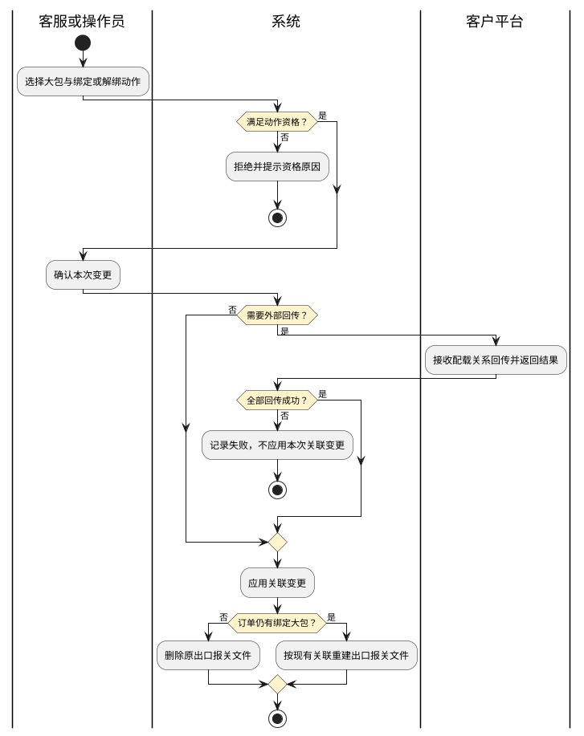
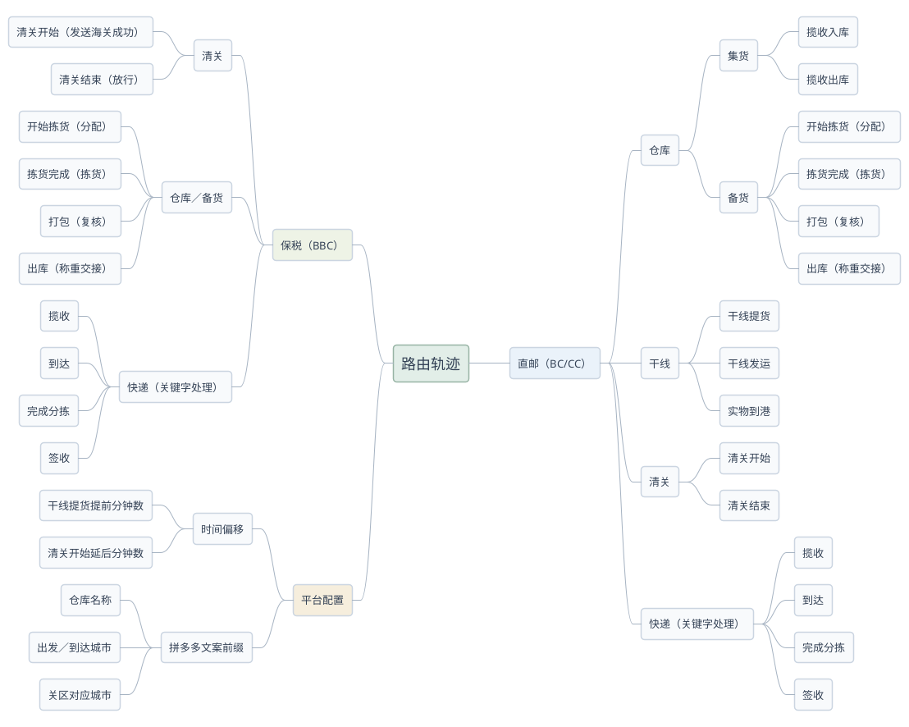
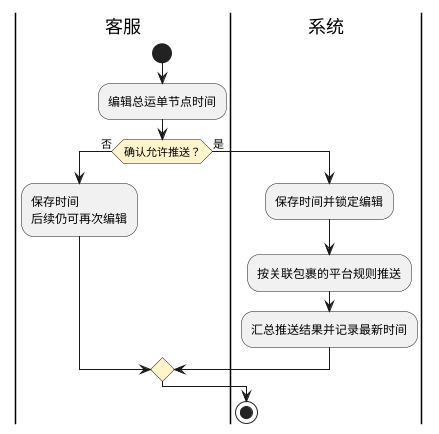

# 第071篇

> 本篇定位：客户接口与数据交接；主要内容：客户预报、订单绑定、承运反馈、平台轨迹与节点时间推送；文档角色：模块档；文档ID：58EB46CA94

共用定义见[综合订单与服务协同实体](../PRD.高捷物流系统.第08册.运营支撑/PRD.高捷物流系统.第065篇.数据字典.7A3D9E1F50.md#doc-7A3D9E1F50-integrated-order-model)、[综合订单与客户订单权限](../PRD.高捷物流系统.第08册.运营支撑/PRD.高捷物流系统.第066篇.角色与访问权限.5E31456F30.md#doc-5E31456F30-integrated-order-access)。

## 1. 客户数据交接范围

本篇按客户与平台区分数据交接约定：字节契约及对应操作、拼多多与LemonBox订单交接、客户平台路由轨迹和节点时间推送分别定义，客户专属要求不作为所有运输方式的统一规则。

字节客户通过TT平台与高捷交换大包配载预报、小包清关资料、主提单、承运重量及履约轨迹。客服和操作员在预报管理及出口订单中处理揽收、绑定、解绑、承运重量和报关通过资料；节点生成和人工维护完整规则见[在途跟踪](../PRD.高捷物流系统.第02册.订单管理/PRD.高捷物流系统.第025篇.空运-在途跟踪.8ADA3E9EFF.md#doc-8ADA3E9EFF-order-node-management)。

小包以物流订单号识别，大包以大包号识别，主提单与分提单分别识别运输集合。配载预报提供大包与小包的组成，配载回传提供主提单与完整大包集合，分提单可选地关联大包。不能把高捷出口订单号、字节物流订单号和面单号互换。

来源关系图中主提单到分提单标1:N、大包到分提单标N:1；小包指向大包、大包指向主提单的箭头却都标1:N，与业务归集方向有歧义。跨运输段是否允许同一大包关联多个主提单，须确认后再建立全局关系不变量。

接口保留合作契约所必需的标识和数据格式，不定义内部数据库、实现组件或调用代码。源文的历史发布日期、作者、密钥样例和联调操作步骤不进入长期需求；明确的停用范围与尚存兼容冲突仍保留。

## 2. 出口预报与订单绑定

### 2.1 揽收、绑定与解绑

| 操作 | 资格与输入 | 本地结果与外部反馈 |
| --- | --- | --- |
| 干线揽收 | 勾选大包，填写实际揽收时间、揽收状态及地点；异常时必填异常原因 | 保存揽收资料。无需回传时操作状态=已确认；需回传且全部成功时=发送成功；任一失败时=发送失败，并提示接口发送失败。成功失败均保存资料；取消不保存 |
| 绑定订单 | 大包状态为待绑定或绑定失败；填写进行中的出口订单号 | 不需回传或全部回传成功才保存绑定并置绑定成功；任一失败则绑定失败、不保存绑定资料并提示绑定失败。未提交、交易取消、交易完成订单不得绑定，提示只有进行中的订单才能绑定 |
| 解绑订单 | 仅绑定成功的大包可操作，二次确认 | 不需回传或全部成功后删除订单号、总运单号并改为待绑定；任一失败则保留原关联及状态，提示解绑失败 |

揽收在所有操作状态下均允许再次编辑。揽收状态与操作发送状态独立：发送成功不说明揽收正常。绑定与解绑回传使用本篇第5章的配载预报契约；当多个接口部分成功时，本地不保存或不解除关系，但外部已成功部分如何补偿，尚待确认。

绑定成功后按该出口订单全部报关资料生成“出口报关文件”，保存为出口订单的报关单类型附件。解绑成功后删除该订单旧“出口报关文件”，按剩余绑定大包重新生成；若全部大包都解绑，只删除旧文件而不生成空文件。附件生成失败、人工同名附件识别以及再次绑定后的覆盖规则待确认。

图中“记录失败”在绑定场景为绑定失败，在解绑场景保留绑定成功；两者不能统一回退为待绑定。

### 2.2 预报页面

**界面原型概述 · 预报查询与列表**

- **区域字段或业务元素**：查询栏含订单号、大包号、揽收状态、操作时间、总运单号、操作状态、绑定状态；结果区含订单号、总运单号、大包号、实际揽收时间、揽收状态、操作状态、绑定状态、大包货物类型、小包裹数量、大包重量、长宽高、期望揽收起止时间、操作时间；工具栏含查询、重置、展开/收起、干线揽收、绑定、解绑、查看。
- **区域级通用规则**：查询按已输入条件组合过滤，列表只读展示预报及处理结果；无条件查询提示先选择条件；重置只清空条件，不自动刷新列表。

| 字段或控件特例 | 界面特例或可见反馈 |
| --- | --- |
| 大包号 | 支持批量输入查询 |
| 揽收状态 | 待揽收、正常、异常 |
| 操作状态 | 待确认、已确认、发送成功、发送失败；与揽收状态分列 |
| 绑定状态 | 待绑定、绑定成功、绑定失败；按第2.1节显示操作入口 |
| 订单号、总运单号 | 绑定后才显示 |
| 重量、尺寸 | 列表展示kg和cm；接入单位换算以第4章契约为准 |

**界面原型概述 · 揽收及关联弹窗**

| 字段或控件 | 个别界面约束或可见反馈 |
| --- | --- |
| 干线揽收 | 实际揽收时间、正常/异常、操作地点必填；异常时展开并要求选择异常原因；显示本地与换算时间、操作状态、保存、取消 |
| 绑定订单 | 订单号必填，提交与取消分开；失败在弹窗反馈 |
| 解绑订单 | 显示确认提示，确认或取消；失败时保持原绑定展示 |

**界面原型概述 · 大包预报详情**

- **区域字段或业务元素**：订单号、大包号、大包重量及单位、长宽高及单位、大包货物类型、小包裹数量及小包ID列表、操作时间、期望揽收起止时间、上下服务商代码与资源代码、揽收地公司名称、L0至L4地址、详细地址、详细地址2、揽收人姓与名、邮编、手机号、揽收状态、实际揽收时间、异常原因、揽收地点。
- **区域级通用规则**：客户推送资料只读，揽收结果从第2.1节操作回显；不把详情只读字段的必传要求变成用户录入义务。

来源详情表允许直接编辑实际揽收时间及地点，但同页其余揽收信息只读，和统一揽收弹窗的保存边界不一致；采用哪一编辑入口及再次回传条件待确认。

## 3. 报关资料、承运重量与终止

### 3.1 出口报关资料

小包清关资料由客户推送，按大包关联出口订单后展示订单号及总运单号。必须先指定条件并查询，才能执行查询导出报关；未查询时提示查询后才能导出。导出使用出口报关模板，具体未附模板列不能据页面列推定为完整交付格式。

报关通过导入从模板解析报关数据并关联订单，按不同总运单号分别生成“报关通过文件-总运单号”，保存在出口订单附件，类型为报关单。取消不导入。批次内错误是否整批拒绝、重复导入覆盖、未知订单处理及附件格式上限尚待确认。

**界面原型概述 · 出口报关查询、列表与详情**

- **区域字段或业务元素**：查询含订单号、大包号、面单号、操作时间、总运单号、物流订单号；结果含订单号、总运单号、物流订单号、清关类型、大包号、面单号、包裹总金额、货物类型、操作时间、查看；详情按小包基础、发件人、收件人、下一服务商、商品明细分区，完整数据项对应第4.2节；工具栏含查询、重置、展开/收起、查询导出报关。
- **区域级通用规则**：查询栏可填写，列表及详情只读显示客户资料和关联值；无条件查询提示先选择条件，重置不自动刷新。

| 字段或控件特例 | 界面特例或可见反馈 |
| --- | --- |
| 大包号 | 支持批量查询 |
| 订单号、总运单号 | 绑定订单后才显示 |
| 查询导出报关 | 未执行带条件查询时提示不可导出 |
| 商品明细 | 展示SKU、商品中英文名称、HS编码、申报价格与币种、申报重量、类目、规格、数量、销售链接；不按相同SKU自动合并 |

**界面原型概述 · 报关通过导入**

- **区域字段或业务元素**：报关通过文件、上传、下载模板、导入、取消。
- **区域级通用规则**：弹窗上传并确认导入，取消不写入；导入结果由本节定义。

### 3.2 承运重量

主单计费重取空运提单计费重。结算计费重默认取 `max(提单毛重, 提单件数×0.12×167)`，单位kg，允许人工修改；不据此覆盖其他客户或业务的计费算法。系数0.12与167的适用箱型、量纲、边界及舍入待确认。

承运重量保存时写入资料并按客户配置回传；无需回传为已确认，全部成功为发送成功，任一失败为发送失败并提示接口发送失败。发送失败仍保存重量，各状态均可重新编辑。取消不保存、不发送、不改状态。回传字段及与提单图片一致性见第5.3节。

**界面原型概述 · 承运重量弹窗**

| 字段或控件 | 个别界面约束或可见反馈 |
| --- | --- |
| 主单计费重 | 必备且只读，单位kg |
| 结算计费重 | 必填且可编辑，默认计算见本节正文 |
| 状态、保存、取消、关闭 | 状态初始待确认；保存成功仍停留弹窗，取消或关闭退出；发送失败也保留已保存值 |

### 3.3 取消承运

出口订单“终止订单”的确认或确认并新建若需触发取消承运接口，只有发送成功才允许终止，否则保留原订单。该动作只能触发一个接口，不允许配置多个取消承运接口；取消弹窗不终止也不发送。

“终止订单”与[综合订单](../PRD.高捷物流系统.第02册.订单管理/PRD.高捷物流系统.第012篇.综合订单管理.C97EF7E0FE.md#doc-C97EF7E0FE-lifecycle)中的订单取消、完成及服务终止尚未建立明确对应；本地终止资格、结果状态和取消承运的绑定范围待确认，不把服务终止规则直接套给整单，也不将该客户规则扩大到全部订单。

取消承运契约限定运输工具抵达目的港前，而接口总表截止点写交航；来源业务页未检查这两个时点，准确截止点待确认。接口成功但本地终止失败、重复确认及“确认并新建”的新单是否继承大包关系仍待确认。

## 4. 接入契约与小包资料

### 4.1 公共交接约束

请求公共信息包括合作标识`app_key`、秒级Unix时间戳`timestamp`、接口版本`version`、签名`sign`和业务内容`param_json`。公共表将业务内容列为非必传，但具体接口必传内容仍需满足本篇；协议版本公共表为1.0，样例为2.0，不推定样例就是有效版本。

为保持已提供的外部认证契约，签名规则承接为：按`app_key`、`param_json`、`timestamp`、`version`升序串接“参数名+参数值”，前后加合作密钥，再取MD5作为`sign`。不在PRD保存密钥实例。合作方使用POST、推荐`application/x-www-form-urlencoded`，测试与生产地址分开提供；来源要求境外服务部署，具体国家、数据出境合规及是否仍适用于当前接入待确认，不能代为决定部署位置。

响应包括结果码`code`、业务结果`data`、说明`msg`、合作方请求定位号`requestID`及响应时间`ts`。`code=0`为成功，非0为认证或业务失败；不能仅凭HTTP返回或`msg`文本认定成功。错误文案可动态变化，需保留错误码与请求定位号用于查询。

操作时间必须为业务实际发生时间，不是回传调用时间；使用RFC3339及偏移量表达同一时刻，不能固定减8小时替代时区转换。国家使用ISO 3166-1二字码，例如中国CN、印度尼西亚ID、英国GB、越南VN。字节的节点编码按本篇限定范围映射，不把内部状态文本直接回传。

### 4.2 运输配载预报与清关资料接入

接口路径统一以`/logistics/provider/cross_border/`为前缀，下面保留契约后缀。

| 接口 | 方向与业务对象 | 必需业务内容 | 可选或条件内容 |
| --- | --- | --- | --- |
| 运输配载预报 `transport_prealert` | TT→高捷，大包及所含小包 | 大包号、重量及单位、长宽高及尺寸单位、小包数量、小包物流订单号列表、前一服务商及资源代码、操作时间、揽收信息 | 大包货物类型、期望揽收起止时间、下一服务商及资源代码 |
| 清关资料创建 `export_customer_clearance_order_create` | TT→高捷，小包清关资料 | 小包列表；每包物流订单号、清关类型、大包号、面单号、操作时间、金额、包装、商品、收件人 | 平台税号、VAT税号、发货备注、货物类型、特殊种类、发件人、下一服务商信息 |

大包重量默认kg并支持6位小数，也接受g；尺寸单位默认cm。源大包重量行又写单位g，缺少单位时采用哪一默认值待确认。小包数量与ID列表数量的一致性校验尚未定义。大包货物类型1普货、2特货、3敏感品、4超规品、5特货及敏感品；源样例0不在枚举内，不据此新增类别。

清关小包的`goods_type`单独使用1普货、2特货、3敏感品、4超规品，不套用大包的值5。`eori_number`在一般字段表为可选，但欧盟场景说明要求传IOSS税号；字段名与税号名称的对应及欧盟适用国家范围待确认，不能据一般可选标记省略该条件要求。

大包揽收信息必须含地址L0、L1、L2、详细地址、揽收人姓、手机号；L3、L4、详细地址2、名、公司和邮编可选。业务页把L2列为非必填，与接口必传冲突。

| 清关小包资料组 | 必需内容与语义 | 可选或条件内容 |
| --- | --- | --- |
| 标识与类型 | 物流订单号`provider_order_id`是包裹识别键，面单号`tracking_no`另行保存；`custom_clearance_type`当前映射固定E | 接口业务说明覆盖进出口，但固定E只明确出口；进口I的接入适用范围待确认 |
| 金额`value` | 商品交易含税总价`goods_value`；扣除平台折扣并计入运费等后的包裹含税总价`total_goods_value`；是否COD`is_cod`和币种 | 是否保价0否/1是、保费、COD应收费用；COD费用说明引用未定义的paymentType=2，与is_cod的0/1关系待确认 |
| 包装`package` | 重量g、长宽高cm、体积ccm均必传；契约要求整数，不能把页面kg直接提交 | 体积与尺寸乘积不同如何校验待确认 |
| 商品`items` | SKU标识、中英文名称、含税交易单价、申报币种、申报重量g、类目、数量；商品重量和数量在契约中为整数 | HS编码、规格、销售链接；名称超长时取叶子类目名，但长度阈值未明确 |
| 发件人`sender_info` | 整组可不提供；一旦提供发件人组，地址及其L0、L1、L2和详细地址必传 | 姓、名、手机、电话、邮编、地址L3/L4及详细地址2 |
| 收件人`shipping_info` | 姓、电话、地址L0/L1/L2与详细地址 | 公司、名、手机、邮编、地址L3/L4及详细地址2 |
| 下一服务商`next_carrier_info` | 提供时其服务商代码与资源代码必传；地址提供时详细地址必传 | 姓、名、手机、电话、邮编及L0至L4地址；整组必传性源表留空，待确认 |

同一SKU可以有多个商品行，不按SKU合并。例如同一SKU三行3.33、3.33、3.34用于承接合计10的分摊，不将差异视为重复或价格错误。英文和中文同义说明合并，不丢弃该样例的分摊语义。

两类接入均要求幂等，重复数据不重复创建业务对象；识别键的具体组合与允许更新范围待确认。清关资料创建还返回整批接受结果`all_result`、有值必带的大包号、失败物流订单号列表、逐订单错误原因映射。样例同时返回`all_result=true`和非空失败清单，属于冲突，不能据样例判定全部成功；失败重传的批次范围待确认。

## 5. 配载、运输、重量与提单反馈

### 5.1 配载关系回传

`transport_prealert_return`按主提单一次回传完整大包集合，不是增量大包清单。必传运输工具代码、主提单号、大包数量、每个大包号及本次关系操作`prealert_operation`；运力名称、每大包对应的分单号可选。

| 场景 | 关系操作 | 本次内容 |
| --- | --- | --- |
| 主提单从未发送，或已被取消承运 | 1创建 | 当前主提单及其全部绑定大包 |
| 主提单已发送且未取消承运 | 2更新 | 只更新大包关系，仍一次传全 |
| 解绑大包 | 2更新 | 解绑后剩余的完整大包集合 |

航空主提单为11位纯数字，不允许连字符、空格；公路、铁路、海运允许数字与字母且不限定长度，仍不允许连字符和空格。源业务映射固定运输代码1，与接口允许1空运、2公路、3铁路、4海运不同，不把业务固定值推广到所有运输场景。接口正文在干线抵达后禁止更新，总表在交航截止，待确认实际闸门。全部大包解绑后空列表是否可回传、数量必须与列表一致的错误反馈尚未定义。

### 5.2 预计运输信息

`transport_info_callback`提交预计承运信息，确认后产生`cb_transport_book`并为进口清关下单。其主提单格式同第5.1节，运输代码源映射固定空运。必传运力名称、预计离开时间ETD、预计抵达时间ETA、是否存在中转；起终港和城市代码可选。

| 资料组 | 本次取得与回传要求 |
| --- | --- |
| 主提单与运输详情 | 主提单取空运提单号；运力取订舱头程航班；启运/目的港取订舱；ETD取头程出港日期及起飞时刻，ETA取抵达时间及时区，均以RFC3339表达 |
| 发货或承运供应商`send_supplier_info` | 名称、电话、国家二字码、两段详细地址均可选，但提供值必须与提单图片一致；源组名“承运供应商”与重量接口“发货供应商”是否同一主体待确认 |
| 提货供应商`carry_supplier_info` | 名称、电话、国家二字码、两段详细地址均可选，须与提单图片一致 |
| 中转`transport_transit_or_not` | 0否、1是；是时附中转港口列表，每站ETA必传，港口代码、上一港口代码、ETD在表中为非必传；缺站点标识是否仍可接受待确认 |
| 到门/到港`delivery_or_not` | 空运必传：1到门、2到港，取订舱干线类型；其他运输不必传 |
| 订板`transport_booking_type` | 空运1浮动板位、2固定板位，取订舱类型；其他运输不必传；字段N与早期说明必传存在差异 |
| 装载`loading_type` | 1 BUP、2 loose，不传默认2；是否允许显式传2待确认 |
| 转关`custom_transit_or_not` | 1否、2是，不与中转0/1编码共用 |

附录把`cb_transport_book`的产生接口写成配载关系回传，而本接口正文写运输信息确认；具体触发点及进口清关单去重规则待确认。

### 5.3 承运重量反馈

`transport_weight_callback`用于运输结算，按主提单回传重量。运输代码映射1、主提单为11位纯数字，分单可选；不得自动扩展第5.1节的非空运格式。重量默认kg、最多6位小数，分泡比取0至100，无分泡0、全抛重100。

| 资料组 | 必需内容 | 可选内容与来源 |
| --- | --- | --- |
| 航司重量`transport_info` | 计费重量`chargable_weight`取空运提单计费重，必须与提单图片一致 | 总件数、总票数SLAC、实际重量、体积重、笼箱号、板箱号均与提单图片一致；实际重量取提单毛重 |
| 运输详情 | 运力名称、启运港和目的港代码，用于关联校验 | 起终城市可选；当前映射取出口总运单航班/车牌和起终港 |
| 发货供应商 | 结算计费重`send_charge_weight`取承运重量弹窗；实际重`send_weight`取提单毛重；体积重`send_dim_weight`源映射取提单计费重；分泡比`send_dim_weight_rate`取订舱分泡×100 | 供应商名称、RFC3339发货日期 |
| 提货供应商 | 源表未明确整组必传 | 名称、RFC3339提货日期、实际重、体积重、计费重、分泡比 |

体积重映射计费重、结算重量按箱数×箱规格的描述与第3.2节公式是否一致，需确认。原文“泰越拆段不启用”仅是适用限制，不推定全部客户停用，也不忽略已有业务页面的发送要求。

### 5.4 提单文件反馈

`transport_img_callback`必传运输工具代码、主提单号、运力名称及提单文件；分单号和目的港可选。主提单格式同第5.1节；航班及目的港取空运提单，用于关联核验。

文件优先取出口订单附件中首个“提单”类型附件，没有时取提单制作生成的提单，默认使用文件URL。`img_url`与`img_file_code`二选一，使用URL必须给出文件类型：1 PDF、2 JPEG、3 JPG、4 BMP、5 PNG；无法提供URL时仅允许图片编码。源“64位字符码”的编码含义、首个附件排序、URL有效期和文件大小未明确，不能推定为固定64字符或未经确认的编码方案。

### 5.5 通关结果与取消承运契约

`export_customs_clearance_feedback`按小包增量反馈，剔除已退件小包。物流订单号先取报关通过导入的订单编号，无数据时取出口报关预报的物流订单号；主提单取出口订单总运单，11位纯数字；清关类型契约允许I进口/E出口，但当前业务映射固定E。

商品SKU、商品名称、HS编码、单价、币种、规格及数量优先取报关通过数据，单项无值时取出口报关预报；商品重量g与类目始终取预报。SKU、商品名称、单价、币种、重量、类目、规格、数量必传，HS编码与中文名称可选；关口代码、大包号、分单号可选。商品重量和数量依接口整数契约，不按页面小数格式直接透传。进口接入范围、同SKU多行对应方式及部分字段回退是否会混合不同报关版本待确认。

`transport_waybill_cancelled`取消已创建的主提单，必传运输代码、主提单、大包数量和大包列表；运力名称与每大包分单号可选。大包列表取订单绑定关系，数量按提单件数→入仓件数→预计件数顺序取首个有值项；它可能与实际大包列表数量不一致，必须确认，不擅自改成列表长度。主提单格式同第5.1节，终止处理和截止冲突见第3.3节。

## 6. 轨迹回传的对象与节点

### 6.1 大包、小包与提单三类回传

| 回传接口 | 必需资料 | 条件与结果 |
| --- | --- | --- |
| 大包`transport_carton_callback` | 大包号、实际操作时间、节点编码、操作地点 | 揽收取预报列表实际揽收时间及地点；其他节点取出口订单轨迹。异常带原因码；可附运输列表，含运输代码、名称、主提单、起终港及起终城市 |
| 小包`package_outbound_for_return` | 小包物流订单号、货物类型、异常原因、实际发生时间、节点编码、操作地点 | 出口清关异常取轨迹的异常物流订单号；退件取电商退货包裹条码。可附退回运单号、特货属性、大包号、重量及单位、包内数量、TT仓库代码、备注；自送车辆退回必须带大包号 |
| 提单`transport_track_callback` | 主提单号、轨迹操作时间、节点编码 | 干线异常带原因码；可附服务商原始节点、原因、描述、当前站点城市与名称、经纬度以及运输代码、运力名称、起终港代码、起终城市代码。源要求经纬度空时填字符串0；该值仅作契约占位，不表示真实地理位置 |

大包和提单的附带运输代码可含5邮政快递，但节点允许集只定义1至4，邮政快递具体可用节点待确认。大包任何节点可附运输列表；提单正文称列表，字段结构又写单对象，多航段回传形态待确认。

小包货物类型为1普货、2特货、3违禁品，与大包的3敏感品等不是同一枚举。小包出口清关异常或进口清关异常不解除大小包关系；干线退件必须解除。返回的失败说明`remark`不能代替公共结果码。来源退件样例缺必传节点且使用旧节点名，不作为有效正常样例。

小包回传所附大包重量同第4.2节大包契约：默认kg，可使用g，支持6位小数；重量值与其单位成组解释，不套用小包商品重量的整数g口径。

### 6.2 允许的节点与高捷映射

下表是本客户契约的节点子集；“按场景必传”指对应业务事件发生时的回传要求，不要求每票订单虚构所有运输方式事件。

| 事件与编码 | 回传维度 | 高捷来源或限制 |
| --- | --- | --- |
| 出口清关开始`cb_excustoms_start` | 大包 | 关务报关开始；可选 |
| 出口清关中`cb_excustoms_operate` | 大包 | 海关审结；可选 |
| 出口清关完成`cb_excustoms_finished` | 大包 | 报关完成；按场景必传 |
| 出口清关异常`cb_excustoms_exception` | 小包 | 报关异常，必带原因；先处理异常小包，再发送正常的大包清关轨迹 |
| 干线揽收`cb_transport_assigned` | 大包 | 预报管理的干线揽收；按场景必传 |
| 干线退件`cb_transport_return` | 小包 | 电商退货；按场景必传并解除大小包关系 |
| 干线舱位及提单确认`cb_transport_book` | TT生成 | 由配载回传还是预计运输信息产生存在冲突，不由普通轨迹手填替代 |
| 交航`cb_transport_originalport` | 大包或提单 | 地面服务已安检；空运按场景必传；“安检即交航”是否适合实际交接时点待确认 |
| 空运起飞`cb_transport_departed`、落地`cb_transport_arrived` | 大包或提单 | 干线航班起飞、航班落地；空运按场景必传 |
| 干线异常`cb_transport_exception` | 大包或提单 | 干线异常，发生时必传并带原因码 |
| 公路发车`cb_land_transport_departed`、到车`cb_land_transport_arrived` | 大包或提单 | 仅公路相应事件，按场景必传 |
| 铁路发运`cb_train_transport_departed`、抵达`cb_train_transport_arrived` | 大包或提单 | 仅铁路相应事件，按场景必传 |
| 海运发船`cb_sea_transport_departed`、到港`cb_sea_transport_arrived` | 大包或提单 | 仅海运相应事件，按场景必传 |
| 进口清关开始`cb_imcustoms_start`、完成`cb_imcustoms_finished` | 大包 | 按场景必传，具体高捷来源待确认 |
| 进口清关中`cb_imcustoms_operate` | 大包 | 参数允许，但附录没有必传性说明 |
| 进口清关异常`cb_imcustoms_exception` | 小包 | 发生时必传且带原因，不解除大小包关系 |
| 交接海外末端`cb_transport_handover` | 大包 | 进口清关完成后交接，按场景必传 |
| 跨境运输中`cb_transport_intransit` | 待确认 | 附录列为大包或提单可选节点，两个接口正文允许集均未列入，不能直接启用 |

提单接口同一`action_code`只支持更新一次，而高捷一个分单可能分批或多次产生同类节点；映射如何保留重复实操事件、发生失败是否消耗一次额度待确认。接口总表及修订摘要把提单接口范围扩展到清关和揽收，但正文限定干线运输节点；采用哪一范围待确认。

### 6.3 旧接口兼容边界

来源标记`callback_track`小包轨迹与`transport_actual_info_update`实际运输工具更新停用，后文常见问题仍推荐前者。这里保留兼容数据要求用于核对，不把旧接口作为默认新增出口；现网是否仍消费旧接口及迁移边界需合作方确认。

旧小包轨迹按物流订单号提供增量轨迹列表，可附面单号；每节点含实际时间、RFC3339标准时间、标准节点、操作人姓名，操作人电话可选；另可带资源代码、包裹重量g（3位小数，揽收成功或入库时要求）、长宽高cm、预计运费、其他服务费、币种、原因、原始节点及原因、原始描述、尾程服务商名称/单号/网址或电话。原始描述有值必须传；标准节点无法映射时旧契约用`other`。提供当前站或下一站组时，该组国家二字码`address_l0`必传；省市区、邮编、名称、经纬度按各字段提供，当前站邮编有值必传，省市地址尽量提供。干线异常时附原承运商编号、运输代码、运力名称、主提单及起终港，另可带大包、分单、起终城市。

旧实际运输更新按主提单只能上传一次，必传主提单、运输代码、运力名称、起终港、实际起飞时间，可附分单、起终城市及实际到达时间；主提单限11位数字，实际时间用RFC3339。原文“出现干线抵达节点后必须”未写完，不能补成可执行规则。

## 7. 客户契约代码与未决边界

### 7.1 失败反馈

| 结果码 | 业务解释 |
| --- | --- |
| 1001、1002 | 合作标识缺失、非法 |
| 1003、1004 | 签名缺失、验签失败 |
| 1005、1006、1007 | 请求过期、版本非法、业务参数非法 |
| 5000、10000、10001 | 服务错误可重试、动态业务错误、尚未入库 |
| 11029001、11029002、11029003、11029004 | 下单的收件人姓名、商品名称、地址、申报金额异常 |
| 11029005、11029006、11029007 | 地址不可达、尺寸异常、邮编异常 |
| 11029098、11029099 | 等待下单结果、无需重试 |
| 10101、10199 | 不可取消状态、其他取消失败 |
| 10201、10202、10299 | 轨迹状态非法、轨迹参数非法、其他轨迹接收失败 |

失败结果需反馈到发起动作的发送状态；重试次数、间隔、超时、过期窗口、局部成功补偿和人工重发权限尚未统一，不从错误码描述自行补定。

### 7.2 特货与异常原因

特货属性编码：S1气体、S2粉末、S3带磁、S4带电、S5纯电、S6易碎品、S7危险品、S8药品、S9食品、S10政策限制品、S11超重、S12超大、S13液体。各接口只在其定义的特货属性字段消费这些代码，不据代码认定货物已通过运输或海关许可。

| 异常码 | 业务含义 | 场景限定 |
| --- | --- | --- |
| R100、R101 | 操作延误、改用其他快递公司 | 来源未限定 |
| R109、R110 | 包裹含禁运品、恶劣天气或不可抗力 | 运输 |
| R111、R112、R113、R114、R115 | 无主件、分拣错误、取消寄件、包裹未准备好、卖家要求退件 | 来源未限定 |
| R116、R117、R120、R121、R125、R129 | 包裹丢失、包裹破损、运单号重复、换用新面单号、订单取消、超大或超重 | 来源未限定 |
| R130、R131 | 海关罚没、海关查验 | 清关 |
| R134、R135、R136 | 地址无法识别、不在揽收范围、司机已出发暂不支持关闭服务 | 来源未限定 |
| R141、R142、R143、R144、R145、R146、R147、R149、R150 | 货实不符、下游拒收或拒揽、不符合运输要求、不在服务时间、操作错误、无法进入配送区、交通事故、消费者刷单、面单破损 | 来源未限定 |

界面需要选择异常原因时使用中文含义并保持对应代码。分组代码按列出顺序一一对应，不把一个码关联整组含义。

### 7.3 交接前必须确认的差异

除各章明确冲突外，还需确认：时间偏移与夏令时规则、货物类型0样例是否有效、接口正文与汇总表不同的截止节点、旧接口是否实际停用、泰越拆段不启用是否为当前适用范围、每个高捷节点对应哪个回传维度、客户数据授权、生成附件与回传的事务边界，以及通关正常轨迹先发异常的顺序失败如何恢复。

来源业务总图涉及A段合包、称重、换尾程面单、装箱封箱、大箱称重、批次出库和交接，后续到进口清关、尾程交接、派送、签收或逆向改派/销毁/退运；其中面单互通、拉黑重做分单、压抛、派送费用等以问题形式出现，未提供可执行规则。仅承接已明确的数据交接和本篇待确认事项，不借总图扩大为已定义的海外派送或销毁功能。

## 8. 拼多多与LemonBox订单交接

本章不沿用字节接口的编号、字段或成功码。平台账号、店铺与备案配置完整定义见客户门户与业务前置；交接前应具备账号及店铺WMS货主ID、电商企业资料、商户身份授权、必要编码和消息监听/推送配置。备货实际库存与BBC账册库存分别同步，不能以其中一个库存替代另一对象。

| 交接事项 | 已明确规则 | 尚待确认边界 |
| --- | --- | --- |
| 平台商品标识 | 商城平台商品ID映射客户订单的OUTERID；BBC的OUTERID取中台商品ID，BC取商品条形码 | “平台商品ID”与目标值转换过程如何关联，须与平台商品对照表核对，不直接覆盖不同标识 |
| 拼多多申报准备 | 拆税依赖商品HS编码，直邮商品也需备案，底账备案序号需完整 | 缺备案或底账序号的阻断位置及补齐后重推范围 |
| BC进口集货轨迹 | 保留仓库揽收到买家签收的仓库→干线→清关→快递轨迹；已有面单和已知快递单号不得丢失；节点规则见[客户平台路由轨迹](#doc-58EB46CA94-marketplace-route-traces) | 重复或乱序事件如何合并、跨系统操作人如何保留 |
| BBC轨迹 | 保留清关→仓库→快递的履约记录；节点规则见[客户平台路由轨迹](#doc-58EB46CA94-marketplace-route-traces) | 与BC不能共用一条强制事件顺序；仓库事件与服务状态的具体映射仍待确认 |
| LemonBox路由 | 不直接对接中台；OMS转发订单，中台向OMS提供运单和轨迹 | 来源引用1.13运单接口、1.14轨迹接口，未附完整契约，不能用字节同编号接口代替 |
| 已转交订单的旧OMS操作 | 已由中台接管的订单，旧OMS执行税金或发货操作应返回错误，防止双重处理 | 接管标志、失败重试和仍保留旧OMS完成订单的区分方式 |

历史切换材料按“未绑定提单”或“未海关放行”转交中台、已绑定或已放行留旧OMS完成，并区分新抓取订单与存量已取号订单；这些是指定切换时点的处置方案，不自动成为每次迁移都执行的长期规则。需要再次迁移时须确认适用时点、库存及费用交接、旧单保留和面单轨迹补齐的范围。每日凌晨3点前人工补传属于历史过渡办法，不能替代稳定接口时效要求。

## 9. 客户平台路由轨迹

### 9.1 轨迹分类

路由轨迹按直邮（BC/CC）、保税（BBC）分别组织，并按平台配置时间与展示规则。下图展示节点分类；分支的排列不增加串行、并行或必经节点要求。具体触发条件、时间、地点及文案由第9.2至9.6节定义。

### 9.2 仓库节点

仓库节点均取对应业务状态的变更时间，同时记录仓库名称及其所在国家、城市。表内列出文案正文；BC/CC在正文前加“【仓库名称】”，例如“【香港仓】订单揽收出库”。平台前缀特例见第9.6节。

| 节点 | 仓储模式 | BC/CC触发条件 | 文案正文 |
| --- | --- | --- | --- |
| 揽收入库 | 集货 | 对应入库大订单的服务单状态变为待理货 | 订单揽收入库 |
| 揽收出库 | 集货 | 对应出库大订单的服务单状态变为已完成 | 订单揽收出库 |
| 开始拣货（分配） | 备货 | WMS回传开始拣货状态；WMS接口须补充该事件回传 | 订单开始拣货 |
| 拣货完成（拣货） | 备货 | 对应小订单的仓储服务单状态变为待打包 | 订单拣货完成 |
| 打包（复核） | 备货 | 对应小订单的仓储服务单状态变为待出库 | 订单已打包 |
| 出库（称重交接） | 备货 | 对应小订单的仓储服务单状态变为已完成 | 订单已出库 |

BBC仓库轨迹包含表中备货的四类节点，使用相应文案正文，时间和地点遵循本节通则；其事件与具体服务单状态的映射尚未明确，不直接沿用BC/CC列。

本表的“已完成”属于仓储服务单；[WMS出库结果回传](../PRD.高捷物流系统.第04册.仓储管理/PRD.高捷物流系统.第032篇.仓库-仓库订单管理.A77FC65070.md#doc-A77FC65070-section-8c46489e9d76)中的“已出库”属于仓储出库单。两者的同步关系、开始拣货事件标识及其触发状态待确认，不能把两类单据的状态视为同一字段。

### 9.3 直邮干线与清关节点

干线支持中港车、航班、轮渡；下表文案中的“运输方式”替换为对应名称。记录干线发运时间时，还须录入预计到达时间、出发地和到达地；抖音订单另需记录提单号、航司航班班次号，其他附加字段待确认。

| 节点 | 轨迹时间及来源 | 记录的国家、城市 | 展示文案 |
| --- | --- | --- | --- |
| 干线提货（到达中转场时间） | 干线发运时间减去配置的提货提前分钟数 | 用户选择的出发地 | 【出发城市】运输方式干线提货 |
| 干线发运（干线出发时间） | 用户手动录入的干线发运时间 | 用户选择的出发地 | 【出发城市】运输方式已出发 |
| 实物到港（干线到达时间） | 用户手动录入的干线到达时间 | 用户选择的目的地 | 【到达城市】运输方式已到达 |
| 清关开始 | 干线到达时间加上配置的清关开始延后分钟数，自动取值 | 用户选择的目的地 | 【到达城市】清关开始 |
| 清关结束 | 客服手动录入；时间须在申报放行之后、快递揽收之前 | 用户选择的目的地 | 【到达城市】清关结束 |

“提货提前分钟数”和“清关开始延后分钟数”分别配置，不预设两者相同。其默认值、允许范围、基准时间缺失或修改后的处理，以及清关结束时间与边界时刻相等时是否允许，尚待确认。

此处通过时间偏移生成的是平台轨迹时间，不能据此改写实际作业时间，也不能替代第4.1节字节契约要求的实际发生时间。总运单关联小包裹、保存与确认推送的规则见[平台节点时间推送](#doc-58EB46CA94-platform-time-push)。该节另规定清关开始时间默认干线服务完成时间且允许编辑，与本节自动延后取值的适用范围、优先关系及锁定后更正方式待确认。

### 9.4 保税清关节点

BBC清关节点记录的城市取对应仓库所在城市，国家固定为中国。

| 节点 | 触发事件与轨迹时间 | 文案正文 |
| --- | --- | --- |
| 清关开始 | 中台向海关发送第一个报文成功，取该报文发送成功时间 | 清关开始 |
| 清关结束 | 中台清单申报回执为放行，取该放行回执时间 | 清关结束 |

BBC清关时间取上述申报事件，不套用直邮的干线时间偏移或客服录入规则。“第一个报文”的订单或申报批次范围，以及多次申报、撤销放行后的轨迹处理，尚待确认。

### 9.5 快递节点

BC/CC与BBC均接收快递平台轨迹，经关键字处理识别揽收、到达、完成分拣、签收四类节点。每个节点保留快递平台推送的对应轨迹内容和时间，城市取该条轨迹对应城市，国家固定为中国。

关键字词表、同一条轨迹命中多个类别时的归类、未命中轨迹的处理，以及重复和乱序轨迹的合并规则尚未明确；上述分类不表示必须收到全部四类节点后才能记录签收。

### 9.6 平台配置与文案前缀

轨迹配置精确到平台。拼多多对下列轨迹增加地点前缀；示例中的香港仓、香港、广州仅说明取值位置，不是固定仓库或城市。

| 拼多多轨迹 | 前缀取值 | 展示示例 |
| --- | --- | --- |
| 仓库出入库 | 对应仓库名称 | 【香港仓】订单揽收出库 |
| 干线出发、到达 | 分别取出发城市、到达城市 | 【香港】中港车已出发；【广州】中港车已到达 |
| 清关开始、结束 | 关区对应城市 | 【广州】清关开始；【广州】清关结束 |

BBC是否对拣货、打包节点同样增加仓库前缀，尚待确认。拼多多清关文案的关区城市，与直邮轨迹记录的目的地城市、BBC轨迹记录的仓库城市分别有取值来源；不一致时如何展示和校验，不能通过覆盖地点值自行解决。其他平台有独立约定时按各自约定处理，不把拼多多特例作为全部平台的固定格式。

## 10. 平台节点时间推送

本节维护总运单与关联小包裹的推送时间，查询、校验和返回行为采用[干线服务共用查询规则](../PRD.高捷物流系统.第05册.运输管理/PRD.高捷物流系统.第035篇.干线服务共用规则.76B3872565.md#doc-76B3872565-query-attachments-traceability)；各平台轨迹时间来源与文案见[客户平台路由轨迹](#doc-58EB46CA94-marketplace-route-traces)。

一个总运单可关联多个平台的多张小包裹订单。客服维护总运单的节点时间，保存时覆盖原值并同步更新该总运单下所有关联小包裹；保存后仍可编辑，点击“确定，允许推送”后锁定，不再允许编辑，系统再按各平台既有推送规则处理和发送。

**界面原型概述 · 推送时间查询与列表**

- **区域字段或业务元素**：总运单号、订单号、运输方式；列表为订单号、总运单号、运输方式、业务模式、启运港、目的港、预计到达时间、出库时间、清关开始时间、清关完成时间、实际到达时间、系统推送时间、状态、编辑。
- **区域级通用规则**：两个单号精确批量查询，运输方式取基础数据；按建单时间倒序。出库时间取平台订单生成出库清单的时间，不改称物理出库完成时间。

**界面原型概述 · 推送节点时间编辑**

- **区域字段或业务元素**：干线到达时间、清关开始时间、清关结束时间、保存、确定并允许推送。
- **区域级通用规则**：三个时间必填，精确到秒；清关开始与实际到达时间默认干线服务完成时间，允许编辑，清关完成时间由客服录入。

| 聚合结果 | 总运单推送状态 |
| --- | --- |
| 所有关联小包裹信息均推送成功 | 已推送。 |
| 仅部分成功 | 部分推送。 |
| 未推送 | 未推送。 |

系统推送时间取最新一次推送数据时间。零成功但已尝试、无关联包裹、同一包裹多平台结果不一致、失败重试及锁定后补入包裹的处理未定义；“干线到达时间”与列表“实际到达时间”的对应关系需确认。

