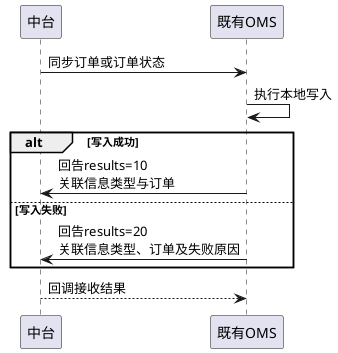
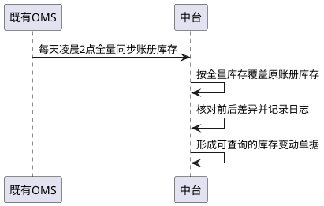

# 第073篇

> 本篇定位：开放接入与OMS同步；主要内容：客户下单、订单查询、面单与路由查询、OMS订单及状态同步、账册库存交接；文档角色：模块档；文档ID：14B128CCE3

## 1. 接入边界与标识

本篇定义客户系统、接口中台和既有OMS之间的数据交接。平台专属接单条件分别见抖音、有赞、洋葱NGC和威海对接篇；不能将某个平台的字段值或状态码直接作为其他接口的通用值。

统一接入架构见[共用能力与统一接入](../PRD.高捷物流系统.第01册.需求框架/PRD.高捷物流系统.第012篇.系统架构与非功能需求.B41CD8B36C.md#doc-B41CD8B36C-shared-capabilities)，接口身份、数据和回执仍按本篇具体契约解释。

客户订单号、平台店铺ID、中台店铺ID、OMS店铺ID、高捷内部订单号分别保留。客户下单使用客户订单号与店铺识别订单；中台向既有OMS同步时，`store_id`传OMS自编店铺ID，不传中台`shop_id`。只接收单号而未接收店铺的查询、修改与回调，跨店铺同号的消歧规则见INT-DOC-01。

| 接入方式 | 身份与数据约定 | 适用范围 |
| --- | --- | --- |
| 客户开放接口 | `appId`、`appSecret`识别调用客户；订单内容按JSON编码后再做Base64编码；UTF-8、POST | 下单、取消、运单号及路由查询、订单批量查询 |
| 中台与OMS同步 | 订单内容按JSON及Base64编码；同步身份与订单所属客户、店铺保持关联 | 订单、状态、操作方和账册库存同步 |
| 既有OMS调用中台的兼容入口 | `seller_name`、`api_key`、`mark`、`confirm`、`order`；其中`confirm`按契约传输但中台不处理 | 单笔订单查询、运单号查询、提单号推送等既有契约 |

Base64是编码，不是加密或鉴权。传输成功、接收成功、订单写入成功、仓库履约成功和海关放行是不同结果，按对应回执分别记录。下单返回`flag=OK`且说明“订单已存在，不能重复导入”时，表示已有订单，不能计为新建成功；`flag=ERR`保留失败说明。

## 2. 客户下单与资料修改

### 2.1 订单资料及条件校验

下单一次接收一张订单及其商品明细。资料按下表组合传入；字段的内部存储类型不构成页面约束。

| 资料组 | 交接内容 | 条件与处理 |
| --- | --- | --- |
| 来源与模式 | 来源系统、客户订单号、店铺ID、下单时间、备注；订单类型`order_type`：10 BC、20 BBC、30 CC；业务模式`business_model`：10集货、20备货、30未区分 | 与已维护客户、店铺及商品关系匹配；无法识别业务模式的订单按订单池规则处理 |
| CC快件分类 | `express_type`：10文件、20个人物品、30样品、40货物 | 不与海关A/B/C/D分类或OMS的`cc_order_type`直接互换 |
| 收发件与订购人 | 姓名、电话、国别、省市区、详细地址、邮编；订购人姓名、证件号码与电话 | CC订购人与收件人一致；身份及地址校验按订单业务规则处理 |
| 平台与申报主体 | 电商平台及企业备案代码、名称、物流企业备案代码与名称、担保企业、支付企业及流水、关区 | BC/BBC传平台备案代码和名称；客户自行申报时须传总运单号、物流企业代码与名称 |
| 运输与快递 | 总运单号、快递公司代码、快递单号、分拣及集包信息 | 已带快递单号时沿用，不再次取号；须同时提供快递附加信息。快递公司名称与代码的字段对应见INT-DOC-01 |
| 订单金额 | 商品总额、运费、保价费、预收税款、非现金抵扣、实际支付金额、币种 | 无保价费、运费或税金时填0；BC传非现金抵扣和账号信息；人民币使用142 |
| 仓储及重量 | 仓库代码、总毛重、总净重 | 备货传仓库代码；BC集货及CC传总毛重、总净重，单位千克 |
| 商品明细 | 商品序号、条码、平台货号、品名、规格、数量、单位、单价、重量、原产国 | 商品序号必传，缺失退单；没有平台货号时可用商品条码；重量单位千克 |
| 备案与计量 | 备案商品ID、HS编码、法定第一及第二数量和单位；CC行邮税号、销售计量数量与单位 | BBC及BC备货传备案商品ID；BC无HS编码退单，无第二计量单位时第二数量填0；按实际业务保留CC行邮信息 |
| 商品扩展 | ERP货号、支付及网站信息、佣金、品质、赠品、生产及失效日期、批次 | 品质1良品、2不良品；赠品0否、1是；不能用缺省值覆盖已收到的实际资料 |

客户订单的收货、下发、取消和风控资格分别见[客户门户订单](../PRD.高捷物流系统.第02册.订单管理/PRD.高捷物流系统.第015篇.客户门户订单管理.C90EB28313.md#doc-C90EB28313-scope)与[BBC客户订单](../PRD.高捷物流系统.第02册.订单管理/PRD.高捷物流系统.第016篇.BBC客户订单管理.40DBFB6718.md#doc-40DBFB6718-scope)。接口接收到有效数据不等于已获准发货，也不免除商品备案、账册及逻辑仓库存校验。

开放订单类型为10 BC进口、20 BBC进口、30 CC进口；业务模式为10集货、20备货、30未区分；CC快件类型另用10文件、20个人物品、30货物样品、40货物，不与OMS的A/B/C分类直接互换。

外部平台主动下单中的洋葱专属入口使用平台标识OMALL001，与[洋葱NGC主动抓单](PRD.高捷物流系统.第076篇.洋葱NGC平台对接.54FCFCAD4C.md#doc-54FCFCAD4C-scope)为不同接入方式。该入口要求订购人账户、电商企业备案代码名称及担保企业；CC城市、地址同时提供中英文。BBC商品HS编码为空时取备案资料，备案ID承接与既有OMS一致的映射。

该入口对BBC/BC备货另校验备案汇总重量：净重按各商品备案净重×数量求和，与客户值核对，客户净重保留5位小数，不一致拒接；毛重说明要求客户值不小于备案汇总值，但拒接公式写成汇总值小于客户值，方向相反，见INT-DOC-01。高捷担保的占位代码、物流企业为空时默认高捷的适用范围、两种接入方式重叠时的防重，也在该项确认，不扩展为全部开放客户的默认规则。

### 2.2 取消与修改

客户取消按下单返回的订单编号提交，并提供取消备注。外部订单修改一次处理一张订单，以`order_sn`、`shop_id`定位，仅接收订购人姓名、身份证号码和电话的修改。已申报、已出库订单的可修改资格及重报要求未明确，见INT-DOC-01，不能将该接口解释为可任意覆盖订单。

## 3. 订单、面单与路由查询

### 3.1 订单查询结果

开放批量查询接收下单返回的订单号数组，`vague=1`为精确查询；`vague=2`的模糊查询仅在另行确认启用后提供。既有OMS以`mark=sel`查询一张订单。批量条数、部分失败、未找到订单与跨客户查询边界见INT-DOC-01。

返回订单号、预估税金、商家预收税金、快递公司及单号、订单状态及说明、商品条码/品名/单价/数量/HS编码/预估增值税/消费税；CC另含行邮税与行邮税号。仓库状态仅对备货返回，集货不返回；既有OMS查询中的身份证校验结果及说明不传值。

| 原始订单或清单状态 | 对外状态说明 |
| --- | --- |
| 7 | 订单已取消 |
| 10 | 订单待报关 |
| 6 | 订单未确认 |
| 800 | 清单通过 |
| 400 | 已接受申报待货物运抵 |
| 100、700、负数、500、300、600、501、502、503、599 | 清单不通过 |
| 其余状态 | 报关审核中 |

此表是开放查询展示映射，不改变海关原始状态。既有OMS文档另以11/12表示清单通过/不通过，与800等原码并存，兼容入口最终输出码见INT-DOC-02。

既有OMS的仓库查询码为3未下发、33已下发、39仓库撤销、66仓库完成、77身份证重复、88库存不足；它与状态同步接口的`is_wms_library`是不同码表。

### 3.2 快递单号及面单附加资料

客户按订单号查询快递单号、公司、目的地、面单附加资料；有拼多多面单密文时同时返回`pdd_print_data`，不得按示例长度截断。既有OMS使用`mark=ex_code`，返回`orderSn/expressNo/expressCode/destinationCode/nodeCode`。

| 承运商 | 需要保留的面单附加内容 |
| --- | --- |
| 百世汇通 | 集散中心、揽收网点名称和代码 |
| 中通 | 开放接口的集包地；OMS兼容接口的集包地、大头笔、单号所属网点代码及名称 |
| 京东 | 站点ID/名称、分拣中心、始发道口、始发与目的笼车、路区、滑道、时效 |
| 顺丰 | 时效代码/名称、AB标签、XB图标、codingMapping及codingMappingOut、出港中转场 |
| 邮政 | OMS兼容接口的四段码、集包地代码/名称、大头笔代码/名称 |

既有OMS的快递公司代码为1顺丰、2申通、3百世、4邮政小包、5圆通、7全峰、8天天、11德邦、23韵达、50京东。其他承运商的缺项映射需确认，不能套用有赞或平台自身编码。

### 3.3 路由查询

查询返回订单号、总运单号、快递单号及公司、签收标志和全部已生成轨迹；签收标志0未签收、1已签收。每条轨迹保留地点、发生时间、节点代码和描述。

| 轨迹来源 | 代码 | 时间与地点 |
| --- | --- | --- |
| 仓库入库、出库 | W1、W2 | 仓储服务单实际入出库时间、对应仓库名称 |
| 干线出发、到达 | A1、A2 | 客服维护的干线时间；对应国家、港口城市 |
| 清关开始、结束 | C1、C2 | 客服维护的清关时间；关区对应城市 |
| 快递派送 | E | 快递公司返回的实际时间、地点和描述 |

源契约另规定苏宁专属A3轨迹：按客户ID识别，在实际干线出发前按日生成“仓库分拣、分拣完成、打包完成等待出库、等待安排航班”四条展示信息，录入干线开始时间后停止生成。其随机时间、启用条件与真实轨迹的区分方式见INT-DOC-03；不能将该展示时间回写为实际作业时间。公共平台轨迹及节点时间维护见[客户平台轨迹](PRD.高捷物流系统.第072篇.客户接口与数据交接.58EB46CA94.md#doc-58EB46CA94-marketplace-route-traces)。

## 4. OMS订单及状态交接

### 4.1 订单同步与写入结果

中台向既有OMS同步订单；既有OMS成功接单后，可按双方约定的客户范围自动推送BC/CC或BBC订单，也支持人工发起同步。一次接收一张订单及全部商品明细。各方向保留订单类型、店铺映射、客户订单号、总运单号、收发件与订购人、金额、商品、快递和申报资料。OMS兼容入口存在以下专属转换，不直接套用客户开放下单的必填规则。

| 交接内容 | OMS→中台的转换规则 |
| --- | --- |
| 订单类型与模式 | BC/CC入口以`is_bc=1`识别BC，0或空识别CC；CC默认B类。BC/CC默认集货，BBC默认备货；指定BC备货客户的判定清单见INT-DOC-02 |
| 店铺与支付标识 | OMS店铺ID先映射平台店铺ID并确认客户；OMS支付流水号映射中台支付号，OMS支付号映射中台平台单号 |
| BC/CC商品金额 | 商品总额不含运税，须等于各商品单价×数量之和，不等则拒接；保价费、抵扣必传，无金额填0 |
| BBC商品金额与币种 | 未传商品总额时按商品明细计算；已传总额不执行上述BC/CC金额校验。保价、抵扣、运费、税费为空默认0；各商品传入币种不一致则拒接 |
| BBC商品与地址 | 商品条码、备案商品ID、数量、单价必传；商品序号未传则自编。发件城市从发件地址取得；地址无法唯一解析的处理见INT-DOC-02 |
| BBC企业备案 | 电商企业备案代码、名称为空时，分别取电商平台备案代码、名称 |
| 担保企业 | 未传时取店铺配置；已传且店铺配置为高捷担保时仍取店铺，否则取客户传值 |
| 快递代码 | OMS的20中通→EX001、4邮政→EX002、50京东→EX003、1顺丰→EX004、5圆通→EX005；与查询接口的代码集合分别维护 |

兼容下单的`order`编码次数在参数表和说明中不一致，见INT-DOC-01，不能按其他查询接口推断。

既有OMS接收订单或状态并完成本地写入后，须向中台回告结果：`information_type=10`订单同步、20订单状态同步；`results=10`写入成功、20写入失败；同时返回订单类型、客户订单号及失败原因。结果回调本身的“接收成功”不替代所报告的写入结果。回调缺少店铺维度的消歧、重复通知和超时处理见INT-DOC-01。

**中台向OMS同步及写入结果回告**

本图只展开中台向OMS发送后的结果回告；OMS主动向中台推送为另一方向。回调接收成功不替代本地写入结果，信息类型、店铺消歧与重复或超时边界采用本节定义。

### 4.2 操作方切换及状态同步

中台将可操作方改为OMS时，锁定中台订单、解锁OMS订单；相应取消/恢复交接以`type=2`取消拦截指令传递，保留总运单、快递、关区和面单资料。该指令名称不表示已经取消业务订单；两端部分成功的补偿规则见INT-DOC-02。

| 同步方向 | 触发事件 | 保留的业务结果 |
| --- | --- | --- |
| 中台→既有OMS | 可操作方为OMS的订单在门户删除、取消或恢复，或由客服取消/恢复；清单放行、人工查验、挂起 | 客户取消标志、订单/运单/清单状态、仓库状态、关区及单证号码、税金、申报或放行时间、回执明细 |
| 既有OMS→中台 | 客户经接口取消订单；清单放行、人工查验、挂起 | 对应订单与申报结果；已有快递单号时同步面单附加资料，不再次取号 |

每张订单可有多条海关回执，保留回执类型、返回时间、原始状态码、说明及GUID。CC另保留快件分类、进出口标志、海外发件公司、货主、舱单及快件状态；源接口未提供CC的订单回执数组，不能虚构一条BBC/BC式回执补齐。

| 状态语义 | 中台与既有OMS映射 |
| --- | --- |
| 正常、客户取消 | 中台`customer_cancel_order=20/10`分别对应OMS`order_state=0/7` |
| 运单待报关、已暂存 | 中台0→OMS10；中台1→OMS11 |
| 清单待报关 | 源表规定中台0→OMS10，同时保留“中台是否为10”的疑问，见INT-DOC-02 |
| 运单、清单其他状态 | 已明确的一致状态保留原码，负数保留实际负值；600挂起在OMS的承接未明确 |
| 仓库同步码 | `is_wms_library`原码保留：0未出库、1已传WMS、11正式出库、21取消、75出库回传、77库存不足、82已推前海WMS、98洋葱出库查询队列；不套用第3章查询码 |

### 4.3 提单号及报关回执查询

OMS以`mark=pfreight`提交客户订单号和提单号。仅`state=101`表示推送成功；001/002未找到订单、003推送失败、004已有提单号、301提单号为空、302订单号为空、303订单号格式不正确均保留独立结果，即使外层`flag=OK`也不能视为提单更新成功。

报关回执查询一次接收一个客户订单号，`mark=sel_customs_res_info`；返回订单号、回执集合、查询结果和错误说明。每条回执包含原始海关状态`res_state`、内容`res_info`与10位秒级时间戳`res_time`，`flag=OK/ERR`仅表示查询成功/失败。返回字段`ordre_sn`的拼写见INT-DOC-01。源契约中标注“暂不做”的OMS订单确认/取消入口、OMS批量查询入口，目标范围见INT-DOC-02。

## 5. 账册库存同步

既有OMS每天凌晨2点全量同步账册库存，中台据此覆盖原账册库存，核对前后差异、记录日志，并形成可供业务查询的库存变动单据。交接包含海关账册编号`customsCode`、商品料号`goodsRecord`、备案序号`skuId`、商品ID`customsGoodsId`和可用库存`availableStock`；商品料号保存，不额外推导业务动作。

**账册库存同步的确定路径**

本图仅表达完整全量数据的处理路径，不规定部分接收、空批次或缺失行的处置。

全量快照的缺失行、空批次、部分接收、重复同步、时区和过程中库存变动的处理见INT-DOC-02。收到一批数据不能直接证明它是完整账册，也不能据“覆盖”自行清零未收到的账册记录。

本篇未决契约集中见[对接资料问题清单][integration-issues]。

[integration-issues]: ../../analysis/PRD自洽性问题.md#integration-source-review
