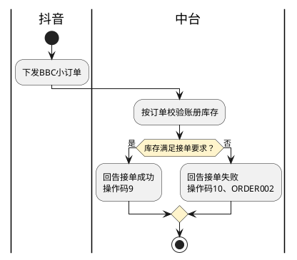

# 第074篇

> 本篇定位：抖音平台对接；主要内容：抖音订单与仓储指令、接单与履约回告、理货清关及干线交接；文档角色：模块档；文档ID：1EFBBFBED7

## 1. 对接范围与责任标识

抖音向中台下发小订单、入库预约、提货及取消指令，中台向抖音回传接单、仓储、清关和干线结果。威海执行的订单交接见[威海履约对接](PRD.高捷物流系统.第077篇.威海履约对接.D2AFF97716.md#doc-D2AFF97716-scope)。

订单的清关类型`customes_clear_type`为1保税进口BBC、2直购进口BC、3个人物品CC；仓模式`wh_type`为0存量、1保税备货、2海外集货、3海外备货。两组值独立识别，不互相替代。

扩展资料中的订单、运单、清单申报责任分别由`orderDeclare/logisticsDeclare/inventoryDeclare`表示，F为服务商、T为平台。包材服务`VASPack`、4PL、仓配分拆`tms_seperate`和自有仓`self_wms`分别保留，不以一个标志推断全部履约责任。

### 1.1 指令目录

指令由`crossborder/msg/push`接收；接收响应与后续业务结果分开。

| 业务指令 | 消息标识 | 交接内容 |
| --- | --- | --- |
| 小订单下发 | orderPush | 订单、收件订购资料、商品与金额、仓配及申报责任 |
| 入库预约 | inbound_bill_push | 预约单、仓店、货品、计划时间与附件 |
| 提货 | landing_bill_push | 提货单、原因、仓店、商品批次和计划时间 |
| 订单拦截 | order_interception_push | 被拦截订单及请求 |
| 获取物流信息 | take_logistics_info_push | 订单对应的物流信息获取请求 |
| 订单资料与拦截结果通知 | order_info_notify、order_interception_notify | 原订单资料补充与拦截通知 |
| 理货报告审核 | tally_order_review | 理货报告、审核结果res和意见remark |
| 取消入库、取消出库 | reverse_inbound_order、reverse_outbound_order | 对应入出库单的取消请求 |

提货消息名在正文与图中存在`landing/lading`差异，旧资料也将正向入出库消息写成取消；理货审核的数值码及通过时是否必须填写意见未统一，见INT-DOC-04。不得用消息接收成功代替取消或审核成功。

## 2. 订单及仓储资料

### 2.1 小订单

| 资料组 | 交接内容与约束 |
| --- | --- |
| 订单识别 | 平台订单号、店铺ID、创建时间、清关类型、仓模式、资源归属；创建时间的秒/毫秒冲突见INT-DOC-04 |
| 金额 | 商品总额、运杂费、税款、抵扣、实付均为分；实付=商品总额+运杂费+税款−抵扣；人民币币制142 |
| 收件与订购 | 收件姓名、电话、省市区、详细地址，订购人姓名、身份证号、平台注册号；CC另保留行邮与个人物品申报资料 |
| 发货与面单 | 预售标志、预计发货时间（秒）、快递公司及单号、分拣与集包、大头笔、包裹数；源契约包裹数固定1 |
| 重量 | 包裹重量单位千克，最多5位小数；不得按包材回告的克直接写入 |
| 商品识别 | 商品序号gnum、SKU、item_id、item_no、名称、描述、规格、条码；平台货品ID与备案ID分别保留 |
| 商品计量 | 数量、单位、原产国、法定第一/第二数量及单位；单价、总价为分。BC/BBC商品价格不含税，CC使用实付价格 |
| CC扩展 | 行邮税号、英文名称、OTC标志、注册号等与实际申报对应的资料 |

商品备案资料通过导入、审核和导出交接，以货品ID与备案ID识别，订单按备案ID匹配；资料未定义独立商品备案API。

### 2.2 入库预约与提货

| 单据 | 必需资料 | 条件资料 |
| --- | --- | --- |
| 入库预约 | 预约ID、仓库、店铺、来源、发货地、空海陆运输方式、预计发货与到货日期、联系人及邮箱、商品数量与备案信息 | 来源为区间或区内调拨时提供转出关区、账册；随单提供装箱单、发票、提单、一线报关单、效期表等对应附件 |
| 提货单 | 提货ID、仓店、原因、计划日期、商品、数量、良次品、批次与效期 | 原因包括销毁、退供、转仓及其他；转仓保留转入关区、账册 |
| 理货报告 | 来源单、理货单、报关单号、实际作业时间、商品、原产国、应收实收与良次品量、差异说明 | 商品尺寸毫米、重量克，另含体积、批次、生产及失效日期；理货完成回告附报告及附件 |

## 3. 小订单接单与履约回告

小订单操作通过`crossBorder/orderOperate`回告，按订单关联实际发生时间，时间戳单位为秒。

| 操作码 | 业务结果 | 必要交接 |
| --- | --- | --- |
| 9、10 | 接单成功、接单失败 | 集货成功须取得国内快递公司、单号及对应地址；流程图另要求面单PDF地址。失败须有error_info |
| 1 | 入库 | 实际入库时间 |
| 6、7 | 开始拣货、拣货完成 | 对应实际作业时间 |
| 2 | 打包完成 | 打包时间及适用的包材信息 |
| 3、4 | 发货成功、发货失败 | 快递资料及实际发货结果；失败须有error_info |
| 11、12 | 拦截成功、拦截失败 | 真实拦截结果与失败说明 |

4PL或仓配分拆订单沿用抖音下发的快递公司和单号。回告包材时保留包材代码、名称、数量、重量（克）及耗材批次明细；包材整组可选与组内字段必填的适用条件见INT-DOC-04。

| 接单失败码 | 原因 |
| --- | --- |
| ORDER001 | 订单字段错误 |
| ORDER002 | 库存不足 |
| ORDER003 | SKU问题 |
| ORDER004 | 疫情原因不可达 |
| ORDER005 | 其他原因 |

BBC接单校验账册库存，满足时成功，不满足时失败。BC备货流程要求未取得快递号先回接单失败，取得后再回成功；集货后续状态依赖商家后台发货动作。失败后能否转成功、商家发货通知的接入方式及等待期间状态见INT-DOC-05，不能将图中的线下通知写成已具备自动通知接口。

**BBC接单的账册库存判断**

本图仅展开BBC接单的库存分支，不替代订单字段等其他校验。接单成功不代表仓库已出库或海关已放行；BC备货取号后由失败转成功的路径仍见INT-DOC-05，不与本图合并。

### 3.1 拦截与取消

BC备货小单在打包前可拦截，打包后回失败；BC备货入库单取消以尚未上架为界，ToB出库单取消以尚未拣货为界。BBC仓图直接回拦截成功，但未给实际仓库确认条件；与库存、申报和实物作业的联动资格见INT-DOC-05。

## 4. 大单入出库回告

通过`warehouseInOutboundEvent`关联来源大单，不把小订单操作码套用于大单。

| 方向 | 节点与操作码 | 节点资料 |
| --- | --- | --- |
| 入库 | 200接单、210接单异常；300到仓、310到仓异常；400开始理货、410理货异常；420理货完成；500上架、510上架异常；600取消 | 420附理货报告及附件；500附良次品上架数量及效期 |
| 出库 | 1200接单、1210接单异常；1250开始理货、1260理货异常；1270理货完成；1300提货完成、1310提货异常；1400取消 | 1300附实际出库商品及良次品数量 |

异常节点保留原因；入库取消、出库取消与原单对应，收到取消请求不直接生成取消完成节点。

## 5. 清关结果

清关通过`orderCustomClearance`回告：1开始清关、2清关成功、3需平台介入的清关异常。BBC接单成功后约30秒回开始的规则与真实申报触发的关系见INT-DOC-05。

800放行对应成功；400、300、500、负状态以及501/502/503/599/700按来源映射为异常。899结关不再次当作800放行。100、600在主映射与异常原因表中的覆盖不一致，见INT-DOC-04。

| 异常码 | 原因 | 异常码 | 原因 |
| --- | --- | --- | --- |
| CLEARANCE001 | 订购人姓名不一致 | CLEARANCE014 | 海关查验 |
| CLEARANCE002 | 超过年度额度 | CLEARANCE015 | 风控退单 |
| CLEARANCE003 | 支付金额不一致 | CLEARANCE016 | 退运 |
| CLEARANCE004 | 支付单不存在 | CLEARANCE017 | 原产地问题 |
| CLEARANCE005 | 运单不存在 | CLEARANCE018 | 货款与表体合计不一致 |
| CLEARANCE006 | 订单不存在 | CLEARANCE019 | 人工退单 |
| CLEARANCE007 | 商品项重量大于清单重量 | CLEARANCE020 | 挂起 |
| CLEARANCE008 | 自报自缴计税异常 | CLEARANCE021 | 短时间重复申报 |
| CLEARANCE009 | 商品不在正面清单 | CLEARANCE022 | 等待运抵 |
| CLEARANCE010 | 物流企业代码问题 | CLEARANCE023 | 撤单退回 |
| CLEARANCE011 | 保函额度不足 | CLEARANCE024 | 身份证错误 |
| CLEARANCE012 | 数量或法定计量不一致 | CLEARANCE025 | 海关系统故障 |
| CLEARANCE013 | 人工审核 | CLEARANCE026 | 其他 |

上述码描述异常原因，不取代海关原始回执；每次回告关联订单、实际事件时间与回执依据。

## 6. 干线与身份资料

干线节点为1提货、2发运、3到港，交接实际时间、起运地和目的地；发运时须提供运输方式。BC保留提单号和航班，CC/UPU保留国际运单号；一单到底时国际、国内单号相同。图中的“提货时间=发运时间前20分钟”不能代替实际时间，其适用关系见INT-DOC-05。

身份资料查询按供应商及订单提交，返回店铺、订购人、平台注册号及身份证正反面地址；`err_no=0`成功，大于0失败。接口标识`getldentification`的字母拼写需核对，见INT-DOC-04；身份资料不作为普通操作日志展示内容。

本篇未决契约集中见[对接资料问题清单](../../analysis/PRD自洽性问题.md#integration-source-review)。
