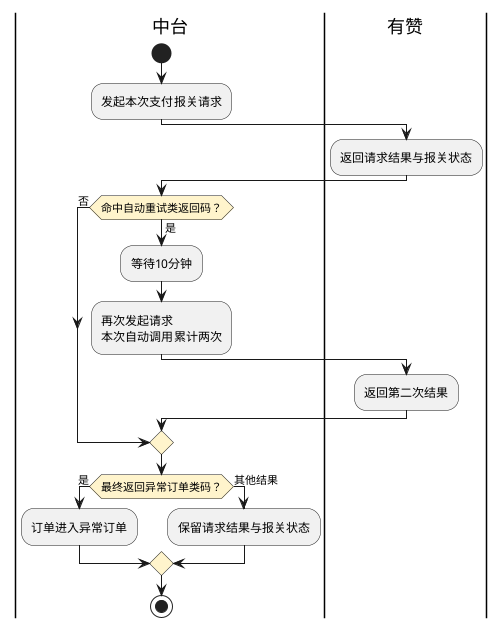

# 第075篇

> 本篇定位：有赞平台对接；主要内容：有赞订单抓取、解密与接单、支付报关、发货回告、店铺授权及包材卡片交接；文档角色：模块档；文档ID：283D7A61F7

## 1. 订单抓取与识别

每10分钟抓取近3个月的有赞订单，范围为正常订单`NORMAL`、待商家发货`WAIT_SELLER_SEND_GOODS`。查询开始、结束时间成对提供，单次跨度不超过3个月；每页默认20条、最多100条，页号1～100，超过范围按时间窗口分段取得。

以`node_kdt_id`匹配平台店铺ID，按店铺配置识别订单模式：10 BBC、20 BC、30 CC；BC再区分集货与备货。平台交易号`tid`、海淘子订单号`sub_order_no`、明细订单ID和中台订单号各自保留，不能互换。

| 检查对象 | 接单条件与处理 |
| --- | --- |
| BBC海淘子单 | 子单号为空拒单；已有子单但商品外部编码outer_item_id为空拒单；同一交易的多个子单号不一致则按拆单拒接，一致才继续 |
| BC拆单 | 正文按tid与sub_order_no不相等识别拆单，图示却沿用BBC多子单规则；唯一判定见INT-DOC-06 |
| 姓名、证件与地址 | 姓名含特殊字符或“先生/女士”、身份证真实性或地址校验失败时进入异常订单 |
| BBC库存 | 账册库存、逻辑仓库存须满足接单要求，不足时进入异常订单 |
| 商品匹配 | 平台商品外部编码先经商品平台对照取得中台商品ID，再取得备案商品资料；图中“有赞商品编码直接等于中台商品ID”的适用关系见INT-DOC-06 |
| 商品补全 | 从备案主数据取得品名、HS编码、条码、原产国、计量单位、毛净重及税率 |

### 1.1 密文资料

先调用密文判定接口`youzan.cloud.secret.verify.isencryptlist.1.0.0`，需要解密的数据调用批量解密`youzan.cloud.secret.decrypt.batch`。单批不超过10000项，不传空字符串；网关返回码200与业务`success`分别核对。

密文判定仅在传入内容全部为密文时返回true；混合明文、密文批次的逐项处理规则见INT-DOC-07，不能将false解释为每项都是明文。

## 2. 金额与订单资料映射

海淘标志`is_cross_border=1`表示是，0或空表示否；分销标志`is_purchase_order`表示是否分销。订单查询资料中的金额为元，支付报关接口金额为分，交接时须区分。

| 业务金额 | 分销订单来源 | 非分销订单来源 |
| --- | --- | --- |
| 实付 | fenxiao_payment | payment |
| 运费 | fenxiao_freight | freight |
| 税金 | fenxiao_tax_total | tax_total |
| 非现金抵扣 | fenxiao_discount | discount |
| 商品单价 | fenxiao_discount_price | price |

原映射把分销商品单价用作非现金抵扣，商品总额公式又可能重复计入运税；不能将上述独立字段混算，最终金额公式和元转分精度见INT-DOC-06。

订单保留平台交易号、子单号、店铺、收件与订购资料、支付流水、商品及上述金额。分销支付流水取`fx_inner_transaction_no`，非分销取`transaction`。

## 3. 支付报关

支付报关使用`youzan.pay.customs.declaration.reportpayment.report.1.0.1`。提交资料包括平台交易号tid、支付流水transaction、动作action_type=1、关区customs_code和店铺kdt_id；重推仍用动作1。拆单报关时，金额amount、海淘子单号sub_order_no和币种currency必传，币种为CNY，金额为分。

分销订单的fenxiao_payment非0时取该值，为0时汇总商品payment；非分销汇总商品payment。与第2章订单总额的关系、金额精度和适用拆单范围见INT-DOC-06。

| 返回状态customs_status | 业务含义 |
| --- | --- |
| 1 | 申报中 |
| 2 | 发送海关成功 |
| 3 | 发送海关失败 |
| 4 | 海关退单 |
| 5 | 海关入库 |
| 6 | 处理异常 |
| 7 | 推送中 |

支付报关的请求结果与海关业务状态分别保存。业务流程要求“接单10秒后发送状态1、再隔10秒发送状态2，各一次”，但契约只定义发起报关及返回状态，没有主动写入上述状态的参数；触发方式见INT-DOC-07，不按定时器推定海关成功。

返回112400000、112401000、112401001时，来源流程要求10分钟后再调用一次，总计两次；112401006、112401008、112401011、112401010、112401012、112401013进入异常订单。异常订单提供人工批量支付报关入口，不能将重推提交等同于状态已成功。

**支付报关请求与有限重试**

“自动重试类返回码”与“异常订单类码”分别对应上文两组返回码；第二次结果不再回到自动重试节点。异常订单的人工批量支付报关为独立入口，重推不表示海关成功；其他返回码的处置与定时状态发送缺口仍见INT-DOC-07。

## 4. 发货回告

发货使用`youzan.logistics.online.confirm`；物流发货时`is_no_express=0`或空，快递公司`out_stype`与单号`out_sid`必传。明细参数`oids`接收数字明细ID，可逗号分隔；来源业务映射却取海淘子单号，不能据字段名近似替换，见INT-DOC-06。

BBC在仓储已出库后回告。BC支持人工发货回告及每日轮询：本地抓单入库15天内、close_type=0、状态不等于WAIT_BUYER_CONFIRM_GOODS。该筛选未充分限定可发货状态，具体资格见INT-DOC-07。

| 中台代码/公司 | 有赞代码 | 中台代码/公司 | 有赞代码 |
| --- | --- | --- | --- |
| EX001 中通 | 3 | EX008 汇通 | 60 |
| EX002 邮政 | 8 | EX009 全峰 | 17 |
| EX003 京东 | 138 | EX010 申通 | 1 |
| EX004 顺丰 | 42 | EX011 天天 | 5 |
| EX005 圆通 | 2 | EX012 韵达 | 4 |
| EX006 德邦 | 28 | EX013 高捷 | 281 |
| EX007 EMS | 11 | — | 不适用 |

快递公司映射不与OMS数字码表共用。按年获取快递列表与接口文档“无需对接”表述不一致，是否启用自动更新见INT-DOC-07。

## 5. 店铺授权与卡片交接

OMS更新有赞授权后，按店铺一次推送一条token资料，中台以seller_id唯一匹配店铺，同时保留seller_name和access_token。授权与订单资料的误拷贝参数及失效处理见INT-DOC-07。

有赞订单按商品条码计算随单卡片；以下排除店铺不参与该规则：44395764、45818117、46113869、46112673、107988303、112317905、90445350、122087213、101366553、44685291。

| 卡片 | 命中商品条码 |
| --- | --- |
| A | 9311770610506、93567473、93569095、93569743、9311770608534 |
| B | 93555104 |

同时命中则传AB，随备货出库单交接WMS的userdefine6；抖音对同名扩展位有其他用途，按来源平台区分，不能覆盖合并。无命中及规则修改后的已有订单如何处理见INT-DOC-12。

## 6. 界面原型概述

### 6.1 店铺授权区

**界面原型概述 · 店铺授权区**

- **区域字段或业务元素**：店铺、平台、店铺ID、有赞token。
- **区域级通用规则**：除所列特例外，店铺基础资料沿用店铺管理约束。

| 字段或控件特例 | 界面特例或可见反馈 |
| --- | --- |
| 有赞token | 仅有赞平台店铺显示，可查看和编辑；可见角色与脱敏方式见INT-DOC-07 |

### 6.2 订单与备货详情区

**界面原型概述 · 订单与备货详情区**

- **区域字段或业务元素**：海淘订单标志、分销标志、随单卡片、平台交易号、海淘子单号。
- **区域级通用规则**：同步字段只读；BBC详情展示海淘、分销及卡片，BC详情展示海淘与分销，仓储备货出库详情展示随单卡片。

### 6.3 异常订单操作区

**界面原型概述 · 异常订单操作区**

- **区域字段或业务元素**：订单选择、支付报关、操作反馈。
- **区域级通用规则**：支持选中多张异常订单发起支付报关，结果区逐单显示反馈；业务结果见[支付报关](#doc-283D7A61F7-payment-customs)。

本篇未决契约集中见[对接资料问题清单](../../analysis/PRD自洽性问题.md#integration-source-review)。
