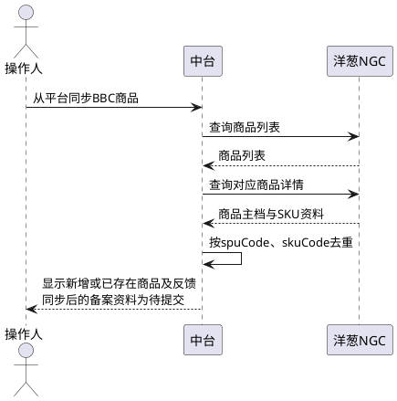

# 第076篇

> 本篇定位：洋葱NGC平台对接；主要内容：洋葱订单与商品同步、清关与发货回告、面单和包材交接；文档角色：模块档；文档ID：54FCFCAD4C

```plantuml
@startuml
!pragma teoz true
scale 1
'hide unlinked
'caption figure 1
'autoactivate on
autonumber 1 "<font color=blue><b>M# "
autonumber stop

'skinparam style strictuml

'skinparam ResponseMessageBelowArrow true
'skinparam MaxMessageSize 100
'skinparam MinClassWidth 100
'skinparam WrapWidth 50
skinparam SequenceGroupBodyBackgroundColor #Snow

'title "中台对接洋葱NGC平台"
participant "中台" as node1
participant "接口平台" as node2
participant "洋葱NGC平台" as node3
participant "富勒系统" as node4
participant "快递公司" as node5
participant "海关系统" as node6

|||
==基础工作==
node1 -> node1 : 准备基础数据
note right of node1 : 客户/店铺/账号
|||
node1 -> node3 : 更新数据字典\n至 BOP
activate node3 #DarkSalmon
note right of node1 : <API> 物流公司列表
return
|||
group 商品备案
    node1 -> node3 : 复制商品数据\n至 BOP、客户门户
    activate node3 #DarkSalmon
    note right of node1 : <API> 商品列表查询\n+ 商品详情查询
    return

    node1 -> node1 : 人工修补和审核备案信息
end

group 确保备案商品有充足的账册库存和实际库存

    node1 -> node1 : 进行 “备货入库” 流程\n* 报关(商品进关区)\n* 收货(可分批次)\n* 理货(可分批次)
    node1 -> node4 ++ #DarkSalmon : 下发入库单(按理货批次)

    node4 -> node4 : 仓内操作
    note right of node1: 更新实际库存
    return

    node1 -> node6 : 申报核注清单
    activate node6 #DarkSalmon
    note right of node1: 更新账册库存
    return
end
'===================================================
||30|
==接收订单==
loop 轮询 - 每30分钟1次
    autonumber resume
    node1 -> node3 : 获取订单列表
    autonumber stop
    activate node3 #DarkSalmon
    note right of node1 #Salmon: <API> 订单列表查询
    return
    ||10|
    node1 -> node1 : 缓存获取到的订单列表数据
    |||
    loop 遍历当中每张订单
        node1 -> node1 : 以RSA公钥解密所有加密字段
        ||10|
        group 订单是存量订单?[是]
            node1 -> node1 : 更新订单列表数据
        end
        ||10|
        note right of node1 : BBC暂订单不支持部分发货
        alt 订单状态 == 已审核\n<color red>AND </color>\n配送信息变更处理状态 != 待处理\n<color red>AND </color>\n无需发货状态 == 需要发货\n<color red>AND </color>\n发货状态 == 未发货\n<color red>AND </color>\n缺货状态 == <空值>\n<color red>AND </color>\n退款状态 == <空值>
            '------
            autonumber resume
            node1 -> node3 : 获取订单详情
            autonumber stop
            activate node3 #DarkSalmon
            note right of node1 #Salmon: <API> 订单详情查询
            return
            ||10|
            node1 -> node1 : 缓存订单详情数据
            ||10|
            group 订单是存量订单?[是]
                node1 -> node1 : 更新订单详情数据
            end
            ||15|
            group 订单详情不包含预售SKU?[是]
                node1 ->o node1 : 订单归入“正常订单”池
                ||10|
                group 订单未在下方队列?[是]
                    node1 ->o node1 : 订单加入“正常订单”事务队列
                end
            else 否
                group 订单是存量订单，且“客户取消”为否?[是]
                    node1 ->o node1 : 订单加入“取消订单”事务队列
                end
            end
        else 无需发货状态 == 全部无需发货 AND 无论其他订单状态如何
            group 订单是存量订单，且“客户取消”为否?[是]
                node1 ->o node1 : 订单加入“取消订单”事务队列
            end
        else 其他状态组合
            group 订单是存量订单，且“客户取消”为否?[是]
                node1 ->o node1 : 订单加入“取消订单”事务队列
            end
        end
    end
    node1 ->o node1 : 清除所有缓存订单数据
end
'===================================================
||30|
==处理“正常订单”==
||10|
group 订单某项SKU没有对应的备案商品\n<color red>OR </color>\n订单某项SKU的数量超过对应备案商品的账册库存和实际库存?[否]
    node1 ->o node1 : 订单归入“异常订单”池
end
||30|
hnote across: 快递单号
||10|
node1 -> node5 : 获取快递单号
activate node5 #DarkSalmon
note right of node1 : 只走"中通快递"
return
||15|
group 取号成功?[否]
    node1 ->o node1 : 重入"取快递单号"事务队列
else 是
    node1 ->o node1 : 前往 <font color=blue><b>M3
end
'===================================================
||30|
hnote across: 三单报关
||10|
activate node1 #DarkSalmon
autonumber resume
node1 -> node6 : 订单申报
autonumber stop
activate node6 #DarkSalmon
return 回执
||10|
node1 -> node6 : 运单申报
activate node6 #DarkSalmon
return 回执
||10|
node1 -> node6 : 清单申报
activate node6 #DarkSalmon
return 回执
deactivate node1
||15|
group 清单申报成功?[否]
    node1 ->x node1 : 订单归入“异常订单“池
else 是
    node1 -> node3 : 推送清关状态
    activate node3 #DarkSalmon
    note right of node1 #Salmon: <API> 清关状态更新
    return
    ||10|
    node1 ->o node1 : 前往 <font color=blue><b>M4
end
'===================================================
||30|
hnote across : 仓库发货
||10|
autonumber resume

node1 -> node4 : 下发仓库服务
autonumber stop
note right of node1 : “仓库状态” 变为 “已下发”
activate node4 #DarkSalmon
node4 -> node4 : 仓内操作
note right of node1 : “仓库状态” 变为 “待出库”，联动触发下一序列项
'activate node1 #DarkSalmon
node4 --> node1
deactivate node4
||10|
node1 -> node3 : 整单发货
activate node3 #DarkSalmon
note right of node1 #Salmon: <API> 整单发货
return
'deactivate node1
||10|
node1 -> node1 : 确认出库

'===================================================
||30|
hnote across : 商品出关区
||10|
node1 -> node6 : 核注单申报
activate node6 #DarkSalmon
return 回执
||10|
node1 -//? : 商品出关区
||10|
node1 ->X node1: 结束
'===================================================
|||
@enduml
```

## 1. 接入与订单识别

洋葱NGC授权token有效5小时，同时保留身份资料接口返回的publicKey。来源所称“RSA公钥解密”的具体约定见INT-DOC-08；不在PRD中保存实际密钥或账号。

通过`orderIndex`取得未发货订单`unshipped`，查询向前覆盖3个月，单次时间跨度不超过3个月。以店铺编号和客户订单号识别新旧订单；预售SKU订单进入异常订单池，非预售订单进入正常订单池。

平台订单号platformCode、平台订单ID id、订单编号erpCode分别保存，不用平台内部ID代替业务订单号。取得订单详情后关联收件、订购、商品、支付、金额、仓库及物流资料。

## 2. 商品和申报金额

订单金额按平台的分转换为元。商品原价、实际单价、数量、税率、实付和运费分别保留，不能在转换时丢弃原始金额的含税口径。

来源要求实付等于各SKU实付合计加运费，抵扣等于原价×数量合计减实付；同时，订单详情称价格不含税，申报转换却按含税拆税，并写有`originalPrice × count(1+税率)`的歧义公式。含税边界、抵扣是否扣除运费及正确拆税算法见INT-DOC-08；未确认前不能将乘税、除税两种算法合并为唯一规则。

## 3. 发货与清关回告

### 3.1 发货

BBC仓库状态到“待出库”时调用`wholeShipped`，交接平台订单号、物流公司简码及跟踪号。此处是平台发货回告触发点，不替代实际仓库出库时间，也不改写为“已出库”触发。

### 3.2 清关状态

通过`updateDeclareState`回告，保留关联订单、海关原始状态、说明及平台状态。明确映射如下。

| 海关状态 | 平台状态 | 含义 |
| --- | --- | --- |
| 500 | 7 | 海关检验 |
| 600 | 9 | 挂起 |
| 800 | 6 | 放行 |

负状态按回执说明关键词识别原因；图示“-0”的边界、多关键词优先级、其他正状态及备注长度冲突见INT-DOC-08。

| 平台异常状态 | 原因 | 平台异常状态 | 原因 |
| --- | --- | --- | --- |
| 1 | 订购人信息不符 | 8 | 商品破损 |
| 2 | 证件错误 | 10 | 支付单信息不全 |
| 3 | 证件超额 | 11 | 有单无货 |
| 4 | 微信校验问题 | 12 | 有货无单 |
| 5 | 挂起并核实证件 | 13 | 重量问题 |
| 14 | 其他 | — | 不适用 |

同一个平台状态可能来自明确状态映射或说明识别；回告结果与海关原始状态分别记录，不能把接口接收成功当作放行。

## 4. 商品同步

BBC商品备案支持“从平台同步”。先用`productPageList`查询，再以`productDetail`取得详情，按spuCode与skuCode去重；同步后的商品备案状态为待提交，仍须完成内部备案处理。

列表查询开始、结束日期跨度不超过24小时；pageNo默认1，pageSize默认20、最多100。skuCode在参数表与查询示例中的必填性不一致，见INT-DOC-08。商品主档、SKU、条码、规格及申报所需资料保持对应，不因同步直接认定备案已审核。

**平台商品同步与内部备案衔接**

同步取得资料后仍须按内部商品备案规则处理；“待提交”不表示已通过备案。查询范围、分页及skuCode必填性边界按本节执行，不据本图新增覆盖已存在商品的规则。

### 4.1 界面原型概述

**界面原型概述 · 平台商品同步区**

- **区域字段或业务元素**：商品、平台、店铺、同步日期范围、从平台同步、同步结果。
- **区域级通用规则**：查询及结果关联同一店铺；“从平台同步”仅BBC可用，结果展示新增或已存在商品及处理反馈，同步成功的备案资料展示为待提交。

## 5. 包材、面单与轨迹交接

仓库按洋葱包材标准执行：保留洋葱防伪码；空白包装箱加贴洋葱标识。外箱、清单、胶带及其他随单物料不得出现第三方店铺或平台信息，不夹带好评返现、私人微信等纸条。

| 输出对象 | 洋葱专属约束 |
| --- | --- |
| 面单发货人 | 使用OMALL或洋葱OMALL，不使用个人、“代发仓”或保税区仓库名称 |
| 面单发货地址、电话 | 可留空；展示电话时使用平台标准客服电话，不使用私人电话。来源标准号码为18122365302，维护归属及变更生效见INT-DOC-08 |
| 面单商品信息 | 不展示商品名称；海关或快递特殊要求时可展示商品条码 |
| 国内发货地址、首条轨迹 | 可以包含保税区或保税物流中心信息 |
| 国际发货地址 | 使用平台对外公布的地址 |
| 国际展示轨迹 | 需客服邮件确认后交EQ设置；展示轨迹与实际作业时间分别保留，不作为实际履约时间来源 |

本篇未决契约集中见[对接资料问题清单](../../analysis/PRD自洽性问题.md#integration-source-review)。
