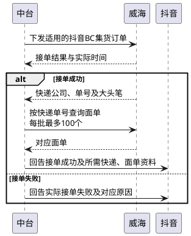
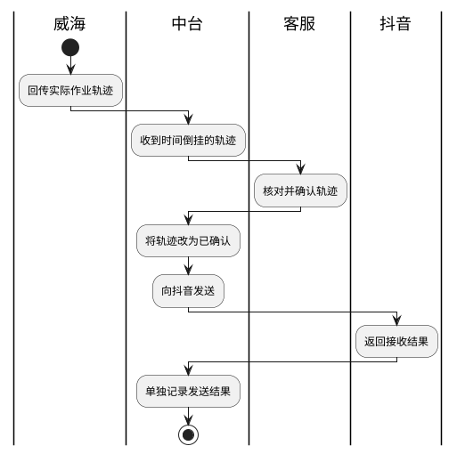

# 第077篇

> 本篇定位：威海履约对接；主要内容：威海订单下发、取号面单与取消、仓储清关干线回传、轨迹确认及库存查询；文档角色：模块档；文档ID：D2AFF97716

## 1. 对接范围

抖音BC订单同时满足签约威海店铺、对应威海关区时，下发威海履约。中台向威海传订单，接收接单、快递、仓储、清关及干线结果，再按平台契约回告；抖音侧契约见[抖音平台对接](PRD.高捷物流系统.第074篇.抖音平台对接.1EFBBFBED7.md#doc-1EFBBFBED7-scope)。

平台单号、商户外部单号、店铺、快递单号和提单号各自关联，不因取得快递号而覆盖订单身份。

## 2. 下单、取号与取消

### 2.1 订单下发

通过`addOrder`一次传递订单及商品。保留目的地、收发件与订购人、商户外部单号、平台与店铺、申报和快递资料。

| 资料组 | 条件与映射 |
| --- | --- |
| 申报类型 | 1 CC、2 BC、3集包、4保税、9其他；申报方1平台、2商户。不得套用抖音的清关类型值 |
| 打包模式 | 1备货、2集货 |
| 平台与店铺 | 平台订单按条件传平台单号、店铺ID，不能仅凭商户外单代替 |
| 身份 | CC收件人与订购人一致，保留姓名、电话、证件及地址 |
| 发件地区 | 海外国别必填；韩国邮编必填，省市区可免的约定与字段必填标记存在冲突，见INT-DOC-10 |
| 已有快递号 | 沿用原号并提供三段码；转关进口须提供快递号 |
| 金额 | 实付=商品金额+运杂费+税金−抵扣，无金额项填0 |
| 商品 | 商品序号、条码或货号、品名规格、数量、单价、重量、原产国、申报编码与法定计量等对应资料 |

### 2.2 接单与面单

威海通过`douyin_order_confirm`回告：0接单成功、1失败，并提供实际时间；海外集货成功必须有快递公司、单号及大头笔。

备货可在接单回告中返回快递号；集货须完成取号、取得面单后，才向抖音回接单成功。5小时未回快递号时调用`getExpress`补查，但来源对“五小时内/后”的触发点与查询频次未统一，见INT-DOC-09。

面单查询`Label`按expressNo数组提交，每批最多100个单号，返回对应面单。订单查询`douyin_order_query`按order_sn提交，保留原状态：2备货、3已发货、16申请退款、17同意退款、21退款等，不等同于中台仓库状态。

取消`cancelOrder`与重置`ResetOrder`按外部单号提交。允许取消/重置的业务状态、失败后的订单与单号处理见INT-DOC-09；接收到调用响应不能直接认定仓库已停止作业。

**海外集货接单成功的回告衔接**

成功分支以取得快递号和面单为回告条件，不把接单响应当作面单已就绪；两类资料是否在同一次回调提供不由箭头数量规定。五小时未回快递号的补查触发与查询频次，以及取面单失败的恢复仍见INT-DOC-09。

## 3. 仓储、清关与干线回传

| 回传类别 | 状态与时间 | 交接资料 |
| --- | --- | --- |
| 仓储douyin_order_operate | 备货6开始拣货、7拣货完成、2打包完成、3出库；集货1入库、3出库 | 订单、操作码、实际发生时间；出库带快递公司、单号、总毛重（千克） |
| 清关 | 1开始、2成功，记录对应实际时间 | 订单、关区代码与名称 |
| 干线 | 1提货、2发运、3到港 | 订单、实际时间、起运/目的国家、提单号 |

收到时间倒挂的轨迹，先交客服确认，再回抖音。事件发生时间、系统接收时间、客服确认时间和对外回传时间是不同时间，不能互相覆盖。

来源要求“确认后先改为已确认、再发送”。确认与发送结果分别记录：客服确认不等于平台接收成功；发送失败重试、重复确认、节点更正及时间倒挂的判定见INT-DOC-09。

失败原因应与实际失败结果对应；来源“默认服务不可达”与“疫情不可达”不一致，见INT-DOC-09，不能将所有失败归入疫情。

**时间倒挂轨迹的确认与发送**

本图仅覆盖时间倒挂且客服完成确认的路径；确认不等于发送成功。未确认、确认不通过及发送失败后的处理仍未定义，不补画为自动删除、重试或业务完成。

## 4. 轨迹导入、确认与删除

仓库、干线、清关开始、清关结束四类轨迹均支持导入、确认、导出；选中记录时导出所选，未选中时导出查询结果全部记录。仅未确认记录可删除。批量确认关联所选订单，保留逐项处理反馈。

| 导入模板 | 业务列 | 待核对边界 |
| --- | --- | --- |
| 仓库 | 订单号、操作码、发生时间、快递公司代码、快递号 | 模板要求各节点都有公司/单号，接口只在出库要求，见INT-DOC-10 |
| 干线 | 订单号、操作码1/2/3、发生时间、起运国、目的国、提单号 | 模板示例误用了快递公司与快递号，不作为干线字段定义 |
| 清关开始/结束 | 订单号、操作码1/2、发生时间、关区代码、关区名称 | 抖音与拼多多各有模板；拼多多APPLY/CCLSUCCESS与1/2之间的转换见INT-DOC-10 |

清关结束应关联结束事件；源说明写成更新清关开始时间，按INT-DOC-10保留冲突，不覆盖已有开始时间。

## 5. 批量库存查询

支持按多行SKU发起库存查询。输入SKU与返回库存逐项对应；仓库、货主、可用/实物/锁定库存口径、单批上限和查无结果处理尚未完整定义，见INT-DOC-10，不能把未返回SKU当作库存为零。

## 6. 界面原型概述

### 6.1 轨迹查询区

**界面原型概述 · 轨迹查询区**

- **区域字段或业务元素**：订单号、业务状态、确认状态、回传时间范围；干线页另含提单号。
- **区域级通用规则**：各页按自身节点筛选，时间范围按所标注的回传时间查询。

### 6.2 轨迹列表区

**界面原型概述 · 轨迹列表与操作区**

- **区域字段或业务元素**：订单号、业务状态、发生时间、接收时间、确认状态、确认时间、记录选择、批量确认、导入、导出、删除。
- **区域级通用规则**：业务资料只读，用户通过记录选择及操作区处理；不同轨迹类别展示如下特有字段。

| 字段或控件特例 | 界面特例或可见反馈 |
| --- | --- |
| 仓库轨迹 | 快递公司、快递号、重量；回传时间筛选对应列的缺项见INT-DOC-10 |
| 干线轨迹 | 起运国家、目的国家、提单号 |
| 清关开始、清关结束 | 关区代码、关区名称 |
| 操作区 | 批量确认、导入、导出、删除；删除资格见[轨迹处理](#doc-D2AFF97716-manual)，确认结果与发送结果分开反馈 |

### 6.3 库存查询区

**界面原型概述 · 库存查询区**

- **区域字段或业务元素**：SKU输入、提交、库存查询结果。
- **区域级通用规则**：SKU支持换行输入，结果保留与输入SKU的关联；具体库存列与异常反馈待INT-DOC-10明确。

本篇未决契约集中见[对接资料问题清单](../../analysis/PRD自洽性问题.md#integration-source-review)。
