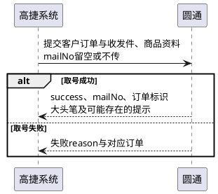

# 第078篇

> 本篇定位：仓配与航空数据交接；主要内容：WMS契约定位与快递扩展、圆通电子面单、D4和白云物流交接边界；文档角色：模块档；文档ID：4F4EDAAAA9

## 1. 交接范围与业务依据

本篇补充仓配和航空外部协作的契约定位、承运商资料及结果区分。业务动作的资格与完整回填规则在下列位置维护。

| 交接对象 | 完整业务定义 | 本篇关注点 |
| --- | --- | --- |
| 富勒WMS | [WMS业务交接与资料同步](../PRD.高捷物流系统.第04册.仓储管理/PRD.高捷物流系统.第033篇.仓库-仓库订单管理.A77FC65070.md#doc-A77FC65070-wms-business-handover) | 消息标识、承运商扩展、原始状态及交接结果 |
| D4航司系统 | [D4航司交接](../PRD.高捷物流系统.第02册.订单管理/PRD.高捷物流系统.第024篇.空运-提单与航司推送.ED54E43A14.md#doc-ED54E43A14-d4-airline-handover) | 运单号、订舱、交单、配载的交接目录 |
| 白云物流 | [白云物流节点回传](../PRD.高捷物流系统.第02册.订单管理/PRD.高捷物流系统.第026篇.空运-在途跟踪.8ADA3E9EFF.md#doc-8ADA3E9EFF-baiyun-feedback) | 查询与回执的消费边界 |
| 客户服务邮件 | [空运服务节点邮件](../PRD.高捷物流系统.第08册.运营支撑/PRD.高捷物流系统.第069篇.消息推送.5F950AB3B1.md#doc-5F950AB3B1-section-e48548e84cac) | 业务通知不作为外部作业成功回执 |

## 2. WMS契约与回传

### 2.1 交接定位

| 业务交接 | 契约标识 | 关联要求 |
| --- | --- | --- |
| 备货入库取消 | cancelASNData / ASNC | 关联原入库单下所有已确认理货批次；CustomerID优先使用店铺WMS货主，没有店铺时取客户WMS货主 |
| 出库下发 | putSOData / SO | 客户订单号与仓储出库单号分别保留，用于业务单与WMS单关联 |
| 货主资料 | putCustData / CUSTOMER | 客户或店铺WMS货主ID |
| 商品资料 | putSKUData / SKU | 商品条码与所属货主，区分不同仓库接收范围 |

WMS作业成功与中台接收回传分别记录。交接日志、下发与重新下发条件按[WMS业务交接](../PRD.高捷物流系统.第04册.仓储管理/PRD.高捷物流系统.第033篇.仓库-仓库订单管理.A77FC65070.md#doc-A77FC65070-wms-business-handover)执行；超时后的查询、恢复与防重仍待确认，不能据超时直接发起第二次实物作业。

### 2.2 面单扩展

京东面单除单号外，保留以下返回资料并交接WMS，不以一般快递字段替代。

| 资料类别 | 契约字段 |
| --- | --- |
| 揽收与站点 | collectionAddress、siteName、siteId、siteType |
| 分拣中心 | sourceSortCenterId、targetSortCenterId、sourceSortCenterName、targetSortCenterName |
| 道口与集包 | sourceCrossCode、distributeCode、sourceTabletrolleyCode、targetTabletrolleyCode、road、slideNo |
| 时效与面单标识 | aging、agingName、coverCode、qrcodeUrl |
| 隐私显示 | isHideContractNumbers、isHideName |

UserDefine6按来源平台独立映射：抖音的3PL/4PL类型按仓储篇条件传递；有赞的随单卡片按[有赞卡片规则](PRD.高捷物流系统.第075篇.有赞平台对接.283D7A61F7.md#doc-283D7A61F7-token-cards)传递。不可在同一订单中把两种含义拼成一个新枚举。

### 2.3 原始状态码

| WMS原码 | 原始含义 |
| --- | --- |
| 00、10、20 | 创建、部分预配、预配完成 |
| 30、40 | 部分分配、分配完成 |
| 50、60、61 | 部分拣货、拣货完成、播种 |
| 62、63 | 部分装箱、完全装箱 |
| 65、66 | 部分装车、装车完成 |
| 70、80 | 部分发运、发运完成 |
| 90、98、99 | 取消、待释放、订单完成 |

业务状态投影见[出库结果与托盘回传](../PRD.高捷物流系统.第04册.仓储管理/PRD.高捷物流系统.第033篇.仓库-仓库订单管理.A77FC65070.md#doc-A77FC65070-section-8c46489e9d76)。冻结与取消是不同结果：来源中99/90返回取消失败，00执行取消并冻结，其他状态冻结；冻结后是否已完成业务取消、已取消再请求的反馈及实际出库时间冲突，沿用既有WH-08、WH-11，并在INT-DOC-12补充接口边界。

## 3. 圆通电子面单

### 3.1 B模式取号

圆通B模式由承运商分配运单号。请求物流XML及客户身份，物流公司标识为YTO，customerId与clientID对应；验签约定为物流XML加partnerId后MD5、Base64，再URL编码。只保留签名契约，不保存真实客户凭据。

| 资料 | 业务约束 |
| --- | --- |
| 客户订单标识txLogisticID | 唯一，最多64字符，允许字母、数字及连字符；脚注另限定clientID加数字且末位数字，最终格式见INT-DOC-13 |
| 快递号mailNo | 取号请求留空或不传；带值会返回S05，不能用重发旧号替代取号 |
| 订单类型orderType | 0代收货款、1普通、2便携、3退货；来源另要求固定1，与代收规则的适用范围待确认 |
| 服务类型serviceType | 0自行联系、1上门、2次日、4次晨、8当日 |
| 收发件资料 | 姓名、省、市区、详细地址；手机和固话至少一项，市区按契约用英文逗号组合 |
| 商品 | 商品名、数量必填，数量为正整数，单价保留两位小数 |
| 代收金额agencyFund | 代收货款订单大于0，普通订单为0 |

### 3.2 返回与地址辅助查询

取号返回success、mailNo、txLogisticID、大头笔bigPen、提示noticeMessage、失败reason及对应订单详情；成功时的提示不等于取号失败。

| 查询或异常 | 结果及处理 |
| --- | --- |
| 目的转运中心yto.BaseData.TransferInfo | 按省市区返回中心代码、名称；未查到时提示校正地址 |
| 超区yto.BaseData.BeyondRegion | 按完整地址返回0不超区、1超区、3不派送乡镇 |
| S01、S05 | XML/字段或内容错误，反馈对应原因 |
| S02、S03、S04 | 签名、物流公司或通知类型错误 |
| S07、S08 | 系统或平台错误，不能视为订单已完成 |
| 超区、调用频率、无可用单号 | 保留独立失败原因，不改报为签名失败 |

资料目录列有取消订单，正文却没有取消契约。圆通取消、释放单号、重复取号和超时后查号规则见INT-DOC-13，不据目录推定具备这些能力。

**圆通B模式取号与结果区分**

成功响应中的noticeMessage仍是提示，不因此改判取号失败；各类失败按本节保留具体原因。目的转运中心与超区查询是独立辅助入口，本图不将其设为每次取号的前置步骤。

## 4. 航空与通知交接

D4交接包含运单号绑定、订舱提交与编辑、订舱终止作废、提单交单和配载回查。接口资料与业务门槛统一引用[D4航司交接](../PRD.高捷物流系统.第02册.订单管理/PRD.高捷物流系统.第024篇.空运-提单与航司推送.ED54E43A14.md#doc-ED54E43A14-d4-airline-handover)，不把翌飞或CCSP接口规则套用于D4；同步失败、重复和顺序问题沿用GJ-WORD-WH-37。

白云物流按提单查询闸口、收运、运抵放行、计划起飞与实际离港信息。已定义的运输卸货、安检、主提单货量及起飞轨迹消费见[白云回填规则](../PRD.高捷物流系统.第02册.订单管理/PRD.高捷物流系统.第026篇.空运-在途跟踪.8ADA3E9EFF.md#doc-8ADA3E9EFF-baiyun-polling)；运抵放行和计划起飞的消费目标、轮询参数以及时区等未决口径保持原问题记录。

温控等Handling Information向托书Also notify的输出由提单模板规则承接；节点邮件由消息篇定义接收人、触发和正文，不将客户收到邮件视作仓库、航司或海关接收确认。

人力资源资料中的钉钉同步仍存在“以后对接”与自动入口描述的冲突，沿用GJ-WORD-OPS-05；充值资料中的微信、银企直联仅为渠道举例，未形成可执行接口契约，不据此扩展支付接口范围。

本篇未决契约集中见[对接资料问题清单](../../analysis/PRD自洽性问题.md#integration-source-review)。
