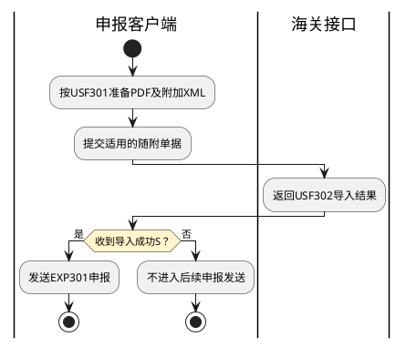

# 第079篇

> 本篇定位：海关与单一窗口对接；主要内容：跨境电商统一版、CC快件申报、南沙金二单一窗口、申报资料与回执交接；文档角色：模块档；文档ID：9BF906EA73

## 1. 对接范围与结果分层

本篇承接关务业务已定义场景的外部报文、条件字段及回执关联，不以外部规范列有某报文为依据新增一项关务业务。申报、改单、撤销及车辆进出区的业务资格仍在关务册维护。

| 业务场景 | 完整定义 |
| --- | --- |
| 普货单证审核与申报 | [普货关务作业](../PRD.高捷物流系统.第03册.关务管理/PRD.高捷物流系统.第028篇.普货关务作业.367A5605ED.md#doc-367A5605ED-scope) |
| BC出口 | [BC出口关务](../PRD.高捷物流系统.第03册.关务管理/PRD.高捷物流系统.第029篇.BC出口关务.B7D43C8769.md#doc-B7D43C8769-scope) |
| BC、CC进口 | [BC与CC进口关务](../PRD.高捷物流系统.第03册.关务管理/PRD.高捷物流系统.第030篇.BC与CC进口关务.034DD8F0D3.md#doc-034DD8F0D3-scope) |
| BBC保税业务 | [BBC进口关务](../PRD.高捷物流系统.第03册.关务管理/PRD.高捷物流系统.第031篇.BBC进口关务.2CA9B1E5A1.md#doc-2CA9B1E5A1-scope) |

接口发送、平台暂存、海关入库、审单、放行和结关分别表示不同结果。普货报关向单一窗口发送可仅形成暂存；发送中、发送成功、发送异常不等同于海关申报状态。无回执、发送超时或外层接收成功均不能单独证明海关放行。

## 2. 跨境电商统一版

### 2.1 业务报文与关联回执

| 方向 | 业务对象 | 发送/回执标识 |
| --- | --- | --- |
| 进口 | 订单、支付、运单 | CEB311/312、CEB411/412、CEB511/512 |
| 进口 | 运单状态 | CEB513/514 |
| 进口 | 申报清单、撤销、退货 | CEB621/622、CEB623/624、CEB625/626 |
| 进口 | 入库明细 | CEB711/712 |
| 进口 | 电子税单、税单状态 | CEB816、CEB818 |
| 出口 | 订单、收款、运单 | CEB303/304、CEB403/404、CEB505/506 |
| 出口 | 运抵、清单、撤销 | CEB507/508、CEB603/604、CEB605/606 |
| 出口 | 离境、总分单 | CEB509/510、CEB607/608 |
| 出口 | 汇总申请、汇总结果 | CEB701/702、CEB792 |
| 通用 | 格式回执 | CEB900 |

guid采用大写36位唯一标识；订单号在电商平台内唯一，运单号在同一物流企业内6个月不重复。商品序号及其订单、清单之间的对应关系保持一致。

新增、变更、删除由appType的1、2、3表示；撤销业务只用1，退货使用1/2。申报状态appStatus的1暂存、2申报分别处理，清单、撤销、退货实际申报须按契约签名。本地映射默认2与标准默认1的适用范围见INT-DOC-14，不将暂存入口自动改成申报。

### 2.2 资料组与条件

| 资料组 | 交接内容 | 条件 |
| --- | --- | --- |
| 申报身份 | 企业及平台备案代码、名称，申报企业、物流企业、支付企业、担保企业 | 各角色独立，企业注册码与社会信用代码不互换；适用规范版本见INT-DOC-14 |
| 订单与支付 | 平台订单号、订购资料、支付流水、支付时间、商品金额、运杂费、税金、非现金抵扣、实付、币种 | 实付=商品金额+运杂费+税金−抵扣；人民币142 |
| 收件与运输 | 收件姓名、电话、地址，运单、件数、毛净重、关区 | 收件资料与运单一致，毛净重单位千克 |
| 商品 | 序号、品名、规格、数量、单位、单价总价、原产国、HS编码、法定计量 | 清单品名与订单一致，商品对应关系不因重新组报丢失 |
| BC直购 | 监管方式9610，运输工具、航班、提运单 | 运输资料必传 |
| BBC保税 | 监管方式1210，海关账册、区内企业代码名称、备案料号 | 账册、区内企业和料号必传；当前区内企业字段缺口见INT-DOC-14 |
| BBC运输资料 | 运输工具、航班、提运单 | 标准允许免填，本地映射却赋值；按INT-DOC-14确认适用条件 |

外部报文中商品名称长度、企业代码及其他同名字段在来源规范之间不同，保留其契约差异，不把较长版本自动作为生效标准。

### 2.3 回执消费

订单回执按平台与订单号关联，运单回执按物流企业与运单号关联；清单保留GUID、预录入号和海关清单号。每条回执保存原始状态、发生时间、说明与单证关系，不仅覆盖一个最终展示状态。

800放行与899结关分别记录，格式回执不替代业务回执。税单内容、税单状态及业务篇的税金处理相互关联，收到税单不代表已缴税；异常、撤销或退货不自行反推原订单已取消。

## 3. CC快件申报

### 3.1 报文与申报内容

| 对象 | 报文标识 | 结果边界 |
| --- | --- | --- |
| 快件申报与回执 | EXP301、EXP302 | 一份申报报文对应一张报关单，包含完整表头和多条商品表体 |
| 修改同步 | EXP304 | 保留与原报关单的关系 |
| 汇总纳税、委托、税费 | EXP306、EXP307/308、EXP310 | 不与报关单审单结果混用 |
| 舱单及回执 | EXP311、EXP312 | 按总运单号、航班号关联 |
| 随附单据及导入回执 | USF301、USF302 | 附件导入结果独立于报关单申报结果 |

必填的申报企业、申报卡/报关员、进出口口岸、运输方式、航班、总分运单、收发件、金额币种与商品资料，应由对应业务资料提供；来源中标为“当前无”的字段不能填入示例值。报文要求保留空节点，不因界面未填就删除契约节点。

### 3.2 新增与查验后改单

| 操作 | 允许条件 | 报文内容 |
| --- | --- | --- |
| ADD新增或重新申报 | 首次；或D1中心入库失败、N新增/修改/改单失败、00退单、20退单重报、D删单、22查验后转A/C类、23查验后转个人物品、43企业申请退单、44放弃物品退单 | 表头和全部表体均为ADD，完整发送 |
| APD查验后改单 | 原报关单为24查验后改单；前次改单已结束，可重发情形包括D1、D3发往海关失败、N、R不允许改单 | 修改后表头和修改/新增后的全部商品表体均为APD；新增序号从原序号递增，不减少商品项数 |

一次改单完成前不得再次发起。海关入库回执Y/N与允许改单回执A/R分别处理；仅审单状态变化时才一定有新的审单回执，不能因没有新审单回执就认定改单失败。

| 可修改资料组 | 白名单内容 |
| --- | --- |
| 企业身份 | 收发货人编号、名称、社会信用代码、性质；货主地区、代码、名称、社会信用代码 |
| 费用与包装 | 合同号；运费/保费/杂费各自的标记、费率或金额、币制；件数、毛净重、包装种类、木质包装、旧物品及低温运输标志 |
| 收发件 | 收发件人中英文名称、国别、城市、地址及电话、证件类型和号码；英文经停城市 |
| 表头货值与名称 | 价值、币制、主要货物中英文名称 |
| 商品表体 | 商品编码、中英文名称、规格、产销国/城市、生产厂商、成交币制、申报单价总价、用途、申报数量单位、法定第一/第二数量单位、商品毛重 |

随附“单证”在改单中不允许修改，也不发送该部分；随附“单据”允许新增和修改。两者为不同契约对象，不能因名称相近合并。首次改单的前次回执条件、报文message_id唯一性与同批共用标识的冲突见INT-DOC-15。

### 3.3 舱单与附件

舱单首次用ADD，追加表体或修改表头用APD；保留总运单、分运单、航班、运输工具中英文名称、进出口标志、方式、口岸与港口、日期、件数重量、提单数和申报主体。毛重大于等于净重；主要品名取成交总价最大的商品，并列时取商品序号最小者。表体成交总价非负并与申报总价一致，币制与表头一致。A/B类收发货人企业代码和名称为空，C/D类必填。

EXP312按总运单号加航班号匹配，保留回执时间、标志和说明；表内NN成功/NY失败与样例DY不一致，见INT-DOC-15。

A/B类随附单据为PDF，每种类型一个文件、每文件不超过3MB、每页不超过200KB。客户端按USF301在PDF尾附4096字节XML，不足补空格；Server方式不支持USF。先收到USF302导入成功S，再发送EXP301；附件失败不能跳过后继续视为资料齐备。

附件类型包括总运单、分运单、价格资料、身份证复印件及海关要求的其他单据。文件名与申报主单引用一致，保留原文件名、首次/重新上传标志及重传原因；A类多个分单共用总运单附件时，一份USF301最多关联100个分单。各类附件适用范围见INT-DOC-15。

**客户端附件导入与快件申报接续**

图中终点表示本次附件与申报发送片段结束，不表示海关放行。未收到成功回执时不能跳过附件继续申报；失败后的更正、重传或等待策略仍须按INT-DOC-15明确。Server方式不支持USF，不进入本图。

## 4. 南沙金二单一窗口

### 4.1 接入与暂存、申报

企业经南方平台向广州单一窗口提交，回执按sender_id分流到原企业。企业需同时注册广州及标准版账号；标准版账号不能绑定多个广州账号，申报单位、录入单位的海关十位代码保持一致。

DelcareFlag的0表示暂存、1表示申报，与CEB的1/2码表不同。功能区代码为516501物流区、516502加工区、516503港口区，按对应业务必传。

单证未切换为单一窗口模式时，接口暂存或退单后不能在南沙企业端直接点击申报，须由接口重新推送；已切换模式时按单一窗口操作。不得将暂存成功写为申报成功。

### 4.2 报文与回执分类

| 业务对象 | 申报及回执 | 消费边界 |
| --- | --- | --- |
| 核注清单 | INV101；INV201审批、INV202生成报关单、INV211记账 | 审批、生成报关单和记账分别记录 |
| 核放单 | SAS121；SAS221审核、SAS222修改、SAS223过卡、SAS224查验 | 审核通过不等于已过卡 |
| 出入库单 | SAS111；SAS211审核、SAS212修改、SAS213数据同步 | 按单证及回执类别关联 |
| 业务申报表 | SAS101、SAS201 | 接收申报结果 |
| 物流账册 | BWS101、BWS201 | 关联账册业务 |
| 车辆、二次核放、结关 | SAS131/231、ICP101/SAS251、SAS141/241 | 保留与车辆、原核放单及结关的关系 |

二次核放申报中，车牌、IC卡、集装箱号至少填写一项。标准另含加工账册EMS111/211、核销EMS121/221、耗料CMB101/201和质疑EMS212；是否属于当前系统业务范围见INT-DOC-16，不能仅据标准目录新增加工管理能力。

### 4.3 回执结果

INV201中1通过且已核扣、2转人工、3退单、4预核扣、5通过但未核扣、Y入库成功、Z入库失败分别保留；审批结果只在对应审批业务类型下解释，不用统一“成功”覆盖是否核扣。

报文不合法导致入库失败时，来源提示可能不返回错误回执。无回执的查询、超时、重报及对账规则见INT-DOC-16，不能把沉默当成功，也不能直接重复扣减账册库存。

## 5. 运输申报与进出区边界

BC/CC进口的陆运通交接包括原始舱单及载货确报；白云进口进出区登记包括新增、修改和删除，车辆入区后不得再修改或删除对应登记。该接口与[白云出口货站节点回传](../PRD.高捷物流系统.第02册.订单管理/PRD.高捷物流系统.第026篇.空运-在途跟踪.8ADA3E9EFF.md#doc-8ADA3E9EFF-baiyun-feedback)为不同契约。

报文的业务来源、申报资格和单证处理引用关务册，接口未知字段、回执缺项及版本适用关系集中见[对接资料问题清单](../../analysis/PRD自洽性问题.md#integration-source-review)。
