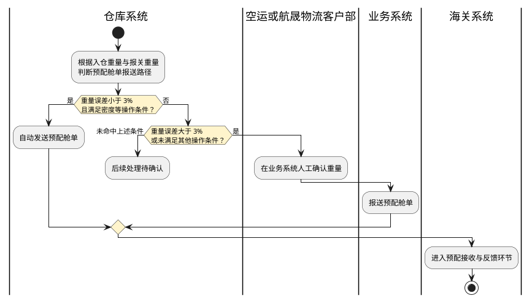
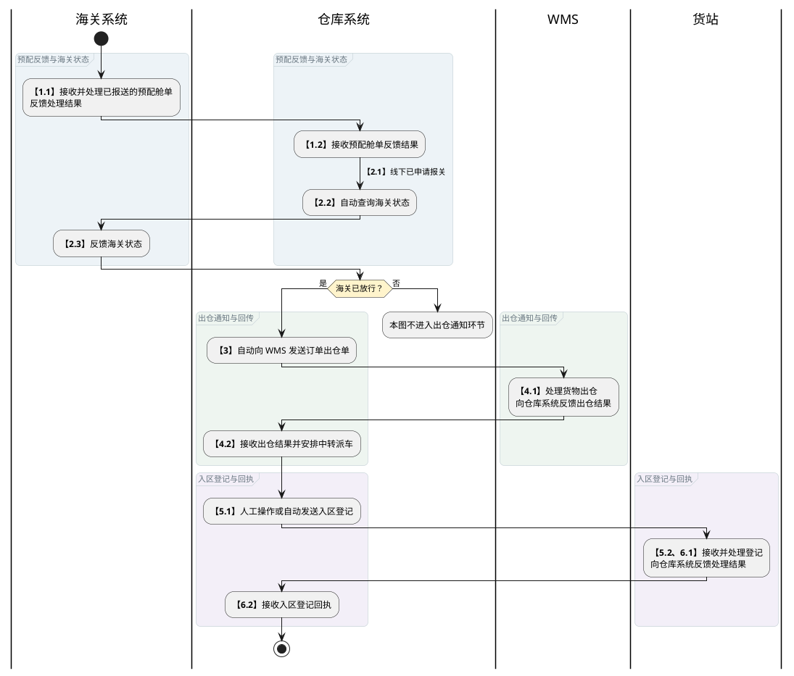
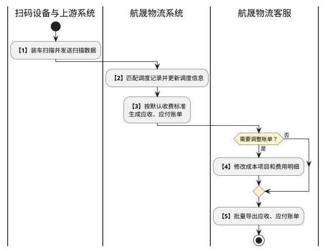

# 第011篇

> 本篇定位：DDP跨模块作业与结算流程；主要内容：模块流程导航、运单成本生成、仓单外部交接与中转用车；文档角色：共享规则档；文档ID：7579B595B8

## 1. DDP 业务衔接

DDP 业务通过合作方报价确定计费依据，由用车、仓库和货站模块执行作业，再把运输节点、仓库回执和费用交给结算环节。各模块内部的操作与状态流程在所属业务篇定义；本篇说明跨系统交接和成本生成的时点。

| 业务环节 | 完整流程与规则 | 与其他环节的关系 |
| --- | --- | --- |
| 供应商与客户报价 | [供应商报价流程](../PRD.高捷物流系统.第4册.运输管理/PRD.高捷物流系统.第024篇.合作方报价-报价管理.92B1FD526A.md#doc-92B1FD526A-section-f03ef0467168)、[客户收费报价流程](../PRD.高捷物流系统.第4册.运输管理/PRD.高捷物流系统.第024篇.合作方报价-报价管理.92B1FD526A.md#doc-92B1FD526A-section-11a9af11eaad) | 为调度选车和应收、应付计费提供报价 |
| 用车订单接入与调度 | [订单管理流程](../PRD.高捷物流系统.第4册.运输管理/PRD.高捷物流系统.第025篇.用车-订单管理.32C78B8106.md#doc-32C78B8106-section-470dd2b8ab0e) | 接收外部用车单或内部系统订单，并回传派车信息 |
| 运单与司机执行 | [运单履约与司机反馈流程](../PRD.高捷物流系统.第4册.运输管理/PRD.高捷物流系统.第026篇.用车-运单管理.20AA542560.md#doc-20AA542560-section-df85abad663f) | 汇集司机节点、仓库到达预报、运输轨迹、单据和异常 |
| 车队资料 | [车队管理流程](../PRD.高捷物流系统.第4册.运输管理/PRD.高捷物流系统.第027篇.航晟车队管理.03280CBA2C.md#doc-03280CBA2C-section-fca683731c5a) | 为运输任务提供司机、车辆及其关联资料 |
| 仓库作业 | [仓库订单与 WMS 流程](../PRD.高捷物流系统.第3册.仓储管理/PRD.高捷物流系统.第022篇.仓库-仓库订单管理.A77FC65070.md#doc-A77FC65070-section-d404c18c5637) | 接收空运订单，并回传按托盘记录的部分或全部入出仓结果 |
| 地面单据 | [单据扫描上传流程](../PRD.高捷物流系统.第4册.运输管理/PRD.高捷物流系统.第029篇.用车-地面服务小程序.C027EE380C.md#doc-C027EE380C-section-5445851213dc) | 按扫描类型和单号关联作业，上传内容归档到仓库订单详情 |
| 货站打板 | [打板计划与板纸流程](../PRD.高捷物流系统.第3册.仓储管理/PRD.高捷物流系统.第023篇.航晟货站打板.B42F0635C9.md#doc-B42F0635C9-section-e7bebd79575e)、[打板订单流程](../PRD.高捷物流系统.第3册.仓储管理/PRD.高捷物流系统.第023篇.航晟货站打板.B42F0635C9.md#doc-B42F0635C9-section-b937bb7ae261) | 衔接空运计划、入站、板纸、托书与打板费用 |

## 2. 运单成本生成与财务交接

业务入口为运单结算管理和订单成本。运单记录应收、应付账单；司机通过小程序执行运输任务并反馈节点。

### 2.1 成本生成时点

| 触发条件 | 处理方 | 处理与业务结果 |
| --- | --- | --- |
| 订单尚未完成调度 | 航晟物流 | 留在运单结算管理，不进入默认应收生成环节 |
| 订单已完成调度 | 系统 | 根据供应商报价和客户报价生成默认应收账单；空运同时参考应付数据 |
| 司机在运输中上报停车费、清关费等杂费 | 司机、航晟物流 | 司机提交杂费，航晟物流审核 |
| 杂费审核通过 | 系统 | 生成对应成本项目的应收、应付记录 |
| 司机确认卸货完成 | 司机、系统 | 司机在小程序确认完成，系统生成运费对应的应付成本项目 |
| 需要补充或修改成本项目 | 航晟物流 | 在订单成本中新增或修改应收、应付明细 |
| 需要导出账单 | 航晟物流 | 导出单条或批量导出多条应收、应付账单 |

### 2.2 提货费汇总与后续结算

单车提货费、车辆数量汇总、应收与应付车型调整、杂费、候车压车数据及结算方名称的规则见[订单提货费汇总与结算展示](../PRD.高捷物流系统.第4册.运输管理/PRD.高捷物流系统.第026篇.用车-运单管理.20AA542560.md#doc-20AA542560-order-pickup-charge-summary)。

成本生成后，按[订单成本](../PRD.高捷物流系统.第5册.财务管理/PRD.高捷物流系统.第031篇.财务结算-订单成本管理.70AD0AF66B.md#doc-70AD0AF66B-section-73aeb84b1dce)、[对账](../PRD.高捷物流系统.第5册.财务管理/PRD.高捷物流系统.第032篇.财务结算-对账管理.30A62F6230.md#doc-30A62F6230-section-33c8a19d6a63)、[收付款申请](../PRD.高捷物流系统.第5册.财务管理/PRD.高捷物流系统.第033篇.财务结算-收付款申请管理.C548DF1D48.md#doc-C548DF1D48-section-186f2254becb)、[核销](../PRD.高捷物流系统.第5册.财务管理/PRD.高捷物流系统.第034篇.财务结算-收付款核销.45DB5A5118.md#doc-45DB5A5118-section-ffeb7a8e12b6)和[发票](../PRD.高捷物流系统.第5册.财务管理/PRD.高捷物流系统.第036篇.财务结算-销项发票管理.DA6DFB99AE.md#doc-DA6DFB99AE-section-059d7273dadd)规则继续处理。税金与结算的跨系统关系见[税金管理与财务结算流程](PRD.高捷物流系统.第009篇.税金管理与财务结算流程.077CC05853.md#doc-077CC05853-tax-settlement)。

## 3. 仓库、海关与货站的外部交接

仓库系统根据实际入仓数据发送预配舱单，接收海关结果后通知 WMS 出仓，再衔接中转派车和货站入区登记。交接数据见[仓单外部字段](../PRD.高捷物流系统.第6册.运营支撑/PRD.高捷物流系统.第039篇.数据字典.7A3D9E1F50.md#doc-7A3D9E1F50-mappings-mapping-warehouse-external-fields)。

### 3.1 预配舱单发送判断

重量误差按“入仓重量减报关重量，再除以报关重量，取绝对值”计算。

“后续处理待确认”：重量误差等于 3% 和报关重量为零时的处理边界待确认；未定义的边界不连接到任何已确认处理路径，也不表示业务完成。

图中自动报送与人工确认分别按下表条件进入。

| 判定条件 | 处理方式 |
| --- | --- |
| 重量误差小于 3%，且满足密度等操作条件 | 仓库系统自动发送预配舱单 |
| 重量误差大于 3%，或未满足其他操作条件 | 空运或航晟物流客户部在业务系统中人工确认重量；确认后由业务系统报送预配舱单 |

### 3.2 放行、出仓与入区回执

**海关放行与仓库出仓交接**

预配舱单反馈、报关状态、WMS 出仓结果和货站入区回执分别回到仓库系统；海关放行是发送出仓单的前提。

步骤 2.1：线下申请报关作为进入状态获取环节的交接事件；申请者未明确，不归入仓库系统的执行职责。

| 环节 | 处理与交接 | 后续结果 |
| --- | --- | --- |
| 1. 预配接收 | 海关系统接收并处理预配舱单 | 仓库系统接收预配舱单反馈结果 |
| 2. 线下报关 | 线下申请报关；报关后系统自动获取海关反馈状态 | 海关放行后进入出仓通知 |
| 3. 出仓通知 | 仓库系统自动向 WMS 发送该订单出仓单 | WMS 接收并处理货物出仓 |
| 4. 出仓回传 | WMS 向仓库系统反馈出仓结果 | 仓库系统为出仓货物安排[中转派车](#doc-7579B595B8-section-e4cd43033ac4) |
| 5. 入区登记 | 仓库系统通过人工操作或自动处理发送入区登记 | 货站接收并处理登记 |
| 6. 入区回执 | 货站反馈登记处理结果 | 仓库系统接收入区登记回执 |

报关材料和状态由[报关单管理](../PRD.高捷物流系统.第2册.订单管理/PRD.高捷物流系统.第018篇.空运-报关单管理.7A78DCFDE1.md#doc-7A78DCFDE1-section-9ac8a75081d3)定义；仓库和货站的本地作业分别见[仓库订单](../PRD.高捷物流系统.第3册.仓储管理/PRD.高捷物流系统.第022篇.仓库-仓库订单管理.A77FC65070.md#doc-A77FC65070-section-fb20853cddc3)和[货站打板](../PRD.高捷物流系统.第3册.仓储管理/PRD.高捷物流系统.第023篇.航晟货站打板.B42F0635C9.md#doc-B42F0635C9-section-828e354cd0b8)。

## 4. 中转仓用车与费用交接

空运系统按订单节点自动生成中转仓用车订单。航晟物流系统接收后单独展示，此类订单不需要客服手工调度。

### 4.1 扫描数据与调度匹配

默认计费后，客服仅在需要调整时修改账单；无需调整的账单直接进入导出环节。

| 环节 | 处理方 | 处理与业务结果 |
| --- | --- | --- |
| 1. 装车扫描 | 扫码设备与上游系统 | 向航晟物流系统发送扫描数据，字段见[中转仓用车输入](../PRD.高捷物流系统.第6册.运营支撑/PRD.高捷物流系统.第039篇.数据字典.7A3D9E1F50.md#doc-7A3D9E1F50-mappings-mapping-transit-warehouse-transport-input) |
| 2. 自动调度匹配 | 航晟物流系统 | 将扫描数据匹配到调度记录并更新调度信息 |
| 3. 默认计费 | 航晟物流系统 | 根据默认收费标准生成应收、应付账单 |
| 4. 账单调整 | 航晟物流客服 | 需要调整时，修改成本项目和费用明细 |
| 5. 账单导出 | 航晟物流客服 | 批量导出应收、应付账单 |

### 4.2 扫描接入依赖

扫码数据接入依赖具备对应采集能力的设备；设备和上游系统按统一数据标准传输单号、车行、司机和联系方式。订单接入见[用车订单](../PRD.高捷物流系统.第4册.运输管理/PRD.高捷物流系统.第025篇.用车-订单管理.32C78B8106.md#doc-32C78B8106-section-64c8156636ab)，执行见[用车运单](../PRD.高捷物流系统.第4册.运输管理/PRD.高捷物流系统.第026篇.用车-运单管理.20AA542560.md#doc-20AA542560-section-c57389a7360b)，费用调整见[订单成本](../PRD.高捷物流系统.第5册.财务管理/PRD.高捷物流系统.第031篇.财务结算-订单成本管理.70AD0AF66B.md#doc-70AD0AF66B-section-73aeb84b1dce)。
