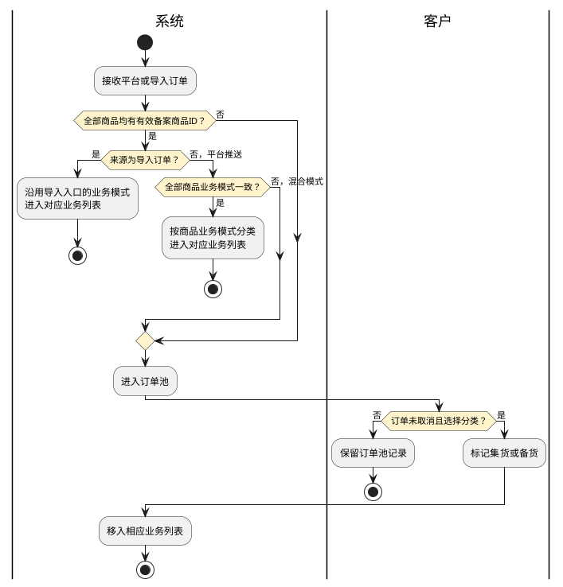
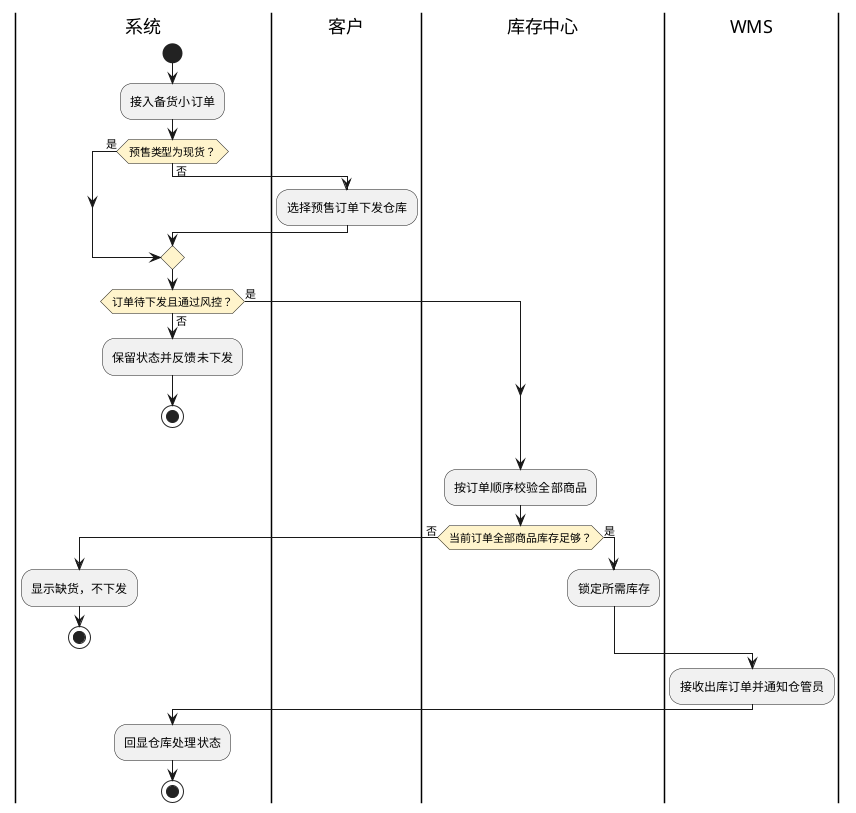
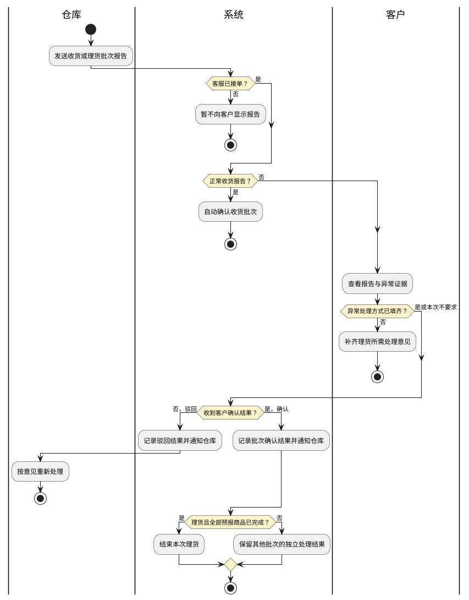

# 第013篇

> 本篇定位：客户门户订单管理；主要内容：订单池、平台小订单、物流需求单及收货理货报告确认；文档角色：模块档；文档ID：C90EB28313

共用定义见[综合订单与服务协同实体](../PRD.高捷物流系统.第6册.运营支撑/PRD.高捷物流系统.第061篇.数据字典.7A3D9E1F50.md#doc-7A3D9E1F50-integrated-order-model)、[综合订单与客户订单权限](../PRD.高捷物流系统.第6册.运营支撑/PRD.高捷物流系统.第062篇.角色与访问权限.5E31456F30.md#doc-5E31456F30-integrated-order-access)。

## 1. 业务范围与对象衔接

客户门户面向客户管理电商平台对接或导入的小订单，提出物流需求，查看服务进度并确认仓库报告。平台小订单、物流需求单、运营平台订单、各类服务单及仓库批次分别保留自己的身份和状态，不因页面均称“订单”而混为一单。

| 业务入口 | 处理对象与范围 | 后续衔接 |
| --- | --- | --- |
| 订单池 | 无法依据备案商品判断集货或备货模式的BC、CC小订单 | 客户标记后进入相应业务的集货或备货列表 |
| BC、CC集货订单 | 按消费者订单组织实物包裹，选择同一平台的小订单提交入库需求 | 客服接单、仓库收货理货、干线与关务服务 |
| BC、CC备货订单 | 先入库存货，再按消费者小订单出库 | 库存校验、锁库、下发WMS及出库回执 |
| BBC进口小订单 | 平台推送的保税仓出区订单 | 客户查看或导出；运营处置见[BBC客户订单管理](PRD.高捷物流系统.第014篇.BBC客户订单管理.40DBFB6718.md#doc-40DBFB6718-scope) |
| BC、CC、BBC需求订单 | 客户提出的入库、出库及所选物流服务需求 | 衔接运营接单与服务生成，回显履约和报告结果；服务生成时点按第5.1节待确认边界处理 |
| 报告列表 | 仓库每次发出的一个收货或理货批次 | 定位需求单的对应报告及具体批次进行确认 |

订单提交入库或下发WMS前必须通过风险监控，具体阻断和解除规则见[风险预警与解除](../PRD.高捷物流系统.第6册.运营支撑/PRD.高捷物流系统.第060篇.风险预警与解除.3BBF24E345.md#doc-3BBF24E345-4ed99ee81a86)。客户不能以本地取消标记代替海关撤销、仓库拦截或库存释放成功。

**界面原型概述 · 通用交互**

- **区域字段或业务元素**：各列表的分页，新增表单的提交、取消，编辑表单的保存、取消，以及字段校验反馈。
- **区域级通用规则**：列表默认每页50条，查询栏默认展开；提交或保存成功时显示结果提示。必填或格式校验未通过时标出对应字段并禁用提交、保存；草稿保存是否豁免必填校验见第5.1节，不以通用规则消除该冲突。

### 1.1 履约衔接

集货由客户选择小订单并提交入库需求，运营平台形成平台订单，仓库收货后回传清单；客服据收货结果生成可设置出库批次的平台出库订单并绑定干线，仓库接收后发货，关务处理申报。备货入库由客户填报商品需求，仓库可分批收货和理货，客户逐批确认后衔接对应批次的上架；驳回时仓库修改理货报告并重新发送。备货出库由平台小订单触发库存检查，再由WMS出库并回传清单，客服形成平台订单和提单，衔接关务接单。仓库作业和服务协作分别见仓储篇与[服务协同管理](PRD.高捷物流系统.第016篇.服务协同管理.280F0AA83A.md#doc-280F0AA83A-service-overview)。

CC进口关务接单后涉及提货证明、单证资料检查、快递车辆预约、车辆进出区申报，以及陆运通舱单和载货确报、白云快件自助中心车辆资料录入，再衔接订单申报；完整关务处理见[BC与CC进口关务](PRD.高捷物流系统.第028篇.BC与CC进口关务.034DD8F0D3.md#doc-034DD8F0D3-scope)。来源流程图未明确客服绑定干线与车辆预约的先后或并行关系，也没有证明“仓库出库后申报”适用于全部进口模式，这些依赖不能直接作为全局放行条件。

来源流程表还存在理货确认的自回跳、客服生成出库订单与仓库分批理货的前后关系不一致；未确认前以各动作明确的局部资格为边界，不补造串行或并行闸门。

## 2. 订单接入、分类与导入

### 2.1 订单池与分类

对接订单按商品ID关联备案业务模式：所有商品均集货或均备货时，自动标记对应模式并进入相应列表；混合模式、商品ID为空或查不到备案的订单进入订单池。按业务页面导入的订单沿用该入口的模式，但缺少商品ID或查不到备案时仍进入订单池。商品备案默认备货及其维护由商品档案定义，本篇只消费该配置。

客户可按勾选订单或筛选范围，把未取消订单标记为集货或备货并移入对应列表。订单池取消把“客户取消订单”由否改为是，恢复把是改为否；不能将此标记解释为WMS或海关状态。

客户手工标记备货是否仍必须补齐有效备案商品ID、混合模式订单是否允许拆单，以及取消订单对后续自动分类的影响，尚待确认。

**界面原型概述 · 订单池**

- **区域字段或业务元素**：查询栏包含订单编号、快递单号、电商平台名称、电商企业名称、订购人、下单时间、业务类型；列表包含订单编号、业务类型、客户取消订单、托盘号、电商企业名称、电商平台名称、仓库、快递单号、订单商品总价、订购人、关区、预估税金、下单时间；工具栏包含标记集货、标记备货、取消、恢复、查询、重置。
- **区域级通用规则**：查询区域用于筛选，列表按来源展示，处置通过工具栏完成，不在列表直接改写来源值。

| 字段或控件特例 | 界面特例或可见反馈 |
| --- | --- |
| 订单编号 | 点击进入详情 |
| 电商企业、电商平台 | CC订单没有相应信息时留空 |
| 分类、取消、恢复 | 按本章资格呈现执行结果，取消标记与履约状态分别显示 |

### 2.2 小订单导入与导出

BC、CC集货与备货订单均支持xls、xlsx导入，文件不超过5Mb；模板包含订单表头和商品表体。导入时校验订单号与订单中心已有订单不重复、同单公共信息一致、模板必填项完整。任一订单不通过则整份文件导入失败，提示前10条问题订单号，并提供失败数据下载。不能以部分行成功替代整份校验。

集货导入窗口可填托盘号；备货导入时须选择出库仓库，导入后默认现货，按订单顺序检查库存并执行第3章。来源BC备货截图没有托盘号输入，而CC备货正文要求有该输入，不能仅为页面统一而删除差异。小订单导入允许缺备案进入订单池，不等同于第5章需求单导入的“未备案商品整份拒绝”。

导出支持勾选记录和查询结果两种范围，输出Excel明细。无勾选、无查询结果、重复订单号跨客户是否共用唯一性、失败数据下载内容及导出脱敏边界待确认。

**界面原型概述 · 小订单导入**

| 字段或控件 | 个别界面约束或可见反馈 |
| --- | --- |
| 上传文件、下载模板、确定、取消 | 弹窗承载上传、模板下载与本节校验结果；成功确认后返回列表 |
| 托盘号 | 集货导入允许填写；BC、CC备货入口差异按本节保留待确认 |
| 出库仓库 | 备货小订单导入时选择；可选仓库范围、默认值和跨仓导入限制尚待确认 |
| BC集货商品表体 | 商品序号、条码、商品名称、品牌、规格名称、行邮税号、HS编码、第一法定单位、第二法定单位、单价、增值税、消费税、数量、计量单位代码、第一法定数量、第二法定数量；其余模板字段属于订单表头 |
| 导入错误 | 弹窗显示前10条问题订单号，保留失败数据下载入口 |

来源修订摘要还要求导入历史页面不再显示导入按钮，并补充业务类型、业务模式字段，但未提供该页面完整入口、记录范围和其他处置规则。这两项局部要求予以保留，完整场景待确认，不据摘要推定为所有导入页面取消导入功能。

## 3. 集货与备货小订单处置

### 3.1 集货操作

| 操作 | 适用资格 | 处理与结果 |
| --- | --- | --- |
| 修改托盘号 | 订单尚未下发仓库 | 按勾选或筛选范围批量修改；全部已下发时提示没有可修改的订单 |
| 解绑入库需求 | 已绑定且仓库尚未收货 | 解除小订单与入库需求的关联；已收货订单不解绑 |
| 绑定入库需求 | 未绑定且未入库，目标需求的收货报告尚未确认 | 建立关联；已入库或目标报告已确认时不绑定 |
| BC集货转备货 | 单条订单，先解除已绑定需求 | 选择出库仓库，填写或编辑各商品ID，确认后进入BC备货列表 |
| CC集货转备货 | 下发仓库前且未绑定入库需求；已绑定须先解绑，可勾选一个或多个订单 | 确认后进入CC备货列表；来源没有BC式商品ID弹窗，不自动补同样流程 |
| 提交入库 | 同一电商平台的选定或批量订单，且通过风控 | 自动排除已提交入库及已取消订单，进入新增入库需求页面 |
| 删除 | 尚未提交需求单 | 删除所选合格订单；提交后不能删除，只能取消 |
| 取消 | 已提交需求单的小订单 | “客户取消订单”改为是，允许按对应业务恢复；外部拦截结果另行显示 |
| BC恢复 | 已取消且未出库 | 恢复订单并重置相应海关申报状态；未取消时提示没有可恢复的订单 |
| CC恢复 | 已取消 | 恢复取消标记；来源未写BC的未出库限制，不推定可恢复已出库订单 |
| 回执、导出 | 查看订单回执或按指定范围导出 | 回执入口打开回执记录，导出遵循第2章 |

BC恢复具体重置哪些申报状态、混合资格批次逐条跳过还是整批拒绝、绑定后是否重算入库需求数量，以及CC恢复的出库限制待确认。BC、CC相互转换属于关务业务变更，不能与本节的集货/备货模式转换混用；相关完整规则见关务篇。

### 3.2 备货出库与取消

BC、CC备货小订单均为消费者出库订单。现货接入后自动检查库存，预售由客户选择后执行“下发仓库”。同一订单全部商品满足库存要求才锁定库存并下发WMS；任一商品不足则订单显示缺货，不下发。多个订单按订单顺序逐一分配，不能把已锁定数量再分给后续订单。库存对象和可用量定义见仓库模型与库存管理。

手动下发按勾选订单或未勾选时的筛选结果检查：待下发且有货的订单可锁库下发并通知仓管员。来源把“全部已下发并且缺货”作为无可下发订单的提示条件，这不是对全部失败组合的完整定义；其他不合格组合和批次原子性待确认。

订单下发前可修改托盘号、确认后转回集货；下发后不能修改托盘号或转换。BC转回BC集货；CC正文写转回“BC集货列表”，与CC业务归属冲突，目标列表待确认。

备货取消时，未出库则库存中心释放锁定数量；已出库已扣库存时，必须由仓库实物重新入库，不能只改状态恢复账面库存。CC备货未提交需求单可删除，提交后只能取消；BC备货同时使用“待下发仓库可删除”和“提交后不能删除”，需求提交与仓库下发之间的可删除范围待确认。

BC备货仅已取消且未出库的订单可恢复，未取消或已出库时提示没有可恢复的订单；恢复后按新订单处理，各申报状态回到待报关。CC备货来源只说已取消订单可以恢复，是否也禁止已出库订单恢复尚待确认。两者恢复后的库存复核、再次锁定和重复下发保护均未定义。

### 3.3 取消与外部拦截衔接

对接平台的退款申请通过审核后，客户门户同步订单取消标记并传到运营平台；未对接平台的小订单由客户手动取消。未提交需求的小订单可按对应入口删除，不必以外部拦截代替删除。

| 取消时的履约情况 | 来源明确的后续处置 | 结果边界 |
| --- | --- | --- |
| 仓库尚未发货 | WMS终止出库流程 | 库存释放另按第3.2节处理 |
| 仓库已发货，已申报但未放行 | 自动向海关发送撤销申报报文 | 发送不等于撤销成功，仍须区分海关回执 |
| 仓库已发货、已申报且已放行 | 线下通知快递拦截 | 取消标记不证明包裹已拦截 |

已发货但尚未申报、仓库正在发货及多个状态同时变化时的处理未定义；退款审核来源、接口失败重试和拦截结果回传也待确认。关务撤销的完整规则见[BC与CC进口关务](PRD.高捷物流系统.第028篇.BC与CC进口关务.034DD8F0D3.md#doc-034DD8F0D3-scope)，本节不新增客户直接申报权限。

## 4. 小订单界面与数据回显

### 4.1 列表与查询

**界面原型概述 · BC与CC小订单查询栏**

- **区域字段或业务元素**：订单编号、入库或出库单号、总运/提单号、客户取消订单、托盘号、仓库、快递单号、订购人、仓库状态、关区、下单时间、退运结果、航班到达、货站提货、开始清关、完成清关、快递交接、查询、重置、展开或收起；集货补充转换情况，BC及CC集货补充拦截情况；BC补充电商企业、电商平台、订单状态、运单状态、清单状态、撤销清单状态；CC补充舱单状态、附件状态、快件状态。
- **区域级通用规则**：查询值可输入或选择；未填写任何条件时查询不改变当前列表，重置清空条件。

| 字段或控件特例 | 界面特例或可见反馈 |
| --- | --- |
| 单号、托盘号、订购人 | 精确匹配，支持回车换行输入多个值；集货查询栏是否补托盘号按实际入口字段保留，不视为全部来源已有 |
| 电商企业、电商平台、关区 | 企业和平台从客户店铺档案选择，关区从基础资料选择，均支持关键字模糊匹配 |
| 客户取消、拦截、转换 | 取消取是/否；拦截取无、拦截成功、拦截失败、拦截中；转换展示跨BC/CC处理结果，不作为集货备货筛选 |
| 仓库状态 | 集货原文取待出库、已出库、已取消，初始待出库；备货取待下发、待拣货、待打包、待出库、已出库、已取消，初始待下发 |
| 五项物流节点 | 分别以未到达/已到达、未提货/已提货、未开始/已开始、未完成/已完成、未交接/已交接筛选 |
| 下单时间 | 起止日期时间，显示到秒 |

BC修订说明要求移除电商企业和平台，而正文及截图仍保留；转换结果的“作废/报废”、BC退运查询“进行中/已完成”与列表“退运中/已退运”、CC仓库筛选误写“有货/无货”等差异均待确认，不覆盖为同一枚举。

**界面原型概述 · BC与CC小订单列表及工具栏**

- **区域字段或业务元素**：列表展示订单编号、入库或出库单号、总运/提单号、客户取消订单、拦截情况、转换情况、托盘号、仓库、快递单号、订单商品总价、订购人、仓库状态、对应关务状态、退运结果、关区、预估税金、海关税金、下单时间、五项物流节点；BC补电商企业和平台，备货补库存情况与预售类型；工具栏承载第3章操作及导入、导出、分页。
- **区域级通用规则**：列表按关联业务来源只读回显，批量操作作用于勾选记录或对应操作允许的查询范围，每页默认50条。

| 字段或控件特例 | 界面特例或可见反馈 |
| --- | --- |
| 订单编号 | 点击打开小订单详情 |
| 总运/提单号、仓库 | 分别回显客服绑定干线与提交入库需求所选仓库 |
| 托盘号 | 在第3章允许的条件下通过修改弹窗维护，不因来源表中“可编辑”标志批量开放全部列 |
| 关务状态 | BC的订单、运单、清单、撤销清单及CC的舱单、附件、快件状态初始均写待报关，后续按相应回执显示；各对象的状态适用性仍须与关务篇核对 |
| 海关税金、预估税金、物流节点 | 分开展示估算、海关税款及各作业节点，不将其中任一项替代履约完成 |

入库/出库单号在CC集货、CC备货的表头和来源说明中相互错置；BC、CC小订单列表多数列标为可编辑，但操作正文只开放特定动作。对应单号来源和编辑授权待确认。

### 4.2 BC订单详情

BC详情以对接或导入值为基础，并追加申报回执。实际支付金额=商品总额+运费+保费+预收税金-非现金抵扣。金额、毛净重、数量及税额按来源要求保留小数点后5位。预估税额按税金规则生成，海关税金在导入税单后显示，不由预估数替代。快递单号缺失时按客户快递规则取号；已有号码时根据快递公司名称关联海关备案代码。

担保企业先取客户档案设置；无设置时检查是否存在授权高捷使用的保函，有授权则使用高捷保函号；两者都没有时留空并允许客户填写。担保企业编号与保函号是否允许混用，须由业务确认。

**界面原型概述 · BC订单详情**

- **区域字段或业务元素**：订单基础含订单编号、订单商品描述、收件人、订购人、订购人电话、订购人身份证号、收件地址、订单总毛重、订单总净重、快递单号、快递代码、担保企业编号、电商企业名称、电商平台名称、提单号、备注；金额含商品总额、运费、保费、预收税费、非现金抵扣、实际支付金额、预估税额、海关税金；申报含海关清单号、系统唯一编号（customs_id）、自编清单号、预录入编号、关区代码；商品含序号、条码、商品ID、商品名称、规格型号、行邮税号、HS编码、第一法定数量、第二法定数量、数量、单价、重量、增值税、消费税；附件含小票、面单、文件名称、上传、下载和预览。
- **区域级通用规则**：除所列特例外，详情只读显示订单来源及关联回执。

| 字段或控件特例 | 界面特例或可见反馈 |
| --- | --- |
| 订购人电话、身份证号、商品单价 | 默认隐藏，点击查看并输入授权密码后显示；授权范围、有效期、失败次数与导出明文控制待确认 |
| 担保企业编号 | 本节所述来源均为空时允许填写 |
| 小票、面单 | 支持PDF上传及下载；附件大小、数量和替换历史规则待确认 |

行邮税号与HS编码按商品ID关联备案；海关清单号、预录入编号取海关回执，关区取总运单申报海关，自编清单号和系统唯一编号由系统生成。不可把页面位置或源文件字段序号作为业务编号规则。

### 4.3 CC订单详情

CC快件类型为A、B、C。C类专用收件公司、发件公司在B转C时补充；BC转CC的经营单位代码取电商企业代码，CC的B转C时从客户店铺档案选择。总运/提单号先取导入资料，客服在运营平台修改后更新回显。预估税金按商品行邮税号和税率计算并合计；海关税金取导入账单，验放时间取放行回执。BC转CC后保留运费。

**界面原型概述 · CC订单详情**

- **区域字段或业务元素**：总运/提单号、订单编号、快递单号、清单号、快件类型、订单状态、关区代码、币制代码、收发件人姓名及电话、快递状态、货值、内件描述、运费、收发件公司、包裹重量、预估税金、收发件地址、验放时间、海关税金、收件人身份证号、发件人城市、经营单位及代码、备注、发件国代码；商品含行邮税号、商品名称、规格型号、原产国代码、HS编码、数量、商品单个净重、预估税金、两项法定数量、单价、商品总价；附件含附件类型、文件名称、缩略图、预览与下载。
- **区域级通用规则**：除所列特例外，只读展示对接、导入或关务结果，金额和数量保留5位小数，重量以kg展示。

| 字段或控件特例 | 界面特例或可见反馈 |
| --- | --- |
| 收件人电话、身份证号、商品单价 | 隐藏明文，授权密码验证后展示 |
| 收发件公司、经营单位代码 | 按本节B转C或BC转CC条件展示补录或选择入口 |
| 附件 | A/C类通常包含发票、委托书、面单；B类通常包含小票、面单、身份证、身份认证；接口没有生成时留空，缩略图支持放大预览 |

接口新生成附件替换旧附件，历史保留与误替换恢复待确认。原文把收件人姓名来源写成发件人，把取号状态称作“快递已收货/快递未收货”，商品总价写成“单价×数据”；这些表述不能证明真实签收、收件人映射或唯一计算公式，均保留待确认。

### 4.4 BBC小订单客户视图

BBC进口小订单由对接平台进入，客户视图仅定义查看与Excel导出，不据运营端能力补造客户取消、申报或下发按钮。BBC预收税费取商品税金合计、订单总毛重与净重取商品合计；实际支付计算遵循本篇BC详情的同名公式。税金与运营端估算、海关回执、导入税单之间的口径差异见本节待确认项。

BBC估算税额取平台订单税金，担保企业编号取客户档案，快递代码按店铺档案的快递公司关联基础数据，不套用BC详情的税金生成时点和保函回退规则。[BBC客户订单管理](PRD.高捷物流系统.第014篇.BBC客户订单管理.40DBFB6718.md#doc-40DBFB6718-scope)又把取消标记的来源限定为客户门户，后续退货处理依赖该标记，但本客户入口没有定义取消动作。客户能否取消、由哪个入口发起及退款接口能否触发均待确认；不得用只读视图推定取消能力已经存在。

**界面原型概述 · BBC小订单查询与列表**

- **区域字段或业务元素**：查询栏含订单编号、快递单号、电商平台名称、订购人、下单时间、订单状态、清关状态、仓库状态、退货状态；结果区含订单编号、快递单号、电商平台名称、订单商品总价、订购人、预估税金、海关税金、下单时间、预售类型、订单状态、清关状态、仓库状态、退货状态；工具栏含查询、重置、导出、分页。
- **区域级通用规则**：查询用于选择来源小订单，结果只读，点击订单编号查看详情。

| 字段或控件特例 | 界面特例或可见反馈 |
| --- | --- |
| 订单编号、快递单号、平台名称、订购人 | 精确匹配，支持换行多个值 |
| 仓库状态 | 来源筛选值为待下发、待拣货、打包完成、已发货、已取消，与运营端WMS枚举的映射待确认 |
| 退货状态 | 申请成功、申请失败、待报关、退货中、退货成功、退货失败 |
| 清关状态 | 来源将其写成多单号精确输入，与状态筛选语义冲突，暂不确定控件形式 |

**界面原型概述 · BBC小订单详情**

- **区域字段或业务元素**：基础及人员区域包含订单编号、订单商品描述、收件人、订购人及电话、订购人身份证号、收件地址、订单总毛重、订单总净重、快递单号、担保企业编号、快递代码、电商企业名称、电商平台名称、备注；金额区域包含商品总额、运费、保费、预收税费、非现金抵扣、实际支付金额、估算税额、海关回执税额；申报及履约区域包含海关清单号、系统唯一编号（customs_id）、自编清单号、预录入编号、关区代码、交接单号、WMS状态、出区单号；商品区域包含商品名称、备案商品ID、商品信息（规格型号）、HS编码、条码、原产国代码、数量、单价、增值税、消费税。
- **区域级通用规则**：除所列特例外，客户只读查看平台与关联业务结果。

| 字段或控件特例 | 界面特例或可见反馈 |
| --- | --- |
| 电话、身份证号、单价 | 使用本篇的授权查看入口，不默认显示明文 |
| 快递单号 | 新页面打开对应快递查询页面 |

BBC字段表将出区单号映射支付单号、备注映射支付日期、条码映射法定数量、原产国代码映射第二法定数量；这些映射不成立为确定规则。列表海关税金取导入税单，详情海关回执税额取申报回执；是否为两项独立数据、关区取需求单还是总运单，以及自编清单号“随机生成”的唯一性边界待确认。

## 5. 客户物流需求单

### 5.1 创建、提交与处置

集货需求从选定的小订单形成，备货需求通过新增或导入商品形成。客户可编辑尚未提交的需求；保存保留当前内容并返回列表，提交先检查必填项，缺少时提示先填写必填项，不生成服务单。客户门户来源写校验通过后立即保存并按所选服务生成服务订单，而[综合订单的形成与提交](PRD.高捷物流系统.第012篇.综合订单管理.C97EF7E0FE.md#doc-C97EF7E0FE-create)写客户提交后由客服接单、补充并提交才生成服务。两条路径对服务创建主体、时点、首次创建与后续新增服务的归属尚未统一，不能各生成一套服务。服务粒度与增量下发的完整规则入口为[综合订单的服务配置与下发](PRD.高捷物流系统.第012篇.综合订单管理.C97EF7E0FE.md#doc-C97EF7E0FE-service-dispatch)，该入口不代表已裁定本项冲突。

待提交需求的保存是否允许缺少必填项，与通用“必填未完成禁用保存”规则冲突，尚待确认。客服拒接后客户可以重新编辑并提交；再次提交如何关联原需求、原接单记录及已生成服务，也须与前述创建边界一起确认。

需求导入按集货、备货或BBC专用模板下载。已有货物内容时须确认覆盖再导入；字段不符或必填项为空时失败，备货导入含未备案商品ID则全部拒绝并提示检查后重新导入。所选商品删除须确认；附件新增、删除的源按钮文字与操作描述错置，不能把“添加”实现为下载。

| 操作 | 资格与确认 | 结果 |
| --- | --- | --- |
| 保存 | 客户创建或编辑尚未提交需求 | 返回列表；正文称待提交 |
| 提交 | 必填项完整且满足前置校验 | 保存需求，门户正文称已提交；是否此时生成所选服务单按本节跨篇冲突待确认，不先行判定 |
| 取消 | 需求订单进行中，二次确认 | 状态改为已取消；BC、CC明确同步运营平台，BBC入口的同步时点待确认 |
| 删除 | 未提交，二次确认 | 删除所选合格需求；全部不合格时提示没有可删除的订单 |
| 查看 | 按列表记录进入 | 展示需求、服务、附件与仓库报告；待提交时可进入编辑 |

保存和提交正文使用“待提交/已提交”；BC需求列表使用未提交、待接单、进行中、已完成、已取消、已拒接，但查询只列未提交、进行中、已完成、已取消。BC服务列表使用待服务、服务中、服务完成，查询使用未提交、进行中、已完成、已取消；CC需求与服务的查询、列表均只列后一组四项。BBC需求查询含未提交、待接单、进行中、已完成、已拒接、已取消，需求及多数服务列表则使用待提交而非未提交，运输服务还遗漏待提交。未确认这些映射前，不以查询枚举反推对象迁移，也不按BC扩写CC的接单状态。

### 5.2 BC、CC表单

BC业务入口正文为BC进口与BC进口退供，CC为CC进口与CC进口退供；BC字段表却写出口，CC新建跳转和列表业务类型又写BC，均需确认。集货默认模式下展示小订单，切换备货展示商品。

**界面原型概述 · BC与CC需求基本信息及货物**

| 字段或控件 | 个别界面约束或可见反馈 |
| --- | --- |
| 业务类型、业务模式、运输方式、关区 | 必填；模式选择集货或备货；业务类型冲突见本节正文；关区支持关键字匹配选择 |
| 备注、货物统称 | 备注非必填且最多100个中文字；货物统称必填且最多20个中文字 |
| 集货订单明细 | 订单号、快递单号、订单重量、快递公司只读显示选定小订单，托盘号非必填；BC集货小订单未提供快递单号或托盘号时不展示相应无值项 |
| 集货包装汇总 | 件数、件数单位、毛重、体积、长、宽、高必填；单位默认托，也可选箱或包裹；重量kg、体积m³、尺寸cm，保留5位小数；源表“不可编辑”与新增填写冲突待确认 |
| 备货商品明细 | 商品ID、商品条形码、数量、生产日期、失效日期必填；商品ID、数量及两日期可填写，商品名称与规格型号按备案只读回显；另展示产品批次号、保质期、托盘号 |
| 备货数量、批次、条码、托盘号 | 数量保留5位小数；源文同时把订单数量、托盘号写为备案回填，批次又标不可编辑，具体来源和编辑范围待确认 |
| 备货详情补充项 | 展示托盘尺寸与备注；新增表未说明其录入来源，不据详情新增强制必填 |

海关运输方式选择范围为非保税区、监管仓库、水路运输、铁路运输、公路运输、航空运输、邮件运输、保税区、保税仓库、其它运输、全部运输方式、边境特殊海关作业区。它不是“干线工具类型”的同义字段。

保质期原文按生产日期减失效日期计算，日期格式还将月份写作HH；计算方向、单位及是否允许无期限商品待确认，不能把明显可能为负的值当成有效保质期。

**界面原型概述 · 需求服务选择与附件**

| 字段或控件 | 个别界面约束或可见反馈 |
| --- | --- |
| 干线服务 | 选择后显示必填启运港、目的港、预计到港时间；港口支持关键字匹配，目的港不能与启运港相同 |
| 仓储服务 | 选择后显示必填仓库名称，按仓库列表选择 |
| 关务服务 | 默认选中；是否允许取消与其他服务默认值冲突见本节正文 |
| 运输服务 | 选择后展开运输行，可添加、删除；提货地址、提货时间、送货地址、送货时间必填；地址通过选择弹窗指定 |
| 货站安检、清关派送、增值服务 | 分别选择所需服务，不以一个开关替代全部服务 |
| 附件资料 | 显示附件类型、附件名称及添加、删除；详情点击名称新页面预览，类型示例含装箱单、发票、合同、报关单草单、其他 |
| 保存、提交、返回 | 页面上下均可进入保存或提交，校验反馈由本章正文定义；返回不自动提交 |

原文把多个服务写为默认选择却又标为不可编辑，新建截图支持选择；不能推定所有服务必选。详情服务取客服编辑保存后的需求资料；提送货地址可打开详细地址，附件可查看。客户提交后与客服后续修改的可见时点、服务已执行后的取消与费用处理尚待确认。

### 5.3 BBC需求差异

BBC需求不是本篇第4.4节的消费者小订单。新增入口业务类型固定BBC进口；正文默认一线进境、航空运输、南沙保税仓。业务模式候选为一线进境、区间调拨、区内调拨、简单加工、保税展示、物料进区、卡板出区、退运、其他；源默认值列及列表又使用集货/备货，二者是否两种独立分类待确认。

**界面原型概述 · BBC需求新增与详情**

| 字段或控件 | 个别界面约束或可见反馈 |
| --- | --- |
| 基本信息 | 业务类型只读；业务模式、运输方式、仓库名称、最终目的国、境外收发货人代码及名称必填；入库单号与备注可填写，备注最多100个中文字 |
| 货物统称 | 必填，最多20个中文字 |
| 商品输入 | 商品ID、商品条形码、数量、单价、生产日期、失效日期必填；可填写托盘号、产品批次号；源条码、批次的编辑标志与填写说明不一致，待确认 |
| 商品回显 | 海关HS编码、品牌、中文名称、规格、单位、原产国、GW毛重、NW净重、保质期；按商品ID关联备案或本次输入计算，具体可覆盖范围待确认 |
| 总价 | 按数量×单价计算；源又标记可编辑，人工覆盖权待确认 |
| 服务 | 干线、仓储、关务、货站安检默认选中；运输出现相反的默认描述；另可选择清关派送、增值服务，相关输入项同第5.2节 |
| 详情 | 展示本次BBC需求数据、服务、附件及报告，不因引用BC详情而改为BC业务 |

数量、单价保留5位小数；乘积舍入与金额合计精度待确认。源文规定失效日期必填，同时说无失效日期不计算保质期，不能据后者开放无期限商品。BBC需求“订单号来自电商平台”与人工创建流程、建单时间取提交时间且草稿不展示的口径，也需确认。

### 5.4 需求查询与列表

**界面原型概述 · BC、CC需求查询与列表**

- **区域字段或业务元素**：查询栏含需求订单号、总运/提单号、业务类型、业务模式、运输方式、建单人、建单日期、订单状态及干线、仓储、关务、运输、货站安检、清关派送、增值服务状态；BC增加出入库类型，CC增加出入库日期；列表含上述业务字段、对应单号、建单人与建单时间；工具栏含查询、重置、展开/收起、自定义列、查看、批量取消、批量删除、新建。
- **区域级通用规则**：查询区域用于筛选，列表只读；自定义列可调整显隐和顺序，处置资格遵循第5.1节。

| 字段或控件特例 | 界面特例或可见反馈 |
| --- | --- |
| 需求订单号、总运/提单号 | 多值精确查询 |
| 建单人、建单日期、出入库日期 | 建单人支持模糊搜索选择；日期按起止范围筛选，显示到秒 |
| 状态汇总与筛选 | 分开展示需求状态与各服务状态；来源枚举差异见第5.1节，不混为一列 |

**界面原型概述 · BBC需求查询与列表**

- **区域字段或业务元素**：查询栏包含订单号、入库单号、总运单号、业务模式、运输方式、订单状态；结果区包含订单号、入库单号、总运单号、业务模式、运输方式、仓库名称、建单人、建单时间、订单状态和各项服务状态；工具栏包含查询、重置、新建、取消、删除和分页。
- **区域级通用规则**：查询区域用于筛选，列表只读显示本次BBC需求与服务结果，操作资格遵循第5.1节。

| 字段或控件特例 | 界面特例或可见反馈 |
| --- | --- |
| 订单号、入库单号、总运单号 | 多值精确查询 |
| 建单时间 | 原文取提交时间，未提交不显示；与字段名称不一致，等待口径确认 |

## 6. 收货、理货报告与客户确认

### 6.1 确认规则

客户在客服接单后查看仓库报告，尚无报告时显示空白数据页。报告按仓库发出的批次逐批呈现，不以一次确认代表整个入库需求确认。

| 报告或操作 | 判定与输入 | 结果 |
| --- | --- | --- |
| 收货正常 | 仓库收货结果正常 | 系统自动确认 |
| 收货异常 | 客户查看数量、异常类型和图片后确认或驳回，执行前二次确认 | 返回列表并通知仓库；正文还称拒收，拒收与驳回的关系待确认 |
| 理货确认 | 检查异常商品处理方式已填写，二次确认 | 记录确认时间，本批次已确认；再判断是否完成全部预报商品理货，满足时结束本次理货 |
| 理货驳回 | 检查异常处理方式已填写，二次确认 | 记录本批次驳回时间及已驳回状态，同步仓库重新处理 |
| 短溢货确认 | 客户填写处理方式并确认差异 | 承认短溢，仓库按方式处理多余商品或不再等候缺少商品 |
| 短溢货驳回 | 客户填写处理方式并驳回 | 仓库按处理意见重新理货，再提交报告 |
| 包装破损转正品 | 异常类型为包装破损，客户二次确认 | 删除该破损商品项，将其数量加到对应正品商品 |

集货按包裹理货，备货按商品理货。来源修订要求把未收到的集货订单从需求订单移出，使其可以重新提交需求；移出的触发时点、是否需客户确认及对旧预报数量的调整待确认。正常理货是否自动确认、拒绝后的重发版本如何关联原批次、重复确认及包装破损转正品对已确认库存的影响未明确。

图中未填齐后的终点只结束本次提交判断，不表示报告作废。收货与理货的正常判断、异常处理与确认时间以本节表格分别适用，不将理货专属的处理意见校验强加给所有收货报告。

### 6.2 报告界面

**界面原型概述 · 收货报告**

- **区域字段或业务元素**：基本信息含收货单号、客户、业务类型、业务模式、仓库、入仓号、WMS订单状态、实收/通知托数、正常/异常托数；批次含收货交接批次、收货日期、操作人员、复核人员、确认结果、收货结果、异常类型、车牌号、司机信息、预计数量、实收数量、异常数量、图片、备注；按包裹另含容器号、封条号；操作含展开/收起明细、图片查看、确认、驳回。
- **区域级通用规则**：报告数据只读展示仓库回传结果，客户操作仅处理相应批次的确认与驳回。

| 字段或控件特例 | 界面特例或可见反馈 |
| --- | --- |
| 数量及单位 | 按收货方式显示托数或包裹数；原按包裹表仍写托数，实际字段映射待确认 |
| 图片 | 有附件时显示查看入口，可左右切换；没有附件时隐藏该入口 |
| 确认、驳回 | 用确认弹窗承载二次确认；正常收货自动确认，不要求客户重复操作 |

来源字段把收货日期解释为客户名称、操作人员解释为业务模式、车牌号和司机信息解释为托数，属于字段映射冲突，不能按这些错误说明取值。WMS订单状态仍使用仓库回执，包括待收货、部分收货、待理货、待出库、部分待出库、理货报告驳回、已出库、已取消，与需求单状态分别显示。

**界面原型概述 · 理货报告**

- **区域字段或业务元素**：基本信息含理货单号、客户、业务类型、业务模式、理货仓库、入仓号、WMS状态、实收/通知与正常/异常数量；批次含理货批次、理货日期、理货人员、复核人员、确认时间、确认状态、备注、展开/收起、确认、驳回；集货汇总含车牌号、容器总数、包裹总数、总体积、总毛重、容器总尺寸；集货明细含理货状态、托盘号、托盘尺寸、体积、总重量、托盘重量、包裹重量、包裹数量、包裹尺寸、是否高捷托盘、测量时间、操作人员、图片、备注信息；备货明细含理货类型、商品条码、商品中文名称、异常商品数量及类型、处理方式、托盘号、托盘尺寸、实际数量、实际毛重、实际体积、生产日期、失效日期、生产批次、正品数量、不良品数量、增值服务项、图片、备注信息。
- **区域级通用规则**：除所列特例外，报告按仓库批次只读展示，重量用kg、体积用m³、商品及包裹数量用件。

| 字段或控件特例 | 界面特例或可见反馈 |
| --- | --- |
| 异常处理方式 | 理货异常确认或驳回前必填；本节规则不确定的正常报告填写要求不自动扩大 |
| 包装破损 | 显示转正品入口，确认结果按第6.1节回显 |
| 图片 | 有图片可放大并左右切换 |
| 确认时间、确认状态 | 展示当前批次的确认或驳回结果；状态表遗漏已驳回，不据此隐藏驳回结果 |

集货汇总原文“容量总数”“总毛量”与截图容器、重量对应关系需确认；备货截图增加实收/预报商品款数、实收/预报商品数量、正品/不良品数量统计，与字段表的托数指标不一致，指标单位和汇总范围待确认。

### 6.3 跨需求报告列表

每个仓库收货或理货批次对应一行，可覆盖BC、CC、BBC及集货、备货。查看时须进入该需求的收货或理货报告并定位该批次，不只打开需求首页；来源按钮文字统一指向理货页，与收货报告的入口不一致，待确认正确页签。

**界面原型概述 · 报告查询与结果**

- **区域字段或业务元素**：查询栏含入库单号、订单状态、业务类型、业务模式、报告类型、仓库、收货/理货单号、收货/理货日期、操作日期；结果区含入库单号、需求订单状态、业务类型、业务模式、仓库、收货/理货单号、批次、日期、确认状态、操作日期、查看。
- **区域级通用规则**：查询栏筛选报告批次，结果区只读回显；同一需求的不同批次分别显示。

| 字段或控件特例 | 界面特例或可见反馈 |
| --- | --- |
| 入库单号、收货/理货单号 | 多值精确查询 |
| 业务类型、模式、报告类型 | 类型取BC进口、CC进口、BBC进口；模式取集货、备货；报告取收货、理货 |
| 仓库 | 从高捷仓库列表选择并支持关键字匹配 |
| 日期 | 起止范围，显示到秒；操作日期取客户确认或驳回时间，待确认时不显示 |
| 订单状态查询 | 原表误写成录入多个单号，具体筛选方式待确认 |

## 7. 跨系统待确认边界

客户数据隔离按角色权限篇执行；新增客户门户能力不能赋予跨客户查询或批量操作权限。小订单取消、模式转换、需求单取消、仓库报告驳回是不同动作，需要分别确认它们对海关状态、库存占用、运费计费和已生成服务单的影响。

尚需确认：客户与客服同时修改的冲突处理、接入订单的重复推送去重、取号失败后的再次触发、库存足够但下发失败的释放或重试、报告重复回传与版本覆盖、未填写条件时的批量作用域、税额舍入和金额币种，以及导入模板未附字段的确切必填集。未确认项不授权原型或开发自行补成确定规则。
