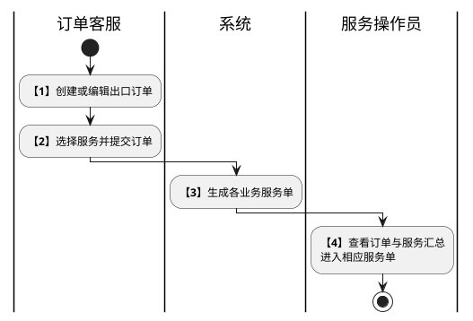

# 第017篇

> 本篇定位：服务协同管理；主要内容：出口订单服务汇总、紧急预警、服务跳转、预配执行与操作日志；文档角色：模块档；文档ID：280F0AA83A

共用定义见[综合订单与服务协同实体](../PRD.高捷物流系统.第8册.平台共用与运营/PRD.高捷物流系统.第063篇.数据字典.7A3D9E1F50.md#doc-7A3D9E1F50-integrated-order-model)、[仓储模型与多式干线权限](../PRD.高捷物流系统.第8册.平台共用与运营/PRD.高捷物流系统.第064篇.角色与访问权限.5E31456F30.md#doc-5E31456F30-warehouse-trunk-access)。

## 1. 服务协同范围与来源

客服提交或编辑出口订单时选择服务，订单向各业务模块下发服务单，服务协同页面按订单汇总服务进度。该页面供客服和服务操作员查询、预警、查看订单、跳转服务单和导出，不替代各服务模块的正式作业入口。

| 步骤 | 参与方 | 处理与结果 |
| --- | --- | --- |
| 1 | 订单客服 | 创建或编辑出口订单 |
| 2 | 订单客服 | 选择服务并提交订单 |
| 3 | 系统 | 按已选择服务生成对应模块的服务单 |
| 4 | 服务操作员 | 在服务协同页面按订单查看各服务的汇总状态并进入相应服务单 |

订单信息承接出口订单，订舱信息承接空运订舱。已取消订单不纳入该页面；各类服务汇总排除已终止和已取消的服务单。账号只可查看数据权限范围内的订单及服务，服务跳转不能扩大操作权限。

## 2. 各项服务的汇总状态

以下判定作用于同一订单的同类服务单；已取消、已终止的服务单不参与汇总。未生成该类服务单时显示“无服务”。已有服务单全部被排除后应显示何种状态，来源没有单独定义；不以空集合推断为已完成。各服务单实际状态仍由所属业务模块维护。

| 服务 | 待服务条件 | 完成阶段条件 | 进行中条件 |
| --- | --- | --- | --- |
| 预配 | 全部发送状态为待发送 | 全部海关状态为接受申报或提运单放行，显示已完成 | 不符合待服务、已完成或无服务时显示服务中 |
| 交运 | 全部发送状态为待发送 | 全部发送状态为已发送，显示已完成 | 不符合待服务、已完成或无服务时显示服务中 |
| 提单 | 全部提单状态为待出提单 | 全部为已出提单或已交单且至少一张为已出提单时显示已出提单；全部为已交单时显示已交单 | 不符合待服务、已出提单、已交单或无服务时显示服务中 |
| 安检 | 全部为待安检 | 全部为已安检，显示已完成 | 不符合待服务、已完成或无服务时显示服务中 |
| 打板 | 全部为待打板 | 全部为已打板，显示已完成 | 不符合待服务、已完成或无服务时显示服务中 |
| 运输 | 全部为待调度 | 全部为已完成，显示已完成 | 不符合待服务、已完成或无服务时显示服务中 |
| 关务 | 全部为待接单 | 全部为已完成，显示已完成 | 全部为进行中时显示服务中；混合状态的归类尚待确认 |

仓储服务的来源定义同时包含“入库中、已入库、待出库、出库中、已出库”和查询枚举中的“已完成”，且入出库条件可能同时成立。仓储的统一名称与优先级尚待确认，不把其中一个口径作为确定映射。已明确的判据是：全部入库单待收货代表待服务，全部入库单已完成代表入库完成；全部出库单待出库代表待出库，全部出库单已完成代表出库完成。

## 3. 截单预警与查询结果

客服或操作员设置距截单时间的预警小时数。订单进入该预警时间范围时，紧急状态更新为“紧急”；订单状态成为已完成后，紧急状态更新为“正常”。阈值范围、整点边界、超过截单时间的处理、截单时间修改后的重算以及配置作用范围尚待明确。

列表先按紧急状态排序，紧急在前；同类状态再按截单时间升序。总数量、紧急、正常分类分别显示对应订单及数量。无截单时间订单的排序位置未定义，不自行补定。

查询须至少输入一个条件，否则提示“请先选择条件”；支持条件组合。按查询导出只导出已有查询结果，未执行查询时提示“需要录入条件查询后才能导出”，导出 Excel 字段与服务列表一致。查询条件重置是否立即刷新，来源两处定义相反，尚待确认。

**界面原型概述 · 服务协同查询与分类**

- **区域字段或业务元素**：总运单号、订单号、启运港、目的港、航司代码、出港日期、截单时间、预计到货时间、紧急状态、订单状态、预配状态、交运状态、提单状态、安检状态、打板状态、运输状态、仓储状态、关务状态；查询、重置、展开、收起；总数量、紧急、正常分类。
- **区域级通用规则**：筛选条件均选填且可组合；展开显示其余条件，收起保留首行。

| 字段或控件特例 | 界面特例或可见反馈 |
| --- | --- |
| 总运单号、订单号 | 模糊查询 |
| 启运港、目的港 | 候选取空港三字代码 |
| 航司代码 | 候选取航司二字代码 |
| 出港日期 | 日期区间；来源为订舱头程日期 |
| 截单时间、预计到货时间 | 时间区间；预计到货指到达我司仓库或货站 |
| 紧急状态、订单状态 | 紧急状态选择紧急或正常；订单状态选择未提交、进行中或已完成 |
| 各服务状态 | 选择本篇服务汇总状态；仓储枚举待统一，不据页面现有标签反推业务状态 |

## 4. 服务列表、详情与日志

**界面原型概述 · 服务协同列表**

- **区域字段或业务元素**：总运单号、订单号、分单号、出港日期、截单时间、预计到货时间、紧急状态、启运港、目的港、提单属性、航司代码、货物类型、航线类型、头程航班、入仓毛重、入仓件数、入仓体积、航司供应商、订单状态及八项服务汇总状态；预警设置、按查询导出、自定义列表、查看、操作日志。
- **区域级通用规则**：列表只读展示订单与服务汇总；自定义列表控制列显隐并在本地保留设置。

| 字段或控件特例 | 界面特例或可见反馈 |
| --- | --- |
| 分单号 | 出口订单总运单下存在分单时显示 |
| 出港日期、截单时间、提单属性、航司代码、货物类型、航线类型、头程航班、航司供应商 | 订舱完成后显示对应订舱结果；截单时间取头程航班截单时间 |
| 入仓毛重、入仓件数、入仓体积 | 取出口订单货物汇总的入仓数据 |
| 预计到货时间 | 取出口订单总运单信息 |
| 服务状态 | 有服务时点击进入对应服务单；无服务不跳转 |
| 预警设置 | 弹窗以小时填写距截单时间阈值并提交 |

**界面原型概述 · 订单查看**

- **区域字段或业务元素**：订单基本信息、货物汇总、总运单信息、分单货物信息、分单服务信息、分单附件资料。
- **区域级通用规则**：按出口订单详情对应区域只读展示；不提供总运单信息补录操作。

**界面原型概述 · 服务操作日志**

- **区域字段或业务元素**：服务名称筛选；服务名称、操作名称、操作内容、操作人、操作时间。
- **区域级通用规则**：弹窗只读汇总各服务单已记录的操作日志，支持按服务名称筛选，不生成另一份独立操作记录。

## 5. 预配发送服务

### 5.1 聚合、发送与回执

预配执行列表只纳入业务类型为出口空运且选择预配发送的订单；同一大订单的多张分单选择该服务时，列表仍只展示一张大订单维度的预配执行单。执行单供应商取订单配置，默认广州电子口岸管理公司。

发送弹窗按大订单展示主单与参与预配的分单，并发送到广州电子口岸。来源正文称“所有子订单”，明细定义却只包括选择预配的分单，未选择服务的分单是否显示待确认。

每张主单或分单分别记录发送状态和海关回执，不能互相替代。发送状态为待发送、已发送、发送失败、发送中；海关状态为接收申报、待人工审核、提运单放行、退单、待申报、申报中。主单发送时间与分单发送时间各显示最近一次；来源执行列表在主单与全部分单均已发送时记录服务完成时间。

本篇第2章汇总却在全部海关状态为接受申报或提运单放行时显示完成，空运订单既有规则又以收到翌飞预配状态作为完成依据。三者的时间点、状态名称“接收/接受申报”和接口供应商均未统一。另有综合订单提交生成服务记录、空运客服手动发送才生成服务单、来源执行列表已有服务单三种建单描述；不得直接覆盖任一既有口径。

进行中的预配服务允许取消或终止：取消不生成该服务商品的应收应付，终止应生成应收应付。外部已申报后能否取消、是否需要撤回报文、收费的计价时点与重复结算保护待确认。批量发送对发送失败、发送中、已发送记录的资格，以及重试、超时、重复回执和部分成功处理也未定义。

### 5.2 界面原型概述

**界面原型概述 · 预配服务查询与列表**

- **区域字段或业务元素**：查询含总运单号、订单号、服务单号、客户、服务单状态；列表含服务单号、订单号、总运单号、分单号、客户、供应商、建单时间、主单发送时间、分单发送时间、服务完成时间；操作含查询、重置、发送、取消服务、终止服务。
- **区域级通用规则**：查询用于筛选，列表按关联订单与预配记录只读展示；无条件查询全部授权数据，按建单时间倒序，重置清空条件。

| 字段或控件特例 | 界面特例或可见反馈 |
| --- | --- |
| 总运单号、订单号、服务单号、客户 | 精确批量查询；服务单状态单选 |
| 分单号 | 展示该大订单选择预配服务的多张分单 |
| 建单时间 | 来源取大订单创建时间，不推定为预配实际生成时间 |
| 发送 | 打开本次大订单的预配发送弹窗 |

**界面原型概述 · 预配发送弹窗**

- **区域字段或业务元素**：查询含发送状态、海关状态；明细含主/子订单类型、总运单号、分单号、重量、件数、供应商、发送状态、海关状态、查看、编辑、查看回执；另有查询、重置、发送。
- **区域级通用规则**：按主单或当前分单展示对应明细，状态筛选支持多选，发送及回执结果按第5.1节展示。

| 字段或控件特例 | 界面特例或可见反馈 |
| --- | --- |
| 主订单的分单号 | 不显示 |
| 查看、编辑、查看回执 | 待发送显示三个入口，其他发送状态只显示查看及查看回执 |
| 重量、件数 | 取当前主单或分单的毛重和件数；与既有优先入仓、缺失时询问使用预计数据的预配规则有来源差异，待确认 |

### 5.3 申报资料来源与查看

下表定义本场景申报资料的取得方式，不以源截图位置作为业务字段名。

| 申报资料 | 取得或默认规则 |
| --- | --- |
| 总提运单号、航班号、航班日期 | 当前总运单及对应航班信息；子订单另带当前分单号 |
| 离境地、装货地 | 始发港代码和中文名称 |
| 承运人 | 航空公司代码 |
| 货物海关状态 | 本来源默认进出口货 |
| 支付方式 | 当前主单或分单的支付方式；来源另一列写回传接口状态，优先级待确认 |
| 托运地国家 | 来源误写始发港代码与中文名称；国家取值待确认 |
| 卸货地 | 本来源默认ATC88，适用关区和业务范围待确认 |
| 装载时间 | 航班日期；日期是否足以满足申报时间格式待确认 |
| 总件数、总毛重、货物信息 | 当前主单或分单的件数、毛重、英文品名 |
| 舱单传输人 | 本来源默认5141761575765广东高捷航运物流有限公司，不推广为其他申报主体的固定值 |
| 发货人、收货人 | 分别取当前主单或分单的名称、国家代码、电话、地址；通讯类别默认TE电话 |
| 危险品编码、危险品联系人及通讯类别、通讯号码 | 本来源取空；不据此认定所有危险品申报均可缺失这些资料 |

**界面原型概述 · 预配申报资料与回执**

- **区域字段或业务元素**：申报资料展示第5.3节全部字段；回执展示报文功能、回执状态码、回执内容、回执时间、接收时间、返回。
- **区域级通用规则**：查看页按当前主单或分单只读显示申报内容，回执时间与本系统接收时间分开显示。

| 字段或控件特例 | 界面特例或可见反馈 |
| --- | --- |
| 分单号 | 仅子订单查看时显示 |
| 总毛重 | 来源在查看页面标为可编辑，与查看语义及待发送编辑入口冲突；未确认前不据此开放全部状态修改 |

来源第27项重名“发货人名称”却取收货人名称，不能据此创建第三个未命名的收发货主体。具体编辑字段、校验和保存后的再次发送规则尚待确认。
