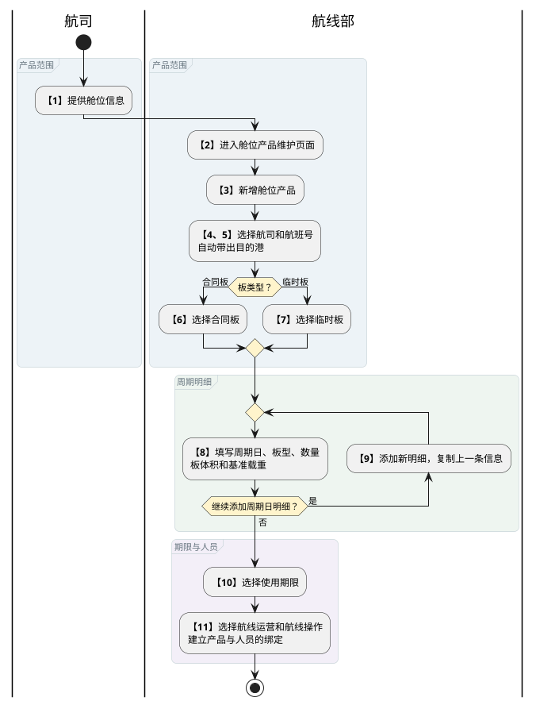
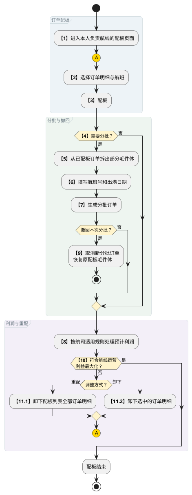

# 第020篇

> 本篇定位：舱位管理与配板；主要内容：舱位产品、板型容量、实时余量、配板与利润计算；文档角色：模块档；文档ID：01F81010E3

**主流程入口：** 本篇关联[业务模式主流程总览](../PRD.高捷物流系统.第1册.需求框架/PRD.高捷物流系统.第003篇.业务模式主流程总览.460E66776A.md#doc-460E66776A-business-modes)、[前置准备与服务开通流程](../PRD.高捷物流系统.第1册.需求框架/PRD.高捷物流系统.第004篇.前置准备与服务开通流程.852BDA78EA.md#doc-852BDA78EA-service-readiness)。

## 1. 舱位产品与实时查询

舱位产品定义航班可用板型和容量，实时查询汇集已订与剩余体积；已完成订舱的订单进入[空运配板](#doc-01F81010E3-section-9fde017272ed)，按航班分配板位并计算预计利润。

**业务入口：** 舱位产品

**概念模型：** [数据字典 · 空运订单与履约实体](../PRD.高捷物流系统.第8册.平台共用与运营/PRD.高捷物流系统.第063篇.数据字典.7A3D9E1F50.md#doc-7A3D9E1F50-domain-air-fulfillment)

### 1.1 舱位产品页面交互规则

#### 1.1.1 列表与提交行为

- 舱位产品列表采用分页结构，每页默认显示10条记录。

- 新增舱位产品时显示“提交”“取消”按钮；编辑舱位产品时显示“保存”“取消”按钮。

- 提交成功，页面显示“已提交成功！”提示。

- 若页面有输入项不符合输入规范或未填写必填项，则该输入项高亮提示，“提交”和“保存”按钮置灰，不可点击。

### 1.2 舱位产品与实时查询业务范围、角色与流程

#### 1.2.1 舱位产品业务范围

本节定义舱位产品的查询、新增、修改，以及按航班和出港日期查询舱位使用情况的规则。

#### 1.2.2 业务入口与操作

| 系统 | 一级菜单 | 二级菜单 | 说明 |
| --- | --- | --- | --- |
| 空运工作台 | 舱位管理 | 舱位产品管理 | 航线部维护的舱位产品展示界面。 |
| 空运工作台 | 舱位管理 | 舱位实时查询 | 实时查询舱位使用情况 |

#### 1.2.3 舱位计算术语

受控术语定义见 [数据字典 · 受控业务术语](../PRD.高捷物流系统.第8册.平台共用与运营/PRD.高捷物流系统.第063篇.数据字典.7A3D9E1F50.md#doc-7A3D9E1F50-domain-values)。

本篇使用的舱位计算术语如下：

| 专用名词 | 名词解释 |
| --- | --- |
| 基准载重 | 航司与高捷签订合同板时约定的板型载重基准。月结时，板上货物重量未达到该基准载重的，高捷需向航司支付惩罚金。 |
| 已订舱位体积 | 基于已经绑定提单号的主订单，计算以航班号+出港日期的维度上已经被客户订舱的体积。 |
| 剩余舱位体积 | 舱位总体积-已订舱位体积。以航班号+出港日期为维度，当前业务可以销售的舱位。 |

#### 1.2.4 参与角色与职责

参与角色为航线运营、航线操作；操作授权见[空运操作权限](../PRD.高捷物流系统.第8册.平台共用与运营/PRD.高捷物流系统.第064篇.角色与访问权限.5E31456F30.md#doc-5E31456F30-air-actions)。

#### 1.2.5 舱位产品维护流程

舱位产品先区分合同板与临时板，再按周期日维护板型明细，并设置期限及负责人员。

每次新增只选择一种板类型；明细、期限与人员维护的完整规则见下表。

| 环节 | 参与方 | 处理与业务结果 | 后续环节 |
| --- | --- | --- | --- |
| 1. 提供舱位 | 航司 | 航司提供的，供高捷使用的舱位（板）。航司提供的舱位有两种：合同舱位（合同板），航司基于航班号、星期固定给高捷提供为期一年的板的数量，不同航司提供不同体积的合同板；临时舱位（临时板），航司基于市场的淡季和旺季情况临时给高捷提供短期的舱位（板）。临时提供的舱位（板）不涉及航司的基准载重惩罚机制。 | 2 |
| 2. 进入舱位产品维护页面 | 航线部 | 航线部进入“舱位产品维护”菜单 | 3 |
| 3. 新增产品 | 航线部 | 点击新增，跳出弹窗 | 4 |
| 4. 选择航司和航班号 | 航线部 | 选择航司和航班号，航司和航班号有关联关系。 | 5 |
| 5. 默认带出目的港 | 航线部 | 选择航司和航班号后，自动带出目的港。 | 6/7 |
| 6. 合同板维护 | 航线部 | 板类型选择“合同板” | 8 |
| 7. 临时板维护 | 航线部 | 板类型选择“临时板” | 8 |
| 8. 填写某个星期的板型、数量、板体积、基准载重 | 航线部 | 基于航司给的信息，选择周期日、板型、基准载重和数量 | 9 |
| 9. 点击添加，添加新明细，重复选择周期日的板信息 | 航线部 | 添加新明细，复制上一条明细的信息 | 10 |
| 10. 选择使用期限 | 航线部 | 选择合同板或临时板的有效期限。过了有效期限，维护的板体积失效。 | 11 |
| 11. 选择航线运营和操作 | 航线部 | 航线运营默认取当前产品的维护人，允许修改。选择航线操作后，舱位产品与航线运营、航线操作建立绑定，由两类人员共同维护该航线的订舱需求。 | — |

#### 1.2.6 舱位产品维护约束

| 流程点 | 操作 | 前置条件 | 处理规则 |
| --- | --- | --- | --- |
| 3 | 新增产品 | 1. 一级列表中，同一航班号的明细按合同板和临时板区分。 1. 每次新增只能选择临时板或合同板其中一种；点击一次新增生成一条一级明细，一条一级明细可包含多条二级明细。 | 新增区域的每条明细对应一条二级明细。例如，“CZ、周一、Q3”和“CZ、周一、Q5”是两条二级明细。 |
| 3 | 编辑产品 | 1. 仅一级列表可以编辑 1. 当编辑时，仅周期日、板型、基准载重、数量、有效期限、航线运营、航线操作可以编辑。 | 1. 符合修改条件时，允许修改并提交。 2. 不符合修改条件时，相关字段置灰且不可编辑。 3. 修改周期日、板型、基准载重或数量后，更新对应的二级列表数据。 4. 修改有效期限、航线运营或航线操作后，更新对应的一级列表数据。 |

### 1.3 舱位产品管理与实时查询功能规则

#### 1.3.1 舱位产品管理

- 舱位产品查询页面，可查询各航司舱位产品。

#### 1.3.2 筛选项定义

**界面原型概述 · 舱位产品筛选栏**

| 字段或控件 | 个别界面约束或可见反馈 |
| --- | --- |
| 板类型 | 取自板型管理基础数据；默认值：全部。 |
| 航司代码 | 配置：；航司主数据；全部；BR；TK；CI；ZH；UL；HU；CA；KA；3U；MU；CZ；MH；默认值：全部。 |
| 航线运营 | 选择用户中心空运出口部的航线运营人员，默认全部；示例姓名不作为固定候选值。 |
| 有效期限 | 支持按单日选择日期；若不筛选，则默认显示所有日期。只要是有效期限范围内的明细都显示；默认值：开始日期-结束日期。 |
| 航班号 | 输入项，需要精确搜索；默认值：全部。 |
| 创建时间 | 支持按单日选择日期；若不筛选，则默认显示所有日期，只要是筛选范围内创建的明细都显示；默认值：开始日期-结束日期。 |

#### 1.3.3 舱位产品查询规则

**场景：** 舱位产品管理-查询列表

**范围：** 查看所有产品明细

**参与角色：** 航线部

**触发与入口：** 进入舱位产品管理，通过浏览和筛选，快捷找到相关产品

**业务结果：** 列表展示符合筛选条件的舱位产品，并支持新增、编辑和删除。

**处理规则**

进入此页面，页面中的产品数据按照如下规则进行展示：

1. 航线部员工进入此页面时，列表默认筛选出与该员工绑定的航线产品；切换航司代码为“全部”后的可查询范围见[舱位产品数据范围](../PRD.高捷物流系统.第8册.平台共用与运营/PRD.高捷物流系统.第064篇.角色与访问权限.5E31456F30.md#doc-5E31456F30-air-scope)。按照创建时间进行排序，优先显示最新创建时间。

1. 默认查询后仅展示一级列表，每新增一次生成一条一级明细；点击展开图标后展示该一级明细下的二级列表。

在二级列表中，周期日和板型唯一。如星期一+Q5 和 星期一+Q3 是两条数据。如果有两条重复数据，系统不生成。

操作项功能：

1. 新增：新增舱位产品

1. 编辑：编辑舱位产品

1. 删除：删除舱位产品

**业务分支**

分页展示。一级列表最多展示10条。二级列表最多展示20条。

**界面原型概述 · 舱位产品分层列表**

- **区域字段或业务元素**：一级列表含航司代码、航班号、目的港代码、板类型、航线运营、航线操作、有效期限、创建时间、公司/部门、编辑、删除、展开/收起；二级列表含周期日、板型、板体积、基准载重、板数。
- **区域级通用规则**：列表字段只读，编辑从一级产品入口进行；二级明细在该产品下展开，不作为独立产品重复列出。

删除已被订舱使用的产品、删除最后一条周期明细，以及容量修改后对已有订舱的影响未定义。重复周期日与板型均不得新增；发现重复后是拒绝整次保存还是仅拒绝重复行，须确认。

#### 1.3.4 新增舱位产品

- 在舱位产品管理页面点击“新增”，即可新增舱位产品

#### 1.3.5 字段定义

**界面原型概述 · 舱位产品新增**

| 字段或控件 | 个别界面约束或可见反馈 |
| --- | --- |
| 航司 | 必填，取自基础数据；新增场景要求选择，编辑产品时只读。来源字段表未区分入口而写不可编辑，不能据此把新增入口置为无法填写。 |
| 航班号 | 必填，取自基础航班数据，并按所选航司联动。 |
| 目的港、板体积 | 自动带出；选填。 |
| 板类型 | 临时板/合同板；必填；默认值：临时板。 |
| 周期日 | 选项：周一、周二、周三、周四、周五、周六、周日；编辑联动见[舱位产品维护约束](#doc-01F81010E3-section-93a33c11519b)；必填；可编辑。 |
| 板型 | 取自基础数据；必填。 |
| 基准载重、数量 | 正整数即可；选填。 |
| 有效期限 | 选择日期；格式：YYYY-MM-DD 至 YYYY-MM-DD；必填。 |
| 创建时间 | 格式：YYYY-MM-DD HH:mm；选填。 |
| 航线运营 | 取自用户中心；必填；默认值：创建人姓名。 |
| 航线操作 | 取自用户中心；必填；初始不设值。 |

板体积和创建时间的可编辑标记，与自动带出及编辑白名单不一致；沿用自动展示规则，是否允许手工调整待确认。新增时的航司、航班号、板类型选择，与编辑时锁定三者须区分。一级产品有效期重叠的精确判据及起止日边界未明确。

#### 1.3.6 舱位产品新增规则

**场景：** 舱位产品管理-新增

**范围：** 新增舱位产品

**参与角色：** 航线运营

**触发与入口：** 进入舱位产品管理界面，点击“新增”，弹出新增窗口

**业务结果：** 校验通过后新增舱位产品；数据重复或输入不符合要求时不提交并给出提示。

**处理规则**

进入《新建》窗口，分别选择航司、航班号、板类型。默认展示一条明细。

按照表头选择周期日、板型。

填写基准载重和数量。

选择航线运营和航线操作。

**业务分支**

1. 点击添加，复制上一条明细。

1. 所有候选项选择为单选。

1. 周期日和板型唯一。如果有两条重复数据，系统报错，提示“数据重复，请重新录入”。

1. 航司跟航班号有关联关系。确定了航司和板型，自动带出板体积。

1. 一级列表中，同一航班号、有效时期范围之内、板类型一样的数据不允许重复，系统报错。提示“数据重复，请重新录入”

#### 1.3.7 舱位实时查询

- 实时查询舱位使用情况

#### 1.3.8 筛选项定义

**界面原型概述 · 舱位实时查询筛选栏**

| 字段或控件 | 个别界面约束或可见反馈 |
| --- | --- |
| 航司 | 取自基础数据；默认值：全部。 |
| 航班号 | 取自基础数据，和航司有关联关系；默认值：全部。 |
| 始发港 | 取自基础数据，和航班有关联关系；默认值：全部。 |
| 目的港 | 取自基础数据，和航班有关联关系；默认值：全部。 |
| 出港日期 | 格式：YYYY-MM-DD 至 YYYY-MM-DD。 |

#### 1.3.9 舱位实时查询与备注规则

**场景：** 舱位管理-舱位实时查询

**范围：** 查看舱位的实际使用情况

**参与角色：** 业务人员、航线运营、航线操作；操作授权见[空运操作权限](../PRD.高捷物流系统.第8册.平台共用与运营/PRD.高捷物流系统.第064篇.角色与访问权限.5E31456F30.md#doc-5E31456F30-air-actions)。

**触发与入口：** 进入舱位实时查询页面，通过浏览和筛选，快捷找到舱位信息

**业务结果：** 列表展示符合筛选条件的航班舱位、已订舱位和剩余舱位信息。

**处理规则**

1. 未执行查询时，航班按出港日期升序排列，出港日期最近的优先显示；列表分页展示，每页10条。

2. 始发港、目的港、出港日期、起飞时刻、到港时刻、截单时刻取自基础数据。舱位总体积根据航线部维护的舱位产品数据，按航班和出港日期计算。

3. 已订舱位体积为已绑定提单号且订舱服务已完成的订单货物体积之和。货物未入仓时取客户提供的体积；入仓后取仓库提供的体积；进入货站后取入货站体积。

4. 剩余舱位体积=舱位总体积-已订舱位体积。

5. 备注编辑的角色与产品归属限制见[舱位实时查询备注权限](../PRD.高捷物流系统.第8册.平台共用与运营/PRD.高捷物流系统.第064篇.角色与访问权限.5E31456F30.md#doc-5E31456F30-air-actions)及[数据范围](../PRD.高捷物流系统.第8册.平台共用与运营/PRD.高捷物流系统.第064篇.角色与访问权限.5E31456F30.md#doc-5E31456F30-air-scope)。

**界面原型概述 · 舱位实时查询结果与备注**

- **区域字段或业务元素**：航司、航班号、始发港、目的港、出港日期、起飞时刻、到港时刻、截单时刻、已订舱位体积/舱位总体积、剩余舱位体积、备注、航线运营；备注弹窗含备注、确认、取消。
- **区域级通用规则**：除获授权的备注编辑外均只读；体积指标按本节计算规则展示。确认保存备注，取消关闭弹窗。

未入仓、已入仓、已进货站的体积取值优先级已明确；实测缺失时是否退回较早来源、剩余体积为负时是否允许继续销售，以及取消或作废订单何时释放已订体积尚未明确，不将负值自动截为零。

## 2. 空运配板

**主流程入口：** 本篇关联[业务模式主流程总览](../PRD.高捷物流系统.第1册.需求框架/PRD.高捷物流系统.第003篇.业务模式主流程总览.460E66776A.md#doc-460E66776A-business-modes)、[普货进出口关务流程](../PRD.高捷物流系统.第1册.需求框架/PRD.高捷物流系统.第005篇.普货进出口关务详细流程.D409606401.md#doc-D409606401-general-cargo-customs)、[跨境电商 BC 出口关务流程](../PRD.高捷物流系统.第1册.需求框架/PRD.高捷物流系统.第006篇.跨境电商BC出口关务详细流程.E21C200E67.md#doc-E21C200E67-bc-export-customs)、[跨境电商 BC 与个人物品 CC 进口流程](../PRD.高捷物流系统.第1册.需求框架/PRD.高捷物流系统.第007篇.跨境电商BC、个人物品CC进口详细流程.94C028FB51.md#doc-94C028FB51-bc-cc-import)、[跨境电商 BBC 进口入出区与调拨流程](../PRD.高捷物流系统.第1册.需求框架/PRD.高捷物流系统.第008篇.跨境电商BBC进口详细流程.B7B938B684.md#doc-B7B938B684-bbc-import)、[跨境电商 BBC 进口特殊业务流程](../PRD.高捷物流系统.第1册.需求框架/PRD.高捷物流系统.第008篇.跨境电商BBC进口详细流程.B7B938B684.md#doc-B7B938B684-special-operations)。

**业务入口：** 配板管理

**概念模型：** [数据字典 · 空运订单与履约实体](../PRD.高捷物流系统.第8册.平台共用与运营/PRD.高捷物流系统.第063篇.数据字典.7A3D9E1F50.md#doc-7A3D9E1F50-domain-air-fulfillment)

### 2.1 配板页面交互规则

#### 2.1.1 列表与校验行为

- 订单列表页面，默认分页结构，每页默认10条记录显示。

- 提交成功，页面显示“已提交成功！”提示。

- 若页面有输入项不符合输入规范或未填写必填项，则该输入项高亮提示，“提交”和“保存”按钮置灰，不可点击。

### 2.2 空运配板业务范围、角色与流程

#### 2.2.1 配板业务范围

本节定义已订舱订单与航班板位的匹配、卸下、分批、撤回和预计利润计算规则。

#### 2.2.2 业务入口与操作

| 系统 | 一级菜单 | 二级菜单 | 说明 |
| --- | --- | --- | --- |
| 空运工作台 | 舱位管理 | 配板管理 | 航线部的配板界面 |

#### 2.2.3 参与角色与职责

参与角色为航线部；操作授权和负责航线范围见[空运操作权限](../PRD.高捷物流系统.第8册.平台共用与运营/PRD.高捷物流系统.第064篇.角色与访问权限.5E31456F30.md#doc-5E31456F30-air-actions)及[数据范围](../PRD.高捷物流系统.第8册.平台共用与运营/PRD.高捷物流系统.第064篇.角色与访问权限.5E31456F30.md#doc-5E31456F30-air-scope)，订单前置条件见[配板、利润与分批规则](#doc-01F81010E3-section-2a7591d54113)。

#### 2.2.4 配板管理流程

航线部在配板后判断是否分批，并根据预计利润决定是否重配；分批也可撤回并恢复原配板毛件体。

图中连接符 A 返回订单与航班选择；撤回分支仅展示本次撤回结果。航司差异、毛件体汇总和各环节操作见下表及[配板、利润与分批规则](#doc-01F81010E3-section-2a7591d54113)。

| 环节 | 参与方 | 处理与业务结果 | 后续环节 |
| --- | --- | --- | --- |
| 1. 进入配板管理页面 | 航线部 | 航线运营只能看到本人管理的航线。 | 2 |
| 2. 选择订单与航班 | 航线部 | 在待配板列表勾选一条或多条订单明细，并在配板列表选择一个航班。 | 3 |
| 3. 点击“配板”，将一条或多条订单明细跟航班上的板匹配 | 航线部 | 配板列表上的货物总体积是配上去的多条明细的体积之和。货物总毛重是配上去的多条明细的毛重之和。 | 4 |
| 4. 是否分批 | 航线部 | 当运营人员凭借经验判断此订单的货物一批运不完时，走下一步5。判断此货物不需分批时，下一步8 | 5/8 |
| 5. 从已配板的订单中拆出一部分件重体 | 航线部 | 点击分批后，从该订单中拆出件重体 | 6 |
| 6. 填写航班号和出港日期 | 航线部 | 运营员凭借经验填写合适的航班号和出港日期 | 7 |
| 7. 生成分批订单 | 航线部 | 生成与原订单号相同的分批订单。配板页面拆出的毛件体不改变原订单的实际毛件体；需要撤回时进入步骤9，否则进入步骤8。 | 8/9 |
| 9. 撤回 | 航线部 | 点击撤回，新生成的订单取消，新拆出的毛件体和原始订单拆出后的毛件体聚合。 | — |
| 8. 计算预计利润 | 航线部 | 按航司适用的[预计利润计算规则](#doc-01F81010E3-section-2a7591d54113)计算。 | 10 |
| 10. 判断是否符合航线运营利益最大化 | 航线部 | 航线运营根据经验判断；符合时配板结束，不符合时进入步骤11。 | 结束/11 |
| 11. 重配或选择一条或多条订单明细卸下 | 航线部 | 重配是配板界面展示的所有列表批量卸下。卸下是勾选某几条订单明细然后卸下。之后重新配板。 | 下一步2 |

### 2.3 空运配板功能与规则

#### 2.3.1 配板管理页面

- 航线部基于已经订舱的订单，确定同一航班号的订单如何配板才能实现当日航班利益最大化。

#### 2.3.2 配板筛选项

订舱与配板共用筛选项及场景约束见[对应业务场景](PRD.高捷物流系统.第022篇.空运-订舱管理.6A0360EC35.md#doc-6A0360EC35-section-73798dacec26)。

#### 2.3.3 配板、利润与分批规则

航线部对已完成订舱服务、已绑定提单号、航班号和出港日期的订单执行配板。在待配板列表勾选订单，在配板列表选择目标航班，点击“配板”后建立匹配关系，货物总体积、总毛重和预计利润随之更新。

**界面原型概述 · 配板结果与操作**

- **区域字段或业务元素**：待配板订单、目标航班、舱位总体积、板数、货物总体积、货物总毛重、预计/入仓/提单毛件体、货物尺寸、特殊物品、备注、配板、卸下、分批、撤回、重配。
- **区域级通用规则**：按当前订单和航班展示配板结果；配板、卸下和分批后更新货物总体积与总毛重。

| 字段或控件特例 | 适用条件 | 界面特例或可见反馈 |
| --- | --- | --- |
| 舱位总体积、板数 | 展示航班信息时 | 舱位总体积取舱位实时查询；板数取舱位产品中该航班可用板数。 |
| 货物总体积、货物总毛重 | 展示配板结果时 | 分别为已配订单体积、毛重之和。 |
| 货物毛件体 | 展示货物信息时 | 按预计、入仓、提单三类，以毛重/件数/体积展示。 |
| 货物尺寸 | 货物为托盘货时 | 展示客服录入的尺寸；其他货物不展示。 |
| 特殊物品 | 订单已选择特殊物品时 | 展示订单选择的特殊物品。 |
| 备注 | 航线运营维护配板时 | 由航线运营填写，可随配板情况修改。 |

**预计利润计算**

| 航司 | 预计利润 |
| --- | --- |
| CZ、MH | 卖价×收客户重量−成本×付航司重量−当前航班剩余基重×合同罚金 |
| TK | 卖价×收客户重量−成本×付航司重量 |
| CA | 不计算预计利润。 |

| 计算项 | 取值或计算口径 |
| --- | --- |
| 卖价 | 订单运费卖价。 |
| 收客户重量 | （提单体积重−提单毛重）×分泡率＋提单毛重。 |
| 成本 | 航线确认订单时填写的成本。 |
| 付航司重量 | 计费重。 |
| 当前航班合同基重 | 各板“数量×基准载重”之和。 |
| 当前航班剩余基重 | 当前航班合同基重−各板毛重之和。 |

**卸下、分批与撤回**

- 卸下：将选中的已配板订单卸下，并更新货物总体积和总毛重。
- 分批：已配板货物总体积远大于可用舱位总体积、只能承运一部分时，航线部将该订单的一部分毛件体拆为新分批订单。航班号和出港日期默认与原订单相同，允许修改。确认后在配板列表生成新数据，提单号不变；分批订单号及原订单实际毛件体边界见[配板管理流程](#doc-01F81010E3-section-9303252e3c5e)。
- 撤回：分批后显示“撤回”按钮；点击后取消新分批订单，将拆出的毛件体与原订单剩余毛件体合并，恢复原配板毛件体。
- 重配：批量卸下配板界面展示的全部订单明细，再重新配板。
