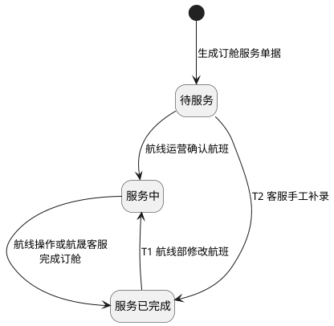

# 第021篇

> 本篇定位：空运-订舱管理；主要内容：订舱前置状态、航班选择、价格聚合与修改；文档角色：模块档；文档ID：6A0360EC35

**主流程入口：** 本篇关联[业务模式主流程总览](../PRD.高捷物流系统.第1册.需求框架/PRD.高捷物流系统.第003篇.业务模式主流程总览.460E66776A.md#doc-460E66776A-business-modes)、[普货进出口关务流程](../PRD.高捷物流系统.第1册.需求框架/PRD.高捷物流系统.第005篇.普货进出口关务详细流程.D409606401.md#doc-D409606401-general-cargo-customs)、[跨境电商 BC 出口关务流程](../PRD.高捷物流系统.第1册.需求框架/PRD.高捷物流系统.第006篇.跨境电商BC出口关务详细流程.E21C200E67.md#doc-E21C200E67-bc-export-customs)、[跨境电商 BC 与个人物品 CC 进口流程](../PRD.高捷物流系统.第1册.需求框架/PRD.高捷物流系统.第007篇.跨境电商BC、个人物品CC进口详细流程.94C028FB51.md#doc-94C028FB51-bc-cc-import)、[跨境电商 BBC 进口入出区与调拨流程](../PRD.高捷物流系统.第1册.需求框架/PRD.高捷物流系统.第008篇.跨境电商BBC进口详细流程.B7B938B684.md#doc-B7B938B684-bbc-import)、[跨境电商 BBC 进口特殊业务流程](../PRD.高捷物流系统.第1册.需求框架/PRD.高捷物流系统.第008篇.跨境电商BBC进口详细流程.B7B938B684.md#doc-B7B938B684-special-operations)。

## 1. 空运-订舱管理

**业务入口：** 订舱管理

**概念模型：** [数据字典 · 空运订单与履约实体](../PRD.高捷物流系统.第6册.运营支撑/PRD.高捷物流系统.第061篇.数据字典.7A3D9E1F50.md#doc-7A3D9E1F50-domain-air-fulfillment)

**消息规则入口：** [消息推送规则](../PRD.高捷物流系统.第6册.运营支撑/PRD.高捷物流系统.第064篇.消息推送.5F950AB3B1.md#doc-5F950AB3B1-section-ef4930471a81)

### 1.1 订舱页面交互规则

#### 1.1.1 列表与提交行为

- 订单列表页面，默认分页结构，每页默认10条记录显示。

- 提交订舱信息时显示“提交”“取消”按钮；修改订舱信息时显示“保存”“取消”按钮。

- 提交成功，页面显示“已提交成功！”提示。

- 若页面有输入项不符合输入规范或未填写必填项，则该输入项高亮提示，“提交”和“保存”按钮置灰，不可点击。

### 1.2 空运订舱业务范围、角色与流程

#### 1.2.1 订舱业务范围

本篇定义订舱订单的查询、航程确认、航程补充、订舱完成、盈利校验和航班信息修改规则。

#### 1.2.2 业务入口与操作

| 系统 | 一级菜单 | 二级菜单 | 说明 |
| --- | --- | --- | --- |
| 空运工作台 | 订单管理 | 主订单管理 | 客服创建、编辑主订单。 |
| 空运工作台 | 订单管理 | 子订单管理 | 客服创建、编辑、合成子订单。 |
| 空运工作台 | 订单管理 | 订舱管理 | 航线填写订舱服务信息，完成订舱服务。 |

#### 1.2.3 业务术语

受控术语定义见 [数据字典 · 受控业务术语](../PRD.高捷物流系统.第6册.运营支撑/PRD.高捷物流系统.第061篇.数据字典.7A3D9E1F50.md#doc-7A3D9E1F50-domain-values)。

#### 1.2.4 参与角色与职责

参与角色为管理员、航线部；操作授权见[空运操作权限](../PRD.高捷物流系统.第6册.运营支撑/PRD.高捷物流系统.第062篇.角色与访问权限.5E31456F30.md#doc-5E31456F30-air-actions)。

#### 1.2.5 订舱前置与完成流程

订单创建、子订单合成和补录流程见[空运订单管理流程](PRD.高捷物流系统.第020篇.空运-订单创建.5029269CA8.md#doc-5029269CA8-section-0de90fb8a71c)。订舱模块从待订舱订单进入航线处理开始：航线运营确认航班后，订舱服务变为“服务中”；航线操作补充航程并完成订舱后，订舱服务变为“服务已完成”，订舱信息同步回订单。

#### 1.2.6 订舱订单修改边界

订单字段、服务状态和提单号的修改边界见[空运订单异常与修改规则](PRD.高捷物流系统.第020篇.空运-订单创建.5029269CA8.md#doc-5029269CA8-section-9983c813182e)。订舱信息发生变更时同步回订单，并按[消息推送规则](../PRD.高捷物流系统.第6册.运营支撑/PRD.高捷物流系统.第064篇.消息推送.5F950AB3B1.md#doc-5F950AB3B1-section-ef4930471a81)发送结果通知。

### 1.3 空运订舱功能与规则

#### 1.3.1 订舱订单入口

- 订舱管理页面，航线部点击订单明细后，进入订舱详情页 。

#### 1.3.2 订舱字段

**界面原型概述 · 订舱**

- **区域字段或业务元素**：航司、头程航班、出港日期、头程目的地、头程航段、航线备注、起飞时刻、截单时刻、空运成本、卡车成本、指导价、提单属性、预计盈利规则、二程航段、二程目的地、三程航段、打板公司、航司折扣号、Handling Information、航线类型。

| 字段或控件特例 | 特例约束或业务结果 |
| --- | --- |
| 航司 | 取自基础数据；必填；初始不设值；可编辑。 |
| 头程航班 | 取自基础数据；必填；默认值：跟航司有关联关系。 |
| 出港日期 | 必填。 |
| 头程目的地 | 取自空港管理-三字代码；必填。 |
| 头程航段 | 取自航司管理；必填。 |
| 航司折扣号、Handling Informacion | 选填。 |
| 起飞时刻、截单时刻 | 取自航班号管理基础数据；格式 20:00；必填。 |
| 空运成本、指导价 | 正数，支持保留两位小数；必填；初始不设值。 |
| 卡车成本 | 正数，最多保留两位小数；选填；初始不设值。 |
| 提单属性 | 自营/非自营；必填。 |
| 预计盈利规则 | 可多选；大于等于/小于等于/大于/小于；必填；默认值：大于等于。 |
| 二程航段 | 取自航司基础数据；选填。 |
| 二程目的地 | 取自空港基础数据；必填。 |
| 三程航段 | 取自航司基础数据；必填；初始不设值。 |
| 打板公司 | MH 翡翠打板；JL 航晟打板；CZ 航晟打板；BR 货站打板；MU 货站打板；3U 货站打板；选填；默认值：自动带出。 |
| 航线备注 | 选填；初始不设值。 |
| 航线类型 | 直航/国内中转；选填；默认值：直航。 |

#### 1.3.3 订舱处理与盈利校验规则

**场景：** 订舱管理-订舱

**范围：** 填写订舱服务信息，生成订舱业务单据。

**参与角色：** 空运航线运营、空运航线操作、航晟客服

**触发与入口：** 进入订舱管理界面，点击订单状态=“待订舱”的订单。

**业务结果：** 航线运营确认航班后订舱服务变为“服务中”；航线操作或航晟客服完成订舱后，订舱服务变为“服务已完成”，订舱信息同步回订单。

**处理规则**

1. 航程信息和航程补充的角色授权见[订舱字段与操作权限](../PRD.高捷物流系统.第6册.运营支撑/PRD.高捷物流系统.第062篇.角色与访问权限.5E31456F30.md#doc-5E31456F30-air-actions)。空运航线运营的操作按钮为“取消”“确认航班”；空运航线操作、航晟客服的操作按钮为“取消”“订舱完成”。

2. 航线运营填写后点击“确认航班”，提交订舱信息并同步回客服订单，订舱服务状态变为“服务中”。航线操作填写后点击“订舱完成”，提交订舱信息并同步回客服订单，订舱服务状态变为“服务已完成”。对应通知按[消息推送规则](../PRD.高捷物流系统.第6册.运营支撑/PRD.高捷物流系统.第064篇.消息推送.5F950AB3B1.md#doc-5F950AB3B1-section-ef4930471a81)发送。

3. 订单状态为“待订舱”“待补录”或“待出提单”时，航线部可修改除提单属性外的字段，修改结果同步回客服订单；状态为“已出提单”“已交单”“待审核”或“已作废”时不得修改。

4. 必填项缺失或输入业务格式不符合要求时，相应字段高亮提示，“确认航班”“订舱完成”按钮置灰且不可点击。

**关联处理**

1. 预计盈利校验：航线运营根据当季航司市场成本、客户运费卖价和客户提供的预计毛件体，填写订单实际毛件体的允许区间。货物入仓后取实际毛件体；未选择入仓服务时，由客服手工录入客户再次提供的实际毛件体。实际毛件体不在允许区间内时，订单在客服“主订单管理”列表前置并标红，同时触发异常通知。客服与客户确认后修改毛件体和运费卖价并保存；修改后仍不符合预计盈利规则的，由航线部调整预计盈利规则。补料环节删除分单后，客服须手工修改预计毛件体和入仓毛件体；预计件数与入仓件数不一致且预计毛重与入仓毛重相差超过3%时，触发改单通知。以上通知按[消息推送规则](../PRD.高捷物流系统.第6册.运营支撑/PRD.高捷物流系统.第064篇.消息推送.5F950AB3B1.md#doc-5F950AB3B1-section-ef4930471a81)发送。

2. 允许亏损：默认不勾选。不勾选时，空运成本大于运费卖价则禁止提交。勾选后，若空运成本大于运费卖价，且`\|(运费卖价-空运成本-0.3)*计费重\|<=5000`，提交时弹出航线总监审核确认；提交审核后业务单据和订舱服务状态均变为“待审核”，审核通过后客服主订单状态变为“待补录”。该场景用于合同板未达到基准载重时避免航司惩罚金。

3. 航班修改：订单状态为“待补录”或“待出提单”时，航线部可修改航班信息；修改后，订舱服务状态由“服务已完成”变为“服务中”。

**订舱服务状态图 · 确认、完成与航班修改**

图中对象为同一张订舱服务单。正常确认、完成和航班修改按上述规则处理；无法取得状态时的客服手工补录边界见[主订单创建与服务状态规则](PRD.高捷物流系统.第020篇.空运-订单创建.5029269CA8.md#doc-5029269CA8-section-a5d48cac9f5b)。

- T1（航线部修改航班）：仅在主订单为“待补录”或“待出提单”时适用。该业务变更与客服手工状态补录不同，不表示客服可以将已完成服务回退。
- T2（客服手工补录）：无法取得订舱状态、客服线下确认后，可从“待服务”补录为“服务中”或“服务已完成”；前一种与正常确认同向，未重复绘线。客服不得手工将“服务已完成”回退为“待服务”或“服务中”。
- 亏损审核范围：图只覆盖不进入亏损审核的确定路径。提交亏损审核时主订单与订舱服务均进入“待审核”，但审核通过仅明确主订单转为“待补录”；服务的审核结果、拒绝及重提迁移仍待确认（[PRD自洽性问题](../../analysis/PRD自洽性问题.md) GJ-PRD-016、017）。图中未将未知结果连成“审核通过即服务完成”。

服务取消沿用[服务单状态规则](PRD.高捷物流系统.第020篇.空运-订单创建.5029269CA8.md#doc-5029269CA8-section-a5d48cac9f5b)。本图不设最终结束符，因为完成后仍存在符合条件的航班修改。

#### 1.3.4 合成主订单订舱入口

- 当子订单合成主订单后，订单类型为“合成主订单”。航线部点击该订单进入订舱界面。

#### 1.3.5 合成主订单订舱聚合规则

**场景：** 订舱管理-订舱

**范围：** 客服发出订舱指令后，航线部在订舱管理页面填写订舱信息。

**参与角色：** 空运航线部、航晟物流部

**触发与入口：** 客服录入补料信息并发出订舱服务指令后，订单进入“待订舱”状态。航线部可点击订单进入订舱页面。

**业务结果：** 航线部可查看合成主订单的聚合信息，并按订舱规则填写和提交订舱信息。

**处理规则**

合成主订单使用前述订舱字段和页面规则。航线部看到的数据按以下规则取值：

- 订单号：合成后的主订单号。

- 客户：展示全部子订单的客户。

- 始发港、目的港、航司产品、订舱要求：取客服合成主订单时填写的值。

- 中文品名：聚合全部分单的中文品名；每个分单最多显示三个，超过三个时以省略号标识，悬停可查看全部品名。

- 特殊货物：聚合全部分单的特殊货物。

- 预报毛件体：全部分单毛件体之和。

- 预计送货时间：取全部分单中最晚的送货时间。

- 运费卖价=`Σ(分单卖价*分单收客户重量)/Σ分单收客户重量`。

- 后段卡车卖价=`Σ分单卡车总费用/Σ分单提单计费重`。

- 卡车总费用=卡车单价*分单计费重。

- 分单计费重取`分单体积*166.66`与毛重中的较大值。

#### 1.3.6 订舱列表筛选项

**界面原型概述 · 订舱与配板共用筛选栏**

- **区域字段或业务元素**：订单号、提单号、客户、客服、分泡比例、始发港、目的港、业务员、出港日期、建单日期、航班号、特殊货物、航司。

| 字段或控件特例 | 特例约束或业务结果 |
| --- | --- |
| 订单号、提单号 | 模糊查询；初始不设值。 |
| 客户 | 取自合作方档案管理；模糊查询；初始不设值。 |
| 客服 | 取自用户中心；模糊查询；初始不设值。 |
| 分泡比例 | 0；0.1；0.2；0.3；0.4；0.5；0.6；0.7；0.8；0.9；1；默认值：全部。 |
| 始发港、目的港 | 取自基础数据；默认值：全部。 |
| 业务员 | 取自用户中心；模糊查询；默认值：全部。 |
| 出港日期、建单日期 | 选择日期 年/月/日 至 年/月/日；默认值：日期。 |
| 航班号 | 取自基础数据；精确查询；初始不设值。 |
| 特殊货物 | 锂电池；危险品；鲜活；枪械；默认值：全部。 |
| 航司 | 取自舱位产品管理中维护的航线运营人员和操作员绑定对应的航司；默认值：根据航线部角色默认勾选部分航司。 |

#### 1.3.7 订舱列表查询与修改规则

**场景：** 订舱管理-订舱列表

**范围：** 客服发出订舱指令后，航线部在订舱管理页面查看和寻找订单。

**参与角色：** 空运航线部、航晟物流部

**触发与入口：** 客服录入补料信息，发出订舱服务指令后，订单进入待补录状态。可点击订单号进行补录。

**业务结果：** 列表展示符合筛选条件的订舱订单，并按权限支持查看或修改航班信息。

**处理规则**

1. 列表依次按“待审核”“待补录”“待出提单”“已出提单”“已交单”“已作废”状态排序，同一状态下按创建时间排序。订单入仓毛件体不符合航线部填写的预计盈利规则时，该行标红预警。

2. 订单状态为“待补录”或“待出提单”时，航线部可修改航班信息；其他状态下只能查看。修改后按[消息推送规则](../PRD.高捷物流系统.第6册.运营支撑/PRD.高捷物流系统.第064篇.消息推送.5F950AB3B1.md#doc-5F950AB3B1-section-ef4930471a81)发送通知。
