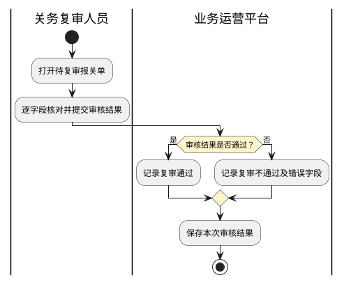
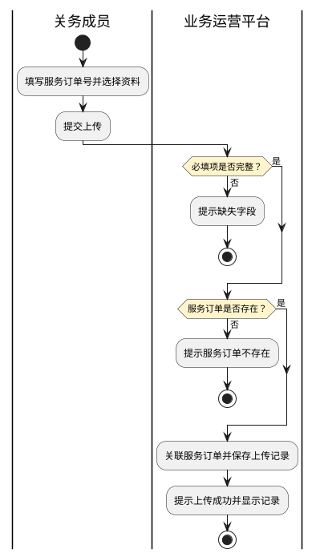

# 第027篇

> 本篇定位：普货关务作业；主要内容：资料审核、单证制作、预录申报、复审与异常单证处理、移动查验；文档角色：模块档；文档ID：367A5605ED

**主流程入口：** [普货进出口关务详细流程](../PRD.高捷物流系统.第1册.需求框架/PRD.高捷物流系统.第005篇.普货进出口关务详细流程.D409606401.md#doc-D409606401-general-cargo-customs)。空运工作台的材料查询与补齐入口仍见[空运-报关单管理](PRD.高捷物流系统.第024篇.空运-报关单管理.7A78DCFDE1.md#doc-7A78DCFDE1-section-9ac8a75081d3)。本篇定义关务人员的单证作业与单一窗口交接，二者不混用角色或状态名称。

**概念模型：** [数据字典 · 关务概念与单据关系](../PRD.高捷物流系统.第8册.平台共用与运营/PRD.高捷物流系统.第063篇.数据字典.7A3D9E1F50.md#doc-7A3D9E1F50-customs-model)。

共用定义见[关务作业、查询与统计权限](../PRD.高捷物流系统.第8册.平台共用与运营/PRD.高捷物流系统.第064篇.角色与访问权限.5E31456F30.md#doc-5E31456F30-customs-access)。

## 1. 业务范围与参与方

关务的日常工作主要是报关单据的处理，包括审核资料、随附单据制作、报关单审核、处理报关异常事务，如查验、删改单等，这过程中主要是对单据进行操作，存在需重复录入、单据存储分散、结算需人工录入、工作量没有细化统计的问题。

另外，系统设计需要满足AEO要求：单证初审复审、报关相关的单证数据留底、财务结算追溯。

因此，此模块需实现关务服务记录、报关员单据操作记录、自动生成应收应付、报关数据查询的功能。

### 1.1 业务入口

| 内容 | 一级菜单 | 二级菜单 | 说明 |
| --- | --- | --- | --- |
| 普货关务 | 服务订单列表 | 普货进口 | 展示由平台订单生成的业务类型为“普货进口”的服务订单记录，进行查询、接单、流转、终止服务、拒接、自定义列表等 |
| 普货关务 | 服务订单列表 | 普货出口 | 展示由平台订单生成的业务类型为“普货进口”的服务订单记录，进行查询、接单、流转、终止服务、拒接、自定义列表等 |
| 普货关务 | 服务订单详情 | 基本信息 | 展示订单信息和服务信息，订单信息读取上游订单的基本信息，服务信息展示服务项基本信息和处理详情以及操作入口。包含单证制作、审核资料、附件管理、单据操作(具体见下面描述) |
| 普货关务 | 服务订单详情 | 服务记录 | 展示每个服务项的具体处理事项记录 |
| 普货关务 | 服务订单详情 | 应收应付 | 每个处理事项完成后，按报价规则自动生成 |
| 普货关务 | 服务订单详情 | 操作日志 | 展示对此服务订单的操作，包含接单、编辑、终止服务、流转记录 |
| 普货关务 | 单证制作 |  | 跳转到新界面操作，输入客户资料，自动生成报关单、装箱单、合同、发票 |
| 普货关务 | 附件管理 | 下载 | 初始的附件是从上游订单带来的，勾选资料下载到本地 |
| 普货关务 | 附件管理 | 上传 | 从本地上传文件 |
| 普货关务 | 附件管理 | 删除 | 只能删除自己上传和制作的附件/单证 |
| 普货关务 | 审核资料 |  | 针对初始资料进行审核，审核不通过要支持发送邮件给客户和系统内其他人的邮箱 |
| 普货关务 | 单据操作 | 新增 | 新增报关单；核注清单及备案清单分别在 BBC 进口关务定义，点击后跳转到“报关单预录”界面操作 |
| 普货关务 | 单据操作 | 编辑 | 点击后跳转到“报关单预录”界面操作 |
| 普货关务 | 单据操作 | 提交审核 | 针对新增保存的报关单进行提交复审 |
| 普货关务 | 单据操作 | 发送单一窗口 | 与单一窗口对接，推送报关单数据 |
| 普货关务 | 单据操作 | 复审 | 点击后跳转到“复审”界面操作 |
| 普货关务 | 单据操作 | 补充申报 | 对概要申报的报关单进行操纵，点击后进入“补充申报”界面操作 |
| 普货关务 | 单据操作 | 打印 | 点击后展示报关单打印格式，非录入界面的格式 |
| 普货关务 | 单据操作 | 下载 | 点击后下载报关单打印格式的PDF到本地 |
| 普货关务 | 单据操作 | 复制 | 勾选单据后，复制一张，复制后单据列表增加一条记录，状态为新增 |
| 普货关务 | 单据操作 | 作废 | 勾选单据，弹出作废确认框，作废后，状态为已作废 |
| 普货关务 | 单据操作 | 安排查验 | 勾选单据，点击后弹出分配查验任务弹窗，分配后，查验员在小程序可见查验任务， 进行查验结果录入，小程序提交查验结果后，查验服务订单状态为已完成 |
| 普货关务 | 单据操作 | 改单 | 勾选单据，点击后跳转到改单界面操作，改单后自动生成一张新的单据，原单据显示为“已改单”，新单据为“单据编号+改单生成” ，要支持模板资料下载和打印 |
| 普货关务 | 单据操作 | 删单 | 勾选单据，点击后跳转到删单界面操作，删单后，单据状态为“已作废”，可点击查看，要支持模板资料下载和打印 |
| 普货关务 | 单据操作 | 删单退仓/删单退场 | 勾选单据，点击后跳转到删单退仓/退场界面操作，删单后，单据状态为“已作废”，可点击查看，要支持模板资料下载和打印 |
| 普货关务 | 单据操作 | 退运货物 | 勾选单据，点击后跳转到退运货物界面操作，退运货物需要先改单，再删单后，单据状态同改单和删单，要支持模板资料下载和打印 |
| 普货关务 | 单据操作 | 落装 | 勾选单据，点击后跳转到落装界面操作，要支持模板资料下载和打印 |
| 普货关务 | 单据操作 | 改配 | 勾选单据，点击后跳转到改配界面操作，要支持模板资料下载和打印 |
| 普货关务 | 单据操作 | 退单处理 | 勾选单据，点击后弹出结果记录框 |
| 普货关务 | 单据操作 | 挂单处理 | 勾选单据，点击后弹出结果记录框 |

### 1.2 关联概念

本节业务术语及对象关系见数据字典；页面字段和操作约束在本篇定义。

### 1.3 参与方与职责

**待确认边界（CUSTOMS-B013）**：关务业务来源将统计列入经理/主管能力，统计专题仅允许关务部总监；最终角色及数据范围待确认，不能按姓名赋权。 下文涉及该边界的来源约束仅保留待确认，不视为已确定的执行规则。

| 用户角色 | 描述 |
| --- | --- |
| 报关员 | 对服务订单进行接单、取消服务、终止服务、流转操作；审核资料、单据操作 |
| 查验员 | 在小程序进行查验任务处理，结果记录 |
| 关务主管 | 查看所有的服务订单数据，包含关务数据统计、工作台、关务服务订单看板。 |

## 2. 关务服务受理与流转

### 2.1 服务订单列表

此界面主要展示普货进口、普货出口的关务服务订单数据，可对服务订单进行查询、接单、终止服务、取消服务的操作。

**界面原型概述 · 服务订单列表 · 筛选栏**

- **区域字段或业务元素**：服务订单号、订单号、总运单号、客户分单号、服务项、客户名称、业务员、报关状态、下单日期。
- **区域级通用规则**：除所列特例外，本区域字段默认非必填、默认可编辑。

| 字段或控件特例 | 界面特例或可见反馈 |
| --- | --- |
| 服务订单号 | 支持批量查询，输入多个，换行符分隔 |
| 订单号 | 支持批量查询，输入多个，换行符分隔 |
| 总运单号 | 支持批量查询，输入多个，换行符分隔 |
| 客户分单号 | 支持批量查询，输入多个，换行符分隔 |
| 服务项 | 选择，支持多选，精准查询 |
| 客户名称 | 手动录入，模糊查询 |
| 业务员 | 手动录入，精准查询 |
| 报关状态 | 选择，支持多选，精准查询 |
| 下单日期 | 默认显示近一个月的起止日期，如2022-04-08至2022-05-08 |

**界面原型概述 · 服务订单列表 · 列表栏**

- **区域字段或业务元素**：服务订单号、订单号、总运单号、客户分单号、业务类型、运输方式、服务项、客户名称、业务员、建单人、下单时间、订单状态、服务订单状态、报关状态。
- **区域级通用规则**：除所列特例外，本区域字段默认必填、默认只读。

| 字段或控件特例 | 界面特例或可见反馈 |
| --- | --- |
| 服务订单号 | 编码规则：S+105+YYMMDD+5位流水号 |
| 订单号 | 读取上游订单的订单号 |
| 总运单号 | 非必填；读取上游订单的总运单号 |
| 客户分单号 | 非必填；读取上游订单的客户分单号 |
| 业务类型 | 读取上游订单的业务类型 |
| 运输方式 | 读取上游订单的运输方式 |
| 服务项 | 当选择多个服务项时，要一行显示多个 |
| 客户名称 | 读取上游订单的客户名称 |
| 业务员 | 源于订单的业务员，根据订单号匹配 |
| 建单人 | 读取上游订单的建单人 |
| 下单时间 | 生成服务订单的时间，YYYY-MM-DD hh:mm:ss |
| 订单状态 | 有以下情况： 进行中 已完成 已取消 |
| 服务订单状态 | 有以下情况： 待接单 进行中 已完成 已终止 已取消 |
| 报关状态 | 非必填；如果有国内报关，则显示国内报关中最新的报关状态；没有则为空 |

总计数量：点击后默认展示近1个月收到的服务订单和数量；

待接单：点击后默认展示所有待接单状态下的服务订单和数量；

进行中：点击后默认展示所有进行中的服务订单和数量；

已完成：点击后默认展示近一个月完成的服务订单和数量；

已取消：点击后默认展示近一个月已取消的服务订单和数量；

已终止：点击后默认展示近一个月已终止的服务订单和数量。

当输入下单日期时，以上分类的总数要对应所选日期的数据。

查询：在不选择任何查询字段下，点击“查询”按钮，默认所有查询条件。选择对应的查询条件，则显示符合结果的数据。查询出的数据，按照系统记录的“下单时间”倒序排列。

重置：清空所有查询条件。

收起：点击收起按钮，查询栏收起。（查询栏默认是展开状态）

查看详情：点击服务订单号，跳转至服务订单详情界面。

接单：勾选订单后，支持批量勾选订单，点击按钮，弹出提示框，

在提示框点击“确定”，接单成功后，服务订单状态由“待接单”变为“进行中”。

注意：仅“待接单”的才可接单成功，如果勾选的订单中包含其他状态的服务订单，则仅对“待接单”的执行操作，其他的自动过滤；如果勾选的订单没有“待接单”的，则点击“接单”按钮后，弹出提示：所选订单已被接单。

流转：点击按钮，弹出流转弹窗，在流转弹窗可选择流转给所有报关员或指定人。

1．仅“进行中”的服务订单能被流转，如果勾选的服务订单中包含了其他状态，则仅对自己接单的“进行中”的执行操作，其他的自动过滤；如果勾选的订单没有“进行中”的，则点击按钮后，弹出提示：所选订单不能流转。

2．当流转给所有报关员时，所有报关员都能接单，当流转给指定人时，被指定人无需接单，可直接进行接单后的操作。

3.流转后，接单/指定人可代替原接单人进行后续的操作，原接单员只能查看。

终止服务：

1、当“上游取消服务”=“是”，此服务订单才可以执行终止服务；否则弹出提示：此服务订单不能被终止。

2、允许执行终止服务时，点击按钮，弹出确认弹窗：

点击确定，执行终止操作，服务订单状态变为“已终止”。

1.上游订单取消时，当服务订单状态为“待接单”，则自动取消服务订单，服务订单状态直接变为“已取消”；

2.当服务订单状态为“进行中”，允许人为点击“终止服务”按钮；

3.当服务订单状态为“已完成”，则服务订单状态不变。

4.终止服务不影响应收应付的生成，终止服务后，服务订单只能被查看，不能进行其他操作。

取消服务：

1、当“上游取消服务”=“是”，此服务订单才可以执行取消服务；否则弹出提示：此服务订单不能被取消。

2、允许执行取消服务时，点击按钮，弹出确认弹窗：

点击确定，执行取消操作，服务订单状态变为“已取消”。

1.上游订单取消时，如果服务订单状态为“待接单”，则自动取消服务订单，且服务订单状态变为“已取消”；当服务订单状态为“进行中”，允许人为点击“取消服务”按钮；

2.当服务订单状态为“已完成”，则服务订单状态不变。

3.取消服务不再生成应收应付；

4.取消服务后，服务订单只能被查看，不能进行其他操作。

批量查询：可对服务订单号、订单号、总运单号、客户分单号进行批量查询（填写多个内容换行符隔开）。

自定义列表：点击自定义列表，展示自定义列表弹窗。

服务记录：针对“进行中”服务订单来的，点击后

点击确定后，更新服务订单的状态，生成服务记录详情，附件显示到服务详情中。

## 3. 服务详情、材料审核与记录

**审核资料的业务约束**

- **适用范围**：普货进口、普货出口

- **参与方**：关务-报关员

- **操作资格**：客服在新建订单时已上传附件，提交订单生成服务订单时自动带过来显示

- **形成结果**：报关员审核通过

- **处理行为**：报关员在服务订单详情页下载附件资料 点击“审核资料”按钮，录入审核结果，审核不通过时需要填写原因，提交审核之后不能修改审核状态，客服可重新上传 审核结果后，在附件资料详情显示回执信息

- **关联业务**：新建订单-服务信息-附件文件

**待确认边界（CUSTOMS-B004）**：作废用例与界面资格对已发送、发送异常的处理不同；允许作废的完整状态集待确认。 下文涉及该边界的来源约束仅保留待确认，不视为已确定的执行规则。

**作废报关单的业务约束**

- **适用范围**：普货进口、普货出口

- **参与方**：关务

- **操作资格**：已有对应的单据，且单据状态为 “待复审/复审通过/复审不通过”已有报关单，且单据状态为 “待复审/复审通过/复审不通过”

- **形成结果**：作废成功，单据状态改为“已作废”。

- **处理行为**：报关员勾选一条报关单，点击“作废”按钮，弹出确认作废提示，确定作废后，系统将此报关单状态改为“已作废”。

- **例外处理**：1a所选报关单状态非“待复审/复审通过/复审不通过/已发送” 1a-1弹出提示：当前报关单无法被作废，如需删单，请选择“删单”操作。

**退单处理的业务约束**

- **适用范围**：普货进口、普货出口

- **参与方**：关务

- **操作资格**：已有报关单，且报关状态为 “退单”

- **形成结果**：记录处理详情，并且不能重复操作。

- **处理行为**：1、报关员勾选一条报关单，点击“退单处理”按钮，弹出处理记录对话框，提交处理记录后，系统生成处理记录，并限制不能重复操作。

- **例外处理**：1a所选报关单状态非“退单” 1a-1点击弹出提示：当前状态不能进行退单处理 1b 所选报关单已有退单处理记录 1b-1 点击后弹出提示：已有退单处理记录，请不要重复操作。

**挂单处理的业务约束**

- **适用范围**：普货进口、普货出口

- **参与方**：关务

- **操作资格**：已有报关单，且报关状态为 “挂单”

- **形成结果**：记录处理详情，并且不能重复操作。

- **处理行为**：1、报关员勾选一条报关单，点击“挂单处理”按钮，弹出处理记录对话框，提交处理记录后，系统生成处理记录，并限制不能重复操作。

- **例外处理**：1a所选报关单状态非“挂单” 1a-1点击弹出提示：当前状态不能进行挂单处理 1b 所选报关单已有挂单处理记录 1b-1 点击后弹出提示：已有挂单处理记录，请不要重复操作。

**待确认边界（CUSTOMS-B005）**：手动维护资格一处限已发送或已申报，另一处含已改单、已作废、已删单；具体范围待确认。明确收到海关回执后以回执覆盖人工状态。 下文涉及该边界的来源约束仅保留待确认，不视为已确定的执行规则。

**报关状态管理的业务约束**

- **适用范围**：普货进口、普货出口

- **参与方**：关务

- **操作资格**：已有报关单，且单据状态为 “已发送、已申报”

- **形成结果**：将手动选择的报关状态显示到报关状态栏

- **处理行为**：1、报关员勾选一条报关单，点击“报关状态管理”按钮，弹出对话框，选择状态后，将状态显示到报关状态栏，如果当前已有状态，则直接替换成手工选择的状态，后续海关系统返回新的状态后则显示海关返回的状态。

- **例外处理**：1a所选报关单状态非 “已发送、已申报” 1a-1点击弹出提示：当前状态不能进行报关状态管理操作

**安排查验的业务约束**

- **适用范围**：普货进口、普货出口

- **参与方**：关务

- **操作资格**：在新建订单时选择“国内报关”，新增报关单后，单据状态=已申报、已删单单据状态=已申报、已删单，可对报关单执行“安排查验”操作； 在新建订单时选择了“查验”服务项，可对生成的服务订单“安排查验”。 以上2种情况下的安排查验，是有所区别的：第1种执行后会生成“查验”tab下的“基本信息”；第2种则不用生成基本信息，因为新建订单的时候已有生成的服务记录了。

- **形成结果**：执行后，系统会生成安排查验记录：包含查验员、报关单号、总运单号的内容

- **处理行为**：1.报关员在服务订单详情页-单据操作中选择一条报关单，点击“安排查验”，弹出安排查验对话框； 2.选择查验员，报关单号(读取海关编号或者手动录入)、读取或录入总运单号，点击确定； 3.生成安排查验记录。

- **例外处理**：1a如果是前置条件的第一种，那么当所选单据不满足条件时 1a-1弹出提示：当前报关单不能进行“安排查验”操作

### 3.1 服务订单基本信息

此界面显示上游订单信息，其中货物信息要展示所有分单的数据。

字段均来源于上游订单。

收起订单信息：点击按钮后，隐藏订单信息内容，按钮文案变为“展开订单信息”，点击后，显示订单信息内容。

货物信息-分单号：点击分单号，可切换查看对应分单的货物信息。

### 3.2 服务信息

**界面原型概述 · 服务基本信息**

- **区域字段或业务元素**：服务类型、供应商、内部部门、报关类型、是否转仓、是否委外、外部单位、备注、服务状态。
- **区域级通用规则**：除所列特例外，本区域字段默认必填、默认只读。

| 字段或控件特例 | 界面特例或可见反馈 |
| --- | --- |
| 服务类型、供应商、内部部门、报关类型、是否转仓 | 读取上游订单的信息。 |
| 是否委外 | 可编辑；默认“否”，修改为是后，不能再编辑 |
| 外部单位 | 非必填；当“是否委外”选择“否”时，不显示此字段。 |
| 备注 | 非必填；读取上游订单信息 |
| 服务状态 | 非必填；显示此服务项的服务状态，服务订单接单后，就显示“进行中”，当“报关状态”出现“已结关”，才显示“已完成”； 已完成后，单据操作的所有按钮置灰，不可点击；附件资料除了下载，其他按钮都置灰，不可点击 |

**界面原型概述 · 附件资料**

- **区域字段或业务元素**：资料名称、附件类型、来源、操作时间、操作人、回执信息。
- **区域级通用规则**：除所列特例外，本区域字段默认非必填、默认只读。

| 字段或控件特例 | 界面特例或可见反馈 |
| --- | --- |
| 资料名称 | 如果是上游订单带过来的，则读取上游订单的信息；如果是单证制作生成的，则显示对应的单据名称，如装箱单、发票等 |
| 附件类型 | 单证制作的，按生成的类型显示附件类型； 读取上游订单的附件类型 |
| 来源 | 分别有3种：上游订单、当前服务订单、单证制作 |
| 操作时间 | 显示对应的操作时间，如上传时间、单证生成的时间 |
| 操作人 | 读取单证制作的账号名称、上传人的账号名称 |
| 回执信息 | 展示审核结果，如果没有审核结果，则不显示 |

**待确认边界（CUSTOMS-B007）**：报关单编号采用 208+YYDDMM+流水号，而其他业务编号采用 YYMMDD；不自动调换日月。 下文涉及该边界的来源约束仅保留待确认，不视为已确定的执行规则。

**界面原型概述 · 单据操作区**

- **区域字段或业务元素**：单据编号、单据类型、海关编号、单据状态、报关状态、备注。
- **区域级通用规则**：除所列特例外，本区域字段默认必填、默认只读。

| 字段或控件特例 | 界面特例或可见反馈 |
| --- | --- |
| 单据编号 | 新增报关单，提交审核后，系统自动生成，编码规则：208+YYDDMM+5位流水号 |
| 单据类型 | 读取报关单预录时选择的类型，其中：一次录入的，如果勾选了辅助提交，那就显示“一次录入-辅助提交”；否则显示“一次录入-人工提交” |
| 海关编号 | 海关系统返填预录入编号/海关编号，单据状态为“已申报”后，就能从海关系统抓取数据 |
| 单据状态 | 见本节单据状态及操作资格 |
| 报关状态 | 根据海关系统返回的回执，显示对应分类的状态；当报关状态为“已结关”，则国内报关的服务状态显示为“已完成”，回写商品信息到上游订单的商品信息表中；报关状态“已审结”，则将报关单中商品信息回写到基础数据库-历史成功归类 |
| 备注 | 如果有改单，则显示原单据编号+改单生成 |

单据状态说明：

服务项tab：点击可切换查看服务项的处理详情。

是否委外：选择“是”后弹出对话框：

外部供应商从已有供应商档案选择。

下载附件：按钮所有人可见，批量勾选附件，点击后下载到本地，如果选择多个，则以压缩包的形式下载到本地

**待确认边界（CUSTOMS-B040）**：移动端允许关务部门成员上传资料，桌面作业限定当前接单人；是否为刻意放宽的终端权限投影待确认。 下文涉及该边界的来源约束仅保留待确认，不视为已确定的执行规则。

上传附件：按钮仅接单员可见，点击后弹出对话框：

点击“上传文件”，从本地选择文件上传，上传后鼠标移到文件名称上，显示删除按钮，支持批量上传，如果上传的文件名称已存在，则在后来上传的文件名称上增加序号(1)(2),依次类推。

删除附件：仅接单员可见按钮，且只能删除自己上传的附件。点击后弹出确认对话框：

单证制作：仅接单员可见，点击后跳转到单证制作界面

审核资料：仅接单员可见，点击后弹出对话框，

审核通过，不显示下面的原因描述、附件上传、邮箱反馈信息；

审核不通过，显示原因描述(必填)、附件上传(非必填)、邮件反馈，默认选中客户，不能删除，可添加其他客服或者账号绑定的邮箱号：

确定后，将审核结果回传到附件资料列表下方，如：

邮件通知：采用当前报关员的邮箱账号发送邮件，邮件模板：

其中，不通过原因为审核时录入的内容。审核完成后，服务记录会新增一条审核资料的记录。

发送单一窗口：仅接单员可见，勾选单据状态为“复审通过”的单据，支持多选，点击后弹出对话框：

报关员IC卡号，在基础数据-数据字典中维护。

确定后，通过接口推送报关单数据到单一窗口进行暂存，此时单据状态为“已发送”；没有发送回执之前，显示为“发送中”；发送失败，显示“发送异常”，发送成功，显示为“发送成功”。

打印：勾选单据，仅支持单选，点击后弹出系统打印预览框，显示报关单的打印格式。

下载：勾选单据，支持多选，点击下载pdf格式报关单的打印格式到本地。

其他操作：

| 按钮名称 | 交互规则 |
| --- | --- |
| 复制 | 具体见用例说明-复制报关单 |
| 作废 | 具体见用例说明-作废报关单 |
| 安排查验 | 勾选报关单，仅支持单选，点击后弹出对话框：  查验员选择，数据读取账号设置的角色 报关单号：必填，如果是在国内报关单据操作列表中勾选的，则自动填入“海关编号”，可编辑；如果查验服务项中点击按钮，则需要手动录入。 |
| 其余操作 | 见对应的用例说明 |

新增：点击后跳转到“报关单预录”界面，具体规则见用例说明-新增报关单。

报关状态管理：单据状态为“已申报、已改单、已作废、已删单”时，允许修改报关状态，修改报关状态后，如果海关有新的状态回写，则以最新的状态为准。

点击确定后，更新报关状态。

### 3.3 服务记录

此界面展示所有服务项的处理详情，如果有多个服务项的，则需要把全部的服务记录显示出来。

所有字段都是读取服务信息的对应字段内容，按处理时间升序排列。

蓝色字可点击查看记录，交互。

### 3.4 操作日志

操作日志界面，展示操作日志详情，按操作时间升序排列。

**界面原型概述 · 操作日志 · 字段区**

- **区域字段或业务元素**：操作人、操作名称、操作时间、操作内容。
- **区域级通用规则**：除所列特例外，本区域字段默认必填、默认只读。

| 字段或控件特例 | 界面特例或可见反馈 |
| --- | --- |
| 操作人 | 获取操作该行为的人员名字 |
| 操作名称 | 操作人员点击关务服务订单操作栏中的按钮名称，比如接单、流转、编辑、终止、取消服务 |
| 操作时间 | 操作人员点击关务服务订单操作栏中的按钮时时间 |
| 操作内容 | 操作人员点击关务服务订单操作栏中的按钮后，是否完成该操作 |

### 3.5 客户收到的邮件

**界面原型概述 · 客户收到的邮件 · 字段区**

- **区域字段或业务元素**：标题-提运单号、正文内容、电子签名-姓名、电子签名-手机号。
- **区域级通用规则**：除所列特例外，本区域字段默认非必填、默认可编辑。

| 字段或控件特例 | 界面特例或可见反馈 |
| --- | --- |
| 标题-提运单号 | 读取订单信息中的“客户分单号” |
| 正文内容 | 读取审核不通过原因 |
| 电子签名-姓名 | 内容固定，其中“报关员”，读取当前执行发邮件的账号名称 |
| 电子签名-手机号 | 读取发送邮件的账号所绑定的手机号 |

应收应付展示本服务关联费用，费用定义与结算行为引用财务模块，不另建关务计费口径。委外确认须选择外部供应商；确认后生成该供应商门户的服务订单，当前委外选择不可再修改。

## 4. 报关资料制作与对外单证

### 4.1 资料录入

公司资料：

**待确认边界（CUSTOMS-B011）**：来源含固定申报企业、海关和场所代码，未说明是否仅适用于指定经营单位或口岸；各字段保留原值作为待确认配置，不推广为全系统默认。 下文涉及该边界的来源约束仅保留待确认，不视为已确定的执行规则。

**界面原型概述 · 资料录入 · 字段区**

- **区域字段或业务元素**：申报日期、联系人、申报口岸、经营单位、公司地址、电话号码、传真号码、外方单位、公司地址、电话号码、传真号码。
- **区域级通用规则**：除所列特例外，本区域字段默认非必填、默认可编辑。

| 字段或控件特例 | 界面特例或可见反馈 |
| --- | --- |
| 申报日期 | 手动录入 |
| 联系人 | 手动录入 |
| 申报口岸 | 手动录入，默认显示5141 |
| 经营单位 | 手动录入后模糊查询再选择，选择后自动填写公司地址、电话号码、传真号码；如果是新的经营单位，则保存资料后需要保存到数据库； |
| 公司地址 | 根据经营单位自动带出，如果为空，则可手动录入 |
| 电话号码 | 根据经营单位自动带出，如果为空，则可手动录入 |
| 传真号码 | 根据经营单位自动带出，如果为空，则可手动录入 |
| 外方单位 | 手动录入后模糊查询再选择，选择后自动填写公司地址、电话号码、传真号码；如果是新的经营单位，则保存资料后需要保存到数据库； |
| 公司地址 | 根据外方单位自动带出，如果为空，则可手动录入 |
| 电话号码 | 根据外方单位自动带出，如果为空，则可手动录入 |
| 传真号码 | 根据外方单位自动带出，如果为空，则可手动录入 |

海关资料：

**界面原型概述 · 资料录入 · 字段区**

- **区域字段或业务元素**：海关编号、出口口岸、合同协议号、备案号、征免性质、合同签约时间、许可证号、监管方式、合同签约地点、批准文号、成交方式、装运期、集装箱号、结汇方式、发票号、指运港、征免方式、提运单号、目的国、外汇币制、生产厂家、运输方式、运输工具、境内货源地、运费、包装种类、随附单据、保险费、杂费、商标、备注、标记唛码。
- **区域级通用规则**：除所列特例外，本区域字段默认非必填、默认可编辑。

| 字段或控件特例 | 界面特例或可见反馈 |
| --- | --- |
| 海关编号 | 手动录入，默认显示91510183MA6AFAQG23 |
| 出口口岸 | 1、选择 2、选择进口模板时，显示为“进口口岸” |
| 合同协议号 | 手动录入 |
| 备案号 | 手动录入 |
| 征免性质 | 默认“一般征税” |
| 合同签约时间 | 点击按钮，弹出日期选择框 |
| 许可证号 | 手动录入 |
| 监管方式 | 手动录入，默认一般贸易 |
| 合同签约地点 | 手动录入 |
| 批准文号 | 手动录入 |
| 成交方式 | 选择，选项有：FOB，CIF，C&F，其他，默认选择FOB |
| 装运期 | 点击按钮，弹出日期选择框 |
| 集装箱号 | 手动录入 |
| 结汇方式 | 选择，选项有：先出后结，信用证，电汇，票汇，其他，默认选择电汇 |
| 发票号 | 手动录入 |
| 指运港 | 手动录入；选择进口模板时，显示为“启运港” |
| 征免方式 | 选择，选项有：照章征税，折半征税，全免，默认选择“照章征税” |
| 提运单号 | 手动录入，读取客户分单号 |
| 目的国 | 手动录入； 选择进口模板时，显示为“原产国” |
| 外汇币制 | 选择，数据来源于基础数据-币制的英文名 |
| 生产厂家 | 手动录入 |
| 运输方式 | 选择，数据来源于基础数据-运输方式 |
| 运输工具 | 手动录入 |
| 境内货源地 | 手动录入，选择进口模板时，显示为“境内目的地” |
| 运费 | 手动录入 |
| 包装种类 | 手动录入 |
| 随附单据 | 手动录入 |
| 保险费 | 手动录入 |
| 杂费 | 手动录入 |
| 商标 | 手动录入 |
| 备注 | 手动录入 |
| 标记唛码 | 手动录入 |

货物资料：

**界面原型概述 · 资料录入 · 字段区**

- **区域字段或业务元素**：项号、商品编号、商品名称、规格、件数、毛重(KG)、净重(KG)、数量、单位、单价、总价。
- **区域级通用规则**：除所列特例外，本区域字段默认非必填、默认可编辑。

| 字段或控件特例 | 界面特例或可见反馈 |
| --- | --- |
| 项号 | 必填；只读；系统自动生成 |
| 商品编号 | 手动录入 |
| 商品名称 | 必填；手动录入 |
| 规格 | 手动录入 |
| 件数 | 手动录入 |
| 毛重(KG) | 手动录入 |
| 净重(KG) | 手动录入 |
| 数量 | 手动录入 |
| 单位 | 选择，数据来源于基础数据-计量单位表 |
| 单价 | 手动录入 |
| 总价 | 只读；等于单价*数量 |

选择/切换模板：切换的时候不用清空已填写的内容，只是模板中个别字段名称不同而已，具体见上方表格的字段说明

生成预览：点击后保存已录入内容，并生成报关单、发票、装箱单、合同预览；每次点击都会同步更新预览效果。

导入：

1.点击后弹出提示：导入成功后会覆盖现有填写内容，是否继续？

2.点击“确定”，弹出选择本地文件界面，选择文件确定后，需要进行导入校验：导入字段需与表格的一致，不一致则导入失败；必填项没有填写，也导入失败，提示：导入失败，请检查字段名称和填写是否完整。

3.导入成功后，覆盖当前已填写的内容。

新增：点击后在最下面新增一行

删除：勾选，可多选商品记录后，点击按钮，弹出删除确认界面，确认后删除所选的商品记录，不可恢复。

### 4.2 报关单预览

**待确认边界（CUSTOMS-B008）**：报关单征免性质与随附单证编号、合同买方地址电话传真存在疑似取自其他字段的映射；确认前不得按列名自行纠正或将其视为已确认来源。 下文涉及该边界的来源约束仅保留待确认，不视为已确定的执行规则。

**界面原型概述 · 报关单预览 · 字段区**

- **区域字段或业务元素**：预录入编号、海关编号、页码/页数、境内发货人、出境关别、出口日期、申报日期、备案号、境外收货人、运输方式、运输工具名称及航次号、提运单号、生产销售单位、监管方式、征免性质、许可证号、启运港、合同协议号、贸易国（地区）、运抵国（地区）、指运港、离境口岸、包装种类、件数、毛重（千克）、净重（千克）、成交方式、运费、保费、杂费、随附单证及编号、标记唛码及备注、项号、商品编号、商品名称及规格型号、数量及单位、单价/总价/币制、原产国（地区）、最终目的国（地区）、境内货源地、征免、特殊关系确认、价格影响确认、支付特许权使用费确认、自报自缴。
- **区域级通用规则**：除所列特例外，本区域字段默认非必填、默认只读。

| 字段或控件特例 | 界面特例或可见反馈 |
| --- | --- |
| 预录入编号 | 为空，无需取值 |
| 海关编号 | 为空，无需取值 |
| 页码/页数 | 为空，无需取值 |
| 境内发货人 | 读取经营单位名称，右上角的代码，读取资料录入的“海关编号” |
| 出境关别 | 读取资料录入的“申报口岸” |
| 出口日期 | 为空，无需取值 |
| 申报日期 | 为空，无需取值 |
| 备案号 | 读取资料录入的“备案号” |
| 境外收货人 | 读取资料录入的“外方单位名称” |
| 运输方式 | 读取资料录入的“运输方式” |
| 运输工具名称及航次号 | 读取资料录入的“运输工具” |
| 提运单号 | 读取资料录入的“提运单号” |
| 生产销售单位 | 读取资料录入的“经营单位”；进口报关单显示“消费使用单位”，读取资料录入的“经营单位” |
| 监管方式 | 读取资料录入的“监管方式” |
| 征免性质 | 读取资料录入的“征免方式” |
| 许可证号 | 读取资料录入的“许可证号” |
| 启运港 | 为空，无需取值 |
| 合同协议号 | 读取资料录入的“合同协议号” |
| 贸易国（地区） | 读取资料录入的“目的国” |
| 运抵国（地区） | 读取资料录入的“目的国”；进口报关单是“启运国（地区）”，读取“资料录入-原产国” |
| 指运港 | 出口报关单读取资料录入的“指运港”；进口报关单是“经停港”，读取资料录入的“经停港” |
| 离境口岸 | 读取资料录入的“出口口岸” |
| 包装种类 | 读取资料录入的“包装种类” |
| 件数 | 统计资料录入的“件数” |
| 毛重（千克） | 统计资料录入的“毛重” |
| 净重（千克） | 统计资料录入的“净重” |
| 成交方式 | 读取资料录入的“成交方式” |
| 运费 | 读取资料录入的“运费” |
| 保费 | 读取资料录入的“保险费” |
| 杂费 | 读取资料录入的“杂费” |
| 随附单证及编号 | 为空，无需取值 |
| 标记唛码及备注 | 读取资料录入的“标记唛码” |
| 项号 | 读取资料录入-货物信息的“项号” |
| 商品编号 | 读取资料录入-货物信息的“商品编号” |
| 商品名称及规格型号 | 读取资料录入-货物信息的“商品名称和规则”，分开上下两行显示 |
| 数量及单位 | 读取资料录入-货物信息的“数量和单位”，如：1件 |
| 单价/总价/币制 | 读取资料录入-货物信息的“单价、总价、外汇币制”，分行显示，如： 12.0000 1234.0000 美元 |
| 原产国（地区） | 出口报关单，默认是“中国(CHN)”;进口报关单读取“原产国” |
| 最终目的国（地区） | 出口报关单读取资料录入-货物信息的“目的国”；进口报关单默认是“中国(CHN)” |
| 境内货源地 | 出口报关单读取资料录入-货物信息的“境内货源地”；进口报关单是“境内目的地”,读取资料录入-境内目的地 |
| 征免 | 读取“征免方式” |
| 特殊关系确认 | 为空，无需取值 |
| 价格影响确认 | 为空，无需取值 |
| 支付特许权使用费确认 | 为空，无需取值 |
| 自报自缴 | 为空，无需取值 |

添加印章：点击后弹出选择图片界面，选择后，将图片显示到水印的位置，可移动图片的位置。

打印：点击后进入打印界面。

下载：点击后下载当前文件到本地，下载为Excel文件

保存：点击生成对应的单据，显示到附件资料列表中；如果之前已有生成的，则覆盖之前的单据。

### 4.3 发票预览

**界面原型概述 · 发票预览 · 字段区**

- **区域字段或业务元素**：商号、编号、日期、标记号码、货物名称、型号规格、数量、单位、单  价、总金额、合计XX、TOTAL XX、唛头。
- **区域级通用规则**：除所列特例外，本区域字段默认非必填、默认只读。

| 字段或控件特例 | 界面特例或可见反馈 |
| --- | --- |
| 商号 | 读取资料录入“外方单位” |
| 编号 | 为空，无需取值 |
| 日期 | 为空，无需取值 |
| 标记号码 | 为空，无需取值 |
| 货物名称、型号规格 | 分为2行显示，上面一行读取商品名称，下面一行读取“规格型号” |
| 数量 | 读取资料录入-货物资料“数量” |
| 单位 | 读取资料录入-货物资料“单位” |
| 单  价 | 读取资料录入-货物资料“单价” |
| 总金额 | 读取资料录入-货物资料“总价” |
| 合计XX | XX读取录入-货物资料“外汇币制” |
| TOTAL XX | XX读取录入-货物资料“外汇币制”，后面显示所有总金额之和，如TOTAL USD 20.00 |
| 唛头 | 读取录入资料的“标记唛码” |

添加印章、打印、下载和保存操作与[报关单预览](#doc-367A5605ED-section-9cabe5a087a8)一致。

### 4.4 装箱单预览

**界面原型概述 · 装箱单预览 · 字段区**

- **区域字段或业务元素**：客户、日期、发票编号、合约号、船名、由xx至xx、付款条件、箱号、货物名称及规格、总数(件)、总数量、总毛重、总净重、合计TOTAL、唛头。
- **区域级通用规则**：除所列特例外，本区域字段默认非必填、默认只读。

| 字段或控件特例 | 界面特例或可见反馈 |
| --- | --- |
| 客户 | 读取资料录入“外方单位” |
| 日期 | 为空，无需取值 |
| 发票编号 | 为空，无需取值 |
| 合约号 | 读取资料录入“合同协议号” |
| 船名 | 为空，无需取值 |
| 由xx至xx | 为空，无需取值 |
| 付款条件 | 读取资料录入“结汇方式” |
| 箱号 | 为空，无需取值 |
| 货物名称及规格 | 分为2行显示，上面一行读取商品名称，下面一行读取“规格型号” |
| 总数(件) | 读取资料录入-货物资料“件数” |
| 总数量 | 读取资料录入-货物资料“数量” |
| 总毛重 | 读取资料录入-货物资料“毛重” |
| 总净重 | 读取资料录入-货物资料“净重” |
| 合计TOTAL | 分别统计总件数、总数量、总毛重、总净重 |
| 唛头 | 读取录入资料的“标记唛码” |

添加印章、打印、下载和保存操作与[报关单预览](#doc-367A5605ED-section-9cabe5a087a8)一致。

### 4.5 合同预览

**界面原型概述 · 合同预览 · 字段区**

- **区域字段或业务元素**：卖方、卖方地址、合同号码、卖方电话、卖方传真、日期、签约地点、买方、卖方地址、卖方电话、卖方传真、货物名称及规格、数量、单位、单价、金额、总值XX、包装及唛头、装运期、装运口岸和目的地、付款条件。
- **区域级通用规则**：除所列特例外，本区域字段默认非必填、默认只读。

| 字段或控件特例 | 界面特例或可见反馈 |
| --- | --- |
| 卖方 | 进口的读取资料录入“外方单位”；出口的读取资料录入“经营单位” |
| 卖方地址 | 进口的读取资料录入“外方单位的公司地址”；出口的读取资料录入“经营单位的公司地址” |
| 合同号码 | 读取资料录入“合同协议号” |
| 卖方电话 | 进口的读取资料录入“外方单位的电话号码”；出口的读取资料录入“经营单位的电话号码” |
| 卖方传真 | 进口的读取资料录入“外方单位的传真号码”；出口的读取资料录入“经营单位的传真号码” |
| 日期 | 为空，无需取值 |
| 签约地点 | 读取资料录入“合同签约地点” |
| 买方 | 进口的读取资料录入“经营单位”；出口的读取资料录入“外方单位” |
| 卖方地址 | 进口的读取资料录入“经营单位的公司地址”；出口的读取资料录入“外方单位的公司地址” |
| 卖方电话 | 进口的读取资料录入“经营单位的电话号码”；出口的读取资料录入“外方单位的电话号码” |
| 卖方传真 | 进口的读取资料录入“经营单位的电话号码”；出口的读取资料录入“外方单位的电话号码” |
| 货物名称及规格 | 分为2行显示，上面一行读取商品名称，下面一行读取“规格型号” |
| 数量 | 读取资料录入-货物资料“数量” |
| 单位 | 读取资料录入-货物资料“单位” |
| 单价 | 读取资料录入-货物资料“单价” |
| 金额 | 读取资料录入-货物资料“总价” |
| 总值XX | 统计“总价”之和，XX读取“外汇币制英文名”，如USD 120.00 |
| 包装及唛头 | 读取资料录入的“标记唛码” |
| 装运期 | 读取资料录入的“装运期” |
| 装运口岸和目的地 | 读取资料录入的“指运港” |
| 付款条件 | 读取资料录入的“结汇方式” |

添加印章、打印、下载和保存操作与[报关单预览](#doc-367A5605ED-section-9cabe5a087a8)一致。

**对外单证模板**：报关单、发票、装箱单与合同均支持添加印章、打印、下载和保存。模板中的固定栏位即使当前无值仍保留；发票包含唛头、货物名称及型号规格、数量、单位、单价、币种与金额合计，装箱单包含箱号、包装件数、数量、总毛重与净重及合计，合同包含双方签署区域、装运期、装运口岸及目的地、付款条件、装运标记与金额大写。合同示例出现“数量及总值允许 2% 增减”“按发票金额 110% 投保”，其是否为所有合同的固定条款待确认，不作为通用业务约束。

## 5. 报关单预录与模式差异

**界面原型概述 · 申报附加信息弹窗**

- **区域字段或业务元素**：其他包装、其他确认、特殊业务标识、检验检疫签证、原产地优惠。

| 业务元素 | 内容与操作 |
| --- | --- |
| 其他包装 | 选择代码及名称，对应关务代码字典；包括散装、裸装、盒箱、桶、球状罐、包袋、再生木托、天然木托、植物性铺垫材料及其他包装。 |
| 其他确认 | 特殊关系确认、价格影响确认、与货物有关的特许权使用费支付确认。 |
| 特殊业务标识 | 可选国际赛事、特殊进出军工物资、国际援助物资、国际会议、直通放行、外交礼遇及转关。 |
| 检验检疫签证 | 每行包含代码、名称、正本数量和副本数量。 |
| 原产地优惠 | 录入原产地证书号、优惠贸易协定代码、直接原产国、证书项号及 C 原产地证书/D 原产地声明类型；支持确认和取消优惠。 |

**待确认边界（CUSTOMS-B001）**：新增用例要求保存后返回服务详情，预录动作要求仍留在当前页面；保存数据和未提交状态不受影响，保存后的页面去向待确认。 下文涉及该边界的来源约束仅保留待确认，不视为已确定的执行规则。

**新增报关单的业务约束**

- **适用范围**：普货进口、普货出口

- **参与方**：关务

- **形成结果**：新增报关单成功，点击“保存”，保存已录入内容；点击“提交审核”，状态为“待复审”。

**处理行为**

1. 报关员点击“新增”，进入录入界面。进口可选择“进口整合申报/概要申报/一次录入”；出口可选择“出口整合申报/出口转关申报”。
2. 已有单证制作内容时，将匹配字段自动填入报关单。补充其他内容后，可保存或提交审核。
3. 保存与提交审核的结果如下。保存后的页面去向仍按 CUSTOMS-B001 待确认。

   | 动作 | 处理与结果 |
   | --- | --- |
   | 保存 | 保存已录入内容；单据操作栏不显示该条报关单操作记录。是否返回服务详情页待确认。 |
   | 提交审核 | 返回服务详情页；单据操作栏显示该条报关单操作记录，单据状态为“待复审”。 |

**复制报关单的业务约束**

- **适用范围**：普货进口、普货出口

- **参与方**：关务

- **操作资格**：已有报关单

- **形成结果**：复制报关单成功，系统自动新增一条单据记录，单据状态为“未提交”

- **处理行为**：报关员勾选一条已有报关单，点击“复制”按钮，弹出提示：复制成功，在单据列表增加一条单据记录。

- **例外处理**：不满足前置条件时，点击“复制”提示“当前报关单不支持复制”。

**编辑报关单的业务约束**

- **适用范围**：普货进口、普货出口

- **参与方**：关务

- **操作资格**：已有报关单，且报关状态为 “复审不通过、发送异常”

- **形成结果**：编辑后，可提交审核；提交审核后，单据状态为“待复审”

- **处理行为**：接单的报关员点击单据编号进入详情，再点击“编辑”。

**例外处理**

| 情形 | 可见反馈 |
| --- | --- |
| 所选报关单状态不是“复审不通过”或“发送异常” | 点击编辑时提示“此单据当前状态不能编辑”。 |
| 操作人不是接单的报关员 | 点击单据编号进入详情后，不显示“编辑”按钮。 |

**完整申报的业务约束**

- **适用范围**：普货进口、普货出口

- **参与方**：关务

- **操作资格**：单据类型为“进口报关单(概要申报)”，且报关状态为“已放行”；且没有相关的完整申报记录，如果有完整申报记录，完整申报的单据状态要满足“已作废”或者“已删单”。

- **形成结果**：生成新的一张单据，单据类型为“进口报关单(完整申报)”

**处理行为**

1. 报关员在服务订单详情页的单据操作区选择一条报关单，点击“完整申报”，进入完整申报页。
2. 页面展示概要申报已录入的内容；其中部分内容置灰，不可修改。
3. 录入其他必填内容后，可保存或提交审核。
4. 提交审核后，不能再次完整申报，直到单据状态变为“已作废”或“已删单”。

- **例外处理**：所选单据不满足前置条件时，提示“当前报关单不能进行完整申报操作”。

### 5.1 进口整合申报

整体界面：

#### 5.1.1 基本信息

黄底色字段： 必填项。

灰底色字段： 返填项。不可录入，由系统返填。

白底色字段： 选填项。

基本信息字段说明：

**待确认边界（CUSTOMS-B010）**：进口 CIF、C&I、C&F 的运保费输入控制已列出，但来源强调出口不同却未给出差异；不把进口控制直接套用于出口。 下文涉及该边界的来源约束仅保留待确认，不视为已确定的执行规则。

**界面原型概述 · 基本信息 · 字段区**

- **区域字段或业务元素**：字段清单按主题列示于下表，具体约束见字段特例表。
- **区域级通用规则**：除所列特例外，本区域字段默认必填、默认可编辑。

| 字段主题 | 字段或业务元素 |
| --- | --- |
| 申报标识与日期 | 申报地海关、申报状态、统一编号、预录入编号、海关编号、进境关别、备案号、合同协议号、进口日期、申报日期。 |
| 境内收发货人 | 境内收发货人-社会信用代码、境内收发货人-海关代码、境内收发货人-检验检疫编码、境内收发货人-企业名称(中文)。 |
| 境外收发货人 | 境外收发货人-发货人代码、境外收发货人-企业名称(外文)。 |
| 消费使用单位 | 消费使用单位-社会信用代码、消费使用单位-海关代码、消费使用单位-检验检疫编码、消费使用单位-企业名称。 |
| 申报单位 | 申报单位-社会信用代码、申报单位-海关代码、申报单位-检验检疫编码、申报单位-企业名称。 |
| 运输与监管 | 运输方式、运输工具名称、航次号、提运单号、监管方式、征免性质、许可证号、启运国(地区)、经停港、入境口岸、货物存放地点、启运港。 |
| 交易与费用 | 成交方式、运费、保险费、杂费、贸易国别(地区)。 |
| 货物与补充资料 | 件数、包装种类、毛重(KG)、净重(KG)、集装箱数、随附单证、报关单类型、备注、标记唛码。 |

| 字段或控件特例 | 界面特例或可见反馈 |
| --- | --- |
| 申报地海关 | 输入长度：4；读取资料录入的“申报口岸”； 资料录入”申报口岸”为空时，在参数列表中选择，也可以录入代码、名称模糊匹配；下拉数据来源于基础数据库-关务代码 |
| 申报状态 | 必填性待确认；置灰只读，申报后系统自动生成。 |
| 统一编号、预录入编号、海关编号 | 输入长度：50；必填性待确认；置灰只读，申报后系统自动生成。 |
| 进境关别 | 输入长度：4；在参数列表中选择，也可以录入代码、名称模糊匹配。下拉数据来源于基础数据库-关务代码 |
| 备案号 | 非必填；读取资料录入的信息，为空则手动录入 |
| 合同协议号 | 非必填；读取资料录入的信息，为空则手动录入 |
| 进口日期 | 必填性待确认；只读；发送单一窗口后自动返填当前系统时间。 |
| 申报日期 | 只读；置灰，不允许录入，在单一窗口申报后系统反填申报时间。 |
| 境内收发货人-社会信用代码 | 输入长度：18；手动录入，提交复审报关单后就将境内收发货人数据保存到基础数据表 支持以下字段间联动： 根据【境内收发货人-海关代码】带出 根据【境内收发货人-检验检疫编码】带出 根据【境内收发货人-企业名称(中文)】带出 |
| 境内收发货人-海关代码 | 输入长度：10；根据社会信用代码自动带出，为空时也可手动录入 支持以下字段间联动： 根据【境内收发货人-社会信用代码】带出 根据【境内收发货人-检验检疫编码】带出 根据【境内收发货人-企业名称(中文)】带出 |
| 境内收发货人-检验检疫编码 | 输入长度：10；非必填；根据社会信用代码自动带出，为空时也可手动录入 支持以下字段间联动： 根据【境内收发货人-社会信用代码】带出 根据【境内收发货人-海关代码】带出 根据【境内收发货人-企业名称(中文)】带出 |
| 境内收发货人-企业名称(中文) | 根据社会信用代码自动带出，为空时读取资料录入的“经营单位”，也可手动录入 支持以下字段间联动： 根据【境内收发货人-社会信用代码】带出 根据【境内收发货人-海关代码】带出 根据【境内收发货人-检验检疫编码】带出 |
| 境外收发货人-发货人代码 | 输入长度：20；非必填；手动录入，提交复审报关单后就将境外收发货人数据保存到基础数据表 有对应基础数据时： 支持模糊匹配 根据【境外收发货人-企业名称(外文)】带出 |
| 境外收发货人-企业名称(外文) | 根据发货人代码自动带出，为空时读取资料录入的“外方单位”，也可手动录入 有对应基础数据时： 支持模糊匹配 根据【境外收发货人-发货人代码】带出 |
| 消费使用单位-社会信用代码 | 输入长度：18；手动录入，提交复审报关单后就将消费者使用单位数据保存到基础数据表 支持以下字段间联动： 根据【消费使用单位-海关代码】带出 根据【消费使用单位-检验检疫编码】带出 根据【消费使用单位-企业名称(中文)】带出 |
| 消费使用单位-海关代码 | 输入长度：10；根据消费者社会信用代码自动带出，为空时可手动录入 支持以下字段间联动： 根据【消费使用单位-社会信用代码】带出 根据【消费使用单位-检验检疫编码】带出 根据【消费使用单位-企业名称(中文)】带出 |
| 消费使用单位-检验检疫编码 | 输入长度：10；非必填；根据消费者社会信用代码自动带出，为空时可手动录入 支持以下字段间联动： 根据【消费使用单位-社会信用代码】带出 根据【消费使用单位-海关代码】带出 根据【消费使用单位-企业名称(中文)】带出 |
| 消费使用单位-企业名称 | 根据消费者社会信用代码自动带出，为空时可手动录入 支持以下字段间联动： 根据【消费使用单位-社会信用代码】带出 根据【消费使用单位-海关代码】带出 根据【消费使用单位-检验检疫编码】带出 |
| 申报单位-社会信用代码 | 输入长度：18；默认值：91440000761575765M；自动填充默认值，可手动录入，提交复审后将新的申报单位信息保存基础数据库中 支持以下字段间联动： 根据【申报单位-海关代码】带出 根据【申报单位-检验检疫编码】带出 根据【申报单位-企业名称(中文)】带出 |
| 申报单位-海关代码 | 输入长度：10；默认值：4401983107；根据社会信用代码自动带出，为空时也可手动录入 支持以下字段间联动： 根据【申报单位-社会信用代码】带出 根据【申报单位-检验检疫编码】带出 根据【申报单位-企业名称(中文)】带出 |
| 申报单位-检验检疫编码 | 输入长度：10；非必填；默认值：4400910435；根据社会信用代码自动带出，为空时也可手动录入 支持以下字段间联动： 根据【申报单位-社会信用代码】带出 根据【申报单位-海关代码】带出 根据【申报单位-企业名称(中文)】带出 |
| 申报单位-企业名称 | 默认值：广东高捷航运物流有限公司；根据社会信用代码自动带出，为空时也可手动录入 支持以下字段间联动： 根据【申报单位-社会信用代码】带出 根据【申报单位-海关代码】带出 根据【申报单位-检验检疫编码】带出 |
| 运输方式 | 在参数选择录入框，可录入代码、名称模糊匹配；数据来自运输方式代码表 |
| 运输工具名称 | 非必填；读取资料录入时的”运输工具”，可手动录入 |
| 航次号 | 非必填；手动录入 |
| 提运单号 | 必填性待确认；如果有单证制作，则读取资料录入的内容，为空则按照以下规则处理： ①水路运输：如有分提单的，读取服务订单的总运单号+“*”+分单号，为空则手动录入 ②航空运输：读取总运单号+“_”+分单号，无分运单的读取总运单号，为空则手动录入 ③其他运输类型，手动录入 |
| 监管方式 | 1、读取资料录入的内容； 2、资料录入为空时，在参数下拉表选择，也可录入代码、名称，模糊匹配，数据来自基础数据-监管方式代码表 |
| 征免性质 | 非必填；1、读取资料录入的内容； 2、资料录入为空时，可在参数下拉表选择，也可录入代码、名称模糊匹配，数据来自基础数据 |
| 许可证号 | 输入长度：20；非必填；1、读取资料录入的内容； 2、资料录入为空时，手动录入，超长自动截取。 |
| 启运国(地区) | 在参数下拉表选择，也可录入代码、名称，模糊查询，数据来源于基础数据-国别地区代码 |
| 经停港 | 在参数下拉表选择，也可录入代码、名称，模糊查询，数据来源于基础数据-港口代码表 |
| 成交方式 | 1、读取资料录入的内容，为空时可选择，也可录入代码、名称模糊查询，数据来于基础数据-成交方式 2、填写的值为CIF时，不允许录入“运费”和“保险费”； 3、填写的值为C&I时，允许录入“运费”，不允许录入“保险费”； 4、填写值为C&F时，不允许录入“运费”，允许录入“保险费”。 **进口与出口输入控制不同。 |
| 运费 | 输入长度：30；非必填；1、三个录入框依次为“标志代码、*费/费率、*费币制”; 2、标志代码与*费/费率对应关系如下： 标志代码 1-率。费率录入 0.0001-99，代表费率是 0.0001%-99%。 标志代码 2-单价。整数最多录入 10 位，小数点后面最多录入 4 位。 标志代码 3-总价。整数最多录入 12 位，小数点后面最多录入 4 位。 3、当标志代码录入 1-率时，币制字段置灰不可编辑，即无需录入。 |
| 保险费 | 输入长度：30；非必填；1、三个录入框依次为“标志代码、*费/费率、*费币制”; 2、标志代码与*费/费率对应关系如下： 标志代码 1-率。费率录入 0.0001-99，代表费率是 0.0001%-99%。 标志代码 2-单价。整数最多录入 10 位，小数点后面最多录入 4 位。 标志代码 3-总价。整数最多录入 12 位，小数点后面最多录入 4 位。 3、当标志代码录入 1-率时，币制字段置灰不可编辑，即无需录入。 |
| 杂费 | 输入长度：30；非必填；1、三个录入框依次为“标志代码、*费/费率、*费币制”; 2、标志代码与*费/费率对应关系如下： 标志代码 1-率。费率录入 0.0001-99，代表费率是 0.0001%-99%。 标志代码 2-单价。整数最多录入 10 位，小数点后面最多录入 4 位。 标志代码 3-总价。整数最多录入 12 位，小数点后面最多录入 4 位。 3、当标志代码录入 1-率时，币制字段置灰不可编辑，即无需录入。 |
| 件数 | 读取上游订单详情-件数总计；不允许为0，大于0； |
| 包装种类 | 读取资料录入的内容，为空时可在参数下拉表选择，也可录入代码、名称，模糊查询，数据来源于基础数据-包装种类 |
| 毛重(KG) | 如果有单证制作，则读取资料录入之和，没有则读取上游订单详情-毛重总计；值需要大于等于1，大于0且小于1时，填充为1。 |
| 净重(KG) | 如果有单证制作，则读取资料录入之和，没有则手动录入，值需要大于等于1，大于0且小于1时，填充为1。 |
| 贸易国别(地区) | 在参数下拉表选择，也可录入代码、名称，模糊查询，数据来源于基础数据-国别地区代码表 |
| 集装箱数 | 必填性待确认；只读；填报集装箱信息后，系统自动返填。 |
| 随附单证 | 必填性待确认；只读；无需录入 |
| 入境口岸 | 手动录入 |
| 货物存放地点 | 手动录入 |
| 启运港 | 如果有单证制作，则读取资料录入的内容，没有则在参数下拉表选择，也可录入代码、名称，模糊查询，数据来源于基础数据-港口代码表 |
| 报关单类型 | 只读；默认值：通关无纸化；自动填充默认值。 |
| 备注 | 输入长度：200；非必填；如果有单证制作，则读取资料录入的内容，没有则手动录入 |
| 标记唛码 | 必填性待确认；如果有单证制作，则读取资料录入的内容，没有则手动录入 |

键盘操作(针对所有报关单预录)：

| 键盘操作 | 说明 |
| --- | --- |
| Enter（回车） | 在参数下拉表中选中参数，返填到字段录入框中 保存已录入的数据，返填至列表中  光标跳转至下一录入框 |
| Shift+Enter | 光标跳转到上一个录入框 |
| Backspace | 删除当前录入框中的内容 |
| Alt+S | 保存数据 |
| Ctrl+End | 区域切换 |

保存：点击后，保存所有已录入的数据，停留在当前页面，可继续编辑。

打印：点击后，调用本地打印机功能，进入打印预览界面，展示报关单打印格式。

随附单据：点击后

选择文件类别，录入随附单据编号，点击添加文件，从本地选择文件上传；

针对已上传的随附单据，可点击“删除”，点击后不再显示；

点击确定，保存当前上传结果

提交审核：点击后，检查必填项，如果存在，则弹出提示；否则保存填写内容并提交，提交成功后，单据状态变为“待复审”。此时单据不能再编辑，点击单据编号，只能查看报关单的录入内容。

其他包装：点击后

通过勾选，选中其他包装信息，点击【确定】按钮即可。

备注：点击后弹出界面，可进行编辑或查看：

价格说明：点击后弹出界面，以下3个字段都是选择“1-是”／“0-否”。

标记唛码：点击后弹出界面，可进行编辑或查看：

#### 5.1.2 涉检信息

**界面原型概述 · 涉检信息 · 字段区**

- **区域字段或业务元素**：检验检疫受理机关、企业资质、领证机关、口岸检验检疫机关、目的地检验检疫机关、启运日期、B/L 号、关联号码及理由、使用人、原箱运输、特殊业务标识、所需单证。
- **区域级通用规则**：除所列特例外，本区域字段默认非必填、默认可编辑。

| 字段或控件特例 | 界面特例或可见反馈 |
| --- | --- |
| 检验检疫受理机关 | 必填性待确认；在下拉表选择，也可录入代码、名称，模糊查询，数据来源于基础数据-检验检疫机关表 |
| 企业资质 | 只读；无需处理取数逻辑 |
| 领证机关 | 必填性待确认；与检验检疫受理机关取值逻辑一致 |
| 口岸检验检疫机关 | 必填性待确认；与检验检疫受理机关取值逻辑一致 |
| 目的地检验检疫机关 | 必填性待确认；与检验检疫受理机关取值逻辑一致 |
| 启运日期 | 必填性待确认；在日期弹出框中，选择日期 |
| B/L 号 | 手动录入 |
| 关联号码及理由 | 手动录入 （取值待确认） |
| 使用人 | 必填性未说明，不沿用区域默认值；编辑资格未说明，不沿用区域默认值；点击【使用人】按钮，弹出使用人录入界面 |
| 原箱运输 | 选择“是”／“否” |
| 特殊业务标识 | 只读；在弹出的界面中进行勾选，勾选后点击【确定】，返填到“特殊业务标识”字段 |
| 所需单证 | 只读；不允许编辑。由录入的检验检疫签证申报 |

使用人：点击后

录入使用单位联系人和对应的联系号码，点击【保存】，下方列表显示已录入的数据。勾选表格序号前的勾选项，点击【删除】，可以对已录入数据进行删除。

特殊业务标识：点击更多按钮，

勾选后点击【确定】，返填到“特殊业务标识”字段。

检验检疫签证申报要素：点击更多按钮，

勾选并填写数量，确定后，返填到主界面“所需单证”字段内。

#### 5.1.3 商品信息

**待确认边界（CUSTOMS-B009）**：备案序号同时出现依备案号决定可编辑与固定只读；法定第一数量在来源版本中分别要求手工输入与无需处理。必填性、编辑资格和第一/第二法定单位名称待确认。 下文涉及该边界的来源约束仅保留待确认，不视为已确定的执行规则。

**界面原型概述 · 商品信息 · 字段区**

- **区域字段或业务元素**：备案序号、商品编号、检验检疫名称、商品名称、规格型号、成交数量、成交计量单位、单价、总价、币制、法定第一数量、法定第一计量单位、加工成品单耗版本号、货号、最终目的国(地区)、法定第二数量、法定第一计量单位、原产国(地区)、原产地区、境内目的地、征免方式、检验检疫货物规格、货物属性、用途。
- **区域级通用规则**：除所列特例外，本区域字段默认必填、默认可编辑。

| 字段或控件特例 | 界面特例或可见反馈 |
| --- | --- |
| 备案序号 | 必填性待确认；只读；若备案号为空时，此字段不可编辑 若备案号不为空时，此字段可编辑不允许编辑，系统自动返填 |
| 商品编号 | 可手动录入，也可在输入商品名称后，选择预归类信息后返填 |
| 检验检疫名称 | 非必填；只读；不可编辑，无需处理取数逻辑 |
| 商品名称 | 手动录入，点击后候选列表显示预归类信息，见下面按钮说明 |
| 规格型号 | 只读；不可编辑，根据所选的预归类信息进行返填 |
| 成交数量 | 手动录入 |
| 成交计量单位 | 在下拉表选择，也可录入代码、名称，模糊查询，数据来源于基础数据-计量单位表 |
| 单价 | 非必填；手动录入保留4位小数点 |
| 总价 | 等于单价*成交数量，保留4位小数点 |
| 币制 | 在下拉表选择，也可录入代码、名称，模糊查询，数据来源于基础数据-币制表 |
| 法定第一数量 | 非必填；只读；不可编辑，无需处理取值逻辑 |
| 法定第一计量单位 | 非必填；只读；系统返填，无需处理 |
| 加工成品单耗版本号 | 非必填 |
| 货号 | 手动录入 |
| 最终目的国(地区) | 在下拉表选择，也可录入代码、名称，模糊查询，数据来源于基础数据-国别表 |
| 法定第二数量 | 非必填；只读；不可编辑，无需处理取值逻辑 |
| 法定第一计量单位 | 非必填；只读；系统返填，无需处理 |
| 原产国(地区) | 在下拉表选择，也可录入代码、名称，模糊查询，数据来源于基础数据-国别表 |
| 原产地区 | 在下拉表选择，也可录入代码、名称，模糊查询，数据来源于基础数据-原产地区表 |
| 境内目的地 | 在下拉表选择，也可录入代码、名称，模糊查询，数据来源于基础数据-《国内地区代码表》和《中华人民共和国行 政区划代码表》。 境内目的地代码由 5 位数字组成，目的地代码由 6 位数字组成。 |
| 征免方式 | 在下拉表选择，也可录入代码、名称，模糊查询，数据来源于基础数据-征免方式表 |
| 检验检疫货物规格 | 非必填；只读；无需处理取值逻辑 |
| 货物属性 | 非必填；只读；无需处理取值逻辑 |
| 用途 | 在下拉表选择，也可录入代码、名称，模糊查询，数据来源于基础数据-用途表 |

新增：点击后判断是否必填项已全部录入，全部录入后，将下面录入区域的内容返填到上面表格列表中，否则提示必填；

删除：勾选商品信息表格中的记录，点击后弹出删除确认提示：确认删除所选商品信息，删除后不可恢复！

上移：勾选一条商品信息，点击按钮后，将此条信息上移一行；已是第一行的，按钮置灰，不可点击

下移：勾选一条商品信息，点击按钮后，将此条信息下移一行；已是最后一行的，按钮置灰，不可点击

预归类：点击商品编号右侧的更多按钮，

以上数据来源于基础数据-历史成功归类，根据商品名称去基础数据中查询，如果有则返回列表可供选择，单选，确定后将HScode返填到商品编号，将申报要素返填到“规格型号”框内。

协定享惠：点击后

**界面原型概述 · 商品信息 · 筛选栏**

- **区域字段或业务元素**：原产地证明编号、优惠贸易协定代码、优惠贸易协定项下原产地、原产地证明商品项号、原产地证明类型。
- **区域级通用规则**：除所列特例外，本区域字段默认必填、默认可编辑。

| 字段或控件特例 | 界面特例或可见反馈 |
| --- | --- |
| 原产地证明编号 | 手动录入 |
| 优惠贸易协定代码 | 选择，也可手动录入代码后模糊查询再选择，数据来源于基础数据-优惠贸易协定代码 |
| 优惠贸易协定项下原产地 | 手动录入 |
| 原产地证明商品项号 | 非必填；只读；不可编辑，无需处理取数逻辑 |
| 原产地证明类型 | 单选 |

确定享惠：点击后保存享惠信息，再次点击按钮可查看；

每票报关单只支持一个原产地证书，如果修改了其中一个商品的协定享惠信息，其他

商品的享惠信息会跟着一起修改。

取消享惠：点击后关闭弹窗，不保存享惠信息。

产品资质：点击后

**界面原型概述 · 商品信息 · 字段区**

- **区域字段或业务元素**：商品编码、商品名称、序号、许可证类别、许可证编号、核销货物序号、核销数量、核销数量单位。
- **区域级通用规则**：除所列特例外，本区域字段默认必填、默认可编辑。

| 字段或控件特例 | 界面特例或可见反馈 |
| --- | --- |
| 商品编码 | 非必填；只读；读取所选中的商品信息-商品编码，如果没有，则显示为空 |
| 商品名称 | 非必填；只读；读取所选的商品信息，如果没有，则显示为空 |
| 序号 | 非必填；只读；系统自动返填 |
| 许可证类别 | 选择，也可手动录入代码后模糊查询再选择，数据来源于基础数据-许可证类别代码表 |
| 许可证编号 | 手动录入 |
| 核销货物序号 | 手动录入 |
| 核销数量 | 手动录入 |
| 核销数量单位 | 手动录入 |

新增：点击后将下方录入信息返填到上面列表中，并清空录入框；

删除：勾选一条记录，点击后删除，不可恢复。

#### 5.1.4 集装箱信息

**界面原型概述 · 集装箱信息 · 字段区**

- **区域字段或业务元素**：集装箱号、集装箱规格、自重、拼箱标识、商品项号关系。
- **区域级通用规则**：除所列特例外，本区域字段默认必填、默认可编辑。

| 字段或控件特例 | 界面特例或可见反馈 |
| --- | --- |
| 集装箱号 | 手动录入 |
| 集装箱规格 | 候选列表中选择，数据来源于基础数据库-集装箱规格 |
| 自重 | 非必填；手动录入 |
| 拼箱标识 | 非必填；选择“是/否” |
| 商品项号关系 | 可以直接输入或点击右侧的按钮，勾选商品信息，保存即可 |

新增：点击后判断是否必填项已全部录入，全部录入后，将下面录入区域的内容返填到上面表格列表中，否则提示必填。

删除：勾选记录，点击后删除，不可恢复

集装箱号大写：勾选后，系统自动将录入的字母转换为大写

商品项号关系：点击后

#### 5.1.5 随附单证信息

**界面原型概述 · 随附单证信息 · 字段区**

- **区域字段或业务元素**：随附单证代码、随附单证编号、关联报关单、关联备案、保税/监管场地、场地代码、总价、成交数量合计、法定第一数量合计、法定第二数量合计。
- **区域级通用规则**：除所列特例外，本区域字段默认非必填、默认可编辑。

| 字段或控件特例 | 界面特例或可见反馈 |
| --- | --- |
| 随附单证代码 | 必填；手动录入 |
| 随附单证编号 | 必填；候选列表中选择，数据来源于基础数据库-集装箱规格 |
| 关联报关单 | 手动录入 |
| 关联备案 | 手动录入 |
| 保税/监管场地 | 手动录入 |
| 场地代码 | 手动录入 |
| 总价 | 只读；统计所有商品的总价，保留4位小数 |
| 成交数量合计 | 只读；统计所有商品的成交数量 |
| 法定第一数量合计 | 只读；统计所有商品的法定第一数量 |
| 法定第二数量合计 | 只读；统计所有商品的法定第二数量 |

新增：点击后判断是否必填项已全部录入，全部录入后，将下面录入区域的内容返填到上面表格列表中，否则提示必填。

删除：勾选记录，点击后删除，不可恢复。

对应关系：点击后

**界面原型概述 · 随附单证信息 · 字段区**

- **区域字段或业务元素**：报关单商品序号、对应随附单证商品项号。
- **区域级通用规则**：除所列特例外，本区域字段默认非必填、默认只读。

| 字段或控件特例 | 界面特例或可见反馈 |
| --- | --- |
| 报关单商品序号 | 手动录入 |
| 对应随附单证商品项号 | 手动录入 |

新增：点击后将下面录入区域的内容返填到上面表格列表中。

### 5.2 进口概要申报

选择单据类型“进口概要申报”后，

具体字段参考进口整合申报和附件《报关单字段说明表》。

根据选择的模式不同，界面字段也显示不同，文档。

其他按钮说明与进口整合申报的一致。

### 5.3 进口一次录入

选择单据类型“进口概要申报”后，

选择后，根据所选模式展示界面：

1、蓝色底字段是概要申报必填字段， 系统自动根据用户所选择的是否涉证/税/检，在界面中返填蓝底色字段。

2、黄色底是一次录入的必填字段，蓝色和黄色都是必填的。

3、具体字段参考进口整合申报和附件《报关单字段说明表》。

按钮说明与进口整合申报的一致。

### 5.4 出口整合申报

**待确认边界（CUSTOMS-B046）**：部分申报模式字段差异只指向《报关单字段说明表》附件；当前 Word 正文和截图能确认的字段已保留，附件未提供的差异不能补造。 下文涉及该边界的来源约束仅保留待确认，不视为已确定的执行规则。

具体字段参考进口整合申报和附件《报关单字段说明表》。

按钮说明与进口整合申报的一致。

### 5.5 出口转关申报

有2个tab，出口报关单界面与出口整合申报的一致，出口转关单的界面

**界面原型概述 · 出口转关申报 · 字段区**

- **区域字段或业务元素**：转关状态、转关申报单号、转关类型、境内运输方式、预计运抵日期预计运抵日、境内运输工具编号、境内运输工具名称、境内运输工具航次、转关单申报类型、是否启用电子关锁、载货清单号、备注、提运单序号、运输工具编号、船舶名称、航次、提单号、集装箱数、进出境日期、集装箱号、关锁号、关锁个数、运输工具实际重量(Kg)、规格代码、境内运输工具名称、商品序号、集装箱序号、商品件数、商品毛重(Kg)。
- **区域级通用规则**：除所列特例外，本区域字段默认非必填、默认可编辑。

| 字段或控件特例 | 界面特例或可见反馈 |
| --- | --- |
| 转关状态 | 只读；海关系统返填 |
| 转关申报单号 | 只读；海关系统返填 |
| 转关类型 | 必填；点击后，候选列表选择，也可输入代码/名称，数据来源于基础数据-转关类型 |
| 境内运输方式 | 必填；点击后，候选列表选择，也可输入代码/名称，数据来源于基础数据-运输方式 |
| 预计运抵日期预计运抵日 | 在日期弹出框中，选择日期，格式为 YYYY-MM-dd。 |
| 境内运输工具编号 | 手动录入 |
| 境内运输工具名称 | 手动录入 |
| 境内运输工具航次 | 手动录入 |
| 转关单申报类型 | 必填；选择或输入代码/名称 1代表无纸申报 0普通有纸申报 |
| 是否启用电子关锁 | 必填；选择或输入代码/名称 Y：是 N：否 |
| 载货清单号 | 手动录入 |
| 备注 | 手动录入 |
| 提运单序号 | 只读；置灰不可编辑，系统自动生成 |
| 运输工具编号 | 手动录入 |
| 船舶名称 | 手动录入 |
| 航次 | 手动录入 |
| 提单号 | 手动录入 |
| 集装箱数 | 只读；集装箱信息填写后保存，系统自动统计 |
| 进出境日期 | 在日期弹出框中，选择日期，格式为 YYYY-MM-dd。 |
| 集装箱号 | 必填；手动录入 |
| 关锁号 | 手动录入 |
| 关锁个数 | 手动录入 |
| 运输工具实际重量(Kg) | 手动录入 |
| 规格代码 | 手动录入 |
| 境内运输工具名称 | 手动录入 |
| 商品序号 | 必填；手动录入，填写报关单界面、已录入商品信息中对应的商品序号 |
| 集装箱序号 | 必填；手动录入，填写报关单界面、已录入集装箱信息中对应的序号。 |
| 商品件数 | 手动录入 |
| 商品毛重(Kg) | 手动录入 |

该区域自动显示出口报关单中录入的商品信息，只是显示。

与进口报关单的按钮说明一致。

### 5.6 完整申报

1、显示概要申报已填写的内容。

2、蓝色是概要申报的的必填项，黄色是当前的必填，灰色不可编辑，其他字段可参考进口整合申报和附件《报关单字段说明表》。

与进口报关单的按钮说明一致。

### 5.7 报关单编辑

在服务详情页-单据操作，点击单据状态为“复审不通过”单据编号，可进入报关单编辑界面。

其中，红色字段是复审时打×的那些，边框为红色。

**界面原型概述 · 随附单据文件上传**

- **区域字段或业务元素**：文件类别、单据编号、文件、标记唛码附件、删除及两步申报确认。

随附单据文件类别、随附单据编号、文件和标记唛码附件用于报关申报。随附单据只接受 PDF，单文件不超过 4 MB，且每页不超过 200 KB；列表展示类别、文件名称、单据编号并允许删除。两步申报选择涉证、涉检、涉税后，确认页应提示：选择该模式由企业承担相应法律责任，并承诺自运输工具申报进境之日起 14 日内完成完整申报。

## 6. 报关单复审

报关单复审以当前待复审记录为入口；图中仅展开本次审核结果，不包含存在资格冲突的改单、删单与作废。

复审不通过时保留被标错字段，报关员编辑时突出显示；允许编辑的状态和再次提交资格依对应动作约束，不由本图扩展。

**复审报关单的业务约束**

- **适用范围**：普货进口、普货出口

- **参与方**：关务

- **操作资格**：已有报关单，且单据状态为 “待复审/已修改”

- **形成结果**：复审成功，单据状态改为“复审通过/复审不通过”。

- **处理行为**：报关员勾选一条报关单，点击“复审”按钮，跳转到复审界面操作，操作后，提交复审结果，返回服务详情页，系统记录复审结果，操作人，时间，将复审结果“复审通过/复审不通过”同步到单据状态。

- **例外处理**：1a所选报关单状态非“待复审/已修改” 1a-1点击弹出提示：当前状态下的单据无需复审

### 6.1 复审核对与结果提交

字段均读取报关单预录界面的内容。

鼠标悬停在某个单元格的时候显示√，×，点击后高亮对应的按钮颜色，并修改单元格底色。

点击多项，选择√，所选中的项颜色底色变绿色；

点击多项，选择×，所选中的项颜色底色变红色；

点击【提交复审结果】，

确定后，只要有一个X出现，则判定为审核不通过，并且要输入原因。

切换在线查看发票、装箱单、合同：读取单证制作的文件并支持在线预览，如果没有单证制作，则读取当前服务详情中发票、装箱单、合同的文件并支持在线预览。

## 7. 关务变更、删单与退运

### 7.1 改单与差错评估

**待确认边界（CUSTOMS-B002）**：改单前置条件同时使用单据状态和海关状态，且新单据状态被写成“原单据编号+改单生成”；应确认两类状态的组合资格、标记字段及新旧单据迁移。 下文涉及该边界的来源约束仅保留待确认，不视为已确定的执行规则。

**改单的业务约束**

- **适用范围**：普货进口、普货出口

- **参与方**：关务

- **操作资格**：已在单一窗口确认申报，单据类型“整合申报、一次录入、完整申报”且单据状态=已申报；且此条单据编号，未生成过改单的服务记录。已在单一窗口确认申报，单据类型“整合申报、一次录入、完整申报”且报关状态为“已审结、已放行、已结关、改单、查验”；且此条单据编号，未生成过改单的服务记录。

- **形成结果**：改单后，原单据内容不变，状态改为“已改单”，自动生成新的单据，内容是修改后的，备注为“单据编号+改单生成”

- **处理行为**：报关员在服务订单详情页-单据操作中选择一条报关单点击“其他操作-改单”，跳转到改单详情页； 在改单详情页对报关单内容进行修改，保存修改内容，上传差错评估表，完成改单操作 系统保留原单据内容，状态改为“已改单”；再按照修改后的内容生成一张新的单据，状态为“单据编号+改单生成”。

- **例外处理**：1a所选单据不满足前置条件， 1a-1弹出提示：此单据不能进行改单操作 1b所选单据有删单/进口退运货物的记录，且服务状态“进行中” 1b-1弹出提示：此单据不能进行改单操作

#### 7.1.1 改单资料准备

**界面原型概述 · 准备资料 · 字段区**

- **区域字段或业务元素**：序号、资料名称。
- **区域级通用规则**：除所列特例外，本区域字段默认必填、默认只读。

| 字段或控件特例 | 界面特例或可见反馈 |
| --- | --- |
| 序号 | 系统自动生成 |
| 资料名称 | 显示固定的文件名称 |

下载模板：勾选模板资料，点击按钮后下载到本地，下载的模板中有部分字段需要取值，具体见资料模板的批注。

打印：勾选一条模板资料，点击按钮后，打开打印界面

上传附件：点击后弹出选择文件界面，上传后显示在其他资料下面。

删除附件：鼠标悬停时才显示删除图标，点击后直接删除文件，不可恢复。

保存：保存当前操作，生成一条资料准备的记录；如果时查看改单详情，则不显示此按钮。

下一步：点击后跳到下一步骤的界面。

#### 7.1.2 修改报关单

字段内容读取报关单已有的内容，灰色字段不能修改，黄色和白色字段允许修改，而且黄色字段需要必填。

上一步：点击后返回第一步操作页

提交修改：点击后弹出界面，显示有修改记录的字段的修改前后的内容，可进行删除，删除后就不保存修改内容，仍是修改前内容。

#### 7.1.3 差错评估

**界面原型概述 · 差错评估 · 字段区**

- **区域字段或业务元素**：差错类型、改单原因、纠错单。
- **区域级通用规则**：除所列特例外，本区域字段默认必填、默认只读。

| 字段或控件特例 | 界面特例或可见反馈 |
| --- | --- |
| 差错类型 | 选择 |
| 改单原因 | 手动录入 |
| 纠错单 | 上传文件 |

下载模板：点击后下载纠错表到本地，其中取值逻辑见纠错表批注。

上传文件：点击后弹出选择文件界面，上传后显示到下方。支持上传多个文件。

删除文件：鼠标悬停在文件名上方才显示，点击删除文件，不可恢复。

上一步：点击后返回上一步操作页；

提交评估：点击后弹出提交成功的提示，并生成差错评估记录。

### 7.2 删单与差错评估

**待确认边界（CUSTOMS-B003）**：删单前置状态串连为“报关状态单据状态”，结果同时出现已作废与已删单；不得把本地作废等同于海关删单。 下文涉及该边界的来源约束仅保留待确认，不视为已确定的执行规则。

**删单的业务约束**

- **适用范围**：普货进口、普货出口

- **参与方**：关务

- **操作资格**：已在单一窗口确认申报，且报关状态单据状态为“已审结、删单、查验已申报”；且此条单据编号，未生成过删单的服务记录。

- **形成结果**：删单后，原单据仍可查看，单据状态改为“已删单”

- **处理行为**：1.报关员在服务订单详情页-单据操作中选择一条报关单，点击“其他操作-删单”，跳转到删单详情页； 2.在删单详情页对报关单确认删除，上传差错评估表，完成删单操作； 3.系统保留原单据内容，仅供查看，单据状态改为“已删单”。

- **例外处理**：1a所选单据不满足前置条件， 1a-1弹出提示：此单据不能进行删单操作 1b所选单据有改单/进口退运货物的记录，且服务状态“进行中” 1b-1弹出提示：此单据不能进行删单操作

#### 7.2.1 删单资料准备与差错评估

**界面原型概述 · 准备资料 · 字段区**

- **区域字段或业务元素**：序号、资料名称。
- **区域级通用规则**：除所列特例外，本区域字段默认必填、默认只读。

| 字段或控件特例 | 界面特例或可见反馈 |
| --- | --- |
| 序号 | 系统自动生成 |
| 资料名称 | 显示固定的文件名称 |

下载模板：勾选模板资料，点击按钮后下载到本地，下载的模板中有部分字段需要取值，具体见资料模板的批注。

打印：勾选一条模板资料，点击按钮后，打开打印界面

上传附件：点击后弹出选择文件界面，上传后显示在其他资料下面；当服务订单状态=待接单/进行中，才可上传附件。

删除附件：鼠标悬停时才显示删除图标，点击后直接删除文件，不可恢复。当服务订单状态=待接单/进行中，才可删除附件。

保存：保存当前操作，生成一条资料准备的记录；如果时查看改单详情，则不显示此按钮。

确定删单：点击后

点击“确定”后，生成删单记录到服务详情页，并跳转到差错评估页：

差错评估-字段说明：

**界面原型概述 · 准备资料 · 字段区**

- **区域字段或业务元素**：差错类型、删单原因、纠错单。
- **区域级通用规则**：除所列特例外，本区域字段默认必填、默认只读。

| 字段或控件特例 | 界面特例或可见反馈 |
| --- | --- |
| 差错类型 | 选择 |
| 删单原因 | 手动录入 |
| 纠错单 | 上传文件 |

差错评估-按钮说明：

下载模板：点击后下载纠错表到本地，其中取值逻辑见纠错表批注。

上传文件：点击后弹出选择文件界面，上传后显示到下方。支持上传多个文件。

删除文件：鼠标悬停在文件名上方才显示，点击删除文件，不可恢复。

上一步：点击后返回上一步操作页；

提交评估：点击后弹出提交成功的提示，并生成差错评估记录。

### 7.3 删单退仓与删单退场

**删单退仓/删单退场的业务约束**

- **适用范围**：普货进口、普货出口

- **参与方**：关务

- **操作资格**：已在单一窗口确认申报，且且单据状态为 “已申报”报关状态为“已审结、删单、查验”；且此条单据编号，未生成过删单退仓/删单退场的服务记录。

- **形成结果**：删单退仓/退场后，原单据仍可查看，单据状态改为“已删单”

- **处理行为**：1.报关员在服务订单详情页-单据操作中选择一条报关单，点击“其他操作-删单退仓/退场”，跳转到删单详情页； 2.确认删单，上传差错评估表，完成删单操作； 3.系统保留原单据内容，仅供查看，单据状态改为“已作废”。

- **例外处理**：1a所选单据不满足前置条件， 1a-1弹出提示：此单据不能进行删单退仓/退场操作 1b所选单据有改单/删单的记录，且服务状态“进行中” 1b-1弹出提示：此单据不能进行删单退仓/退场操作

#### 7.3.1 退仓退场资料准备与差错评估

**界面原型概述 · 准备资料 · 字段区**

- **区域字段或业务元素**：序号、资料名称。
- **区域级通用规则**：除所列特例外，本区域字段默认必填、默认只读。

| 字段或控件特例 | 界面特例或可见反馈 |
| --- | --- |
| 序号 | 系统自动生成 |
| 资料名称 | 显示固定的文件名称 |

下载模板：勾选模板资料，点击按钮后下载到本地，下载的模板中有部分字段需要取值，具体见资料模板的批注。

打印：勾选一条模板资料，点击按钮后，打开打印界面

上传附件：点击后弹出选择文件界面，上传后显示在其他资料下面。

删除附件：鼠标悬停时才显示删除图标，点击后直接删除文件，不可恢复。

保存：保存当前操作，生成一条资料准备的记录；如果时查看改单详情，则不显示此按钮。

确定删单：点击后

点击“确定”后，生成删单记录到服务详情页，并跳转到差错评估页：

差错评估-字段说明：

**界面原型概述 · 准备资料 · 字段区**

- **区域字段或业务元素**：差错类型、删单原因、纠错单。
- **区域级通用规则**：除所列特例外，本区域字段默认必填、默认只读。

| 字段或控件特例 | 界面特例或可见反馈 |
| --- | --- |
| 差错类型 | 选择 |
| 删单原因 | 手动录入 |
| 纠错单 | 上传文件 |

差错评估-按钮说明：

下载模板：点击后下载纠错表到本地，其中取值逻辑见纠错表批注。

上传文件：点击后弹出选择文件界面，上传后显示到下方。支持上传多个文件。

删除文件：鼠标悬停在文件名上方才显示，点击删除文件，不可恢复。

上一步：点击后返回上一步操作页；

提交评估：点击后弹出提交成功的提示，并生成差错评估记录。

### 7.4 进口退运货物

**退运货物的业务约束**

- **适用范围**：普货进口、普货出口

- **参与方**：关务

- **操作资格**：单据类型为“进口报关单(整合申报)、进口报关单(完整申报)、进口报关单(一次录入)”，且单据状态为 “已申报”且报关状态为“已审结、删单、查验”；且此条单据编号，未生成过删单的服务记录。

- **形成结果**：原报关单单据状态为“已改单”；改单生成的单据状态变为“已删单”

- **处理行为**：1.报关员在服务订单详情页-单据操作中选择一条报关单，点击“其他操作-退运货物”，跳转到进口退运货物详情页； 2.准备资料后，进入修改报关单页面，改单后，生成一条新单据，备注是原单据编号+改单生成； 3.改单后，确认删单，确认删单后，改单生成的单据状态会变为“已删单” 4.删单后，可做差错评估。

- **例外处理**：1a所选单据不满足前置条件， 1a-1弹出提示：此单据不能进行进口退运操作 1b所选单据有改单/删单的记录，且服务状态“进行中” 1b-1弹出提示：此单据不能进行进口退运操作

#### 7.4.1 进口退运资料准备

**界面原型概述 · 准备资料 · 字段区**

- **区域字段或业务元素**：序号、资料名称。
- **区域级通用规则**：除所列特例外，本区域字段默认必填、默认只读。

| 字段或控件特例 | 界面特例或可见反馈 |
| --- | --- |
| 序号 | 系统自动生成 |
| 资料名称 | 显示固定的文件名称 |

下载模板：勾选模板资料，点击按钮后下载到本地，下载的模板中有部分字段需要取值，具体见资料模板的批注。

打印：勾选一条模板资料，点击按钮后，打开打印界面

上传附件：点击后弹出选择文件界面，上传后显示在其他资料下面。

删除附件：鼠标悬停时才显示删除图标，点击后直接删除文件，不可恢复。

保存：保存当前操作，生成一条资料准备的记录；如果是查看详情，则不显示此按钮。

下一步：点击后跳到下一步骤的界面。

#### 7.4.2 修改报关单

界面和交互与[改单中的报关单修改](#doc-367A5605ED-section-af3191d0b4a2)一致。

#### 7.4.3 删单确认

确定删单：点击后生成删单记录到对应的处理详情中，并进入下一步操作页。

#### 7.4.4 差错评估

**界面原型概述 · 差错评估 · 字段区**

- **区域字段或业务元素**：差错类型、删单原因、纠错单。
- **区域级通用规则**：除所列特例外，本区域字段默认必填、默认只读。

| 字段或控件特例 | 界面特例或可见反馈 |
| --- | --- |
| 差错类型 | 选择 |
| 删单原因 | 手动录入 |
| 纠错单 | 上传文件 |

下载模板：点击后下载纠错表到本地，其中取值逻辑见纠错表批注。

上传文件：点击后弹出选择文件界面，上传后显示到下方。支持上传多个文件。

删除文件：鼠标悬停在文件名上方才显示，点击删除文件，不可恢复。

提交评估：点击后弹出提交成功的提示，并生成差错评估记录。

## 8. 出口落装与改配

### 8.1 落装

**落装的业务约束**

- **适用范围**：普货出口

- **参与方**：关务

- **操作资格**：已有报关单，且报关单据状态为 “已申报、已审结、查验、改单”

- **形成结果**：记录处理详情，并且不能重复操作。

- **处理行为**：1、报关员勾选一条报关单，点击“落装”按钮，弹出处理记录对话框，提交处理记录后，系统生成处理记录，并限制不能重复操作。

- **例外处理**：1a所选报关单状态非 “已申报、已审结、查验、改单” 1a-1点击弹出提示：当前状态不能进行落装操作 1b 所选报关单已有落装处理记录 1b-1 点击后弹出提示：已有落装处理记录，请不要重复操作。

#### 8.1.1 落装资料与完成确认

**界面原型概述 · 落装 · 字段区**

- **区域字段或业务元素**：序号、资料名称。
- **区域级通用规则**：除所列特例外，本区域字段默认必填、默认只读。

| 字段或控件特例 | 界面特例或可见反馈 |
| --- | --- |
| 序号 | 系统自动生成 |
| 资料名称 | 显示固定的文件名称 |

下载模板：勾选模板资料，点击按钮后下载到本地，下载的模板中有部分字段需要取值，具体见资料模板的批注。

打印：勾选一条模板资料，点击按钮后，打开打印界面

上传附件：点击后弹出选择文件界面，上传后显示在其他资料下面。

删除附件：鼠标悬停时才显示删除图标，点击后直接删除文件，不可恢复。

确认完成：点击后弹出提示，确定后生成落装完成的记录，且不再显示此按钮。

### 8.2 改配

**待确认边界（CUSTOMS-B012）**：改配用例通过是否已有落装记录判断重复；应确认应查改配记录还是落装记录。 下文涉及该边界的来源约束仅保留待确认，不视为已确定的执行规则。

**改配的业务约束**

- **适用范围**：普货出口

- **参与方**：关务

- **操作资格**：已有报关单，且单据状态为 “已申报”已有报关单，且报关状态为 “已申报、已审结、查验、改单”

- **形成结果**：记录处理详情，并且不能重复操作。

- **处理行为**：1、报关员勾选一条报关单，点击“改配”按钮，弹出处理记录对话框，提交处理记录后，系统生成处理记录，并限制不能重复操作。

- **例外处理**：1a所选报关单状态非 “已申报、已审结、查验、改单” 1a-1点击弹出提示：当前状态不能进行改配操作 1b 所选报关单已有落装处理记录 1b-1 点击后弹出提示：已有落装处理记录，请不要重复操作。

#### 8.2.1 改配资料与完成确认

**界面原型概述 · 改配 · 字段区**

- **区域字段或业务元素**：序号、资料名称。
- **区域级通用规则**：除所列特例外，本区域字段默认必填、默认只读。

| 字段或控件特例 | 界面特例或可见反馈 |
| --- | --- |
| 序号 | 系统自动生成 |
| 资料名称 | 显示固定的文件名称 |

下载模板：勾选模板资料，点击按钮后下载到本地，下载的模板中有部分字段需要取值，具体见资料模板的批注。

打印：勾选一条模板资料，点击按钮后，打开打印界面

上传附件：点击后弹出选择文件界面，上传后显示在其他资料下面。

删除附件：鼠标悬停时才显示删除图标，点击后直接删除文件，不可恢复。

确认完成：点击后弹出提示，确定后生成改配完成的记录，且不再显示此按钮。

## 9. 移动端资料上传与查验结果

**界面原型概述 · 移动查询与结果展示**

- **区域字段或业务元素**：服务订单号、客户分单号、总运单号、报关单号查询及查验方式展示。

报关资料记录支持服务订单号与客户分单号查询；换单资料记录支持服务订单号与总运单号查询；待查验按服务订单号查询，已完成查验按报关单号及总运单号查询。查验结果详情补充显示查验方式，取自同一查验记录。

报关资料和换单资料使用相同的提交校验流程；材料名称、记录查询字段和可见角色依各自界面区域定义。

该流程不扩展上传人的可操作订单范围；移动与桌面权限差异仍按问题清单待确认。

移动端“报关管理”入口仅关务部门成员可见；“查验记录”仅查验员可见，每人仅能查看分配给自己的任务及结果。报关资料、换单资料和查验结果写回对应服务订单的运营平台详情，不建立第二份独立业务记录。

### 9.1 报关资料上传

#### 9.1.1 新建上传

1.登录进入小程序首页，

2.点击“报关管理”，进入报关管理界面：

点击“报关资料上传”，进入上传界面：

**界面原型概述 · 新建上传 · 字段区**

- **区域字段或业务元素**：服务订单号、报关资料。
- **区域级通用规则**：除所列特例外，本区域字段默认必填、默认可编辑。

| 字段或控件特例 | 界面特例或可见反馈 |
| --- | --- |
| 服务订单号 | 手动录入 |
| 报关资料 | 只读；点击+号，从本地选择文件上传到小程序 |

提交：点击后判断是否为空。

为空，弹出提示：xx不能为空，xx是字段名称。

不为空，判断服务单号是否存在，不存在，弹出提示：服务订单不存在，请重新输入。存在，弹出提示：上传成功。并跳转到“查看记录”页

#### 9.1.2 查看记录

**界面原型概述 · 查看记录 · 只读展示区**

| 字段或控件 | 个别界面约束或可见反馈 |
| --- | --- |
| 标题 | XX上传的报关资料，XX是上传人的账号名称。 |
| 日期 | YYYY-MM-DD,读取提交上传资料的日期 |
| 服务订单号 | 读取新建上传时录入的服务订单号 |

点击记录，进入上传详情页。

#### 9.1.3 上传详情

**界面原型概述 · 上传详情 · 只读展示区**

| 字段或控件 | 个别界面约束或可见反馈 |
| --- | --- |
| 服务订单号 | 读取新建上传时录入的服务订单号 |
| 报关资料 | 显示上传的文件名称 |

下载：点击后调用小程序下载接口，下载到本地。

### 9.2 换单资料上传

#### 9.2.1 新建上传

1.登录进入小程序首页，

2.点击“报关管理”，进入报关管理界面：

点击“换单资料上传”，进入上传界面：

**界面原型概述 · 新建上传 · 字段区**

- **区域字段或业务元素**：服务订单号、总运单号、提单及随附文件。
- **区域级通用规则**：除所列特例外，本区域字段默认必填、默认可编辑。

| 字段或控件特例 | 界面特例或可见反馈 |
| --- | --- |
| 服务订单号 | 手动录入 |
| 总运单号 | 非必填；手动录入 |
| 提单及随附文件 | 只读；点击+号，从本地选择文件上传到小程序 |

提交：点击后判断是否为空。

为空，弹出提示：xx不能为空，xx是字段名称。

不为空，判断服务单号是否存在，不存在，弹出提示：服务订单不存在，请重新输入。存在，弹出提示：上传成功。并跳转到“查看记录”页

#### 9.2.2 查看记录

**界面原型概述 · 查看记录 · 只读展示区**

| 字段或控件 | 个别界面约束或可见反馈 |
| --- | --- |
| 标题 | XX上传的换单资料，XX是上传人的账号名称。 |
| 日期 | YYYY-MM-DD,读取提交上传资料的日期 |
| 服务订单号 | 读取新建上传时录入的服务订单号 |
| 总运单号 | 读取新建上传时录入的总运单号 |

点击记录，进入上传详情页。

#### 9.2.3 上传详情

**界面原型概述 · 上传详情 · 只读展示区**

| 字段或控件 | 个别界面约束或可见反馈 |
| --- | --- |
| 服务订单号 | 读取新建上传时录入的服务订单号 |
| 总运单号 | 读取新建上传时录入的总运单号 |
| 报关资料 | 显示上传的文件名称 |

下载：点击后调用小程序下载接口，下载到本地。

### 9.3 查验记录

#### 9.3.1 查验记录列表

1.登录进入小程序首页，

2.点击“报关管理”，进入报关管理界面：

点击“查验记录”，进入查验记录-待查验界面：

**界面原型概述 · 查验记录列表 · 只读展示区**

| 字段或控件 | 个别界面约束或可见反馈 |
| --- | --- |
| 标题 | 读取服务单的业务类型 |
| 日期 | YYYY-MM-DD,读取分配查验任务的日期 |
| 服务订单号 | 读取分配查验任务的服务订单号 |
| 查验编号 | 系统自动生成，每个服务单分配一次查验任务就会生成一个查验编号，规则与业务运营平台-普货关务服务单的查验编号一致 |

查验记录：点击后跳转到查验记录页。

#### 9.3.2 结果记录

**待确认边界（CUSTOMS-B041）**：查验项号在图片中标为必填、字段表为非必填；结果图片还展示查验方式而结果表未列。保留查验方式的展示，查验项号的必填场景待确认。 下文涉及该边界的来源约束仅保留待确认，不视为已确定的执行规则。

**界面原型概述 · 结果记录 · 字段区**

- **区域字段或业务元素**：报关单号、总运单号、查验集装箱号、查验项号、查验方式、单货相符、情况描述。
- **区域级通用规则**：除所列特例外，本区域字段默认非必填、默认可编辑。

| 字段或控件特例 | 界面特例或可见反馈 |
| --- | --- |
| 报关单号 | 必填；如果服务订单号的报关单号不为空，则自动带过来，且不可编辑； 如果为空，则可手动录入 |
| 总运单号 | 如果服务订单号的总运单号不为空，则自动带过来，且不可编辑； 如果为空，则可手动录入 |
| 查验集装箱号 | 手动录入 |
| 查验项号 | 手动录入 |
| 查验方式 | 必填；选择“人工查验、机检查验、人工加机检” |
| 单货相符 | 选择“是、否” |
| 情况描述 | 手动录入，最多500个字 |

提交：点击后判断是否为空。

为空，弹出提示：xx不能为空，xx是字段名称。

不为空，判断服务单号是否存在，不存在，弹出提示：服务订单不存在，请重新输入。存在，弹出提示：上传成功。并跳转到“查验记录-已完成”页

上传图片：点击后选择本地图片，最多上传9张。

#### 9.3.3 查验记录-已完成

**界面原型概述 · 查验记录-已完成 · 只读展示区**

| 字段或控件 | 个别界面约束或可见反馈 |
| --- | --- |
| 标题 | 读取服务单的业务类型 |
| 日期 | YYYY-MM-DD,读取分配查验任务的日期 |
| 服务订单号 | 读取分配查验任务的服务订单号 |
| 查验编号 | 系统自动生成，每个服务单分配一次查验任务就会生成一个查验编号，规则与业务运营平台-普货关务服务单的查验编号一致 |

点击记录，进入结果记录详情页。

#### 9.3.4 结果记录详情

**界面原型概述 · 结果记录详情 · 只读展示区**

| 字段或控件 | 个别界面约束或可见反馈 |
| --- | --- |
| 报关单号 | 读取结果记录时录入的内容 |
| 总运单号 | 读取结果记录时录入的内容 |
| 查验集装箱号 | 读取结果记录时录入的内容 |
| 查验项号 | 读取结果记录时录入的内容 |
| 单货相符 | 读取结果记录时的选项 |
| 情况描述 | 读取结果记录时录入的内容 |
| 现场图片 | 显示缩略图，点击后查看大图 |
