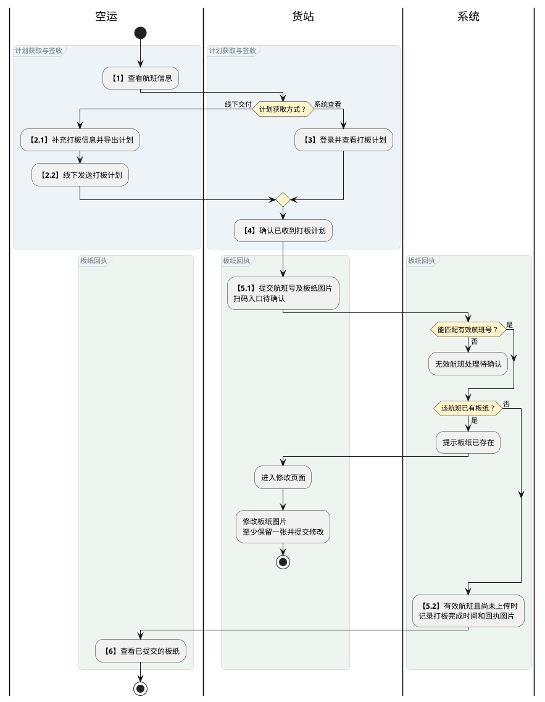
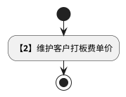
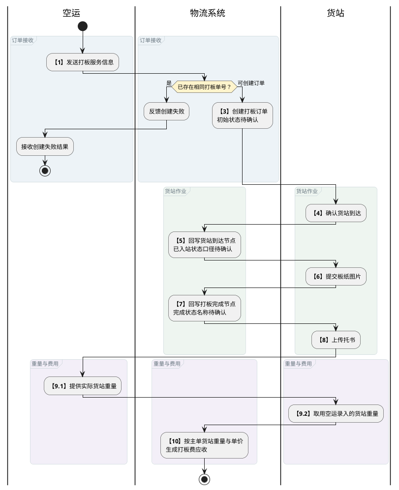

# 第035篇

> 本篇定位：航晟货站打板；主要内容：打板计划、板单接收、报价、订单与通知；文档角色：模块档；文档ID：B42F0635C9

**关联业务主流程：** [普货进出口关务流程](../PRD.高捷物流系统.第1册.需求框架/PRD.高捷物流系统.第005篇.普货进出口关务详细流程.D409606401.md#doc-D409606401-general-cargo-customs)、[跨境电商 BC 出口关务流程](../PRD.高捷物流系统.第1册.需求框架/PRD.高捷物流系统.第006篇.跨境电商BC出口关务详细流程.E21C200E67.md#doc-E21C200E67-bc-export-customs)、[跨境电商 BC 与个人物品 CC 进口流程](../PRD.高捷物流系统.第1册.需求框架/PRD.高捷物流系统.第007篇.跨境电商BC、个人物品CC进口详细流程.94C028FB51.md#doc-94C028FB51-bc-cc-import)、[跨境电商 BBC 进口入出区与调拨流程](../PRD.高捷物流系统.第1册.需求框架/PRD.高捷物流系统.第008篇.跨境电商BBC进口详细流程.B7B938B684.md#doc-B7B938B684-bbc-import)、[跨境电商 BBC 进口特殊业务流程](../PRD.高捷物流系统.第1册.需求框架/PRD.高捷物流系统.第008篇.跨境电商BBC进口详细流程.B7B938B684.md#doc-B7B938B684-special-operations)。
**关联模块流程：** [仓单订单外部对接流程](../PRD.高捷物流系统.第1册.需求框架/PRD.高捷物流系统.第011篇.DDP跨模块作业与结算流程.7579B595B8.md#doc-7579B595B8-section-e1cba7e91d25)、[货站打板流程](#doc-B42F0635C9-section-e7bebd79575e)、[打板订单管理流程](#doc-B42F0635C9-section-b937bb7ae261)。

## 1. 航晟货站打板

**业务入口：** 货站打板页面。

**概念模型：** [数据字典 · 地面运输与仓储实体](../PRD.高捷物流系统.第6册.运营支撑/PRD.高捷物流系统.第061篇.数据字典.7A3D9E1F50.md#doc-7A3D9E1F50-domain-ground-warehouse)

### 1.1 业务范围、菜单与流程

#### 1.1.1 业务目标与范围

货站打板覆盖打板计划导出与接收、板纸上传、打板报价及打板订单管理。

#### 1.1.2 操作入口

| 系统 | 一级菜单 | 二级菜单 | 说明 |
| --- | --- | --- | --- |
| 高捷物流平台 | 订单管理 | 打板订单管理 | 打板订单列表与详情；访问角色见[地面业务页面访问](../PRD.高捷物流系统.第6册.运营支撑/PRD.高捷物流系统.第062篇.角色与访问权限.5E31456F30.md#doc-5E31456F30-ground-entry)。 |

#### 1.1.3 受控术语

受控术语定义见 [数据字典 · 受控业务术语](../PRD.高捷物流系统.第6册.运营支撑/PRD.高捷物流系统.第061篇.数据字典.7A3D9E1F50.md#doc-7A3D9E1F50-domain-values)。

#### 1.1.4 货站打板流程说明

货站可线下接收或在系统中查看打板计划，提交板纸后由空运查看回执；同一航班已有板纸时进入修改入口。

步骤 5 的流程表要求扫码，上传规则要求直接进入页面且无需扫码，两种入口待确认；无效航班号的反馈方式与后续去向也尚未定义，图中不补画成功结果。

| 环节 | 参与方 | 处理与结果 | 后续环节 |
| --- | --- | --- | --- |
| 1. 查看航班信息 | 空运 | 以航班维度，查看航班信息 | 2或3 |
| 2. 导出“打板计划” | 空运 | 补充打板信息，并导出“打板计划” | 4 |
| 3. 查看“打板计划” | 货站 | 货站通过线下接收或者自己登陆到系统查看“打板计划” | 4 |
| 4. 收到“打板计划”（线下） | 货站 | 货站确认已收到“打板计划” | 5 |
| 5. 上传“板纸”（小程序） | 货站 | 通过微信扫一扫功能扫码单号，提交“板纸”图片 | 6和10 |
| 6. 查看“板纸” | 空运 | 空运通过系统查看货站已提交上来的“板纸” |  |

#### 1.1.5 逆向流程节点说明

同一航班已有板纸时的修改分支已包含在[货站打板流程图](#doc-B42F0635C9-section-e7bebd79575e)中。

| 异常节点 | 前置条件 | 后续处理 |
| --- | --- | --- |
| 小程序上传板纸 | 此航班号板纸已上传 | 提示已上传板纸，并进入修改已上传板纸页面。 |

#### 1.1.6 打板订单流程说明

打板服务形成订单，货站到达与板纸提交分别触发步骤 5、7 的系统状态回写，不新增人工审批或确认环节；托书和货站重量用于后续费用处理。

步骤 2 由货站独立维护，不要求每个订单重新维护报价；步骤 10 使用其客户打板单价。

步骤 3 的“待入站/待打板”、步骤 5 的“已入站”及步骤 7 的“已打板/打板完成”在正文中的状态口径尚未统一；图中保留已明确的作业与反馈，不选择其中一套状态作为确定结果。

| 环节 | 参与方 | 处理与结果 | 后续环节 |
| --- | --- | --- | --- |
| 1. 生成打板服务 | 空运 | 以航班维度，查看航班信息 | 3 |
| 2. 维护打板费单价 | 货站 | 通过报价管理功能，维护对特定客户的打板单价 | 3 |
| 3. 生成打板订单（待入站） | 货站 | 生成打板订单，此时订单状态=待入站 | 4 |
| 4. 货站到达 | 货站 | 货站人员操作“货站到达”小程序，确认节点 | 5和6 |
| 5. 打板订单（已入站） | 货站 | 打板订单状态更新为“已入站” | 6 |
| 6. 上传“板纸”（小程序） | 货站 | 通过微信扫一扫功能扫码单号，提交“板纸”图片 | 7和8 |
| 7. 打板订单（已打板） | 货站 | 打板订单状态更新为“已打板” | 8 |
| 8. 上传“托书”（小程序） | 货站 | 通过微信扫一扫功能扫码单号，提交“托书”图片 | 9 |
| 9. 录入货站重量 | 货站 | 取空运录入的货站重量（提单制作部分可取到） | 10 |
| 10. 生成主单的“打板费”应收 | 货站 | 根据主单的实际货站重量*单价=打板费 |  |

#### 1.1.7 逆向流程节点说明

重复打板单号的失败分支已包含在[打板订单流程图](#doc-B42F0635C9-section-b937bb7ae261)中，不进入后续货站作业。

| 异常节点 | 前置条件 | 后续处理 |
| --- | --- | --- |
| 重复打板单号创建打板订单 | 已存在此打板单号的打板订单 | 创建失败并反馈 |

### 1.2 货站打板功能与规则

#### 1.2.1 空运系统-导出打板计划

- 空运人员基于航班导出打板计划，然后线下发给货站人员。

#### 1.2.2 打板计划导出与板纸回执规则

空运人员导出打板计划和接收打板回执。

**参与方：** 空运-航线部

**入口与前提：** 已操作配板计划。

**业务结果：** 打板计划导出成功，接收板纸回执成功。

**处理规则**

1. 用户选中特定航班后，可导出该航班的打板计划 Excel 文件。

1. 货站人员在微信小程序输入航班号并上传板纸回执照片后，空运系统更新对应节点，记录打板完成时间和板纸回执图片。

#### 1.2.3 小程序上传“板纸”

- 通过微信小程序上传“板纸”。

#### 1.2.4 板纸上传界面原型概述

点击“板纸上传”后，先进行“扫一扫”，再进入上传页面。

**界面原型概述 · 板纸上传**

| 字段或控件 | 适用条件 | 个别界面约束或可见反馈 |
| --- | --- | --- |
| 航班号 | 首次上传 | 必填，用于匹配有效航班。 |
| 航班号 | 修改已上传板纸 | 只读，不可变更。 |
| 扫码单号/订单关联 | 上传板纸 | 必填，扫码带入并据此关联打板订单；关联键按打板订单流程确定。 |
| 图片 | 提交或修改提交 | 必填，至少保留1张、最多9张，单张小于6 MB；支持本地选择或拍照，可删除后重传。 |
| 备注 | 上传或修改 | 选填。 |
| 上传状态/修改记录 | 首次上传、修改或重复上传 | 系统记录首次上传、修改和重复上传拦截结果。 |

#### 1.2.5 板纸上传规则

货站人员通过微信小程序上传板纸

**参与方：** 货站人员

**入口与前提：** 该航班号已完成配板。

**业务结果：** 可成功上传板纸。

**处理规则**

1. 点击“板纸上传”后，直接进入板纸上传详情页面，无需扫码。

1. 用户手动录入“航班号”，然后从本地选择或拍摄板纸图片并上传。

- 必填信息：航班号；至少一张图片，最多上传9张，单张图片大小<6M。

1. 点击“提交”后，若该航班号尚未上传板纸且能匹配有效航班号，则上传成功并显示“板纸已完成上传”提示。若该航班号已上传板纸，则显示“上传失败，板纸已存在，您可修改板纸。”提示，并跳转到该航班号的板纸上传修改页面。

- 板纸上传修改页面：航班号不可编辑。

- 已上传的板纸图片可保留，也可删除后重新上传，但必须至少保留一张。

#### 1.2.6 接收空运打板订单

- 接收空运消息，同步打板订单。

#### 1.2.7 上游打板订单接收规则

空运基于主单创建打板操作，发送打板订单信息，物流成功创建打板订单

**参与方：** 空运系统，物流系统

**入口与前提：** 空运操作主单的打板

**业务结果：** 打板订单校验和创建成功

**处理规则**

**空运在填写打板操作后，传输打板信息给物流系统**

- 客户；

- 提单号；

- 航班号；

- 货站；

- 数量；

- 重量；

- 体积；

1. 页面按照打板订单的创建时间倒序排序。

1. 打板订单的初始状态为：“待打板”，当接收到小程序提交的已打板信息（通过“航班号”进行关联），将打板订单状态更新为“已打板”。

#### 1.2.8 打板报价维护管理

- 新建并维护打板报价。

#### 1.2.9 报价操作入口

报价管理页面支持查看和维护报价；新建报价页面用于创建报价。

#### 1.2.10 打板报价列表栏界面原型概述

**界面原型概述 · 打板报价列表栏**

- **区域字段或业务元素**：客户、税率、币种、报价科目、报价金额、单位、计费方式、生效日期、截止日期、备注。
- **区域级通用规则**：除所列特例外，字段均必填。

| 字段或控件特例 | 界面特例或可见反馈 |
| --- | --- |
| 客户 | 取合作方档案与航晟物流为客户关系的合作方；是否筛选项：是；初始不设值。 |
| 税率 | 取基础数据配置；初始不设值。 |
| 币种 | 取基础数据配置；默认值：CNY。 |
| 报价科目 | 选项：打板费；是否筛选项：是；默认值：打板费。 |
| 单位 | 选项：kg；默认值：kg。 |
| 计费方式 | 常规；物流计费方式；梯度报价方式；首加续报价方式；默认值：常规。 |
| 生效日期 | 选单日。 |
| 截止日期 | 截止日期>=生效日期。 |
| 备注 | 长度限制：500 个字符；选填。 |

#### 1.2.11 打板报价管理规则

维护打板报价的新建和管理

**参与方：** 货站打板人员

**入口与前提：** 系统已登录

**业务结果：** 打板报价创建成功，并可成功修改或删除。

**处理规则**

1. 页面参考“航晟物流-仓库客户报价”模块的设计风格和功能。

1. 页面排序：以报价更新时间排序展示。

1. 操作项：修改或删除，删除提供二次弹窗，进行删除确认。

#### 1.2.12 打板订单管理

- 查看和管理打板订单明细。

#### 1.2.13 打板订单列表栏界面原型概述

**界面原型概述 · 打板订单列表栏**

| 字段或控件 | 个别界面约束或可见反馈 |
| --- | --- |
| 客户 | 空运订单取值；可作为筛选条件。 |
| 订单号、提单号、航班号、货站 | 可作为筛选条件。 |
| 状态 | 待打板；已打板。 |
| 数量（件） | 空运录入的托书的毛件体。 |

列表同时展示重量（kg）、体积（m³）。

#### 1.2.14 打板订单列表规则

查看打板订单的明细记录

**参与方：** 货站打板人员

**入口与前提：** 打板订单已创建

**业务结果：** 打板订单按创建时间排序并展示对应状态；符合条件时可修改状态或删除订单。

**处理规则**

1. 打板订单排序：按照打板订单创建时间倒序排序。

**打板订单状态**

- 待入站：已接收打板订单，但尚未完成打板；

- 已入站：已通过微信小程序“货站到达”扫码关联订单；

- 已打板：已通过微信小程序按“航班号”关联打板完成节点，并将订单状态更新为“已打板”；

1. 状态管理：角色授权见[地面业务操作权限](../PRD.高捷物流系统.第6册.运营支撑/PRD.高捷物流系统.第062篇.角色与访问权限.5E31456F30.md#doc-5E31456F30-ground-actions)。点击操作列中的“状态”按钮修改打板订单状态，规则与航晟物流运输运单的“状态管理”功能一致。

1. 删除：内部上游创建的打板订单不显示“删除”按钮；本地创建的打板订单仅在状态=待入站时可删除。

#### 1.2.15 打板订单详情

- 查看打板订单详情，操作记录和应收付账单。

#### 1.2.16 订单详情组成

订单详情包括操作记录和应收付账单。

#### 1.2.17 打板订单详情规则

查看操作记录和应收付账单

**参与方：** 货站打板人员

**入口与前提：** 打板订单已创建

**业务结果：** 订单详情展示操作记录及应收、应付账单。

**处理规则**

**操作记录**

- 创建打板订单：接收上游系统的打板订单创建。

- 打板完成：接收微信小程序发送的该航班号批次的所有打板订单的完成，然后更新到“打板完成”订单状态。

1. 应收付账单：当订单状态=“打板完成”时，此时生成应收付账单明细。

- 打板费=根据报价配置的打板费单价（元/kg）* 该打板订单的重量（kg）；

#### 1.2.18 创建打板订单

- 创建外部的打板订单。

#### 1.2.19 打板订单创建界面原型概述

**界面原型概述 · 打板订单创建**

| 字段或控件 | 个别界面约束或可见反馈 |
| --- | --- |
| 客户订单号 | 不管是否输入客户订单号，均会生成系统的货站唯一订单编码；选填。 |
| 航班号 | 选填。 |
| 客户、业务类型 | 必填。 |
| 财务组织名称 | 必填；默认值：广州航晟物流有限公司。 |
| 客户联系人 | 长度为2～50个字符；选填。 |
| 联系电话 | 输入8～20位数字；选填。 |
| 委托重量（kg) | 数值输入长度为1～10个字符；必填。 |
| 委托数量（件）、委托体积（m3) | 数值输入长度为1～10个字符；选填。 |
| 委托中文品名 | 长度为2～40个字符；选填。 |
| 货站 | 2~80字符；选填。 |
| 备注 | 长度限制：500 个字符；选填。 |

#### 1.2.20 打板订单创建规则

为货站提供创建打板订单的功能

**参与方：** 货站打板人员

**入口与前提：** 已登录

**业务结果：** 可成功创建打板订单。

**处理规则**

1. 此功能用于外部客户委托我司进行的打板服务，由此创建其派发给我司的打板订单；

1. 客户订单号不做重复性校验，无论是否输入，均本地生成唯一的本地打板订单编码。

1. 若提交成功，则提示语提示“订单已成功创建！”；必填信息未填，则提示“请完成必要信息的填写！”

**分支与边界：** 创建成功，在“货站打板”列表页面中可成功展示。

#### 1.2.21 消息通知

- 板纸修改提交或货站赶单预警触发后，系统形成企业微信通知。

#### 1.2.22 微信消息通知

完整触发条件、接收角色和消息模板见[货站打板企业微信通知规则](../PRD.高捷物流系统.第6册.运营支撑/PRD.高捷物流系统.第064篇.消息推送.5F950AB3B1.md#doc-5F950AB3B1-section-b42f0635c9-message)。
