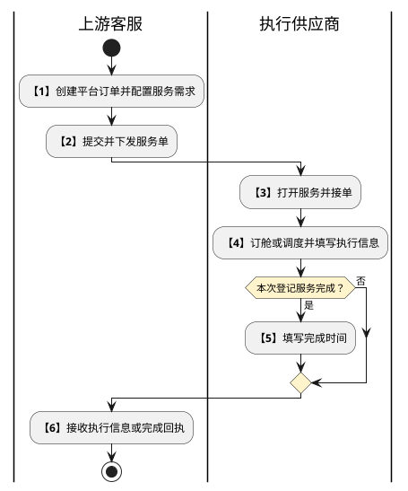
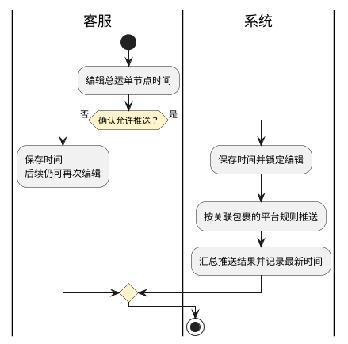

# 第038篇

> 本篇定位：多式干线服务；主要内容：空运与海运服务执行、中港车调度与单证、海运提单及平台时间推送；文档角色：模块档；文档ID：76B3872565

共用定义见[综合订单与服务协同实体](../PRD.高捷物流系统.第8册.平台共用与运营/PRD.高捷物流系统.第063篇.数据字典.7A3D9E1F50.md#doc-7A3D9E1F50-integrated-order-model)、[仓储模型与多式干线权限](../PRD.高捷物流系统.第8册.平台共用与运营/PRD.高捷物流系统.第064篇.角色与访问权限.5E31456F30.md#doc-5E31456F30-warehouse-trunk-access)。

## 1. 干线服务执行

本篇承接平台订单下发后的服务执行。上游负责选择所需服务、供应商与需求，提交后生成关联服务单并分发；供应商执行订舱或调度、登记服务信息和完成节点，上游客服接收回执。看不到已下发服务单时，核对所选供应商以及下游账号所属财务组织的绑定关系。

### 1.1 服务入口与责任

| 入口 | 服务单范围 | 执行方 |
| --- | --- | --- |
| 进口空运 | 平台订单运输方式为空运、勾选干线服务且服务类型为委外服务。来源未另给进出口方向条件，不能仅凭菜单名补充过滤条件。 | 接收服务的客服。 |
| 出口空运 | 平台订单运输方式为空运、勾选干线服务且服务类型为我司服务。来源未另给进出口方向条件。 | 空运产品部。 |
| 海运 | 运输方式为海运并勾选干线服务。 | 委外服务由电商客服执行；我司服务由海运部执行。 |
| 中港车 | 运输方式为陆运并勾选干线服务。 | 电商客服。 |
| 运输服务 | 平台订单勾选运输服务，不以干线运输方式替代运输服务条件。 | 接收服务的电商客服、航晟客服；执行差异见[运输服务](PRD.高捷物流系统.第039篇.用车-订单管理.32C78B8106.md#doc-32C78B8106-platform-transport-service)。 |

### 1.2 执行状态与中止结果

以下是服务单状态，不替代原用车订单、运输运单、订舱单各自状态。

| 当前状态 | 可执行操作 | 触发与结果 |
| --- | --- | --- |
| 待接单 | 查看；空运、海运订舱；中港车、运输服务调度。 | 服务单生成的初始状态；订舱或调度提交成功后为进行中，节点为已订舱或已调度。 |
| 进行中 | 查看、编辑、状态管理、取消服务、终止服务。 | 状态管理登记完成后为已完成；取消服务后为已取消；终止服务后为已终止。 |
| 已完成、已取消、已终止 | 查看。 | 服务节点与对应终态一致，不再开放执行编辑。 |

未接单时空运、海运节点为未订舱，车辆服务为未调度。取消与终止仅适用于进行中的服务：取消不生成该服务商品的应收应付，终止须生成应收应付。此规则与既有“取消调度产生返空费”不是同一操作；已发生费用如何处理及两个操作同时涉及一张单时的先后与优先级尚未定义。

| 步骤 | 参与方 | 处理与交接 |
| --- | --- | --- |
| 1 | 上游客服 | 创建订单、选择服务和供应商、填写需求。 |
| 2 | 上游客服、系统 | 提交后生成关联服务单并下发。 |
| 3 | 执行供应商 | 进入服务执行页面，接单订舱或调度。 |
| 4 | 执行供应商 | 填写执行信息，可先回执执行信息，也可继续登记完成节点。 |
| 5 | 执行供应商 | 服务完成时登记完成时间。 |
| 6 | 上游客服 | 接收服务回执，查看信息和状态。 |

本次回执结束不等于服务必然完成。上游配置的完整规则由订单篇维护，本篇不另行定义订单创建条件。

**界面原型概述 · 共用状态管理**

- **区域字段或业务元素**：服务节点、处理人、干线到达时间、备注、确定、取消。
- **区域级通用规则**：服务节点选择已完成，处理人取当前账号；到达时间默认当前时间、允许编辑，精确到秒；备注选填。

### 1.3 查询、附件和追溯

本篇列表默认每页 50 条。未填写条件时查询全部授权范围记录，填写后按条件过滤；结果按建单时间倒序，重置清空条件。无效或缺少必填项时明确提示对应字段并禁用提交或保存；返回不保存输入，也不推进状态。

**界面原型概述 · 共用附件区域**

- **区域字段或业务元素**：资料名称、附件类型、来源、操作时间、操作人、选择、下载、添加附件、删除附件。
- **区域级通用规则**：来源区分上游订单、当前服务单等实际来源；可勾选下载，添加附件经弹窗确定后进入列表；可多选删除本次维护的附件。

附件弹窗区分提单与其他附件；上游资料可包含装箱单、发票、报关单、合同、提货单等。来源未明确能否删除上游附件、大小和格式限制，不能将展示附件当成可随意覆盖的上游原件。

**界面原型概述 · 服务详情与追溯**

- **区域字段或业务元素**：服务单信息、节点轨迹、操作日志三个页签；轨迹中的订单号、总运单号、节点与发生时间；日志中的操作人、操作名称、操作时间、操作内容。
- **区域级通用规则**：详情只读；创建记录包含平台订单号，修改记录包含变更字段及新值，取消、终止记录相应操作。

空运订舱轨迹与日志记录航司、航班号、出港日期；海运记录船名、船次、出港日期和每组柜号、封条号、柜型。服务完成记录干线已到达及备注，创建节点记录建单完成。来源中的操作时间与用户填写的业务完成时间均需保留，不能相互覆盖。

## 2. 空运服务界面

### 2.1 委外空运

**界面原型概述 · 委外空运查询与列表**

- **区域字段或业务元素**：查询栏为总运单号、平台订单号、服务单号、客户、业务类型；列表为服务单号、订单号、总运单号、业务类型、航司、客户、供应商、建单时间、接单时间、完成时间、服务单状态、服务节点、操作。
- **区域级通用规则**：三个单号支持精确批量查询，客户从客户档案模糊检索，业务类型从业务字典选择；列表只读，接单时间取订舱时间，完成时间取状态管理的干线到达时间。

**界面原型概述 · 委外空运订舱**

- **区域字段或业务元素**：服务单号、财务组织、所属部门、业务类型、客户、客户姓名、联系电话、邮箱、启运港、目的港、要求提货时间、要求到达时间、品名、件数、重量、体积、尺寸；供应商、总运单号、航司、航班号、实际出港时间；附件。
- **区域级通用规则**：基本、联系人、服务需求和货物资料由上游带入且只读；仅待接单可订舱，进行中可编辑执行信息。

| 字段或控件特例 | 界面特例或可见反馈 |
| --- | --- |
| 供应商 | 上游带入；来源备注允许待接单修改、进行中不允许修改，但同表“可编辑”列标为否，修改入口待确认。 |
| 总运单号、航司、航班号、实际出港时间 | 必填且可录入；总运单号最多 100 字，航班号最多 50 字，允许字母、数字和符号。航司从基础数据模糊搜索选择；实际出港时间本表精确到日期。 |

### 2.2 我司空运

**界面原型概述 · 我司空运查询与列表**

- **区域字段或业务元素**：总运单号、订单号、服务单号、启运港、分泡比例、目的港、业务员、出港日期、建单日期、航班号、特殊货物、航司；列表为服务单号、订单号、总运单号、分单号、航司、客户、供应商、建单时间、接单时间、完成时间、服务单状态、服务节点、操作。
- **区域级通用规则**：三个单号精确批量搜索，列表只读，时间和状态按本篇执行规则展示。

| 字段或控件特例 | 界面特例或可见反馈 |
| --- | --- |
| 启运港、目的港 | 基础港口候选；启运港支持多选。 |
| 分泡比例 | 默认全部；可选 0 至 1，间隔 0.1。 |
| 业务员 | 用户中心模糊搜索。 |
| 出港日期、建单日期 | 日期区间。 |
| 航班号 | 基础航班号精确查询。 |
| 特殊货物 | 默认全部，可选锂电池、危险品、鲜活、枪械。 |
| 航司 | 平铺展示舱位产品中当前航线运营人员、操作员绑定的航司，不自行扩大为全部航司。 |

订舱页按基本信息、订单信息、订舱信息、货物信息、航班信息、费用及打板信息分区；航班明细允许不限行数。通用空运订舱和 D4 交接字段见[空运提单与航司推送 · 订舱航班选择](../PRD.高捷物流系统.第2册.订单管理/PRD.高捷物流系统.第023篇.空运提单与航司推送.ED54E43A14.md#doc-ED54E43A14-d4-airline-handover)。

本来源另要求成本、指导价为正数并保留两位小数，成本分泡和内部结算分泡为 0 至 1、保留一位小数；航线备注最多 256 字。它与航司交接来源的备注 100 字、D4 航班必填、盈利规则是否必填及多项编辑性不同，待确认前不把两组约束叠加为已定规则。提交使服务进行中、节点已订舱；这不等于独立订舱对象必然审核通过。

## 3. 海运订舱与提单

### 3.1 海运服务单

**界面原型概述 · 海运查询与列表**

- **区域字段或业务元素**：查询栏为总运单号、订单号、服务单号、客户、业务类型；列表为服务单号、订单号、总运单号、业务类型、客户、供应商、建单时间、接单时间、完成时间、服务单状态、服务节点、操作。
- **区域级通用规则**：单号精确批量查询、客户档案模糊搜索、业务类型选择；接单时间为订舱时间，完成时间为干线到达时间。

**界面原型概述 · 海运订舱**

- **区域字段或业务元素**：服务单号、财务组织、所属部门、业务类型、客户；发货人名称/公司地址/邮箱、收货人名称/公司地址/邮箱；启运港、目的港、要求提货时间、预计出港时间；品名、件数、重量、体积、尺寸、柜型、柜量；供应商、总运单号、船名、船次、实际出港时间、预计到港时间、柜号/封条号/柜型明细；附件。
- **区域级通用规则**：上游基本、联系人、需求和货物资料带入且只读；执行信息必填、可编辑，日期精确到日。仅待接单可订舱。

| 字段或控件特例 | 界面特例或可见反馈 |
| --- | --- |
| 供应商 | 上游带入，来源备注要求待接单可改、进行中不可改，但可编辑列为否，入口待确认。 |
| 总运单号、船名、船次 | 分别最多 100、50、50 字，允许数字、字母、符号。 |
| 集装箱明细 | 新增一组柜号、封条号、柜型；柜号与封条号最多 50 字，柜型取基础数据。 |

### 3.2 海运提单录入与常用公司

海运提单列表展示运输方式为海运且勾选干线服务的服务单；点击提单录入进入制单页面。查询结果按建单时间倒序。

**界面原型概述 · 海运提单查询与列表**

- **区域字段或业务元素**：查询栏为总运单号、订单号、服务单号、客户；列表为订单号、总运单号、运输方式、业务模式、干线服务完成时间、启运港、目的港、预计到达时间、提单录入。
- **区域级通用规则**：四项查询均支持精确批量搜索；总运单号来自订舱或调度，港口与预计到达时间取干线服务单。

**界面原型概述 · 海运提单录入**

- **区域字段或业务元素**：启运港、目的港、预计出港时间、预计到港时间、实际到港时间、中文品名、包装类型、是否整柜、件数、毛重、体积；柜号/封条号/柜型明细；总运单号、船名、船次、发货人、收货人、通知人、运输条款、海关申报价值、唛头、添加、删除、提交、取消。
- **区域级通用规则**：字段表列明内容必填，干线服务带入字段允许编辑；集装箱信息可新增和勾选删除，不把空运模板字段强加于海运。

| 字段或控件特例 | 界面特例或可见反馈 |
| --- | --- |
| 实际到港时间 | 默认海运干线服务完成时间。 |
| 启运港、目的港 | 来源同时写“上游带入”与默认香港、南沙新港二期码头，固定默认与上游值的优先关系待确认。 |
| 是否整柜 | 整柜、拼箱，默认整柜。 |
| 中文品名、包装类型、总运单号、船名、船次 | 来源上限均为 500 字。 |
| 运输条款 | 到付 FREIGHT COLLECT、预付 FREIGHT PREPAID，默认到付；纠正来源中的 FERIGHT 拼写，不改变业务含义。 |
| 海关申报价值 | 支持两位小数，币种和非负边界未说明。 |
| 唛头 | 最多 2000 字；来源标为只读但未给取值，待确认。 |

**界面原型概述 · 海运常用公司**

- **区域字段或业务元素**：公司名称、地址、电话、邮箱地址、常用、公司别称、别称搜索、选择、删除、确定、取消。
- **区域级通用规则**：分别从发货人、收货人、通知人入口使用；勾选常用时公司别称必填，确定后保存到右侧常用列表，不勾选时不进入常用列表；选择已存公司回填左侧资料。

来源未明确常用公司的共享范围、别称重名处理及删除影响，不继承空运常用联系人的唯一性规则作为已确认海运约束。

## 4. 中港车调度与单证

### 4.1 查询与调度

中港车支持单个服务调度与多个服务批量调度一辆中港车，仅待接单可进入。批量页可查询并添加服务单，按客户页签展示其货物及附件；来源未定义不同业务类型、口岸或供应商是否能混合调度，不直接套用普通用车批量条件。

**界面原型概述 · 中港车查询与列表**

- **区域字段或业务元素**：总运单号、订单号、服务单号、客户、业务类型、业务模式、司机纸号；列表为司机纸号、服务单号、订单号、总运单号、业务类型、业务模式、柜车、车辆类型、客户、供应商、建单时间、接单时间、完成时间、服务单状态、服务节点、调度、批量调度、查看、编辑、状态管理。
- **区域级通用规则**：单号与司机纸号精确批量搜索，客户档案模糊搜索，业务模式选集货、备货。司机纸号来自单证制作绑定；接单时间应取调度事件，来源误写订舱时间的映射仍待确认。

**界面原型概述 · 中港车单次及批量调度**

- **区域字段或业务元素**：服务单号、财务组织、所属部门、业务类型、客户、客户名称/电话/邮箱、提货时间/地点/联系人/电话、送货时间/地点/联系人/电话、品名、件数、重量、体积、尺寸、供应商；司机纸号、总运单号、车型、柜型、柜号、封条号/海关关锁号、内地车牌、香港车牌、多行司机姓名/联系方式/身份证号；附件、单证制作、保存、添加订单。
- **区域级通用规则**：上游基本、联系人、提送货和货物资料带入且只读；新增司机增加一行司机资料。字段表中的送货电话日期格式为冲突，不按日期约束电话。

| 字段或控件特例 | 界面特例或可见反馈 |
| --- | --- |
| 供应商 | 备注允许待接单改、进行中禁止，字段可编辑列为否，入口待确认。 |
| 司机纸号、总运单号 | 必填、最多 100 字；保存司机纸号后生成总运单号，号码生成后是否还可手改未明确。 |
| 车型、柜型、柜号 | 车型为柜车、吨车。柜型为截图中的独立选择项；柜号最多 50 字，柜车时必填，字段表又对所有车型标必填，需确认吨车是否适用。 |
| 封条号/海关关锁号 | 字段表必填、最多 100 字。 |
| 内地车牌、香港车牌 | 必填，各最多 50 字。 |

保存后，BC 单个总运单为“司机纸号+D”，多个为“司机纸号+D1、司机纸号+D2……”；CC 分别使用 K、K1、K2……。单个变多个的改号时点、同一司机纸混合 BC/CC、重复保存是否复用号码和生成序号上限未明确。

### 4.2 单证录入与输出

资料保存后，可分别预览和下载司机纸、发票、装箱单、清单；单证中的业务值来自所选服务资料及当前录入，不使用演示值作为业务常量。

**界面原型概述 · 中港车单证资料**

- **区域字段或业务元素**：封条号/海关关锁号、内地车牌、香港车牌、司机名称、进出境时间、提货点、卸货点、电子锁号码、海关编码；付货人或货物转运代理公司、收货人公司、牌头公司；货物行的品名、总运单号、件数、毛重、净重、单价；资料录入、司机纸、发票、装箱单、清单页签、保存、下载。
- **区域级通用规则**：来源字段表均选填且可改，带入上游已有值；司机默认取第一行司机，进出境时间精确到日。选择常用公司时回填公司名称、地址、电话、企业代码，勾选常用时别称必填并保存供后续查询。

| 字段或控件特例 | 界面特例或可见反馈 |
| --- | --- |
| 提货点、卸货点 | 默认香港、广州机场快件中心，允许修改。 |
| 封条号/海关关锁号 | 最多 100 字。 |
| 车牌、司机、地点、海关编码、总运单号 | 来源上限为 50 字。 |
| 件数、毛重、净重、单价 | 来源允许任意字母与符号，与数值汇总要求矛盾；数量、重量、价格需形成有效数值后才能计算，具体校验待确认。 |

| 输出件 | 来源图中需承接的变量和汇总 |
| --- | --- |
| 司机纸 | 内地/香港车牌、进出境日期、逐行品名/总运单号/件数/净重/价格、付货或代理公司与收货公司信息、牌头公司及司机、电子锁号、海关编码；件数与净重按货物行汇总，来源图的总金额为逐行价格之和。录入列称单价、输出列称价格，是否应先乘件数尚未明确。 |
| 发票 | 收货公司与地址、发票号、合同号（S/C No）、日期、序号、货物名称、件数、净重、毛重、价值（RMB）、板数和合计。来源录入称单价，输出图为价值，金额列的确切含义待确认。 |
| 装箱单 | 起点、终点、总运单号、日期、分单号、车号；分单、最终目的地、品名、件数、重量、货值、发货人、收货人及汇总。 |
| 清单 | 序号、快件单号、内件名称、价值（RMB）、数量、重量（KG）及总价值、总重量；明细与源包裹的选择范围待确认。 |

来源模板另展示跨境直转、香港/广州、皇岗海关/5301、广州机场海关/5141；装箱单图展示 HKG、CAN。上述路线和口岸标识的适用范围未说明，不推广为所有中港车业务的固定内容。输出精度、超长换页和已下载后再次编辑的效果未定义。

## 5. 平台节点时间推送

一个总运单可关联多个平台的多张小包裹订单。客服维护总运单的节点时间，保存时覆盖原值并同步更新该总运单下所有关联小包裹；保存后仍可编辑，点击“确定，允许推送”后锁定，不再允许编辑，系统再按各平台既有推送规则处理和发送。

**界面原型概述 · 推送时间查询与列表**

- **区域字段或业务元素**：总运单号、订单号、运输方式；列表为订单号、总运单号、运输方式、业务模式、启运港、目的港、预计到达时间、出库时间、清关开始时间、清关完成时间、实际到达时间、系统推送时间、状态、编辑。
- **区域级通用规则**：两个单号精确批量查询，运输方式取基础数据；按建单时间倒序。出库时间取平台订单生成出库清单的时间，不改称物理出库完成时间。

**界面原型概述 · 推送节点时间编辑**

- **区域字段或业务元素**：干线到达时间、清关开始时间、清关结束时间、保存、确定并允许推送。
- **区域级通用规则**：三个时间必填，精确到秒；清关开始与实际到达时间默认干线服务完成时间，允许编辑，清关完成时间由客服录入。

| 聚合结果 | 总运单推送状态 |
| --- | --- |
| 所有关联小包裹信息均推送成功 | 已推送。 |
| 仅部分成功 | 部分推送。 |
| 未推送 | 未推送。 |

系统推送时间取最新一次推送数据时间。零成功但已尝试、无关联包裹、同一包裹多平台结果不一致、失败重试及锁定后补入包裹的处理未定义；“干线到达时间”与列表“实际到达时间”的对应关系需确认。

