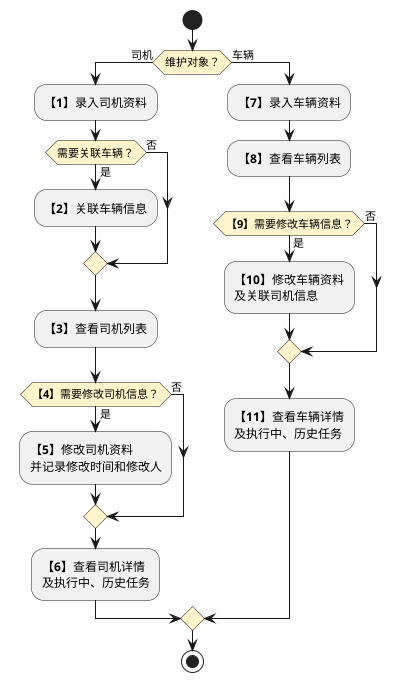
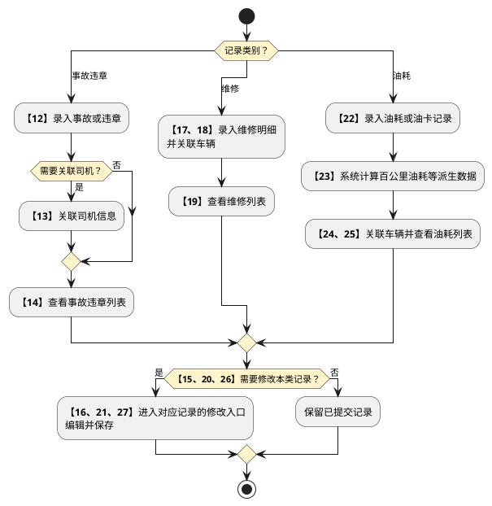

# 第040篇

> 本篇定位：航晟车队管理；主要内容：车队资料、证件、违章事故、维修与油耗；文档角色：模块档；文档ID：03280CBA2C

**关联业务主流程：** [业务模式主流程总览](../PRD.高捷物流系统.第1册.需求框架/PRD.高捷物流系统.第003篇.业务模式主流程总览.460E66776A.md#doc-460E66776A-business-modes)、[异常处理流程](../PRD.高捷物流系统.第1册.需求框架/PRD.高捷物流系统.第010篇.异常处理流程.13D397C572.md#doc-13D397C572-exceptions)。
**关联模块流程：** [车队管理流程](#doc-03280CBA2C-section-fca683731c5a)。

## 1. 航晟车队管理

**业务入口：** 车队管理页面。

**概念模型：** [数据字典 · 地面运输与仓储实体](../PRD.高捷物流系统.第6册.运营支撑/PRD.高捷物流系统.第061篇.数据字典.7A3D9E1F50.md#doc-7A3D9E1F50-domain-ground-warehouse)

### 1.1 业务范围、角色与流程

#### 1.1.1 业务目标与范围

车队管理覆盖司机、车辆、违章事故、维修和油耗信息的创建、查询与修改。

#### 1.1.2 操作入口

| 系统 | 一级菜单 | 二级菜单 | 说明 |
| --- | --- | --- | --- |
| 航晟物流工作台 | 航晟物流车队管理 | 车辆管理 | 展示航晟内部车辆的基本信息和当前状态。 |
| 航晟物流工作台 | 航晟物流车队管理 | 司机管理 | 展示航晟司机的个人信息以及工作状态。 |
| 航晟物流工作台 | 航晟物流车队管理 | 违章事故管理 | 展示车辆违章事故信息以及保险理赔、处罚结果。 |
| 航晟物流工作台 | 航晟物流车队管理 | 维修管理 | 展示车辆维修的记录。 |
| 航晟物流工作台 | 航晟物流车队管理 | 油耗管理 | 展示车辆油耗信息。 |

各类资料的角色操作授权见[地面业务操作权限](../PRD.高捷物流系统.第6册.运营支撑/PRD.高捷物流系统.第062篇.角色与访问权限.5E31456F30.md#doc-5E31456F30-ground-actions)。

#### 1.1.3 参与角色与职责

管理员、主管、客服的授权范围见[地面业务操作权限](../PRD.高捷物流系统.第6册.运营支撑/PRD.高捷物流系统.第062篇.角色与访问权限.5E31456F30.md#doc-5E31456F30-ground-actions)。司机、车辆、违章事故、维修和油耗的录入及校验规则按本篇各场景执行。

#### 1.1.4 流程描述

司机与车辆资料分别维护，查看列表后按需要进入修改，不要求每次查看都修改。

事故违章、维修和油耗记录各自形成独立维护流程，仅在需要更正时修改已提交记录。

| 环节 | 参与方 | 处理与结果 | 后续环节 |
| --- | --- | --- | --- |
| 1. 新增司机录入 | 司机管理 | 录入司机的基础资料 | 2 |
| 2. 关联车辆信息 | 司机管理 | 录入的司机信息可与录入的车辆信息进行关联，反映司机与车辆的驾驶关系。 | 3 |
| 3. 查看司机列表 | 司机管理 | 可查看司机的列表，进行快捷筛选等。 | 4 |
| 4. 修改司机信息？ | 司机管理 | 如需要更新司机信息，则可通过修改功能进行维护更新。 | 5 |
| 5. 修改司机资料 | 司机管理 | 可修改司机记录，修改的时间和修改人的信息将被记录。 | 6 |
| 6. 查看司机详情 (执行中的任务&历史任务） | 司机管理 | 可查看司机的详细资料，可看到其当前执行中的任务和历史任务情况。 |  |
| 7. 新增车辆录入 | 车辆管理 | 录入车辆的资料信息。 | 8 |
| 8. 查看车辆列表 | 车辆管理 | 查看车辆的列表信息，并可进行快捷筛选。 | 9 |
| 9. 修改车辆信息？ | 车辆管理 | 如需要更新车辆信息，则可通过修改功能进行维护更新。 | 10 |
| 10. 修改车辆资料，更新司机信息等 | 车辆管理 | 如需要更新车辆信息，则可通过修改功能进行维护更新。 | 11 |
| 11. 查看车辆详情 (执行中的任务&历史任务） | 车辆管理 | 可查看车辆的详细资料，可看到其当前执行中的任务和历史任务情况。 |  |
| 12. 录入事故违章 | 事故违章管理 | 选择类型，填写录入事故或违章信息。 | 13 |
| 13. 关联司机信息 | 事故违章管理 | 可选择司机信息，进行事故和违章的关联。 | 14 |
| 14. 查看事故违章列表 | 事故违章管理 | 在事故违章列表，可查看和筛选事故违章记录。 | 15 |
| 15. 修改事故违章信息？ | 事故违章管理 | 如修改事故违章，可通过修改功能进行更新。 | 16或结束 |
| 16. 修改事故违章 | 事故违章管理 | 编辑事故违章信息，进行保存提交。 |  |
| 17. 录入维修记录 | 维修管理 | 录入维修记录的明细信息 | 18 |
| 18. 关联车辆信息 | 维修管理 | 记录是哪辆车发生的维修 | 19 |
| 19. 查看维修列表 | 维修管理 | 查看维修记录列表 | 20 |
| 20. 修改维修信息？ | 维修管理 | 判断是否修改已提交的维修记录 | 21或结束 |
| 21. 修改维修记录 | 维修管理 | 若需要改动，则通过修改功能进行编辑修改 | 结束 |
| 22. 录入油耗/油卡记录 | 油耗管理 | 录入本次的加油情况、油卡消费情况和耗损情况 | 23 |
| 23. 系统自动计算百公里油耗等派生数据 | 油耗管理 | 系统根据本篇定义的计算规则自动计算百公里油耗等派生数据。 | 24 |
| 24. 关联车辆信息 | 油耗管理 | 记录是哪辆车发生的油耗记录 | 25 |
| 25. 查看油耗列表 | 油耗管理 | 查看油耗记录的列表 | 26 |
| 26. 修改油耗信息？ | 油耗管理 | 是否要修改已提交的油耗记录 | 27或结束 |
| 27. 修改油耗记录 | 油耗管理 | 若需要改动，则通过修改功能进行编辑修改 | 结束 |

#### 1.1.5 关键控制点

| 所属步骤 | 关键控制点描述 |
| --- | --- |
| 1 | 新增司机资料的字段定义见 [司机新增界面原型概述](#doc-03280CBA2C-section-903f3581fc17)。 |
| 7 | 新增车辆资料的字段定义见 [车辆新增界面原型概述](#doc-03280CBA2C-section-86bd68b5aa44)。 |

### 1.2 航晟车队管理功能与规则

#### 1.2.1 司机管理页面

司机管理页面，可以查看、新增、修改所有的司机信息。

#### 1.2.2 司机列表页面

**按钮说明**

- 查询：在不选择任何查询字段下，点击“查询”按钮，默认所有查询条件。选择对应的查询条件，则显示符合结果的数据。查询出的数据，按照司机姓氏首个拼音字母顺序排列。

- 重置：重置查询条件。

- 新增：跳转至“新增司机”页面。

- 修改：跳转至“修改司机”页面。

- 查看：跳转至“查看司机详情”页面。

**界面原型概述 · 司机列表筛选栏**

| 字段或控件 | 个别界面约束或可见反馈 |
| --- | --- |
| 查询输入项 | 支持司机姓名、手机号精准搜索。 |
| 状态 | 全部、正常、休假、已离职；默认值：全部。 |
| 准驾车型 | 全部、A1、A2、A3、B1、B2、C1、C2、C3、C4、C5、D、E、F、M、N、P；默认值：全部。 |
| 从业类型 | 全部、货物运输、客车运输、危险品运输、其他；默认值：全部。 |

**界面原型概述 · 司机列表栏**

- **区域字段或业务元素**：姓名、性别、身份证/驾驶证号码、车辆、联系方式、累计任务执行、本月任务执行、本周任务执行、累计运单应收、状态、准驾车型、驾驶证期限、从业资格证号、从业类别、资格证有效期。
- **区域级通用规则**：字段均只读；按查询条件展示匹配记录；未设置查询条件时展示全部记录。

**列表说明**

- 排序规则：司机状态为“正常”或“休假”的记录优先于“已离职”记录；同一状态优先级内，按司机姓氏首个拼音字母排序。

- 驾驶证期限、资格证有效期：日期格式为“YYYY-MM-DD”。证件到期前一个月，系统通过小程序向该司机发送“<司机姓名>驾驶证还有一个月即将到期，请及时处理更新”，并在司机列表中高亮显示该司机。

- 当年累计任务执行：系统查询运单，不可编辑修改。根据司机姓名统计当年执行的任务次数，统计条件包括运单“已完成”状态，单位（次），正整数。

- 本月任务执行：系统查询运单，不可编辑修改。根据司机姓名统计本月执行的任务次数，统计条件包括运单状态为“已完成”状态的，单位（次），正整数。

- 本周任务执行：系统查询运单，不可编辑修改。根据司机姓名统计本周执行的任务次数，统计条件包括运单状态为“已完成”状态的，单位（次），正整数。

- 当年累计运单应收：系统查询运单，不可编辑修改。根据司机姓名统计当年执行的任务统计应收金额，运单应收统计条件包括运单“已完成”、“已取消”状态的，单位（元），保留小数点后2位。

#### 1.2.3 司机新增页面

**按钮说明**

- 提交：提交时对司机的驾驶证/身份证信息和必填信息进行重复性校验，若身份证位数或格式错误、必填项为空时，则系统提交时会标红提示该错误，并不允许提交；若当前系统已有此驾驶证/身份证信息，且当前状态为“正常”，则系统提示“您提交的信息已存在，请重新检查！”

- 取消：取消新增司机信息，并返回司机列表。

- 删除：删除已上传的图片，然后可以重新上传图片。点击删除时会跳出确认弹窗提示。

**界面原型概述 · 司机新增**

- **区域字段或业务元素**：姓名、性别、身份证/驾驶证号码、联系方式、身份证上传（正面）、身份证上传（反面）、驾驶证上传、准驾车型、驾驶证期限、从业资格号、从业类别、资质证上传、资质证有效日期、入职日期、当前分配车辆、当前驾驶分数、备注。
- **区域级通用规则**：所列长度限制用于保存、提交或接收校验；不符合时按本场景失败规则处理；字段均可编辑。

| 字段或控件特例 | 界面特例或可见反馈 |
| --- | --- |
| 姓名 | 长度限制：50 个字符；必填。 |
| 性别 | 选项：男、女；必填。 |
| 身份证/驾驶证号码 | 系统校验证件号码格式和长度，校验失败时提示；长度限制：15～18 个字符；必填。 |
| 联系方式 | 系统校验联系方式格式和长度，校验失败时提示；长度限制：11 个字符；必填。 |
| 身份证上传（正面）、身份证上传（反面）、驾驶证上传 | 图片上传大小<=6M，格式支持jpg、png、bmp；必填。 |
| 准驾车型 | A1、A2、A3、B1、B2、C1、C2、C3、C4、C5、D、E、F、M、N、P；可多选候选项；必填。 |
| 驾驶证期限 | 格式“YYYY-MM-DD”；必填。 |
| 从业资格号 | 从业资格证编号；长度限制：20 个字符；选填。 |
| 从业类别 | 货物运输、客车运输、危险品运输；选填。 |
| 资质证上传 | 图片上传大小<=6M，格式支持jpg、png、bmp；选填。 |
| 资质证有效日期 | 格式“YYYY-MM-DD”；选填。 |
| 入职日期 | 格式“YYYY-MM-DD”；必填；默认值：当天。 |
| 当前分配车辆 | 由车辆管理已添加的车牌号带出；选填。 |
| 当前驾驶分数 | 正整数；长度限制：20 个字符；选填。 |
| 备注 | 多行；选填。 |

输入司机个人信息、资质信息、其他信息，提交完成新增司机。

**参与方：** 航晟主管

**入口与前提：** 在司机管理页面，点击《新增司机》按钮，跳转到此页面

**业务结果：** 录入新增司机的必填信息，且符合规范要求，则新增提交成功。

**处理规则**

进入《新建司机》页面，分别输入个人信息、资质信息和其他信息。

**个人信息**

- 姓名：司机的姓名，文本输入，为必填项。

- 性别：司机的性别，从候选项中选择，为必填项。

- 联系电话：司机的手机电话号码，为必填项。

- 驾驶证/身份证号码：进行重复性校验。身份证位数或格式错误时，系统在提交时高亮提示该错误并禁止提交；系统已存在相同驾驶证/身份证信息且当前状态=正常时，提示“您提交的信息已存在，请重新检查！”

- 身份证/驾驶证图片：上传图片有大小上限和格式要求。图片≤6M，图片格式支持bmp、jpg、png类型。已上传图片可删除后重新上传；点击“删除”按钮时，弹窗要求确认。

**资质信息**

- 准驾车型，从候选项中选择，支持多选，必填项。

- 驾驶证期限、资质证有效日期支持仅录入日期。证件有效期限与个人信息证件上传的设定一致，格式为“YYYY-MM-DD”，必填项。

- 从业资格号：文本输入。

- 从业类别：从候选项中选择。

**其他信息**

- 入职日期，根据司机入职时间填写，默认当天。

- 当前分配车辆：从候选项中选择从航晟已有车辆中选择，提交后与车辆管理中分配的司机同步。

- 当前驾驶分数：填写司机当前分数，正整数。

点击《提交》保存。

- 提交成功：显示“提交成功”提示，并跳转到司机管理页面。

- 无法提交：若必填项未输入，或输入业务格式不符合要求，则高亮提示对应输入项，《提交》按钮置灰且不可点击。

**业务衔接：** 分配的车辆根据车牌号自动同步关联到车辆管理的对应的车、司机。

#### 1.2.4 司机修改页面

**按钮说明**

- 提交：提交时对司机的驾驶证/身份证信息和必填信息进行重复性校验，若身份证位数或格式错误、必填项为空时，则系统提交时会标红提示该错误，并不允许提交；若当前系统已有此驾驶证/身份证信息，且当前状态=正常，则系统提示“您提交的信息已存在，请重新检查！”

- 取消：取消修改司机信息，并返回司机列表。

- 删除：删除已上传的图片，才可重新上传图片。删除时会跳出确认弹窗提示。

**界面原型概述 · 司机修改**

- **区域字段或业务元素**：使用[司机新增](#doc-03280CBA2C-section-903f3581fc17)的个人信息、资质信息、其他信息字段，并增加司机状态。
- **区域级通用规则**：所列字段均可编辑；字段候选项、必填性、长度、图片限制和校验反馈按司机新增规则执行。

| 字段或控件特例 | 适用条件 | 界面特例或可见反馈 |
| --- | --- | --- |
| 司机状态 | 修改司机 | 可变更为“正常”“休假”或“已离职”。 |

航晟主管从司机列表的“修改”进入，编辑后提交；成功时显示“提交成功”并返回司机管理页面。车辆分配关系按车牌号同步至车辆管理，系统记录修改时间和修改人。

#### 1.2.5 司机详情页面

**按钮说明**

- 返回：返回司机列表。

- 执行中的任务：按司机查询状态不为“已取消”“已卸货”“已完成”的运单，并展示在“执行中的任务”列表。点击运单号、入仓号可分别进入运单详情、入仓详情页面。

- 历史任务：按司机查询状态为“已卸货”或“已完成”的运单，并展示在“历史任务”列表。点击运单号、入仓号可分别进入运单详情、订单详情页面。

- 违章事故记录：按司机查询其全部违章事故记录，并展示在“违章事故记录”列表。

**界面原型概述 · 司机详情基本**

- **区域字段或业务元素**：姓名、性别、身份证/驾驶证号码、车辆、联系方式、当年累计任务执行、本月任务执行、本周任务执行、当年累计运单应收、状态、准驾车型、驾驶证期限、从业资格证号、从业类别、资格证有效期、本周完成任务、本月完成任务、当年累计完成任务。
- **区域级通用规则**：字段均只读；回显所选记录。

**界面原型概述 · 司机进行中任务**

- **区域字段或业务元素**：运单号、车牌号、入仓号、运单状态、任务下派时间。
- **区域级通用规则**：字段均只读；根据系统的运单号信息自动带出。

| 字段或控件特例 | 界面特例或可见反馈 |
| --- | --- |
| 运单号 | 点击运单号跳转到该运单详情页。 |
| 入仓号 | 点击订单号跳转到该订单详情页。 |
| 任务下派时间 | 格式“YYYY-MM-DD HH:MM:SS”。 |

**界面原型概述 · 司机历史任务**

- **区域字段或业务元素**：运单号、运单应收、车牌号、订单号、运单状态、任务下派时间、运单完成时间。
- **区域级通用规则**：字段均只读；根据系统的运单号信息自动带出。

| 字段或控件特例 | 界面特例或可见反馈 |
| --- | --- |
| 运单号 | 点击运单号跳转到该运单详情页。 |
| 订单号 | 点击订单号跳转到该订单详情页。 |
| 任务下派时间、运单完成时间 | 格式“YYYY-MM-DD HH:MM:SS”。 |

**界面原型概述 · 司机违章事故记录**

- **区域字段或业务元素**：类型、事故违章日期、车牌号、事故发生地点、事故原因及发生经过、责任认定、保险理赔、处罚金额、备注。
- **区域级通用规则**：字段均只读；根据系统的违章事故记录信息自动带出。

查看司机的详细信息和业绩考核

**参与方：** 航晟主管

**入口与前提：** 进入司机管理页面，点击《查看》按钮，跳转到查看详情页面

**业务结果：** 司机详情展示基础资料、当前任务、历史任务、事故违章记录和业绩统计。

**处理规则**

**进入司机详情页面，页面展示个人信息、资质信息、其他信息和业绩考核数据**

- 执行中的任务：按司机查询状态不为“已取消”“已卸货”“已完成”的运单，点击运单号、订单号可分别进入对应详情页面。

- 历史任务：按司机查询状态为“已卸货”或“已完成”的运单，点击运单号、订单号可分别进入对应详情页面。

- 违章事故记录：按司机查询其全部违章事故记录。

- 当年累计任务执行次数：统计该司机当年状态为“已完成”的运单数量。

- 本月任务执行次数：统计该司机本月状态为“已完成”的运单数量。

- 本周任务执行次数：统计该司机本周状态为“已完成”的运单数量。

- 当年累计运单应收：统计该司机当年状态为“已完成”的运单应收金额。

- 证件图片支持点击放大查看。

**分支与边界：** 执行中的任务、历史任务、违章事故记录 默认分页显示，每页5条记录。

**业务衔接：** 分配的车辆根据车牌号自动同步关联到车辆管理的对应的车、司机。

#### 1.2.6 车辆管理页面

车辆管理页面，可以查看、新增、修改所有的车辆信息。

#### 1.2.7 车辆列表页面

**按钮说明**

- 查询：在不选择任何查询字段下，点击“查询”按钮，默认所有查询条件。选择对应的查询条件，则显示符合结果的数据。查询出的数据，按照车牌号顺序排列。

- 重置：重置查询条件。

- 新增：跳转至“新增车辆”页面。

- 修改：跳转至“修改车辆”页面。

- 查看：跳转至“查看车辆详情”页面。

**界面原型概述 · 车辆列表筛选栏**

| 字段或控件 | 个别界面约束或可见反馈 |
| --- | --- |
| 查询输入项 | 支持车牌号、分配司机搜索对应的车辆。 |
| 车型 | 全部；1.5T；4.2车；6.8车；7.6车；3T；5T；8T；10T；12T；20尺柜；40尺柜；40/45尺柜；默认值：全部。 |
| 车辆类型 | 全部；重型厢式货车、中型厢式货车；轻型厢式货车、小型厢式货车；默认值：全部。 |
| 监管类型 | 全部、是、否；默认值：全部。 |
| 登记日期、预计年审时间 | 支持通过年、年月、年月日三种方式查询；无预设值。 |

**界面原型概述 · 车辆列表栏**

- **区域字段或业务元素**：车牌号、车型、外形尺寸（CM）、核载重量（KG）、监管类型、车辆状态、司机、登记日期、车龄（年）、里程（万公里）、预计年审时间、当前位置。
- **区域级通用规则**：字段均只读；按查询条件展示匹配记录；未设置查询条件时展示全部记录。

**列表说明**

- 排序规则：查询结果按车牌号首个拼音字母排序。

- 车辆年审日期：年审日期前一个月，系统通过小程序向主管发送“车牌号：<车牌号>还有一个月即将年审，请及时处理更新”，并在车辆列表中高亮显示该车辆。

- 车辆状态：根据运单任务调配情况判断。车辆关联运单的状态为“已卸货”“已完成”“已取消”，或者车辆无调派任务时，状态为“空闲中”；否则为“运输中”。

#### 1.2.8 车辆新增页面

**按钮说明**

- 提交：提交时对车牌号进行重复性校验，若车牌号格式错误、必填项为空时，则系统提交时会标红提示该错误，并不允许提交；若当前系统已有此车牌号，则系统提示“您提交的信息已存在，请重新检查！”

- 取消：取消新增车辆信息，并返回车辆列表。

- 删除：删除已上传的图片，然后可以重新上传图片。点击删除时会跳出确认的弹窗提示。

**界面原型概述 · 车辆新增**

- **区域字段或业务元素**：车牌号、车型、外形尺寸（CM）、核载重量（KG）、监管类型、车况、司机、登记日期、车龄（年）、里程（万公里）、预计年审时间、车辆类型、行驶证上传、保险公司、保险类型、投保险种、保险期始、保险期止、备注。
- **区域级通用规则**：所列长度限制用于保存、提交或接收校验；不符合时按本场景失败规则处理；字段均可编辑。

| 字段或控件特例 | 界面特例或可见反馈 |
| --- | --- |
| 车牌号 | 唯一标识，不允许重复；长度限制：50 个字符；必填。 |
| 车型 | 1.5T；4.2车；6.8车；7.6车；3T；5T；8T；10T；12T；20尺柜；40尺柜；40/45尺柜；必填。 |
| 外形尺寸（CM） | 格式“xxx*yyy*zzz”；长度限制：15～18 个字符；选填。 |
| 核载重量（KG） | 正整数；必填。 |
| 监管类型 | 是、否；选填。 |
| 车况、保险公司、保险类型 | 选填。 |
| 司机 | 由系统添加了且状态不为“已离职”的司机自动带出；可多选候选项；选填。 |
| 登记日期 | 必填。 |
| 车龄（年） | 正整数；选填。 |
| 里程（万公里） | 保留小数点后2位；长度限制：20 个字符；选填。 |
| 预计年审时间 | 格式“YYYY-MM-DD”；必填。 |
| 车辆类型 | 小型厢型货车、轻型厢型货车；中型厢型货车、重型厢型货车；选填。 |
| 行驶证上传 | 图片上传大小<=6M，格式支持jpg、png、bmp；选填。 |
| 投保险种 | 长度限制：20 个字符；选填。 |
| 保险期始、保险期止 | 格式“YYYY-MM-DD”；选填。 |
| 备注 | 多行；选填。 |

输入车辆的基础信息、投保信息，提交完成新增车辆。

**参与方：** 航晟主管

**入口与前提：** 在车辆管理页面，点击《新增车辆》按钮，跳转到此页面

**业务结果：** 录入新增车辆的必填信息，且符合规范要求，则新增提交成功。

**处理规则**

进入《新建车辆》页面，分别输入基础信息和投保信息。

**基础信息**

- 车牌号：文本输入，为必填项。进行重复性校验；系统已存在相同车牌号时，在提交时高亮提示该错误并禁止提交。

- 车辆类型：车辆定义的类型，从候选项中选择车辆类型，为必填项。

- 车型：车辆的从候选项中选择车型，为必填项。

- 外形尺寸：车厢尺寸，格式为“<长>*<宽>*<高>”，单位为CM。

- 核载重量：车辆核载重量，单位为KG，为必填项。

- 登记日期：车辆登记日期，格式为“YYYY-MM-DD”，为必填项。

- 车龄：车辆从登记到当前的年限，单位为年，数值为正整数，由主管维护。

- 里程：车辆自建档起记录的总路程，单位为万公里，数值保留2位小数。

- 司机：为当前车辆分配司机，支持通过可搜索的候选项选择多选；提交后，分配关系同步至司机管理。

- 监管车：新增车辆是否为监管车类型，为必填项。

- 预计年审时间：车辆年审时间，格式为“YYYY-MM-DD”，为必填项。年审时间前一个月，微信小程序自动通知主管，且车辆列表中的该车辆高亮显示。

- 行驶证：上传图片有大小上限和格式要求。图片≤6M，图片格式支持bmp、jpg、png类型。已上传图片可删除后重新上传；点击“删除”按钮时，弹窗要求确认。

**投保信息**

- 保险公司：文本输入。

- 保险类型：文本输入。

- 投保险种：文本输入。

- 保险期始：保险生效日期，格式为“YYYY-MM-DD”。

- 保险期止：保险失效日期，格式为“YYYY-MM-DD”。

点击《提交》保存。

- 提交成功：显示“提交成功”提示，并跳转到车辆管理页面。

- 无法提交：若必填项未输入，或输入业务格式不符合要求，则高亮提示对应输入项，《提交》按钮置灰且不可点击。

**业务衔接：** 分配的车辆根据车牌号自动同步关联到车辆管理的对应的车、司机。

#### 1.2.9 车辆修改页面

**按钮说明**

- 提交：提交时对车牌号进行重复性校验，若车牌号格式错误、必填项为空时，则系统提交时会标红提示该错误，并不允许提交；若当前系统已有此车牌号，则系统提示“您提交的信息已存在，请重新检查！”

- 取消：取消修改车辆信息，并返回车辆列表。

- 删除：删除已上传的图片，然后可以重新上传图片。点击删除时会跳出确认的弹窗提示。

**界面原型概述 · 车辆修改**

- **区域字段或业务元素**：车牌号、车型、外形尺寸（CM）、核载重量（KG）、监管类型、司机、登记日期、车龄（年）、里程（万公里）、预计年审时间、车辆类型、行驶证上传、保险公司、保险类型、投保险种、保险期始、保险期止、备注。
- **区域级通用规则**：所列长度限制用于保存、提交或接收校验；不符合时按本场景失败规则处理；字段均可编辑。

| 字段或控件特例 | 界面特例或可见反馈 |
| --- | --- |
| 车牌号 | 唯一标识，不允许重复；长度限制：50 个字符；必填。 |
| 车型 | 1.5T；4.2车；6.8车；7.6车；3T；5T；8T；10T；12T；20尺柜；40尺柜；40/45尺柜；必填。 |
| 外形尺寸（CM） | 格式“xxx*yyy*zzz”；长度限制：15～18 个字符；选填。 |
| 核载重量（KG） | 正整数；必填。 |
| 监管类型 | 是、否；选填。 |
| 司机 | 由系统添加了且状态不为“已离职”的司机自动带出；可多选候选项；选填。 |
| 登记日期 | 必填。 |
| 车龄（年） | 正整数；选填。 |
| 里程（万公里） | 保留小数点后2位；长度限制：20 个字符；选填。 |
| 预计年审时间 | 格式“YYYY-MM-DD”；必填。 |
| 车辆类型 | 小型厢型货车、轻型厢型货车；中型厢型货车、重型厢型货车；选填。 |
| 行驶证上传 | 图片上传大小<=6M，格式支持jpg、png、bmp；选填。 |
| 保险公司、保险类型 | 选填。 |
| 投保险种 | 长度限制：20 个字符；选填。 |
| 保险期始、保险期止 | 格式“YYYY-MM-DD”；选填。 |
| 备注 | 多行；选填。 |

修改车辆的基础信息、投保信息，提交完成修改车辆。

**参与方：** 航晟主管

**入口与前提：** 在车辆管理页面，点击《修改》按钮，跳转到此页面

**业务结果：** 录入修改车辆的必填信息，且符合规范要求，则修改提交成功。

**处理规则**

航晟主管修改所选车辆的基础信息和投保信息，输入项按本节“车辆修改”界面原型概述校验。车牌号重复、格式错误或必填项为空时，高亮错误字段并禁止提交；车牌号重复时提示“您提交的信息已存在，请重新检查！”。

提交成功后，显示“提交成功”并返回车辆管理页面。取消修改时返回车辆列表；删除已上传图片前须确认，删除后可重新上传。

**业务衔接：** 分配的车辆根据车牌号自动同步关联到车辆管理的对应的车、司机。

#### 1.2.10 车辆详情页面

**按钮说明**

- 返回：返回车辆列表。

- 执行中的任务：按车辆查询状态不为“已取消”“已卸货”“已完成”的运单，并展示在“执行中的任务”列表。点击运单号、入仓号可分别进入运单详情、订单详情页面。

- 历史任务：按车辆查询状态为“已卸货”或“已完成”的运单，并展示在“历史任务”列表。点击运单号、订单号可分别进入对应详情页面。

- 违章事故记录：按车辆查询其全部违章事故记录，并展示在“违章事故记录”列表。

- 维修记录：按车辆查询其维修记录，并展示在“维修记录”列表。

- 油耗记录：按车辆查询其油耗记录，并展示在“油耗记录”列表。

**界面原型概述 · 车辆详情基本**

- **区域字段或业务元素**：车牌号、车辆状态、外形尺寸（CM）、核载重量（KG）、监管类型、司机、登记日期、车龄（年）、里程（万公里）、预计年审时间、车辆类型、车型、联系方式、保险公司、保险类型、投保险种、保险期始、保险期止。
- **区域级通用规则**：字段均只读；按查询条件展示匹配记录；未设置查询条件时展示全部记录。

**界面原型概述 · 车辆进行中任务**

- **区域字段或业务元素**：运单号、入仓号、司机、联系方式、运单状态、任务下派时间。
- **区域级通用规则**：字段均只读；根据系统的运单号信息自动带出。

| 字段或控件特例 | 界面特例或可见反馈 |
| --- | --- |
| 运单号 | 点击运单号跳转到该运单详情页。 |
| 联系方式 | 点击订单号跳转到该订单详情页。 |
| 任务下派时间 | 格式“YYYY-MM-DD HH:MM:SS”。 |

**界面原型概述 · 车辆历史任务**

- **区域字段或业务元素**：运单号、运单应收、司机、入仓号、运单状态、任务下派时间、运单完成时间。
- **区域级通用规则**：字段均只读；根据系统的运单号信息自动带出。

| 字段或控件特例 | 界面特例或可见反馈 |
| --- | --- |
| 运单号 | 点击运单号跳转到该运单详情页。 |
| 入仓号 | 点击订单号跳转到该订单详情页。 |
| 任务下派时间、运单完成时间 | 格式“YYYY-MM-DD HH:MM:SS”。 |

**界面原型概述 · 车辆违章事故记录**

- **区域字段或业务元素**：类型、事故违章日期、司机、事故发生地点、事故原因及发生经过、责任认定、保险理赔、处罚金额、备注。
- **区域级通用规则**：字段均只读；根据系统的违章事故记录信息自动带出。

**界面原型概述 · 车辆维修记录**

- **区域字段或业务元素**：维修厂、维修日期、维修项目及价格清单、维修总价、备注。
- **区域级通用规则**：字段均只读；根据系统的维修记录信息自动带出。

**界面原型概述 · 车辆油耗记录**

- **区域字段或业务元素**：月份、行驶里程、耗油量、百公里油耗、备注。
- **区域级通用规则**：字段均只读；根据系统的油耗记录信息自动带出。

查看车辆的详细信息和损耗。

**参与方：** 航晟主管

**入口与前提：** 进入车辆管理页面，点击《查看》按钮，跳转到查看详情页面

**业务结果：** 车辆详情展示基础资料、投保信息、当前任务、历史任务和事故违章记录。

**处理规则**

**进入车辆详情页面，页面展示基础信息、投保信息和违章损耗数据**

- 页面上部展示车牌号、车辆状态、基础信息和投保信息；下部通过页签切换执行中的任务、历史任务、违章事故记录、维修记录和油耗记录。各列表默认分页，每页显示5条记录。

- 执行中的任务：按车辆查询状态不为“已取消”“已卸货”“已完成”的运单；点击运单号、入仓号可分别进入运单详情、入仓单详情页面。

- 历史任务：按车辆查询状态为“已卸货”或“已完成”的运单；点击运单号、订单号可分别进入对应详情页面。

- 违章事故记录：按车辆查询其全部违章事故记录。

- 维修记录：按车辆查询其维修记录。

- 油耗记录：按车辆查询其油耗记录。

- 证件图片支持点击放大查看。

**分支与边界：** 执行中的任务、历史任务、违章事故记录 默认分页显示，每页5条记录。

**业务衔接：** 分配的车辆根据车牌号自动同步关联到车辆管理的对应的车、司机。

#### 1.2.11 违章事故管理页面

违章事故管理页面，可以查看、新增、修改、删除所有车辆违规事故的信息。

#### 1.2.12 违章事故列表页面

**按钮说明**

- 查询：在不选择任何查询字段下，点击“查询”按钮，默认所有查询条件。选择对应的查询条件，则显示符合结果的数据。查询出的数据，按照事故违章日期顺序排列。

- 重置：重置查询条件。

- 新增：跳转至“新增违章事故”页面。

- 修改：跳转至“修改违章事故”页面。

- 查看：跳转至“查看违章事故详情”页面。

- 删除：删除当前选择的违章记录，点击删除有删除确认提示。

**界面原型概述 · 违章事故列表筛选栏**

- **区域字段或业务元素**：类型、车牌号、司机、事故违章时间、更新时间。
- **区域级通用规则**：查询条件均默认值：全部。

| 字段或控件特例 | 界面特例或可见反馈 |
| --- | --- |
| 类型 | 全部、违章、事故。 |
| 车牌号 | 可搜索候选项支持按车牌号关键字联想搜索；由航晟内部在车辆管理录入的车牌号带出。 |
| 司机 | 可搜索候选项支持按司机姓名关键字联想搜索；由航晟内部在司机管理录入的司机姓名带出。 |
| 事故违章时间 | 违章事故发生时间，由操作员按实际情况填写；支持选择精确到日的日期，格式为 YYYY-MM-DD。 |
| 更新时间 | 取操作员最后一次提交该记录的系统时间；支持选择精确到日的日期，格式为 YYYY-MM-DD。 |

**界面原型概述 · 违章事故列表栏**

- **区域字段或业务元素**：车牌号、违章事故日期、类型、发生地点、司机、发生原因、责任认定、保险理赔、处罚金额、备注、更新人、更新日期。
- **区域级通用规则**：字段均只读；按查询条件展示匹配记录；未设置查询条件时展示全部记录。

**列表说明**

- 排序规则：查询结果按事故违章日期排序。

- 更新人：系统自动记录最后操作的用户名。

- 更新时间：系统自动记录最后操作的系统时间。

#### 1.2.13 违章事故新增页面

**按钮说明**

- 提交：提交时对必填信息进行校验，若必填项为空时，则系统提交时会标红提示该错误，并不允许提交；

- 取消：取消新增违章事故，并返回违章事故列表。

**界面原型概述 · 违章事故新增**

- **区域字段或业务元素**：车牌号、类型、事故违章日期、发生地点、司机、发生原因、责任认定、保险理赔（元）、处罚金额（元）、备注。
- **区域级通用规则**：所列长度限制用于保存、提交或接收校验；不符合时按本场景失败规则处理；字段均可编辑。

| 字段或控件特例 | 界面特例或可见反馈 |
| --- | --- |
| 车牌号 | 取自航晟车辆管理；可搜索候选项支持按车牌号关键字联想搜索；长度限制：50 个字符；必填。 |
| 类型 | 选项：违章、事故；必填。 |
| 事故违章日期 | 格式“YYYY-MM-DD”；长度限制：15～18 个字符；必填。 |
| 发生地点 | 省市区三级联动，最后填写详细发生地点；必填。 |
| 司机 | 由系统添加了且状态不为“已离职”的司机自动带出；必填。 |
| 发生原因、责任认定 | 选填。 |
| 保险理赔（元）、处罚金额（元） | 保留小数点后2位；选填。 |
| 备注 | 多行；选填。 |

输入违章记录的基础信息和事故损失理赔信息，提交完成新增违章事故记录。

**参与方：** 航晟主管

**入口与前提：** 在违章事故管理页面，点击《新增违章事故》按钮，跳转到此页面

**业务结果：** 录入新增违章事故的必填信息，且符合规范要求，则新增提交成功。

**处理规则**

进入《新建违章事故》页面，分别输入基础信息和事故损失理赔信息。

**基础信息**

- 车牌号：从航晟内部车辆管理已录入的车牌号中选择。可搜索候选项支持联想搜索，例如输入“港F”时显示相关车牌号，为必填项。

- 类型：选项为“违章”“事故”，为必填项。

- 发生地点：通过省、市、区三级联动选择，并在输入项中填写详细地址，为必填项。

- 事故违章时间：由操作员按实际情况填写，格式为“YYYY-MM-DD”，为必填项。

- 司机：从航晟内部司机管理已录入的司机姓名中选择。可搜索候选项支持联想搜索，例如输入“张”时显示相关司机姓名，为必填项。

- 发生原因：文本输入。

- 责任认定：文本输入。

**事故损失理赔信息**

- 保险理赔：单位为元，数值保留2位小数。

- 处罚金额：单位为元，数值保留2位小数。

- 备注：文本输入。

点击《提交》保存。

- 提交成功：显示“提交成功”提示，并跳转到违章事故管理页面。

- 无法提交：若必填项未输入，或输入业务格式不符合要求，则高亮提示对应输入项，《提交》按钮置灰且不可点击。

**业务衔接：** 新增违章事故记录时，相关的车牌号、司机会在对应的详情页面展示该违章事故记录

#### 1.2.14 违章事故修改页面

**按钮说明**

- 提交：提交时对必填信息进行校验，若必填项为空时，则系统提交时会标红提示该错误，并不允许提交；

- 取消：取消修改违章事故，并返回违章事故列表。

**界面原型概述 · 违章事故修改**

- **区域字段或业务元素**：车牌号、类型、事故违章日期、发生地点、司机、发生原因、责任认定、保险理赔（元）、处罚金额（元）、备注。
- **区域级通用规则**：所列长度限制用于保存、提交或接收校验；不符合时按本场景失败规则处理；字段均可编辑。

| 字段或控件特例 | 界面特例或可见反馈 |
| --- | --- |
| 车牌号 | 取自航晟车辆管理；可搜索候选项支持按车牌号关键字联想搜索；必填。 |
| 类型 | 选项：违章、事故；必填。 |
| 事故违章日期 | 格式“YYYY-MM-DD”；长度限制：15～18 个字符；必填。 |
| 发生地点 | 省市区三级联动，最后填写详细发生地点；必填。 |
| 司机 | 由系统添加了且状态不为“已离职”的司机自动带出；必填。 |
| 发生原因、责任认定 | 选填。 |
| 保险理赔（元）、处罚金额（元） | 保留小数点后2位；选填。 |
| 备注 | 多行；选填。 |

修改违章事故的基础信息和事故损失理赔信息，提交完成修改违章事故记录。

**参与方：** 航晟主管

**入口与前提：** 在违章事故管理页面，点击《修改》按钮，跳转到此页面

**业务结果：** 录入修改违章事故的必填信息，且符合规范要求，则修改提交成功。

**处理规则**

进入《修改违章事故》页面，参照新增违章事故的逻辑编辑基础信息和事故损失理赔信息。

**基础信息**

- 车牌号：从航晟内部车辆管理已录入的车牌号中选择。可搜索候选项支持联想搜索，例如输入“港F”时显示相关车牌号，为必填项。

- 类型：选项为“违章”“事故”，为必填项。

- 发生地点：通过省、市、区三级联动选择，并在输入项中填写详细地址，为必填项。

- 事故违章时间：由操作员按实际情况填写，格式为“YYYY-MM-DD”，为必填项。

- 司机：从航晟内部司机管理已录入的司机姓名中选择。可搜索候选项支持联想搜索，例如输入“张”时显示相关司机姓名，为必填项。

- 发生原因：文本输入。

- 责任认定：文本输入。

**事故损失理赔信息**

- 保险理赔：单位为元，数值保留2位小数。

- 处罚金额：单位为元，数值保留2位小数。

- 备注：文本输入。

点击《提交》保存。

- 提交成功：显示“提交成功”提示，并跳转到违章事故管理页面。

- 无法提交：若必填项未输入，或输入业务格式不符合要求，则高亮提示对应输入项，《提交》按钮置灰且不可点击。

**业务衔接：** 修改违章事故记录时，相关的车牌号、司机会在对应的详情页面展示该违章事故记录

#### 1.2.15 维修管理页面

维修管理页面，可以查看、新增、修改、删除所有车辆维修的信息。

#### 1.2.16 维修管理列表页面

**按钮说明**

- 查询：在不选择任何查询字段下，点击“查询”按钮，默认所有查询条件。选择对应的查询条件，则显示符合结果的数据。查询出的数据，按照维修日期顺序排列。

- 重置：重置查询条件。

- 新增：跳转至“新增维修记录”页面。

- 修改：跳转至“修改维修记录”页面。

- 删除：删除当前选择的维修记录，点击删除有删除确认提示。

**界面原型概述 · 维修列表筛选栏**

- **区域字段或业务元素**：维修厂、车牌号、维修日期。
- **区域级通用规则**：查询条件均默认值：全部。

| 字段或控件特例 | 界面特例或可见反馈 |
| --- | --- |
| 车牌号 | 可搜索候选项支持按车牌号关键字联想搜索；由航晟内部在车辆管理录入的车牌号带出。 |
| 维修日期 | 车辆维修发生的日期，由操作员按实际填写，格式“YYYY-MM-DD”。 |

**界面原型概述 · 维修列表栏**

- **区域字段或业务元素**：车牌号、维修厂、维修日期、维修项目价格清单、维修总价、备注、更新人、更新日期。
- **区域级通用规则**：字段均选填、可编辑；按查询条件展示匹配记录；未设置查询条件时展示全部记录。

**列表说明**

- 排序规则：查询结果按维修日期排序。

- 更新人：系统自动记录最后操作的用户名。

- 更新时间：系统自动记录最后操作的网络时间。

#### 1.2.17 维修记录新增页面

- 提交：提交时对车牌号进行重复性校验，若车牌号格式错误、必填项为空时，则系统提交时会标红提示该错误，并不允许提交；若当前系统已有此车牌号，则系统提示“您提交的信息已存在，请重新检查！”

- 取消：取消新增维修记录，并返回维修记录列表。

- 添加：增加一行维修科目以及单价数量单位。

**界面原型概述 · 维修新增**

- **区域字段或业务元素**：车牌号、维修厂、维修日期、维修科目、数量、单位、单价、金额、维修总额、备注。
- **区域级通用规则**：除所列特例外，字段均可编辑。

| 字段或控件特例 | 界面特例或可见反馈 |
| --- | --- |
| 车牌号 | 取自航晟车辆管理；可搜索候选项支持按车牌号关键字联想搜索；必填。 |
| 维修厂、维修科目 | 必填。 |
| 维修日期 | 格式“YYYY-MM-DD”；必填。 |
| 数量、单价 | 保留小数点后2位；必填。 |
| 单位 | 选项：个/台/张/部/对/辆/只/条/件/把/其他；必填。 |
| 金额、维修总额 | 计算规则见关联业务规则；只读。 |
| 备注 | 多行；选填。 |

**计算规则**

| 字段 | 计算规则 |
| --- | --- |
| 金额 | 填完单价和数量后，系统自动计算，金额=数量*单价。保留小数点后2位， |
| 维修总额 | 填完维修科目后，系统自动计算，把计算的科目的金额求和。保留小数点后2位 |

输入车辆维修记录，提交完成新增维修记录。

**参与方：** 航晟主管

**入口与前提：** 在维修管理页面，点击《新增维修》按钮，跳转到此页面

**业务结果：** 录入新增维修记录的必填信息，且符合规范要求，则新增提交成功。

**处理规则**

进入《新建维修》页面，输入：维修车辆、时间、维修地点和维修项目。

- 车牌号：由航晟内部在车辆管理录入的车牌号带出，可搜索候选项可以联想搜索，如输入“港F”，则显示和“港F”相关的车牌号，为必填项。

- 维修厂：选项包含“风驰”，为必填项。

- 维修日期：车辆维修的时间，由操作员按实际填写，格式为“YYYY-MM-DD”，为必填项。

- 维修科目：车辆维修的用品列项，为必填项。

- 数量：用品使用的数量，为必填项。

- 单位：用品的单位，为必填项。

- 单价：用品的单价，保留小数点后2位，为必填项。

- 备注：文本输入。

- 维修总价：提交成功时，系统自动求和各维修项目的价格。单位（元）保留小数点2位。

- 有多个维修科目时，可以点击“+”按钮新增一行科目项：

点击《提交》进行提交保存。

- 提交成功：短暂提示“提交成功”，跳转到维修管理页面。

- 无法提交：若必填项未输入，或输入长度格式不符合要求，则该输入项红色高亮提示，《提交》按钮置灰不可点击。

**业务衔接：** 新增维修记录时，相关的车牌号会在对应的详情页面展示该维修记录。

#### 1.2.18 维修记录修改页面

**按钮说明**

- 提交：提交时对车牌号进行重复性校验，若车牌号格式错误、必填项为空时，则系统提交时会标红提示该错误，并不允许提交；若当前系统已有此车牌号，则系统提示“您提交的信息已存在，请重新检查！”

- 取消：取消修改维修记录，并返回维修记录列表。

- 添加：增加一行维修科目以及单价数量单位。

**界面原型概述 · 维修修改**

- **区域字段或业务元素**：车牌号、维修厂、维修日期、维修科目、数量、单位、单价、金额、维修总额、备注。
- **区域级通用规则**：字段来源、必填性、精度、编辑状态和计算规则按[维修新增](#doc-03280CBA2C-section-31f9f0790bb7)执行。

航晟主管从维修列表的“修改”进入，编辑车辆、维修时间、维修厂和维修科目。支持增加多行维修科目；提交时按维修新增规则校验并重新计算维修总额。成功时显示“提交成功”并返回维修管理页面，对应车辆详情同步展示修改后的维修记录。

#### 1.2.19 油耗管理页面

油耗管理页面，可以查看、新增、修改、删除所有车辆油耗的信息。

#### 1.2.20 油耗管理列表页面

**按钮说明**

- 查询：在不选择任何查询字段下，点击“查询”按钮，默认所有查询条件。选择对应的查询条件，则显示符合结果的数据。查询出的数据，按照日期顺序排列。

- 重置：重置查询条件。

- 新增：跳转至“新增油耗记录”页面。

- 修改：跳转至“修改油耗记录”页面。

- 删除：删除当前选择的油耗记录，点击删除有删除确认提示。

**界面原型概述 · 油耗列表筛选栏**

- **区域字段或业务元素**：车牌号、日期、查询输入项。
- **区域级通用规则**：查询条件均默认值：全部。

| 字段或控件特例 | 界面特例或可见反馈 |
| --- | --- |
| 车牌号 | 可搜索候选项支持按车牌号关键字联想搜索；由航晟内部在车辆管理录入的车牌号带出。 |
| 日期 | 油耗发生的时间，由操作员按实际填写，格式“YYYY-MM-DD”。 |
| 查询输入项 | 手动输入；输入油卡卡号、经手人。 |

**界面原型概述 · 油耗列表栏**

- **区域字段或业务元素**：车牌号、油卡卡号、日期、加油里程（KM）、油量（L）、行驶里程（KM）、百公里油耗（L）、支付金额（元）、油卡结存（元）、油价（元）、经手人、备注、更新人、更新日期。
- **区域级通用规则**：字段均只读；按查询条件展示匹配记录；未设置查询条件时展示全部记录。

**列表说明**

- 排序规则：查询结果按日期排序。

加油里程、百公里油耗和支付金额展示[油耗记录计算规则](#doc-03280CBA2C-section-17a4833caf1a)的结果，保留2位小数。

- 更新人：系统自动记录最后操作的用户名。

- 更新时间：系统自动记录最后操作的系统时间。

#### 1.2.21 油耗记录新增页面

航晟主管从油耗管理的“新增油耗”进入，录入车辆、油耗及油卡信息。记录提交后显示“提交成功”并返回油耗管理页面，对应车辆详情展示该油耗记录。

**界面原型概述 · 油耗记录新增**

- **区域字段或业务元素**：车辆信息：车牌号、油卡号、日期；油耗信息：当前行驶总里程、加油油量、加油里程、百公里油耗、油价；油卡信息：充值金额、支付金额、油卡结存；记录信息：经手人、备注、更新人、更新日期。
- **区域级通用规则**：金额、油量、里程及派生计算值保留2位小数；必填项为空或格式不符合要求时，高亮错误字段，“提交”按钮置灰且不可点击。

| 字段或控件特例 | 适用条件 | 界面特例或可见反馈 |
| --- | --- | --- |
| 车牌号 | 选择车辆 | 必填，从车辆管理选择，支持按车牌号联想搜索。 |
| 油卡号 | 录入油卡 | 必填，输入19位数字。 |
| 日期 | 录入加油日期 | 必填，按实际加油日期填写，格式为YYYY-MM-DD。 |
| 当前行驶总里程 | 录入油耗 | 必填，按实际里程填写，单位为km。 |
| 加油油量 | 录入油耗 | 必填，按实际油量填写，单位为L。 |
| 充值金额 | 油卡充值 | 按实际充值额度填写，单位为元。 |
| 取消 | 取消新增 | 返回油耗管理列表。 |

**油耗记录计算规则**

新增和修改记录均使用下表计算。提交成功后，系统按车牌号、油卡号查询最近一次油耗记录；车辆或油卡首次录入时，对应上一次数据按0计算。

| 字段 | 计算时点或输入 | 计算规则 | 单位 |
| --- | --- | --- | --- |
| 加油里程 | 录入当前行驶总里程 | 本次当前行驶总里程－上次当前行驶总里程；首次添加时等于当前行驶总里程 | km |
| 百公里油耗 | 录入当前行驶总里程 | 100×（上次加油油量÷加油里程） | L |
| 油价 | 录入加油油量和支付金额 | 支付金额÷加油油量 | 元/L |
| 支付金额 | 录入加油油量和油价 | 加油油量×油价 | 元 |
| 油卡结存 | 油卡充值和支付数据 | 历次充值金额总值－历次支付金额总值 | 元 |

提交时还校验车牌号格式、必填信息及车牌号重复性。车牌号已存在时提示“您提交的信息已存在，请重新检查！”，并禁止提交。

#### 1.2.22 油耗记录修改页面

航晟主管从油耗列表的“修改”进入，编辑车辆油耗和油卡信息。提交成功后显示“提交成功”并返回油耗管理页面，对应车辆详情同步展示修改后的油耗记录。

**界面原型概述 · 油耗记录修改**

- **区域字段或业务元素**：车牌号、油卡号、日期、当前行驶总里程、加油油量、加油里程、百公里油耗、油价、充值金额、支付金额、油卡结存、经手人、备注、更新人、更新日期、取消、提交。
- **区域级通用规则**：日期、实际里程、实际油量的必填与格式要求、数值精度及派生计算，按[油耗记录新增与计算规则](#doc-03280CBA2C-section-17a4833caf1a)执行。

| 字段或控件特例 | 适用条件 | 界面特例或可见反馈 |
| --- | --- | --- |
| 车牌号 | 修改记录 | 不可编辑。 |
| 取消 | 取消修改 | 返回油耗管理列表。 |

提交时按新增规则校验车牌号格式、重复性及必填信息。必填项为空或格式不符合要求时，高亮错误字段，“提交”按钮置灰且不可点击；车牌号已存在时提示“您提交的信息已存在，请重新检查！”。

#### 1.2.23 油耗报表

**界面原型概述 · 油耗月报查询与列表**

- **区域字段或业务元素**：查询栏为月份、车牌号、查询、重置；列表为序号、月份、车牌号、行驶里程（km）、耗油量（L）、百公里油耗、备注。
- **区域级通用规则**：按月份和车辆查询，车牌号可选全部；列表只读并分页展示汇总结果。

每月5号00:00，系统以车牌号维度汇总上个月的所有油耗记录，生成上月行驶总里程、上月耗油量和百公里油耗。月度汇总中百公里油耗的计算方式与单次记录计算的关系尚未明确，不直接将各次百公里油耗相加或平均。

#### 1.2.24 微信消息自动推送通知

车辆年审或保险到期条件满足后，系统形成企业微信通知；完整触发条件、接收角色和消息模板见[车辆到期通知规则](../PRD.高捷物流系统.第6册.运营支撑/PRD.高捷物流系统.第064篇.消息推送.5F950AB3B1.md#doc-5F950AB3B1-section-3c5f41544979)。
