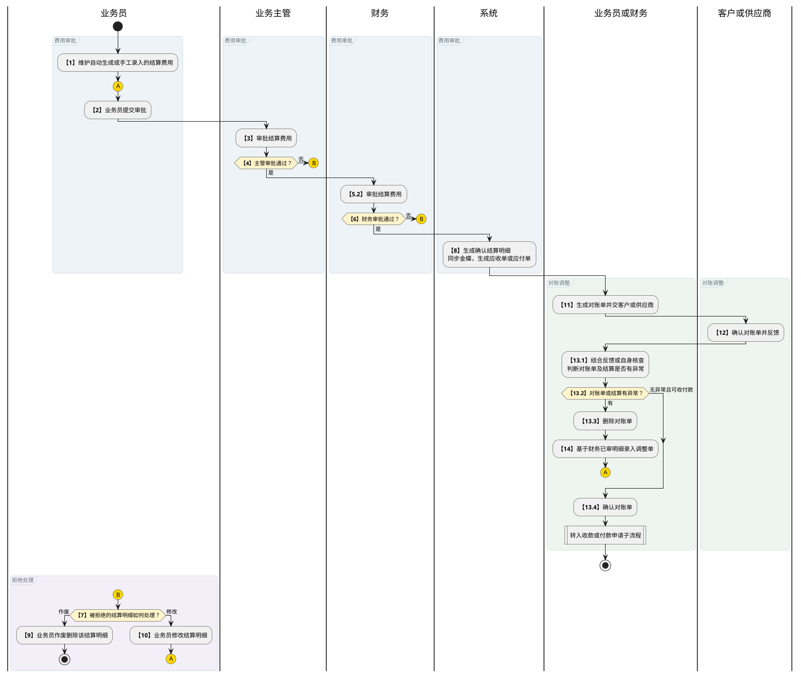
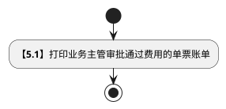
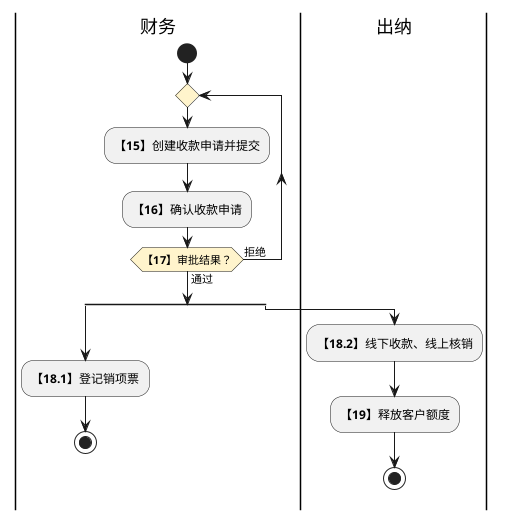
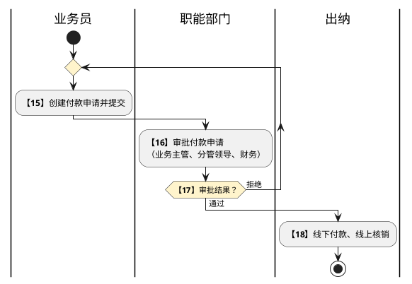

# 第030篇

> 本篇定位：财务基础与结算流程；主要内容：结算入口、职责与流程，以及汇率、成本项目、开票单位和账户；文档角色：模块档；文档ID：40E841D3A6

**关联业务主流程：** [税金管理与财务结算流程](../PRD.高捷物流系统.第1册.主流程/PRD.高捷物流系统.第009篇.税金管理与财务结算流程.077CC05853.md#doc-077CC05853-tax-settlement)。

## 1. 财务结算-基础信息管理

**业务入口：** 结算工作台和订单成本页面。

**概念模型：** [数据字典 · 基础主数据实体](../PRD.高捷物流系统.第6册.运营支撑/PRD.高捷物流系统.第039篇.数据字典.7A3D9E1F50.md#doc-7A3D9E1F50-domain-master-data)、[数据字典 · 财务结算实体](../PRD.高捷物流系统.第6册.运营支撑/PRD.高捷物流系统.第039篇.数据字典.7A3D9E1F50.md#doc-7A3D9E1F50-domain-finance)

### 1.1 结算业务范围、角色与流程

#### 1.1.1 业务目标与范围

基础信息管理为订单成本、对账、收付款申请、销项发票和收付款核销提供即期汇率、成本项目、部门成本项目、客户开票单位和银行账户。

#### 1.1.2 财务结算操作入口

以下菜单均属于财务结算。

| 一级菜单 | 二级菜单 | 功能范围 |
| --- | --- | --- |
| 基本信息管理 | 即期汇率维护 | 查看、查询和新增即期汇率；当月业务汇率统一从此处获取。 |
| 基本信息管理 | 成本项目维护 | 查看、查询和新增成本项目。 |
| 基本信息管理 | 开票单位维护 | 查看、查询、新增、调整、启用和停用客户开票信息。 |
| 基本信息管理 | 银行账号管理 | 查看、查询、新增、调整、启用和停用高捷银行账户。 |
| 基本信息管理 | 授信额度审批 | 审批提交的授信额度。 |
| 基本信息管理 | 合作方档案审批 | 审批新增的合作方档案。 |
| 结算成本管理 | 订单成本、调整单 | 见订单成本与调整单规则。 |
| 结算对账管理 | 应付对账单、应收对账单 | 见对账管理规则。 |
| 收付款申请管理 | 付款申请、付款发票补录、收款申请 | 见收付款申请管理规则。 |
| 销项发票管理 | 开票申请、手工发票补录、销项票 | 见销项发票管理规则。 |
| 实际收付款核销 | 付款核销、收款核销 | 见收付款核销规则。 |

#### 1.1.3 参与角色与职责

角色的操作授权见[财务结算操作权限](../PRD.高捷物流系统.第6册.运营支撑/PRD.高捷物流系统.第040篇.角色与访问权限.5E31456F30.md#doc-5E31456F30-finance-actions)。本篇保留结算流程中的场景分工：

| 用户角色 | 场景分工 |
| --- | --- |
| 客服 | 业务费用、对账与付款资料准备。 |
| 客服主管 | 业务侧结算审核。 |
| 财务会计 | 财务审核、收款申请和开票处理。 |
| 财务出纳 | 收付款执行与核销。 |
| 信息部 | 核销纠错支持。 |

#### 1.1.4 应收结算流程

**费用审批与对账回流**

应收、应付结算共用以下审批与对账路径；分别向客户、供应商确认对账单。图中回流按被拒绝或需调整的明细展开，整单与按行审批的范围见流程表。

- 连接符 A 表示返回步骤 2 提交审批；连接符 B 表示进入步骤 7 被拒绝结算明细的处理分支。
- “转入收款或付款申请子流程”：应收进入本节“收款申请确认与核销”图，应付进入[应付结算流程](#doc-40E841D3A6-section-0f97b5b6d534)中的“付款申请审批与核销”图，均从步骤 15 开始。

**单票账单打印**

步骤 4 通过后，业务员可执行步骤 5.1 打印单票账单。该操作单独展示，不作为步骤 5.2 财务审批的前置条件，也不约定两者并行执行。

| 步骤 | 步骤描述 | 角色 | 流程描述 | 下一步骤 | 关键控制点 |
| --- | --- | --- | --- | --- | --- |
| 1 | 录入结算费用 | 业务员 | 业务服务完成或异常结束后，系统自动生成或业务员手工录入对应订单的应收费用 | 2 | 是 |
| 2 | 提交审批 | 业务员 | 应收应付费用都维护完成后，提交业务主管审批 | 3 |  |
| 3 | 审核结算费用 | 业务主管 | 业务主管审批结算费用(可整单审批，也可按行审批)。 | 4 |  |
| 4 | 审核是否通过 | 业务主管 | 费用审批通过则进行步骤5操作；费用审批拒绝则进行步骤7操作 | 5/7 |  |
| 5.1 | 单票账单打印 | 业务员 | 业务主管审批通过的结算费用，可打印出单票账单 | - |  |
| 5.2 | 审核结算费用 | 财务 | 财务审批结算费用(可整单审批，也可按行审批) | 6 |  |
| 6 | 审核是否通过 | 财务 | 费用审批通过则进行步骤8操作；费用审批拒绝则进行步骤7操作 | 7/8 |  |
| 7 | 修改还是作废结算费用明细 | 业务员 | 业务员确认修改还是作废结算明细,作废则进行步骤9操作；修改则进行步骤10操作 | 9/10 |  |
| 8 | 自动生成结算明细 | 系统 | 财务对结算费用明细审批通过后，系统自动生成已最终确认的结算明细，并将结算明细同步金蝶系统，应收结算明细生成应收单 | 11 | 是 |
| 9 | 作废该结算明细 | 业务员 | 业务员对审批拒绝的结算明细进行作废删除 | - |  |
| 10 | 修改并重新提交结算明细 | 业务员 | 业务员修改结算明细并重新提交 | 2 |  |
| 11 | 生成对账单 | 业务员/财务 | 业务员或财务，按照订单号、客户、结算单位、毛件体、目的地、费用项目、订单创建人、订单创建日期、费用录入人、费用录入日期等条件，生成对账单（1个对账单中结算单位必须相同） | 12 | 是 |
| 12 | 客户确认对账单 | 业务员/财务 | 对账单给到客户确认 | 13 |  |
| 13 | 对账单/结算是否有误 | 业务员/财务 | 根据客户反馈情况或自身核查情况，确认对账单是否有异常，有异常则删除对账单，进行步骤14操作创建调整单进行调整；无异常可收款则确认对账单，并进行步骤15操作 | 14/15 |  |
| 14 | 录入调整单 | 业务员/财务 | 根据客户反馈情况或自身核查情况确认有误，基于财务审核通过的结算明细录入调整单，并提交审批。 | 2 | 是 |
| 15 | 收款申请创建 | 财务 | 财务基于对账完成后的结算明细且收款水单发起收款申请，并提交财务确认 | 16 | 是 |
| 16 | 收款申请确认 | 财务 | 财务对收款申请进行确认 | 17 |  |
| 17 | 收款申请审批是否通过 | 财务 | 审批通过，则进行步骤18操作；审批拒绝则返回步骤15 | 18 |  |
| 18.1 | 销项票登记 | 财务 | 进行销项票登记 | - | 是 |
| 18.2 | 出纳收款核销 | 财务 | 出纳线下收款，线上进行收款核销 | 19 | 是 |
| 19 | 释放客户额度 | 财务 | 出纳核销完收款后，释放客户的额度 |  |  |

**收款申请确认与核销**

对账完成后进入收款申请；申请被拒绝时返回创建环节，收款核销完成后释放客户额度。

- 步骤 15：收款申请基于已对账的结算明细与收款水单创建。
- 步骤 18.1、18.2：销项票登记单独列为审批通过后的处理，不作为核销的前置步骤；两者先后及同步关系待确认。

#### 1.1.5 应付结算流程

费用审批、拒绝明细处理、对账调整回流及单票账单打印共用[应收结算流程中的对应图](#doc-40E841D3A6-section-23c66131aa44)；付款申请的审批回流与核销图在本表之后。

| 步骤 | 步骤描述 | 角色 | 流程描述 | 下一步骤 | 关键控制点 |
| --- | --- | --- | --- | --- | --- |
| 1 | 录入结算费用 | 业务员 | 业务服务完成或异常结束后，系统自动生成或业务员手工录入对应订单的应付费用，内部单位的应付费用由应收方维护（应付方可查看) | 2 | 是 |
| 2 | 提交审批 | 业务员 | 应收应付费用都维护完成后，提交业务主管审批 | 3 |  |
| 3 | 审核结算费用 | 业务主管 | 业务主管审批结算费用(可整单审批，也可按行审批)。 | 4 |  |
| 4 | 审核是否通过 | 业务主管 | 费用审批通过则进行步骤5操作；费用审批拒绝则进行步骤7操作 | 5/7 |  |
| 5.1 | 单票账单打印 | 业务员 | 业务主管审批通过的结算费用，可打印出单票账单 | - |  |
| 5.2 | 审核结算费用 | 财务 | 财务审批结算费用(可整单审批，也可按行审批) | 6 |  |
| 6 | 审核是否通过 | 财务 | 费用审批通过则进行步骤8操作；费用审批拒绝则进行步骤7操作 | 7/8 |  |
| 7 | 修改还是作废结算费用明细 | 业务员 | 业务员确认修改还是作废结算明细,作废则进行步骤9操作；修改则进行步骤10操作 | 9/10 |  |
| 8 | 自动生成结算明细 | 系统 | 财务对结算费用明细审批通过后，系统自动生成已最终确认的结算明细，并将结算明细同步金蝶系统，应付结算明细生成应付单 | 11 | 是 |
| 9 | 作废该结算明细 | 业务员 | 业务员对审批拒绝的结算明细进行作废删除 | - |  |
| 10 | 修改并重新提交结算明细 | 业务员 | 业务员修改结算明细并重新提交 | 2 |  |
| 11 | 生成对账单 | 业务员/财务 | 业务员或财务，按照订单号、客户、结算单位、毛件体、目的地、费用项目、订单创建人、订单创建日期、费用录入人、费用录入日期等条件，生成对账单（1个对账单中结算单位必须相同） | 12 | 是 |
| 12 | 供应商确认对账单 | 业务员/财务 | 对账单给到供应商确认 | 13 |  |
| 13 | 对账单/结算是否有误 | 业务员/财务 | 根据供应商反馈情况或自身核查情况，确认对账单是否有异常，有异常则删除对账单，进行步骤14操作创建调整单进行调整；无异常可付款则确认对账单，并进行步骤15操作 | 14/15 |  |
| 14 | 录入调整单 | 业务员/财务 | 根据供应商反馈情况或自身核查情况确认有误，基于财务审核通过的结算明细录入调整单，并提交审批。 | 2 | 是 |
| 15 | 付款申请创建 | 业务员 | 业务员基于对账完成后的结算明细发起付款申请，并提交职能部门审批 | 16 | 是 |
| 16 | 付款申请审批 | 职能部门 | 职能部门（业务主管、分管领导、财务）对付款申请进行审批 | 17 |  |
| 17 | 付款申请审批是否通过 | 职能部门 | 审批通过，则进行步骤18操作；审批拒绝则返回步骤15 | 18 |  |
| 18 | 出纳付款核销 | 财务 | 出纳线下付款，线上进行付款核销 |  | 是 |

**付款申请审批与核销**

费用审批与对账回流沿用本篇应收结算流程中的共用图。对账完成后，付款申请由职能部门审批；被拒绝时返回创建环节，通过后交出纳付款并核销。

步骤 15：付款申请基于已对账的结算明细创建。

### 1.2 即期汇率维护

#### 1.2.1 即期汇率维护页面

即期汇率维护界面，可查看、创建、修改、删除所有的即期汇率。

#### 1.2.2 即期汇率列表页面

**操作与反馈**

- 查询：按填写的条件查询；未设置条件时查询全部记录。查询结果按照①“生效期间”倒序；②“目标币种代码”顺序排列；③“原币代码”顺序排列。

- 重置：重置查询条件。

- 新增：跳转至“即期汇率新增”界面。

- 编辑：弹出“即期汇率编辑”弹框。

- 删除：弹出“即期汇率删除确认”弹框。

**界面原型概述 · 即期汇率查询栏**

- **区域字段或业务元素**：原币代码、目标币种代码、生效期间。
- **区域级通用规则**：查询条件均选填、无预设值。

| 字段或控件特例 | 特例约束或业务结果 |
| --- | --- |
| 原币代码 | 选择原币代码，支持模糊查询。候选列表显示2列“币种代码”和“币种名称”。 |
| 目标币种代码 | 选择目标币种代码，支持模糊查询。候选列表显示2列“币种代码”和“币种名称”。 |
| 生效期间 | 手工录入（YYYY-MM）；填写期间。 |

**界面原型概述 · 即期汇率列表栏**

- **区域字段或业务元素**：原币代码、原币名称、目标币种代码、目标币种名称、直接汇率、说明、生效期间、更新人、更新时间。
- **区域级通用规则**：除所列特例外，字段均只读；按查询条件展示匹配记录；未设置查询条件时展示全部记录。

| 字段或控件特例 | 特例约束或业务结果 |
| --- | --- |
| 说明 | 根据原币名称、目标币种名称和直接汇率生成说明。格式：1{原币名称}={直接汇率}{目标币种名称}（例如：1美元=6.5人民币）。 |

#### 1.2.3 即期汇率新增页面

**操作与反馈**

- 新增：在最下方新增一行；

- 删除：删除该行数据;

- 返回：返回“即期汇率列表”界面，放弃本次新增；

- 保存：保存时需校验“原币代码”、“目标币种代码”和“生效期间”在表中是否存在相同的且状态为“已生效”的记录。若存在，则保存失败。若不存在，则保存成功，根据当前账户，自动添加出“更新人”和“更新日期”，“即期汇率列表”表中该保存成功的行数据状态为“已生效”。新增完成，自动返回“即期汇率列表”界面。

**界面原型概述 · 即期汇率新增**

- **区域字段或业务元素**：生效期间、原币代码、原币名称、目标币种代码、目标币种名称、直接汇率、说明、(货币兑换说明)。
- **区域级通用规则**：除所列特例外，字段均必填、无预设值且可编辑；名称和兑换说明由系统生成，只读展示。

| 字段或控件特例 | 特例约束或业务结果 |
| --- | --- |
| 生效期间 | 时间表选择，格式为 YYYY-MM；只能选择“历史期间”、“当前期间”和“当前期间+1”的期间；日期选择。 |
| 原币代码 | 选择币种代码，自动带出币种名称。 |
| 原币名称 | 根据原币代码自动带出原币名称；原币代码变化时，原币名称同步变化；只读。 |
| 目标币种代码 | 选择（CNY/HKD）；选择币种代码，自动带出币种名称。 |
| 目标币种名称 | 根据目标币种代码，自动带出目标币种名称；目标币种代码发生变动时，目标币种名称同步发生变动；只读。 |
| 直接汇率 | 最多保留4位小数。 |
| 说明、(货币兑换说明) | 根据原币名称、目标币种名称和直接汇率生成说明。格式：1{原币名称}={直接汇率}{目标币种名称}（例如：1美元=6.5人民币）；只读。 |

（4）数据词典说明

币种数据词典见 [数据字典 · 币种数据词典](../PRD.高捷物流系统.第6册.运营支撑/PRD.高捷物流系统.第039篇.数据字典.7A3D9E1F50.md#doc-7A3D9E1F50-values-enum-currency)。

#### 1.2.4 即期汇率编辑操作

在即期汇率列表页面点击“编辑”按钮，系统打开“即期汇率编辑”对话框。

**操作与反馈**

- 确认：完成编辑，返回“即期汇率列表”界面。同时根据该“确认”操作的用户，更新该记录的“更新人”、“更新时间”。

- 取消：取消编辑，返回“即期汇率列表”界面。

**界面原型概述 · 即期汇率编辑**

- **区域字段或业务元素**：原币代码、原币名称、目标币种代码、目标币种名称、直接汇率、(货币兑换说明)。
- **区域级通用规则**：除所列特例外，字段均只读。

| 字段或控件特例 | 特例约束或业务结果 |
| --- | --- |
| 原币代码、原币名称、目标币种代码、目标币种名称 | 根据调整行，自动带出，不允许修改。 |
| 直接汇率 | 根据调整行，自动带出；允许调整，最多保留4位小数；可编辑；必填；有默认值。 |
| (货币兑换说明) | 根据原币名称、目标币种名称和直接汇率生成说明。格式：1{原币名称}={直接汇率}{目标币种名称}（例如：1美元=6.5人民币）。 |

#### 1.2.5 即期汇率删除操作

在即期汇率列表页面点击“删除”按钮，系统打开“删除确认”对话框。

**操作与反馈**

- 确认：完成删除，返回“即期汇率列表”界面。根据操作用户更新该记录的“更新人”、“更新时间”，同时将该行数据状态变为“已删除”。

- 取消：取消删除，返回“即期汇率列表”界面。

#### 1.2.6 即期汇率新增

**业务范围**：输入生效期间，维护原币代码、目标币种代码、直接汇率，完成汇率新增。

**参与角色**：财务会计

**前置条件**

月底或月初，会计维护即期汇率

进入基本信息管理-> 即期汇率维护页面，点击“新增”按钮，进入此页面

**业务结果**：校验通过后新增即期汇率；业务录入费用或财务执行收付款核销时，系统按对应日期自动带出即期汇率。校验失败时不保存并提示原因。

**处理规则**

进入“即期汇率新增”页面，分别维护：原币代码、目标币种代码、直接汇率。

**生效期间**

- 可在年份表中选择对应的生效期间，格式为“YYYY-MM”。

- 未保存前，可重新修改期间。

- 只能选择到“历史期间”、“当前期间”和“当前期间+1”的期间。

**原币代码**

- 选择需要转为目标币种的原币代码，能够在候选项选择中选择币种代码，也可输入币种代码快速查询。

- 在未保存时，可重新修改原币代码。

**原币名称**

- 根据原币代码，自动带出。

- 原币代码变动时，原币名称同步变动。

**目标币种代码**

- 选择需要转换的目标币种代码，能够在候选项选择中选择币种代码，也可输入币种代码快速查询。

- 在未保存时，可重新修改目标币种代码。

**目标币种名称**

- 根据目标币种代码，自动带出。

- 目标币种代码变动时，目标名称同步变动。

**直接汇率**

- 手工录入直接汇率，最多保留4位小数。

- 在未保存时，可重新修改直接汇率。

点击“保存”进行提交保存。

- 提交成功：显示“保存成功”提示，跳转到“即期汇率列表”界面。

- 无法提交：若必填项未输入，格式不符合要求，或输入的“直接汇率”超过4位小数，则该输入项红色高亮提示，《保存》按钮置灰不可点击。若表中存在相同的“原币代码”、“目标币种代码”和“汇率期间”且行状态为“已生效”数据也无法保存。

**后续处理与分支**

空运与航晟业务部门结算成本录入、财务收付款核销

- 结算费用维护，根据输入日期，自动带出即期汇率；

- 收付款核销，根据实际的收付款日期，自动带出即期汇率。

**关联功能**

**结算费用维护**

**收付款核销**

### 1.3 成本项目维护

#### 1.3.1 成本项目维护界面

成本项目维护界面，可查看、创建、修改、启用和停用成本项目。

#### 1.3.2 成本项目列表页面

**操作与反馈**

- 查询：按填写的条件查询；未设置条件时查询全部记录。查询结果按照“成本代码”顺序排列。

- 重置：重置查询条件。

- 新增：弹出“成本项目新增”弹框。

- 编辑：弹出“成本项目编辑”弹框。

- 启用：弹出“启用确认”弹框。

- 停用：弹出“停用确认”弹框。

**界面原型概述 · 成本项目查询栏**

- **区域字段或业务元素**：成本项目、状态。
- **区域级通用规则**：查询条件均选填、无预设值。

| 字段或控件特例 | 特例约束或业务结果 |
| --- | --- |
| 成本项目 | 填写成本项目名称，支持模糊查询。 |
| 状态 | 不选择时默认所有状态；选择已生效/已停用状态，支持查询对应状态的数据。 |

**界面原型概述 · 成本项目列表栏**

- **区域字段或业务元素**：成本代码、成本项目、更新人、更新时间、状态。
- **区域级通用规则**：字段均只读；按查询条件展示匹配记录；未设置查询条件时展示全部记录。

#### 1.3.3 成本项目新增页面

**操作与反馈**

- 确认：保存时需校验“成本项目”在表中是否存在相同的记录（所有状态，已生效/已停用），若存在，则保存失败。若通过校验，则保存成功，自动生成成本代码，规则F+3位流水。根据该“确认”操作用户更新该记录的“更新人”、“更新时间”。新增完成，自动返回“成本项目列表”界面。

- 取消：取消新增，返回“成本项目列表”界面。

**界面原型概述 · 成本项目新增**

- **区域字段或业务元素**：成本代码、成本项目。

| 字段或控件特例 | 特例约束或业务结果 |
| --- | --- |
| 成本代码 | 保存成功后自动生成，规则“F+3位流水”；只读。 |
| 成本项目 | 手工录入成本项目；“确认”时，需校验该“成本项目”是否在表中存在；必填；无预设值；可编辑。 |

#### 1.3.4 成本项目编辑页面

在成本项目列表页面点击“编辑”按钮，系统打开“成本项目编辑”对话框。

**操作与反馈**

- 确认：保存时需校验“成本项目”在表中是否存在相同的记录，若存在，则保存失败。若通过校验，则保存成功，根据该“确认”操作的用户更新该记录的“更新人”、“更新时间”。新增完成，自动返回“成本项目列表”界面。

- 取消：取消调整，返回“成本项目列表”界面。

**界面原型概述 · 成本项目编辑**

- **区域字段或业务元素**：成本代码、成本项目。

| 字段或控件特例 | 特例约束或业务结果 |
| --- | --- |
| 成本代码 | 根据编辑行，自动带出，不允许修改；只读。 |
| 成本项目 | 根据编辑行，自动带出，允许修改；必填；有默认值；可编辑。 |

#### 1.3.5 成本项目启用操作

在成本项目列表页面点击“启用”按钮，系统打开“启用确认”对话框。

**操作与反馈**

- 确认：完成启用，返回“成本项目列表”界面。根据操作用户更新该记录的“更新人”、“更新时间”，同时将该行数据状态变为“已生效”。

- 取消：取消启用，返回“成本项目列表”界面。

#### 1.3.6 成本项目停用操作

在成本项目列表页面点击“停用”按钮，系统打开“停用确认”对话框。

**操作与反馈**

- 确认：完成停用，返回“成本项目列表”界面。根据操作用户更新该记录的“更新人”、“更新时间”，同时将该行数据状态变为“已停用”。停用成本项目时，需校验该成本项在“业务类型与成本项关系”中是否存在“已生效”的数据，有则无法停用成功。

- 取消：取消停用，返回“成本项目列表”界面。

#### 1.3.7 成本项目新增

**业务范围**：输入成本项目，完成成本项目新增

**参与角色**：管理员

**前置条件**：进入基本信息管理-> 成本项目维护页面，点击“新增”按钮，进入此页面

**业务结果**：校验通过后新增成本项目；新增项目可用于合作方报价和订单成本录入，标准服务完成时可据此生成对应成本项目。校验失败时不保存并提示原因。

**处理规则**

进入“成本项目新增”页面，录入成本明细。

**成本名称**

- 手工录入成本名称，需与金蝶系统中的成本名称保持一致；名称不一致可能导致业务录入关联错误的成本项目。

- 未保存前，可修改成本名称。

点击“确认”进行提交保存。

- 提交成功：显示“保存成功”提示，跳转到“成本项目列表”界面。

- 无法提交：若必填项未输入，则该输入项红色高亮提示，《确认》按钮置灰不可点击。若表中存在相同的“成本代码”或“成本名称”，无论其行状态为何，均无法保存。

**后续处理与分支**

空运与航晟业务部门能够正常使用成本项目

- 合作方报价维护，能够正常关联成本项目；

- 订单应收、应付，能够正常选到该成本项目，或能够正常生成该成本项目。

**关联功能**

- 合作方价格维护；

- 结算成本维护。

### 1.4 部门成本项目映射

#### 1.4.1 部门成本项目维护界面

部门成本项目维护界面，可查看、创建、删除分配给对应部门的成本项目。

#### 1.4.2 部门成本项目维护列表页面

**操作与反馈**

- 查询：按填写的条件查询；未设置条件时查询全部记录。查询结果按照“部门编码”顺序排列、“一级成本项目编码”顺序排列、“明细成本项目编码”顺序排列。

- 重置：重置查询条件。

- 新增：弹出“部门成本项目新增”弹框。

- 批量导入：弹出“批量新增模板”的打开界面。

- 部门成本项目新增模板下载：下载批量新增的excel表格。

- 删除：弹出“删除确认”弹框。

**界面原型概述 · 部门成本项目查询栏**

- **区域字段或业务元素**：部门名称、一级成本项目、二级成本项目、明细成本项目。
- **区域级通用规则**：查询条件均选填、无预设值。

| 字段或控件特例 | 特例约束或业务结果 |
| --- | --- |
| 部门名称 | 填写部门名称，支持模糊查询。 |
| 一级成本项目、二级成本项目 | 手工录入关键字，支持模糊匹配。 |
| 明细成本项目 | 填写明细成本项目名称，支持模糊查询。 |

**界面原型概述 · 部门成本项目关系栏**

- **区域字段或业务元素**：部门编码、部门名称、一级成本项目、二级成本项目、明细成本项目、创建人、创建日期。
- **区域级通用规则**：字段均只读；按查询条件展示匹配记录；未设置查询条件时展示全部记录。

#### 1.4.3 部门成本项目新增页面

在部门成本项目维护列表，点击“新增”，弹出该“部门成本项目新增”弹框。

**操作与反馈**

- 确认：校验必填字段是否填写，并校验“部门编码”“一级成本代码”“二级成本代码”“明细成本代码”的组合是否已存在。组合不存在时保存成功，记录创建人和创建时间，返回“部门成本项目维护”界面；该行状态变为“已生效”，且不在列表中显示。组合已存在时校验不通过，无法保存。

- 取消：取消新增部门成本项目维护，返回“部门成本项目维护列表”界面。

**界面原型概述 · 部门成本项目新增**

- **区域字段或业务元素**：部门编码、一级成本项目、二级成本项目、明细成本项目。
- **区域级通用规则**：字段均必填、无预设值、可编辑。

| 字段或控件特例 | 特例约束或业务结果 |
| --- | --- |
| 部门编码 | 候选列表展示2列（编码、名称）；候选范围见[财务数据访问范围](../PRD.高捷物流系统.第6册.运营支撑/PRD.高捷物流系统.第040篇.角色与访问权限.5E31456F30.md#doc-5E31456F30-finance-scope)。 |
| 一级成本项目 | 仅能够查询到成本项目维护界面“已生效”状态的一级成本项目。 |
| 二级成本项目 | 仅能够查询到成本项目维护界面“已生效”状态的二级成本项目。 |
| 明细成本项目 | 仅能够查询到成本项目维护界面“已生效”状态的明细成本项目。 |

#### 1.4.4 部门成本项目批量新增页面

在部门成本项目维护列表界面，点击“批量导入”，跳转桌面导入需要批量新增的文档

导入批量新增模板时，校验“部门编码”和“成本代码”的组合是否已存在；任一组合已存在时，整批导入失败且不保存任何记录。

（2）部门成本项目批量新增模板下载

下载导入的模板，填写部门编码和成本类型代码。

#### 1.4.5 部门成本项目删除操作

在部门成本项目列表页面点击“删除”按钮，系统打开“删除确认”对话框。

**操作与反馈**

- 确认：完成删除，返回“部门成本项目维护”界面，该数据状态变为“已删除”，且该行的“部门成本项目维护列表”记录不再继续显示。

- 取消：取消删除该关联关系，返回“部门成本项目维护”界面。

#### 1.4.6 部门成本项目新增

**业务范围**：选择部门编码、一级成本代码、二级成本代码、明细成本代码，完成部门成本项目新增

**参与角色**：财务会计/业务/信息部

**前置条件**：进入基本信息管理-> 部门成本项目维护页面，点击“新增”按钮，进入此页面

**业务结果**：校验通过后建立部门与成本项目的关系；业务录入成本时只能选择当前部门关联的成本代码。校验失败时不保存并提示原因。

**处理规则**

进入“部门成本项目维护”页面，分别选择：部门编码、成本代码。

**部门编码**

- 从候选项中选择部门编码，该部门编码在组织架构中；选择部门编码自动带出部门名称；

- 未保存前，可重新修改部门编码。

**（一级、二级、明细）成本代码**

- 从候选项中选择成本代码，成本代码取至“成本项目维护”表中的“已生效”状态的成本代码，“已停用”状态的成本代码无法被选取到。

- 未保存前，可修改成本代码。

点击“确认”进行提交保存。

- 提交成功：显示“保存成功”提示，跳转到“部门成本项目维护列表”界面。

- 无法提交：若必填项未输入，或成本代码已停用，则该输入项红色高亮提示，《确认》按钮置灰不可点击。若表中存在相同的“部门编码”和“成本代码”的关系，则也无法保存成功。

**后续处理与分支**：空运与航晟业务部门在对应的业务类型下，录入应收应付成本能够正常使用项对应的成本项目。

**关联功能**：1.结算成本维护

### 1.5 客户开票单位维护

#### 1.5.1 客户开票单位维护

客户开票单位维护界面，可查看、创建、编辑和删除客户开票单位。

#### 1.5.2 客户开票单位列表页面

**操作与反馈**

- 查询：按填写的条件查询；未设置条件时查询全部记录。查询结果按照“更新日期”倒序、“客户名称”顺序排列。

- 重置：重置查询条件。

- 新增：跳转至“客户开票信息新增”界面。

- 编辑：弹出“客户开票单位明细维护”界面。

- 删除：弹出“删除确认”弹框。

**界面原型概述 · 客户开票单位查询栏**

- **区域字段或业务元素**：客户名称、统一社会信用码。
- **区域级通用规则**：查询条件均选填、无预设值。

| 字段或控件特例 | 特例约束或业务结果 |
| --- | --- |
| 客户名称 | 填写客户名称，支持模糊查询。 |
| 统一社会信用码 | 填写统一社会信用码，支持模糊查询。 |

**界面原型概述 · 客户开票单位列表栏**

- **区域字段或业务元素**：客户名称、统一社会信用码、更新人、更新时间、状态。
- **区域级通用规则**：字段均只读；按查询条件展示匹配记录；未设置查询条件时展示全部记录。

| 字段或控件特例 | 特例约束或业务结果 |
| --- | --- |
| 更新时间 | 日期选择。 |

#### 1.5.3 客户开票单位新增页面

**操作与反馈**

- 新增：弹出“客户开票信息新增”弹窗；

- 取消：取消新增客户开票信息，返回“客户开票单位列表栏”;

- 保存：保存时需校验“客户名称”、“统一社会信用码”、“开户行”、“银行账号”、“地址”、“电话”必填字段是否已输入，且该客户下是否存在相同的开票单位名称。若必填字段未输入，则保存失败。若同个客户已存在相同的开票单位，则保存失败。若不存在相同的开票单位，则保存成功，根据当前账户，自动添加出“更新人”和“更新日期”。新增完成，自动返回“客户开票信息新增”界面。

**界面原型概述 · 客户开票单位新增**

- **区域字段或业务元素**：客户名称、统一社会信用码、开票单位名称、是否默认、开户行、银行账号、地址、电话。
- **区域级通用规则**：字段均无预设值、可编辑。

| 字段或控件特例 | 特例约束或业务结果 |
| --- | --- |
| 客户名称 | 支持模糊查询，匹配伙伴表中的对应的客户名称；必填。 |
| 统一社会信用码 | 若所选的客户，在客户表中存在统一社会信用码，则自动带出，不允许修改；若所选的客户，在客户表中不存在统一社会信用码，则手工填写；必填。 |
| 开票单位名称 | 需校验该录入信息在对应客户下是否存在相同的开票单位；必填。 |
| 统一社会信用码 | 必填。 |
| 是否默认 | 选择(是/否)；一个客户下，最多只有一个“默认”的开票单位信息；本次新增的开票信息需校验“是否默认”选型；必填。 |
| 开户行、地址、电话 | 选填。 |
| 银行账号 | 纯数字；选填。 |

#### 1.5.4 客户开票单位删除操作

在客户开票单位列表页面点击“删除”按钮，系统打开“删除确认”对话框。

**操作与反馈**

- 确认：完成删除，返回“客户开票单位列表”界面。

- 取消：取消删除，返回“客户开票单位列表”界面。

#### 1.5.5 客户开票单位明细维护列表

在客户开票单位列表页面点击“编辑”按钮，系统进入“客户开票单位明细维护”页面。

**操作与反馈**

- 新增：在客户开票单位明细最下方，新增一行记录。

- 返回：返回客户开票单位列表界面。

- 调整：跳转至“客户开票信息新增”界面。

- 删除：弹出“删除确认”弹框。

**界面原型概述 · 客户开票单位明细维护**

- **区域字段或业务元素**：客户名称、统一社会信用码、状态、开票单位名称、是否默认、纳税人识别号、开户行、银行账号、地址、电话、更新人、更新时间。
- **区域级通用规则**：除所列特例外，字段均只读。

| 字段或控件特例 | 特例约束或业务结果 |
| --- | --- |
| 客户名称 | 客户开票单位列表中的客户名称。 |
| 统一社会信用码 | 客户开票单位列表中的统一社会信用码。 |
| 状态 | 客户开票单位列表中的状态。 |
| 开票单位名称 | 取客户开票单位新增页面或明细维护页面录入的开票单位名称；可编辑；必填；无预设值。 |
| 是否默认 | 取客户开票单位新增页面或明细维护页面选择的“是否默认”；可编辑；必填；无预设值。 |
| 纳税人识别号 | 取客户开票单位新增页面或明细维护页面录入的纳税人识别号。 |
| 开户行 | 取客户开票单位新增页面或明细维护页面录入的开户行。 |
| 银行账号 | 取客户开票单位新增页面或明细维护页面录入的银行账号。 |
| 地址 | 取客户开票单位新增页面或明细维护页面录入的地址。 |
| 电话 | 取客户开票单位新增页面或明细维护页面录入的电话。 |
| 更新人 | 取客户开票单位新增或明细维护记录的操作人。 |
| 更新时间 | 取客户开票单位新增或明细维护记录保存时的系统时间。 |

#### 1.5.6 客户开票单位明细新增页面

在客户开票单位明细维护界面，点击“新增”按钮。

**操作与反馈**

- 保存：该开票单位明细维护信息新增完成。

- 删除：删除该行数据。

**界面原型概述 · 客户开票单位明细新增**

- **区域字段或业务元素**：开票单位名称、是否默认、纳税人识别号、开户行、银行账号、地址、电话。
- **区域级通用规则**：字段均无预设值、可编辑。

| 字段或控件特例 | 特例约束或业务结果 |
| --- | --- |
| 开票单位名称 | 需校验该开票单位下是否存在相同的开票单位，存在相同开票单位无法保存；必填。 |
| 是否默认 | 选择（是/否）；一个客户下，最多只有1条默认的开票单位；必填。 |
| 纳税人识别号 | 必填。 |
| 开户行、银行账号、地址、电话 | 手工录入；选填。 |

#### 1.5.7 客户开票单位明细调整操作

在客户开票单位明细维护页面点击“调整”按钮，当前行进入可编辑状态。

**操作与反馈**

- 保存：该开票单位明细维护信息调整完成。

- 删除：删除该行数据。

**界面原型概述 · 客户开票单位明细调整**

- **区域字段或业务元素**：开票单位名称、是否默认、纳税人识别号、开户行、银行账号、地址、电话。
- **区域级通用规则**：字段均有默认值、可编辑。

| 字段或控件特例 | 特例约束或业务结果 |
| --- | --- |
| 开票单位名称 | 默认该行初始数据；调整时手工录入；需校验该开票单位下是否存在相同的开票单位，存在相同开票单位无法保存；必填。 |
| 是否默认 | 默认该行初始数据；选择（是/否）；一个客户下，最多只有1条默认的开票单位，保存时需校验；必填。 |
| 纳税人识别号 | 默认该行初始数据；必填。 |
| 开户行、银行账号、地址、电话 | 默认带出该行原值，允许修改；选填。 |

#### 1.5.8 客户开票单位明细删除操作

在客户开票单位明细维护页面点击“删除”按钮，系统打开“删除确认”对话框。

**操作与反馈**

- 确认：该开票单位明细维护信息确认删除。

- 取消：取消删除该行数据的操作。

#### 1.5.9 客户开票单位新增

**业务范围**：选择客户名称、统一社会信用码，维护开票单位名称、统一社会信用码、是否默认、开户行、银行账户、地址、电话，完成客户开票信息新增。

**参与角色**：财务/业务

**前置条件**

客户基本信息新增时，根据基本信息自动生成；或基本信息不足时，手工新增

进入基本信息管理-> 客户开票单位维护，点击“新增”按钮，进入此页面

**业务结果**：校验通过后新增客户开票单位；财务创建开票申请时可选择并自动带出该客户的开票信息。校验失败时不保存并提示原因。

**处理规则**

进入“客户开票单位新增”页面，分别选择：客户名称、统一社会信用码，输入：开票单位名称、统一社会信用码、是否默认、开户行、银行账号、地址、电话。

**客户名称**

- 可在客户表中选择对应的客户，从候选项中选择，支持输入模糊匹配。

- 客户表中有对应的统一社会信用码，则根据选择的客户自动带出。

**统一社会信用码**

- 可在客户表中选择对应的客户后，若对应客户存在统一社会信用码，自动带出。若对应客户没有维护统一社会信用码，则为空。

**开票单位名称**

- 手工录入客户的开票单位名称。

- 在未保存时，可重新修改。

- 保存时校验本次新增的开票单位在该客户下是否已经存在，若存在，保存失败。

**统一社会信用码**

- 手工录入开票公司的统一社会信用码。

- 在未保存时，可重新修改统一社会码。

**是否默认**

- 从候选项中选择，是/否。

- 在未保存时，可重新修改。

- 保存时，若该“是否默认”为“是”，需校验该客户下是否已存在其他的默认开票单位，若存在，保存失败。若不存在，可保存成功。

**开户行**

- 手工录入开票公司的开户行。

- 在未保存时，可重新修改开票行。

**银行账户**

- 手工录入开票公司的银行账户。

- 在未保存时，可重新修改银行账户。

**地址**

- 手工录入开票公司的地址。

- 在未保存时，可重新修改地址。

**电话**

- 手工录入开票公司的电话。

- 在未保存时，可重新修改电话。

点击“保存”进行提交保存。

- 提交成功：显示“保存成功”提示，跳转到“客户开票单位维护列表”界面。

- 无法提交：若必填项未输入，则该输入项红色高亮提示，《保存》按钮置灰不可点击。若客户开票信息表中存在相同的“开票单位名称”无法保存，若该新增数据为默认的开票信息，且客户开票信息表中已存在“默认”开票信息，则无法保存。

**后续处理与分支**

财务应收开票流程

**财务应收开票申请，默认带出客户开票单位**

**补充约束**：在百望系统，变更了开票信息后，需要给财务发送对应的消息提醒通知。

**关联功能**：1. 财务应收开票申请

### 1.6 银行账户管理

#### 1.6.1 银行账户管理页面

高捷收付款银行账户的维护界面，可查看、创建、修改、启用和停用高捷内部的银行账户。

#### 1.6.2 银行账户列表页面

**操作与反馈**

- 查询：按填写的条件查询；未设置条件时查询全部记录。查询结果按照“银行账号”顺序排列。

- 重置：重置查询条件。

- 新增：弹出“银行账号新增”弹框。

- 编辑：弹出“银行账号编辑”弹框。

- 启用：弹出“启用确认”弹框。

- 停用：弹出“停用确认”弹框。

**界面原型概述 · 银行账户查询栏**

- **区域字段或业务元素**：开户行名称、账户名称、银行账号、币种代码、更新人、状态。
- **区域级通用规则**：查询条件均选填、无预设值。

| 字段或控件特例 | 特例约束或业务结果 |
| --- | --- |
| 开户行名称 | 填写开户行名称，支持模糊查询。 |
| 账户名称 | 填写账户名称，支持模糊查询。 |
| 银行账号 | 填写银行账户，支持模糊查询。 |
| 币种代码 | 选择币种，进行精确查询。 |
| 更新人 | 填写更新人，支持模糊查询。 |
| 状态 | 选择(已生效/已停用)；选择对应状态，进行精确查询。 |

**界面原型概述 · 银行账户列表栏**

- **区域字段或业务元素**：开户行名称、账户名称、银行账号、是否基本户、币种代码、更新人、更新时间、状态。
- **区域级通用规则**：字段均只读；在[财务数据访问范围](../PRD.高捷物流系统.第6册.运营支撑/PRD.高捷物流系统.第040篇.角色与访问权限.5E31456F30.md#doc-5E31456F30-finance-scope)内按查询条件筛选，未设置查询条件时展示范围内全部记录。

| 字段或控件特例 | 特例约束或业务结果 |
| --- | --- |
| 银行账号 | 仅包含数字。 |
| 是否基本户 | 展示 Y/N。 |
| 更新时间 | 日期选择。 |

#### 1.6.3 银行账户新增页面

在“银行账户列表”页面点击“新增”，系统打开“银行账户新增”对话框。

**操作与反馈**

- 保存：保存时需校验必输字段是否填写，若有未填写的必输字段，无法保存成功。保存成功后，若新增记录基本户标识为“Y”，则需要同步更新银行表中历史记录的基本户标识为“N”，即一个组织仅一个基本户，基本户变更后实时对历史基本户标识进行变更。保存时，校验该组织下是否有标识为“Y”的银行账户，若无，则无法保存成功。根据当前账户，自动添加出“所属的公司/部门”、“更新人”和“更新日期”，“银行账户”表中该保存成功的行数据状态为“已生效”。新增完成，自动返回“银行账户列表”界面。

- 返回：返回“银行账户列表”界面，放弃本次新增。

**界面原型概述 · 银行账户新增**

- **区域字段或业务元素**：开户行名称、账户名称、银行账号、币种代码、是否基本户。
- **区域级通用规则**：字段均必填、无预设值、可编辑。

| 字段或控件特例 | 特例约束或业务结果 |
| --- | --- |
| 开户行名称 | 手工录入开户行名称。 |
| 账户名称 | 手工录入银行的账户名称。 |
| 银行账号 | 手工录入银行账号；纯数字，保存时校验。 |
| 币种代码 | 根据币种词典，选择对应币种。 |
| 是否基本户 | 选择（Y/N）；若该字段为“Y”，则保存时，自动变更历史记录标识为“Y”的银行账户为“N”。 |

#### 1.6.4 银行账号编辑操作

在银行账户列表页面点击“编辑”按钮，系统打开“银行账号编辑”对话框。

**操作与反馈**

- 确认：完成调整，返回“银行账户列表”界面。同时根据该“确认”操作的用户，更新该记录的“更新人”、“更新时间”。保存成功后，若新增记录基本户标识为“Y”，则需要同步更新银行表中历史记录的基本户标识为“N”，即一个组织仅一个基本户，基本户变更后实时对历史基本户标识进行变更。保存时，校验该组织下是否有标识为“Y”的银行账户，若无，则无法保存成功。

- 取消：取消调整，返回“银行账户列表”界面。

**界面原型概述 · 银行账号编辑**

- **区域字段或业务元素**：开户行名称、账户名称、银行账号、币种代码、是否基本户。
- **区域级通用规则**：字段均必填、有默认值、可编辑。

| 字段或控件特例 | 特例约束或业务结果 |
| --- | --- |
| 开户行名称 | 默认编辑行的开户行名称；手工录入修改开户行名称。 |
| 账户名称 | 默认编辑行的账户名称；手工录入修改账户名称。 |
| 银行账号 | 默认编辑行的银行账号；手工录入银行账号；纯数字，保存时校验。 |
| 币种代码 | 默认编辑行的币种；根据币种词典，选择对应币种。 |
| 是否基本户 | 默认编辑行的是否基本户；选择（Y/N）。 |

#### 1.6.5 银行账户启用操作

在银行账户列表页面点击“启用”按钮，系统打开“启用确认”对话框。

**操作与反馈**

- 确认：完成启用，返回“银行账户列表”界面。根据操作用户更新该记录的“更新人”、“更新时间”，同时将该行数据状态变为“已生效”。

- 取消：取消启用，返回“银行账户列表”界面。

#### 1.6.6 银行账户停用操作

在银行账户列表页面点击“停用”按钮，系统打开“停用确认”对话框。

**操作与反馈**

- 确认：完成停用，返回“银行账户列表”界面。根据操作用户更新该记录的“更新人”、“更新时间”，同时将该行数据状态变为“已停用”。无法停用标识为“是否基本户”为“是”的账户（只能先将基本户标识进行调整后，停用非标准户标识的银行账户。）

- 取消：取消停用，返回“银行账户列表”界面。

#### 1.6.7 银行账户新增

**业务范围**：输入银行名称、账户名称、银行账号、币种代码，完成银行账户新增

**参与角色**：财务会计

**前置条件**：进入基本信息管理-> 银行账号管理页面，点击“新增”按钮，进入此页面

**业务结果**：保存后新增银行账户；执行收付款核销时可选择该账户，基本户按规则自动带出。校验失败时不保存并提示原因。

**处理规则**

进入“银行账户新增”页面，分别输入：银行名称、账户名称、银行账号、币种。

**银行名称**

- 手工录入银行名称（需保持和税务开票系统保持一致）。

- 未保存前，可重新修改银行名称。

**账户名称**

- 手工录入账户名称（需保持和税务开票系统保持一致）。

- 未保存前，可重新修改账户名称。

**银行账号**

- 手工录入银行账号（需保持和税务开票系统保持一致）。

- 未保存前，可重新修改银行账号。

**币种代码**

- 从候选项中选择，能够正常选择银行对应的币种。

- 未保存前，可修改币种代码。

点击“保存”进行提交保存。

- 提交成功：显示“保存成功”提示，跳转到“银行账户列表”界面。

- 无法提交：若必填项未输入，格式不符合要求，则该输入项红色高亮提示，《保存》按钮置灰不可点击。

**后续处理与分支**

财务出纳进行收付款核销时能够正常使用

- 收付款核销，能够正常使用银行账户。

**关联功能**

- 收付款核销，基本户默认带出。

- 销项开票申请，基本户默认带出。

- 内部结算，根据应收自动生成应付，使用基本户。
