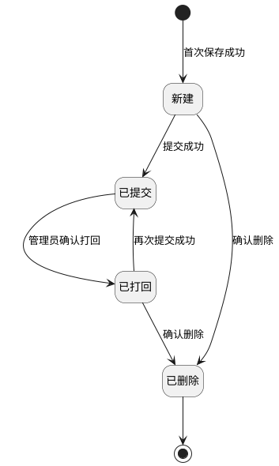

# 第034篇

> 本篇定位：财务结算-收付款核销；主要内容：待核销来源、核销生命周期、长短款与打回；文档角色：模块档；文档ID：45DB5A5118

**关联业务主流程：** [税金管理与财务结算流程](../PRD.高捷物流系统.第1册.主流程/PRD.高捷物流系统.第009篇.税金管理与财务结算流程.077CC05853.md#doc-077CC05853-tax-settlement)。
**关联模块流程：** [结算管理流程](../PRD.高捷物流系统.第1册.主流程/PRD.高捷物流系统.第011篇.DDP跨模块作业与结算流程.7579B595B8.md#doc-7579B595B8-section-a5b92ee23329)。

## 1. 财务结算-收付款核销

**业务入口：** 收付款核销页面。

**概念模型：** [数据字典 · 财务结算实体](../PRD.高捷物流系统.第6册.运营支撑/PRD.高捷物流系统.第039篇.数据字典.7A3D9E1F50.md#doc-7A3D9E1F50-domain-finance)

### 1.1 结算业务范围、角色与流程

#### 1.1.1 业务目标与范围

收付款核销覆盖付款核销和收款核销的创建、查看、编辑、提交、打回、删除和查询。

#### 1.1.2 财务结算共用入口与流程

财务结算的跨模块导航与流程见[财务结算操作入口](PRD.高捷物流系统.第030篇.财务基础与结算流程.40E841D3A6.md#doc-40E841D3A6-section-3561f6529077)、[财务结算操作权限](../PRD.高捷物流系统.第6册.运营支撑/PRD.高捷物流系统.第040篇.角色与访问权限.5E31456F30.md#doc-5E31456F30-finance-actions)、[应收结算流程](PRD.高捷物流系统.第030篇.财务基础与结算流程.40E841D3A6.md#doc-40E841D3A6-section-23c66131aa44)、[应付结算流程](PRD.高捷物流系统.第030篇.财务基础与结算流程.40E841D3A6.md#doc-40E841D3A6-section-0f97b5b6d534)。

#### 1.1.3 核销金额与代收付规则

本规则适用于付款核销和收款核销的新增与编辑；执行“保存”或“保存并提交”时，系统按当前字段值更新计算结果：

- 即期汇率按付款或收款币种及付款或收款日期从汇率表取得。
- 付款金额（本位币）＝实际付款金额×即期汇率；收款金额（本位币）＝实际收款金额×即期汇率。
- 每行本次核销金额（本位币）＝该行本次核销金额（原币）×业务汇率。
- 付款长短款＝付款金额（本位币）－应付合计金额（本位币）；收款长短款＝收款金额（本位币）－应收合计金额（本位币）。
- 付款币种与核销币种不同时生成付款购汇明细，购汇金额＝实际付款金额×即期汇率；收款币种与原币币种不同时生成收款购汇明细，购汇金额＝实际收款金额×即期汇率。购汇币种为人民币。
- “是否代付”和“是否代收”新增时默认不勾选，编辑时带出原值。勾选后，对应的付款单位或收款单位为必填，可从组织架构的公司中选择；取消勾选后，系统清空并禁用单位控件，保存时将该单所属组织写入单位字段。

### 1.2 付款核销

#### 1.2.1 付款核销列表页面

付款核销列表，可查看、删除、提交、打回付款核销申请。

**操作与反馈**

- 查询：按填写的条件查询；未设置条件时查询全部记录。查询结果按照“付款核销号”倒序排列。

- 重置：重置查询条件。

- 查看：跳转至“付款核销单明细”界面，财务人员都能看到该按钮。

- 编辑：跳转至“付款核销单编辑”界面，财务人员都能看到当前按钮。

- 删除：弹出“删除确认”弹框，财务人员都能看到当前按钮。

- 提交：弹出“提交确认”弹框，财务人员都能看到当前按钮。

- 打回：弹出“打回确认”弹框，只有管理员能看到当前按钮。

**界面原型概述 · 付款核销查询栏**

- **区域字段或业务元素**：付款核销号、状态、结算单位、付款币种、付款银行账号、付款日期、原币币种、核销人、核销日期。
- **区域级通用规则**：查询条件均选填、无预设值。

| 字段或控件特例 | 特例约束或业务结果 |
| --- | --- |
| 付款核销号 | 填写付款核销号，支持模糊查询。 |
| 状态 | 候选列表包括：新建、已打回、已提交；支持按状态精确查询，不选择默认全部状态；“新建”状态支持删除、提交操作；“已打回”状态支持删除、提交操作；“已提交”状态支持查看、打回操作；所有状态均可以查询操作。 |
| 结算单位 | 选择结算单位，支持模糊查询。 |
| 付款币种、原币币种 | 显示2列，币种编码和币种名称；支持按币种精确查询，不选择默认全部币种。 |
| 付款银行账号 | 填写银行账号，支持模糊查询。 |
| 付款日期、核销日期 | 按日期范围选择；支持在日期范围内的精确查询。 |
| 核销人 | 填写创建人，支持模糊查询。 |

**界面原型概述 · 付款核销申请列表栏**

- **区域字段或业务元素**：付款核销号、状态、结算单位、核销金额(原币)、原币币种、核销金额(本位币)、长短款、付款日期、付款银行、付款账户名称、付款银行账号、付款币种、核销人、核销日期、同步金蝶状态、金蝶返回消息。
- **区域级通用规则**：字段均只读；按查询条件展示匹配记录；未设置查询条件时展示全部记录。

#### 1.2.2 付款核销列表明细查看界面

在付款核销列表页面点击操作栏的“查看”，系统进入付款核销明细页面。所有状态的付款核销均显示“查看”按钮。

**操作与反馈**

- 返回：返回付款核销列表页面。

1. 字段说明

**界面原型概述 · 付款核销基本信息（查看）**

- **区域字段或业务元素**：付款核销批次号、结算单位、核销人、核销日期、状态、长短款、是否代付、付款单位。
- **区域级通用规则**：字段均只读；回显所选记录。

**界面原型概述 · 付款核销付款信息（查看）**

- **区域字段或业务元素**：付款银行、账户名称、付款账号、付款日期、付款币种、实际付款金额、即期汇率、付款金额（本位币）。
- **区域级通用规则**：字段均只读；回显所选记录。

**界面原型概述 · 付款核销明细（查看）**

- **区域字段或业务元素**：付款申请批次号、订单号、业务日期、申请金额(原币)、可核销金额(原币)、原币币种、业务汇率、本次核销金额(原币)、本次核销金额(本位币)。
- **区域级通用规则**：字段均只读；回显所选记录。

**界面原型概述 · 付款核销购汇明细（查看）**

- **区域字段或业务元素**：购汇银行、购汇银行账户、购汇银行账号、购汇金额、购汇币种。
- **区域级通用规则**：字段均只读；回显所选记录。

#### 1.2.3 付款核销列表明细编辑界面

在付款核销列表页面点击操作栏的“编辑”，系统进入付款核销编辑页面。只有状态为“新建”或“已打回”的付款核销显示“编辑”按钮。

**操作与反馈**

- 保存：保存该付款核销申请，弹出“保存确认”弹框。

保存校验：

校验必填字段是否填写，若未填写，点击保存时无法保存；

- 保存并提交：保存并提交该付款核销申请，弹出“提交确认”弹框。

保存并提交校验：需要进行保存校验。

- 返回：取消该付款核销编辑，返回“付款核销列表”界面。

（3）字段说明

**界面原型概述 · 付款核销基本信息（编辑）**

- **区域字段或业务元素**：付款核销批次号、结算单位、核销人、核销日期、状态、长短款、是否代付、付款单位。
- **区域级通用规则**：回显当前编辑记录。

| 字段或控件特例 | 特例约束或业务结果 |
| --- | --- |
| 付款核销批次号、结算单位、核销人、核销日期、状态 | 只读。 |
| 长短款 | 计算规则见[核销金额与代收付规则](#doc-45DB5A5118-section-a8f2c4d6901e)；只读。 |
| 是否代付 | 选填；有默认值；可编辑。 |
| 付款单位 | 条件必填与禁用规则见[核销金额与代收付规则](#doc-45DB5A5118-section-a8f2c4d6901e)；选填；有默认值；可编辑。 |

**界面原型概述 · 付款核销付款信息（编辑）**

- **区域字段或业务元素**：银行账号、付款银行、账户名称、付款日期、付款币种、实际付款金额、即期汇率、付款金额(本位币)。
- **区域级通用规则**：回显当前编辑记录。

| 字段或控件特例 | 特例约束或业务结果 |
| --- | --- |
| 银行账号 | 选择付款银行账户；选填；有默认值；可编辑。 |
| 付款银行、账户名称、付款币种 | 根据银行账号自动带出；只读。 |
| 付款日期、实际付款金额 | 选填；有默认值；可编辑。 |
| 即期汇率 | 取值规则见[核销金额与代收付规则](#doc-45DB5A5118-section-a8f2c4d6901e)；只读。 |
| 付款金额(本位币) | 计算规则见[核销金额与代收付规则](#doc-45DB5A5118-section-a8f2c4d6901e)；只读。 |

**界面原型概述 · 付款核销明细（编辑）**

- **区域字段或业务元素**：付款申请批次号、订单号、业务日期、申请金额(原币)、可核销金额(原币)、原币币种、业务汇率、本次核销金额(原币)、本次核销金额(本位币)。
- **区域级通用规则**：除所列特例外，字段均只读；回显当前编辑记录。

| 字段或控件特例 | 特例约束或业务结果 |
| --- | --- |
| 本次核销金额(原币) | 手工录入修改；可编辑；必填；有默认值。 |
| 本次核销金额(本位币) | 计算规则见[核销金额与代收付规则](#doc-45DB5A5118-section-a8f2c4d6901e)。 |

**界面原型概述 · 付款核销购汇明细（编辑）**

- **区域字段或业务元素**：购汇银行、购汇银行账户、购汇银行账号、购汇金额、购汇币种。
- **区域级通用规则**：除所列特例外，字段均只读；回显当前编辑记录；保存后自动更新。

| 字段或控件特例 | 特例约束或业务结果 |
| --- | --- |
| 购汇金额 | 生成与计算规则见[核销金额与代收付规则](#doc-45DB5A5118-section-a8f2c4d6901e)。 |

#### 1.2.4 付款核销明细保存操作

付款核销明细编辑页面：

在付款核销申请编辑界面，点击“保存”按钮，弹出“保存确认”弹框。

**操作与反馈**

- 确认：按[核销金额与代收付规则](#doc-45DB5A5118-section-a8f2c4d6901e)更新计算字段并完成保存，返回“付款核销列表”界面。不改变该付款核销申请的状态。

- 取消：取消保存，返回“付款核销列表明细编辑”界面。

#### 1.2.5 付款核销明细提交操作

在付款申请核销新增界面，点击“保存并提交”按钮，弹出“提交确认”弹框。

**操作与反馈**

- 确认：按[核销金额与代收付规则](#doc-45DB5A5118-section-a8f2c4d6901e)更新计算字段，完成保存并提交，返回“付款核销列表”界面；该付款核销申请的状态变为“已提交”。

- 取消：取消保存并提交，返回“付款核销列表”界面。

#### 1.2.6 付款核销删除操作

在付款核销列表页面点击“删除”按钮，系统打开“删除确认”对话框。只有状态为“新建”或“已打回”的付款核销显示“删除”按钮。

**操作与反馈**

- 确认：完成删除，返回“付款核销列表”界面。该付款核销状态变为“已删除”，不在“付款核销列表”界面展示。

- 取消：取消删除，返回“付款核销列表”界面。

#### 1.2.7 付款核销提交操作

在付款核销列表页面点击“提交”按钮，系统打开“提交确认”对话框。只有状态为“新建”或“已打回”的付款核销显示“提交”按钮。

**操作与反馈**

- 确认：完成提交，返回“付款核销列表”界面。该付款核销号的状态变为“已提交”。

- 取消：取消提交，返回“付款核销列表”界面。

#### 1.2.8 付款核销打回操作

管理员按[财务结算操作权限](../PRD.高捷物流系统.第6册.运营支撑/PRD.高捷物流系统.第040篇.角色与访问权限.5E31456F30.md#doc-5E31456F30-finance-actions)在付款核销列表页面点击“打回”按钮时，系统打开“打回确认”对话框。只有状态为“已提交”的付款核销显示“打回”按钮。

**操作与反馈**

- 确认：完成打回，返回“付款核销列表”界面，该付款核销单的状态变为“已打回”。

付款核销打回的通知规则见[付款核销打回通知规则](../PRD.高捷物流系统.第6册.运营支撑/PRD.高捷物流系统.第042篇.消息推送.5F950AB3B1.md#doc-5F950AB3B1-section-732bf646708d)。

- 取消：取消提交，返回“付款核销列表”界面。

**收付款核销单共用状态图**

本图适用于单张付款核销单或收款核销单，从首次保存后的“新建”状态展开；新建时也可直接保存并提交，见[付款核销提交](#doc-45DB5A5118-section-653e5543b706)和[收款核销提交](#doc-45DB5A5118-section-ee0d3241a522)。

- “已提交”仍可由管理员打回，不是不可逆终态。收款核销完成后的客户额度释放见[应收结算流程](PRD.高捷物流系统.第030篇.财务基础与结算流程.40E841D3A6.md#doc-40E841D3A6-section-23c66131aa44)；打回时的额度扣减见[收款核销打回](#doc-45DB5A5118-section-fb0ff2d54db5)，该额度变化不套用于付款核销。
- 编辑后仅保存不改变状态；收款核销的提交、删除和打回规则见[收款核销](#doc-45DB5A5118-receipt-writeoff)。金蝶同步结果与核销单状态分开表达，不在本图新增同步状态。

#### 1.2.9 待付款核销列表页面

待付款核销列表界面，可导出审批通过的明细费用，可创建付款核销。

**操作与反馈**

- 查询：在不选择任何查询字段下，点击“查询”按钮，未设置条件时查询全部记录。选择对应的查询条件，则显示符合结果的数据。查询的数据为“财务审批通过”的付款申请明细数据，按照“申请日期”顺序排列、按“订单号”顺序排列。

- 重置：重置查询条件。

- 按勾选核销：跳转至“付款核销新增”界面。“付款核销”操作只能够创建相同“结算单位”、相同“币种”的付款申请数据。

- 按查询条件核销：根据查询结果批量创建付款核销记录，并跳转至“付款核销新增”界面。

- 导出：勾选的批量数据导出。

**界面原型概述 · 待付款核销查询栏**

- **区域字段或业务元素**：付款申请批次号、订单号、提单号、结算单位、申请币种、可核销金额从、可核销金额至、申请人、业务日期、申请日期。

| 字段或控件特例 | 特例约束或业务结果 |
| --- | --- |
| 付款申请批次号、订单号、可核销金额从、可核销金额至、申请人 | 支持模糊搜索；选填；无预设值。 |
| 提单号 | 选填；无预设值。 |
| 结算单位 | 支持模糊搜索；必填；无预设值。 |
| 申请币种 | 默认“CNY”；候选列表显示2列（币种代码、币种名称）精确搜索；必填；有默认值。 |
| 业务日期、申请日期 | 日期范围框，不选择默认全部；必填；有默认值。 |

**界面原型概述 · 待付款核销列表栏**

- **区域字段或业务元素**：付款申请批次号、订单号、业务日期、结算单位、税率、申请金额（原币）、可核销金额（原币）、原币币种、提单号、申请人、申请日期。
- **区域级通用规则**：来源：“财务审批通过”的付款申请明细数据。

| 字段或控件特例 | 特例约束或业务结果 |
| --- | --- |
| 付款申请批次号、业务日期、税率、申请金额（原币）、可核销金额（原币）、申请日期 | 只读。 |
| 订单号、结算单位、提单号、申请人 | 选填；无预设值；可编辑。 |
| 原币币种 | 选填；有默认值；可编辑。 |

#### 1.2.10 付款核销新增页面

**操作与反馈**

- 保存：保存该付款核销申请，弹出“保存确认”弹框。

保存校验：

①校验必填字段是否填写，若未填写，点击保存时无法保存；

- 保存并提交：保存并提交该付款核销申请，弹出“提交确认”弹框。

保存并提交校验：需要进行保存校验。

- 返回：取消该付款核销申请，返回“待付款核销申请列表”界面。

（3）字段说明

**界面原型概述 · 付款核销新增基本信息**

- **区域字段或业务元素**：付款核销号、结算单位、核销人、核销日期、状态、长短款、是否代付、付款单位。

| 字段或控件特例 | 特例约束或业务结果 |
| --- | --- |
| 付款核销号 | 保存成功后，自动生成；规则：“AP+6位年月日(YYMMDD)+5位流水”；只读。 |
| 结算单位、核销人、核销日期 | 根据“待付款核销列表界面”勾选信息，自动带出；只读。 |
| 状态 | 默认为“新建”；只读。 |
| 长短款 | 系统自动生成；计算规则见[核销金额与代收付规则](#doc-45DB5A5118-section-a8f2c4d6901e)；只读。 |
| 是否代付 | 默认不勾选；选填；有默认值；可编辑。 |
| 付款单位 | 条件必填、禁用与保存规则见[核销金额与代收付规则](#doc-45DB5A5118-section-a8f2c4d6901e)；选填；有默认值；可编辑。 |

**界面原型概述 · 付款核销新增付款信息**

- **区域字段或业务元素**：付款账号、付款银行、账户名称、付款日期、付款币种、实际付款金额、即期汇率、付款金额（本位币）。

| 字段或控件特例 | 特例约束或业务结果 |
| --- | --- |
| 付款账号 | 根据在基本信息-银行账号录入的信息自动带出，候选项选择；只读。 |
| 付款银行、账户名称、付款币种 | 根据付款银行信息自动带出；只读。 |
| 付款日期 | 手动选择；选填；无预设值；可编辑。 |
| 实际付款金额 | 手动录入；选填；无预设值；可编辑。 |
| 即期汇率 | 系统自动带出；取值规则见[核销金额与代收付规则](#doc-45DB5A5118-section-a8f2c4d6901e)；只读。 |
| 付款金额（本位币） | 系统自动生成；计算规则见[核销金额与代收付规则](#doc-45DB5A5118-section-a8f2c4d6901e)；只读。 |

**界面原型概述 · 付款核销新增核销明细**

- **区域字段或业务元素**：付款申请批次号、订单号、业务日期、申请金额（原币）、可核销金额（原币）、原币币种、业务汇率、本次核销金额（原币）、本次核销金额（本位币）。
- **区域级通用规则**：除所列特例外，字段均只读。

| 字段或控件特例 | 特例约束或业务结果 |
| --- | --- |
| 付款申请批次号、订单号、业务日期、申请金额（原币）、可核销金额（原币）、原币币种、业务汇率 | 根据“待付款核销列表界面”勾选信息，自动带出。 |
| 本次核销金额（原币） | 手动录入；可编辑；选填；无预设值。 |
| 本次核销金额（本位币） | 系统自动生成；计算规则见[核销金额与代收付规则](#doc-45DB5A5118-section-a8f2c4d6901e)。 |

购汇明细字段说明（如果付款币种和核销币种不同时，才自动生成该明细）

**界面原型概述 · 付款核销新增购汇明细**

- **区域字段或业务元素**：购汇银行、购汇银行账户、购汇银行账号、购汇金额、购汇币种。
- **区域级通用规则**：付款购汇明细的生成条件见[核销金额与代收付规则](#doc-45DB5A5118-section-a8f2c4d6901e)；字段均只读。

| 字段或控件特例 | 特例约束或业务结果 |
| --- | --- |
| 购汇银行 | 默认“虚拟银行”。 |
| 购汇银行账户 | 默认“虚拟账号”。 |
| 购汇银行账号 | 默认“888888”。 |
| 购汇金额 | 系统自动生成；生成与计算规则见[核销金额与代收付规则](#doc-45DB5A5118-section-a8f2c4d6901e)。 |
| 购汇币种 | 默认“人民币”。 |

#### 1.2.11 付款核销保存操作

在付款核销申请新增界面，点击“保存”按钮，弹出“保存确认”弹框。

**操作与反馈**

- 确认：按[核销金额与代收付规则](#doc-45DB5A5118-section-a8f2c4d6901e)更新计算字段并完成保存，返回“待付款核销列表”界面。系统自动生成付款核销号、创建人和核销日期；付款核销申请状态变为“新建”。

- 取消：取消保存，返回“付款核销申请新增列表”界面。

#### 1.2.12 付款核销提交操作

在付款申请核销新增界面，点击“保存并提交”按钮，弹出“提交确认”弹框。

**操作与反馈**

- 确认：按[核销金额与代收付规则](#doc-45DB5A5118-section-a8f2c4d6901e)更新计算字段，完成保存并提交，返回“付款核销列表”界面。系统自动生成付款核销号、创建人和核销日期；付款核销申请状态变为“已提交”。

- 取消：取消保存并提交，返回“付款核销申请新增”界面。

#### 1.2.13 付款核销明细列表

付款核销列表界面，可查看导出所有状态的付款核销数据。

**操作与反馈**

- 查询：按填写的条件查询；未设置条件时查询全部记录。查询结果按照“付款核销号”倒序、“付款核销行号”倒序排列。

- 重置：重置查询条件。

- 导出：按照查询条件批量导出。

**界面原型概述 · 付款核销明细查询栏**

- **区域字段或业务元素**：付款申请批次号、订单号、提单号、结算单位、付款银行名称、付款账户名称、付款银行账号、付款核销号、原币币种、付款币种、付款日期。
- **区域级通用规则**：除所列特例外，查询条件均选填、无预设值。

| 字段或控件特例 | 特例约束或业务结果 |
| --- | --- |
| 付款申请批次号、订单号 | 支持模糊搜索。 |
| 结算单位 | 支持模糊搜索；必填。 |
| 付款银行名称 | 填写银行名称，支持模糊查询。 |
| 付款账户名称 | 填写账户名称，支持模糊查询。 |
| 付款银行账号 | 填写银行账号，支持模糊查询。 |
| 付款核销号 | 填写付款核销号，支持模糊查询。 |
| 原币币种、付款币种 | 显示2列，币种编码和币种名称；支持按币种精确查询，不选择默认全部币种。 |
| 付款日期 | 按日期范围选择；支持在日期范围内的精确查询。 |

**界面原型概述 · 付款核销明细列表栏**

- **区域字段或业务元素**：付款核销号、状态、结算单位、实际付款日期、付款银行名称、付款账户名称、付款银行账号、付款申请批次号、订单号、申请金额(原币)、原币币种、业务汇率、即期汇率、本次核销金额(原币)、核销金额(本位币)、核销人、核销日期。
- **区域级通用规则**：字段均只读；按查询条件展示匹配记录；未设置查询条件时展示全部记录。

#### 1.2.14 付款核销申请新增

**业务范围**：勾选对应的财务审批通过的付款申请信息，选择付款账户、付款日期，填写实际付款金额、本次核销金额（原币）完成付款核销申请新增

**参与角色**：财务会计

**前置条件**

进入付款核销申请管理-> 付款核销申请列表，进入“待付款核销申请列表”页面；

选择结算数据，点击“创建”进入此页面

**业务结果**：保存后的付款核销可查看、提交或删除；保存并提交后的付款核销可查看或审批。校验失败时不保存并提示原因。

**处理规则**

勾选“勾选界面明细”数据，进入付款核销申请新增页面，分别输入：是否代付、选择付款账户、付款日期，填写实际付款金额、本次核销金额（原币）。

选择是否代付：

- 非必填，勾选，默认为“不勾选”；

- 未保存前，可修改；

- 勾选“是否代付”后，则付款单位必填；取消勾选“是否代付”后，则付款单位置空。

付款账号：

- 必填；从候选项中选择，根据在基本信息-银行账号录入的信息自动带出，从候选项中选择；

- 未保存前，可修改。

付款日期：

- 必填。

- 未保存前，可修改。

实际付款金额：

- 必填。

- 未保存前，可修改。

本次核销金额（原币）：

- 必填。

- 未保存前，可修改。

点击“保存”进行提交保存，弹出保存确认弹框。

- 确认：显示“保存成功”提示，跳转到“待付款核销申请列表”界面，该付款核销申请状态变为“新建”。

- 无法提交：若必填项未输入，则该输入项红色高亮提示，保存按钮置灰不可点击

- 取消保存，跳转至“付款核销申请新增”界面，再次编辑付款核销申请。

点击“保存并提交”进行提交保存，弹出提交确认弹框。

- 确认：显示“提交成功”提示，跳转到“待付款核销申请列表”界面，该付款核销申请状态变为“已提交”。

- 无法提交：若必填项未输入，则该输入项红色高亮提示，保存按钮置灰不可点击。

- 取消提交，跳转至“付款核销申请新增”界面，再次编辑付款申请。

**后续处理与分支**

付款核销申请保存后，可进行查看、删除、提交操作；

付款核销申请提交后，可进行查看、打回操作。

**补充约束**：相同的结算单位、相同的币种，才能够创建付款核销申请。

### 1.3 收款核销

#### 1.3.1 收款核销列表页面

收款核销列表，可查看、删除、提交、打回收款核销申请。

**操作与反馈**

- 查询：按填写的条件查询；未设置条件时查询全部记录。查询结果按照“收款核销号”倒序排列。

- 重置：重置查询条件。

- 查看：跳转至“收款核销单明细”界面，财务人员都能看到该按钮。

- 编辑：跳转至“收款核销单编辑”界面，财务人员都能看到当前按钮。

- 删除：弹出“删除确认”弹框，财务人员都能看到当前按钮。

- 提交：弹出“提交确认”弹框，财务人员都能看到当前按钮。

- 打回：弹出“打回确认”弹框，只有管理员能看到当前按钮。

**界面原型概述 · 收款核销查询栏**

- **区域字段或业务元素**：收款核销号、状态、结算单位、收款币种、收款银行账号、收款日期、原币币种、核销人、核销日期。
- **区域级通用规则**：查询条件均选填、无预设值。

| 字段或控件特例 | 特例约束或业务结果 |
| --- | --- |
| 收款核销号 | 填写收款核销号，支持模糊查询。 |
| 状态 | 选择（新建/已打回/已提交）；支持按状态精确查询，不选择默认全部状态；“新建”状态支持删除、提交操作；“已打回”状态支持删除、提交操作；“已提交”状态支持查看、打回操作；所有状态均可以查询操作。 |
| 结算单位 | 选择结算单位，支持模糊查询。 |
| 收款币种 | 显示2列（币种编码和币种名称）；支持按币种精确查询，不选择默认全部币种。 |
| 收款银行账号 | 选择收款银行账号，支持模糊查询。 |
| 收款日期、核销日期 | 按日期范围选择；支持在日期范围内的精确查询。 |
| 原币币种 | 显示2列，币种编码和币种名称；支持按币种精确查询，不选择默认全部币种。 |
| 核销人 | 填写创建人，支持模糊查询。 |

**界面原型概述 · 收款核销申请列表栏**

- **区域字段或业务元素**：收款核销号、状态、结算单位、核销金额(原币)、原币币种、核销金额(本位币)、长短款、收款日期、收款银行、收款账户名称、收款银行账号、收款币种、核销人、核销日期、同步金蝶状态、金蝶返回消息。
- **区域级通用规则**：字段均只读；按查询条件展示匹配记录；未设置查询条件时展示全部记录。

#### 1.3.2 收款核销列表明细查看界面

在收款核销列表页面点击操作栏的“查看”，系统进入收款核销明细页面。所有状态的收款核销均显示“查看”按钮。

**操作与反馈**

- 返回：返回收款核销列表页面。

（3）字段说明

**界面原型概述 · 收款核销基本信息（查看）**

- **区域字段或业务元素**：收款核销批次号、结算单位、核销人、核销日期、状态、长短款、是否代收、收款单位。
- **区域级通用规则**：字段均只读；回显所选记录。

**界面原型概述 · 收款核销收款信息（查看）**

- **区域字段或业务元素**：收款银行、账户名称、收款账号、收款日期、收款币种、实际收款金额、即期汇率、收款金额(本位币)。
- **区域级通用规则**：字段均只读；回显所选记录。

**界面原型概述 · 收款核销明细（查看）**

- **区域字段或业务元素**：收款申请批次号、订单号、业务日期、申请金额(原币)、可核销金额(原币)、原币币种、业务汇率、本次核销金额(原币)、本次核销金额(本位币)、申请收款银行、申请收款账户、申请收款银行账号。
- **区域级通用规则**：字段均只读；回显所选记录。

**界面原型概述 · 收款核销购汇明细（查看）**

- **区域字段或业务元素**：购汇银行、购汇银行账户、购汇银行账号、购汇金额、购汇币种。
- **区域级通用规则**：字段均只读；回显所选记录。

#### 1.3.3 收款核销列表明细编辑界面

在收款核销列表页面点击操作栏的“编辑”，系统进入收款核销编辑页面。只有状态为“新建”或“已打回”的收款核销显示“编辑”按钮。

**操作与反馈**

- 保存：保存该收款核销申请，弹出“保存确认”弹框。

保存校验：

校验必填字段是否填写，若未填写，点击保存时无法保存；

- 保存并提交：保存并提交该收款核销申请，弹出“提交确认”弹框。

保存并提交校验：需要进行保存校验。

- 返回：取消该收款核销编辑，返回“收款核销列表”界面。

（3）字段说明

**界面原型概述 · 收款核销基本信息（编辑）**

- **区域字段或业务元素**：收款核销批次号、结算单位、核销人、核销日期、状态、长短款、是否代收、收款单位。
- **区域级通用规则**：回显当前编辑记录。

| 字段或控件特例 | 特例约束或业务结果 |
| --- | --- |
| 收款核销批次号、结算单位、核销人、核销日期、状态 | 只读。 |
| 长短款 | 计算规则见[核销金额与代收付规则](#doc-45DB5A5118-section-a8f2c4d6901e)；只读。 |
| 是否代收 | 选填；有默认值；可编辑。 |
| 收款单位 | 条件必填与禁用规则见[核销金额与代收付规则](#doc-45DB5A5118-section-a8f2c4d6901e)；选填；有默认值；可编辑。 |

**界面原型概述 · 收款核销收款信息（编辑）**

- **区域字段或业务元素**：收款银行账号、收款银行、收款账户、收款日期、收款币种、实际收款金额、即期汇率、收款金额(本位币)。
- **区域级通用规则**：回显当前编辑记录。

| 字段或控件特例 | 特例约束或业务结果 |
| --- | --- |
| 收款银行账号 | 选择收款银行账号；选填；有默认值；可编辑。 |
| 收款银行、收款币种 | 根据收款银行账号自动带出；只读。 |
| 收款账户 | 根据收款银行账号自动带出；只读。 |
| 收款日期、实际收款金额 | 选填；有默认值；可编辑。 |
| 即期汇率 | 取值规则见[核销金额与代收付规则](#doc-45DB5A5118-section-a8f2c4d6901e)；只读。 |
| 收款金额(本位币) | 计算规则见[核销金额与代收付规则](#doc-45DB5A5118-section-a8f2c4d6901e)；只读。 |

**界面原型概述 · 收款核销明细（编辑）**

- **区域字段或业务元素**：收款申请批次号、订单号、业务日期、申请金额(原币)、可核销金额(原币)、原币币种、业务汇率、本次核销金额(原币)、本次核销金额(本位币)。
- **区域级通用规则**：除所列特例外，字段均只读；回显当前编辑记录。

| 字段或控件特例 | 特例约束或业务结果 |
| --- | --- |
| 本次核销金额(原币) | 手工录入修改；可编辑；必填；有默认值。 |
| 本次核销金额(本位币) | 计算规则见[核销金额与代收付规则](#doc-45DB5A5118-section-a8f2c4d6901e)。 |

**界面原型概述 · 收款核销购汇明细（编辑）**

- **区域字段或业务元素**：购汇银行、购汇银行账户、购汇银行账号、购汇金额、购汇币种。
- **区域级通用规则**：除所列特例外，字段均只读；回显当前编辑记录；保存后自动更新。

| 字段或控件特例 | 特例约束或业务结果 |
| --- | --- |
| 购汇金额 | 生成与计算规则见[核销金额与代收付规则](#doc-45DB5A5118-section-a8f2c4d6901e)。 |

#### 1.3.4 收款核销明细保存操作

在收款核销申请编辑界面，点击“保存”按钮，弹出“保存确认”弹框。

**操作与反馈**

- 确认：按[核销金额与代收付规则](#doc-45DB5A5118-section-a8f2c4d6901e)更新计算字段并暂存该收款核销记录，返回“收款核销列表”界面，不改变该收款核销申请的状态。

- 取消：取消保存，返回“收款核销列表明细编辑”界面。

#### 1.3.5 收款核销明细提交操作

在收款申请核销新增界面，点击“保存并提交”按钮，弹出“提交确认”弹框。

**操作与反馈**

- 确认：按[核销金额与代收付规则](#doc-45DB5A5118-section-a8f2c4d6901e)更新计算字段，完成保存并提交，返回“收款核销列表”界面；该收款核销申请的状态变为“已提交”。

- 取消：取消保存并提交，返回“收款核销列表明细编辑”界面。

#### 1.3.6 收款核销删除操作

在收款核销列表页面点击“删除”按钮，系统打开“删除确认”对话框。只有状态为“新建”或“已打回”的收款核销显示“删除”按钮。

**操作与反馈**

- 确认：完成删除，返回“收款核销列表”界面。该收款核销状态变为“已删除”，不在“收款核销列表”界面展示。

- 取消：取消删除，返回“收款核销列表”界面。

#### 1.3.7 收款核销提交操作

在收款核销列表页面点击“提交”按钮，系统打开“提交确认”对话框。只有状态为“新建”或“已打回”的收款核销显示“提交”按钮。

**操作与反馈**

- 确认：完成提交，返回“收款核销列表”界面。该收款核销号的状态变为“已提交”。

- 取消：取消提交，返回“收款核销列表”界面。

#### 1.3.8 收款核销打回操作

管理员按[财务结算操作权限](../PRD.高捷物流系统.第6册.运营支撑/PRD.高捷物流系统.第040篇.角色与访问权限.5E31456F30.md#doc-5E31456F30-finance-actions)在收款核销列表页面点击“打回”按钮时，系统打开“打回确认”对话框。只有状态为“已提交”的收款核销显示“打回”按钮。打回时扣减客户本次额度，客户额度可能变为负数；业务员录入单据时若发现客户额度为负，财务应完成核销提交。

**操作与反馈**

- 确认：完成打回，返回“收款核销列表”界面，该收款核销单的状态变为“已打回”。

收款核销打回的通知规则见[收款核销打回通知规则](../PRD.高捷物流系统.第6册.运营支撑/PRD.高捷物流系统.第042篇.消息推送.5F950AB3B1.md#doc-5F950AB3B1-section-754a95745c41)。

- 取消：取消提交，返回“收款核销列表”界面。

#### 1.3.9 待收款核销列表页面

待收款核销列表界面，可导出审批通过的明细费用，可创建收款核销。

**操作与反馈**

- 查询：在不选择任何查询字段下，点击“查询”按钮，未设置条件时查询全部记录。选择对应的查询条件，则显示符合结果的数据。查询的数据为“财务审批通过”的收款申请明细数据，按照“申请日期”顺序排列、按“订单号”顺序排列。

- 重置：重置查询条件。

- 按勾选核销：跳转至“收款核销新增”界面。“收款核销”操作只能够创建相同“结算单位”、相同“币种”的收款申请数据。

- 按查询条件核销：根据查询结果批量创建收款核销记录，并跳转至“收款核销新增”界面。

- 导出：勾选的批量数据导出。

**界面原型概述 · 待收款核销查询栏**

- **区域字段或业务元素**：收款申请批次号、订单号、结算单位、申请币种、收款银行、收款账户、收款银行账号、可核销金额从、可核销金额至、提单号、申请人、业务日期、申请日期。

| 字段或控件特例 | 特例约束或业务结果 |
| --- | --- |
| 收款申请批次号、订单号、收款银行、收款账户、收款银行账号、可核销金额从、可核销金额至、提单号 | 支持模糊搜索；选填；无预设值。 |
| 结算单位 | 支持模糊搜索；必填；无预设值。 |
| 申请币种 | 默认“CNY”；候选列表显示2列（币种代码、币种名称）精确搜索；必填；有默认值。 |
| 申请人 | 支持模糊搜索；选填；无预设值。 |
| 业务日期、申请日期 | 日期范围框，不选择默认全部；必填；有默认值。 |

**界面原型概述 · 待收款核销列表栏**

- **区域字段或业务元素**：收款申请批次号、订单号、业务日期、结算单位、税率(%)、申请金额（原币）、可核销金额（原币）、原币币种、申请收款银行、申请收款账户、申请收款银行账号、提单号、申请人、申请日期。
- **区域级通用规则**：“财务审批通过”的收款申请明细数据。

| 字段或控件特例 | 特例约束或业务结果 |
| --- | --- |
| 收款申请批次号、业务日期、税率(%)、申请金额（原币）、可核销金额（原币）、申请日期 | 只读。 |
| 订单号、结算单位、申请收款银行、申请收款账户、申请收款银行账号、提单号、申请人 | 选填；无预设值；可编辑。 |
| 原币币种 | 选填；有默认值；可编辑。 |

#### 1.3.10 收款核销新增页面

**操作与反馈**

- 保存：保存该收款核销申请，弹出“保存确认”弹框。

保存校验：

①校验必填字段是否填写，若未填写，点击保存时无法保存；

- 保存并提交：保存并提交该收款核销申请，弹出“提交确认”弹框。

保存并提交校验：需要进行保存校验。

- 返回：取消该收款核销申请，返回“待收款核销申请列表”界面。

（3）字段说明

**界面原型概述 · 收款核销新增基本信息**

- **区域字段或业务元素**：收款核销号、结算单位、核销人、核销日期、状态、长短款、是否代收、收款单位。

| 字段或控件特例 | 特例约束或业务结果 |
| --- | --- |
| 收款核销号 | 保存成功后，自动生成；规则：“AR+6位年月日(YYMMDD)+5位流水”；只读。 |
| 结算单位、核销人、核销日期 | 根据“待收款核销列表界面”勾选信息，自动带出；只读。 |
| 状态 | 新增时默认为“新建”；只读。 |
| 长短款 | 系统自动生成；计算规则见[核销金额与代收付规则](#doc-45DB5A5118-section-a8f2c4d6901e)；只读。 |
| 是否代收 | 默认不勾选；选填；有默认值；可编辑。 |
| 收款单位 | 条件必填、禁用与保存规则见[核销金额与代收付规则](#doc-45DB5A5118-section-a8f2c4d6901e)；选填；有默认值；可编辑。 |

**界面原型概述 · 收款核销新增收款信息**

- **区域字段或业务元素**：收款银行账号、收款银行、收款账户、收款日期、收款币种、实际收款金额、即期汇率、收款金额(本位币)。

| 字段或控件特例 | 特例约束或业务结果 |
| --- | --- |
| 收款银行账号 | 根据在基本信息-银行账号录入的信息自动带出；选填；无预设值；可编辑。 |
| 收款银行、收款账户 | 根据收款银行账号自动带出；只读。 |
| 收款日期 | 选填；无预设值；可编辑。 |
| 收款币种 | 根据收款银行账户自动带出；只读。 |
| 实际收款金额 | 手动录入；选填；无预设值；可编辑。 |
| 即期汇率 | 系统自动带出；取值规则见[核销金额与代收付规则](#doc-45DB5A5118-section-a8f2c4d6901e)；只读。 |
| 收款金额(本位币) | 系统自动生成；计算规则见[核销金额与代收付规则](#doc-45DB5A5118-section-a8f2c4d6901e)；只读。 |

**界面原型概述 · 收款核销新增核销明细**

- **区域字段或业务元素**：收款申请批次号、订单号、业务日期、申请金额(原币)、可核销金额(原币)、原币币种、业务汇率、本次核销金额(原币)、本次核销金额(本位币)、申请收款银行、申请收款账户、申请收款银行账号。
- **区域级通用规则**：除所列特例外，字段均只读；勾选的“待收款核销列表界面”信息自动带出。

| 字段或控件特例 | 特例约束或业务结果 |
| --- | --- |
| 本次核销金额(原币) | 默认“可核销金额(原币)”；可手工修改；可编辑；选填；有默认值。 |
| 本次核销金额(本位币) | 系统自动生成；计算规则见[核销金额与代收付规则](#doc-45DB5A5118-section-a8f2c4d6901e)。 |

购汇明细字段说明（如果收款币种和原币币种不同时，才自动生成该明细）

**界面原型概述 · 收款核销新增购汇明细**

- **区域字段或业务元素**：购汇银行、购汇银行账户、购汇银行账号、购汇金额、购汇币种。
- **区域级通用规则**：收款购汇明细的生成条件见[核销金额与代收付规则](#doc-45DB5A5118-section-a8f2c4d6901e)；字段均只读。

| 字段或控件特例 | 特例约束或业务结果 |
| --- | --- |
| 购汇银行 | 默认“虚拟银行”。 |
| 购汇银行账户 | 默认“虚拟账号”。 |
| 购汇银行账号 | 默认“888888”。 |
| 购汇金额 | 系统自动生成；生成与计算规则见[核销金额与代收付规则](#doc-45DB5A5118-section-a8f2c4d6901e)。 |
| 购汇币种 | 默认“人民币”。 |

#### 1.3.11 收款核销保存操作

在收款核销申请新增界面，点击“保存”按钮，弹出“保存确认”弹框。

**操作与反馈**

- 确认：按[核销金额与代收付规则](#doc-45DB5A5118-section-a8f2c4d6901e)更新计算字段并完成保存，返回“待收款核销列表”界面。系统自动生成收款核销号、创建人和核销日期；收款核销申请状态变为“新建”。

- 取消：取消保存，返回“收款核销申请新增列表”界面。

#### 1.3.12 收款核销提交操作

在收款申请核销新增界面，点击“保存并提交”按钮，弹出“提交确认”弹框。

**操作与反馈**

- 确认：按[核销金额与代收付规则](#doc-45DB5A5118-section-a8f2c4d6901e)更新计算字段，完成保存并提交，返回“待收款核销列表”界面。系统自动生成收款核销号、创建人和核销日期；收款核销申请状态变为“已提交”。

- 取消：取消保存并提交，返回“收款核销新增”界面。

#### 1.3.13 收款核销明细列表

收款核销列表界面，可查看导出所有状态的收款核销数据。

**操作与反馈**

- 查询：按填写的条件查询；未设置条件时查询全部记录。查询结果按照“收款核销号”倒序、“收款核销行号”倒序排列。

- 重置：重置查询条件。

- 导出：按照查询条件批量导出。

**界面原型概述 · 收款核销明细查询栏**

- **区域字段或业务元素**：收款申请批次号、订单号、提单号、结算单位、银行名称、账户名称、银行账号、收款核销号、原币币种、收款币种、收款日期。
- **区域级通用规则**：除所列特例外，查询条件均选填、无预设值。

| 字段或控件特例 | 特例约束或业务结果 |
| --- | --- |
| 收款申请批次号、订单号 | 支持模糊搜索。 |
| 结算单位 | 支持模糊搜索；必填。 |
| 银行名称 | 填写收款银行名称，支持模糊查询。 |
| 账户名称 | 填写手工账户名称，支持模糊查询。 |
| 银行账号 | 填写收款银行账号，支持模糊查询。 |
| 收款核销号 | 填写收款核销号，支持模糊查询。 |
| 原币币种、收款币种 | 显示2列，币种编码和币种名称；支持按币种精确查询，不选择默认全部币种。 |
| 收款日期 | 按日期范围选择；支持在日期范围内的精确查询。 |

**界面原型概述 · 收款核销明细列表栏**

- **区域字段或业务元素**：收款核销号、状态、结算单位、实际收款日期、收款银行名称、收款账户名称、收款银行账号、收款申请批次号、订单号、申请金额(原币)、原币币种、业务汇率、即期汇率、本次核销金额(原币)、核销金额(本位币)、核销人、核销日期。
- **区域级通用规则**：字段均只读；按查询条件展示匹配记录；未设置查询条件时展示全部记录。

#### 1.3.14 收款核销申请新增

**业务范围**：勾选对应的财务审批通过的收款申请信息，选择收款账户、收款日期，填写实际收款金额、本次核销金额（原币）完成收款核销申请新增

**参与角色**：财务会计

**前置条件**

进入收款核销-> 收款核销申请列表，进入“待收款核销申请列表”页面；

选择结算数据，点击“创建”进入此页面

**业务结果**：保存后的收款核销可查看、提交或删除；保存并提交后的收款核销可查看或审批。校验失败时不保存并提示原因。

**处理规则**

勾选“结算明细”数据，进入收款核销申请新增页面，分别输入：是否代收、选择收款银行账号、收款日期，填写实际收款金额、本次核销金额（原币）。

选择是否代收：

- 非必填，勾选，默认为“不勾选”；

- 未保存前，可修改；

- 勾选“是否代收”后，则收款单位必填；取消勾选“是否代收”后，则收款单位置空。

收款账号：

- 必填；从候选项中选择，根据在基本信息-银行账号录入的信息自动带出，从候选项中选择；

- 未保存前，可修改。

收款日期：

- 必填。

- 未保存前，可修改。

实际收款金额：

- 必填。

- 未保存前，可修改。

本次核销金额（原币）：

- 必填。

- 未保存前，可修改。

点击“保存”进行提交保存，弹出保存确认弹框。

- 确认：显示“保存成功”提示，跳转到“待收款核销申请列表”界面，该收款核销申请状态变为“新建”。

- 无法提交：若必填项未输入，则该输入项红色高亮提示，保存按钮置灰不可点击

- 取消保存，跳转至“收款核销申请新增”界面，再次编辑收款核销申请。

点击“保存并提交”进行提交保存，弹出提交确认弹框。

- 确认：显示“提交成功”提示，跳转到“待收款核销申请列表”界面，该收款核销申请状态变为“已提交”。

- 无法提交：若必填项未输入，则该输入项红色高亮提示，保存按钮置灰不可点击。

- 取消提交，跳转至“收款核销申请新增”界面，再次编辑收款申请。

**后续处理与分支**

收款核销申请保存后，可进行查看、删除、提交操作；

收款核销申请提交后，可进行查看、打回操作。

**补充约束**：相同的结算单位、相同的币种，才能够创建收款核销申请。
