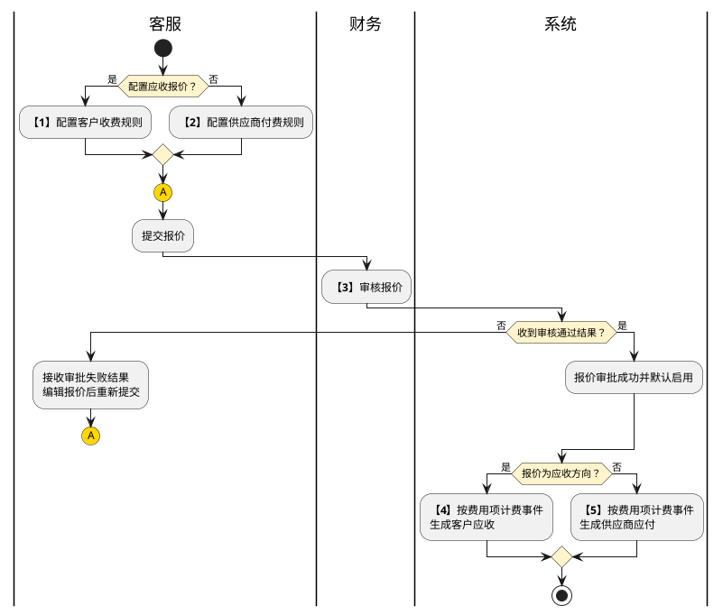

# 第044篇

> 本篇定位：综合报价与计费；主要内容：外部客户、外部供应商、内部客户报价，报价审批、跨境电商及普货计费、成本项目映射；文档角色：模块档；文档ID：6272B8B3EA

## 1. 报价建立、审核与使用

客服按业务类型、财务组织、结算部门和客户或供应商维护报价；财务审核报价。报价配置服务商品及计费条件，业务实际执行后形成结算费用，不把报价审核等同于费用审核。已生成费用的维护、审批与调整见[订单成本管理](PRD.高捷物流系统.第047篇.财务结算-订单成本管理.70AD0AF66B.md#doc-70AD0AF66B-section-f3a6b8c29d10)。

| 报价对象 | 报价用途 | 对象取得条件 |
| --- | --- | --- |
| 外部客户 | 本部门向外部客户收取费用 | 合作方客户档案已建立；缺失时先补档并完成财务审核 |
| 外部供应商 | 本部门向外部供应商支付费用 | 合作方供应商档案已建立；缺失时先补档并完成财务审核 |
| 内部客户 | 本部门向集团内部财务组织及部门收取费用，可配置生成对方应付 | 内部组织与部门已存在；内部部门不能仅用一个外部客户名称代替 |

### 1.1 报价计费流程

| 步骤 | 参与方 | 处理 | 结果或后续 |
| --- | --- | --- | --- |
| 1 | 客服 | 为外部或内部客户配置收费规则，填写有效期间与服务商品 | 提交财务审核 |
| 2 | 客服 | 为外部供应商配置付费规则，填写有效期间与服务商品 | 提交财务审核；与步骤1是按报价方向选择的入口 |
| 3 | 财务 | 审核提交的报价 | 成功后默认启用；失败交客服编辑并重新提交 |
| 4 | 系统 | 应收方向在相应业务计费事件发生后使用报价 | 生成客户应收费用；每项触发点见本篇费用表 |
| 5 | 系统 | 应付方向在相应业务计费事件发生后使用报价 | 生成供应商应付费用；不要求先生成步骤4的费用 |

连接符 A 表示客服修改审批失败的报价后返回提交报价，仍须由财务重新审核。

来源总流程把应收触发概括为订单完成、应付触发概括为服务完成；费用明细又包含每日、每月、终止、安检完成和报关放行等事件。图仅说明审批与计费关系，不将其简化为全部费用都在订单完成时生成，也不增加应收先于应付的依赖。

### 1.2 审批状态与使用状态

报价同时保存审批状态与启用状态。

| 审批状态 | 使用状态 | 客服操作 | 已明确后续 |
| --- | --- | --- | --- |
| 待提交 | 未启用 | 查看、编辑、提交 | 提交后进入审批页签 |
| 待审核 | 未启用 | 查看 | 财务审批成功或失败 |
| 审批成功 | 已启用 | 查看、编辑、禁用 | 禁用后变为已禁用 |
| 审批失败 | 未启用 | 查看、编辑 | 编辑后可重新提交审核 |
| 审批成功 | 已禁用 | 查看、编辑；供应商列表图另有启用 | 字段表未列启用，供应商截图却提供入口；能否直接恢复启用及是否重审待确认 |

已启用报价编辑后是否重审、编辑期间旧规则是否继续使用、禁用时在办订单采用哪版报价均未明确。内部报价另有“审批拒绝、已生效”的混合状态表述，不能作为上述两类状态的额外迁移。

**界面原型概述 · 报价查询与列表**

| 字段或控件 | 个别界面约束或可见反馈 |
| --- | --- |
| 外部客户查询栏 | 客户名称模糊查询；业务类型、财务组织、结算部门精确选择，组织和部门候选来自当前账号 |
| 外部供应商查询栏 | 供应商名称模糊查询；业务类型、财务组织、结算部门精确选择，组织和部门候选来自当前账号 |
| 内部客户查询栏 | 财务组织模糊查询；结算部门、内部机构、内部部门精确选择；内部部门与内部机构联动 |
| 外部报价列表 | 财务组织、结算部门、客户或供应商、平台、业务类型、创建人、创建日期、更新人、更新时间、审批状态、启用状态、查看/编辑/提交/禁用；供应商表未列业务类型和创建日期但截图有，平台列相反，投影差异待确认 |
| 内部报价列表 | 财务组织、结算部门、内部客户、内部部门、业务类型、创建人、创建日期、更新人、更新时间、审批状态、启用状态、操作 |
| 报价列表与报价审批页签 | 审批页签显示未审批报价，财务可进入审核并选择审批成功或审批失败；各状态操作按上表投影 |
| 查询、重置、新建 | 无条件查询全部可见记录，按创建时间倒序；重置清空条件；新建进入对应报价表单。来源统一说明每页50条，成本项目映射截图有每页10条，分页默认是否分页面配置待确认 |

## 2. 报价配置

### 2.1 报价基本信息与明细默认值

基本信息的含税方式、税率、币种、生效日期和失效日期分别作为服务商品明细的默认值；允许按明细修改。费用按其明细配置计价，不因为处于同一报价中就强制使用同一币种或税率。

**界面原型概述 · 报价基本信息**

- **区域字段或业务元素**：财务组织、结算部门、外部客户/外部供应商或内部客户及内部部门、平台、业务类型、是否含税、税率、币种、生效日期、失效日期、关联合同。
- **区域级通用规则**：除所列特例外均为必填选择或日期输入；财务组织取当前账号，结算部门取该组织下的部门，多候选时选择，单候选时带入。

| 字段或控件特例 | 界面特例或可见反馈 |
| --- | --- |
| 客户与供应商 | 外部报价从对应合作方档案选择；内部客户取内部财务组织，内部部门与之联动 |
| 平台 | 外部客户报价仅结算部门为电商客服部时显示并必填，候选取平台基础数据；供应商及内部报价是否需要平台未形成统一口径 |
| 业务类型 | BBC进口、BC进口、BC出口、普货进口、普货出口、个人物品CC |
| 是否含税、税率 | 含税时选择0、1%至10%的整数百分比；不含税时不允许选择税率。来源对初始化含税默认值及基本信息可编辑列有冲突，不补定默认税率 |
| 币种 | 从币种基础数据选择 |
| 生效与失效日期 | 精确到日；日期先后、首尾是否含当天、时区及多报价期间重叠规则未定义 |
| 关联合同 | 支持多选；字段表写必填，基本信息截图没有必填标记，必填性待确认 |

**界面原型概述 · 服务商品计费明细**

- **区域字段或业务元素**：服务商品、计费规则、计费单位、结算公式、单价/首价、最低消费、范围定义、首重、续重、续价、向上取整、是否含税、税率、币种、生效日期、失效日期、是否为合同价、删除、添加一行。
- **区域级通用规则**：明细根据所选服务商品与计费规则展示输入项，结算公式按计费单位显示；含税、税率、币种与有效日期带入基本信息，允许逐行修改。

| 字段或控件特例 | 界面特例或可见反馈 |
| --- | --- |
| 计费规则 | 单价、区间单价、首加续；具体费用表还含手工录入，来源总下拉枚举未列，不能据此删除手工费用能力 |
| 单价/首价 | 单价及区间单价模式填写单价，首加续模式填写首价；必填 |
| 计费单位 | 从计费单位基础数据选择；公式按本篇具体费用映射，不是自由输入公式 |
| 最低消费 | 选填；业务比较方式见[计算方法](#doc-6272B8B3EA-pricing-methods) |
| 范围定义 | 区间单价必填；弹窗内容随服务商品变化；同商品重复明细的范围必填项不得重复 |
| 首重、续重、续价 | 首加续时必填；按票数、分单数计费的首加续与重量字段如何投影需按具体公式区分 |
| 向上取整 | 支持所涉费用选择0.5或1；是否还允许截图中的0，以及金额/重量作用对象的差异待确认 |
| 明细含税与税率 | 含税状态可改；含税时可选0、1%至10%，非含税时税率控件不可选 |
| 明细失效日期 | 来源默认值写为基本信息生效日期，与失效日期继承逻辑冲突，待确认 |
| 是否为合同价 | 图中有是/否选择，正文未定义与关联合同的关系、默认或计费影响 |
| 添加一行 | 仅区间单价及首加续展示；复制当前服务商品及其字段规则形成新行 |

来源把单价、首重、续重、续价的范围写成“1-250”，最低消费写“1-1000000”，但所在列为类型而非业务范围，未定义单位与精度。不能直接推断金额不得小于1或单价最高250。

### 2.2 服务选择、分组与范围

服务单选、服务商品多选。选中商品时在下方加入计费行，再次选中同一已选商品时取消选择并删除该行。服务与服务商品关系来源于商品中心类目关系；没有对应服务商品时先维护相应基础资料，不自动创造价格或替代项。

“删除商品选择”与“移除服务候选”是两种操作：前者影响当前报价明细，后者从当前服务的候选中移除服务商品，并被同财务组织、同业务类型、同服务的其他客服看到，但不改变商品中心原类目关系。新增候选可多选本部门创建的服务商品，并在后续同部门、同业务类型的新报价中保留关联；新增与删除的共享范围不完全相同，最终保存范围待确认。

| 服务分组 | 公共匹配条件与界面输入 | 分组限制 |
| --- | --- | --- |
| 仓储 | 仓库名称、免租天数；仓储区间另含仓储类型 | 仓库可选全部；免租天数是否在组与行同时存在及其优先级未定义 |
| 关务 | 口岸名称，来自口岸基础数据 | 来源文字误称仓储，图中为关务服务，不另造第二种仓储口岸字段 |
| 运输 | 起始地与目的地分别选择省市区、仓库/货站/码头、对应具体地点、详细地址 | 地点候选按类型联动；详细地址选填 |
| 快递 | 省、市区域，支持按省多选或全部，图中有省市级联 | 省级全部与市级具体值混选时的匹配优先级未定义 |
| 干线 | 空运、海运、陆运运输方式单选 | 图中“全选”与文字单选是否兼容未明确 |

“添加一类”复制该服务的商品列表，维护另一组公共匹配条件；同服务各组必填条件不得重复。例如已设置广东省广州市的快递服务分组，新增同服务分组不得再选择同一区域。该校验不能代替全部与具体区域、日期重叠、不同报价命中冲突的判定。

**界面原型概述 · 服务候选与范围弹窗**

| 字段或控件 | 个别界面约束或可见反馈 |
| --- | --- |
| 服务与服务商品 | 单选服务、多选商品；区分当前勾选、移除候选及增加候选操作 |
| 增加服务商品 | 展示可选商品，支持多选，确定后加入候选，取消不加入 |
| 服务公共信息 | 按上表展示仓库、口岸、起终点、省市或运输方式；添加一类形成独立分组 |
| 范围定义 | 按商品展示匹配字段；仓储图有仓库类型和免租天数；确定保存当前范围，取消返回明细 |
| 提交、保存、取消 | 新建使用提交/取消，编辑使用保存/取消；输入或必填校验不满足时标出问题字段，提交/保存不可用；提交成功提示并返回列表，该报价进入审批页签；保存是否同步重审按审批边界处理 |

### 2.3 内部客户生成应付

内部客户报价的每个服务商品需配置“生成应付”。选择是时，本部门应收自动形成内部客户对应部门的应付，在结算费用录入界面展示；不能以同金额两条记录推导为独立外部应付款。

**界面原型概述 · 内部报价明细特有配置**

- **区域字段或业务元素**：生成应付、费用状态。
- **区域级通用规则**：生成应付必填，选择是时费用状态必填。

| 字段或控件特例 | 界面特例或可见反馈 |
| --- | --- |
| 生成应付 | 是、否；按商品分别配置 |
| 费用状态 | 未确认、已确认；来源文字却说未确认不需要对方确认、已确认需要对方确认，名称与行为相反，未确认前不实现确定的确认状态迁移 |

内部来源新增费用候选取“金蝶费用项”，外部取“服务商品”，而本篇又通过成本项目映射连接二者；内部是否可跳过服务商品身份和成本映射仍待确认。

## 3. 计算方法与计费边界

报价按客户或供应商、财务组织、结算部门、业务类型、服务商品及已配置的仓库、口岸、线路、区域、货站、规格等条件匹配。具体费用的输入、公式与生成事件在后文逐项定义；不能用同名费用跨业务或跨收付方向套价。

| 方法 | 计算规则 | 必要边界 |
| --- | --- | --- |
| 单价 | 配置单价×对应实际计费量 | 单价按商品、仓库、货站、车型等已定义范围取得；计费量不能在商品件数、包裹数、总单数与分单数间互换 |
| 区间单价 | 匹配范围后使用该范围的单价×计费量 | 范围不仅包括数值区间，也可包括仓储类型、地区或规格；重叠、未命中、多命中规则待确认 |
| 重量首加续 | 毛重≤首重时收首价；毛重>首重时，首价＋续重计价量÷续重×续价 | 未配置进位时，续重计价量为毛重－首重；配置0.5或1时只把该正差额向上取至相应刻度，不直接把最终金额取整 |
| 超件附加 | 件数≤常规件数时无超件费用；件数>常规件数时，（件数－常规件数）×每件超件价 | 与续重费用独立相加；“超件价”既用于单价又用于结果的来源用词在此区分 |
| 主分单首加续 | 首价＋分单数量×续价 | 不使用重量除以续重的公式；适用货站和业务见费用表 |
| 报关票数首加续 | 首价＋（报关单票数－1）×续价 | 一线进境适用；无报关单时如何处理未明确 |
| 最低消费 | 已算费用低于已配置最低消费时，取最低消费；否则保留已算费用 | 按行、按订单或按汇总比较，以及含税/汇率/舍入的先后未定义 |
| 手工录入 | 由业务人员录入实际发生费用 | 不为手工项生成自动公式或虚拟计费数量 |

重量、件数、体积和金额的负数/空值处理、货币精度、汇率、规则生效基准日期、有效期间跨日边界、重复触发防重、补报重算、已经审核或核销费用的处理未定义。本篇不按来源文件时间推定报价优先级，也不把上述缺口补成无依据的自动规则。

来源基本字段说明把向上取整应用于“12.1元变12.5元”，而逐费用公式与示例应用于重量差额；二者冲突已经列入问题清单。后文只在原公式明确要求时保留对应进位。

### 3.1 计价示例

以下示例仅演示已列明公式，单价均为配置值，不是固定报价。

| 业务输入 | 计算 | 结果 |
| --- | --- | --- |
| 理货单价2，两SKU分别3件、2件 | 2×（3＋2） | 10 |
| 仓储单价2，免租3天，第4/5天体积10/6 | 前3天为0；2×10＋2×6 | 5天合计32 |
| 卸货柜型40尺单价8、20尺单价5，分别2柜/1柜 | 8×2；5×1 | 分别16、5 |
| 托盘A/B/C单价1/5/8，A规格6托、C规格2托 | 1×6；8×2 | 分别6、16；B的5仅为配置示例 |
| 按体积单价10，长宽高2、3、4且采用同一体积单位 | 10×（2×3×4） | 240 |
| 拆盒单价2，指定SKU共5件 | 2×5 | 10 |
| 跨境订单操作：毛重20.1kg、首重5kg、首价10、续重2kg、续价6、5件、常规3件、超件单价2 | 无进位：10＋15.1÷2×6＋2×2；按0.5进位：差额15.1→15.5，再计算 | 分别59.3、60.5 |
| 快递首价12、首重5kg、毛重6.3kg、续重0.5kg、续价4 | 无进位12＋1.3÷0.5×4；按0.5进位后12＋1.5÷0.5×4 | 分别22.4、24 |
| 进口换单单价2，一总单 | 2×1 | 2 |
| 中港运输40kg、30包裹，单价p | 重量方式40×p；件数方式30×p | 按所选计费方式形成费用；多方式能否并收未定义 |
| 一辆车同线路运两次，车次单价p | p×2 | 2p，不按车辆数计1次 |
| 仓租面积100平方米、单价p | 100×p | 每月100p |
| 一总单3份一线进境报关，首价p、续价q | p＋（3－1）×q | p＋2q；来源示例表达有缺符号问题，不能以示例替代正式公式 |
| 跨境进口同一报关单删2次/改4次；各自单价p/q | 2p、4q | 分别按次数计费；普货出口同单改2次仍仅q |
| 一单查验2次，单价p | 2×p | 2p |
| BBC总单计费重50kg，3份报关中1份查验；普货进口被查分单计费重30kg | BBC南航拉货50×p；普货进口拉货30×p | 对象分别为整个总单和被查分单 |
| 一总单有3分单，文件单价p，审核成功进出区登记2次、入闸单价q | 文件1×p；入闸2×q | 分别p、2q |
| 31包裹形成一份退运/退供报关单 | 按包裹费31×p；按报关票数费1×q | 不互换计量单位 |
| 普货出口报关单8项，长单录入单价p | 向上取整（8÷6）×p | 2p |
| 4总单中3单转关、1单不转关，转关单价p、非转关单价q | 每转关总单p×1，非转关总单q×1 | 每总单各生成一次，不按4份合成一票 |

## 4. 跨境电商客服应收

### 4.1 BBC、BC、CC进口共同仓储费用

以下共同项分别存在于BBC进口、BC进口和CC进口的电商客服应收表；单价仍按各自报价配置，不表示三个业务类型价格相同。

| 服务商品 | 输入与计费公式 | 生成事件 |
| --- | --- | --- |
| 理货 | 单价×仓库回传的当前平台订单全部SKU商品数量 | 集货仓储服务完成；备货入库订单的仓储服务完成 |
| 仓储 | 入仓当天计第1天，在仓天数≤免租天数时为0；超过后按当日每SKU体积×单价逐日计费。仓储类型可配全部、恒温、变温；体积取仓库每日回传，体积由长×宽×高形成 | 每日凌晨1点计算每客户每SKU前一天费用；费用录入页按月逐日逐SKU展示，下月1日汇总上月并生成独立仓储账单 |
| 入仓卸货·柜数 | 按40尺、20尺等柜型匹配单价×仓库回传柜数 | 集货仓储服务完成；备货入库订单仓储服务完成 |
| 入仓卸货·托盘 | 按客户选择托盘规格匹配单价×客户填报托盘数 | 集货仓储服务完成；备货入库订单仓储服务完成 |
| 入仓卸货·体积 | 单价×仓库理货报告体积 | 集货仓储服务完成；备货入库订单仓储服务完成 |
| 出仓装货·柜数 | 按柜型匹配单价×仓库回传柜数 | 集货仓储服务完成；备货出库订单仓储服务完成 |
| 出仓装货·托盘 | 按托盘规格匹配单价×客户填报托盘数 | 集货仓储服务完成；备货出库订单仓储服务完成 |
| 出仓装货·体积 | 单价×体积；集货取入仓理货报告体积，备货取出库平台订单体积 | 集货仓储服务完成；备货出库订单仓储服务完成 |
| 拆盒、贴标、贴条码、组套、特殊包材气柱袋、重新上架、下架 | 每种服务商品分别以单价×客户指定SKU并填报的件数计算 | 对应仓储服务完成 |
| 跨境订单操作 | 首价＋重量续重费＋超件费用；毛重取小包裹订单，件数与常规件数形成超件量，进位只作用重量差额 | 快递服务完成 |

同一入仓商品多批次、部分出库或途中转仓时，免租起算对象、每日体积快照与重复理货费用的边界未明确。仓储类型字段的“变温”与范围截图的“普通仓”不能直接视为同义。

### 4.2 干线、国内运输与快递共同规则

| 适用业务 | 服务商品 | 输入与公式 | 生成事件 |
| --- | --- | --- | --- |
| BBC、BC、CC进口 | 空运进口换单 | 按货站匹配单价×总运单票数；货站可多选，一总单计1票 | 空运干线服务完成 |
| BBC、BC、CC进口 | 海运进口换单 | 按港口匹配单价×总运单票数 | 海运干线服务完成 |
| BBC、BC、CC进口 | 进口换单垫付 | 手工录入 | 按实际垫付录入 |
| BC、CC进口 | 中港运输 | 可按主运单重量×单价，或小包裹件数×单价 | 陆运干线服务完成；两种计量方式不能自动同时叠加 |
| BBC、BC、CC进口 | 国内运输/本地运输·车次 | 起始地与目的地匹配服务线路，按车辆类型、车型取得单价×该服务单车次；柜车/吨车联动车型，来源列20尺/40尺、3T/5T/8T | 对应运输服务完成 |
| BC、CC进口 | 本地运输·托盘 | 按托盘规格取得单价×客户填报托盘数 | 集货运输服务完成；备货来源误写仓储完成并生成装货费，准确触发待确认 |
| BBC、BC、CC进口 | 快递 | 按省份范围选择报价，单次按包裹毛重执行重量首加续，进位可选0.5或1 | 主运单下快递服务完成或终止 |
| BC、CC进口 | 清关派送 | 按省份范围选择报价，执行重量首加续，进位可选0.5或1 | 来源定义为快递服务完成或终止，不因归属关务服务而改为报关完成 |

BBC国内运输杂费手工录入；BC、CC的中港运输杂费、本地运输杂费、海关监管仓仓储及快递转寄手工录入；BBC快递异常手工录入。上述项目不因同属一个运输或快递服务就并入自动单价。

### 4.3 报关、清关与退货差异

| 适用业务 | 服务商品 | 计费量与公式 | 生成事件或范围 |
| --- | --- | --- | --- |
| BBC进口 | 一线进境申报 | 首价＋（同总单报关票数－1）×续价 | 当前主运单全部报关服务完成或终止；来源示例缺少加号，与公式不一致，待确认 |
| BBC进口 | 二线调拨申报 | 单价×区内调拨/区间调拨的国内报关服务记录数 | 当前主运单全部报关服务完成或终止 |
| BBC、BC、CC进口 | 删单、改单 | 各自单价×关务服务记录处理事项中的删单/改单次数 | 当前主运单全部报关服务完成或终止；按操作次数，不是按发生操作的单据票数 |
| BBC进口 | 查验 | 手工录入 | 按实际发生录入 |
| BC进口 | 清关 | 单价×包裹件数，一快递包裹计1件 | 来源未写明生成时点，不从相邻CC规则推断 |
| CC进口 | 清关 | 单价×包裹件数 | 主运单下快递服务完成或终止 |
| CC进口 | 实名认证、拉取身份证图片 | 各自单价×包裹件数；来源计费字段称订单数 | 全部报关服务完成或终止；订单数与包裹数是否始终相同待确认 |
| BBC进口 | 客退入仓 | 单价×客退包裹件数 | 客退平台订单完成；货物由消费者退回南沙保税仓 |
| BBC进口 | 退供入仓 | 单价×退供报关单票数 | 退供平台订单完成；保税仓退香港仓 |
| BC、CC进口 | 报关退运 | 单价×退运包裹件数 | 退运平台订单完成；清关失败后广州机场仓退香港仓 |
| BC、CC进口 | 报关退供 | 单价×退供报关单票数 | 退供平台订单完成；香港仓退客户或其他仓库，CC仅香港仓有此服务 |

## 5. 跨境电商客服应付

### 5.1 共同应付费用与内部收付方向

| 适用业务 | 服务商品 | 计费与生成规则 |
| --- | --- | --- |
| BBC、BC、CC进口 | 供应商仓租/管理 | 仓库占用平方米×单价，每月一次，下月1日生成上月费用并在月末结算账单展示；来源称客户账单而本节为应付，账单归属待确认 |
| BBC、BC、CC进口 | 进口换单、干线杂费 | 手工录入；BBC海运由南沙关务付外部供应商，空运由机场关务付外部供应商后向电商客服收取，并形成其应付 |
| BBC、BC、CC进口 | 地勤 | 按南航/国航货站匹配，单价×总运单提单计费重；货站安检服务完成或终止生成。CC来源另要求四舍五入，精度未定 |
| BBC、BC、CC进口 | 国内运输 | 起终点匹配，按车辆类型/车型取单价×匹配服务单车次；运输服务完成生成 |
| BBC、BC、CC进口 | 快递 | 包裹毛重首加续，按省份多选/全部匹配，重量差额进位可选0.5或1；快递服务完成或终止生成 |

BC进口的地勤、舱单录入、入闸、操作，以及退运中滞留机场仓的仓储费，是电商客服付给关务部的费用。CC进口的地勤、操作、退运中滞留机场仓的仓储费，同样付给关务部；不能因为文档处于“供应商应付”表就将这些内部结算项改为外部付款。

### 5.2 BBC进口应付特有项

| 服务商品 | 输入与公式 | 生成事件及限制 |
| --- | --- | --- |
| 查验 | 单价×报关单记录的查验次数 | 发生查验的报关服务完成或终止 |
| 国航舱单录入 | 首价＋分单数量×续价，四舍五入 | 仅国航货站供应商；主单全部报关服务完成或终止；舍入精度未定义 |
| 南航舱单录入 | 单价×分单数量，四舍五入 | 仅南航货站供应商；主单全部报关服务完成或终止 |
| 特殊处理 | 单价×总运单提单计费重 | 每总单均有，报关服务完成或终止 |
| 查验拉货 | 单价×整个总运单提单计费重，不仅被查报关单的重量 | 南航供应商且发生查验；报关服务完成或终止 |
| 装卸 | 单价×总运单提单计费重 | 总运单订单完成或终止 |
| 文件 | 单价×总运单票数，当前主运单计1票 | 主订单完成 |
| 入闸 | 单价×该主运单关联且审核成功的进出区登记明细数 | 主订单完成 |
| 空港通录入 | 单价×分单票数 | 来源同时要求BBC干线为中港车、仅转仓发生；干线完成或终止生成；条件是否必须同时成立待确认 |
| 服务 | 单价×分单提单计费重 | 转仓的BBC订单完成 |
| 转关操作 | 单价×报关单票数 | 空运干线且入仓南沙，主运单订单完成或终止 |
| 退供报关 | 单价×退供报关单票数 | 退供平台订单全部报关单完成或终止；保税仓退香港仓 |

BBC手工项包括仓租、冷藏、消毒、拆单、叉车、采样消杀、国内运输的提货/压车/返空/待时，以及消费者客退查验。它们与按面积自动计费的供应商仓租为不同计费方式，不应自动重复形成同一费用。

### 5.3 BC与CC进口应付差异

| 适用业务 | 服务商品 | 输入与公式 | 生成事件及限制 |
| --- | --- | --- | --- |
| BC、CC | 操作 | 单价×包裹件数，一快递包裹计1件 | 主运单订单完成或终止；内部付关务部 |
| BC、CC | 退运申报 | 单价×退运报关单票数 | 退运平台订单完成；不是应收的包裹计费 |
| CC | 清关 | 单价×包裹件数 | 主运单全部包裹的报关服务完成 |
| CC | 特殊处理 | 单价×总运单提单计费重 | 每总单均有；报关服务完成或终止 |
| CC | 个人物品 | 毛重<首重时为首价；毛重≥首重时为首价＋续价×（毛重－首重） | 白云快件货站；主订单完成或终止；来源未使用续重除数，不套用快递公式 |
| CC | 理货·低于标准重量 | 单价×包裹件数 | 干线为中港车，毛重<标准重量，主订单完成或终止 |
| CC | 理货·达到标准重量 | 单价×毛重 | 干线为中港车，毛重≥标准重量，主订单完成或终止；毛重作用于单包裹还是总单未明确 |
| CC | 报关退供 | 单价×退供报关单票数 | 退供平台订单完成；香港仓退其他仓库 |

BC关务手工项：舱单录入、叉车、网付税金手续、非正常班加班、其他费用、代付进口税金、采样消杀、送货、入闸；退运滞留机场仓仓储和退供的退运库内操作费亦手工录入。CC关务手工项：舱单录入、叉车、B转C操作、实名认证、杂费；退运滞留机场仓仓储手工录入。三类业务的进口换单与干线杂费按共同规则处理。

## 6. BC与CC进口关务部应付

本节是关务部对外应付，不能与电商客服付关务部的内部费用合并。货站匹配支持多选；以下自动项均在主运单全部报关服务完成或终止后计算。

| 适用业务 | 服务商品 | 匹配与计费 |
| --- | --- | --- |
| BC进口 | 理货 | 逐包裹比较毛重与标准重量：毛重≥标准用单价1，毛重<标准用单价2；对应单价×包裹件数。两支均按件，不与CC电商应付的重货按毛重规则混用 |
| BC、CC进口 | 到货综合费 | 单价×总运单提单计费重 |
| BC、CC进口 | 地勤费 | 按货站取单价×总运单提单计费重，四舍五入；精度未定义 |
| CC进口 | 过机费 | 按货站取单价×总运单毛重 |

BC、CC关务部的机场滞留仓储费、舱单录入费均手工录入。

## 7. 普货进出口关务报价

### 7.1 普货出口应收与应付

下表应收费用均在相应报关服务完成或终止后生成，并同时满足各行附加条件；报关服务的资格条件不由报价表重新定义。

| 应收服务商品 | 计费量与公式 | 附加条件 |
| --- | --- | --- |
| 报关/出口报关 | 单价×报关单票数，计数来自关务服务单 | 当前总单下对应报关业务 |
| 长单数据录入 | 单价×向上取整（单份报关单项号数÷6） | 单份报关单项数>6；8项计2张，不是仅超出6项的剩余页数 |
| 转关运抵录入/转关 | 单价×转关报关单票数 | 报关单类型为转关 |
| 代理查验/查货 | 单价×查验次数 | 报关服务记录发生查验 |
| 删单退仓手续/货物出口退仓手续 | 单价×删单退仓报关服务单数 | 报关单类型为删单退仓 |
| 删单退场手续 | 单价×删单退场服务单数 | 报关单类型为删单退场 |
| 落装改配手续 | 单价×落装改配服务单数 | 报关单类型为落装改配 |
| 删单 | 单价×发生删单操作的报关单票数 | 同单重复删单不按操作次数累加 |
| 改单 | 单价×发生改单操作的报关单票数 | 同单改两次仍计1票 |
| 办理货站放行条手续/货站货物放行手续 | 单价×已放行报关单票数 | 报关单放行 |

报关单补录为手工应收。普货出口关务应付有：转关运抵录入，按转关报关单票数×单价；公路预配舱单录入，按陆运方式对应报关单票数×单价。两项均在报关服务完成或终止后生成，公路预配额外要求普货出口干线为陆运。

### 7.2 普货进口应收与应付共同项

下列同名项目在应收和应付分别报价、分别生成费用；公式相同不表示价格相同或自动互转。

| 服务商品 | 公式与计费对象 | 生成条件 |
| --- | --- | --- |
| 国航舱单录入 | 首价＋分单数量×续价 | 国航货站，主订单完成 |
| 南航舱单录入 | 单价×分单数量 | 南航、有分单、不转仓、主订单完成；来源示例却写转仓，此条件冲突待确认 |
| 拆单 | 单价×分单数量 | 主订单完成；示例把单价称续价，字段名称待统一 |
| 特殊处理 | 单价×总运单提单计费重 | 主订单完成 |
| 拉货 | 单价×发生查验分单的提单计费重 | 南航且报关记录查验，相应报关服务完成或终止；不使用BBC整总单重量 |
| 理货·不转仓 | 单价×总运单毛重 | 不转仓，主订单完成 |
| 理货·转仓 | 单价×总运单提单计费重 | 转仓，主订单完成 |
| 装卸·不转仓 | 单价×总运单毛重 | 不转仓，主订单完成 |
| 装卸·转仓 | 单价×总运单提单计费重 | 转仓，主订单完成 |
| 空港通录入 | 单价×分单票数 | 转仓，主订单完成 |
| 服务 | 单价×毛重 | 转仓，主订单完成；来源计费字段为分单毛重、示例为主单毛重，具体层级待确认 |
| 文件 | 单价×主运单票数，当前主单计1票 | 主订单完成 |
| 地勤 | 单价×总运单提单计费重 | 货站安检服务完成或终止；应付来源结果误写文件费，不能因此生成第二笔文件费 |
| 入闸 | 单价×主运单下审核成功的进出区登记明细数 | 主订单完成 |

### 7.3 普货进口独有费用与手工项

| 应收服务商品 | 公式与条件 |
| --- | --- |
| 普货报关、提单录入 | 各自单价×报关单票数，计数来自关务服务单；对应报关服务完成或终止 |
| 代理进口 | 单价×代理报关类型的报关单票数；对应报关服务完成或终止 |
| 查验 | 单价×报关记录查验次数；对应报关服务完成或终止 |

| 收付方向与服务 | 手工录入项目 |
| --- | --- |
| 应收·关务 | 消毒、叉车、网付税金手续、非正常班加班、其他费用、代付进口税金、采样消杀、送货、换单、燃油附加 |
| 应付·关务 | 叉车、消毒、采样消杀、送货、提货、换单、燃油附加、代付进口税金、海关查验、停车；到指定地点查验可发生海关查验和停车费 |
| 应收与应付·运输 | 提货、压车、返空、待时 |
| 应收与应付·仓储 | 仓租、冷藏等特殊仓租 |

## 8. BC出口关务报价

| 方向 | 服务商品 | 计费依据与公式 | 生成事件 |
| --- | --- | --- | --- |
| 应收 | 报关 | 按是否转关匹配单价×总运单票数；每总单一次 | 该总单全部报关单已放行 |
| 应收 | 陆运清关一口价 | 按车辆类型/车型匹配单价×陆运干线服务车次；车次默认1，可修改 | 存在陆运干线，且总单全部报关单已放行 |
| 应收 | 进仓 | 按货站匹配单价×总运单提单计费重 | BC出口同时有空运干线和货站安检服务，安检服务完成 |
| 应收与应付 | 国内运输 | 按线路起终点、车辆类型和车型匹配单价×相应运输服务单车次 | 对应运输服务完成 |
| 应付 | 地勤 | 按货站匹配单价×总运单提单计费重 | 货站安检服务完成；来源称全部BC出口总单默认含安检，与应收限定空运不一致，非空运范围待确认 |

BC出口应收仓储、理货、叉车为手工录入；应付仓储、理货、叉车、进仓为手工录入。自动进仓应收与手工进仓应付是不同方向，不合并为一项自动费用。

## 9. 服务商品与成本项目映射

客服创建的服务商品与财务维护的成本项目建立关联，使生成费用能够使用财务成本代码并供金蝶推送。服务商品身份、费用方向与成本项目不是同一字段；缺少成本项目时由财务维护基础数据，缺少服务商品时在服务商品管理中创建，不以自由文本伪造已关联代码。

选择关联或编辑后，从成本项目基础数据选一项，带出对应成本代码；确认保存关联。未关联商品显示关联，已关联显示编辑。变更关联对已经生成费用的影响及无关联是否阻止计费/推送尚未明确。

**界面原型概述 · 成本项目映射查询与关联**

| 字段或控件 | 个别界面约束或可见反馈 |
| --- | --- |
| 查询栏 | 商品编码模糊搜索；商品名称、成本项目、所属财务组织、所属部门、成本代码精确搜索；部门随财务组织联动 |
| 列表 | 商品编码、商品名称、商品类目、所属财务组织、所属部门、成本代码、成本项目、更新时间、业务类型、关联/编辑；数据来自服务商品与已存映射 |
| 查询与重置 | 无条件查询全部可见记录，按创建时间倒序；重置清空条件 |
| 关联或编辑弹窗 | 成本项目单选，成本代码随选择只读带出；确定保存，取消不保存 |

来源把“更新时间”解释为客服创建商品时录入，与映射编辑的更新时间语义不一致；更新人、操作历史、重复映射和跨部门改动权限均待明确。
