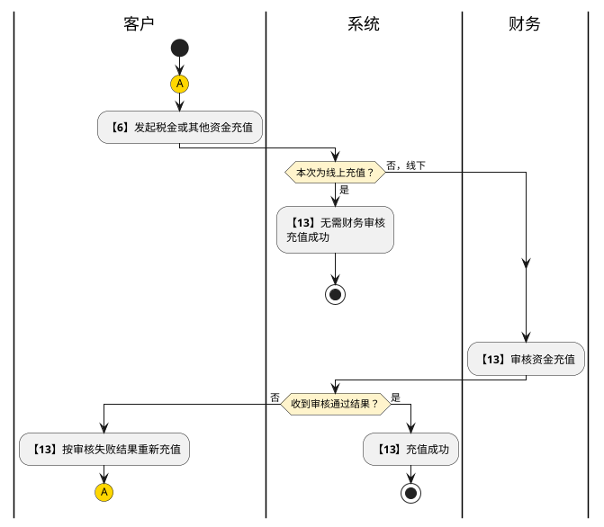

# 第046篇

> 本篇定位：税金账户与账单；主要内容：客户税金充值、余额转移、扣款明细、税金看板与账单确认；文档角色：模块档；文档ID：D17737280F

## 1. 税金账户业务范围与协作

客户在客户门户充值和调整店铺税金、查询余额与扣款、确认税金账单；线下充值由财务审核。账号、客户档案和店铺开通见[客户门户与业务前置](../PRD.高捷物流系统.第6册.业务基础与门户/PRD.高捷物流系统.第057篇.客户门户与业务前置.793342989B.md#doc-793342989B-4ed99ee81a86)。

列表分页、提交与保存反馈遵循[门户共用操作](../PRD.高捷物流系统.第6册.业务基础与门户/PRD.高捷物流系统.第057篇.客户门户与业务前置.793342989B.md#doc-793342989B-portal-common-actions)；数据权限仍按客户及店铺范围控制，见[门户与业务前置权限](../PRD.高捷物流系统.第8册.平台共用与运营/PRD.高捷物流系统.第064篇.角色与访问权限.5E31456F30.md#doc-5E31456F30-portal-access)。

**业务范围**：商家进行资金充值，进行税金预存和其他金额核销。

**参与角色**：电商客服、商家管理员

**前置条件**：创建商家账号成功

**业务结果**：充值金额经由财务审核成功。

**处理规则**：商家登录客户门户，进行线上充值或线下充值。
线上充值的情况，财务不需进行审核。线下充值需要商家提供相关线下充值证明，再由财务进行审核。
审核成功后，确认金额到账。
商家对不同店铺间的税金进行调整。

**分支与异常**：3a：审核失败
3a-01:审核失败后，客户重新上传线下充值证明。
4a：税金余额低于店铺税金警戒线的金额不允许转移。
4a-01:联系客服，调整税金警戒线。

### 1.1 资金充值流程

下图承接[客户业务准备协作流程](../PRD.高捷物流系统.第6册.业务基础与门户/PRD.高捷物流系统.第057篇.客户门户与业务前置.793342989B.md#doc-793342989B-customer-preparation-flow)的第 6、13 步；步骤编号沿用该流程表。

充值图的连接符 `A` 返回第 6 步发起入口，结束表示本次充值成功，不表示商品备案或店铺对接已完成。

## 2. 客户门户：税金管理

### 2.1 税金余额列表

税金余额列表，展示该客户所有店铺的余额相关信息：账户总余额、店铺名称、税金余额、税金警戒线，可进行客户名称的检索查询。

查询：在填写查询条件后，点击查询按钮，列表展示符合该条件的数据。若未填写查询条件，点击查询按钮，列表数据无变化。

重置：清空所有查询条件。

充值：点击充值按钮，跳转至资金充值页面。

转出：点击转出按钮，弹出转出余额弹窗，在弹窗选择转入店铺及转出金额进行余额转出。

可转金额只读展示；计算基数、警戒线扣减关系见 OPS-22。

来源要求转出金额冻结后不能被订单预扣；冻结触发、取消释放与重复提交边界见 OPS-22，不能仅以输入动作认定已完成资金转移。

**界面原型概述 · 税金余额列表 · 查询栏字段说明**

| 字段或控件 | 个别界面约束或可见反馈 |
| --- | --- |
| 店铺名称 | 按输入选择，模糊搜索 |

税金余额列表字段说明

#### 2.1.1 税金余额规则

| 业务字段 | 规则与形成结果 |
| --- | --- |
| 总余额 | 当前客户账户税金总余额，取各店总余额之和。；展示全部 |

**界面原型概述 · 税金余额列表 · 查询栏字段说明**

- **区域字段或业务元素**：总余额、店铺名称、税金余额、税金警戒线。
- **区域级通用规则**：展示当前记录，字段只读；操作入口按本场景的业务资格开放。

| 字段或控件特例 | 界面特例或可见反馈 |
| --- | --- |
| 总余额 | 按[本区域业务规则](#doc-D17737280F-18947ada0352)展示或校验 |
| 店铺名称 | 取当前登录账号能看到的店铺权限名称；展示全部 |
| 税金余额 | 该店铺当前税金余额，余额数据实时更新；展示全部 |
| 税金警戒线 | 取客服为店铺维护的店铺警戒线，低于警戒线发出预警通知，暂停客服对订单操作。；展示全部 |

### 2.2 税金充值

资金充值界面，用于客户线下转账之后，在线上记录转账金额并给财务进行确认或线上直接进行充值的页面。

【线下充值】

【线上充值】

上传附件：点击后，连接到电脑本地文件，支持上传文档、图片。

提交：点击后线下充值记录提交。该行记录状态=待审核。

确认支付提交线上充值并进入所选渠道：微信或支付宝显示相应二维码，银联进入银企直联页面。是否到账及充值成功须有确定依据；来源将点击与充值成功合并描述，相关边界见 OPS-23，不把提交等同到账。

#### 2.2.1 税金充值金额规则

| 业务字段 | 规则与形成结果 |
| --- | --- |
| 汇款金额 | 客户分配给店铺金额和其他金额之和（自动求和，无需填写） |
| 店铺金额 | 客户分配给该店铺的金额，允许小数点，保留四位小数 |

**界面原型概述 · 税金充值**

| 字段或控件 | 个别界面约束或可见反馈 |
| --- | --- |
| 汇款银行 | 必填；客户选择付款的银行，取客户档案里的银行信息 |
| 汇款银行账号 | 选择客户档案中的付款银行账号；能否补录档案外账号见 OPS-16。 |
| 汇款日期 | 必填；客户录入汇款日期，格式2014-02-12 |
| 水单 | 字符限制：2-100；客户录入水单号，允许数字、字母、特殊字符 |
| 汇款金额 | 只读；按[本区域业务规则](#doc-D17737280F-f63f1de8e83b)展示或校验 |
| 店铺金额 | 只读；按[本区域业务规则](#doc-D17737280F-f63f1de8e83b)展示或校验 |
| 其他金额 | 只读；客户分配给其他金额的金额 |
| 附件 | 客户上传银行水单文件 |
| 币种 | 必填；客户选择充值的原币币种 |
| 手续费扣除 | 必填；默认：店铺均摊；店铺均摊/指定店铺；当选择“指定店铺”时，出现选择项选择 店铺名称，单选。 |
| 收款公司 | 必填；取基础数据-银行账户下，类型为是否可用于税金的账户所属的公司名称 |
| 收款银行 | 必填；取基础数据-银行账户下，类型为是否可用于税金的账户。当客户选择线上充值-微信/支付宝充值时，不需选择收款银行 |

**界面原型概述 · 税金充值**

| 字段或控件 | 个别界面约束或可见反馈 |
| --- | --- |
| 选择银行 | 必填；客户选择付款的银行，取客户档案里的银行信息 |
| 银行账号 | 选择客户档案中的付款银行账号；能否补录档案外账号见 OPS-16。 |

### 2.3 充值记录

充值记录界面，用于展示线上、线下、转入转出操作记录的状态。记录审核时间和金额。

查询：在填写查询条件后，点击查询按钮，列表展示符合该条件的数据。若未填写查询条件，点击查询按钮，列表数据无变化。

重置：清空所有查询条件。

转移记录：点击后，显示店铺间税金转移的记录。

编辑：进入该充值记录的编辑页面，回显充值字段，所有字段可编辑。

充值记录界面字段说明

#### 2.3.1 充值记录编号规则

| 业务字段 | 规则与形成结果 |
| --- | --- |
| 充值单号 | 指客户在客户门户提交充值水单，我司系统生成的单号；展示全部 |

**界面原型概述 · 充值记录**

- **区域字段或业务元素**：充值单号、水单号、汇款银行、银行账号、汇款金额、币种、实际到账原币、手续费承担方、手续费、汇率、折算人民币、汇款日期、提交时间、审核状态、不通过原因、充值方式、充值渠道。
- **区域级通用规则**：展示当前记录，字段只读；操作入口按本场景的业务资格开放。

| 字段或控件特例 | 界面特例或可见反馈 |
| --- | --- |
| 充值单号 | 按[本区域业务规则](#doc-D17737280F-e3aaec58fe35)展示或校验 |
| 水单号 | 客户在客户门户提交水单时填写的水单号（水单号是指客户在银行充值时银行产生的单号）；展示全部 |
| 汇款银行 | 客户汇款的银行；当充值方式为线上时，汇款银行为空；展示全部 |
| 银行账号 | 客户汇款的银行账号；当充值方式为线上时，银行账号为空。；展示全部 |
| 汇款金额 | 客户汇款的金额；展示全部 |
| 币种 | 客户汇款的金额币种类型；展示全部 |
| 实际到账原币 | 扣除手续费后实际到达高捷账户的原币；展示全部 |
| 手续费承担方 | 手续费承担方是指由客户承担还是我司承担；展示全部 |
| 手续费 | 汇款时产生的手续费（汇款金额减去实际到账原币）；展示全部 |
| 汇率 | 两种货币之间兑换的比率。客服和客户协商一致后，客服人员在后台录入汇率，返回给客户门户；展示全部 |
| 折算人民币 | 折算成人民币的金额；展示全部 |
| 汇款日期 | 客户在客户门户选择的汇款日期；展示全部 |
| 提交时间 | 客户在客户门户提交线下充值记录的时间；展示全部 |
| 审核状态 | 财务审核充值记录的状态；展示全部 |
| 不通过原因 | 财务驳回充值审核的原因（客户门户直接获取财务在后台填写的不通过原因）；展示全部 |
| 充值方式 | 区分线上、线下；展示全部 |
| 充值渠道 | 当充值方式为线上时，充值渠道取对接的充值渠道，如微信、银企直联等。 当充值方式为线下时，充值渠道默认为“银行转账” |

转入转出记录界面字段说明

#### 2.3.2 店铺间税金转移编号规则

| 业务字段 | 规则与形成结果 |
| --- | --- |
| 转移编号 | 当客户转移一次店铺间的税金时，自动生成转入转出编号；展示全部 |

**界面原型概述 · 充值记录**

- **区域字段或业务元素**：转移编号、转出店铺、转入店铺、金额、操作人账号、操作时间。
- **区域级通用规则**：展示当前记录，字段只读；操作入口按本场景的业务资格开放。

| 字段或控件特例 | 界面特例或可见反馈 |
| --- | --- |
| 转移编号 | 按[本区域业务规则](#doc-D17737280F-1679966e069c)展示或校验 |
| 转出店铺 | 转出店铺的名称；展示全部 |
| 转入店铺 | 转入店铺的名称；展示全部 |
| 金额 | 客户进行当前操作的税金的金额；展示全部 |
| 操作人账号 | 进行转入转出操作的操作人账号名称；展示全部 |
| 操作时间 | 记录操作时间，时间格式 2021-02-19 8:00:21；展示全部 |

### 2.4 扣款记录

扣款记录界面，展示该登录账号能看的权限店铺下店铺税金的扣款流水情况。

查询：在填写查询条件后，点击查询按钮，列表展示符合该条件的数据。若未填写查询条件，点击查询按钮，列表数据无变化。

重置：清空所有查询条件。

筛选项说明

**界面原型概述 · 扣款记录**

| 字段或控件 | 个别界面约束或可见反馈 |
| --- | --- |
| 总运单号 | 填写总运单号，精准查询 |
| 订单编号 | 填写订单编号，精确查询 |
| 运单号 | 填写运单编号，精确查询 |

扣款记录列表字段说明

#### 2.4.1 税金扣款规则

| 业务字段 | 规则与形成结果 |
| --- | --- |
| 实际税金 | 取订单实际关税+实际增值税+实际消费税之和，该数据由后台返回 |

**界面原型概述 · 扣款记录**

- **区域字段或业务元素**：订单编号、总运单号、运单号、订单金额、预估税金、实际关税、实际增值税、实际消费税、实际税金、差额、补税、下单时间。
- **区域级通用规则**：展示当前记录，字段只读；操作入口按本场景的业务资格开放。

| 字段或控件特例 | 界面特例或可见反馈 |
| --- | --- |
| 订单编号 | 取由平台对接的电商小包裹订单号 |
| 总运单号 | 取该小包裹号上绑定的总运单号。该数据由后台返回 |
| 运单号 | 小包裹快递单号 |
| 订单金额 | 取由小包裹的订单金额，该数据由后台返回 |
| 预估税金 | 取订单的预估税金，该数据由后台返回 |
| 实际关税 | 取订单的实际税金，该数据由后台返回 |
| 实际增值税 | 展示该税种的实际金额；来源误写关税，取值确认见 OPS-23。 |
| 实际消费税 | 取订单的消费税金额，该数据由后台返回 |
| 实际税金 | 按[本区域业务规则](#doc-D17737280F-b3d61d1cc327)展示或校验 |
| 差额 | 取该订单实际税金和预估税金的差额。该数据由后台返回 |
| 补税 | 取该订单的补税金额，如果无则为空。该数据由后台返回 |
| 下单时间 | 取订单的下单时间，该数据由后台返回 |

查看订单明细：查看该总运单号的订单明细数据，点击查看订单明细，跳转至订单明细页面。

**界面原型概述 · 扣款记录**

| 字段或控件 | 个别界面约束或可见反馈 |
| --- | --- |
| 业务类型 | 选择业务类型查询，选项有：1、请选择（默认）2、BBC保税 3、直邮BC 4、个人物品 |
| 预扣时间 | 默认：日期；选择开始日期和结束日期，进行预扣时间段查询 |
| 对账时间 | 默认：日期；选择开始日期和结束日期，进行对账时间段查询 |

**界面原型概述 · 扣款记录**

- **区域字段或业务元素**：总运单号、业务类型、预扣税金、预扣时间、实际税金、对账时间、差额。
- **区域级通用规则**：只读。

| 字段或控件特例 | 界面特例或可见反馈 |
| --- | --- |
| 总运单号 | 提单号，该数据由后台返回 |
| 业务类型 | 订单的业务类型，该数据由后台返回 |
| 预扣税金 | 预估税金的扣款金额，该数据由后台返回 |
| 预扣时间 | 预扣税金扣款时间，该数据由后台返回 |
| 实际税金 | 海关提供的实际税金金额，该数据由后台返回 |
| 对账时间 | 该数据由后台返回 |
| 差额 | 该数据由后台返回 |

### 2.5 税金实时看板

税金实时看板界面，以柱状折线组合图样式展示该客户BC、BBC、CC业务对应的申报金额（指申报金额总和）、税金（指税金总和）、订单数（指订单总数）的数据情况；以饼状图样式展示BC、BBC、CC业务在申报金额、税金、订单数的占比情况。各图表均可进行日期时间查询。

日期查询：可选择开始日期和结束日期进行该时间段的数据查询。

税金图表支持按日或按月展示；31 天切换边界存在冲突，见 OPS-22。

### 2.6 明细列表

明细列表界面，展示该客户的税金明细信息：店铺名称、首次产生税金时间、累计已产生税金时间、累计已缴纳税金、待缴纳税金、当前税金余额、订单数量。可进行店铺名称检索查询。

查询：在填写店铺名称后，点击查询按钮，列表展示该客户的税金明细数据。若未填写客户名称，点击查询按钮，列表数据无变化。

重置：清空查询条件。

**界面原型概述 · 明细列表 · 查询栏字段说明**

| 字段或控件 | 个别界面约束或可见反馈 |
| --- | --- |
| 店铺名称 | 填写店铺名称，精准查询 |

明细列表字段说明

**界面原型概述 · 明细列表 · 查询栏字段说明**

- **区域字段或业务元素**：店铺名称、首次产生税金时间、累计已产生税金、累计已缴纳税金、待缴纳税金、当前税金余额、订单数量。
- **区域级通用规则**：展示当前记录，字段只读；操作入口按本场景的业务资格开放。

| 字段或控件特例 | 界面特例或可见反馈 |
| --- | --- |
| 店铺名称 | 该客户的店铺名称 |
| 首次产生税金时间 | 商家在高捷平台首次产生税金的时间 |
| 累计已产生税金 | 从第一次产生税金到目前为止总共产生的税金总额 |
| 累计已缴纳税金 | 从第一次缴纳税金到目前为止总共缴纳的税金总额 |
| 待缴纳税金 | 截止目前需缴纳但未缴纳的税金总额 |
| 当前税金余额 | 截止目前客户账户税金池的余额 |
| 订单数量 | 所产生的订单总数量 |

## 3. 客户门户：账单管理

### 3.1 税金账单列表

客户可查看、搜索所有已确认或未确认的税金账单。

查询：在不选择任何查询字段下，点击“查询”按钮，默认所有查询条件。选择对应的查询条件，则显示符合结果的数据。查询出的数据，按照“未确认”和“账单生成时间”倒序排列。

重置：重置所有查询条件。

导出账单：导出excel表到本地，具体内容的样式：

查看：点击后跳转到“查看账单详情”页

确认账单：当账单未确认时，才显示此按钮；点击后进入“确认税金账单”页面。

确认账单：当勾选一条或多条账单时，点击确认账单，跳出确认账单弹窗。点击驳回时，账单批量驳回。点击确认后，批量进行账单确认。

**界面原型概述 · 税金账单列表 · 查询栏字段说明**

| 字段或控件 | 个别界面约束或可见反馈 |
| --- | --- |
| 账单号 | 手工录入； 支持精准查询； |
| 订单号 | 手工录入； 填写订单号，支持模糊查询； |
| 总运单号 | 手工录入； 支持精准查询； |
| 账单生成时间 | 默认：日期；日期选择框； 不选择默认全部日期 |
| 账单确认状态 | 是/否 |

列表栏字段

#### 3.1.1 税金账单编号规则

| 业务字段 | 规则与形成结果 |
| --- | --- |
| 账单号 | 取客服后台生成的账单号 |
| 账单生成时间 | 取当前查询出的账单生成时间 |

**界面原型概述 · 税金账单列表 · 查询栏字段说明**

| 字段或控件 | 个别界面约束或可见反馈 |
| --- | --- |
| 账单号 | 按[本区域业务规则](#doc-D17737280F-87d6fc559d18)展示或校验 |
| 税金 | 取当前查询出的账单号的金额 |
| 账单生成时间 | 按[本区域业务规则](#doc-D17737280F-87d6fc559d18)展示或校验 |
| 账单确认状态 | 取当前查询出的账单确认状态 |

### 3.2 确认税金账单

用于客户查看账单详情，确认或驳回账单。

查询：在不选择任何查询字段下，点击“查询”按钮，默认所有查询条件。选择对应的查询条件，则显示符合结果的数据。查询出的数据，按照“订单时间”倒序排列。

重置：重置所有查询条件。

确认账单：点击后当前账单状态=已确认，并返回账单列表页面。

驳回账单：点击后跳出驳回弹窗，输入驳回理由，点击确认后，当前账单状态=已驳回

#### 3.2.1 税金汇总规则

| 业务字段 | 规则与形成结果 |
| --- | --- |
| 总税金 | 订单税金总金额之和 |
| 关税税率 | 关税税率，取后台生成数据 |
| 关税税金 | 关税的税金，取后台生成的金额数据 |
| 增值税率 | 增值税率，取后台生成数据 |
| 增值税金 | 增值税金，取后台生成金额数据 |
| 消费税率 | 消费税率，取后台生成数据 |
| 消费税金 | 消费税金，取后台生成金额数据 |

**界面原型概述 · 确认税金账单 · 列表字段说明**

- **区域字段或业务元素**：订单号、订单时间、提单号、总运单号、产品类型、类型、总税金、关税税率、关税税金、增值税率、增值税金、消费税率、消费税金。
- **区域级通用规则**：展示当前记录，字段只读；操作入口按本场景的业务资格开放。

| 字段或控件特例 | 界面特例或可见反馈 |
| --- | --- |
| 订单号 | 取电商平台小包裹订单号 |
| 订单时间 | 取电商平台订单下单时间，格式2012-03-21 9:23:12 |
| 提单号 | 取当前订单绑定的提单号 |
| 总运单号 | 取当前订单展示的总运单号 |
| 产品类型 | 取当前订单号的业务类型，区分BC/BBC/CC |
| 类型 | 区分当前订单税金是实际税金金额还是预估税金金额 |
| 总税金 | 按[本区域业务规则](#doc-D17737280F-223ba150d6e0)展示或校验 |
| 关税税率 | 按[本区域业务规则](#doc-D17737280F-223ba150d6e0)展示或校验 |
| 关税税金 | 按[本区域业务规则](#doc-D17737280F-223ba150d6e0)展示或校验 |
| 增值税率 | 按[本区域业务规则](#doc-D17737280F-223ba150d6e0)展示或校验 |
| 增值税金 | 按[本区域业务规则](#doc-D17737280F-223ba150d6e0)展示或校验 |
| 消费税率 | 按[本区域业务规则](#doc-D17737280F-223ba150d6e0)展示或校验 |
| 消费税金 | 按[本区域业务规则](#doc-D17737280F-223ba150d6e0)展示或校验 |

## 4. 订单税金明细

### 4.1 订单明细

订单明细界面，展示该客户账户扣款的订单明细信息：订单编号、总运单号、订单金额、扣款类型、关税、增值税、消费税、下单时间。可进行订单编号、扣费类型、下单时间检索查询。

查询：在填写查询条件后，点击查询按钮，列表展示符合该条件的数据。若未填写查询条件，点击查询按钮，列表数据无变化。

重置：清空所有查询条件。

**界面原型概述 · 订单明细 · 查询栏字段说明**

| 字段或控件 | 个别界面约束或可见反馈 |
| --- | --- |
| 订单编号 | 请输入；填写总运单号，精准查询 |
| 扣款类型 | 请选择；选择业务类型查询，选项有：1、请选择（默认）2、预扣 3、实缴 |
| 下单时间 | 日期；选择开始日期和结束日期，进行下单时间段查询 |

订单明细列表字段说明

#### 4.1.1 订单实际税金规则

| 业务字段 | 规则与形成结果 |
| --- | --- |
| 实际税金 | 取订单实际关税+实际增值税+实际消费税之和，该数据由后台返回 |

**界面原型概述 · 订单明细 · 查询栏字段说明**

- **区域字段或业务元素**：订单编号、总运单号、运单号、订单金额、预估税金、实际关税、实际增值税、实际消费税、实际税金、差额、下单时间。
- **区域级通用规则**：展示当前记录，字段只读；操作入口按本场景的业务资格开放。

| 字段或控件特例 | 界面特例或可见反馈 |
| --- | --- |
| 订单编号 | 取由平台对接的电商小包裹订单号 |
| 总运单号 | 取该小包裹号上绑定的总运单号。该数据由后台返回 |
| 运单号 | 小包裹快递单号 |
| 订单金额 | 取由小包裹的订单金额，该数据由后台返回 |
| 预估税金 | 取订单的预估税金，该数据由后台返回 |
| 实际关税 | 取订单的实际税金，该数据由后台返回 |
| 实际增值税 | 展示该税种的实际金额；来源误写关税，取值确认见 OPS-23。 |
| 实际消费税 | 取订单的消费税金额，该数据由后台返回 |
| 实际税金 | 按[本区域业务规则](#doc-D17737280F-778231133665)展示或校验 |
| 差额 | 取该订单实际税金和预估税金的差额。该数据由后台返回 |
| 下单时间 | 取订单的下单时间，该数据由后台返回 |

## 5. 待确认边界

税金业务尚未形成唯一口径的边界已记录在 PRD 自洽性问题清单：OPS-16、OPS-22、OPS-23、OPS-51。这些问题不作为已确认的判断条件、权限、算法或状态迁移。
