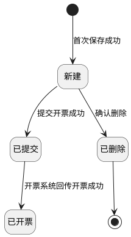
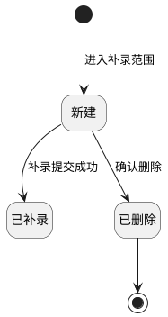

# 第052篇

> 本篇定位：财务结算-销项发票管理；主要内容：待开票明细、申请、补录、百望回传与发票；文档角色：模块档；文档ID：DA6DFB99AE

**关联业务主流程：** [税金管理与财务结算流程](../PRD.高捷物流系统.第1册.需求框架/PRD.高捷物流系统.第009篇.税金管理与财务结算流程.077CC05853.md#doc-077CC05853-tax-settlement)。
**关联模块流程：** [结算来源流程](../PRD.高捷物流系统.第1册.需求框架/PRD.高捷物流系统.第011篇.DDP跨模块作业与结算流程.7579B595B8.md#doc-7579B595B8-section-a5b92ee23329)。

## 1. 结算业务范围、角色与流程

**业务入口：** 销项发票页面。

**概念模型：** [数据字典 · 财务结算实体](../PRD.高捷物流系统.第8册.平台共用与运营/PRD.高捷物流系统.第063篇.数据字典.7A3D9E1F50.md#doc-7A3D9E1F50-domain-finance)

### 1.1 销项发票范围

销项发票管理覆盖开票申请、待开票处理、手工补录、税务发票查询和百望开票结果回传。

### 1.2 财务结算共用入口与流程

财务结算的跨模块导航与流程见[财务结算操作入口](PRD.高捷物流系统.第045篇.财务基础与结算流程.40E841D3A6.md#doc-40E841D3A6-section-3561f6529077)、[财务结算操作权限](../PRD.高捷物流系统.第8册.平台共用与运营/PRD.高捷物流系统.第064篇.角色与访问权限.5E31456F30.md#doc-5E31456F30-finance-actions)、[应收结算流程](PRD.高捷物流系统.第045篇.财务基础与结算流程.40E841D3A6.md#doc-40E841D3A6-section-23c66131aa44)、[应付结算流程](PRD.高捷物流系统.第045篇.财务基础与结算流程.40E841D3A6.md#doc-40E841D3A6-section-0f97b5b6d534)。

## 2. 销项开票申请

### 2.1 销项票申请列表页面

销项票申请列表页面，可搜索所有“需要开票”为“是”的销项票申请，并可进行查看、编辑、删除、传送开票操作。

**操作与反馈**

- 查询：按填写的条件查询；未设置条件时查询全部记录。查询结果按照“开票申请号”倒序排列。（业务日期为各订单服务完成的最终日期）

- 重置：重置所有查询条件。

- 查看：跳转“销项票申请查询”界面，所有状态均有该操作按钮。

- 编辑：跳转“销项票申请维护”界面。“新建”状态的开票申请才有该操作按钮。

- 删除：弹出“删除确认”弹框。“新建”状态的开票申请才有该操作按钮。

- 提交开票：弹出“提交确认”弹框。“新建”状态的开票申请才有该操作按钮。

**界面原型概述 · 销项票申请查询栏**

- **区域字段或业务元素**：开票申请号、结算单位、购买方、纳税识别号、状态、原币币种、创建人、创建日期、申请金额(原币)从、申请金额(原币)至、申请金额(本位币)从、申请金额(本位币)至。
- **区域级通用规则**：查询条件均选填、无预设值。

| 字段或控件特例 | 界面特例或可见反馈 |
| --- | --- |
| 开票申请号 | 填写开票申请号，支持模糊查询。 |
| 结算单位 | 填写结算，支持模糊查询。 |
| 购买方 | 填写购买方，支持模糊查询。 |
| 纳税识别号 | 填写纳税识别号，支持模糊查询。 |
| 状态 | 选择（新建/已开票）；不选择默认全部。 |
| 原币币种 | 选择（选择2列，币种代码、币种名称）；不选择默认全部。 |
| 创建人 | 填写创建人，支持模糊查询。 |
| 创建日期 | 不选择默认全部。 |
| 申请金额(原币)从、申请金额(原币)至、申请金额(本位币)从、申请金额(本位币)至 | 填写金额范围，精确查询。 |

（4）开票申请明细栏字段

每页显示10条

**界面原型概述 · 销项票申请明细栏**

- **区域字段或业务元素**：开票申请号、状态、需要开票、结算单位、成本项目、税率(%)、购买方、纳税识别号、申请金额(原币)、原币币种、即期汇率、申请金额(本位币)、创建人、创建日期。
- **区域级通用规则**：除所列特例外，字段均只读；按查询条件展示匹配记录；未设置查询条件时展示全部记录。

| 字段或控件特例 | 界面特例或可见反馈 |
| --- | --- |
| 需要开票 | 只显示需要开票为“是”的数据。 |

### 2.2 销项票申请查询页面

在销项票申请列表页面点击“查看”按钮，系统进入销项票申请查询页面。

**操作与反馈**

- 返回：返回“销项票申请列表”界面。

**界面原型概述 · 销项票基本信息（查看）**

- **区域字段或业务元素**：开票申请号、结算单位、创建人、创建日期、原币币种、申请总金额(原币)、即期汇率、需要开票。
- **区域级通用规则**：字段均只读；回显所选记录。

**界面原型概述 · 票面购货单位（查看）**

- **区域字段或业务元素**：购买单位名称、纳税人识别号、地址、电话、开户行名称、银行账号。
- **区域级通用规则**：字段均只读；回显所选记录。

**界面原型概述 · 票面销售单位（查看）**

- **区域字段或业务元素**：购买单位名称、纳税人识别号、地址、电话、开户行、账号。
- **区域级通用规则**：字段均只读；回显所选记录。

**界面原型概述 · 票面货物及服务信息（查看）**

- **区域字段或业务元素**：货物或应税劳务名称、规格型号、单位、数量、单价(含税)、金额(含税)、税率(%)、税额。
- **区域级通用规则**：字段均只读；回显所选记录。

**界面原型概述 · 票面开票其他信息（查看）**

- **区域字段或业务元素**：收件人、复核人、开票备注。
- **区域级通用规则**：字段均只读；回显所选记录。

**界面原型概述 · 票面发票信息（查看）**

- **区域字段或业务元素**：发票号、发票类型、是否作废。
- **区域级通用规则**：只有税务系统回传的已开票的开票申请，才有该栏信息。“新建”状态的开票申请，无发票信息；字段均只读；回显所选记录。

（9）销项票申请明细信息字段说明

每页展示5条，分页展示。

**界面原型概述 · 销项票申请明细信息（查看）**

- **区域字段或业务元素**：对账单号、对账单行号、订单号、客户、结算单位、成本项目、总金额(原币)、可开票金额(原币)、即期汇率、本次开票金额(原币)、本次开票金额(人民币)、对账单创建人、对账单确认日期。
- **区域级通用规则**：字段均只读；回显所选记录。

### 2.3 销项票申请编辑页面

在销项票申请列表页面点击“编辑”按钮，系统进入销项票申请编辑页面。

**操作与反馈**

- 保存：弹出“保存确认”弹框。

- 提交开票：弹出“提交确认”弹框。

- 返回：返回“销项票申请列表”界面。

**界面原型概述 · 销项票基本信息（维护）**

- **区域字段或业务元素**：复用[销项票基本信息字段（查看）](#doc-DA6DFB99AE-section-942231915cd5)定义的字段。
- **区域级通用规则**：全部字段回显当前编辑记录，只读。

**界面原型概述 · 票面购货单位（维护）**

- **区域字段或业务元素**：复用[票面购货单位字段（查看）](#doc-DA6DFB99AE-section-942231915cd5)定义的字段；本场景字段或差异项：购买方名称、纳税人识别号、地址、电话、开户行名称、银行账号。
- **区域级通用规则**：本场景使用“购买方名称”等字段名，维护方式按下表执行；除所列特例外，字段均只读；回显当前编辑记录；购买方名称变更后同步变更。

| 字段或控件特例 | 界面特例或可见反馈 |
| --- | --- |
| 购买方名称 | 仅可选择开票单位维护表中该结算单位下“已生效”的开票明细信息；可编辑；必填；有默认值。 |
| 银行账号 | 回显所选记录。 |

**界面原型概述 · 票面销售单位（维护）**

- **区域字段或业务元素**：复用[票面销售单位字段（查看）](#doc-DA6DFB99AE-section-942231915cd5)定义的字段；本场景字段或差异项：购买单位名称、纳税人识别号、地址、电话、开户行名称、银行账号。
- **区域级通用规则**：本场景对应字段名为“购买单位名称”，维护方式按下表执行；除所列特例外，字段均只读；回显所选记录。

| 字段或控件特例 | 界面特例或可见反馈 |
| --- | --- |
| 购买单位名称 | 回显当前编辑记录。 |
| 开户行名称 | 选择当前组织对应的银行，展示“开户行名称”和对应的“银行账号”；可编辑；必填；无预设值。 |
| 银行账号 | 开户行名称变更后同步变更。 |

本场景复用[票面货物及服务信息字段（查看）](#doc-DA6DFB99AE-section-942231915cd5)定义的字段。

**界面原型概述 · 票面货物及服务信息（维护）**

| 字段或控件 | 个别界面约束或可见反馈 |
| --- | --- |
| 货物或应税劳务名称、税率(%) | 根据编辑数据自动带出，可手工选择修改；必填；有默认值；可编辑。 |
| 规格型号、单位 | 根据编辑数据自动带出，可手工修改；选填；有默认值；可编辑。 |
| 数量、金额(含税) | 根据编辑数据自动带出，可手工修改；必填；有默认值；可编辑。 |
| 单价(含税)、税额 | 回显当前编辑记录；保存后自动计算；[计算规则见销项票申请编辑页面](#doc-DA6DFB99AE-section-f06057042524)；只读。 |

维护场景计算规则：

- 单价（含税）＝金额（含税）÷数量。
- 税额＝金额（含税）×税率÷（1＋税率）。
- 本次开票金额（人民币）＝即期汇率×本次开票金额（原币），保存后更新。

**界面原型概述 · 票面开票其他信息（维护）**

- **区域字段或业务元素**：复用[票面开票其他信息字段（查看）](#doc-DA6DFB99AE-section-942231915cd5)定义的字段；本场景字段或差异项：收件人、复核人、开票备注。
- **区域级通用规则**：字段均有默认值、可编辑。

| 字段或控件特例 | 界面特例或可见反馈 |
| --- | --- |
| 收件人 | 根据编辑数据自动带出，可手工选择修改；候选列表仅包含本组织下的用户；必填。 |
| 复核人 | 回显当前编辑记录；候选列表仅包含本组织下的用户；必填。 |
| 开票备注 | 根据编辑数据自动带出，可手工修改；选填。 |

**界面原型概述 · 票面发票信息（维护）**

- **区域字段或业务元素**：复用[票面发票信息字段（查看）](#doc-DA6DFB99AE-section-942231915cd5)定义的字段。
- **区域级通用规则**：只有税务系统回传的已开票的开票申请，才有该栏信息。“新建”状态的开票申请，无发票信息；字段均只读，并按引用规则回显。

（9）销项票申请明细信息字段说明

每页展示5条，分页展示。

**界面原型概述 · 销项票申请明细信息（维护）**

- **区域字段或业务元素**：复用[销项票申请明细信息字段（查看）](#doc-DA6DFB99AE-section-942231915cd5)定义的字段；本场景字段或差异项：本次开票金额(原币)、本次开票金额(人民币)。
- **区域级通用规则**：本场景字段按所选记录回显；除“本次开票金额（原币）”可编辑外，其余字段只读。

| 字段或控件特例 | 界面特例或可见反馈 |
| --- | --- |
| 本次开票金额(原币) | 回显所选记录；可编辑。 |
| 本次开票金额(人民币) | 保存后自动更新；[计算规则见销项票申请编辑页面](#doc-DA6DFB99AE-section-f06057042524)；只读。 |

### 2.4 销项票申请保存操作

销项票申请保存确认：

销项票申请维护界面，点击“保存”按钮，弹出“保存确认”弹框。

**操作与反馈**

- 确认：确认暂存该销项票申请，保存时校验必填字段是否填写，若必填字段未填写，无法保存。保存成功后，返回“销项票申请维护”界面，该开票申请状态保持不变。

- 取消：取消保存，返回销项票申请维护界面。

### 2.5 销项票申请提交操作

销项票申请提交确认：

销项票申请维护界面，点击“提交开票”按钮，弹出“提交确认”弹框。

**操作与反馈**

- 确认：确认保存并提交该销项票申请，保存时校验必填字段是否填写，若必填字段未填写，无法提交成功。提交成功后，返回“销项票申请维护”界面，该销项票申请的状态变为“已提交”。

- 取消：取消提交，返回销项票申请维护界面。

### 2.6 销项票申请删除操作

销项票申请删除确认：

销项票申请列表界面，点击“删除”按钮，弹出“删除确认”弹框。只有“新建”状态的销项开票申请，才具有该操作功能。

**操作与反馈**

- 确认：确认删除该销项票申请，删除成功，返回“销项票申请列表”界面，该开票申请状态变为“已删除”，该数据不在销项票申请列表界面继续被查看到。删除的开票行金额需要返回可申请金额。

- 取消：取消删除，返回销项票申请列表界面。

### 2.7 销项票申请提交开票操作

销项票申请提交开票确认：

销项票申请列表界面，点击“提交开票”按钮，弹出“提交确认”弹框，只有“新建”状态的销项开票申请才具有该操作功能。

**操作与反馈**

- 确认：确认该销项票申请提交至开票系统进行开票，触发和百望系统的开票接口。提交成功后返回“销项票申请列表”界面，该开票申请状态变为“已提交”。

- 取消：取消提交操作，返回销项票申请列表界面。

### 2.8 待开票申请列表页面

待开票申请列表，可搜索所有“已确认”未创建开票申请的“应收”属性的对账单明细，可勾选同个结算单位、同个原币币种的对账明细创建开票申请。

**操作与反馈**

- 查询：按填写的条件查询；未设置条件时查询全部记录。查询结果①按照“对账单确认日期”顺序排列，②按照对账单号倒序排列。

- 重置：重置所有查询条件。

- 按勾选创建：勾选数据，跳转“销项票申请维护”界面。

- 按查询条件创建：按照查询条件选择对账明细，并跳转至“销项票申请维护”界面。

**界面原型概述 · 待开票申请查询栏**

- **区域字段或业务元素**：对账单号、订单号、客户、结算单位、提单号、原币币种、创建人、待开票金额从、待开票金额至、业务日期、对账单确认日期。
- **区域级通用规则**：除所列特例外，查询条件均选填、无预设值。

| 字段或控件特例 | 界面特例或可见反馈 |
| --- | --- |
| 对账单号、订单号、客户、提单号、创建人、待开票金额从、待开票金额至 | 支持模糊查询。 |
| 结算单位 | 支持模糊查询；必填。 |
| 原币币种 | 展示币种代码和币种名称；必填。 |
| 业务日期、对账单确认日期 | 日期范围框，不选择默认全部日期。 |

（4）待开票申请的对账明细字段

每页显示10条

**界面原型概述 · 待开票对账明细**

- **区域字段或业务元素**：对账单号、对账单行号、订单号、业务日期、客户、结算单位、成本项目、总金额(原币)、可开票金额(原币)、币种、提单号、对账单创建人、对账单确认日期。
- **区域级通用规则**：字段均只读；回显查询结果。

### 2.9 销项票申请创建页面

在待开票申请列表页面点击“创建”按钮，系统进入销项票申请创建页面。

**操作与反馈**

- 保存：弹出“保存确认”弹框。

- 提交开票：弹出“提交确认”弹框。

- 返回：返回“销项票申请维护列表”界面。

本场景复用[销项票基本信息字段（查看）](#doc-DA6DFB99AE-section-942231915cd5)定义的字段。

**界面原型概述 · 销项票申请创建基本信息**

| 字段或控件 | 个别界面约束或可见反馈 |
| --- | --- |
| 开票申请号 | 保存后自动生成，规则为“IA+6位年月日(YYMMDD)+5位流水”；只读。 |
| 结算单位 | 根据勾选数据自动带出；仅同一结算单位的数据可以创建一张开票申请；只读。 |
| 创建日期 | 取创建操作保存时的系统日期；只读。 |
| 创建人 | 取执行创建操作的用户；只读。 |
| 原币币种 | 根据勾选数据自动带出；仅同一原币币种的数据可以创建一张开票申请；只读。 |
| 申请总金额(原币) | 保存后自动带出，为所有明细中本次开票申请金额(原币)的合计；只读。 |
| 即期汇率 | 创建时根据勾选的币种和创建日期从汇率表查询对应即期汇率；最多保留4位小数；必填；有默认值；可编辑。 |
| 需要开票 | 允许修改；默认“是”；选填；可编辑。 |

（4）票面信息-购货单位字段说明

“需要开票”为“是”时才展示，“需要开票”为“否”时，不展示，无需填写。

**界面原型概述 · 票面购货单位（创建）**

- **区域字段或业务元素**：复用[票面购货单位字段（查看）](#doc-DA6DFB99AE-section-942231915cd5)定义的字段；本场景字段或差异项：购买方名称、纳税人识别号、地址、电话、开户行名称、银行账号。
- **区域级通用规则**：本场景使用“购买方名称”等字段名，维护方式按下表执行；除所列特例外，字段均只读；根据购买方名称自动带出；购买方名称变更后同步变更。

| 字段或控件特例 | 界面特例或可见反馈 |
| --- | --- |
| 购买方名称 | 默认带出该结算单位标记为“默认”的开票单位；可选择修改，仅可选择开票单位维护表中该结算单位下“已生效”的开票明细信息；可编辑；必填；有默认值。 |

（5）票面信息-销售单位字段说明

“需要开票”为“是”时才展示，“需要开票”为“否”时，不展示，无需填写。

**界面原型概述 · 票面销售单位（创建）**

- **区域字段或业务元素**：复用[票面销售单位字段（查看）](#doc-DA6DFB99AE-section-942231915cd5)定义的字段；本场景字段或差异项：购买单位名称、纳税人识别号、地址、电话、开户行名称、银行账号。
- **区域级通用规则**：本场景对应字段名为“购买单位名称”，维护方式按下表执行；除所列特例外，字段均只读。

| 字段或控件特例 | 界面特例或可见反馈 |
| --- | --- |
| 购买单位名称、纳税人识别号、地址、电话 | 自动带出当前操作用户所在组织的销售单位信息，需在数据词典中维护。 |
| 开户行名称 | 自动带出当前组织银行账号中标记为“基本户”的银行；可选择当前组织的银行，展示“开户行名称”和对应的“银行账号”；可编辑；必填；无预设值。 |
| 银行账号 | 根据开户行名称自动带出；开户行名称变更后同步变更。 |

（6）票面信息-货物及服务信息字段说明

可点击新建开票行按钮，新增货物及服务信息。“需要开票”为“是”时才展示，“需要开票”为“否”时，不展示，无需填写。

本场景复用[票面货物及服务信息字段（查看）](#doc-DA6DFB99AE-section-942231915cd5)定义的字段。

**界面原型概述 · 票面货物及服务信息（创建）**

| 字段或控件 | 个别界面约束或可见反馈 |
| --- | --- |
| 货物或应税劳务名称、数量 | 必填；无预设值；可编辑。 |
| 规格型号、单位 | 选填；无预设值；可编辑。 |
| 单价(含税)、税额 | 保存后自动计算；[计算规则见销项票申请编辑页面](#doc-DA6DFB99AE-section-f06057042524)；只读。 |
| 金额(含税) | 最多保留2位小数；必填；无预设值；可编辑。 |
| 税率(%) | 可选值为0、1、3、6、9、11；必填；无预设值；可编辑。 |

创建场景沿用[销项票申请编辑页面](#doc-DA6DFB99AE-section-f06057042524)中的金额计算规则。

（7）票面信息-开票其他信息字段说明

“需要开票”为“是”时才展示，“需要开票”为“否”时，不展示，无需填写。

**界面原型概述 · 票面开票其他信息（创建）**

- **区域字段或业务元素**：复用[票面开票其他信息字段（查看）](#doc-DA6DFB99AE-section-942231915cd5)定义的字段；本场景字段或差异项：收件人、复核人、开票备注。
- **区域级通用规则**：字段均可编辑。

| 字段或控件特例 | 界面特例或可见反馈 |
| --- | --- |
| 收件人、复核人 | 可手工选择，候选列表仅包含本组织下的用户；默认当前操作用户；必填。 |
| 开票备注 | 可手工录入备注；选填；有默认值。 |

（8）销项票申请明细信息字段说明

每页展示5条，分页展示。

**界面原型概述 · 销项票申请明细信息（创建）**

- **区域字段或业务元素**：复用[销项票申请明细信息字段（查看）](#doc-DA6DFB99AE-section-942231915cd5)定义的字段；本场景字段或差异项：本次开票金额(原币)、本次开票金额(人民币)。
- **区域级通用规则**：本场景字段按勾选记录回显；除“本次开票金额（原币）”可编辑外，其余字段只读。

| 字段或控件特例 | 界面特例或可见反馈 |
| --- | --- |
| 本次开票金额(原币) | 可手工填写，最多保留2位小数；根据勾选数据自动带出；可编辑。 |
| 本次开票金额(人民币) | 保存后自动更新；[计算规则见销项票申请编辑页面](#doc-DA6DFB99AE-section-f06057042524)；只读。 |

### 2.10 销项票申请创建保存操作

保存交互与“销项票申请保存操作”一致。

销项票申请维护界面，点击“保存”按钮，弹出“保存确认”弹框。

**操作与反馈**

- 确认：确认暂存该销项票申请，保存时校验必填字段是否填写，若必填字段未填写，无法保存。保存成功后，返回“待开票申请列表”界面，该开票申请状态保持不变。

- 取消：取消保存，返回销项票申请维护界面。

### 2.11 销项票申请创建提交操作

提交交互与“销项票申请提交操作”一致。

销项票申请维护界面，点击“提交开票”按钮，弹出“提交确认”弹框。

**操作与反馈**

- 确认：确认保存并提交该销项票申请，保存时校验必填字段是否填写，若必填字段未填写，无法提交成功。对于“需要开票”为“是”的开票申请提交成功后返回“待开票申请列表”界面，该销项票申请的状态变为“已提交”；对于“需要开票”为“否”的开票申请提交成功后返回“待开票申请列表”界面，该销项票申请的状态变为“新建”。

- 取消：取消提交，返回销项票申请维护界面。

### 2.12 开票申请提交

**业务范围**：选择结算单位、原币币种，勾选对账明细数据，选择“是否需要开票”、税率、购买方名称，录入开票金额(CNY)、即期汇率、备注、行本次开票金额(原币)，完成销项票申请维护

**参与角色**：财务会计

**前置条件**：进入销项发票管理->销项发票列表，点击“待开票申请列表”，选择需要进行销项发票申请的结算单位和原币币种，点击“创建”按钮，进入此页面

**业务结果**：保存后生成状态为“新建”的销项开票申请；提交后状态变为“已提交”，并等待开票系统返回结果。校验失败时不保存并提示原因。

**处理规则**

勾选需要进行销项票申请的对账明细，进入“销项票申请维护”页面，选择“是否需要开票”、税率和购买方名称，录入开票金额(CNY)、即期汇率、备注和行本次开票金额(原币)，可保存或提交销项票申请。

**即期汇率**

- 系统自动生成，允许修改。

- 未保存前，可重新录入修改。

**需要开票**

- 从候选项中选择（是/否）；默认为“是”，特殊业务下需要修改为“否”

- 特殊业务说明：已经提前开票或不需要开票数据，则可选择否。若特殊业务该销项票不修改状态，可能会造成重复开票情况。

- 未保存前，可重新选择修改。

**购买方名称**

- 默认带出该客户开票单位中标记为“默认”的数据，可修改。

- 候选列表仅展示开票单位维护表中该结算单位下状态为“已生效”的开票明细。

- 未保存前，可重新选择修改。

**开户行名称**

- 默认带出该操作用户标记为“基本户”的银行，可修改；

- 候选列表仅展示该组织下所有银行账户，并显示开户行名称和银行账号。

- 未保存前，可重新选择修改。

**货物或服务信息**

- 从候选项中选择。

- 未保存前，可重新选择修改。

**规格信息**

- 手工录入。

- 未保存前，可重新选择修改。

**单位**

- 手工录入。

- 未保存前，可重新录入修改。

**数量**

- 手工录入数量，最多保留2位小数。

- 未保存前，可重新录入修改。

**金额(含税)**

- 手工录入金额，最多保留2位小数。

- 未保存前，可重新录入修改。

**税率(%)**

- 从候选项中选择，指定需要开票的税率。

- 未保存前，可重新从候选项中选择修改。

**收款人**

- 默认当前用户，可从候选项中选择修改。

- 未保存前，可重新从候选项中选择修改，只能选择当前组织下的用户。

**复核人**

- 默认当前用户，可从候选项中选择修改。

- 未保存前，可重新从候选项中选择修改，只能选择当前组织下的用户。

**备注**

- 手工录入。

- 未保存前，可重新录入修改。

**本次开票金额(原币)**

- 默认可开票金额(原币)。

- 未保存前，可手工录入修改。

录入完成后，点击“保存”；录入错误时可删除并重新维护。

点击“保存”弹出保存确认

- 保存校验：必填字段是否填写。若必填信息没有填写，无法保存。

- 保存完成后，自动生成销项开票申请号，规则“IA+6位年月日(YYMMDD)+5位流水”。

- 保存完成后，该开票申请状态为“新建”，可在开票申请列表界面查询和维护。

点击“提交开票”弹出提交确认

- 保存校验：必填字段是否填写。若必填信息没有填写，无法保存。

- 保存完成后，自动生成销项开票申请号，规则“IA+6位年月日(YYMMDD)+5位流水”。

- 提交完成后，该开票申请状态为“已提交”，等待开票系统返回结果。

- 开票成功后，向提交人发送消息。

**后续处理与分支**：销项票支持发送给对应客户。

**补充约束**：开票系统开票成功后，向提交用户发送消息。

**关联功能**：用户需准确选择“需要开票”，选择错误可能导致重复或错误开票；开票结果通知见[销项发票通知规则](../PRD.高捷物流系统.第8册.平台共用与运营/PRD.高捷物流系统.第066篇.消息推送.5F950AB3B1.md#doc-5F950AB3B1-section-cd7cf9bd98cb)。

**销项开票申请状态图 · 需要开票**

本图只展示“需要开票”为“是”的申请，从首次保存后展开；创建时直接提交也可进入“已提交”。提交与删除分别见[销项票申请提交开票](#doc-DA6DFB99AE-section-57ca66524933)和[销项票申请删除](#doc-DA6DFB99AE-section-2903e83f1382)。

- “已提交”：开票失败、回传超时及重试后的申请状态尚未明确，本图不补造失败状态或回退路径。
- “已开票”与回传发票信息见[销项票申请编辑页面](#doc-DA6DFB99AE-section-f06057042524)。发票作废会触发[销项发票通知](../PRD.高捷物流系统.第8册.平台共用与运营/PRD.高捷物流系统.第066篇.消息推送.5F950AB3B1.md#doc-5F950AB3B1-section-cd7cf9bd98cb)，但申请如何重新处理尚未明确，不将发票作废直接画成申请状态。

## 3. 销项发票补录

### 3.1 销项发票补录列表页面

销项发票补录列表页面，可搜索“需要开票”为“否”的销项票申请，并可进行查看、编辑（手工补录销项发票）、删除操作。

**操作与反馈**

- 查询：按填写的条件查询；未设置条件时查询全部记录。查询结果按照“开票申请号”倒序排列。（业务日期为各订单服务完成的最终日期）

- 重置：重置所有查询条件。

- 查看：跳转至“销项发票补录查询”界面，所有状态均显示该操作按钮。

- 编辑：跳转“销项发票补录维护”界面。“新建”状态的开票申请才有该操作按钮。

- 删除：弹出“删除确认”弹框。“新建”状态的开票申请才有该操作按钮。

**界面原型概述 · 发票补录查询栏**

- **区域字段或业务元素**：复用[销项票申请查询栏字段](#doc-DA6DFB99AE-section-50b9a55263eb)定义的字段；本场景字段或差异项：状态、创建人。
- **区域级通用规则**：复用引用场景的通用查询规则。

| 字段或控件特例 | 界面特例或可见反馈 |
| --- | --- |
| 状态 | 不选择时查询全部；可选值：新建、已补录。 |
| 创建人 | 支持模糊查询。 |

（4）待补录发票申请明细栏字段

每页显示10条

**界面原型概述 · 待补录发票申请明细栏**

- **区域字段或业务元素**：复用[销项票申请明细栏字段](#doc-DA6DFB99AE-section-50b9a55263eb)定义的字段。
- **区域级通用规则**：复用引用场景的通用展示规则；本列表仅显示“需要开票”为“否”的数据。

### 3.2 销项发票补录查询页面

在待补录发票列表页面点击“查看”按钮，系统进入销项发票补录查询页面。

**操作与反馈**

- 返回：返回销项发票补录列表界面。

**界面原型概述 · 销项票基本信息（补录查看）**

- **区域字段或业务元素**：复用[销项票基本信息字段（查看）](#doc-DA6DFB99AE-section-942231915cd5)定义的字段。
- **区域级通用规则**：字段均只读，并按引用规则回显。

**界面原型概述 · 票面购货单位（补录查看）**

- **区域字段或业务元素**：复用[票面购货单位字段（查看）](#doc-DA6DFB99AE-section-942231915cd5)定义的字段。
- **区域级通用规则**：字段均只读，并按引用规则回显。

**界面原型概述 · 票面销售单位（补录查看）**

- **区域字段或业务元素**：复用[票面销售单位字段（查看）](#doc-DA6DFB99AE-section-942231915cd5)定义的字段。
- **区域级通用规则**：字段均只读，并按引用规则回显。

**界面原型概述 · 票面货物及服务信息（补录查看）**

- **区域字段或业务元素**：复用[票面货物及服务信息字段（查看）](#doc-DA6DFB99AE-section-942231915cd5)定义的字段。
- **区域级通用规则**：字段均只读，并按引用规则回显。

**界面原型概述 · 票面开票其他信息（补录查看）**

- **区域字段或业务元素**：复用[票面开票其他信息字段（查看）](#doc-DA6DFB99AE-section-942231915cd5)定义的字段。
- **区域级通用规则**：字段均只读，并按引用规则回显。

**界面原型概述 · 票面发票信息（补录查看）**

- **区域字段或业务元素**：复用[票面发票信息字段（查看）](#doc-DA6DFB99AE-section-942231915cd5)定义的字段。
- **区域级通用规则**：字段均只读，并按引用规则回显。

（9）销项票申请明细信息字段说明

每页展示5条，分页展示。

**界面原型概述 · 销项票申请明细信息（补录查看）**

- **区域字段或业务元素**：复用[销项票申请明细信息字段（查看）](#doc-DA6DFB99AE-section-942231915cd5)定义的字段。
- **区域级通用规则**：字段均只读，并按引用规则回显。

### 3.3 销项发票补录维护页面

销项发票补录列表界面，点击“编辑”按钮，跳转至“销项发票补录维护”界面。

**操作与反馈**

- 提交：弹出“提交确认”弹框。

- 返回：返回“销项发票补录列表”界面，不改变该销项发票状态。

**界面原型概述 · 销项票基本信息（补录维护）**

- **区域字段或业务元素**：复用[销项票基本信息字段（查看）](#doc-DA6DFB99AE-section-942231915cd5)定义的字段。
- **区域级通用规则**：本场景字段均只读，并回显当前编辑记录。

**界面原型概述 · 票面购货单位（补录维护）**

- **区域字段或业务元素**：复用[票面购货单位字段（查看）](#doc-DA6DFB99AE-section-942231915cd5)定义的字段；本场景字段或差异项：购买方名称、纳税人识别号、地址、电话、开户行名称、银行账号。
- **区域级通用规则**：本场景字段均只读，按所选发票号回显，并在发票号变更后同步变更。

**界面原型概述 · 票面销售单位（补录维护）**

- **区域字段或业务元素**：复用[票面销售单位字段（查看）](#doc-DA6DFB99AE-section-942231915cd5)定义的字段。
- **区域级通用规则**：本场景字段均只读，按所选发票号回显，并在发票号变更后同步变更。本场景的“开户行名称”和“银行账号”分别对应基础字段中的“开户行”和“账号”。

**界面原型概述 · 票面货物及服务信息（补录维护）**

- **区域字段或业务元素**：复用[票面货物及服务信息字段（查看）](#doc-DA6DFB99AE-section-942231915cd5)定义的字段；本场景字段或差异项：货物或应税劳务名称、税率(%)。
- **区域级通用规则**：本场景字段均只读，按所选发票号回显，并在发票号变更后同步变更。

**界面原型概述 · 票面开票其他信息（补录维护）**

- **区域字段或业务元素**：复用[票面开票其他信息字段（查看）](#doc-DA6DFB99AE-section-942231915cd5)定义的字段。
- **区域级通用规则**：本场景字段均只读，按所选发票号回显，并在发票号变更后同步变更；“收件人”和“复核人”均从候选值中选择。

本场景复用[票面发票信息字段（查看）](#doc-DA6DFB99AE-section-942231915cd5)定义的字段。

**界面原型概述 · 票面发票信息（补录维护）**

| 字段或控件 | 个别界面约束或可见反馈 |
| --- | --- |
| 发票号 | 仅可选择状态为“未作废”、未被开票申请关联且属于该结算单位的发票；选填；无预设值；可编辑。 |
| 发票类型、是否作废 | 根据发票号自动带出；只读。 |

（9）销项票申请明细信息字段说明

每页展示5条，分页展示。

**界面原型概述 · 销项票申请明细信息（补录维护）**

- **区域字段或业务元素**：复用[销项票申请明细信息字段（查看）](#doc-DA6DFB99AE-section-942231915cd5)定义的字段。
- **区域级通用规则**：本场景字段均只读，并回显所选记录。

### 3.4 销项发票补录提交操作

销项发票补录维护界面，点击“提交”按钮，弹出“提交确认”弹框。

**操作与反馈**

- 确认：完成销项发票补录。保存时需校验税务发票行的开票金额合计与头信息上的开票金额(CNY)是否相同，不同时弹出提醒“‘销项发票申请金额XX’与‘税务发票合计金额XX’不一致，确定保存提交”。保存成功后，返回“销项发票补录维护”界面，该开票申请状态变为“已补录”。

- 取消：取消保存，返回销项票申请维护界面。

### 3.5 销项发票补录删除操作

销项发票补录删除确认：

销项发票补录列表界面，点击“删除”按钮，弹出“删除确认”弹框。只有“新建”状态的销项开票申请，才具有该操作功能。

**操作与反馈**

- 确认：确认删除该销项票申请，删除成功，返回“销项发票补录列表”界面，该开票申请状态变为“已删除”，该数据不在销项票申请列表界面继续被查看到。删除的开票行金额需要返回可申请金额。

- 取消：取消删除，返回销项发票补录列表界面。

### 3.6 销项发票补录

**业务范围**：特殊业务下，不需要开票或已提前开票，为结清各特殊开票业务，需要使用销项发票补录功能。

**参与角色**：财务会计

**前置条件**：进入销项发票管理->销项发票列表，点击“待补录发票列表”，选择需要进行销项发票补录的开票申请号，点击“编辑”按钮，进入此页面

**业务结果**：保存后记录补录的税务发票信息；提交通过校验后，销项开票申请进入补录完成状态。校验失败时不提交并提示原因。

**处理规则**

选择销项发票补录的开票申请号，进入“销项发票补录维护”页面，填写或选择发票号，保存税务发票手工补录，并提交该销项票申请。

**发票号**

- 可手工填写或从候选项中选择；候选列表仅展示与当前开票申请的购买方、纳税识别号相同且尚未关联的税务发票。

- 保存前可重新录入。

录入完成后点击“保存”；录入错误时可删除并重新维护。

点击“提交”完成销项发票补录。

- 提交校验：原币币种为 CNY 时，校验税务发票行开票金额合计与头信息中的申请金额(原币)是否相同；不同时提示“‘销项发票申请金额XX’与‘税务发票合计金额XX’不一致，无法保存提交”。

**后续处理与分支**：- 若客户不需要开票，则该信息可保留在销项票补录界面；若需要进行清理，可手工维护开票信息，进行手工清理。

**销项开票申请状态图 · 手工补录**

本图从已进入补录列表的“新建”申请展开，补录提交和删除见[销项发票补录提交](#doc-DA6DFB99AE-section-172e9df4b314)和[销项发票补录删除](#doc-DA6DFB99AE-section-1000e6136382)。

“新建”入口及“补录提交成功”迁移：本图不决定“需要开票”为“否”时创建提交的状态，也不决定补录金额不一致时是否允许提交；两处口径差异分别见[销项票申请创建提交](#doc-DA6DFB99AE-section-938b7af1a75d)与[开票申请提交](#doc-DA6DFB99AE-section-dfa43d93ac00)、[销项发票补录提交](#doc-DA6DFB99AE-section-172e9df4b314)与本节提交校验。

## 4. 税务发票查询与发送

### 4.1 税务发票查询列表页面

税务发票查询列表页面，可搜索查看所有税务系统同步的税务发票信息，并可进行查看、发送邮件操作。

列表中的不含税金额＝价税合计－税额。

**操作与反馈**

- 查询：按填写的条件查询；未设置条件时查询全部记录。查询结果①按照“开票申请号”倒序排列；②按照发票号码倒序。（业务日期为各订单服务完成的最终日期）

- 重置：重置所有查询条件。

- 查看：跳转“税务发票明细”查看界面，所有状态均有该操作按钮。

- 发票下载：可点击查看，下载该发票信息。

- 发送邮件：进行“发送邮件”操作。“作废”字段为“否”的税务发票号才有该操作按钮。

**界面原型概述 · 税务发票查询栏**

- **区域字段或业务元素**：发票号码、结算单位、购买方、纳税识别号、发票类型、开票日期、发票是否作废、合计金额(从)、合计金额(至)、税额(从)、税额(至)。
- **区域级通用规则**：查询条件均选填、无预设值。

| 字段或控件特例 | 界面特例或可见反馈 |
| --- | --- |
| 发票号码 | 填写发票号码，支持模糊查询。 |
| 结算单位 | 填写结算，支持模糊查询。 |
| 购买方 | 填写购买方，支持模糊查询。 |
| 纳税识别号 | 填写纳税识别号，支持模糊查询。 |
| 开票日期 | 不选择则默认全部。 |
| 发票是否作废 | 选择“是”或“否”。 |
| 合计金额(从)、合计金额(至) | 手工录入合计金额范围。 |
| 税额(从)、税额(至) | 手工录入税额范围。 |

（4）税务发票明细字段

每页显示10条

**界面原型概述 · 税务发票明细**

- **区域字段或业务元素**：发票号码、发票类型、开票日期、结算单位、购买方、纳税识别号、开票币种、税额、不含税金额、价税合计、作废、发送邮件次数。
- **区域级通用规则**：除所列特例外，字段均只读；根据查询条件自动带出，无条件默认全部。

| 字段或控件特例 | 界面特例或可见反馈 |
| --- | --- |
| 不含税金额 | 自动计算；[计算规则见税务发票查询列表页面](#doc-DA6DFB99AE-section-f927b591e950)。 |
| 发送邮件次数 | 记录在该列表点击“发送邮件”并确认操作的次数。 |

### 4.2 销项发票补录查询页面

在销项票申请列表页面点击“查看”按钮，系统进入销项票申请查询页面。

**操作与反馈**

- 返回：返回“税务发票查询列表”界面。

- 发票下载：可点击查看，下载该发票信息。

**界面原型概述 · 销项票基本信息（税务发票查看）**

- **区域字段或业务元素**：复用[销项票基本信息字段（查看）](#doc-DA6DFB99AE-section-942231915cd5)定义的字段。
- **区域级通用规则**：字段均只读，并按引用规则回显。

**界面原型概述 · 票面购货单位（税务发票查看）**

- **区域字段或业务元素**：复用[票面购货单位字段（查看）](#doc-DA6DFB99AE-section-942231915cd5)定义的字段。
- **区域级通用规则**：本场景字段均只读，并回显所选记录；本场景字段定义与[共用字段定义](#doc-DA6DFB99AE-section-18ab2d663911)相同。

**界面原型概述 · 票面销售单位（税务发票查看）**

- **区域字段或业务元素**：复用[票面销售单位字段（查看）](#doc-DA6DFB99AE-section-942231915cd5)定义的字段。
- **区域级通用规则**：字段均只读，并按引用规则回显；本场景的“开户行名称”和“银行账号”分别对应基础字段中的“开户行”和“账号”。

**界面原型概述 · 票面货物及服务信息（税务发票查看）**

- **区域字段或业务元素**：复用[票面货物及服务信息字段（查看）](#doc-DA6DFB99AE-section-942231915cd5)定义的字段。
- **区域级通用规则**：本场景字段均只读，并回显所选记录；本场景字段定义与[共用字段定义](#doc-DA6DFB99AE-section-18ab2d663911)相同。

**界面原型概述 · 票面开票其他信息（税务发票查看）**

- **区域字段或业务元素**：复用[票面开票其他信息字段（查看）](#doc-DA6DFB99AE-section-942231915cd5)定义的字段。
- **区域级通用规则**：本场景字段均只读，并回显所选记录；“收件人”和“复核人”均从候选值中选择。

**界面原型概述 · 票面发票信息（税务发票查看）**

- **区域字段或业务元素**：复用[票面发票信息字段（查看）](#doc-DA6DFB99AE-section-942231915cd5)定义的字段。
- **区域级通用规则**：本场景字段均只读，并回显所选记录；“发票号”从候选值中选择。

（9）销项票申请明细信息字段说明

每页展示5条，分页展示。

**界面原型概述 · 销项票申请明细信息（税务发票查看）**

- **区域字段或业务元素**：复用[销项票申请明细信息字段（查看）](#doc-DA6DFB99AE-section-942231915cd5)定义的字段。
- **区域级通用规则**：字段均只读，并按引用规则回显。
