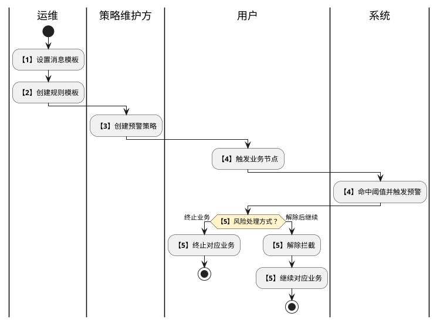
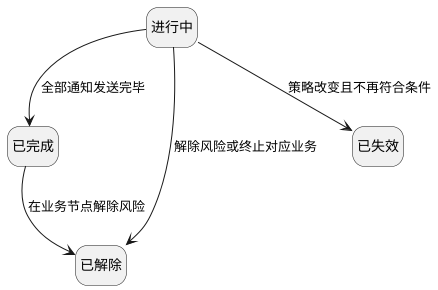

# 第060篇

> 本篇定位：风险预警与解除；主要内容：规则模板、预警策略、通知拦截及解除记录；文档角色：模块档；文档ID：3BBF24E345

共用定义见[运营支撑实体](PRD.高捷物流系统.第061篇.数据字典.7A3D9E1F50.md#doc-7A3D9E1F50-operations-model)、[人事、基础数据、服务商品与风控权限](PRD.高捷物流系统.第062篇.角色与访问权限.5E31456F30.md#doc-5E31456F30-operations-access)。

## 1. 业务范围与协作

本篇列表采用分页，默认每页 50 条记录。

风控中心在业务触发节点计算或校验预设指标，命中策略阈值后通知相关用户，并按配置作风险提示或拦截。消息渠道、接收对象和内容由消息中心模板提供；可将多个指标绑定一个通知，也可将单个指标绑定多个通知。

监控项目是监控业务的集合，项目下按策略类型分类，最多两级；策略由基本信息、预警规则、通知配置和拦截配置构成。规则模板复用指标组合，策略可引用同策略类型的规则模板，或单独设置指标。

| 步骤 | 环节 | 参与方 | 处理与接续 |
| --- | --- | --- | --- |
| 1 | 设置消息模板 | 运维 | 在消息中心设置可用模板，再配置风控规则 |
| 2 | 创建规则模板 | 运维 | 使用已预设指标建立规则组合 |
| 3 | 创建预警策略 | 策略维护方 | 选择监控项目、指标阈值、消息模板及业务节点；客服与运维的职责分工见 OPS-39 |
| 4 | 触发预警 | 用户、系统 | 用户触发业务节点；指标达到阈值后形成预警、通知和风险等级提示 |
| 5 | 处理风险 | 用户 | 按风险决定终止对应业务，或判断可控后解除拦截并继续；具体解除权限见 OPS-39 |

图仅展开命中预警后的处理，不将未命中规则、配置发布或业务后续画成额外已确认路径。步骤 3 的职责冲突和步骤 5 的解除权限需按 OPS-39 确认。

## 2. 规则模板与指标

创建规则模板前，监控项目需要已有可用指标与策略类型；缺少策略类型时先在策略列表维护。模板编号创建后自动生成且系统唯一，模板名称也需唯一。

| 指标类别 | 规则结构 | 阈值口径与示例 |
| --- | --- | --- |
| 单一固定数值 | 指标、比较范围、数值、通知次数 | 例如某客户税金低于 5 万；指定客户可使用客户名称条件与税金条件全部满足 |
| 统计数值 | 指标、比较范围、统计数值、通知次数 | 例如全部客户预存税金低于 1000 万 |
| 统计时间 | 指标、比较范围、小时数、通知次数 | 例如服务单下发后超过指定时间未接单 |
| 统计百分比 | 指标、统计周期、比较范围、百分比、连续满足次数、通知次数 | 例如税金不足率 |
| 指定文本 | 指标、包含或不包含、基础数据表、通知次数 | 例如原产国属于指定列表 |

比较范围支持 `>`、`=`、`<`、`>=`、`<=`、`!=`；指定文本使用 `in/not in`。固定数值与统计数值保留 5 位小数，时间以小时输入并保留 1 位小数，百分比保留 2 位小数。来源未定义舍入方式，不另行补造。

| 满足方式 | 命中条件 | 通知配置归属 |
| --- | --- | --- |
| 全部满足 | 所有条件均满足后触发通知和拦截 | 整组设置一次通知次数和频率 |
| 任意满足 | 任一条件满足即触发通知和拦截 | 每项条件分别设置通知次数和频率 |

同一规则内，相同指标不得重复配置相同阈值；提交时如重复，拒绝保存并提示重复规则或阈值。未完成必填内容时拒绝提交；字段级必填清单存在来源冲突，见 OPS-39。统计百分比中的统计周期与连续满足次数需要一并保留，不可只剩单次阈值。

| 操作 | 条件与结果 |
| --- | --- |
| 创建 | 输入名称、策略类型和条件，增加所需指标后提交 |
| 复制 | 输入新规则名称，将原规则内容复制为新模板 |
| 编辑 | 保存后更新绑定的策略，并可能使正在进行的预警失效；判定范围见 OPS-40 |
| 删除 | 已绑定策略时拒绝，并提示先解绑；未绑定时二次确认后删除 |
| 返回 | 返回模板列表，不将未提交输入视为已保存配置 |

**界面原型概述 · 规则模板列表**

- **区域字段或业务元素**：模板编号、模板名称、策略类型、备注、绑定策略数、最后修改人、最后修改时间、查询、重置、收起、创建、复制、编辑、删除。
- **区域级通用规则**：记录字段只读；查询栏默认展开，重置清空条件，无查询条件点击查询时列表不变。

| 字段或控件特例 | 界面特例或可见反馈 |
| --- | --- |
| 模板名称、备注 | 列表最多显示 15 字，超长时第 15 字替换为省略标记 |
| 创建、编辑 | 新标签页打开对应表单 |
| 复制、删除 | 通过弹窗或确认提示承载 |

**界面原型概述 · 规则表单**

| 字段或控件 | 个别界面约束或可见反馈 |
| --- | --- |
| 规则名称、备注 | 输入约束与原查询文案冲突，见 OPS-41 |
| 策略类型 | 选择模板所属类型 |
| 满足条件 | 选择全部满足或任意满足，并按对应方式展示通知设置 |
| 指标名称 | 从预设的业务指标中单选 |
| 比较范围 | 选择本章定义的比较关系 |
| 数值、时间、百分比、基础数据表 | 随指标类别显示对应输入项，使用本章阈值精度 |
| 统计周期、连续满足次数 | 统计百分比规则使用 |
| 通知频率 | 不重复、每 10 分钟、30 分钟、1 小时、2 小时、3 小时、1 天 |
| 通知次数 | 共 2、3、4、5 次；选择不重复时只通知一次且不需选择次数 |
| 添加指标 | 新增一项指标条件 |
| 提交 | 缺项或重复阈值时显示错误，不保存不完整配置 |

## 3. 预警策略

在策略列表维护监控项目和策略类型；选中树节点后展示该范围内的策略。策略名称唯一且最多 50 个中文字符，备注最多 500 个中文字符。策略通过一个触发节点发起规则校验，每个策略最多关联 5 个消息模板，不限制拦截业务节点的数量。

风险提示只提示存在风险；风险拦截要求手动解除后才可继续相应操作。所选消息模板来自消息中心的风控模板，界面带出接收对象和渠道，不在风控中心重复配置消息内容。

| 操作 | 条件与结果 |
| --- | --- |
| 创建 | 从当前项目与策略类型进入，配置四个组成部分并提交 |
| 复制 | 选择目标监控项目及策略类型，将策略复制到目标分类 |
| 查看、修改 | 查看基本信息、预警规则、通知配置、拦截配置及本策略的预警历史；按模块修改并保存 |
| 禁用或修改 | 可能使进行中的预警失效；被影响预警的识别边界见 OPS-40 |
| 删除 | 二次确认后删除策略，保留预警历史 |

**界面原型概述 · 策略列表**

- **区域字段或业务元素**：查询栏为项目搜索、策略名称、策略状态；结果区为策略名称、策略类型、监控项目、重要程度、规则数量、通知数量、拦截业务数量、策略状态、创建人、最后修改时间；提供创建、复制、删除入口。
- **区域级通用规则**：查询栏默认展开，查询条件由用户选择或输入；结果区只读，无条件点击查询时列表不变，重置清空查询条件。

| 字段或控件特例 | 界面特例或可见反馈 |
| --- | --- |
| 项目搜索、策略名称 | 精确查询 |
| 策略状态 | 单选启用或禁用 |
| 策略名称 | 最多显示 15 字，超长时第 15 字替换为省略标记；点击在新页面打开详情 |
| 重要程度 | 显示高、中、低 |
| 最后修改时间 | 显示至秒 |
| 创建人 | 来源将此项定义为最后保存的用户，名称与含义不一致，见 OPS-39 |

**界面原型概述 · 策略表单与详情**

| 字段或控件 | 个别界面约束或可见反馈 |
| --- | --- |
| 策略名称 | 最多 50 个中文字符，提交校验唯一性 |
| 监控项目、策略类型 | 默认当前列表所在分类，可改选其他项目及其下属类型 |
| 重要程度 | 高、中、低单选，并在用户收到的预警消息中显示 |
| 备注 | 选填，最多 500 个中文字符 |
| 触发节点 | 选择一个发起规则校验的节点 |
| 触发条件 | 默认引用模板，也可选择指标单独设置；引用模板仅限当前策略类型，其条件只读展示 |
| 通知模板 | 支持模糊搜索选择，展示通知对象与渠道，最多添加 5 个 |
| 拦截业务、业务节点 | 支持搜索选择业务及已对接的节点；可添加多个节点 |
| 拦截方式 | 风险提示或风险拦截 |
| 编辑基本信息/规则/通知/拦截配置 | 分别打开对应修改弹窗，保存后更新当前策略 |
| 预警历史 | 展示本策略产生的记录 |
| 提交/保存 | 缺项或重复规则时在结果提示中显示错误；创建/编辑的字段必填冲突见 OPS-39 |

## 4. 预警周期、解除与失效

业务节点达到阈值时开始一次预警周期，系统依配置的频率与次数发送通知。通知次数完成后可再次触发新的周期，不能推定为解除业务拦截。

| 当前状态 | 事件或条件 | 结果 |
| --- | --- | --- |
| 进行中 | 配置的全部通知发送完毕，尚未解除 | 已完成；若业务仍被拦截，拦截继续保留 |
| 进行中 | 用户解除风险或按风险提示终止相应业务 | 已解除，停止后续通知 |
| 已完成 | 用户在对应业务节点解除风险 | 已解除 |
| 进行中 | 策略改变或禁用，重新检查后不再符合触发条件 | 已失效；具体更新范围与拦截处理见 OPS-40 |
| 风险提示周期 | 对应业务节点结束 | 停止后续通知，本次通知周期结束 |
| 已结束的通知周期 | 再次达到触发条件 | 开始新的通知周期；重复触发的归并与去重边界见 OPS-41 |

以下为预警记录的局部迁移图，承接已经触发且处于“进行中”的记录。已完成仍可解除，故不画为业务终点；已解除和已失效后的记录保留与再次触发去重未完整定义，不补画删除或重开路径。

“已完成”只表示通知已发送完毕。来源同时使用“已结束”和“已完成”，统一术语前按 OPS-40 保留名称差异；不把名称归一化当作改变拦截语义的授权。

## 5. 预警历史

预警历史记录触发时间、监控项目、策略类型、触发节点、策略名称、重要程度、状态、实际命中的指标内容及消息接收对象和渠道。历史保留，不随策略删除而删除。

查询条件非空时展示匹配结果；无条件点击查询，当前列表不变。可按勾选数据或查询条件导出 Excel；从策略名称进入详情。

**界面原型概述 · 预警查询栏**

| 字段或控件 | 个别界面约束或可见反馈 |
| --- | --- |
| 发生时间 | 选择起止时间，精确到秒 |
| 监控项目 | 单选项目 |
| 策略类型 | 选择所选项目下的策略类型 |
| 触发节点 | 从已配置策略的触发节点中选择 |
| 策略名称 | 手动输入 |
| 状态 | 进行中、已完成、已解除、已失效 |
| 重置、收起 | 重置清空条件；查询栏默认展开 |
| 导出 | 菜单提供按勾选数据和按查询条件两种方式 |

**界面原型概述 · 预警结果区**

- **区域字段或业务元素**：发生时间、监控项目、策略类型、触发节点、策略名称、重要程度、状态、预警内容、通知对象及渠道。
- **区域级通用规则**：结果只读，策略详情中的历史采用相同口径；只显示实际命中的指标内容，不把未命中指标作为预警内容。

| 字段或控件特例 | 界面特例或可见反馈 |
| --- | --- |
| 策略名称 | 每行最多 15 个中文字符，超出换行 |
| 预警内容 | 多指标换行显示，最多展示 5 项；超过时第 4 项以省略标记代替 |
| 通知对象及渠道 | 多对象分别展示，渠道用逗号分隔；最多 5 项，超过时第 4 项以省略标记代替 |
| 发生时间 | 显示实际规则匹配成功时间，精确到秒 |

## 6. 待确认边界

OPS-39 至 OPS-41 记录策略配置角色、字段必填、通知周期、失效判定和解除资格的未定口径。预设指标的具体目录、统计周期可选范围和源文未给出的去重算法，不在整合中补造。
