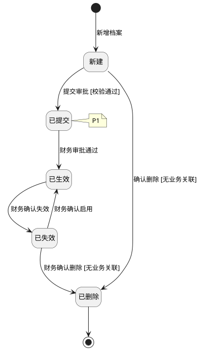
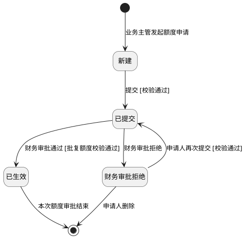

# 第003篇

> 本篇定位：基础信息-合作方档案管理；主要内容：合作方档案、授信额度、审批与启停；文档角色：模块档；文档ID：A9F351FB48

**主流程入口：** 本篇关联[前置准备与服务开通流程](mainflow/PRD.高捷物流系统一期.主流程.02.前置准备与服务开通流程.md#mainflow-02)。

## 1. 基础信息-合作方档案管理

**业务入口：** 合作方档案

**概念模型：** [数据字典 · 合作方与报价实体](PRD.高捷物流系统一期.第034篇.数据字典.7A3D9E1F50.md#doc-7A3D9E1F50-domain-partners-quotes)

### 1.1 合作方档案业务范围、术语与角色

本篇包含供应商档案、客户档案和客户授信额度三个业务范围，三个范围共用合作方主数据和审批规则。

#### 1.1.1 合作方档案覆盖范围

合作方档案覆盖供应商管理、客户管理和客户授信额度管理。业务部门和财务部门共同使用该模块，完成供应商与客户的新增、维护和审批，以及授信额度的申请与审批。

#### 1.1.2 业务入口与操作

| 菜单入口 | 业务对象 | 可执行操作 |
| --- | --- | --- |
| 我的合作伙伴 → 我的供应商 | 供应商主数据 | 新增、编辑、删除、失效、生效、提交审批、审批 |
| 我的合作伙伴 → 我的客户 | 客户主数据 | 新增、编辑、删除、失效、生效、提交审批、审批 |
| 我的合作伙伴 → 我的客户 | 客户授信额度 | 额度申请、额度审批 |

#### 1.1.3 合作方与授信字段

供应商、客户和授信额度的跨场景稳定属性、关系与受控取值见[数据字典 · 合作方与报价实体](PRD.高捷物流系统一期.第034篇.数据字典.7A3D9E1F50.md#doc-7A3D9E1F50-domain-partners-quotes)；各页面使用的字段组合、必填和编辑规则以本篇对应场景为准。

#### 1.1.4 参与角色与职责

| 用户角色 | 描述 |
| --- | --- |
| 业务 | 申请新增客户、新增供应商 |
| 业务主管 | 客户额度申请 |
| 财务 | 客户新增、供应商新增审批；客户额度审批。 |

### 1.2 合作方档案与客户额度维护规则

**合作方档案状态图（确定迁移片段）**

本图适用于单个组织下的一份供应商或客户档案，不表示客户额度申请的状态。

来源：[供应商新增与审批规则](#doc-A9F351FB48-section-ec3c26d0c295)、[客户新增与审批规则](#doc-A9F351FB48-section-ce358c60ac22)，以及对应的[供应商删除](#doc-A9F351FB48-section-9750bc0139b1)、[失效](#doc-A9F351FB48-section-ba66f569f79b)、[启用](#doc-A9F351FB48-section-f9db6de7db5b)和[客户删除](#doc-A9F351FB48-section-de01f85643db)、[失效](#doc-A9F351FB48-section-55a1104c2679)、[启用](#doc-A9F351FB48-section-97b8cd8458d2)规则。无业务关联指该部门下无关联订单和订单成本结算明细；删除限制仍按各删除场景执行。

P1：审批拒绝后的档案主状态存在“新建＋审批拒绝”和“财务审批拒绝”两种表述，因此图中不连接拒绝后的目标状态；这不表示禁止拒绝、编辑、删除或重新提交。冲突见[供应商审批拒绝](#doc-A9F351FB48-section-fd371add3827)、[客户审批拒绝](#doc-A9F351FB48-section-c03a906650fa)与各自新增审批规则，待确认事项见[PRD自洽性问题](../analysis/PRD自洽性问题.md)。

#### 1.2.1 供应商列表页面

供应商列表页面，业务/财务可搜索查看所有状态的供应商。可进行供应商新增、供应商查看、供应商编辑、供应商删除、供应商提交审批、供应商失效、供应商生效、供应商审批。

**操作与反馈**
- 我的客户：跳转“客户列表”界面。

- 查询：未设置查询条件时查询全部记录；设置条件后展示匹配记录。查询出的数据，按照“供应商编码”顺序排列。

- 重置：重置所有查询条件。

- 新增供应商：跳转“供应商维护”界面。

- 查看：跳转“供应商查询”界面。

- 编辑：跳转“供应商维护”界面。

- 删除：弹出“删除确认”弹框。“新建”、“已失效”状态的供应商数据，才有该操作按钮。

- 提交：弹出“提交确认”弹框。

- 失效：弹出“失效确认”弹框。

- 启用：弹出“启用确认”弹框。

- 审批：跳转“供应商审批”界面。

**界面原型概述 · 供应商列表查询栏**

- **区域字段或业务元素**：供应商编码、供应商名称、营业期限、是否已签合同、账期、税率、状态、创建部门、更新人、更新日期从、更新日期至。
- **区域级通用规则**：查询条件均选填。

| 字段或控件特例 | 特例约束或业务结果 |
| --- | --- |
| 供应商编码 | 填写供应商编码，支持模糊查询；无预设值。 |
| 供应商名称 | 填写供应商名称，支持模糊查询；无预设值。 |
| 营业期限 | 可选值：已到期、未到期；默认全部；选择已到期，只展示营业期限在系统日期之前的供应商数据；选择未到期，只展示营业期限在系统日期之后的供应商数据；有默认值。 |
| 是否已签合同 | 可选值：是、否；默认全部；无预设值。 |
| 账期 | 无预设值。 |
| 税率 | 默认全部；有默认值。 |
| 状态 | 默认全部。可选值：新建、已提交、已生效、已失效；有默认值。 |
| 创建部门 | 只能选择到当前用户对应公司下的部门；无预设值。 |
| 更新人 | 填写更新人，支持模糊查询；无预设值。 |
| 更新日期从、更新日期至 | 按时间范围选择，不选择默认全部；有默认值。 |

（4）供应商列表栏字段

每页显示10条

**界面原型概述 · 供应商列表栏**

- **区域字段或业务元素**：供应商编码、供应商名称、统一社会信用码、公司地址、营业期限、是否已签合同、账期(天)、税率、状态、创建部门、更新人、更新日期。
- **区域级通用规则**：字段均只读；按查询条件展示匹配记录；未设置查询条件时展示全部记录。

#### 1.2.2 供应商查询明细页面

供应商查询界面，选择需要查看供应商信息的数据，点击“查看”按钮，跳转至“供应商查询”页面。

**操作与反馈**
- 返回：返回“供应商列表”页面。

- 操作记录：弹出“操作记录”弹框。

**界面原型概述 · 供应商详情基本信息**

- **区域字段或业务元素**：境内外关系、统一社会信用码、中文名称、简称、公司地址、营业期限、供应商编码、合作方类别。
- **区域级通用规则**：字段均只读；回显所选供应商。

**界面原型概述 · 供应商详情业务信息**

- **区域字段或业务元素**：税率(%)、销售、是否已签合同、账期(天)、发票抬头、归档、对应客服、公司电话、公司传真、公司网站。
- **区域级通用规则**：字段均只读；回显所选供应商。

**界面原型概述 · 供应商详情银行账号**

- **区域字段或业务元素**：银行名称、开户行名称、账户名称、银行账号。
- **区域级通用规则**：字段均只读；回显所选供应商。

**界面原型概述 · 供应商详情联系人**

- **区域字段或业务元素**：联系人类型、联系人姓名、联系人电话、联系人传真、联系人移动电话、联系人电子邮箱、备注。
- **区域级通用规则**：字段均只读；回显所选供应商。

**界面原型概述 · 供应商详情邮箱收件人**

- **区域字段或业务元素**：类型、姓名、岗位、电子邮箱、备注。
- **区域级通用规则**：字段均只读；回显所选供应商。

#### 1.2.3 供应商查询操作记录页面

“供应商查询”页面，点击“操作记录”跳出“操作记录”弹框。按照操作日期倒序排列。

**操作与反馈**
- “X”：返回“供应商查询明细”页面。

**界面原型概述 · 供应商操作记录**

- **区域字段或业务元素**：操作人、操作日期、动作、备注。
- **区域级通用规则**：字段均只读。

| 字段或控件特例 | 特例约束或业务结果 |
| --- | --- |
| 操作人 | 根据查询记录自动带出。 |
| 操作日期 | 根据查询记录自动带出，记录按照操作日期倒序排列。 |
| 动作 | 根据查询记录自动带出；包括：已提交、审批拒绝、审批通过、失效、生效。 |
| 备注 | 根据查询记录自动带出；审批拒绝/审批通过的备注为审批人填写的审批；已提交默认为“供应商新建提交”。 |

#### 1.2.4 供应商新增维护页面

供应商列表界面，点击“新增供应商”按钮，跳转至“供应商新增维护”页面。

**操作与反馈**
- 附件上传：可点击查看，可上传附件，必须上传。

- (银行账户信息)新增：在银行账户栏新增一行银行账户信息。

- (银行账户信息)删除：删除该用户账户。

- (联系人信息)新增：在联系人栏新增一行联系人信息。

- (联系人信息)删除：删除该联系人。

- (邮箱收件人信息)新增：在邮箱收件人新增栏新增一行邮箱收件人。

- (邮箱收件人信息)删除：删除该邮箱收件人。

- 保存：保存该供应商，校验必填字段。保存成功自动生成供应商编码。规则：“S+5位流水”，不改变该供应商的状态。字段定义见 [数据字典 · 供应商金蝶编码映射](PRD.高捷物流系统一期.第034篇.数据字典.7A3D9E1F50.md#doc-7A3D9E1F50-mappings-mapping-partner-kingdee-code)。

- 提交：提交审批。先进行保存后进行提交。保存时校验必填字段，自动生成供应商编码。提交后，该供应商状态变为“已提交”，只有新建状态的供应商有该操作按钮。

- 取消：取消编辑供应商，返回供应商列表页面。

**界面原型概述 · 供应商新增基本信息**

- **区域字段或业务元素**：境内外关系、统一社会信用码、中文名称、简称、公司地址、营业期限、供应商编码、合作方类别。
- **区域级通用规则**：除所列特例外，字段均可编辑。

| 字段或控件特例 | 特例约束或业务结果 |
| --- | --- |
| 境内外关系 | 可选值：境内机构、境外机构；必填；无预设值。 |
| 统一社会信用码 | 在境内外关系为“境内机构”时，统一社会信用码必填，18位；输入统一社会信用码，自动匹配合作方档案中的数据，若表中存在相同的统一社会信用码，有则带出供应商全部信息（默认带最近的一次新增记录），允许修改；选填；无预设值。 |
| 中文名称 | 若统一社会信用码在合作方已匹配到，自动带出供应商名称，允许修改；手工录入；必填；无预设值。 |
| 简称 | 若统一社会信用码在合作方已匹配到，自动带出供应商简称，允许修改；手工录入；必填；无预设值。 |
| 公司地址 | 若统一社会信用码在合作方已匹配到，自动带出公司地址，允许修改；国家为“中国”时，省、市必填，当国家非“中国”时，省、市非必填；区信息非必填；详细地址必填；必填；无预设值。 |
| 营业期限 | 若统一社会信用码在合作方已匹配到，自动带出营业期限，允许修改；若勾选了“长期”，则营业期限为“长期”，选择“长期”时日期不可填写；手工录入；必填；无预设值。 |
| 供应商编码 | 保存后自动生成；只读。 |
| 合作方类别 | 若统一社会信用码在合作方已匹配到，自动带出合作方类别，允许手工选择修改；选择（集团内部机构/外部单位）；保存校验见[合作方档案业务规则](PRD.高捷物流系统一期.第003篇.基础信息-合作方档案管理.A9F351FB48.md#doc-A9F351FB48-section-ec3c26d0c295)；必填；无预设值。 |

**界面原型概述 · 供应商新增业务信息**

- **区域字段或业务元素**：税率(%)、销售、是否已签合同、账期、发票抬头、归档、对应客服、公司网站、公司电话、公司传真。
- **区域级通用规则**：统一社会信用码匹配已有合作方时带出对应字段；未匹配时无预设值。字段均可编辑。

| 字段或控件特例 | 特例约束或业务结果 |
| --- | --- |
| 税率(%) | 可选值：0、1、3、6、9、11；必填。 |
| 销售 | 必填。 |
| 是否已签合同 | 可选值：是/否；必填。 |
| 账期 | 必填。 |
| 发票抬头 | 手工录入；选填。 |
| 归档 | 选填。 |
| 对应客服 | 选填。 |
| 公司网站 | 选填。 |
| 公司电话 | 选填。 |
| 公司传真 | 选填。 |

（5）银行账号信息

点击银行信息栏的“新增”，在银行账号信息下新增一行。

**界面原型概述 · 供应商新增银行账号**

- **区域字段或业务元素**：银行名称、开户行名称、账户名称、银行账号。
- **区域级通用规则**：字段均选填、无预设值、可编辑；可手工录入。

| 字段或控件特例 | 特例约束或业务结果 |
| --- | --- |
| 银行名称、开户行名称、账户名称 | 匹配带出规则见[供应商新增与审批规则](PRD.高捷物流系统一期.第003篇.基础信息-合作方档案管理.A9F351FB48.md#doc-A9F351FB48-section-ec3c26d0c295)。 |
| 银行账号 | 匹配带出与唯一性校验见[供应商新增与审批规则](PRD.高捷物流系统一期.第003篇.基础信息-合作方档案管理.A9F351FB48.md#doc-A9F351FB48-section-ec3c26d0c295)。 |

（6）联系人信息

点击联系人信息栏的“新增”，在联系人信息下新增一行。

**界面原型概述 · 供应商新增联系人**

- **区域字段或业务元素**：联系人类型、联系人姓名、联系人电话、联系人传真、联系人移动电话、联系人电子邮箱、备注。
- **区域级通用规则**：统一社会信用码匹配已有合作方时带出对应字段；未匹配时无预设值。字段均可编辑。

| 字段或控件特例 | 特例约束或业务结果 |
| --- | --- |
| 联系人类型 | 可选值：法人、财务联系人、操作联系人；必填。 |
| 联系人姓名 | 必填。 |
| 联系人电话 | 长度限制：11 个字符；必填。 |
| 联系人传真 | 选填。 |
| 联系人移动电话 | 长度限制：11 个字符；必填。 |
| 联系人电子邮箱 | 必填。 |
| 备注 | 选填。 |

**界面原型概述 · 供应商新增邮箱收件人**

- **区域字段或业务元素**：类型、姓名、岗位、电子邮箱、备注。
- **区域级通用规则**：字段均无预设值、可编辑。

| 字段或控件特例 | 特例约束或业务结果 |
| --- | --- |
| 类型 | 可选值：业务、财务；必填。 |
| 姓名 | 若统一社会信用码在合作方已匹配到，自动带出姓名，允许修改；选填。 |
| 岗位 | 若统一社会信用码在合作方已匹配到，自动带出岗位，允许修改；选填。 |
| 电子邮箱 | 若统一社会信用码在合作方已匹配到，自动带出电子邮箱，允许修改；必填。 |
| 备注 | 若统一社会信用码在合作方已匹配到，自动带出备注，允许修改；选填。 |

#### 1.2.5 供应商新增保存页面

供应商新增维护页面，点击“保存”按钮，弹出“保存确认”弹框。

**操作与反馈**
- 确认：确定保存该供应商新增申请。保存时校验必填字段是否填写，若必填字段未填写，无法保存；同时校验该供应商的统一社会信用码或供应商中文名称，在该组织下是否存在相同的且状态非“已删除”状态的数据，若存在，也无法保存成功。保存完成后，返回供应商列表页面。根据该编辑操作人员，自动更新该供应商的更新人和更新日期，其中更新日期为保存时的系统日期。

- 取消：取消保存操作，返回供应商新增维护页面。

#### 1.2.6 供应商新增提交页面

供应商新增维护页面，点击“提交”按钮，弹出“提交确认”弹框。

**操作与反馈**
- 确认：确定保存并提交该供应商新增申请。保存时校验必填字段是否填写，若必填字段未填写，无法保存；同时校验该供应商的统一社会信用码或供应商中文名称，在该组织下是否存在相同的且状态非“已删除”状态的数据，若存在，也无法保存成功。保存完成后，根据该编辑操作人员，自动更新该行的更新人和更新日期，其中更新日期为保存时的系统日期，同时该供应商状态变为“已提交”，等待财务审批。

- 取消：取消保存操作，返回供应商新增维护页面。

#### 1.2.7 供应商编辑页面

供应商列表界面，点击“编辑”按钮，跳转至“供应商维护”页面。新建、已生效状态的供应商才有“编辑”功能。已提交、已失效状态的供应商没有“编辑”功能。

**操作与反馈**
- 附件上传：可点击查看，可上传附件，必须上传。

- (银行账户信息)新增：在银行账户栏新增一行银行账户信息。

- (银行账户信息)删除：删除该用户账户。

- (联系人信息)新增：在联系人栏新增一行联系人信息。

- (联系人信息)删除：删除该联系人。

- (邮箱收件人信息)新增：在邮箱收件人新增栏新增一行邮箱收件人。

- (邮箱收件人信息)删除：删除该邮箱收件人。

- 保存：保存该供应商，校验必填字段。保存成功自动生成供应商编码。规则：“组织编码+编码”，不改变该供应商的状态。

- 提交：提交审批。新建状态的才有提交按钮，已提交状态的无提交按钮。先进行保存后进行提交。保存时校验必填字段，自动生成供应商编码。提交后，该供应商状态变为“已提交”，只有新建状态的供应商有该状态。

- 取消：取消新增供应商，返回供应商列表页面。

**界面原型概述 · 供应商编辑基本信息**

- **区域字段或业务元素**：境内外关系、统一社会信用码、中文名称、简称、公司地址、营业期限、供应商编码、合作方类别。
- **区域级通用规则**：字段均只读；根据编辑的供应商，自动带出，不允许修改。

**界面原型概述 · 供应商编辑业务信息**

- **区域字段或业务元素**：税率(%)、销售、是否已签合同、账期、发票抬头、归档、对应客服、公司网站、公司电话、公司传真。
- **区域级通用规则**：字段均有默认值、可编辑。

| 字段或控件特例 | 特例约束或业务结果 |
| --- | --- |
| 税率(%) | 根据编辑的供应商，自动带出；允许选择修改，可选值：0、1、3、6、9、11；必填。 |
| 销售 | 根据编辑的供应商，自动带出，允许修改；必填。 |
| 是否已签合同 | 根据编辑的供应商，自动带出，允许选择修改，可选值：是/否；必填。 |
| 账期 | 根据编辑的供应商，自动带出，允许手工录入修改；必填。 |
| 发票抬头 | 根据编辑的供应商，自动带出；允许手工录入修改；选填。 |
| 归档、对应客服、公司网站、公司电话、公司传真 | 根据编辑的供应商，自动带出，允许修改；选填。 |

（5）银行账号信息

银行信息保存后，在银行信息栏操作中有“保存”和“删除”操作按钮。允许新增银行信息。保存时校验该供应商在该组织下是否存在相同的银行账户，进行数据重复性校验。

**界面原型概述 · 供应商编辑银行账号**

- **区域字段或业务元素**：银行名称、开户行名称、账户名称、银行账号。
- **区域级通用规则**：字段均选填、有默认值、可编辑；根据编辑的供应商自动带出，允许修改。

| 字段或控件特例 | 特例约束或业务结果 |
| --- | --- |
| 银行账号 | 唯一性校验见[供应商编辑维护页面](PRD.高捷物流系统一期.第003篇.基础信息-合作方档案管理.A9F351FB48.md#doc-A9F351FB48-section-e57dbc5f0fb1)。 |

（6）联系人信息

联系人信息保存后，在联系人信息栏操作中有“保存”和“删除”操作按钮。允许新增联系人信息。保存时校验该联系人在该组织下是否存在相同的“联系人类型”、“联系人姓名”、“联系人电话”、“联系人移动电话”和“联系人电子邮箱”，进行数据重复性校验。

**界面原型概述 · 供应商编辑联系人**

- **区域字段或业务元素**：联系人类型、联系人姓名、联系人电话、联系人传真、联系人移动电话、联系人电子邮箱、备注。
- **区域级通用规则**：字段均无预设值、可编辑；根据编辑的供应商，自动带出，允许修改。

| 字段或控件特例 | 特例约束或业务结果 |
| --- | --- |
| 联系人类型、联系人姓名、联系人电子邮箱 | 必填。 |
| 联系人电话、联系人移动电话 | 长度限制：11 个字符；必填。 |
| 联系人传真、备注 | 选填。 |

（7）邮箱收件人信息

邮箱收件人信息保存后，在邮箱操作人信息栏操作中有“保存”和“删除”操作按钮。允许新增邮箱收件人信息。保存时校验该收件人在该组织下是否存在相同的“类型”和“电子邮箱”，进行数据重复性校验。

**界面原型概述 · 供应商编辑邮箱收件人**

- **区域字段或业务元素**：类型、姓名、岗位、电子邮箱、备注。
- **区域级通用规则**：除所列特例外，字段均无预设值、可编辑；根据编辑的供应商，自动带出，允许修改。

| 字段或控件特例 | 特例约束或业务结果 |
| --- | --- |
| 类型 | 根据编辑的供应商，自动带出，允许选择修改；可选值：财务/业务；必填。 |
| 姓名、岗位、备注 | 选填。 |
| 电子邮箱 | 必填。 |

#### 1.2.8 供应商编辑保存页面

供应商编辑维护页面，点击“保存”按钮，弹出“保存确认”弹框。

**操作与反馈**
- 确认：确定保存该供应商的编辑内容。保存时校验必填字段是否填写，若必填字段未填写，无法保存；同时校验该供应商的统一社会信用码或供应商中文名称，在该组织下是否存在相同的且状态非“已删除”状态的数据，若存在，也无法保存成功。保存完成后，返回供应商列表页面。根据该编辑操作人员，自动更新该行的更新人和更新日期，其中更新日期为保存时的系统日期。

- 取消：取消保存操作，返回供应商编辑维护页面。

#### 1.2.9 供应商编辑提交页面

供应商编辑维护页面，点击“提交”按钮，弹出“提交确认”弹框。已生效状态的供应商，没有“提交”按钮。

**操作与反馈**
- 确认：确定保存并提交该供应商变更申请。保存时校验必填字段是否填写，若必填字段未填写，无法保存；同时校验该供应商的统一社会信用码或供应商中文名称，在该组织下是否存在相同的且状态非“已删除”状态的数据，若存在，也无法保存成功。保存完成后，根据该编辑操作人员，自动更新该行的更新人和更新日期，其中更新日期为保存时的系统日期，同时该供应商状态变为“已提交”，等待财务审批。

- 取消：取消提交操作，返回供应商编辑维护页面。

#### 1.2.10 供应商删除页面

供应商列表界面，点击“删除”按钮，弹出“删除确认”弹框。新建、已失效状态的供应商才有“删除”功能。只要该供应商有下过订单、有结算明细，就无法删除。

**操作与反馈**
- 确认：确认删除。新建状态的供应商可以直接删除，已失效的供应商，财务可以进行删除操作，进行删除时需校验该供应商是否有业务发生，若有业务发生（该供应商在该部门下有订单关联或有订单成本的结算明细中有对应的结算明细行），则无法删除，保存时提醒无法删除。

- 取消：取消该删除供应商操作，返回供应商列表页面。

#### 1.2.11 供应商提交审批页面

供应商列表界面，点击“提交”按钮，弹出“提交确认”弹框。新建状态的供应商才有“提交”功能。

**操作与反馈**
- 确认：确认提交。该供应商申请提交给财务审批，供应商状态变为“已提交”

- 取消：取消该提交操作，返回供应商列表页面。

#### 1.2.12 供应商审批页面

供应商列表界面，点击“审批”按钮，跳转“供应商审批页面”界面。已提交状态的供应商才有“审批”功能。

**操作与反馈**
- 审批通过：弹出“审批通过确认”弹框。

- 审批拒绝：弹出“审批拒绝确认”弹框。

- 返回：返回供应商列表页面。

（3）供应商基本信息说明

基本字段

**界面原型概述 · 供应商审批基本信息**

- **区域字段或业务元素**：境内外关系、统一社会信用码、中文名称、简称、公司地址、营业期限、供应商编码、合作方类别。
- **区域级通用规则**：字段均只读；回显待审批供应商。

审批意见

**界面原型概述 · 供应商审批意见**

- **区域字段或业务元素**：审批备注。

| 字段或控件特例 | 特例约束或业务结果 |
| --- | --- |
| 审批备注 | 仅审批时，有该字段；选填；无预设值；可编辑。 |

**界面原型概述 · 供应商审批业务信息**

- **区域字段或业务元素**：税率(%)、销售、是否已签合同、账期、发票抬头、归档、对应客服、公司网站、公司电话、公司传真。
- **区域级通用规则**：字段均只读；回显待审批供应商。

**界面原型概述 · 供应商审批银行账号**

- **区域字段或业务元素**：银行名称、开户行名称、账户名称、银行账号。
- **区域级通用规则**：字段均只读；回显待审批供应商。

**界面原型概述 · 供应商审批联系人**

- **区域字段或业务元素**：联系人类型、联系人姓名、联系人电话、联系人传真、联系人移动电话、联系人电子邮箱、备注。
- **区域级通用规则**：字段均只读；回显待审批供应商。

**界面原型概述 · 供应商审批邮箱收件人**

- **区域字段或业务元素**：类型、姓名、岗位、电子邮箱、备注。
- **区域级通用规则**：字段均只读；回显待审批供应商。

#### 1.2.13 供应商审批通过

供应商审批页面，点击“审批通过”按钮，弹出“审批通过确认”弹框。

**操作与反馈**
- 确认：确认通过该供应商新建申请，通过后，该供应商的状态变为“已生效”。

- 取消：取消该审批操作，返回供应商审批页面。

#### 1.2.14 供应商审批拒绝

供应商审批页面，点击“审批拒绝”按钮，弹出“审批拒绝确认”弹框。

**操作与反馈**
- 确认：确认拒绝该供应商新建申请，审批拒绝后，申请人可继续对该供应商进行编辑、删除、提交操作。该供应商的状态变为“新建”，审批状态为“审批拒绝”。

- 取消：取消该审批操作，返回供应商审批页面。

#### 1.2.15 供应商失效页面

供应商列表界面，财务点击“失效”按钮，弹出“失效确认”弹框。已生效状态的供应商才有“失效”功能。

**操作与反馈**
- 确认：确认失效该供应商，该供应商无法继续被业务单据查看选取到。失效完成后，该供应商状态变为“已失效”

- 取消：取消该失效操作，返回供应商列表页面。

#### 1.2.16 供应商启用页面

供应商列表界面，财务点击“启用”按钮，弹出“启用确认”弹框。已失效状态的供应商才有“启用”功能。

**操作与反馈**
- 确认：确认启用该供应商，该供应商可以被业务单据查看选取到。启用完成后，该供应商状态变为“已生效”

- 取消：取消该启用操作，返回供应商列表页面。

#### 1.2.17 供应商新增与审批规则

**场景：** 基本信息管理-供应商新增

**范围：** 填写供应商基本信息，银行账号信息，联系人信息，邮箱收件人信息，上传附件，完成供应商的新增

**参与角色：** 业务/财务

**触发与入口：** 进入我的合作伙伴->我的供应商，进入我的供应商列表，点击“新增供应商”按钮，进入此页面

**业务结果：** 校验通过后保存供应商信息；提交后进入财务审批，审批通过后供应商状态变为“已生效”。校验失败时不保存并提示原因。

**处理规则**

进入“我的供应商”页面，点击新增进入供应商维护界面，填写供应商基本信息、银行账号信息、联系人信息、邮箱收件人信息。

**一、供应商基本信息**

**境内外关系**

- 从候选项中选择（境内机构/境外机构）。

- 未保存前，可重新录入修改，修改境内外关系后统一社会信用码置空。

**统一社会信用码**

- 手工录入，精确匹配已存在的合作方信息（客户、供应商）

- 未保存前，可重新录入修改。

- 保存时，校验统一社会信用码在该组织的供应商信息中，是否存在相同的记录，有则无法保存成功。

**中文名称**

- 根据统一社会信用码匹配已有的合作方，若有相同的统一信用码数据，则自动带出中文名称，不允许修改。

- 未保存前，可重新手工录入修改。

- 保存时，校验供应商中文名称在该组织的供应商信息中，是否存在相同的记录，有则无法保存成功。

**简称**

- 根据统一社会信用码匹配已有的合作方，若有相同的统一信用码数据，则自动带出简称，不允许修改。

- 未保存前，可重新手工录入修改。

**公司地址**

- 根据统一社会信用码匹配已有的合作方，若有相同的统一信用码数据，则自动带出公司地址，不允许修改。

未保存前，可重新手工录入修改。若公司为中国，则省、市必填，若公司非“中国”，则省、市置灰，无法填写。详细地址必填、区非必填。

**营业期限**

- 根据统一社会信用码匹配已有的合作方，若有相同的统一信用码数据，则自动带出营业期限，不允许修改。

- 未保存前，可重新手工录入修改。若选择长期，则默认营业期限为“长期”；若未勾选营业期限，则营业期限必填，日期格式。

**合作方类别**

- 根据统一社会信用码匹配已有的合作方，若有相同的统一信用码数据，则自动带出合作方类别，不允许修改。

- 未保存前，可重新从候选项中选择修改。选项：集团内部机构/外部单位，保存时需要校验在组织架构中是否存在。

**附件**

- 根据统一社会信用码匹配已有的合作方，若有相同的统一信用码数据，则自动带出附件，不允许修改。

- 未保存前，可重新上传修改。

**二、业务信息**

**税率(%)**

- 根据统一社会信用码匹配已有的合作方，若有相同的统一信用码数据，则自动带出税率。

- 未保存前，可重新通过候选项修改。

**销售**

- 根据统一社会信用码匹配已有的合作方，若有相同的统一信用码数据，则自动带出销售。

- 未保存前，可重新手工录入修改。

**是否签订合同**

- 根据统一社会信用码匹配已有的合作方，若有相同的统一信用码数据，则自动带出是否签订合同。

- 未保存前，可重新通过候选项修改(从候选项中选择：是/否)。

**账期(天)**

- 根据统一社会信用码匹配已有的合作方，若有相同的统一信用码数据，则自动带出账期(天)。

- 未保存前，可重新手工录入修改

**发票抬头**

- 根据统一社会信用码匹配已有的合作方，若有相同的统一信用码数据，则自动带出发票抬头。

- 未保存前，可重新手工录入修改。

**归档**

- 根据统一社会信用码匹配已有的合作方，若有相同的统一信用码数据，则自动带出归档人。

- 未保存前，可重新手工录入修改。

**对应客服**

- 根据统一社会信用码匹配已有的合作方，若有相同的统一信用码数据，则自动带出对应客服。

- 未保存前，可重新手工录入修改。

**公司网站**

- 根据统一社会信用码匹配已有的合作方，若有相同的统一信用码数据，则自动带出对应公司网站。

- 未保存前，可重新手工录入修改。

**公司电话**

- 根据统一社会信用码匹配已有的合作方，若有相同的统一信用码数据，则自动带出对应公司电话。

- 未保存前，可重新手工录入修改。

**公司传真**

- 根据统一社会信用码匹配已有的合作方，若有相同的统一信用码数据，则自动带出对应公司传真。

- 未保存前，可重新手工录入修改。

**三、银行账号信息**

**银行名称**

- 根据统一社会信用码匹配已有的合作方，若有相同的统一信用码数据，则自动带出银行名称。

- 未保存前，可重新手工录入修改。

**开户行名称**

- 根据统一社会信用码匹配已有的合作方，若有相同的统一信用码数据，则自动带出开户行名称。

- 未保存前，可重新手工录入修改。

**账户名称**

- 根据统一社会信用码匹配已有的合作方，若有相同的统一信用码数据，则自动带出账户名称。

- 未保存前，可重新手工录入修改。

**银行账号**

- 根据统一社会信用码匹配已有的合作方，若有相同的统一信用码数据，则自动带出银行账号。

- 未保存前，可重新手工录入修改。

点击“新增”，银行账号信息栏下方新增一条记录。

点击“删除”，可删除该选择行的银行账号信息。

**四、联系人信息**

**联系人类型**

- 根据统一社会信用码匹配已有的合作方，若有相同的统一信用码数据，则自动带出联系人类型。

- 未保存前，可重新从候选项中选择录入修改（选项：法人、财务联系人、操作联系人）。

**联系人姓名**

- 根据统一社会信用码匹配已有的合作方，若有相同的统一信用码数据，则自动带出联系人姓名。

- 未保存前，可重新手工录入修改。

**联系人电话**

- 根据统一社会信用码匹配已有的合作方，若有相同的统一信用码数据，则自动带出联系人电话。

- 未保存前，可重新手工录入修改。

**联系人传真**

- 根据统一社会信用码匹配已有的合作方，若有相同的统一信用码数据，则自动带出联系人传真。

- 未保存前，可重新手工录入修改。

**联系人移动电话**

- 根据统一社会信用码匹配已有的合作方，若有相同的统一信用码数据，则自动带出联系人移动电话。

- 未保存前，可重新手工录入修改。

**联系人电子邮箱**

- 根据统一社会信用码匹配已有的合作方，若有相同的统一信用码数据，则自动带出联系人电子邮箱。

- 未保存前，可重新手工录入修改。

**备注**

- 根据统一社会信用码匹配已有的合作方，若有相同的统一信用码数据，则自动带出备注。

- 未保存前，可重新手工录入修改。

点击“新增”，联系人信息栏下方新增一条记录。

点击“删除”，可删除该选择行的联系人信息。

**五、邮箱收件人信息**

**类型**

- 根据统一社会信用码匹配已有的合作方，若有相同的统一信用码数据，则自动带出类型。

- 未保存前，可重新从候选项中选择修改，选项（业务/财务）。

**姓名**

- 根据统一社会信用码匹配已有的合作方，若有相同的统一信用码数据，则自动带出姓名。

- 未保存前，可重新手工录入修改。

**岗位**

- 根据统一社会信用码匹配已有的合作方，若有相同的统一信用码数据，则自动带出岗位。

- 未保存前，可重新手工录入修改。

**电子邮箱**

- 根据统一社会信用码匹配已有的合作方，若有相同的统一信用码数据，则自动带出电子邮箱。

- 未保存前，可重新手工录入修改。

**备注**

- 根据统一社会信用码匹配已有的合作方，若有相同的统一信用码数据，则自动带出备注。

- 未保存前，可重新手工录入修改。

保存时，需进行校验：

1. 必填信息是否填写完毕，若有未填写部分，则无法保存成功

2. 统一社会信用码或供应商中文名称，在该组织下是否存在相同的记录，有则无法保存。

**业务分支**

供应商信息填写完成后，点击“提交”，提交给财务审批

- 提交后，该行数据状态变为“已提交”，无法继续对该供应商数据进行编辑。

财务审批，财务在业务员提交审批的供应商申请上进行审批

- 财务审批通过，该行数据状态变为“已生效”。

- 财务审批拒绝，该行数据状态变为“财务审批拒绝”，需给对应申请人发送消息提醒。申请人可在审批拒绝的单据上继续编辑、删除和提交。

**适用范围与约束**

提交审批和审批拒绝后的通知按[消息推送规则](PRD.高捷物流系统一期.第030篇.消息推送.5F950AB3B1.md#doc-5F950AB3B1-section-ef4930471a81)发送。

**关联处理**

1. 我的客户

- 合作方类别保存校验：保存时，需校验该供应商名称是否存在组织架构内；若存在，则合作方类别需为“集团内部机构”；若不存在，则需为“外部单位”。

#### 1.2.18 客户列表页面

客户列表页面，业务/财务可搜索查看所有状态的客户。可进行客户新增、客户查看、客户编辑、客户删除、客户提交审批、客户失效、客户生效、客户审批；客户授信额度申请、客户授信额度审批。客户授信额度申请由业务主管发起，财务进行审批。

**操作与反馈**
- 我的供应商：跳转“供应商列表”界面。

- 查询：未设置查询条件时查询全部记录；设置条件后展示匹配记录。查询出的数据，按照“客户编码”顺序排列。

- 重置：重置所有查询条件。

- 新增客户：跳转“客户维护”界面。

- 额度申请：跳转“额度申请”界面，只有已生效状态的客户才有该操作按钮，且该操作按钮只有业务主管才有。

- 额度审批：只有已提交授信额度申请的客户才有该操作按钮，且该操作按钮只有财务才有。

- 查看：跳转“客户查询”界面。

- 编辑：跳转“客户维护”界面。

- 删除：弹出“删除确认”弹框。“新建”、“已失效”状态的客户数据，才有该操作按钮。

- 提交：弹出“提交确认”弹框。

- 失效：弹出“失效确认”弹框。

- 启用：弹出“启用确认”弹框。

- 审批：跳转“客户审批”界面。

**界面原型概述 · 客户列表查询栏**

- **区域字段或业务元素**：客户编码从、客户编码至、客户名称、营业期限、是否已签合同、授信额度从、授信额度至、账期(天)、税率、状态、创建部门、更新人、创建日期从、创建日期至、额度审批。
- **区域级通用规则**：除所列特例外，查询条件均选填、无预设值。

| 字段或控件特例 | 特例约束或业务结果 |
| --- | --- |
| 客户编码从、客户编码至 | 填写客户编码，范围查询。 |
| 客户名称 | 填写客户名称，支持模糊查询。 |
| 营业期限 | 可选值：已到期、未到期；默认全部；选择已到期，只展示营业期限在系统日期之前的客户数据；选择未到期，只展示营业期限在系统日期之后的客户数据；有默认值。 |
| 是否已签合同 | 可选值：是、否；默认全部。 |
| 授信额度从、授信额度至 | 填写授信额度，范围查询。 |
| 税率 | 默认全部。 |
| 状态 | 默认全部。可选值：新建、已提交、已生效、已失效。 |
| 创建部门 | 只能选择到当前用户对应公司下的部门。 |
| 更新人 | 填写更新人，支持模糊查询。 |
| 创建日期从、创建日期至 | 按时间范围选择，不选择默认全部；有默认值。 |
| 额度审批 | 可选值：是、否；“是”表示需要进行额度审批的客户数据；“否”表示不需要进行额度审批的客户数据。 |

（4）客户列表栏字段

每页显示10条

**界面原型概述 · 客户列表栏**

- **区域字段或业务元素**：客户编码、客户名称、统一社会信用码、公司地址、营业期限、是否已签合同、授信额度、账期(天)、税率、客户状态、创建部门、更新人、更新日期。
- **区域级通用规则**：字段均只读；按查询条件展示匹配记录；未设置查询条件时展示全部记录。

#### 1.2.19 客户查询明细页面

客户查询界面，选择需要查看客户信息的数据，点击“查看”按钮，跳转至“客户查询”页面。

**操作与反馈**
- 返回：返回“客户列表”页面。

- 操作记录：弹出“操作记录”弹框。

**界面原型概述 · 客户详情基本信息**

- **区域字段或业务元素**：复用[供应商详情基本信息界面原型概述](#doc-A9F351FB48-section-6dadc107fa83)定义的字段。
- **区域级通用规则**：字段语义中“供应商”替换为“客户”。

**界面原型概述 · 客户详情业务信息**

- **区域字段或业务元素**：税率(%)、销售、是否已签合同、账期、发票抬头、归档、对应客服、公司网站、公司电话、公司传真。
- **区域级通用规则**：字段均只读；回显所选客户。

**界面原型概述 · 客户详情银行账号**

- **区域字段或业务元素**：复用[供应商详情银行账号界面原型概述](#doc-A9F351FB48-section-6dadc107fa83)定义的字段。
- **区域级通用规则**：字段语义中“供应商”替换为“客户”。

**界面原型概述 · 客户详情联系人**

- **区域字段或业务元素**：复用[供应商详情联系人界面原型概述](#doc-A9F351FB48-section-6dadc107fa83)定义的字段。
- **区域级通用规则**：字段语义中“供应商”替换为“客户”。

**界面原型概述 · 客户详情邮箱收件人**

- **区域字段或业务元素**：类型、姓名、岗位、电子邮箱、备注。
- **区域级通用规则**：字段均只读；回显所选客户。

#### 1.2.20 客户查询操作记录页面

“客户查询”页面，点击“操作记录”跳出“操作记录”弹框。按照操作日期倒序排列。

**操作与反馈**
- “X”：返回“客户查询明细”页面。

**界面原型概述 · 客户操作记录**

- **区域字段或业务元素**：复用[供应商操作记录界面原型概述](#doc-A9F351FB48-section-25a424c7b5c2)定义的字段。
- **区域级通用规则**：字段语义中“供应商”替换为“客户”。

#### 1.2.21 客户新增维护页面

客户列表界面，点击“新增客户”按钮，跳转至“客户新增维护”页面。

**操作与反馈**
- 附件上传：可点击查看，可上传附件，必须上传。

- (银行账户信息)新增：在银行账户栏新增一行银行账户信息。

- (银行账户信息)删除：删除该用户账户。

- (联系人信息)新增：在联系人栏新增一行联系人信息。

- (联系人信息)删除：删除该联系人。

- (邮箱收件人信息)新增：在邮箱收件人新增栏新增一行邮箱收件人。

- (邮箱收件人信息)删除：删除该邮箱收件人。

- 保存：保存该客户，校验必填字段。保存成功自动生成客户编码。规则：“C+5位流水”，不改变该客户的状态。字段定义见 [数据字典 · 客户金蝶编码映射](PRD.高捷物流系统一期.第034篇.数据字典.7A3D9E1F50.md#doc-7A3D9E1F50-mappings-mapping-partner-kingdee-code)。

- 提交：提交审批。先进行保存后进行提交。保存时校验必填字段，自动生成客户编码。提交后，该客户状态变为“已提交”，只有新建状态的客户才有该提交操作。

- 取消：取消编辑客户，返回客户列表页面。

**界面原型概述 · 客户新增基本信息**

- **区域字段或业务元素**：境内外关系、统一社会信用码、中文名称、简称、公司地址、营业期限、客户编码、合作方类别。
- **区域级通用规则**：除所列特例外，字段均可编辑。

| 字段或控件特例 | 特例约束或业务结果 |
| --- | --- |
| 境内外关系 | 可选值：境内机构、境外机构；必填；无预设值。 |
| 统一社会信用码 | 在境内外关系为“境内机构”时，统一社会信用码必填，18位；输入统一社会信用码，自动匹配合作方档案中的数据，若表中存在相同的统一社会信用码，有则带出客户全部信息，（默认带最近的一次新增记录）允许修改；选填；无预设值。 |
| 中文名称 | 若统一社会信用码在合作方已匹配到，自动带出客户名称，允许修改；手工录入；必填；无预设值。 |
| 简称 | 若统一社会信用码在合作方已匹配到，自动带出客户简称，允许修改；手工录入；必填；无预设值。 |
| 公司地址 | 若统一社会信用码在合作方已匹配到，自动带出公司地址，允许修改；国家为“中国”时，省、市必填，当国家非“中国”时，省、市非必填；区信息非必填；详细地址必填；必填；无预设值。 |
| 营业期限 | 若统一社会信用码在合作方已匹配到，自动带出营业期限，允许修改；若勾选了“长期”，则营业期限为“长期”，选择“长期”时日期不可填写；手工录入；必填；无预设值。 |
| 客户编码 | 若该客户已存在，自动带出客户编码，若未第一次新增，则自动生成，规则：C+5位流水；只读。 |
| 合作方类别 | 若统一社会信用码在合作方已匹配到，自动带出合作方类别，允许修改；选择（集团内部机构/外部单位）；保存校验见[合作方档案业务规则](PRD.高捷物流系统一期.第003篇.基础信息-合作方档案管理.A9F351FB48.md#doc-A9F351FB48-section-ce358c60ac22)；必填；无预设值。 |

**界面原型概述 · 客户新增业务信息**

- **区域字段或业务元素**：复用[供应商新增业务信息界面原型概述](#doc-A9F351FB48-section-2bc118c1beb5)定义的字段。
- **区域级通用规则**：字段语义中“供应商”替换为“客户”。

（5）银行账号信息

点击银行信息栏的“新增”，在银行账号信息下新增一行。

**界面原型概述 · 客户新增银行账号**

- **区域字段或业务元素**：复用[供应商新增银行账号界面原型概述](#doc-A9F351FB48-section-2bc118c1beb5)定义的字段。
- **区域级通用规则**：字段语义中“供应商”替换为“客户”。

（6）联系人信息

点击联系人信息栏的“新增”，在联系人信息下新增一行。

**界面原型概述 · 客户新增联系人**

- **区域字段或业务元素**：复用[供应商新增联系人界面原型概述](#doc-A9F351FB48-section-2bc118c1beb5)定义的字段。
- **区域级通用规则**：字段语义中“供应商”替换为“客户”。

**界面原型概述 · 客户新增邮箱收件人**

- **区域字段或业务元素**：类型、姓名、岗位、电子邮箱、备注。
- **区域级通用规则**：统一社会信用码匹配已有合作方时带出对应字段；未匹配时无预设值。字段均可编辑。

| 字段或控件特例 | 特例约束或业务结果 |
| --- | --- |
| 类型 | 选择（业务/财务）；必填。 |
| 姓名 | 选填。 |
| 岗位 | 选填。 |
| 电子邮箱 | 必填。 |
| 备注 | 选填。 |

#### 1.2.22 客户新增保存页面

客户新增维护页面，点击“保存”按钮，弹出“保存确认”弹框。

**操作与反馈**
- 确认：确定保存该客户新增申请。保存时校验必填字段是否填写，若必填字段未填写，无法保存；同时校验该客户的统一社会信用码或客户中文名称，在该组织下是否存在相同的且状态非“已删除”状态的数据，若存在，也无法保存成功。保存完成后，返回客户列表页面。根据该编辑操作人员，自动更新该客户的更新人和更新日期，其中更新日期为保存时的系统日期。

- 取消：取消保存操作，返回客户新增维护页面。

#### 1.2.23 客户新增提交页面

客户新增维护页面，点击“提交”按钮，弹出“提交确认”弹框。

**操作与反馈**
- 确认：确定保存并提交该客户新增申请。保存时校验必填字段是否填写，若必填字段未填写，无法保存；同时校验该客户的统一社会信用码或客户中文名称，在该组织下是否存在相同的且状态非“已删除”状态的数据，若存在，也无法保存成功。保存完成后，根据该编辑操作人员，自动更新该行的更新人和更新日期，其中更新日期为保存时的系统日期，同时该客户状态变为“已提交”，等待财务审批。

- 取消：取消保存操作，返回客户新增维护页面。

#### 1.2.24 客户编辑页面

客户列表界面，点击“编辑”按钮，跳转至“客户维护”页面。新建、已生效状态的客户才有“编辑”功能。已提交、已失效状态的客户没有“编辑”功能。

**操作与反馈**
- 附件上传：可点击查看，可上传附件，必须上传。

- (银行账户信息)新增：在银行账户栏新增一行银行账户信息。

- (银行账户信息)删除：删除该用户账户。

- (联系人信息)新增：在联系人栏新增一行联系人信息。

- (联系人信息)删除：删除该联系人。

- (邮箱收件人信息)新增：在邮箱收件人新增栏新增一行邮箱收件人。

- (邮箱收件人信息)删除：删除该邮箱收件人。

- 保存：保存该客户，校验必填字段。不改变该客户的状态。

- 提交：提交审批。新建状态的才有提交按钮，已提交状态的无提交按钮。先进行保存后进行提交。保存时校验必填字段，自动生成客户编码。提交后，该客户状态变为“已提交”，只有新建状态的客户有该状态。

- 取消：取消新增客户，返回客户列表页面。

**界面原型概述 · 客户编辑基本信息**

- **区域字段或业务元素**：境内外关系、统一社会信用码、中文名称、简称、公司地址、营业期限、客户编码、合作方类别。

| 字段或控件特例 | 特例约束或业务结果 |
| --- | --- |
| 境内外关系、统一社会信用码、中文名称、简称、公司地址、客户编码 | 根据编辑的客户，自动带出，不允许修改；只读。 |
| 营业期限、合作方类别 | 根据编辑的客户自动带出，允许选择修改；必填；有默认值；可编辑。 |

**界面原型概述 · 客户编辑业务信息**

- **区域字段或业务元素**：税率(%)、销售、是否已签合同、账期(天)、发票抬头、归档、对应客服、公司网站、公司电话、公司传真。
- **区域级通用规则**：回显所选客户的业务信息；除所列只读特例外，字段可编辑。

| 字段或控件特例 | 特例约束或业务结果 |
| --- | --- |
| 税率(%) | 可选值：0、1、3、6、9、11；必填。 |
| 销售 | 只读；必填。 |
| 是否已签合同 | 可选值：是/否；必填。 |
| 账期(天) | 必填。 |
| 发票抬头、归档、对应客服、公司网站、公司电话、公司传真 | 只读；选填。 |

（5）银行账号信息

银行信息保存后，在银行信息栏操作中有“保存”和“删除”操作按钮。允许新增银行信息。保存时校验该客户在该组织下是否存在相同的银行账户，进行数据重复性校验。

**界面原型概述 · 客户编辑银行账号**

- **区域字段或业务元素**：银行名称、开户行名称、账户名称、银行账号。
- **区域级通用规则**：字段均选填、无预设值、可编辑；根据编辑的客户，自动带出，不允许修改。

（6）联系人信息

联系人信息保存后，在联系人信息栏操作中有“保存”和“删除”操作按钮。允许新增联系人信息。保存时校验该联系人在该组织下是否存在相同的“联系人类型”、“联系人姓名”、“联系人电话”、“联系人移动电话”和“联系人电子邮箱”，进行数据重复性校验。

**界面原型概述 · 客户编辑联系人**

- **区域字段或业务元素**：联系人类型、联系人姓名、联系人电话、联系人传真、联系人移动电话、联系人电子邮箱、备注。
- **区域级通用规则**：字段均无预设值、可编辑；根据编辑的客户，自动带出，不允许修改。

| 字段或控件特例 | 特例约束或业务结果 |
| --- | --- |
| 联系人类型、联系人姓名、联系人电子邮箱 | 必填。 |
| 联系人电话、联系人移动电话 | 长度限制：11 个字符；必填。 |
| 联系人传真、备注 | 选填。 |

（7）邮箱收件人信息

邮箱收件人信息保存后，在邮箱操作人信息栏操作中有“保存”和“删除”操作按钮。允许新增邮箱收件人信息。保存时校验该收件人在该组织下是否存在相同的“电子邮箱”，进行数据重复性校验。

**界面原型概述 · 客户编辑邮箱收件人**

- **区域字段或业务元素**：类型、姓名、岗位、电子邮箱、备注。
- **区域级通用规则**：除所列特例外，字段均无预设值、可编辑；根据编辑的客户，自动带出，允许手工录入修改。

| 字段或控件特例 | 特例约束或业务结果 |
| --- | --- |
| 类型 | 根据编辑的客户，自动带出，允许修改；选择（业务/财务）；必填。 |
| 姓名、岗位、备注 | 选填。 |
| 电子邮箱 | 必填。 |

#### 1.2.25 客户编辑保存页面

客户编辑维护页面，点击“保存”按钮，弹出“保存确认”弹框。

**操作与反馈**
- 确认：确定保存该客户的编辑内容。保存时校验必填字段是否填写，若必填字段未填写，无法保存；同时校验该客户的统一社会信用码或客户中文名称，在该组织下是否存在相同的且状态非“已删除”状态的数据，若存在，也无法保存成功。保存完成后，返回客户列表页面。根据该编辑操作人员，自动更新该行的更新人和更新日期，其中更新日期为保存时的系统日期。

- 取消：取消保存操作，返回客户编辑维护页面。

#### 1.2.26 客户编辑提交页面

客户编辑维护页面，点击“提交”按钮，弹出“提交确认”弹框。“已生效”状态的客户没有“提交”操作按钮。

**操作与反馈**
- 确认：确定保存并提交该客户变更申请。保存时校验必填字段是否填写，若必填字段未填写，无法保存；同时校验该客户的统一社会信用码或客户中文名称，在该组织下是否存在相同的且状态非“已删除”状态的数据，若存在，也无法保存成功。保存完成后，根据该编辑操作人员，自动更新该行的更新人和更新日期，其中更新日期为保存时的系统日期，同时该客户状态变为“已提交”，等待财务审批。

- 取消：取消提交操作，返回客户编辑维护页面。

#### 1.2.27 客户删除页面

客户列表界面，点击“删除”按钮，弹出“删除确认”弹框。新建、已失效状态的客户才有“删除”功能。只要该客户有下过订单或存在结算明细，就无法删除。

**操作与反馈**
- 确认：确认删除。新建状态的客户可以直接删除，已失效的客户，财务可以进行删除操作，进行删除时需校验该客户是否有业务发生，若有业务发生（该客户在该部门下有订单关联或有订单成本的结算明细中有对应的结算明细行），则无法删除，保存时提醒无法删除。

- 取消：取消该删除客户操作，返回客户列表页面。

#### 1.2.28 客户提交审批页面

客户列表界面，点击“提交”按钮，弹出“提交确认”弹框。新建状态的客户才有“提交”功能。

**操作与反馈**
- 确认：确认提交。该客户申请提交给财务审批，客户状态变为“已提交”

- 取消：取消该提交操作，返回客户列表页面。

#### 1.2.29 客户审批页面

客户列表界面，点击“审批”按钮，跳转“客户审批页面”界面。已提交状态的客户才有“审批”功能。

**操作与反馈**
- 审批通过：弹出“审批通过确认”弹框。

- 审批拒绝：弹出“审批拒绝确认”弹框。

- 返回：返回客户列表页面。

（3）客户基本信息说明

基本信息

**界面原型概述 · 客户审批基本信息**

- **区域字段或业务元素**：复用[供应商审批基本信息界面原型概述](#doc-A9F351FB48-section-e2114bf2a3b1)定义的字段。
- **区域级通用规则**：字段语义中“供应商”替换为“客户”。

审批意见

**界面原型概述 · 客户审批意见**

- **区域字段或业务元素**：复用[供应商审批意见界面原型概述](#doc-A9F351FB48-section-e2114bf2a3b1)定义的字段。
- **区域级通用规则**：字段语义中“供应商”替换为“客户”。

**界面原型概述 · 客户审批业务信息**

- **区域字段或业务元素**：税率(%)、销售、是否已签合同、账期、发票抬头、归档、对应客服、公司网站、公司电话、公司传真。
- **区域级通用规则**：字段均只读；回显待审批客户。

**界面原型概述 · 客户审批银行账号**

- **区域字段或业务元素**：复用[供应商审批银行账号界面原型概述](#doc-A9F351FB48-section-e2114bf2a3b1)定义的字段。
- **区域级通用规则**：字段语义中“供应商”替换为“客户”。

**界面原型概述 · 客户审批联系人**

- **区域字段或业务元素**：复用[供应商审批联系人界面原型概述](#doc-A9F351FB48-section-e2114bf2a3b1)定义的字段。
- **区域级通用规则**：字段语义中“供应商”替换为“客户”。

**界面原型概述 · 客户审批邮箱收件人**

- **区域字段或业务元素**：类型、姓名、岗位、电子邮箱、备注。
- **区域级通用规则**：字段均只读；回显待审批客户。

#### 1.2.30 客户审批通过

客户审批页面，点击“审批通过”按钮，弹出“审批通过确认”弹框。

**操作与反馈**
- 确认：确认通过该客户新建申请，通过后，该客户的状态变为“已生效”。

- 取消：取消该审批操作，返回客户审批页面。

#### 1.2.31 客户审批拒绝

客户审批页面，点击“审批拒绝”按钮，弹出“审批拒绝确认”弹框。

**操作与反馈**
- 确认：确认拒绝该客户新建申请，审批拒绝后，申请人可继续对该客户进行编辑、删除、提交操作。该客户的状态变为“新建”，审批状态为“审批拒绝”。

- 取消：取消该审批操作，返回客户审批页面。

#### 1.2.32 客户失效页面

客户列表界面，财务点击“失效”按钮，弹出“失效确认”弹框。已生效状态的客户才有“失效”功能。

**操作与反馈**
- 确认：确认失效该客户，该客户无法继续被业务单据查看选取到。失效完成后，该客户状态变为“已失效”

- 取消：取消该失效操作，返回客户列表页面。

#### 1.2.33 客户启用页面

客户列表界面，财务点击“启用”按钮，弹出“启用确认”弹框。已失效状态的客户才有“启用”功能。

**操作与反馈**
- 确认：确认启用该客户，该客户可以被业务单据查看选取到。启用完成后，客户状态变为“已生效”

- 取消：取消该启用操作，返回客户列表页面。

#### 1.2.34 客户新增与审批规则

**场景：** 基本信息管理-客户新增

**范围：** 填写客户基本信息，银行账号信息，联系人信息，邮箱收件人信息，上传附件，完成客户的新增

**参与角色：** 业务/财务

**触发与入口：** 进入我的合作伙伴->我的客户，进入我的客户列表，点击“新增客户”按钮，进入此页面

**业务结果：** 校验通过后保存客户信息；提交后进入财务审批，审批通过后客户状态变为“已生效”。校验失败时不保存并提示原因。

**处理规则**

进入“我的客户”页面，点击新增进入客户维护界面，填写客户基本信息、银行账号信息、联系人信息、邮箱收件人信息。

**一、客户基本信息**

**境内外关系**

- 从候选项中选择（境内机构/境外机构）。

- 未保存前，可重新录入修改，修改境内外关系后统一社会信用码置空。

**统一社会信用码**

- 手工录入，精确匹配已存在的合作方信息（客户、供应商）

- 未保存前，可重新录入修改。

- 保存时，校验统一社会信用码在该组织的客户信息中，是否存在相同的记录，有则无法保存成功。

**中文名称**

- 根据统一社会信用码匹配已有的合作方，若有相同的统一信用码数据，则自动带出中文名称。

- 未保存前，可重新手工录入修改。

- 保存时，校验客户中文名称在该组织的客户信息中，是否存在相同的记录，有则无法保存成功。

**简称**

- 根据统一社会信用码匹配已有的合作方，若有相同的统一信用码数据，则自动带出简称。

- 未保存前，可重新手工录入修改。

**公司地址**

- 根据统一社会信用码匹配已有的合作方，若有相同的统一信用码数据，则自动带出公司地址。

- 未保存前，可重新手工录入修改。若公司为中国，则省、市必填，若公司非“中国”，则省、市置灰，无法填写。详细地址必填、区非必填。

**营业期限**

- 根据统一社会信用码匹配已有的合作方，若有相同的统一信用码数据，则自动带出营业期限。

- 未保存前，可重新手工录入修改。若选择长期，则默认营业期限为“长期”；若未勾选营业期限，则营业期限必填，日期格式。

**附件**

- 根据统一社会信用码匹配已有的合作方，若有相同的统一信用码数据，则自动带出附件。

- 未保存前，可重新上传修改。

**二、业务信息**

**税率(%)**

- 根据统一社会信用码匹配已有的合作方，若有相同的统一信用码数据，则自动带出税率。

- 未保存前，可重新通过候选项修改。

**销售**

- 根据统一社会信用码匹配已有的合作方，若有相同的统一信用码数据，则自动带出销售。

- 未保存前，可重新手工录入修改。

**是否签订合同**

- 根据统一社会信用码匹配已有的合作方，若有相同的统一信用码数据，则自动带出是否签订合同。

- 未保存前，可重新通过候选项修改(从候选项中选择：是/否)。

**账期(天)**

- 根据统一社会信用码匹配已有的合作方，若有相同的统一信用码数据，则自动带出账期(天)。

- 未保存前，可重新手工录入修改

**发票抬头**

- 根据统一社会信用码匹配已有的合作方，若有相同的统一信用码数据，则自动带出发票抬头。

- 未保存前，可重新手工录入修改。

**归档**

- 根据统一社会信用码匹配已有的合作方，若有相同的统一信用码数据，则自动带出归档人。

- 未保存前，可重新手工录入修改。

**对应客服**

- 根据统一社会信用码匹配已有的合作方，若有相同的统一信用码数据，则自动带出对应客服。

- 未保存前，可重新手工录入修改。

**公司网站**

- 根据统一社会信用码匹配已有的合作方，若有相同的统一信用码数据，则自动带出对应公司网站。

- 未保存前，可重新手工录入修改。

**公司电话**

- 根据统一社会信用码匹配已有的合作方，若有相同的统一信用码数据，则自动带出对应公司电话。

- 未保存前，可重新手工录入修改。

**公司传真**

- 根据统一社会信用码匹配已有的合作方，若有相同的统一信用码数据，则自动带出对应公司传真。

- 未保存前，可重新手工录入修改。

**三、银行账号信息**

**银行名称**

- 根据统一社会信用码匹配已有的合作方，若有相同的统一信用码数据，则自动带出银行名称。

- 未保存前，可重新手工录入修改。

**开户行名称**

- 根据统一社会信用码匹配已有的合作方，若有相同的统一信用码数据，则自动带出开户行名称。

- 未保存前，可重新手工录入修改。

**账户名称**

- 根据统一社会信用码匹配已有的合作方，若有相同的统一信用码数据，则自动带出账户名称。

- 未保存前，可重新手工录入修改。

**银行账号**

- 根据统一社会信用码匹配已有的合作方，若有相同的统一信用码数据，则自动带出银行账号。

- 未保存前，可重新手工录入修改。

点击“新增”，银行账号信息栏下方新增一条记录。

点击“删除”，可删除该选择行的银行账号信息。

**四、联系人信息**

**联系人类型**

- 根据统一社会信用码匹配已有的合作方，若有相同的统一信用码数据，则自动带出联系人类型。

- 未保存前，可重新从候选项中选择录入修改（选项：法人、财务联系人、操作联系人）。

**联系人姓名**

- 根据统一社会信用码匹配已有的合作方，若有相同的统一信用码数据，则自动带出联系人姓名。

- 未保存前，可重新手工录入修改。

**联系人电话**

- 根据统一社会信用码匹配已有的合作方，若有相同的统一信用码数据，则自动带出联系人电话。

- 未保存前，可重新手工录入修改。

**联系人传真**

- 根据统一社会信用码匹配已有的合作方，若有相同的统一信用码数据，则自动带出联系人传真。

- 未保存前，可重新手工录入修改。

**联系人移动电话**

- 根据统一社会信用码匹配已有的合作方，若有相同的统一信用码数据，则自动带出联系人移动电话。

- 未保存前，可重新手工录入修改。

**联系人电子邮箱**

- 根据统一社会信用码匹配已有的合作方，若有相同的统一信用码数据，则自动带出联系人电子邮箱。

- 未保存前，可重新手工录入修改。

**备注**

- 根据统一社会信用码匹配已有的合作方，若有相同的统一信用码数据，则自动带出备注。

- 未保存前，可重新手工录入修改。

点击“新增”，联系人信息栏下方新增一条记录。

点击“删除”，可删除该选择行的联系人信息。

**五、邮箱收件人信息**

**类型**

- 根据统一社会信用码匹配已有的合作方，若有相同的统一信用码数据，则自动带出类型。

- 未保存前，可重新通过候选项修改（选项：业务、财务）。

**姓名**

- 根据统一社会信用码匹配已有的合作方，若有相同的统一信用码数据，则自动带出姓名。

- 未保存前，可重新手工录入修改。

**岗位**

- 根据统一社会信用码匹配已有的合作方，若有相同的统一信用码数据，则自动带出岗位。

- 未保存前，可重新手工录入修改。

**电子邮箱**

- 根据统一社会信用码匹配已有的合作方，若有相同的统一信用码数据，则自动带出电子邮箱。

- 未保存前，可重新手工录入修改。

**备注**

- 根据统一社会信用码匹配已有的合作方，若有相同的统一信用码数据，则自动带出备注。

- 未保存前，可重新手工录入修改。

保存时，需进行校验：

1. 必填信息是否填写完毕，若有未填写部分，则无法保存成功

2. 统一社会信用码或客户中文名称，在该组织下是否存在相同的记录，有则无法保存。

**业务分支**

客户信息填写完成后，点击“提交”，提交给财务审批

- 提交后，该行数据状态变为“已提交”，无法继续对该客户数据进行编辑。

财务审批，财务在业务员提交审批的客户申请上进行审批

- 财务审批通过，该行数据状态变为“已生效”。

- 财务审批拒绝，该行数据状态变为“财务审批拒绝”，需给对应申请人发送消息提醒。申请人可在审批拒绝的单据上继续编辑、删除和提交。

**适用范围与约束**

提交审批和审批拒绝后的通知按[消息推送规则](PRD.高捷物流系统一期.第030篇.消息推送.5F950AB3B1.md#doc-5F950AB3B1-section-ef4930471a81)发送。

**关联处理**

1. 我的供应商

- 合作方类别保存校验：保存时校验客户是否在组织架构内。

#### 1.2.35 客户额度列表页面

在客户列表页面，业务/财务可搜索查看所有状态的客户。可查看所有客户的授信额度数据。业务主管可发起客户授信额度申请，财务进行额度审批。

#### 1.2.36 客户额度新增页面

客户列表界面，点击“额度申请”按钮，跳转至“客户额度申请”页面。只有已生效的客户，才有该额度申请的功能。

**操作与反馈**
- 提交：提交该额度申请，弹出“提交确认”弹框。

- 返回：返回客户列表页面。

**界面原型概述 · 客户额度新增客户信息**

- **区域字段或业务元素**：境内外关系、统一社会信用码、中文名称、简称、公司地址、营业期限、账期。
- **区域级通用规则**：字段均只读；根据选择客户自动带出。

（4）授信额度新增信息

默认一次申请为一行客户额度申请的数据。

**界面原型概述 · 客户额度新增申请**

- **区域字段或业务元素**：原授信额度、状态、本次申请额度、预计总额度、本次批复额度、实际总额度、更新人、更新日期。
- **区域级通用规则**：除所列特例外，字段均只读。

| 字段或控件特例 | 特例约束或业务结果 |
| --- | --- |
| 原授信额度、预计总额度 | [计算/聚合规则见关联业务规则](PRD.高捷物流系统一期.第003篇.基础信息-合作方档案管理.A9F351FB48.md#doc-A9F351FB48-section-5a1bf91ca3c0)。 |
| 状态 | 系统自动带出，默认新增时为“新建”。 |
| 本次申请额度 | 手工录入额度金额，保留2位小数；保存校验见[合作方档案业务规则](PRD.高捷物流系统一期.第003篇.基础信息-合作方档案管理.A9F351FB48.md#doc-A9F351FB48-section-7b6f1c14c6bd)；可编辑；必填；无预设值。 |
| 本次批复额度、实际总额度 | 财务审批时，才有该字段。 |
| 更新人 | 根据更新该行操作的用户自动带出。 |
| 更新日期 | 根据更新该行操作保存时，自动带出。 |

**授信额度计算规则：**
- `原授信额度`：系统自动带出，每次查看需要实时变动，该客户在所有部门的额度申请状态为“已生效”的额度申请记录的批复额度之和
- `预计总额度`：预计总额度=原授信额度+本次申请额度。每次查看需要实时变动。

（5）历史额度

历史额度记录为所有公司所有额度申请通过的数据。每审批通过，增加额度后，在历史额度记录中新增一行，按照时间倒序排列。每页展示10行数据，支持翻页。

**界面原型概述 · 客户额度新增历史记录**

- **区域字段或业务元素**：额度申请部门、原授信额度、申请额度、申请人、申请日期、批复额度、批复人、批复日期、批复意见、备注。
- **区域级通用规则**：字段均只读。

| 字段或控件特例 | 特例约束或业务结果 |
| --- | --- |
| 额度申请部门 | 该审批通过的额度申请所属组织。 |
| 原授信额度 | [计算/聚合规则见关联业务规则](PRD.高捷物流系统一期.第003篇.基础信息-合作方档案管理.A9F351FB48.md#doc-A9F351FB48-section-5a1bf91ca3c0)。 |
| 申请额度 | 该额度申请时，业务主管录入的额度金额。 |
| 申请人 | 该行额度申请的创建人。 |
| 申请日期 | 该行额度申请的创建日期。 |
| 批复额度 | 该行额度申请财务审批时批复的额度。 |
| 批复人 | 该行额度申请财务审批通过的用户。 |
| 批复日期 | 该行额度申请财务审批通过的日期。 |
| 批复意见 | 该行额度申请财务批复时的动作（通过/拒绝）。 |
| 备注 | 该行额度申请财务批复时填写的备注。 |

**历史授信额度计算规则：**
- `原授信额度`：该客户所有部门下，审批通过日期在该额度申请前所有的审批通过状态的批复额度之和。

#### 1.2.37 客户额度新增提交页面

客户额度新增界面，点击“提交”按钮，弹出“提交确认”弹框。

**操作与反馈**
- 确认：提交该额度申请给到对应的财务审批。保存时校验必填字段“本次申请额度”是否填写，若必填字段未填写，无法保存。提交完成后，返回客户列表页面。根据该编辑操作人员，自动更新该行的更新人和更新日期，其中更新日期为保存时的系统日期。该额度申请状态为“已提交”。

- 取消：取消提交操作，返回客户额度申请页面。

#### 1.2.38 客户额度审批页面

客户列表界面，点击“审批”按钮，跳转至“客户额度审批”页面。只有已提交的额度申请记录，才有该“审批”按钮。

**操作与反馈**
- 返回：返回客户列表页面。

- 附件上传：可下载申请人提交的附件。

- 审批通过：审批通过该额度申请。

- 审批拒绝：打回该额度申请。

**界面原型概述 · 客户额度审批客户信息**

- **区域字段或业务元素**：境内外关系、统一社会信用码、中文名称、简称、公司地址、营业期限、客户编码。
- **区域级通用规则**：字段均只读；回显待审批客户。

**界面原型概述 · 客户额度审批申请**

- **区域字段或业务元素**：原授信额度、状态、本次申请额度、预计总额度、本次批复额度、实际总额度、更新人、更新日期、备注。

| 字段或控件特例 | 特例约束或业务结果 |
| --- | --- |
| 原授信额度、预计总额度、实际总额度 | [计算/聚合规则见关联业务规则](PRD.高捷物流系统一期.第003篇.基础信息-合作方档案管理.A9F351FB48.md#doc-A9F351FB48-section-bfbaebd95288)；只读。 |
| 状态 | 系统自动带出，审批时状态为“已提交”；只读。 |
| 本次申请额度 | 根据已提交的额度申请自动带出；审批场景规则见[客户额度审批](PRD.高捷物流系统一期.第003篇.基础信息-合作方档案管理.A9F351FB48.md#doc-A9F351FB48-section-bfbaebd95288)；最多保留 2 位小数；只读。 |
| 本次批复额度 | 默认本次申请额度，允许手工录入修改；审批校验见[合作方档案业务规则](PRD.高捷物流系统一期.第003篇.基础信息-合作方档案管理.A9F351FB48.md#doc-A9F351FB48-section-7b6f1c14c6bd)；必填；有默认值；可编辑。 |
| 更新人 | 额度申请行保存操作的用户；只读。 |
| 更新日期 | 额度申请行保存操作的系统日期；只读。 |
| 备注 | 手工录入审批备注；选填；无预设值；可编辑。 |

审批时，“本次申请额度”根据已提交的额度申请自动带出且不可修改；“本次批复额度”默认取本次申请额度，财务可修改。

**授信额度审批计算规则：**
- `原授信额度`：系统自动带出，每次查看需要实时变动，该客户在所有部门的额度申请状态为“已生效”的额度申请记录的批复额度之和
- `预计总额度`：预计总额度=原授信额度+本次申请额度。每次查看需要实时变动。
- `实际总额度`：实际总额度=原授信额度+本次批复额度

（5）历史额度

历史额度记录为所有公司所有额度申请通过的数据。每审批通过，增加额度后，在历史额度记录中新增一行，按照时间倒序排列。每页展示10行数据，支持翻页。

**界面原型概述 · 客户额度审批历史记录**

- **区域字段或业务元素**：额度申请部门、原授信额度、申请额度、申请人、申请日期、批复额度、批复人、批复日期、批复意见、备注。
- **区域级通用规则**：字段均只读。

| 字段或控件特例 | 特例约束或业务结果 |
| --- | --- |
| 额度申请部门 | 该审批通过的额度申请所属组织。 |
| 原授信额度 | [计算/聚合规则见关联业务规则](PRD.高捷物流系统一期.第003篇.基础信息-合作方档案管理.A9F351FB48.md#doc-A9F351FB48-section-bfbaebd95288)。 |
| 申请额度 | 该额度申请时，业务主管录入的额度金额。 |
| 申请人 | 该行额度申请的创建人。 |
| 申请日期 | 该行额度申请的创建日期。 |
| 批复额度 | 该行额度申请财务审批时批复的额度。 |
| 批复人 | 该行额度申请财务审批通过的用户。 |
| 批复日期 | 该行额度申请财务审批通过的日期。 |
| 批复意见 | 该行额度申请财务批复时的动作（通过/拒绝）。 |
| 备注 | 该行额度申请财务批复时填写的备注。 |

**历史授信额度计算规则：**
- `原授信额度`：该客户所有部门下，审批通过日期在该额度申请前所有的审批通过状态的批复额度之和。

#### 1.2.39 客户额度申请与审批规则

**场景：** 基本信息管理-客户额度新增审批

**范围：** 填写申请额度，提交审批

**参与角色：** 业务/财务

**触发与入口：** 进入我的合作伙伴->我的客户，进入我的客户列表，点击“额度申请”按钮，进入此页面

**业务结果：** 校验通过后保存客户额度申请；提交后进入财务审批，审批通过后申请状态变为“已生效”。校验失败时不保存并提示原因。

**处理规则**

进入“我的客户”页面，点击新增进入客户维护界面，填写本次申请额度、上传附件，完成额度申请。

**本次申请额度**

- 手工录入，数字格式，保留2位小数。

- 未保存前，可重新录入修改。

- 保存时校验额度申请需≥（-原授信额度）

2. 上传附件

上传附件，文本图片格式。

- 附件大小需≤20M。

保存/提交时，需进行校验：

必填信息“本次申请额度”是否填写完毕，若格式不满足，则无法保存成功

**业务分支**

客户额度申请保存后，点击“提交”，提交给财务审批

- 提交后，该行数据状态变为“已提交”，无法继续对该客户数据进行编辑。

财务审批，财务在业务员提交审批的客户申请上进行审批

- 财务审批通过，该行数据状态变为“已生效”。

- 财务审批拒绝，该行数据状态变为“财务审批拒绝”，需给对应申请人发送消息提醒。申请人可在审批拒绝的单据上继续编辑、删除和提交。

**适用范围与约束**

提交审批和审批拒绝后的通知按[消息推送规则](PRD.高捷物流系统一期.第030篇.消息推送.5F950AB3B1.md#doc-5F950AB3B1-section-ef4930471a81)发送。

**关联处理**

1. 各订单（下各订单时，需校验该客户的额度是否小于等于0，若小于等于0则无法继续下单）

2. 订单成本录入（录入应收时，扣减额度；该客户的应收行如果删除，则需加回客户的额度。在收款核销完成后，需加回核销金额的额度。）

- 本次批复额度：审批通过时需校验：批复额度≥（-原始额度）。

**客户额度申请状态图**

本图按本节业务分支表达一行额度申请，不表示客户档案或客户总额度状态。申请入口与默认“新建”状态见[客户额度新增](#doc-A9F351FB48-section-5a1bf91ca3c0)；只有已生效客户可发起申请。拒绝后可以继续编辑、删除或提交；终点分别表示本次额度审批结束或该申请被删除，不表示客户授信失效。已生效申请仍参与授信额度汇总，计算见[客户额度审批](#doc-A9F351FB48-section-bfbaebd95288)。
