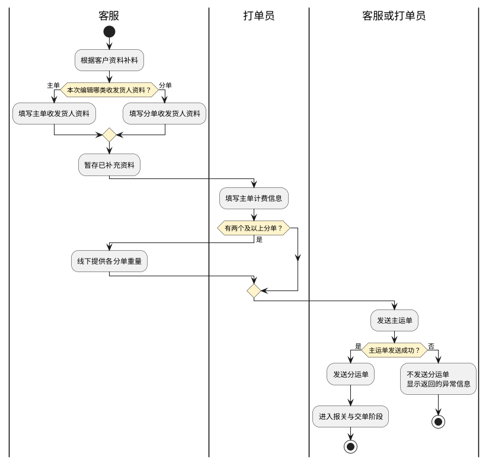
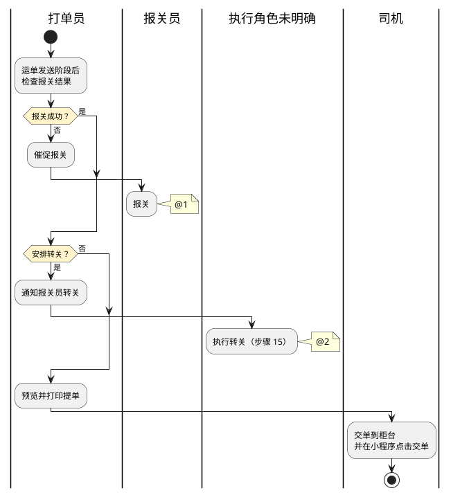
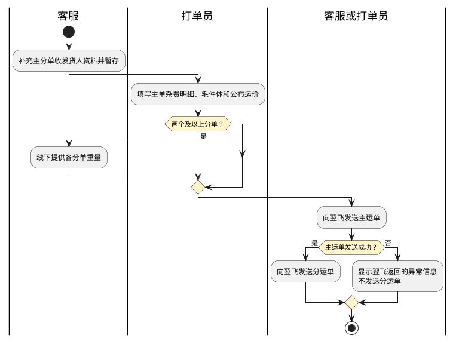

# 第011篇

> 本篇定位：空运提单与航司推送；主要内容：提单查询、编辑、输出与模板，以及航司推送入口、批量发送、防重、状态与失败反馈；文档角色：模块档；文档ID：ED54E43A14

**主流程入口：** 本篇关联[业务模式主流程总览](mainflow/PRD.高捷物流系统一期.主流程.01.业务模式主流程总览.md#mainflow-01)、[普货进出口关务流程](mainflow/PRD.高捷物流系统一期.主流程.03.普货进出口关务详细流程.md#mainflow-03)、[跨境电商 BC 出口关务流程](mainflow/PRD.高捷物流系统一期.主流程.04.跨境电商BC出口关务详细流程.md#mainflow-04)、[跨境电商 BC 与个人物品 CC 进口流程](mainflow/PRD.高捷物流系统一期.主流程.05.跨境电商BC、个人物品CC进口详细流程.md#mainflow-05)、[跨境电商 BBC 进口入出区与调拨流程](mainflow/PRD.高捷物流系统一期.主流程.06.跨境电商BBC进口详细流程.md#mainflow-06)、[跨境电商 BBC 进口特殊业务流程](mainflow/PRD.高捷物流系统一期.主流程.06.跨境电商BBC进口详细流程.md#mainflow-07)。

## 1. 空运-提单管理

**业务入口：** 提单管理

**概念模型：** [数据字典 · 空运订单与履约实体](PRD.高捷物流系统一期.第034篇.数据字典.7A3D9E1F50.md#doc-7A3D9E1F50-domain-air-fulfillment)

### 1.1 空运提单业务范围、流程与功能规则

#### 1.1.1 提单管理业务范围

本篇定义提单查询、主分单编辑、预览下载、批量发送、备注和提单模板管理规则。

#### 1.1.2 业务入口与操作

| 系统 | 一级菜单 | 二级菜单 | 说明 |
| --- | --- | --- | --- |
| 空运系统 | 提单管理 | 提单编辑 | 对提单进行编辑 |
| 空运系统 | 提单管理 | 分单编辑 | 对分单进行编辑 |
| 空运系统 | 提单管理 | 提单模板管理 | 对提单模板进行管理 |

#### 1.1.3 业务术语

受控术语定义见 [数据字典 · 受控业务术语](PRD.高捷物流系统一期.第034篇.数据字典.7A3D9E1F50.md#doc-7A3D9E1F50-domain-values)。

#### 1.1.4 参与角色与职责

| 用户角色 | 描述 |
| --- | --- |
| 客服 | 可编辑提单，打印提单等操作 |
| 打单员 | 可编辑提单，打印提单等操作 |
| 报关员 | 对该票货物报关 |
| 司机 | 把提单等资料交到柜台 |

#### 1.1.5 提单处理流程

提单处理分为资料与运单发送、报关与交单两个阶段。主单和分单资料从各自编辑入口补充；分单数量决定是否需要客服线下分重。

本图终点仅表示本次准备与发送阶段结束，不表示报关、转关或交单已完成。主单发送成功后才可发送分单，发送规则见[主分运单发送流程](#doc-ED54E43A14-section-7680e3573975)。发送阶段之后，按报关结果决定催报关或进入转关判断。

- @1：报关后的后续连接待确认。
- @2：执行转关（步骤 15）的执行角色与后续连接待确认；该步骤的角色栏与动作描述不一致。

报关、转关分支保留到原表已明确的处理结果，不推定其后自动打印或交单。各角色与完整步骤如下。

| 步骤 | 步骤描述 | 角色 | 流程描述 | 下一步骤 | 关键控制点 | 备注 |
| --- | --- | --- | --- | --- | --- | --- |
| 1 | 补料编辑 | 客服 | 客服根据客人的资料进行资料补充 | 2/3 |  | 系统流程 |
| 2 | 编辑收发货人 | 客服 | 填写主单收发货人等资料 | 4 |  | 系统流程 |
| 3 | 填写分单的收发货人 | 客服 | 填写分单的收发货人等资料 | 4 |  | 系统流程 |
| 4 | 暂存 | 客服 | 暂存已补充的资料 | 5 |  | 系统流程 |
| 5 | 填写主单计费信息 | 打单员 | 填写主单杂费明细、毛件体和公布运价 | 6 |  | 系统流程 |
| 6 | 判断分单数量 | 打单员 | 有两个及以上分单时进入步骤7；否则进入步骤8。 | 7/8 |  | 系统流程 |
| 7 | 客服分重 | 客服 | 客服提供各分单重量，用于随机文件、航司系统录入和按分单结算。 | 8 |  | 线下流程 |
| 8 | 发送主运单 | 客服/打单员 | 发送提单相关信息给航司系统 | 9 |  | 系统流程 |
| 9 | 发送分运单 | 客服/打单员 | 发送分单相关信息给航司系统 | 10 |  | 系统流程 |
| 10 | 报关是否成功 | 打单员 | 报关成功则进入步骤13 报关不成功则进入步骤11 | 11/13 |  | 线下流程 |
| 11 | 催促报关 | 打单员 | 催促报关员报关 | 12 |  | 线下流程 |
| 12 | 报关员报关 | 报关员 | 报关员报关 | - |  | 线下流程 |
| 13 | 转关 | 打单员 | 安排转关则进入步骤14 不安排转关则进入步骤16 | 14/16 |  | 线下流程 |
| 14 | 通知报关员转关 | 打单员 | 通知报关员转关 | 15 |  | 线下流程 |
| 15 | 报关员转关 | 打单员 | 报关员转关 | - |  | 线下流程 |
| 16 | 打印提单 | 打单员 | 预览提单并打印 | 17 |  | 系统流程 |
| 17 | 司机交单 | 司机 | 司机根据打单员打印出的提单交到柜台，并在司机端小程序点击“交单” |  |  | 系统流程 |

#### 1.1.6 提单列表字段与汇总规则

**查询字段**

**界面原型概述 · 提单列表查询栏**

- **区域字段或业务元素**：工作号/提单号、操作人员、客户简称、出港日期、截单时间、订单状态。
- **区域级通用规则**：除所列特例外，查询条件均选填、无预设值。

| 字段或控件特例 | 特例约束或业务结果 |
| --- | --- |
| 工作号/提单号 | 填写工作号/提单号，支持模糊搜索。 |
| 操作人员 | 支持模糊搜索。 |
| 客户简称 | 支持模糊搜索；（档案资料-客户管理-客户简称）；可搜索候选项。 |
| 出港日期、截单时间 | 不选择默认全部日期。 |
| 订单状态 | 选项如下：；全部；待出提单；已出提单；已交单；默认值：待出提单。 |

**列表字段**

每页显示50条。

**界面原型概述 · 提单列表栏**

- **区域字段或业务元素**：提单号、分单号、主单数据-重量（kg）、主单数据-件数（件）、主单数据-体积（m³）、分单数据-重量（kg）、分单数据-件数（件）、分单数据-体积（m³）、主单发送状态、分单发送总状态、目的港、头程航班号、出港日期、客服、航线、截单时间、航司/同行、订单号、交单时间、交单人、建单日期。
- **区域级通用规则**：字段均只读。

| 字段或控件特例 | 特例约束或业务结果 |
| --- | --- |
| 提单号 | 来源：订舱-舱单创建-提单号。 |
| 分单号 | 来源：补料-订单完善-分单号。 |
| 主单数据-重量（kg） | 来源：补料-订单完善-提单毛重；单位：kg。 |
| 主单数据-件数（件） | 来源：补料-订单完善-提单件数；单位：件。 |
| 主单数据-体积（m³） | 来源：补料-订单完善-提单体积；单位：m³。 |
| 分单数据-重量（kg） | [计算及聚合规则见关联业务](PRD.高捷物流系统一期.第011篇.空运提单与航司推送.ED54E43A14.md#doc-ED54E43A14-section-2c00120c039d)；单位：kg。 |
| 分单数据-件数（件） | [计算及聚合规则见关联业务](PRD.高捷物流系统一期.第011篇.空运提单与航司推送.ED54E43A14.md#doc-ED54E43A14-section-2c00120c039d)；单位：件。 |
| 分单数据-体积（m³） | [计算及聚合规则见关联业务](PRD.高捷物流系统一期.第011篇.空运提单与航司推送.ED54E43A14.md#doc-ED54E43A14-section-2c00120c039d)；单位：m³。 |
| 分单发送总状态 | 分单总状态。 |
| 目的港 | 来源：接单-订单创建-目的港代码。 |
| 头程航班号 | 来源：订舱-舱单创建-头程航班及出港日期。 |
| 出港日期 | 来源：订舱-舱单创建-出港日期。 |
| 截单时间 | 来源：舱位管理-舱位产品-截单时间；格式：YYYY-MM-DD HH:mm。 |
| 航司/同行 | 来源：订舱-舱单创建-航司代码或同行。 |
| 建单日期 | 不选择时查询全部日期。 |

**分单汇总规则：** 重量、件数和体积分别为该主单下所有分单对应数值之和。

**提单备注字段**

**界面原型概述 · 提单备注**

- **区域字段或业务元素**：提单备注。

| 字段或控件特例 | 特例约束或业务结果 |
| --- | --- |
| 提单备注 | 手工录入；选填；无预设值；可编辑。 |

#### 1.1.7 提单列表查询与操作规则

**场景：** 提单管理-提单列表

**范围：** 查看所有提单，了解提单概况

**参与角色：** 高捷客服，打单员

**触发与入口：** 进入提单管理页面，通过浏览和筛选，快捷找到相关提单

**业务结果：** 列表展示符合条件的提单及其发送状态，并支持批量发送、批量下载和备注维护。

**处理规则**

1. 展示范围：列表展示订单状态为“待出提单”“已出提单”“交单”或“已作废”的订单。

2. 查询与重置：未选择查询字段时，“查询”按全部条件检索；选择条件时展示匹配数据，并优先展示“待出提单”订单。“重置”清空全部查询条件。

3. 批量发送运单：仅已有提单号的订单可选择主单或分单数据发送至翌飞。发送顺序、两分钟防重、DescriptionCode、状态与失败反馈统一按[翌飞批量发送与防重规则](#doc-ED54E43A14-section-36be6b5a98f3)处理；发送结果在列表中更新。

4. 批量下载提单：打开“批量下载提单”弹窗，默认不选择数据并支持多选；确认后按航司代码从提单模板中取得相应模板并批量下载，不限制数量和时间。

5. 提单备注：打开“提单备注”弹窗；确定后保存该票备注并显示在列表中，取消后关闭弹窗且不保存。

6. 主分单导航：点击提单号进入对应的提单编辑页面；分单超过两个时以可滚动列表展示，点击分单号进入对应的分单编辑页面。

7. 截单时间异常：订单处于“待出提单”状态且截单时间晚于系统当前时间时，显示异常状态。

8. 分单发送异常：鼠标移至分单“发送总状态”的“异常中”标识时，浮窗仅展示已发送翌飞且处于异常状态的分单，依次显示分单号、发送航司分单子状态和翌飞返回的异常内容；内容超出展示区域时可滚动查看。

#### 1.1.8 提单编辑页面

**界面原型概述 · 主提单编辑字段映射**

- **区域字段或业务元素**：提单号前三位、始发地、提单号后八位、发货人、收货人、提单号、航司、公司全称、IATA CODE、Account No、Accounting Information、折扣号、始发地全称、头程目的地、头程航段、二程目的地、二程航段、三程目的地、三程航段、币值、WT/VAL、Other、运输价值、海关申报价值、目的地全称、头程航班号、Amount of Insurance、Handling Information、提单件数、提单毛重、Kg lb、运费条款、提单计费重、提单运价、计费总价、英文品名、尺寸、体积、杂费、杂费总和、总价、主单签发日期。

| 字段或控件特例 | 特例约束或业务结果 |
| --- | --- |
| 提单号前三位 | 取提单号前三位（蓝色标记1）。 |
| 始发地 | 取自主数据-空港管理的三字代码；必填；可编辑。 |
| 提单号后八位 | 字段名称为“提单号后八位”，取值规则为“取提单号后三位”；位数口径尚未确定。 |
| 发货人 | 取补料-订单完善-发货人打印内容（蓝色标记4），无值留空；可编辑。 |
| 收货人 | 取补料-订单完善-收货人打印内容（蓝色标记5），无值留空；可编辑。 |
| 提单号 | 订舱-舱单创建-提单号（标记43和6）。 |
| 航司 | 取航司管理对应（标记7）。 |
| 公司全称 | （标记40和44）；默认值：GUANGDONG GOLDJET INT’L LOGISTICS CO.，LTD。 |
| IATA CODE | 取补料-订单完善-IATA CODE（标记37）。 |
| Account No | 取档案资料-航司管理-Account No（标记38）。 |
| Accounting Information | 默认值：FREIGHT PREPAID；可编辑。 |
| 折扣号 | 订舱-舱单创建-折扣号；可编辑。 |
| 始发地全称 | 取自主数据-空港管理的三字代码（标记10和42）；可编辑。 |
| 头程目的地 | 订舱-订舱创建-头程航班；可编辑。 |
| 头程航段 | 订舱-订舱创建-头程航段；可编辑。 |
| 二程目的地 | 订舱-订舱创建-二程目的地；可编辑。 |
| 二程航段 | 订舱-订舱创建-二程航段；可编辑。 |
| 三程目的地 | 订舱-订舱创建-三程目的地；可编辑。 |
| 三程航段 | 订舱-订舱创建-三程航段；可编辑。 |
| 币值 | 默认值：CNY；可编辑。 |
| WT/VAL、Other | 默认值：PP；可编辑。 |
| 运输价值 | 默认值：NVD；可编辑。 |
| 海关申报价值 | 取补料-订单完善-海关申报价值（标记17）；可编辑。 |
| 目的地全称、提单运价 | 可编辑。 |
| 头程航班号 | 订舱-舱单创建-头程航班号；可编辑。 |
| Amount of Insurance | 保险金额；默认值：按保险金额字段展示；可编辑。 |
| Handling Information | 取补料-订单完善-Handling Information；可编辑。 |
| 提单件数 | 取补料-订单完善-提单件数（标记21和29）；可编辑。 |
| 提单毛重 | 取补料-订单完善-提单毛重（标记22和30）；可编辑。 |
| Kg lb、计费总价 | [计算/聚合规则见关联业务规则](PRD.高捷物流系统一期.第011篇.空运提单与航司推送.ED54E43A14.md#doc-ED54E43A14-section-5625afd14d62)。 |
| 运费条款 | 选项为FREIGHT PREPAID和FREIGHT COLLECT；默认值：FREIGHT PREPAID；可编辑。 |
| 提单计费重 | 取补料-订单完善-提单计费重；[计算/聚合规则见关联业务规则](PRD.高捷物流系统一期.第011篇.空运提单与航司推送.ED54E43A14.md#doc-ED54E43A14-section-5625afd14d62)。 |
| 英文品名 | 取补料-订单完善-英文品名；可编辑。 |
| 尺寸 | 取补料-订单完善-尺寸；可编辑。 |
| 体积 | 取补料-订单完善-提单体积；可编辑。 |
| 杂费 | 取费用管理-杂费；可编辑。 |
| 总价 | （标记39）。 |
| 主单签发日期 | 取补料-订单完善-签发日期；可编辑。 |

**提单计费规则：**

- 当`提单计费重*相应等级的运费卖价<M`时，提单运价取M，并默认使用M等级。
- 当`提单计费重*运费卖价>M`时，提单计费重大于45 kg则按计费重等级生成提单价格并默认使用Q等级；小于45 kg则默认使用N等级。
- 提单计费重取`体积*166.66`与毛重中的较大值，并向上调整为0.5的倍数、保留一位小数。例如，214.3取214.5，214.6取215.0。
- 计费总价=提单计费重*提单运价。

#### 1.1.9 提单编辑与预览下载规则

**场景：** 提单管理-提单编辑页面

**范围：** 编辑主提单信息，维护常用联系人和体积、杂费明细，并提交、暂存、预览或下载提单。

**参与角色：** 客服、打单员

**触发与入口：** 进入提单管理，双击某个提单号进入“提单编辑”页面；

**处理规则**

1. 主分单切换与发送：通过页签在主单和分单之间切换，展示主单、分单汇总及分单明细。展示字段、发送状态、选择和批量发送规则见[航司推送状态展示与选择规则](#doc-ED54E43A14-section-b27d10bc025a)。

2. 操作按钮：“提交”将订单状态由“待出提单”变为“已出提单”；“暂存”保存当前编辑内容；“预览”和“下载”打开“提单格式选择”弹窗；“托运书预览”打开托运书预览。

3. 发货人编辑：名称、地址、电话、邮编、国家、国家代码、省份、城市和别称分别取主单补料中的对应字段，无值时留空；勾选“保存为常用联系人”时保存联系人，并校验别称唯一。取消时关闭弹窗；清空时清除填写区和提单信息展示区；保存时保存两个区域的数据。提单信息展示区取主单补料中的发货人提单信息。常用联系人支持按别称模糊搜索、使用和删除；点击“使用”后，将该联系人内容带入填写区和提单信息展示区。

4. 收货人编辑：字段、按钮和常用联系人规则与发货人一致，取值源改为主单补料中的收货人信息。

5. 体积明细：默认10行，可添加或删除行。总体积为各行`长*宽*高*件数/1000000`之和，结果四舍五入保留两位小数；总件数为各行件数之和。

6. 杂费明细：默认行数取默认杂费项数量；填写单价和计费数量后，每行小计=单价*计费数量。

7. 键盘操作：输入状态下按制表键（Tab）移至下一输入格。

8. 数据同步：提单管理填写的毛重、件数和体积同步回订单管理对应字段。

#### 1.1.10 分单编辑页面

**界面原型概述 · 分提单编辑字段映射**

- **区域字段或业务元素**：提单号前三位、始发地、提单号后八位、发货人、收货人、分单号、航司、公司全称、IATA CODE、Account No、Accounting Information、始发地全称、头程目的地、头程航段、二程目的地、二程航段、三程目的地、三程航段、币值、WT/VAL、Other、运输价值、海关申报价值、目的地全称、头程航班号、Amount of Insurance、Handling Information、分单件数、分单毛重、Kg lb、唛头、提单计费重、分单运价、计费总价、英文品名、尺寸、体积、杂费、杂费总和、总价。

| 字段或控件特例 | 特例约束或业务结果 |
| --- | --- |
| 提单号前三位 | 取提单号前三位（蓝色标记1）。 |
| 始发地 | 来源：主数据-空港管理-三字代码；必填；可编辑。 |
| 提单号后八位 | 字段名称为“提单号后八位”，取值规则为“取提单号后三位”；位数口径尚未确定。 |
| 发货人 | 来源：补料-订单完善-分单发货人打印内容（蓝色标记4）；无值时留空；可编辑。 |
| 收货人 | 来源：补料-订单完善-分单收货人打印内容（蓝色标记5）；无值时留空；可编辑。 |
| 分单号 | 来源：订舱-舱单创建-分单号（标记6）。 |
| 航司 | 来源：航司管理（标记7）。 |
| 公司全称 | 标记40和44；默认值：GUANGDONG GOLDJET INT’L LOGISTICS CO.，LTD。 |
| IATA CODE | 来源：航司管理-IATA CODE（标记37）。 |
| Account No | 来源：档案资料-航司管理-Account No（标记38）。 |
| Accounting Information | 来源：补料-分单运费条款（标记8）；默认值：FREIGHT PREPAID；可编辑。 |
| 始发地全称 | 标记10和42；可编辑。 |
| 头程目的地、二程目的地、三程目的地、目的地全称 | 可编辑。 |
| 币值 | 默认值：CNY；可编辑。 |
| WT/VAL、Other | 默认值：PP；可编辑。 |
| 运输价值 | 默认值：NVD；可编辑。 |
| 海关申报价值 | 来源：补料-订单完善-分单海关申报价值（标记17）；可编辑。 |
| 头程航班号 | 来源：订舱-舱单创建-头程航班号；可编辑。 |
| Amount of Insurance | 默认值：按保险金额字段展示；可编辑。 |
| Handling Information | 来源：补料-订单完善-分单 Handling Information；可编辑。 |
| 分单件数 | 来源：补料-订单完善-分单件数（标记21和29）；可编辑。 |
| 分单毛重 | 来源：补料-订单完善-分单毛重（标记22和30）；可编辑。 |
| Kg lb | 默认值：Q；可编辑。 |
| 唛头 | 来源：补料-订单完善-分单唛头。 |
| 提单计费重 | 来源：补料-订单完善-分单计费重。 |
| 分单运价 | 标记25；可编辑。 |
| 计费总价 | 标记26、31、32。 |
| 英文品名 | 来源：补料-订单完善-分单英文品名；可编辑。 |
| 尺寸 | 来源：补料-订单完善-分单尺寸；可编辑。 |
| 体积 | 来源：补料-订单完善-分单体积；可编辑。 |
| 杂费 | 来源：费用管理-杂费；可编辑。 |
| 总价 | 标记39。 |

#### 1.1.11 分单编辑与预览下载规则

**场景：** 提单管理-分单编辑页面

**范围：** 编辑分提单信息，维护常用联系人和体积、杂费明细，并提交、暂存、预览或下载分单。

**参与角色：** 客服、打单员

**触发与入口：** 进入提单管理，双击某个分单号进入“分单编辑”页面；

**处理规则**

1. 主分单切换、发送状态、提交、暂存和键盘操作与[提单编辑规则](#doc-ED54E43A14-section-43b81c0c9f43)一致；“预览”和“下载”打开“分单格式选择”弹窗。

2. 发货人编辑：名称、地址、电话、邮编、国家、国家代码、省份、城市和别称分别取分单补料中的对应字段，无值时留空；勾选“保存为常用联系人”时保存联系人，并校验别称唯一。取消、清空、保存及常用联系人搜索、使用、删除规则与主提单一致，分单信息展示区取分单补料中的发货人分单信息。

3. 收货人编辑：字段、按钮和常用联系人规则与发货人一致，取值源改为分单补料中的收货人信息。

4. 体积明细：默认10行，可添加或删除行。总体积为各行`长*宽*高*件数/1000000`之和，结果四舍五入保留两位小数；总件数为各行件数之和。

5. 杂费明细：杂费代码、单价和计费数量无默认值；填写单价和计费数量后，每行小计=单价*计费数量。

#### 1.1.12 提单模板查询与列表字段

**查询字段**

**界面原型概述 · 提单模板查询栏**

- **区域字段或业务元素**：航司代码、类型、状态。

| 字段或控件特例 | 特例约束或业务结果 |
| --- | --- |
| 航司代码 | 不选择时查询全部；选填；无预设值。 |
| 类型 | 不选择时查询全部；选项：提单（有格式）、中性提单（有格式）、中性提单（无格式）、中性提单（TPE）、中性提单（电池）、UPS提单（有格式）、UPS提单（无格式）、舱单、分单（有格式）、分单（无格式）、托运书。 |
| 状态 | 选项：全部、已完成、已上传。 |

**模板列表字段**

**界面原型概述 · 提单模板列表栏**

- **区域字段或业务元素**：航线代码、类型、创建时间、状态。

| 字段或控件特例 | 特例约束或业务结果 |
| --- | --- |
| 状态 | 显示已完成或已上传。 |

#### 1.1.13 提单模板上传与下载规则

**场景：** 提单管理-提单模板管理列表页面

**范围：** 按航司和模板类型上传、查询及批量下载提单相关模板。

**参与角色：** 产品人员、技术人员

**触发与入口：** 进入提单管理，点击提单模板管理进入“提单模板管理”页面；

**处理规则**

1. 模板上传：点击“模板上传”进入上传页面。航司必填，取航司管理中的航司代码；类型必填，可选提单（有格式）、中性提单（有格式）、中性提单（无格式）、中性提单（TPE）、中性提单（电池）、UPS提单（有格式）、UPS提单（无格式）、舱单、分单（有格式）、分单（无格式）或托运书。上传文件必填，支持`.doc`、`.docx`、`.xlsx`、`.xls`格式，单个文件不超过20 MB；保存前可删除并重新上传。

2. 模板下载：勾选一条或多条模板后批量下载。

3. 状态：“已上传”表示模板文件上传成功；“已完成”表示模板已完成配置并可供业务使用。

## 2. 航司推送

**业务入口：** 航司系统对接

### 2.1 航司推送业务范围

#### 2.1.1 航司推送业务范围

本篇定义从提单管理向翌飞、CCSP发送主运单和分运单的数据条件、发送顺序、两分钟防重、DescriptionCode取值、状态展示及失败反馈规则。

### 2.2 航司推送流程与规则

#### 2.2.1 主分运单发送流程

客服与打单员完成资料准备后，先发送主运单；主运单成功是发送分运单的前置条件。

下表说明资料准备与发送交接；批量选择、两分钟防重和失败反馈见[翌飞批量发送与防重规则](#doc-ED54E43A14-section-36be6b5a98f3)。

| 步骤 | 步骤描述 | 角色 | 流程描述 | 下一步骤 | 关键控制点 | 备注 |
| --- | --- | --- | --- | --- | --- | --- |
| 1 | 补充主分单资料 | 客服 | 客服补充主单或分单的收发货人资料并暂存。 | 2 |  | 系统流程 |
| 2 | 完善主单数据 | 打单员 | 打单员填写主单杂费明细、毛件体和公布运价。 | 3 |  | 系统流程 |
| 3 | 判断是否需要分重 | 客服、打单员 | 主单包含两个及以上分单时，由客服提供各分单重量；否则直接发送主运单。 | 4 |  | 线下流程 |
| 4 | 发送主运单 | 客服、打单员 | 向翌飞发送主单的运单信息。 | 5 | 必须先于分运单发送 | 系统流程 |
| 5 | 发送分运单 | 客服、打单员 | 主运单发送成功后，向翌飞发送分单运单信息。 |  | 主运单未成功时不得发送 | 系统流程 |

#### 2.2.2 翌飞批量发送与防重规则

**场景：** 发送运单

**范围：** 批量向翌飞发送主运单和分运单。

**参与角色：** 客服、打单员

**触发与入口：** 订单已有提单号，客服或打单员在提单管理列表选择待发送数据。

**业务结果：** 符合条件的数据按主单后分单的顺序发送；成功项更新发送状态，失败项显示翌飞返回的异常信息。

**处理规则**

1. 发送条件：仅已有提单号的订单可使用“批量发送运单”。可选择主单、分单或整票数据发送至翌飞。

2. 发送顺序：必须先发送主单运单信息，包括航班信息、起飞港、降落港、件数和重量；主单成功后方可发送分单。未发送主单而直接发送分单时，展示翌飞返回的错误信息。

3. 两分钟防重：任一主单或分单发送成功后的2分钟内不得重复提交，否则展示翌飞返回的错误信息。例如，一个主单包含两个分单，其中分单1已发送成功；2分钟内全选整票发送时返回错误，超过2分钟后全选则重新发送该主单及全部分单，包括分单1。

**界面原型概述 · 运单选择与发送状态**

- **区域字段或业务元素**：主单选择、分单选择、主单发送状态、分单发送总状态、分单发送子状态。

| 字段或控件特例 | 适用条件 | 特例约束或业务结果 |
| --- | --- | --- |
| 主单选择 | 勾选主单序号前的多选项时 | 默认选择该主单下全部分单；也可在下拉项中单独选择主单或某个分单。 |
| 发送状态 | 主单、分单汇总及分单明细 | 状态均为“待发送”“发送中”“成功”“异常中”；异常时显示异常标识和翌飞返回的信息。 |

**界面原型概述 · 运单发送代码（DescriptionCode）**

- **区域字段或业务元素**：本次所选提单号、运单发送代码（DescriptionCode）。
- **区域级通用规则**：弹窗只展示本次所选数据中需要填写DescriptionCode的提单号。

| 字段或控件特例 | 适用条件 | 特例约束或业务结果 |
| --- | --- | --- |
| DescriptionCode | 前缀为784（CZ）、043（KA）、131（JL）、235（TK） | 必填；可选EAP、EAW，默认EAP。 |
| DescriptionCode | 前缀为999（CA） | 可选EAP、EAW、中性提单999，默认EAP；中性提单支持手工录入。 |
| DescriptionCode | 其他航司 | 值为空，不在弹窗中展示。 |

**发送代码与CCSP接收模块**

| 代码 | CCSP接收模块 |
| --- | --- |
| EAP、EAW | 国际电子运单模块 |
| 中性提单999 | 国际主单-中性运单制单模块 |

#### 2.2.3 推送状态展示与选择规则

客服、打单员在提单或分单编辑页面查看发送状态，通过页签切换主单与分单，并选择待发送运单。

**界面原型概述 · 主单发送区**

- **区域字段或业务元素**：选择状态、提单号、发送航司提单状态、头程航班、提单件数、提单重量、提单体积。
- **区域级通用规则**：按上述顺序展示当前主单的发送信息。

**界面原型概述 · 分单发送汇总区**

- **区域字段或业务元素**：分单数、分单总件数、分单总重量、分单总体积、发送航司分单总状态。
- **区域级通用规则**：按上述顺序展示当前主单下分单的汇总信息。

**界面原型概述 · 分单发送明细区**

- **区域字段或业务元素**：选择状态、分单号、发送航司分单子状态、分单件数、分单重量、分单体积。
- **区域级通用规则**：按上述顺序展示各分单的发送信息。

点击“批量发送运单”后，按[翌飞批量发送与防重规则](#doc-ED54E43A14-section-36be6b5a98f3)处理。
