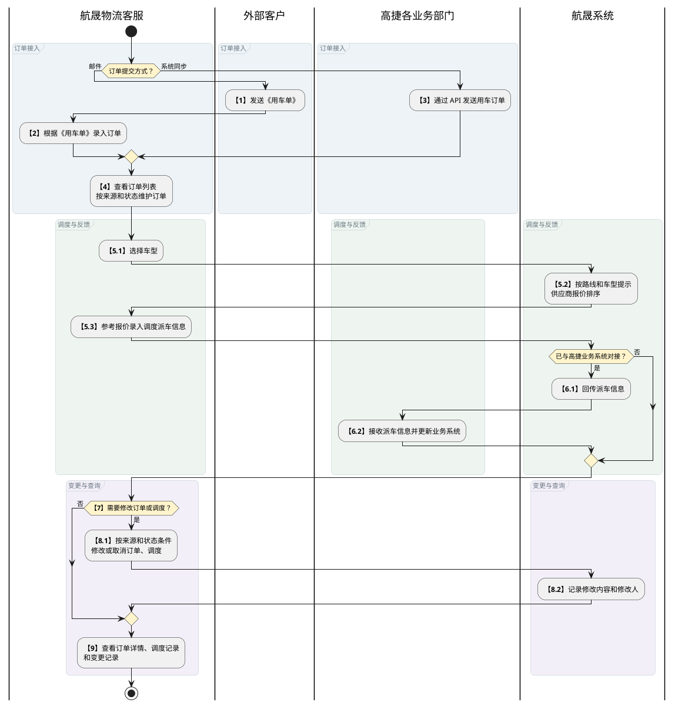
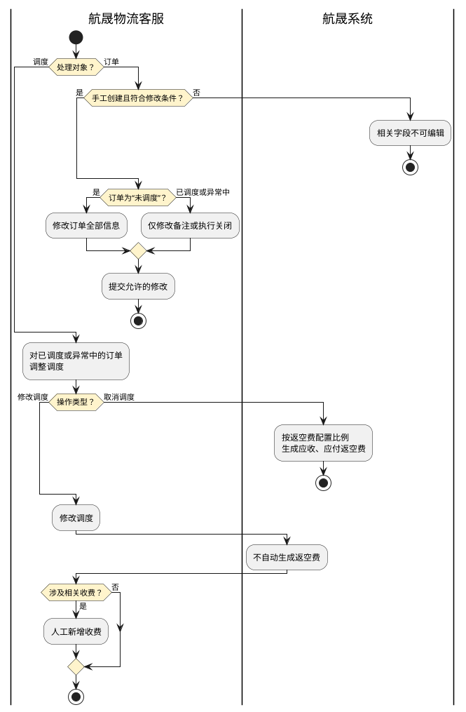
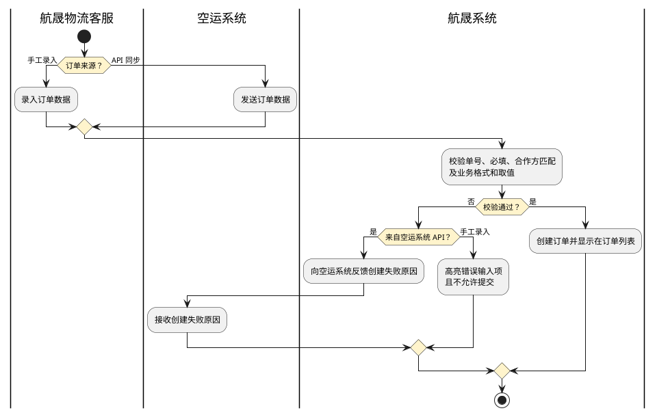
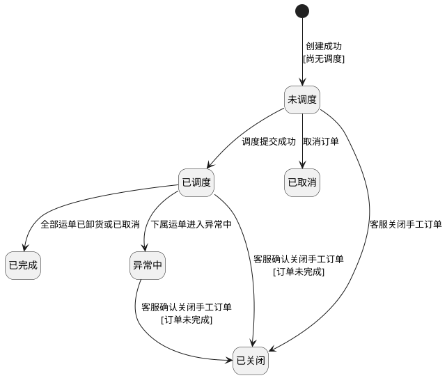

# 第015篇

> 本篇定位：用车-订单管理；主要内容：订单创建与修改、生命周期、调度、运单生成、中转及上下游反馈；文档角色：模块档；文档ID：32C78B8106

**关联业务主流程：** [业务模式主流程总览](mainflow/PRD.高捷物流系统一期.主流程.01.业务模式主流程总览.md#mainflow-01)、[跨境电商 BC 与个人物品 CC 进口流程](mainflow/PRD.高捷物流系统一期.主流程.05.跨境电商BC、个人物品CC进口详细流程.md#mainflow-05)、[跨境电商 BBC 进口入出区与调拨流程](mainflow/PRD.高捷物流系统一期.主流程.06.跨境电商BBC进口详细流程.md#mainflow-06)、[跨境电商 BBC 进口特殊业务流程](mainflow/PRD.高捷物流系统一期.主流程.06.跨境电商BBC进口详细流程.md#mainflow-07)、[异常处理流程](mainflow/PRD.高捷物流系统一期.主流程.09.异常处理流程.md#mainflow-09)。
**关联模块流程：** [订单管理流程](#doc-32C78B8106-section-470dd2b8ab0e)、[中转仓用车流程](PRD.高捷物流系统一期.第033篇.DDP跨模块作业与结算流程.7579B595B8.md#doc-7579B595B8-section-e4cd43033ac4)。

## 1. 用车-订单管理

**业务入口：** 用车调度页面。

**概念模型：** [数据字典 · 地面运输与仓储实体](PRD.高捷物流系统一期.第034篇.数据字典.7A3D9E1F50.md#doc-7A3D9E1F50-domain-ground-warehouse)

### 1.1 页面交互规则

#### 1.1.1 通用页面行为

- 订单列表默认分页显示，每页 50 条记录。

- 创建订单时提供“提交”和“取消”按钮；修改订单时提供“保存”和“取消”按钮。

- 提交成功后，页面短暂显示“已提交成功！”。

- 输入内容不符合格式要求或必填项为空时，对应输入项高亮提示，“提交”和“保存”按钮置灰且不可点击。

### 1.2 业务范围、角色与流程

#### 1.2.1 业务目标与范围

订单管理覆盖运输订单和中转订单的创建、修改、调度与查询，并记录订单状态、调度结果及上下游反馈。

#### 1.2.2 操作入口

| 系统 | 一级菜单 | 二级菜单 | 说明 |
| --- | --- | --- | --- |
| 航晟物流工作台 | 订单管理 | 运输订单 | 展示除中转仓订单以外的订单，此部分订单需要客服调度操作。 |
| 航晟物流工作台 | 订单管理 | 中转订单 | 特定展示中转仓订单的类型，此部分订单不需要客服人员手动调度。 |

#### 1.2.3 受控术语

受控术语定义见 [数据字典 · 受控业务术语](PRD.高捷物流系统一期.第034篇.数据字典.7A3D9E1F50.md#doc-7A3D9E1F50-domain-values)。

#### 1.2.4 角色与权限

管理员、客服的订单操作授权见[地面业务操作权限](PRD.高捷物流系统一期.第035篇.角色与访问权限.5E31456F30.md#doc-5E31456F30-ground-actions)；订单来源、状态与修改条件仍按本篇场景规则执行。

#### 1.2.5 订单管理流程

邮件录入与系统同步的订单汇入同一调度入口；调度后的修改或取消仍受订单来源和状态条件限制。

| 环节 | 参与方 | 处理与结果 | 后续环节 |
| --- | --- | --- | --- |
| 1. 通过邮件发送《用车单》 | 外部客户 | 若没有做系统对接，则选择邮件附件《用车单》的提交发送模式。 | 2 |
| 2. 新建录入订单 | 航晟物流客服 | 若客户是提交《用车单》的模式，则客服要根据此《用车单》通过新建订单的方式，将其录入到系统中。 | 4 |
| 3. 内部业务系统发送用车订单（API） | 高捷各业务部门 | 高捷物流内部系统和航晟物流通过统一的接口标准，实现系统对接，实时同步用车申请。 | 4 |
| 4. 查看订单列表（可修改） | 航晟物流客服 | 手动创建和系统同步生成的订单统一显示在订单列表中；客服按订单来源和状态规则修改单条订单，并安排调度。 | 5 |
| 5. 调度派车，基于订单录入派车信息 | 航晟物流客服 | 对选定的订单进行调度派车信息的录入，录入时，先选择车型，此时系统可提示符合此路线和此车型的供应商报价排序，供其选择参考。 | 7 |
| 6. 系统收到派车信息，更新信息 | 高捷各业务部门 | 由于实现了系统对接，航晟系统中录入的调度派车信息，也将同步回传给高捷物流的各业务部门的系统。 | 结束 |
| 7. 是否需要修改订单/调度？ | 航晟物流客服 | 如发生订单或调度信息录入错误，或客户因货物增减需要调整订单需求，则可选择修改相关信息。 | 8或9 |
| 8. 修改（取消）订单/调度 | 航晟物流客服 | 修改订单可重新录入需要修改的内容，也可取消订单和调度等。每次修改，相关的修改记录和修改人都将被系统记录。 | 9 |
| 9. 查看订单详情（调度记录&订单记录） | 航晟物流客服 | 查看订单的调度记录和变更记录。 |  |

#### 1.2.6 逆向流程节点说明

修改订单与调整调度分别判断；取消调度产生返空费，修改调度不自动产生返空费。

系统同步订单与手工录入执行相同的创建校验，失败结果反馈给对应提交方。

| 流程点 | 异常节点 | 前置条件 | 后续处理 |
| --- | --- | --- | --- |
| 7 | 修改订单 | 1. 仅手工创建的订单可修改。 2. 订单状态为“未调度”时，可修改订单全部信息。 3. 订单状态为“已调度”或“异常中”时，仅可修改“备注”或执行“关闭”操作。 | 1. 符合修改条件时，允许修改并提交。 2. 不符合修改条件时，相关字段置灰且不可编辑。 |
| 7 | 修改调度 | 1. 当订单状态=“已调度”或“异常中”时，可修改调度信息。 | 1. 若“取消调度”，则系统根据返空费配置比例自动生成应收付的返空费。 2. 若“修改调度”，则系统不生成任何“返空费”，若涉及相关收费，则客服人工新增收费。 |
| 3 | 空运系统自动发送订单数据 | 无论是手动创建订单，还是接收空运系统的API订单数据，都需要严格遵循订单创建场景的必填、业务格式和取值校验规则。 | 若不符合相同规则，则航晟系统反馈创建失败的消息给到空运系统。相关的失败原因如下： 1. 单号重复。 1. 必填项无值。 1. 委托方全称与合作方档案中的数据不匹配。 1. 输入项不符合对应业务格式或取值限制。 |

### 1.3 用车订单管理功能与规则

#### 1.3.1 订单创建页面

- 订单创建页面，可创建各客户的用车订单。

#### 1.3.2 用车订单与航晟手工建单字段定义

**界面原型概述 · 用车订单创建**

- **区域字段或业务元素**：客户订单号、委托方、委托方联系人、联系电话、邮箱地址、件数（件）、体积（m³）、重量（kg)、尺寸（长度cm）、尺寸（宽度cm）、尺寸（高度cm）、期望提货时间、提货地点、提货联系人、监管车、特种车、尾板车、期望送货时间、送货地点、送货联系人、备注、业务类型。
- **区域级通用规则**：所列长度限制用于保存、提交或接收校验；不符合时按本场景失败规则处理。

| 字段或控件特例 | 特例约束或业务结果 |
| --- | --- |
| 客户订单号 | 去重校验；[按订单来源确定维护状态](#doc-32C78B8106-section-e810f2381097)；选填。 |
| 委托方 | 取自合作方档案管理中为“客户”类别；必填；初始不设值。 |
| 委托方联系人 | 也可直接取合作方档案中的业务联系人信息，直接从候选列表选择，选择后，带出该联系人的姓名、电话和邮箱信息。也可单独重新输入；长度限制：2～50 个字符；选填；选择已有联系人后自动带出。 |
| 联系电话 | 长度限制：8～20 个字符；选填；选择已有联系人后自动带出。 |
| 邮箱地址 | 按邮箱地址规则填写；长度限制：6～50 个字符；选填；选择已有联系人后自动带出。 |
| 件数（件）、体积（m³）、重量（kg)、尺寸（长度cm）、尺寸（宽度cm）、尺寸（高度cm） | 正整数即可；长度限制：1～10 个字符；选填。 |
| 期望提货时间 | 格式：YYYY-MM-DD HH:mm；必填；初始不设值。 |
| 提货地点、送货地点 | 按照省市区三级选择，并填入详细地址；长度限制：4～200 个字符；必填。 |
| 提货联系人、送货联系人 | 长度限制：2～50 个字符；选填。 |
| 联系电话 | 长度限制：8～20 个字符；选填。 |
| 监管车 | 是或否；选填；初始不设值。 |
| 特种车、尾板车 | 选填；初始不设值。 |
| 期望送货时间 | 格式：YYYY-MM-DD HH:mm；选填；初始不设值。 |
| 备注 | 长度限制：0～800 个字符；选填；可编辑。 |
| 业务类型 | 出口空运；进口空运；出口海运；跨境陆运；陆运；必填；初始不设值；可编辑。 |

- 航晟客服通过“新建订单”入口手工创建订单时，适用本节的“航晟手工建单界面原型概述”。两份字段定义存在不同名称、必填性或默认值时，按各自适用的订单来源执行，不将航晟手工建单口径扩展至上游系统同步订单。
- “客户订单号”仅在航晟手工创建，即并非由空运系统通过 API 同步的订单中可修改；空运系统通过 API 同步的订单不可人工修改。

**界面原型概述 · 航晟手工建单**

- **区域字段或业务元素**：单号、委托方、委托方联系人、联系电话、邮箱地址、件数（件）、方数（方）、重量（kg)、尺寸（长度cm）、尺寸（宽度cm）、尺寸（高度cm）、期望提货时间、提货地点、提货联系人、提货联系电话、监管类型、特种车、是否尾板车、期望送货时间、送货地点、送货联系人、送货联系电话、备注。
- **区域级通用规则**：所列长度限制用于保存、提交或接收校验；不符合时按本场景失败规则处理；字段均可编辑。

| 字段或控件特例 | 特例约束或业务结果 |
| --- | --- |
| 单号 | 必填。 |
| 委托方 | 取自合作方档案管理中为“客户”类别；必填；初始不设值。 |
| 委托方联系人 | 也可直接取合作方档案中的业务联系人信息，直接从候选列表选择，选择后，带出该联系人的姓名、电话和邮箱信息。也可单独重新输入；长度限制：2～50 个字符；选填；选择已有联系人后自动带出。 |
| 联系电话 | 长度限制：8～20 个字符；选填；选择已有联系人后自动带出。 |
| 邮箱地址 | 按邮箱地址规则填写；长度限制：6～50 个字符；选填；选择已有联系人后自动带出。 |
| 件数（件）、方数（方）、重量（kg)、尺寸（长度cm）、尺寸（宽度cm）、尺寸（高度cm） | 长度限制：1～10 个字符；选填。 |
| 期望提货时间、期望送货时间 | 格式：YYYY-MM-DD HH:mm；必填；默认值：今天。 |
| 提货地点、送货地点 | 按照省市区三级选择，并填入详细地址；长度限制：4～200 个字符；必填。 |
| 提货联系人、送货联系人 | 长度限制：2～50 个字符；选填。 |
| 提货联系电话、送货联系电话 | 长度限制：8～20 个字符；选填。 |
| 监管类型、特种车、是否尾板车 | 选填；初始不设值。 |
| 备注 | 填写备注信息；长度限制：0～800 个字符；选填。 |

#### 1.3.3 订单创建规则

输入订单信息，提交订单

**参与方：** 航晟客服

**入口与前提：** 进入订单管理页面，点击《新建订单》按钮，进入此页面

**业务结果：** 输入符合格式与校验规则时成功提交；不符合时提示输入错误。

**处理规则**

进入《新建订单》页面，分别输入委托方信息、货物信息、提货信息和送货信息。

**委托方信息**

- 委托方的可选对象必须取自合作方档案管理中的合作公司主体，且与航晟物流的合作关系为“客户”。

- 可输入委托方联系人信息；每组联系人信息包括姓名、联系电话和邮箱地址，并可通过点击“+”录入多组联系人。

- 系统按照订单节点，向委托方联系人邮箱自动发送邮件。

- 委托方联系人信息可从该合作方档案的业务联系人中选择，也可完整重新录入。重新录入的联系人姓名、联系方式和邮箱地址在订单提交成功后，自动新增至合作方档案的业务联系人信息。

**货物信息**

- 按照字段定义进行可选输入。

- 尺寸需分别录入长、宽、高。

**提货信息**

- 期望提货时间支持仅录入日期，也支持录入至“HH:MM”。

- 通过点击“+”，支持输入多个提货地址；每行提货信息可分别录入监管车、特种车和尾板车要求。

新增的提货点或卸货点必须与第一个提货点或卸货点的省、市相同，区和详细地址可不同。

**送货信息**

- 期望送货时间支持仅录入日期，也支持录入至“HH:MM”。

- 通过点击“+”，支持输入多个送货地址。

点击《提交》保存订单。

- 提交成功：显示“提交成功”提示，并跳转到订单管理页面。

- 无法提交：若必填项未输入，或输入业务格式不符合要求，则高亮提示对应输入项，《提交》按钮置灰且不可点击。

**分支与边界**

报价匹配逻辑：

- 若出现多个提货地址或送货地点，则系统默认取第一个提货地点和送货地点进行路线报价的匹配。

- 空运与航晟用车的订单数据基于 API 交互：

- 空运发送用车订单；

- 航晟接收后，反馈创建成功或失败的状态；

- 创建订单成功后，在订单列表页面上显示的“订单号”都是根据系统编码规则重新生成的订单号：T+101+YYMMDD（6位）+5位流水；（如：T10120121700001）

- 需要支持多笔订单带重复的订单号的情况，因为客户可能会对一批货进行多次部分提货。

**专项规则：** “业务类型”字段：若是上游系统的订单，则约定上游系统明确传值；若是航晟自行创建的用车订单，则需要必选选择。此值主要作用于财务结算。

**业务衔接：** 通过 API 自动接收空运系统传输的新订单。

#### 1.3.4 修改订单页面

- 在《运输订单页面》对选中订单进行“编辑”，可修改该订单的信息，可编辑信息与新建订单的录入信息保持一致。

#### 1.3.5 订单修改规则

编辑订单信息，保存订单

**参与方：** 航晟客服

**入口与前提：** 进入订单管理页面，点击《编辑》按钮，进入此页面

**业务结果：** 输入符合格式与校验规则时成功提交；不符合时提示输入错误。

**处理规则**

参照“新建订单”的页面处理逻辑，编辑订单仍需遵循字段的输入格式和规则校验。与“新建订单”不同的是，“编辑订单”提供底部的状态编辑功能：

- 可修改订单状态的条件：当前订单未完成，即关联的运单状态并非全部为“已卸货”。

- 若选择“关闭订单”，则订单状态变更为“已关闭”，且不可再编辑。

- 若当前订单未调度，此时关闭订单不产生相关费用。

- 若当前订单已调度，此时关闭订单，系统弹窗提示“该订单已调度，关闭订单将产生相应的返空费。”若客服确认，则按照结算规则生成相应的应收、应付“返空费”。

**分支与边界：** 若是空运系统自动发送过来的订单，则不支持修改订单的详细信息，仅《备注》字段可编辑修改。（除《备注》项以外，其他项均置灰）

#### 1.3.6 运输订单管理页面

- 《运输订单管理页面》管理所有内外部客户的上门提货用车订单（非中转仓订单）。

#### 1.3.7 订单状态定义

| 订单状态 | 状态说明 |
| --- | --- |
| 未调度 | 未曾对该订单录入任何调度信息 |
| 已调度 | 当前订单上有履约中的调度信息，即存在状态不为“已卸货”或“已取消”的运单。 |
| 已取消 | 订单在“未调度”状态下取消 |
| 已完成 | 该订单中的运单状态全部=已卸货或已取消 |
| 异常中 | 该订单中至少有一个运单状态=异常中 |

用车订单状态由调度、下属运单与订单操作共同决定；图中只连接结果明确的迁移，不把订单状态等同于单个运单状态。

- “异常中”：“已调度”的判定包含异常运单，与“异常中”的显示优先级尚未明确；多运单异常取消后的订单汇总结果不在图中补定。
- “已取消”：本图仅画出未调度时取消。已调度或异常中订单的上游取消，按[上游订单交互结果](#doc-32C78B8106-section-393a06a30fdb)允许成功，但与本节“已取消”的进入条件不一致，故未连接该分支。
- “已关闭”：来自[订单修改规则](#doc-32C78B8106-section-683144265b9d)，不可再编辑；它与“已取消”的关系、状态清单及“订单未完成”的判定口径仍需统一。关闭产生的费用按该规则处理。

#### 1.3.8 运输订单筛选栏界面原型概述

**界面原型概述 · 运输订单筛选栏**

- **区域字段或业务元素**：委托方、提货点、送货点、订单状态、下单日期、提货日期、订单类型、查询输入项。

| 字段或控件特例 | 特例约束或业务结果 |
| --- | --- |
| 委托方 | 去重，显示所有订单的委托方全称；默认值：全部。 |
| 提货点、送货点 | 支持省市2级选择；初始不设值。 |
| 订单状态 | 选项：全部；待调度；已调度；已取消；已完成；异常中；默认值：待调度。 |
| 下单日期、提货日期 | 支持按单日选择日期；若不筛选，则默认显示所有日期；初始不设值。 |
| 订单类型 | 选项：当委托方为UPS（匹配到全称），才显示此过滤项。不然不显示；全部；空运部；海运部；默认值：全部。 |
| 查询输入项 | 需要精准搜索，可搜索订单号/分单号/批次号；默认值：订单号。 |

#### 1.3.9 运输订单列表栏界面原型概述

**界面原型概述 · 运输订单列表栏**

- **区域字段或业务元素**：订单号、子单号、批次号、委托方、订单状态、件数(件）、重量（kg)、体积（m³）、尺寸、提货点、卸货点、提货时间、提货联系人和联系方式、送货时间、送货联系人及联系方式、特种车、备注、操作。

| 字段或控件特例 | 特例约束或业务结果 |
| --- | --- |
| 订单号 | 空运系统传值或手动创建订单录入。 |
| 子单号、批次号 | 空运系统传值；展示值：有值直接显示，无值留空。 |
| 委托方 | 取订单信息。 |
| 订单状态 | 按[订单状态定义](#doc-32C78B8106-section-22c036104a98)显示。 |
| 件数(件） | 取订单信息；展示值：有值直接显示，无值留空。 |
| 重量（kg)、体积（m³）、尺寸 | 展示值：有值直接显示，无值留空。 |
| 提货点 | 展示值：广东省广州市白云区白云机场。 |
| 卸货点 | 展示值：广东省深圳市福田区深圳机场。 |
| 提货时间、送货时间 | YYYY-MM-DD HH:mm。 |
| 提货联系人和联系方式、送货联系人及联系方式 | 展示值：联系人姓名与联系电话按“姓名：电话”格式合并展示。 |
| 特种车 | 展示值：取订单上的值，无值则留空。 |
| 备注 | 取订单信息或人工编辑时录入了备注信息；展示值：有值直接显示，无值留空。 |
| 操作 | 按[运输订单列表规则](#doc-32C78B8106-section-4b7a41e422d9)显示可执行操作。 |

#### 1.3.10 运输订单列表规则

查看所有订单，了解订单概况

**参与方：** 航晟客服

**入口与前提：** 进入订单管理页面，通过浏览和筛选，快捷找到相关订单

**业务结果：** 列表按既定规则展示和排序订单，并根据订单状态提供对应操作。

**处理规则**

**订单展示与排序**

- 支持点击订单号、子单号、批次号、委托方、订单状态、件数、重量、体积、提货点、卸货点、提货时间和卸货时间的字段名称进行升序或降序排列。

- 默认显示未调度订单；筛选全部状态时，未调度订单仍置顶。

- 待调度订单按提货时间升序排列；其余订单按更新时间降序排列。

- 待调度订单中，提货日期相同且提货点省、市相同的订单连续显示；若省、市、区均相同，则优先连续显示。该规则优先于同状态订单按更新时间排序的规则。

- 任一状态的订单如存在提货日期相同、提货点相同的关联订单，系统在备注中以高亮文字显示“有潜在同类订单”；点击该文字后跳转至订单详情的“潜在关联订单”页签。

**单号字段**

- 空运系统订单（含航晟物流 UPS 订单）的主单号显示在“订单号”字段；子单号和批次号有值时分别显示。订单号、子单号和批次号至少一项有值，否则订单创建失败。

- 航晟手工创建订单时录入的订单号显示在订单列表的“订单号”字段。

**操作项**

- 未调度订单显示“调度派车”和“修改订单”；

- 已调度或异常中的订单显示“修改调度”“修改订单”和“查看订单”；

- 已完成订单显示“查看订单”。

**其他字段**

- 提货联系人及联系方式、送货联系人及联系方式按“姓名：电话”格式显示。

- 存在多个提货点或卸货点时，各地点之间使用分号分隔。

#### 1.3.11 调度派车页面

- 未调度的订单，点击“调度派车”按钮，进行调度安排。

#### 1.3.12 调度派车界面原型概述

**界面原型概述 · 调度派车**

- **区域字段或业务元素**：车型、供应商名称、成本价格（元/车）、车牌号、司机姓名、联系方式、司机身份证、公司地址、海关编号、车自重（kg）、柜号、架重（kg)、柜重（kg)、客户密码、备注、特定提货件数（件）、特定提货体积（m³）、特定提货重量（kg）、特定提货尺寸（长宽高）。

| 字段或控件特例 | 特例约束或业务结果 |
| --- | --- |
| 车型 | 1.5T/0.6；3T/4.2；5T/7.0；8T/7.6；10T/9.6；40/45HQ；17.5米/平板；17.5米/厢车；12米平板；必填；初始不设值；可编辑。 |
| 供应商名称 | 支持修改选择；默认选择规则见[用车订单业务规则](#doc-32C78B8106-section-a943dda32b46)；必填；默认值：显示默认公司；可编辑。 |
| 成本价格（元/车） | 默认值：根据默认公司的此路线、车型报价显示提货价。 |
| 车牌号 | 支持手动输入，但输入时提供“热词关联”，支持快捷选择“热词”车牌；必填；初始不设值；可编辑。 |
| 司机姓名 | 选择“热词”车牌后，系统自动带出该车牌关联的司机姓名、联系方式和身份证信息，并允许修改；选填；可编辑。 |
| 联系方式、司机身份证、海关编号、车自重（kg）、柜号、架重（kg)、柜重（kg)、客户密码 | 选填；可编辑。 |
| 公司地址 | 匹配供应商的地址；选填；默认值：若有值，则默认显示；可编辑。 |
| 备注 | 选填；可编辑。 |
| 特定提货件数（件）、特定提货尺寸（长宽高） | 正整数；选填；可编辑。 |
| 特定提货体积（m³）、特定提货重量（kg） | 支持小数点后2位；选填；可编辑。 |

#### 1.3.13 调度派车规则

对具体的订单，进行调度操作，支持录入单辆车和多辆车调度。

**参与方：** 航晟客服

**入口与前提：** 点击订单管理页面上的“调度派车”按钮，进入调度页面

**业务结果：** 录入调度的必填信息，且符合规范要求，则调度提交成功。

**处理规则**

调度页面包括三个部分：

1. 订单详情：展示取自订单资料的委托方、货物、提货和送货信息。

**调度录入**

- 输入部分车牌号后，系统通过“热词关联”候选项选择展示匹配的完整车牌。系统按车牌保存最近一次成组录入的车辆、司机及“更多信息”；同一车牌多次关联不同司机时，仅保留最近一次关联。选择车牌后，系统自动带出关联的司机姓名、联系方式和身份证信息，带出内容允许修改；存在可带入的“更多信息”时，系统自动展开该区域。

- 点击“+司机”可为同一车辆录入第二位司机，也可删除新增的司机，但至少保留一行司机信息。

- 点击“更多信息”展开全部调度字段。

- 点击“新增调度”增加一行车辆调度信息；该按钮仅显示在最后一行调度记录中。

- 点击“查看更多供应商报价”，展示符合当前提货点、卸货点、车型及特种车、尾板车、监管车要求的供应商，并按报价顺序排列。系统默认选中成本最低的供应商，允许修改。

1. 潜在关联订单：系统展示提货日期和提货点均与当前订单相同的关联订单，待调度订单置顶，更新时间越接近当前时间的订单越靠前。默认显示前10条记录并支持分页；点击“查看详情”进入对应订单详情。

- 单击潜在关联订单的“车牌号”后，系统复制该车牌号并提示“已复制车牌号”。

**分支与边界**

调度的提交成功时，系统将自动生成对应的运单。运单生成的逻辑：

- 一个订单，调度一辆车：生成一个运单。

- 多个订单，调度同一辆车：每个订单都有对应生成的一个运单，最终生成了多个运单。

**专项规则**

取消调度：

- 若已调度，需要去掉具体的调度，则系统弹窗提示：“当前已调度，取消调度将产生相应的返空费。”若客服确认，则按照结算规则，生成相应的应收付“返空费”。计算规则见[用车运单自动计算费用](PRD.高捷物流系统一期.第016篇.用车-运单管理.20AA542560.md#doc-20AA542560-section-50709de215e4)。

**业务衔接**

修改调度：

- 修改调度和录入调度的输入项和输入规则相同。在原调度记录上直接修改调度信息，则不会产生相应的应收付“返空费”记录。若需要产生“返空费”，则不能通过修改调度来操作，要先直接取消调度。

#### 1.3.14 批量调度页面

- 选择多条待调度的订单，进行批量调度，录入相同的调度车辆信息。

#### 1.3.15 批量调度规则

对多个订单进行一次性批量的调度，适合用于拼车场景

**参与方：** 航晟客服

**入口与前提：** 在订单列表页面选中需要批量进行调度的订单，点击页面上的“批量调度”按钮，进入批量调度的输入页面

**业务结果：** 系统判断所选订单是否满足批量调度条件；满足时，为所选订单录入相同的调度信息。

**处理规则**

**可批量调度的条件**

- 至少选中一条“待调度”状态的订单；

- 所选订单必须均为“待调度”状态；其中存在非“待调度”订单时，提示“只有待调度的订单可批量调度，请重新选择！”

- 所选订单均有同省市的提货点和同省市的卸货点；

**弹窗提示**

- 所选订单满足上述条件后，系统继续校验其特种车、尾板车和监管车类型是否相同。类型相同时，跳转到批量调度页面；类型不同时，弹窗提示“您所选的订单，存在不同的特殊车型需求，请确认。”，并提供“继续批量调度”和“取消”按钮。

**批量调度处理**

- 所选订单使用相同的调度信息。例如，选中3个订单并录入2条调度信息后，每个订单均根据这2条调度记录生成2个运单，共生成6个运单。

**提交结果**

- 批量调度提交成功后，系统显示“批量调度提交成功！”提示，并跳转到订单列表页面。

**分支与边界：** 如果是分页选中未调度的订单，也需要支持全部已选中订单的批量调度功能。

**业务衔接：** 批量调度录入操作与单个调度录入操作保持一致，故而不再重复说明。

#### 1.3.16 订单详情-调度记录页面

- 展示历史所有调度记录的订单详情信息。

#### 1.3.17 调度记录字段说明

**界面原型概述 · 订单详情调度记录**

- **区域字段或业务元素**：运单号、供应商、车型、车牌号、司机、联系方式、提货件数（件）、重量（kg）、体积（m³）、备注、调度人、调度时间、运单状态。

| 字段或控件特例 | 特例约束或业务结果 |
| --- | --- |
| 运单号 | 自动生成。 |
| 供应商、车型、车牌号、司机、联系方式 | 取调度的录入信息。 |
| 提货件数（件） | 若调度时录入了特定的重量、件数和方数，则显示录入的特定值，若没有特定值，则取订单上的相关值。若订单上也没此数值，则留空显示。 |
| 备注 | 取订单上的备注信息。 |
| 调度人 | 调度操作者的账户ID。 |
| 调度时间 | 调度操作者最新一次的调度更新时间。 |
| 运单状态 | 取运单上的状态。 |

#### 1.3.18 调度记录规则

查看此订单上的调度记录详情

**参与方：** 航晟客服

**入口与前提：** 点击订单列表上的“查看订单”按钮，进入订单详情

**业务结果：** 调度数据信息显示准确

**处理规则**

此页面由订单详情和调度记录两个页签组成。

1. 订单详情：静态展示订单详情字段，字段无值时留空。

页面右上角提供3个按钮：

- “收起订单信息”按钮：订单信息默认展开；点击后收起详情并将按钮名称改为“展开订单信息”，再次点击可展开详情。

- “修改订单”按钮：订单处于“逆向流程节点说明”所列可修改状态时可点击，并进入修改订单页面；其他状态下按钮置灰且不可点击。

- “返回”按钮：返回订单列表页面。

1. 调度记录：按运单维度展示订单的当前调度详情，并按调度更新时间正序排列。

订单状态为“已调度”或“异常中”时显示“修改调度”按钮，点击后进入修改调度页面。

调度记录根据调度提交、取消调度和修改调度操作自动生成：

- 调度提交：生成相应的调度运单记录。

- 取消调度：保留调度记录，并将运单状态更新为“已取消”。

- 修改调度：保留调度记录并更新调度信息。

**分支与边界：** 订单详情头部区域中的“主单号”处字段，取决于该订单实际主单号/分单号/用车单号，其中哪个字段有值，则显示该字段的名称+单号。例如“主单号：13244”、“分单号：34234”或“用车单号：34244”。

**业务衔接：** 调度记录与运单维度保持一致。

#### 1.3.19 订单详情-订单记录页面

- 展示历史所有订单记录信息。

#### 1.3.20 订单记录规则

查看此订单上的订单创建、修改等日志记录

**参与方：** 航晟客服

**入口与前提：** 点击订单列表上的“查看订单”，进入订单详情并切换到“订单记录”页签。

**业务结果：** 订单日志完整记录并正确显示。

**处理规则**

此页签以日志形式展示订单的所有操作记录。通过如下4个字段进行记录和展示：

- 事件；

- 内容；

- 操作人：执行操作的账户ID；

- 操作时间：操作发生时间，格式为YYYY-MM-DD HH:mm；

相应的事件类型：

1. 订单的创建；

1. 订单的修改；

1. 订单的调度操作（含调度、取消调度和修改调度）；（分别记录成：完成调度，取消调度，修改调度）

1. 订单的关闭；

修改订单或修改调度时，修改前后的字段信息均记录在“内容”字段中。

#### 1.3.21 订单详情-应收付账单页面

- 展示该订单的订单维度的应收付账单。

#### 1.3.22 订单维度账单汇总限制

- 此页面只做基于订单维度的汇总展示，应收付的录入需要在统一的财务结算模块录入。应收应付生成、调整和导出流程见[结算管理流程](PRD.高捷物流系统一期.第033篇.DDP跨模块作业与结算流程.7579B595B8.md#doc-7579B595B8-section-a5b92ee23329)。

#### 1.3.23 应收付账单规则

查看基于订单维度的应收付账单详情

**参与方：** 航晟客服

**入口与前提：** 点击订单列表上的“查看订单”，进入订单详情并切换到“应收付账单”页签。

**处理规则**

订单维度的应收付账单汇总该订单下所有运单的应收付费用科目项。

1. 订单应付账单：不可修改或新增科目费用，只能在对应运单的应付账单中维护具体收费科目项。

**订单应收账单：可在订单维度新增客户应收科目项。提交后，系统按照以下规则将新增应收项分摊至各下属运单的应收账单**

- 当前订单仅有一个运单时，订单应收项直接同步至该运单。

- 当前订单有多个运单时，优先按照各运单“特定重量（kg）”的比例分摊。例如，两个运单各重100 kg时，分摊比例均为50%。任一运单未录入“特定重量”时，改为按运单数量平均分摊，并将应收科目项同步新增至每个运单。

**业务衔接：** 运单的应收付账单模块

#### 1.3.24 订单详情-潜在关联订单页面

- 展示该订单的潜在关联订单信息。

#### 1.3.25 潜在关联订单规则

查看订单的潜在关联订单，用于识别拼车调度关系。

**参与方：** 航晟客服

**入口与前提：** 点击订单列表上的“查看订单”，进入订单详情并切换到“潜在关联订单”页签。

**业务结果：** 基于规则逻辑，可准确计算出潜在关联的订单并显示。

**处理规则**

系统按“提货日期相同”且“提货点省、市相同”识别当前订单的潜在关联订单。排序与展示规则如下：

1. 未调度订单置顶。

1. 更新时间越早的订单越靠前。

1. 每页显示50条记录，超出时分页。

1. “车牌号”：已调度订单显示全部调度车牌；多个车牌分行显示，已取消调度的车牌不显示。

1. “查看详情”：点击后进入对应订单详情页面。

**业务衔接：** 调度页面上的潜在关联订单。

#### 1.3.26 中转订单列表页面

- 页面结构同“运输订单”列表页面，用于专门展示空运系统自动发送过来的中转用车的订单。

#### 1.3.27 中转订单列表字段差异

与“运输订单”页面的区别是新增了“监管车”字段的显示。

#### 1.3.28 中转订单列表规则

查看中转类型的用车订单列表。

**参与方：** 航晟客服

**入口与前提：** 空运系统自动发送中转订单，且发送的订单类型需要注明“中转订单”的信息，根据此特定信息，将其归类到《中转订单》的列表页面中。

**业务结果：** 成功解析空运系统发送过来的中转订单，并进行显示及自动加载调度信息。

**处理规则**

此页面与“运输订单”页面的功能和布局一致，差异如下：

1. 本页面不提供“新建订单”按钮。

1. 默认展示全部订单；未调度订单置顶，同类订单按下单时间倒序排列。

1. 航晟物流客服部创建的用车订单，在运输订单和中转订单页面显示订单录入的委托方全称。

1. 空运系统传入的用车订单，在运输订单和中转订单页面显示合作方档案中配置的“高捷物流集团-空运事业部”全称。

**分支与边界：** 中转订单的手动调度、订单详情查看和订单修改功能与运输订单一致。

**专项规则：** 中转订单虽保留手动调度功能，但主要通过接收 WMS 反馈的实际调度信息（车牌等信息）进行自动调度匹配，由此自动生成相应的运单。中转运单的状态、费用与运输节点见[用车-运单管理](PRD.高捷物流系统一期.第016篇.用车-运单管理.20AA542560.md#doc-20AA542560-section-c57389a7360b)。

**业务衔接：** [中转仓用车流程](PRD.高捷物流系统一期.第033篇.DDP跨模块作业与结算流程.7579B595B8.md#doc-7579B595B8-section-e4cd43033ac4)

#### 1.3.29 订单管理与上游系统的交互

- 本节说明空运系统与 TMS 系统之间的订单交互规则。

#### 1.3.30 上游订单交互结果

| 序号 | 空运系统发送类型 | 航晟校验 | 航晟处理结果 |
| --- | --- | --- | --- |
| 1 | 新建用车订单 | 单号唯一，未存在过，且符合输入要求 | 订单创建成功 |
| 2 | 新建用车订单 | 单号重复已存在 | 允许创建 |
| 3 | 新建用车订单 | 单号唯一，未存在过，但订单信息传值不符合长度和必填项校验要求 | 订单创建失败 |
| 4 | 取消用车订单 | 当前订单状态=未调度 | 订单取消成功 |
| 5 | 取消用车订单 | 当前订单状态=已完成或已取消 | 订单取消失败 |
| 6 | 取消用车订单 | 当前订单状态=已调度或异常中 | 订单取消成功，但生成相应的返空费，并传给上游系统 |
| 7 | 修改用车订单 | 航晟手工创建，且当前订单状态=未调度 | 订单修改成功 |
| 8 | 修改用车订单 | 订单由上游系统同步，或当前订单状态≠未调度 | 订单不可修改 |

#### 1.3.31 上游系统订单交互规则

**参与方：** 空运+航晟

**入口与前提：** 空运系统模块与TMS系统模块进行用车订单的API交互

**业务结果：** TMS 系统根据本节定义的场景准确处理订单的创建、修改和取消。

**处理规则**

1. 空运与航晟物流-客服部的用车订单均从空运系统模块传输给 TMS 系统模块，由 TMS 自动处理。

1. 对于上游系统传输的用车订单，TMS 系统不可人工修改该订单信息。

1. 对于上游系统传输的订单修改和取消，TMS 系统根据本节场景规则自动处理，并实时向上游系统反馈处理结果。

1. 对于上游系统传输的订单创建、取消和修改等操作，TMS 均需要进行记录，并在“订单管理-订单详情-订单记录”页签展示。

**分支与边界：** 如果订单从上游系统过来，此时航晟客服修改了调度，则TMS系统需要实时将修改后的调度信息重新传给上游系统。

**专项规则：** 上游系统创建用车订单，“业务类型”必须传值。

#### 1.3.32 邮件自动发送

- 调度或修改调度提交后，系统按订单向客户联系人发送调度邮件。

#### 1.3.33 调度邮件通知规则

完整触发条件、接收角色和邮件模板见[调度邮件通知规则](PRD.高捷物流系统一期.第030篇.消息推送.5F950AB3B1.md#doc-5F950AB3B1-section-11ddcb71608e)。

#### 1.3.34 微信消息自动推送通知

- 未调度订单检查、司机异常上报或已调度订单取消触发后，系统形成企业微信通知。

#### 1.3.35 订单企业微信通知规则

完整触发条件、接收角色和消息模板见[订单企业微信通知规则](PRD.高捷物流系统一期.第030篇.消息推送.5F950AB3B1.md#doc-5F950AB3B1-section-5abcb3a0e4eb)。

#### 1.3.36 报表

- 按照月份依次展示每个月的相应运输的订单数量、应收应付金额和预计盈利。

#### 1.3.37 航晟陆运月报界面原型概述

**界面原型概述 · 航晟陆运月报**

- **区域字段或业务元素**：查询栏：月份；结果区：月份、调度订单数、完成运输订单数、完成中转订单数、完成总订单数、总应收、总应付、预计盈利。
- **区域级通用规则**：查询栏提供上述筛选条件，结果区只读展示匹配指标；取值、计算和统计口径按本节后文规则执行。

**报表指标口径**

| 指标 | 取值或计算规则 |
| --- | --- |
| 月份 | 月份数依次倒序展示，从系统中第一笔订单的月份开始 |
| 调度订单数 | 该月总已完成的调度订单数（只要订单提交过调度就算） |
| 完成运输订单数 | 该月已完成的运输订单总数，运输订单状态=已完成，变更时间为该月 |
| 完成中转订单数 | 该月已完成中转订单总数，中转订单状态=已完成，变更时间为该月 |
| 完成总订单数 | 完成总订单数=完成运输订单数+完成中转订单数 |
| 总应收 | 该月已完成的所有订单的订单应收金额累计（取业务主管审批通过后的数据即可） |
| 总应付 | 该月已完成的所有订单的订单应付金额累计（取业务主管审批通过后的数据即可） |
| 预计盈利 | 预计盈利=总应收-总应付 |

**指标展示示例**

示例仅说明展示形式，实际结果按上述统计口径计算。

| 指标 | 示例值 |
| --- | --- |
| 调度订单数 | 2322 |
| 完成运输订单数 | 3322 |
| 完成中转订单数 | 3222 |
| 完成总订单数 | 6544 |
| 总应收 | ￥34444.00 |
| 总应付 | ￥30444.00 |
| 预计盈利 | ￥4000.00 |
