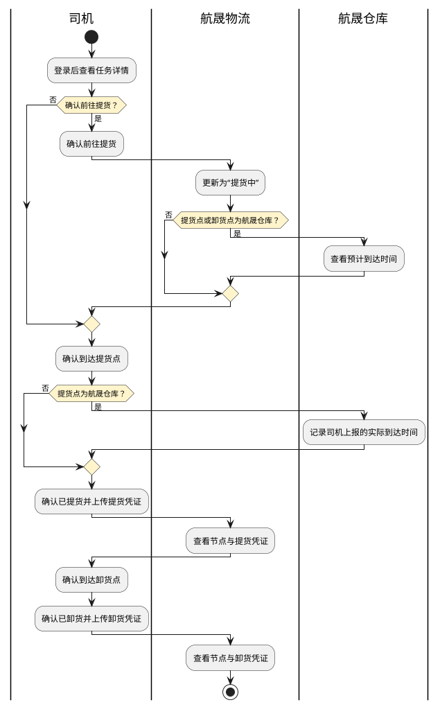
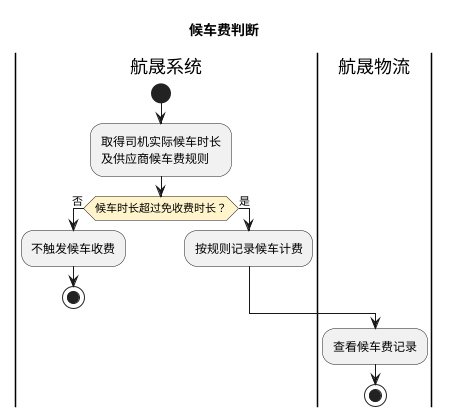
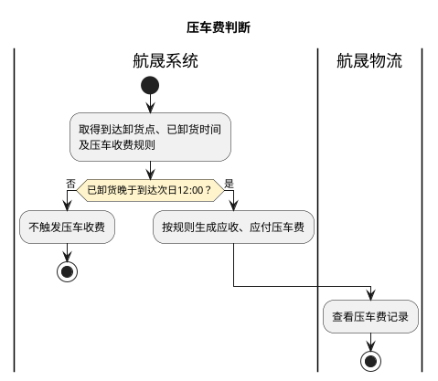
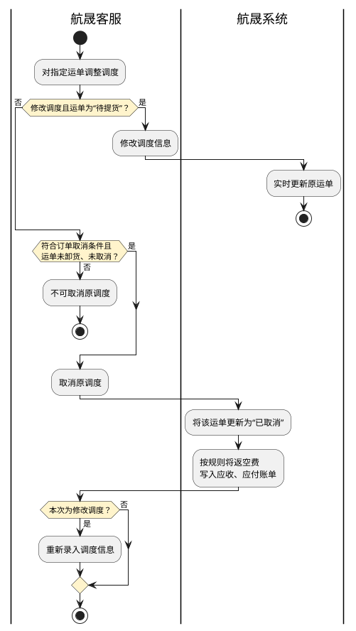
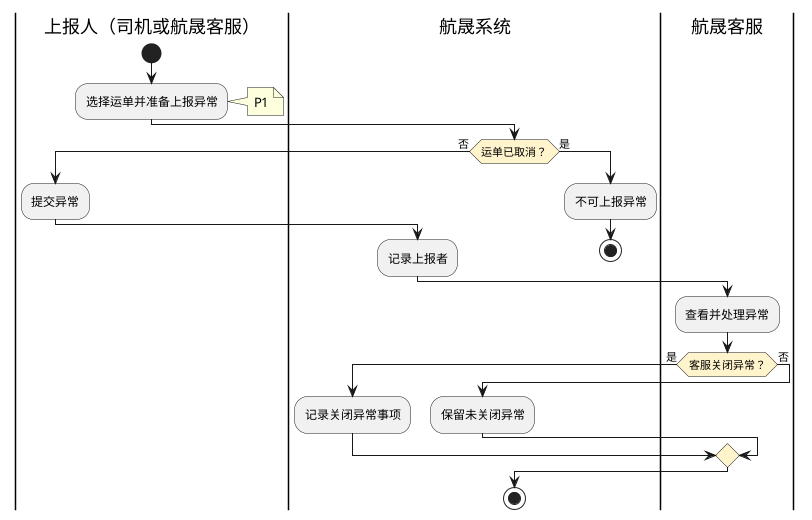

# 第016篇

> 本篇定位：用车-运单管理；主要内容：运单状态、轨迹、应收应付、异常与中转；文档角色：模块档；文档ID：20AA542560

**关联业务主流程：** [业务模式主流程总览](mainflow/PRD.高捷物流系统一期.主流程.01.业务模式主流程总览.md#mainflow-01)、[跨境电商 BC 与个人物品 CC 进口流程](mainflow/PRD.高捷物流系统一期.主流程.05.跨境电商BC、个人物品CC进口详细流程.md#mainflow-05)、[跨境电商 BBC 进口入出区与调拨流程](mainflow/PRD.高捷物流系统一期.主流程.06.跨境电商BBC进口详细流程.md#mainflow-06)、[跨境电商 BBC 进口特殊业务流程](mainflow/PRD.高捷物流系统一期.主流程.06.跨境电商BBC进口详细流程.md#mainflow-07)、[异常处理流程](mainflow/PRD.高捷物流系统一期.主流程.09.异常处理流程.md#mainflow-09)。
**关联模块流程：** [运单管理流程](#doc-20AA542560-section-df85abad663f)、[中转仓用车流程](PRD.高捷物流系统一期.第033篇.DDP跨模块作业与结算流程.7579B595B8.md#doc-7579B595B8-section-e4cd43033ac4)。

## 1. 用车-运单管理

**业务入口：** 运输运单页面。

**概念模型：** [数据字典 · 地面运输与仓储实体](PRD.高捷物流系统一期.第034篇.数据字典.7A3D9E1F50.md#doc-7A3D9E1F50-domain-ground-warehouse)

### 1.1 页面交互规则

#### 1.1.1 通用页面行为

- 运单列表默认分页显示，每页 50 条记录。

- 创建运单时提供“提交”和“取消”按钮；修改运单时提供“保存”和“取消”按钮。

- 提交成功后，页面短暂显示“已提交成功！”。

- 输入内容不符合格式要求或必填项为空时，对应输入项高亮提示，“提交”和“保存”按钮置灰且不可点击。

### 1.2 业务范围、角色与流程

#### 1.2.1 业务目标与范围

运单管理覆盖运输运单和中转运单的查询、状态跟踪、费用、异常、单据及轨迹管理。

#### 1.2.2 操作入口

| 系统 | 一级菜单 | 二级菜单 | 说明 |
| --- | --- | --- | --- |
| 航晟物流工作台 | 订单管理 | 运输运单 | 展示除中转仓订单以外的运单，此部分订单需要客服通过调度操作生成。 |
| 航晟物流工作台 | 订单管理 | 中转运单 | 特定展示中转仓运单的类型，此部分订单不需要客服人员手动调度来生成。 |

#### 1.2.3 受控术语

受控术语定义见 [数据字典 · 受控业务术语](PRD.高捷物流系统一期.第034篇.数据字典.7A3D9E1F50.md#doc-7A3D9E1F50-domain-values)。

#### 1.2.4 角色与权限

| 用户角色 | 描述 |
| --- | --- |
| 管理员 | 可查看运单。 |
| 客服 | 可查看运单。 |

#### 1.2.5 运单履约与司机反馈流程

司机正常履约时，节点与凭证反馈给航晟物流，航晟仓库可查看与本仓相关的到达信息；该交接顺序不表示后台强制校验节点顺序。

候车与压车按各自条件独立判断，不作为继续运输的前置审批；异常上报和客服处理见[逆向流程节点说明](#doc-20AA542560-section-731d67f1818c)。

| 环节 | 参与方 | 处理与结果 | 后续环节 |
| --- | --- | --- | --- |
| 1. 查看运单列表 | 航晟物流 | 提供运单列表，可以查看各运单，并进行灵活的筛选和搜索。 | 2 |
| 2. 查看运单详情 | 航晟物流 | 运单详情提供运单状态和司机反馈的详细信息记录。 | 3 |
| 3. 运单状态：提货中 | 航晟物流 | 司机确认前往提货后，运单状态变更为“提货中”。该状态用于提供更细致的履约跟进信息，不是必经状态。 | 4 |
| 4. 轨迹查看 | 航晟物流 | 基于司机反馈的状态数据和GPS的轨迹数据，可以查看更详细的运输轨迹。 | 12 |
| 5. 登录小程序 | 司机 | 司机通过手机号和验证码的方式登录司机端小程序。 | 6 |
| 6. 查看任务列表 | 司机 | 司机可查看自己的当前进行中和历史已完成的任务列表清单。 | 7 |
| 7. 查看任务详情 | 司机 | 司机也可对具体的任务，查看详情，了解任务的明细介绍。 | 8 |
| 8. 开始前往提货 | 司机 | 司机可在司机端小程序确认状态：开始前往提货。 | 9或10 |
| 9. 到达仓库 | 司机 | 司机到达仓库，需要在小程序进行确认，此时间将用于计算候车费等。 | 4或11或13 |
| 10. 到达预报（提货&卸货） | 航晟仓库 | 所有提货点和卸货点是航晟仓库的运单，其预计的到达时间显示给仓库。 | 13 |
| 11. 候时>免收费时长？ | 司机 | 系统根据供应商的候车费计算规则和司机实际候车时长，判断是否收取候车费。 | 12 |
| 12. 候车记录与候车计费 | 航晟物流 | 可以查看该运单所产生的候车费记录。 | 15 |
| 13. 实际到达 | 航晟仓库 | 记录司机自行上报的实际到达仓库时间。 |  |
| 14. 压车？ | 司机 | 系统结合供应商的压车收费规则，判断是否收取压车费。 | 15 |
| 15. 压车记录与压车计费 | 航晟物流 | 可以查看该运单所产生的压车费记录。 | 17 |
| 16. 已提货（上传提货凭证） | 司机 | 司机需要通过小程序上传提货的凭证单据。 | 17或18 |
| 17. 运单状态：已提货（查看凭证） | 航晟物流 | 可以查看该运单所产生的提货凭证记录。 | 19 |
| 18. 是否上报异常？ | 司机 | 司机通过小程序上报运输异常。 | 20 |
| 19. 查看并处理异常 | 航晟物流 | 查看并处理该运单的异常上报记录。 | 21 |
| 20. 到达卸货点 | 司机 | 司机到达卸货点后，在小程序中确认提交。 | 22 |
| 21. 运单状态：已到达卸货点 | 航晟物流 | 将运单状态更新为“已到达卸货点” | 23 |
| 22. 已卸货（上传卸货凭证） | 司机 | 司机需要通过小程序上传卸货的凭证单据。 | 23 |
| 23. 运单状态：已完成（查看凭证） | 航晟物流 | 可以查看该运单所产生的卸货凭证记录。 |  |

#### 1.2.6 逆向流程节点说明

调度修改优先判断运单所处阶段；不能直接修改时，先按取消资格处理原调度。

异常处理是履约之外的独立分支。

- P1：异常未关闭也不阻止司机继续确认运输节点。

| 异常节点 | 前置条件 | 后续处理 |
| --- | --- | --- |
| 取消调度 | 结合订单管理PRD中说明的订单取消场景。 此外，运单状态=已卸货或已取消，则不可取消调度。 | 一旦调度取消，运单状态更新为“已取消”。系统根据表价管理中的“返空费比例”乘以运输费（提货总价模式下），自动算出返空费金额，写入该运单的应收付账单中。 |
| 修改调度 | 仅在运单状态为“待提货”时允许修改调度；其他状态下需先取消调度，再重新录入调度信息。 | 修改后的调度信息实时更新至原运单。 |
| 异常上报 | 运单状态不为“已取消”时，司机或航晟客服可对指定运单上报异常。 |  |

#### 1.2.7 场景举例

同一订单包含已卸货运单和履约中运单时，取消操作按各运单分别处理。

| 业务输入或操作 | 处理结果 |
| --- | --- |
| 订单为“已调度”或“异常中”；下属3个运单中，1个已卸货，2个提货中 | 发起取消订单操作。 |
| 取消订单 | 订单状态更新为“已取消”。 |
| 原已卸货的1个运单 | 状态和已生成的应收、应付记录不变。 |
| 原提货中的2个运单 | 均更新为“已取消”，并分别生成应收、应付返空费。 |

### 1.3 用车运单管理功能与规则

#### 1.3.1 运输运单页面

- 查看除中转仓运单以外的所有运单。

#### 1.3.2 运单状态定义

| 运单状态 | 触发场景1 | 触发场景2 |
| --- | --- | --- |
| 待提货 | 调度完成或修改调度，初始运单状态=待提货 |  |
| 提货中 | 司机在小程序手动确认“前往提货” | 客服在后台手动修改运单状态 |
| 到达提货点 | 司机于小程序，手动确认“到达提货点” |  |
| 已提货 | 司机于小程序，手动确认“已提货” |  |
| 到达卸货点 | 司机于小程序，手动确认“到达卸货点” |  |
| 已卸货 | 司机于小程序，手动确认“已卸货” |  |
| 已取消 | 该调度运单被取消 |  |

#### 1.3.3 运输运单筛选栏界面原型概述

**界面原型概述 · 运输运单筛选栏**

- **区域字段或业务元素**：委托方、供应商、车型、特种车、尾板车、监管车、随货资料、运单状态、提货日期、异常状态、查询输入项。

| 字段或控件特例 | 特例约束或业务结果 |
| --- | --- |
| 委托方 | 取运单上的委托方去重列表；默认值：全部。 |
| 供应商 | 取运单上的供应商去重列表；默认值：全部。 |
| 车型 | 1.5T/0.6；3T/4.2；5T/7.0；8T/7.6；10T/9.6；40/45HQ；17.5米/平板；17.5米/厢车；12米平板；默认值：全部。 |
| 特种车 | 危险品；冷藏车；气垫车；平板车；默认值：全部。 |
| 尾板车、监管车 | 1. 是；2. 否；默认值：全部。 |
| 随货资料 | 1. 有；2. 无；默认值：全部。 |
| 运单状态 | 待提货；提货中；到达提货点；已提货；到达卸货点；已卸货；异常中；已取消；默认值：全部。 |
| 提货日期 | 此筛选项留空，则搜索提供全部日期的记录；默认值：当天日期。 |
| 异常状态 | 1.异常中；2.异常已关闭；默认值：全部。 |
| 查询输入项 | 支持运单号/订单号/车牌号的精准搜索。 |

#### 1.3.4 运输运单列表栏界面原型概述

**界面原型概述 · 运输运单列表栏**

- **区域字段或业务元素**：运单号、委托方、订单号、供应商、车牌号、运单状态、提货时间、车型、监管车、尾板车、特种车、司机及联系方式、预计件数(件）、预计体积（m³）、预计重量（kg)、预计尺寸、预计到达时间、异常状态、随货资料、备注、操作。

| 字段或控件特例 | 特例约束或业务结果 |
| --- | --- |
| 运单号 | 在调度提交时，自动生成：D+单据类型（201）+YYMMDD（6位）+5位流水；展示值：D20120121700001。 |
| 委托方 | 取订单与调度信息。 |
| 司机及联系方式 | 将司机姓名和联系方式合并；展示值：司机姓名与联系电话按“姓名：电话”格式合并展示。 |
| 预计件数(件） | 调度结果；计算口径见[用车运单业务规则](PRD.高捷物流系统一期.第016篇.用车-运单管理.20AA542560.md#doc-20AA542560-section-de63dd420873)；列表直接取调度阶段的计算结果；展示值：四舍五入正整数。 |
| 预计体积（m³）、预计重量（kg) | 保留 2 位小数。 |
| 预计到达时间 | 司机确认时间与位置、高德预计时长；计算口径见[用车运单业务规则](PRD.高捷物流系统一期.第016篇.用车-运单管理.20AA542560.md#doc-20AA542560-section-de63dd420873)；格式：YYYY-MM-DD HH:mm。 |
| 异常状态 | 异常中：上报异常且未关闭；异常已关闭：所有上报的异常均已关闭；留空显示：未上报过异常。 |
| 随货资料 | 司机小程序提交，若当前未提交，则留空显示；展示值：1. 有 2. 无。 |
| 备注 | 取调度时录入的备注信息。 |
| 操作 | 查看详情、状态管理；显示规则见[用车运单业务规则](PRD.高捷物流系统一期.第016篇.用车-运单管理.20AA542560.md#doc-20AA542560-section-de63dd420873)。 |

#### 1.3.5 运输运单列表规则

查看运单列表信息，提供快捷筛选操作等。

**参与方：** 航晟物流客服

**入口与前提：** 调度完成，自动实时生成相应运单，进入运单管理页面可统一查看运单。

**业务结果：** 运单数据准确，筛选与操作功能可正常使用。

**处理规则**

**页面排序规则**

- 每页默认显示50条记录；

- 按运单生成时间（调度时间）与当前时间的差值升序排列；

1. “状态管理”按钮：供客服人工更新运单状态。

- 运单状态为“已卸货”或“已取消”时，该运单行“操作”项下不再显示“状态管理”按钮。

- 操作时间：记录所选运单状态的变更时间，默认为当前操作时间，可编辑。

- 保存提交后，返回当前页面并更新运单状态，同时记录操作时间和备注信息。

**分支与边界：** 中转运单的页面结构类似，仅部分字段有差异。

补充计算规则：

- 预计件数（件）：调度时，若为该调度记录录入了特定毛件体，则显示该值。若未录入，则毛件体分别除以该订单下的总车辆数，尺寸字段留空；结果四舍五入取正整数。该值在订单调度时计算，列表直接展示计算结果。
- 预计到达时间：若当前运单司机尚未确认前往提货，则留空；确认后，取确认时间加上地图服务根据当前位置与提货地点计算的预计行程时长。

#### 1.3.6 运单详情-轨迹记录页面

- 提供该运单各状态和节点的变化记录。

#### 1.3.7 运单轨迹记录规则

查看运单详情，了解该运单的状态和节点变化记录。

**参与方：** 航晟客服

**入口与前提：** 从运单列表页面的“查看详情”进入

**业务结果：** 各轨迹状态和节点记录准确

**处理规则**

1. 运单详细信息的取值规则与运单列表一致：有值时显示，无值时留空。该区域默认展开；点击右上角的“收起运单信息”后收起，按钮变为“展开运单信息”，再次点击后展开详情。

**轨迹记录包含以下类型**

- 调度完成：备注取调度备注，操作人取调度操作人；

- 前往提货、到达提货点、已提货、到达卸货点、已卸货、上报异常：司机通过小程序确认节点时，记录司机的操作信息；航晟客服通过后台“状态管理”操作时，记录客服的操作信息。

- 已取消：航晟客服取消已调度记录后，备注取取消调度时填写的内容。

- 取消异常：航晟客服取消运单异常状态后，备注取取消异常时填写的内容。

**分支与边界：** 轨迹事件的触发者是谁，则记录操作人账户是谁，如操作人为“司机”、“航晟客服”或“WMS”。

**专项规则：** 航晟客服可通过后台“状态管理”修改状态节点，因此系统不校验轨迹事件的节点顺序。

**业务衔接：** 详情页面头部均显示“运单状态”+“异常状态”信息。

#### 1.3.8 运单详情-应收付账单页面

- 基于运单维度，展示运单的应收付账单，并支持新增和修改。

#### 1.3.9 系统自动计算费用

| 类型 | 费用科目 | 应收付账单 | 触发场景 | 判断逻辑 | 计算公式 | 备注 |
| --- | --- | --- | --- | --- | --- | --- |
| 运输订单 | 运输费 | 应收 | 每个运单状态更新到“已卸货”时，自动生成。 | 能否匹配上供应商、车型、提货点、卸货点、特种车、监管车、尾板车、运输类型 | 取可以匹配上的客户表价记录上的“运输费”。 | 1. 表价维护时，特种车、监管车、尾板车和运输类型均为选填项。 2. 运输订单/中转订单上的特种车、监管车、尾板车和运输类型字段单个或多个无值时，优先匹配相应无值的表价记录。若无法完全匹配，则可匹配“监管车”=否、“尾板车”=否的相应表价记录。若仍无法匹配，则由客服人工录入结算运输费。 3. 运输订单/中转订单上的特种车、监管车、尾板车和运输类型字段单个或多个有特定值时，若无法匹配相应特定类型的表价记录，即为匹配失败，由客服人工录入结算运输费。 |
| 中转订单 | 运输费 | 应收 |  | 能否匹配上供应商、车型、提货点、卸货点、特种车、监管车、尾板车、运输类型 | 取可以匹配上的客户表价记录上的“单价”*重量（出库时的重量），与供应商表价上的“起步价”对比，不足起步价，取起步价；超过起步价，则取计算结果。 |  |
| 运输订单 | 运输费 | 应付 | 每个运单状态更新到“已卸货”时，自动生成。 | 能否匹配上客户、车型、提货点、卸货点、特种车、监管车、尾板车、运输类型 | 取可以匹配上的供应商表价记录上的“运输费”。 |  |
| 中转订单 | 运输费 | 应付 |  | 能否匹配上客户、车型、提货点、卸货点、特种车、监管车、尾板车、运输类型 | 取可以匹配上的供应商表价记录上的“单价”*重量（出库时的重量），与供应商表价上的“起步价”对比，不足起步价，取起步价；超过起步价，则取计算结果。 |  |
| 运输订单/中转订单 | 压车费 | 应收 | 取系统记录的“已到达卸货点”和“已卸货”两个状态时间；若已卸货时间晚于到达卸货点次日12:00，则系统自动生成应收、应付压车费。 | 能否匹配上供应商、车型、提货点、卸货点、特种车、监管车、尾板车、运输类型 | 取可以匹配上的客户表价记录上的“压车费”。 |  |
| 运输订单/中转订单 | 压车费 | 应付 |  | 能否匹配上客户、车型、提货点、卸货点、特种车、监管车、尾板车、运输类型 | 取可以匹配上的供应商表价记录上的“压车费”。 |  |
| 运输订单/中转订单 | 返空费 | 应收 | 对原调度执行“取消调度”后，系统自动生成应收、应付返空费。 | 能否匹配上供应商、车型、提货点、卸货点、特种车、监管车、尾板车、运输类型 | 取匹配到的客户表价记录中的“返空费（%）”，返空费=返空费（%）×运输费（运输费公式见上述内容）。 |  |
| 运输订单/中转订单 | 返空费 | 应付 |  | 能否匹配上客户、车型、提货点、卸货点、特种车、监管车、尾板车、运输类型 | 取匹配到的供应商表价记录中的“返空费（%）”，返空费=返空费（%）×运输费（运输费公式见上述内容）。 |  |

#### 1.3.10 运单应收付账单规则

查看基于运单维度的应收和应付账单信息。

**参与方：** 航晟客服

**入口与前提：** 司机或客服录入的杂费单据信息，将自动生成相应的应收付记录。

**业务结果：** 此运单完整的应收付账单信息得到正确地展示。

**处理规则**

1. 司机通过小程序或航晟客服通过后台录入杂费单据时，必须填写杂费金额。航晟客服审批通过后，如审批时修改了杂费金额，则以修改后的金额为准；系统据此生成应收和应付账单记录。已审批通过的杂费单据不可在原记录上直接修改，如需调整，应创建调整单。

- 应收、应付科目：取所选杂费类型；

- 应收、应付金额：取审批通过的杂费金额。

1. 司机通过小程序上报杂费后，航晟客服通过单据管理页面审批上报金额。

1. 在运单的应收、应付账单中，只能新增应付记录，不能新增应收记录。新增运单应付记录后，订单的应收、应付账单同步新增该运单的应付汇总记录。

**分支与边界：** 订单维度的应收付账单与下属各运单的应收付账单，均保持汇总一致。

#### 1.3.11 异常管理页面

- 查看所有异常记录，并可取消异常。

#### 1.3.12 “异常管理”页签字段定义

**界面原型概述 · 异常管理列表栏**

- **区域字段或业务元素**：异常类别、异常状态、异常内容、上报图片、异常上报时间、操作。

| 字段或控件特例 | 特例约束或业务结果 |
| --- | --- |
| 异常类别 | 1.货物破损；2.车辆事故；3.预计延误；4.无法联系；其它；异常上报时候选项。 |
| 异常状态 | 异常中；已关闭；（留空）。 |
| 异常内容 | 异常上报时填写。 |
| 异常上报时间 | 取异常提交时间；YYYY-MM-DD HH:mm。 |
| 操作 | 取消异常；显示规则见[用车运单业务规则](PRD.高捷物流系统一期.第016篇.用车-运单管理.20AA542560.md#doc-20AA542560-section-19313adccda8)。 |

#### 1.3.13 新增异常-字段定义

**界面原型概述 · 新增异常**

- **区域字段或业务元素**：异常类型、上传图片、备注。

| 字段或控件特例 | 特例约束或业务结果 |
| --- | --- |
| 异常类型 | 1.货物破损；2.车辆事故；3.预计延误；4.无法联系；5.其它；必填；初始不设值。 |
| 上传图片 | 最多可上传9张图片，单张图片大小限制<=6M，格式jpg、png、bmp；选填。 |
| 备注 | 长度限制：2～500 个字符；选填。 |

#### 1.3.14 异常管理规则

查看司机或航晟客服录入的异常上报记录，并可取消异常状态。

**参与方：** 航晟客服

**入口与前提：** 进入运单详情页面并切换到“异常管理”页签。

**业务结果：** 异常记录显示准确，客服可在后台上报异常并取消异常状态。

**处理规则**

1. “异常中”记录置顶显示；同类记录按上报时间倒序排列。

1. 点击页签右上角的“+异常”，客服可在后台录入异常。司机在小程序查看该运单详情时，可以看到客服录入的异常记录。

1. 点击异常记录中的图片，系统在当前页面弹窗放大图片；用户可关闭弹窗。

1. 航晟客服可对指定的上报异常执行“取消异常”。取消后异常关闭，运单从“异常中”恢复为发生异常前的状态。

- 备注：可选，长度为 2～500 个字符。

- 取消异常后，运单的“轨迹记录”页签生成取消异常记录。

**分支与边界：** 运单异常状态会同步影响所属订单状态，订单状态规则见[用车订单状态定义](PRD.高捷物流系统一期.第015篇.用车-订单管理.32C78B8106.md#doc-32C78B8106-section-22c036104a98)。

#### 1.3.15 运单详情-单据管理页面

- 基于运单查看该运单已上报的单据明细。

#### 1.3.16 新增单据字段定义

**界面原型概述 · 新增单据**

- **区域字段或业务元素**：单据类型、上传图片、备注、杂费类型、杂费金额（元）。

| 字段或控件特例 | 特例约束或业务结果 |
| --- | --- |
| 单据类型 | 提货单据；卸货单据；杂费单据；其他单据；必填；初始不设值。 |
| 上传图片 | 最多可上传9张图片，单张图片大小限制<=6M，图片格式限jpg、png和bmp；选填。 |
| 备注 | 长度限制：2～500 个字符；选填。 |
| 杂费类型 | 压车费；报关费；清关费；装卸费；路桥费；候时费；返空费；过磅费；入闸费；停车费；登记费；其他费用；（取《基本信息管理 / 部门成本项目维护》中的“航晟车队”科目，并剔除“运输费”、“返空费”）；必填规则：杂费单据类型下，必填；初始不设值。 |
| 杂费金额（元） | 正数值，支持小数点后2位；必填规则：杂费单据类型下，必填。 |

#### 1.3.17 查看单据字段定义

**界面原型概述 · 查看单据**

- **区域字段或业务元素**：单据类型、描述、杂费类型、杂费金额（元）、图片、杂费审批状态、操作人、操作时间、操作。

| 字段或控件特例 | 特例约束或业务结果 |
| --- | --- |
| 单据类型 | 司机上报单据所选的类型。 |
| 描述 | 司机上单据所填的备注。 |
| 杂费类型 | 若所选的是杂费单据，则选择的杂费类型。 |
| 杂费金额（元） | 若所选的是杂费单据，则上报填写的杂费金额。 |
| 图片 | 司机上单据所传的图片。 |
| 杂费审批状态 | 待审批、通过、驳回、修改通过；流转规则见[用车运单业务规则](PRD.高捷物流系统一期.第016篇.用车-运单管理.20AA542560.md#doc-20AA542560-section-0989eafeb0d7)。 |
| 操作人 | 上报者或审批者；取值规则见[用车运单业务规则](PRD.高捷物流系统一期.第016篇.用车-运单管理.20AA542560.md#doc-20AA542560-section-0989eafeb0d7)。 |
| 操作时间 | 即更新时间，司机的上报时间或审批时间（如有）。 |
| 操作 | 修改、删除、审批；显示规则见[用车运单业务规则](PRD.高捷物流系统一期.第016篇.用车-运单管理.20AA542560.md#doc-20AA542560-section-0989eafeb0d7)。 |

#### 1.3.18 单据管理规则

查看所有已上报单据，并可新增单据。

**参与方：** 航晟客服

**入口与前提：** 进入运单详情并切换到“单据管理”页签。

**业务结果：** 单据按类型和更新时间展示；航晟客服可新增单据并审批杂费单据。

**处理规则**

1. 单据按更新时间升序排列。

1. 仅当“单据类型”为“杂费单据”时显示“杂费类型”和“杂费金额”，其他类型不显示这两个字段。

1. 点击单据图片后，系统弹窗放大显示图片。

1. 新增或修改杂费单据的科目与金额时，系统同步更新该运单对应科目的应收、应付记录。

1. 航晟客服点击“+单据”提交新单据；选择“杂费单据”时，必须填写“杂费类型”和“杂费金额”。

1. 修改普通单据时，点击图片下方的“删除”可删除已上传图片。

**航晟客服点击“审批”处理杂费单据**

- 审批结果必填；选择“通过并修改金额”时，修改后金额必填。

- 审批备注选填，支持多行文本。

杂费单据审批与操作规则：

- 杂费审批状态：审批前为“待审批”；审批通过为“通过”；审批不通过为“驳回”；审批通过但修改了杂费金额为“修改通过”。
- 操作人：司机上报且尚未审批时显示司机姓名；审批后显示审批人账户 ID；航晟客服自行提交的单据无需审批，显示提交人的账户 ID。
- 操作：非杂费单据显示“修改”和“删除”；杂费单据审批前显示“审批”，审批后不显示操作按钮。

#### 1.3.19 中转运单管理

- 管理由中转订单形成的中转运单。

#### 1.3.20 中转运单筛选栏界面原型概述

**界面原型概述 · 中转运单筛选栏**

- **区域字段或业务元素**：委托方、供应商、车型、特种车、尾板车、监管车、随货资料、运单状态、提货日期、查询输入项、异常状态。

| 字段或控件特例 | 特例约束或业务结果 |
| --- | --- |
| 委托方、供应商 | 默认值：全部。 |
| 车型 | 1.5T/0.6；3T/4.2；5T/7.0；8T/7.6；10T/9.6；40/45HQ；17.5米/平板；17.5米/厢车；12米平板；默认值：全部。 |
| 特种车 | 危险品；冷藏车；气垫车；平板车；默认值：全部。 |
| 尾板车、监管车 | 1. 是；2. 否；默认值：全部。 |
| 随货资料 | 1. 有；2. 无；默认值：全部。 |
| 运单状态 | 待提货；提货中；到达提货点；已提货；到达卸货点；已卸货；异常中；已取消；默认值：全部。 |
| 提货日期 | 默认值：当天日期。 |
| 查询输入项 | 支持运单号/订单号/车牌号/封条号的精准搜索。 |
| 异常状态 | 1. 异常中；1. 异常已关闭；1. （空白）；默认值：全部。 |

#### 1.3.21 中转运单列表栏界面原型概述

**界面原型概述 · 中转运单列表栏**

- **区域字段或业务元素**：运单号、封条号、委托方、订单号、分单号、供应商、车牌号、运单状态、提货时间、车型、监管车、尾板车、特种车、司机及联系方式、预计件数(件）、预计体积（m³）、预计重量（kg)、预计尺寸、随货资料、异常状态、备注、操作。

| 字段或控件特例 | 特例约束或业务结果 |
| --- | --- |
| 运单号 | 在调度提交时，自动生成。 |
| 封条号 | WMS回传。 |
| 委托方 | 取订单与调度信息。 |
| 司机及联系方式 | 将司机姓名和联系方式合并；展示值：司机姓名与联系电话按“姓名：电话”格式合并展示。 |
| 预计件数(件） | 调度结果；计算口径见[用车运单业务规则](PRD.高捷物流系统一期.第016篇.用车-运单管理.20AA542560.md#doc-20AA542560-section-9bdf355a4f45)；展示值：四舍五入正整数。 |
| 预计体积（m³）、预计重量（kg) | 保留 2 位小数。 |
| 随货资料 | 司机小程序提交，若当前未提交，则留空显示；展示值：1. 有 2. 无。 |
| 异常状态 | 异常中：上报异常且未关闭；异常已关闭：所有上报的异常均已关闭；留空显示：未上报过异常。 |
| 备注 | 系统预警备注；触发与派车时限规则见[用车运单业务规则](PRD.高捷物流系统一期.第016篇.用车-运单管理.20AA542560.md#doc-20AA542560-section-9bdf355a4f45)。 |
| 操作 | 查看详情、状态管理；显示规则见[用车运单业务规则](PRD.高捷物流系统一期.第016篇.用车-运单管理.20AA542560.md#doc-20AA542560-section-de63dd420873)。 |

#### 1.3.22 中转运单列表规则

将上游系统自动传输过来的且订单类型为“中转订单”，由此自动生成的相应中转运单进行统一管理。

**参与方：** 航晟客服

**入口与前提：** 接收WMS回传的调度信息，将其自动匹配，并由此生成相应的中转运单。

**业务结果：** 调度信息可以自动匹配，且正确生成相应的中转运单。

**处理规则**

1. 中转运单的生成：自动接收WMS回传的订单号、车牌号、封条号、供应商名称的信息，对匹配上的订单号进行自动调度。

- 此场景下，原中转订单上新增相应的调度记录，调度操作人记录为“WMS”，事件时间取接收到WMS消息的时间。

- 此场景下，生成的相应运单的状态，初始为“已提货”。

- 若有无法匹配到的“订单号”，则需要将此信息反馈回WMS。

1. 新增封条号信息：WMS 的一份报文中包含一个封条号，表示该批货物由同一辆车运输。中转运单列表展示该封条号，以便查询。

**专项规则**

接收 WMS 调度信息时，出现以下任一情况则向 WMS 反馈错误：

1. 无法匹配状态为“待调度”且订单号相同的中转订单；

1. 供应商名称与合作方档案管理中的数据不匹配；

1. 车牌号或供应商名称未传值，或传值不符合规范。

补充计算与预警规则：

- 预计件数（件）：调度时，若为该调度记录录入了特定毛件体，则显示该值。若未录入，则毛件体分别除以该订单下的总车辆数，尺寸字段留空；结果四舍五入取正整数。
- 截单时间预警：航班起飞时间-当前时间<=11小时且运单状态=“待提货”，则自动加入红色的备注信息“截单时间临近”。航班起飞前10个小时必须中转派车。

#### 1.3.23 中转运单-运单详情

- 中转运单详情的页面结构与运输运单详情基本一致，仅增加“封条号”字段。

#### 1.3.24 中转运单详情规则

展示运单详情、轨迹记录、应收付账单、异常管理和单据管理。

**参与方：** 航晟客服

**入口与前提：** 从中转运单列表页面中的“操作”项下的“查看详情”按钮进入。

**处理规则**

1. 运单详细信息新增展示“封条号”字段。

1. WMS 反馈的调度信息匹配成功后，中转运单自动生成“调度完成”和“已提货”两条轨迹记录。

1. 应收、应付账单复用运输运单的应收、应付页面。

- 提货费=提货重量（WMS 出库重量）×对应客户或供应商的报价单价。供应商报价配置为 0 元/kg 时，应付提货费为 0 元。

1. 异常管理复用运输运单的异常管理页面，支持在后台录入异常。

1. 单据管理复用运输运单的单据管理页面，支持在后台上传新单据。

#### 1.3.25 订单提货费汇总与结算展示

DDP结算流程按供应商报价和客户报价生成订单默认账单，提货费汇总与展示采用以下规则。

| 规则 | 处理与结果 |
| --- | --- |
| 单车提货费 | 直接取提货费；按重量计价时，先计算“单价×重量”，再与最小收费比较，得到单车提货费。 |
| 订单总提货费 | 将各项“单车提货费×车辆数量”的结果累加。 |
| 应收、应付车型 | 应收与应付采用的车型可以不同，客服可分别调整。 |
| 人工杂费 | 客服可手工录入杂费。 |
| 司机反馈费用 | 司机反馈的候车时长和压车数据进入应收、应付账单。 |
| 结算对象 | 应收、应付账单完整显示结算对象名称。 |
