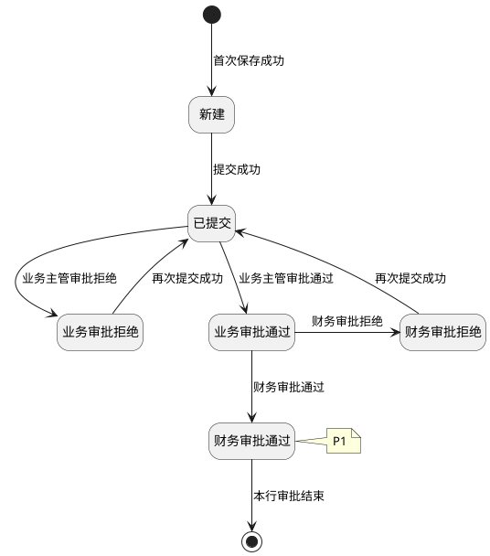

# 第023篇

> 本篇定位：财务结算-订单成本管理；主要内容：成本来源、审批、结算明细、调整单与查询；文档角色：模块档；文档ID：70AD0AF66B

**关联业务主流程：** [税金管理与财务结算流程](mainflow/PRD.高捷物流系统一期.主流程.08.税金管理与财务结算流程.md#mainflow-08)。
**关联模块流程：** [结算管理流程](PRD.高捷物流系统一期.第033篇.DDP跨模块作业与结算流程.7579B595B8.md#doc-7579B595B8-section-a5b92ee23329)。

## 1. 财务结算-订单成本管理

**业务入口：** 订单成本页面。

**概念模型：** [数据字典 · 财务结算实体](PRD.高捷物流系统一期.第034篇.数据字典.7A3D9E1F50.md#doc-7A3D9E1F50-domain-finance)

### 1.1 结算业务范围、角色与流程

#### 1.1.1 业务目标与范围

订单成本管理覆盖应收、应付结算明细的新增、调整、提交、审批和查询。

#### 1.1.2 财务结算共用入口与流程

财务结算的跨模块导航与流程见[财务结算操作入口](PRD.高捷物流系统一期.第022篇.财务基础与结算流程.40E841D3A6.md#doc-40E841D3A6-section-3561f6529077)、[财务结算操作权限](PRD.高捷物流系统一期.第035篇.角色与访问权限.5E31456F30.md#doc-5E31456F30-finance-actions)、[应收结算流程](PRD.高捷物流系统一期.第022篇.财务基础与结算流程.40E841D3A6.md#doc-40E841D3A6-section-23c66131aa44)、[应付结算流程](PRD.高捷物流系统一期.第022篇.财务基础与结算流程.40E841D3A6.md#doc-40E841D3A6-section-0f97b5b6d534)。

#### 1.1.3 订单成本金额与汇率规则

本规则适用于应收、应付成本的新增和编辑，以及包含对应字段的调整单明细：

- 应收成本行的单价参考值（人民币）＝应付栏相同成本项目行的人民币金额合计÷数量合计。该值仅在页面展示，不保存；点击后将其带入含税单价（原币）。
- 总金额（原币）＝含税单价（原币）×数量，系统自动计算；调整单在保存时同步更新。
- 即期汇率按币种和成本行创建日期从即期汇率表取得。约定汇率默认等于即期汇率，允许修改；新增时修改币种，系统同步更新即期汇率和约定汇率。
- 约定汇率超即期汇率（%）＝（约定汇率－即期汇率）÷即期汇率×100。
- 约定汇率超即期汇率（%）大于 3 时，该值高亮；提交审批时提示“行号 + （子）单号，约定汇率高于即期汇率 XX%”。
- 人民币金额＝总金额（原币）×约定汇率。
- 应收合计（CNY）为订单全部“应收”结算明细行的人民币金额之和；应付合计（CNY）为订单全部“应付”结算明细行的人民币金额之和；利润合计（CNY）＝应收合计（CNY）－应付合计（CNY）。

### 1.2 订单成本录入与审批

#### 1.2.1 订单列表页面

订单列表页面，可搜索所有“已完成”的订单信息，并基于订单录入应收、应付成本。

**操作与反馈**

- 查询：按填写的条件查询；未设置条件时查询全部记录。查询结果按照“业务日期”顺序排列。（业务日期为各订单服务完成的最终日期）

- 截止录入日期：按订单业务日期加 3 个工作日计算并展示。

- 重置：重置所有查询条件。

- 成本编辑：跳转“订单成本维护”界面。

**界面原型概述 · 订单列表查询栏**

- **区域字段或业务元素**：订单号、提单号、客户、业务类型、创建人、业务日期。
- **区域级通用规则**：查询条件均选填、无预设值。

| 字段或控件特例 | 特例约束或业务结果 |
| --- | --- |
| 订单号 | 填写订单号，支持模糊查询。 |
| 提单号 | 填写提单号，支持模糊查询。 |
| 客户 | 填写客户名称，支持模糊查询。 |
| 业务类型 | 支持模糊匹配；不选择则默认全部，支持模糊查询。 |
| 创建人 | 填写创建人，支持模糊查询。 |
| 业务日期 | 不选择默认全部日期。 |

（4）订单列表栏字段

每页显示50条

**界面原型概述 · 订单列表栏**

- **区域字段或业务元素**：订单号、业务类型、客户、创建人、业务日期、截止录入日期、提单号、审批备注。
- **区域级通用规则**：字段均只读。

| 字段或控件特例 | 特例约束或业务结果 |
| --- | --- |
| 订单号、业务类型、客户、创建人、业务日期、提单号 | 按查询条件展示匹配记录；未设置查询条件时展示全部记录。 |
| 截止录入日期 | 业务含义与计算规则见[订单成本列表规则](#doc-70AD0AF66B-section-5d608b45c471)。 |
| 审批备注 | 对应订单录入的审批意见。 |

#### 1.2.2 订单成本维护列表

订单列表展示需要录入成本的订单。点击“成本编辑”按钮，系统进入“订单成本维护列表”页面。

**操作与反馈**

- 提交：勾选对应数据，提交给主管、财务审核，弹出“提交确认”弹框。“已提交”、“业务审批通过”、“财务审批通过”状态下的行数据，无法再次提交。

- 返回：返回“订单列表”界面。

- 附件上传：上传该应收成本凭证。

- 编辑：弹出“订单成本编辑”弹框。“新建”、“业务审批拒绝”、“财务审批拒绝”3种状态的数据才有编辑功能，可对该行成本进行编辑修改。

- 删除：弹出“删除确认”弹框。“新建”、“业务审批拒绝”、“财务审批拒绝”3种状态的数据才有删除功能，可对该行成本进行删除操作。

- 保存：手工新增应收应付时，输入完成后，需进行“保存”操作。

#### 1.2.3 应收成本新增页面

订单成本维护列表界面，点击“新增应收”按钮，在最下方新增出一行。支持候选项选择录入多行应收。

**操作与反馈**

- 保存：保存该行数据，校验必填字段是否填写，若必填字段未填写，无法保存。

- 删除：删除本行新增数据。

**界面原型概述 · 应收成本行**

- **区域字段或业务元素**：序号、(子)单号、状态、结算单位、成本项目、成本属性、数量、计费单位、币种、税率(%)、含税单价(原币)、单价参考值 (人民币)、总金额(原币)、即期汇率、约定汇率、约定汇率超 即期汇率(%)、人民币金额、更新人、更新日期、备注、附件、审批备注。

| 字段或控件特例 | 特例约束或业务结果 |
| --- | --- |
| 序号 | 系统自动生成记录序号；只读。 |
| (子)单号 | 只能选择该订单以及该订单关联的子单；必填；无预设值；可编辑。 |
| 状态 | 系统默认；新增时状态默认“新建”；只读。 |
| 结算单位 | 也可手工录入关键字，支持模糊匹配；必填；无预设值；可编辑。 |
| 成本项目 | 也可手工录入关键字，支持模糊匹配；特殊说明：根据订单头的“业务类型”，在“业务类型与成本项关系”中查询与该“业务类型”关联的所有“成本项目”。若该类型下无该成本项目，需要联系IT或财务补充维护；必填；无预设值；可编辑。 |
| 成本属性 | 系统自动生成；点击“新增应收”，新增的成本属性默认为“应收”；当费用项目为“押金”时，需要对修改成本属性为“代收”；只读。 |
| 数量 | 必填；无预设值；可编辑。 |
| 计费单位 | 手工录入计费单位；必填；无预设值；可编辑。 |
| 币种 | 候选列表展示2列（币种代码、币种名称）；默认CNY；必填；有默认值；可编辑。 |
| 税率(%) | 根据合作方档案，在客户表中查询对应结算单位的税率；允许修改，选择；必填；有默认值；可编辑。 |
| 含税单价(原币) | 必填；无预设值；可编辑。 |
| 单价参考值 (人民币) | 系统自动生成；展示、取值与带入规则见[订单成本金额与汇率规则](#doc-70AD0AF66B-section-f3a6b8c29d10)；只读。 |
| 总金额(原币)、人民币金额 | 系统自动生成；计算规则见[订单成本金额与汇率规则](#doc-70AD0AF66B-section-f3a6b8c29d10)；只读。 |
| 即期汇率 | 系统自动生成；取值与联动规则见[订单成本金额与汇率规则](#doc-70AD0AF66B-section-f3a6b8c29d10)；只读。 |
| 约定汇率 | 默认值与联动规则见[订单成本金额与汇率规则](#doc-70AD0AF66B-section-f3a6b8c29d10)；必填；有默认值；可编辑。 |
| 约定汇率超 即期汇率(%) | 系统自动生成；计算、展示与提交提示见[订单成本金额与汇率规则](#doc-70AD0AF66B-section-f3a6b8c29d10)；只读。 |
| 更新人 | 系统自动生成；进行该新增操作对应的用户；只读。 |
| 更新日期 | 系统自动生成；进行该新增操作对应系统日期；只读。 |
| 备注 | 选填；无预设值；可编辑。 |
| 附件 | 可点击查看；手工上传附件，支持文本、图片格式；大小≤20M；选填；无预设值；可编辑。 |
| 审批备注 | 审批后根据审批意见自动带出；默认只展示最后一次审批的审批备注；只读。 |

#### 1.2.4 应付成本新增页面

订单成本维护列表界面，点击“新增应付”按钮，在最下方新增出一行。支持候选项选择录入多行应付。

**操作与反馈**

- 保存：保存该行数据，校验必填字段是否填写，若必填字段未填写，无法保存。

- 删除：删除本行新增数据。

**界面原型概述 · 应付成本行**

- **区域字段或业务元素**：序号、(子)单号、状态、结算单位、成本项目、成本属性、数量、计费单位、币种、税率(%)、含税单价(原币)、总金额(原币)、即期汇率、约定汇率、约定汇率超 即期汇率(%)、人民币金额、更新人、更新日期、备注、审批备注、附件。

| 字段或控件特例 | 特例约束或业务结果 |
| --- | --- |
| 序号 | 系统自动生成记录序号；只读。 |
| (子)单号 | 只能选择该订单以及该订单关联的子单；必填；无预设值；可编辑。 |
| 状态 | 系统默认；新增时状态默认“新建”；只读。 |
| 结算单位 | 也可手工录入关键字，支持模糊匹配；必填；无预设值；可编辑。 |
| 成本项目 | 也可手工录入关键字，支持模糊匹配；特殊说明：根据订单头的“业务类型”，在“业务类型与成本项关系”中查询与该“业务类型”关联的所有“成本项目”。若该类型下无该成本项目，需要联系IT或财务补充维护；必填；无预设值；可编辑。 |
| 成本属性 | 系统自动生成；点击“新增应付”，新增的成本属性默认为“应付”；当费用项目为“押金”时，需要对修改成本属性为“代付”；只读。 |
| 数量 | 必填；无预设值；可编辑。 |
| 计费单位 | 手工录入计费单位；必填；无预设值；可编辑。 |
| 币种 | 候选列表展示2列（币种代码、币种名称）；默认CNY；必填；有默认值；可编辑。 |
| 税率(%) | 根据合作方档案，在供应商表中查询对应结算单位的税率；允许修改，选择；必填；有默认值；可编辑。 |
| 含税单价(原币) | 必填；无预设值；可编辑。 |
| 总金额(原币)、人民币金额 | 系统自动生成；计算规则见[订单成本金额与汇率规则](#doc-70AD0AF66B-section-f3a6b8c29d10)；只读。 |
| 即期汇率 | 系统自动生成；取值与联动规则见[订单成本金额与汇率规则](#doc-70AD0AF66B-section-f3a6b8c29d10)；只读。 |
| 约定汇率 | 默认值与联动规则见[订单成本金额与汇率规则](#doc-70AD0AF66B-section-f3a6b8c29d10)；必填；有默认值；可编辑。 |
| 约定汇率超 即期汇率(%) | 系统自动生成；计算、展示与提交提示见[订单成本金额与汇率规则](#doc-70AD0AF66B-section-f3a6b8c29d10)；只读。 |
| 更新人 | 系统自动生成；进行该新增操作对应的用户；只读。 |
| 更新日期 | 系统自动生成；进行该新增操作对应系统日期；只读。 |
| 备注 | 选填；无预设值；可编辑。 |
| 审批备注 | 审批后根据审批意见自动带出；默认只展示最后一次审批的审批备注；只读。 |
| 附件 | 可点击查看；手工上传附件，支持文本、图片格式；大小≤20M；选填；无预设值；可编辑。 |

#### 1.2.5 订单成本编辑页面

订单成本维护列表界面，对应行点击“编辑”按钮，弹出该“订单成本编辑”弹框。只有“新建”状态保存后、“业务审批拒绝”、“财务审批拒绝”状态的订单成本行，才有编辑功能。

**操作与反馈**

- 确认：完成该行数据，校验必填字段是否填写，若必填字段未填写，无法保存。保存完成后，根据该编辑操作人员，自动更新该行的更新人和更新日期，其中更新日期为保存时的系统日期。

- 取消：取消本次编辑操作。

**界面原型概述 · 订单成本编辑**

- **区域字段或业务元素**：成本属性、(子)单号、结算单位、成本项目、数量、计费单位、币种、税率(%)、含税单价(原币)、总金额(原币)、即期汇率、约定汇率、约定汇率超 即期汇率(%)、人民币金额、备注。

| 字段或控件特例 | 特例约束或业务结果 |
| --- | --- |
| 成本属性 | 该编辑行自动带出；若本次编辑的为应收栏的成本项目；成本项目修改为“税金”，则成本属性在保存时需修改为“代收”；若本次编辑的成本项目修改为非“税金”，则成本属性修改为“应收”；若本次编辑的为应付栏的成本项目，成本项目修改为“税金”，则成本属性在保存时需修改为“代付”；若本次编辑的成本项目修改为非“税金”，则成本属性修改为“应付”；只读。 |
| (子)单号 | 该编辑行自动带出；只能选择该订单以及该订单关联的子单；必填；有默认值；可编辑。 |
| 结算单位 | 该编辑行自动带出；也可手工录入关键字，支持模糊匹配；必填；有默认值；可编辑。 |
| 成本项目 | 该编辑行自动带出；也可手工录入关键字，支持模糊匹配；特殊说明：根据订单头的“业务类型”，在“业务类型与成本项关系”中查询与该“业务类型”关联的所有“成本项目”。若该类型下无该成本项目，需要联系IT或财务补充维护；必填；有默认值；可编辑。 |
| 数量 | 该编辑行自动带出；必填；有默认值；可编辑。 |
| 计费单位 | 该编辑行自动带出；手工录入计费单位；必填；有默认值；可编辑。 |
| 币种 | 该编辑行自动带出；候选列表展示2列（币种代码、币种名称）；必填；有默认值；可编辑。 |
| 税率(%) | 该编辑行自动带出；选择；必填；有默认值；可编辑。 |
| 含税单价(原币) | 该编辑行自动带出；必填；有默认值；可编辑。 |
| 总金额(原币)、人民币金额 | 根据编辑行自动带出并由系统生成；计算规则见[订单成本金额与汇率规则](#doc-70AD0AF66B-section-f3a6b8c29d10)；只读。 |
| 即期汇率 | 根据编辑行自动带出并由系统生成；取值与联动规则见[订单成本金额与汇率规则](#doc-70AD0AF66B-section-f3a6b8c29d10)；只读。 |
| 约定汇率 | 根据编辑行自动带出；默认值与联动规则见[订单成本金额与汇率规则](#doc-70AD0AF66B-section-f3a6b8c29d10)；必填；有默认值；可编辑。 |
| 约定汇率超 即期汇率(%) | 根据编辑行自动带出并由系统生成；计算、展示与提交提示见[订单成本金额与汇率规则](#doc-70AD0AF66B-section-f3a6b8c29d10)；只读。 |
| 备注 | 该编辑行自动带出；手工录入；选填；有默认值；可编辑。 |

#### 1.2.6 订单成本删除操作

订单成本维护界面，对应行点击“删除”按钮，弹出“删除确认”弹框

只有“新建”、“业务审批拒绝”、“财务审批拒绝”状态的订单成本行，才有删除功能。

**操作与反馈**

- 保存：完成对该行数据的删除，返回订单成本维护-应收界面。该行数据在“订单成本维护”删除。

- 取消：取消本次删除操作。

#### 1.2.7 订单成本提交操作

订单成本维护界面，勾选对应的订单行数据，点击“提交”按钮，弹出“提交确认”弹框。

**操作与反馈**

- 确认：确认勾选对应数据，提交给主管、财务审核，只有“新建”、“业务审批拒绝”、“财务审批拒绝”的可提交审批，“已提交”、“业务审批通过”、“财务审批通过”状态下的数据，无法再次提交。确认后，返回对应页签下的订单成本维护界面（应收页签/应付页签）。

- 返回：取消提交，返回对应页签下的订单成本维护界面（应收页签/应付页签）。

#### 1.2.8 订单成本审批列表

订单成本审批列表页面，显示所有订单结算行状态为“已提交”、“业务审批通过”的订单数据和调整单数据。对于同个订单，有调整单的，需优先展示调整单，且操作审批时，进入页面为调整单的审批页面。

**操作与反馈**

- 查询：按填写的条件查询；未设置条件时查询全部记录。查询结果按照“提交日期”顺序排列。

- 重置：重置所有查询条件。

- 审批：跳转“明细审批界面”界面。

**界面原型概述 · 订单成本审批查询栏**

- **区域字段或业务元素**：订单号、提单号、客户、创建人、业务日期、提交日期。
- **区域级通用规则**：查询条件均选填、无预设值。

| 字段或控件特例 | 特例约束或业务结果 |
| --- | --- |
| 订单号 | 填写订单号，支持模糊查询。 |
| 提单号 | 填写提单号，支持模糊查询。 |
| 客户 | 填写客户，支持模糊查询。 |
| 创建人 | 填写创建人，支持模糊查询。 |
| 业务日期、提交日期 | 不选择默认全部日期。 |

**界面原型概述 · 订单成本审批列表明细**

- **区域字段或业务元素**：订单号、客户、创建人、业务日期、应收合计(本位币)、应付合计(本位币)、预计利润、提交日期、审批截止日期、提单号。
- **区域级通用规则**：除所列特例外，字段均只读；按查询条件展示匹配记录；无查询条件，默认全部。

| 字段或控件特例 | 特例约束或业务结果 |
| --- | --- |
| 订单号 | 无查询条件，默认全部（仅展示订单结算明细行状态为“已提交”、“业务审批通过”的数据）。 |
| 审批截止日期 | 不选择默认全部日期。 |

#### 1.2.9 订单成本审批明细页面

订单成本审批列表页面，点击“审批”按钮，进入该“订单成本审批明细”界面，审批明细行只展示“已提交”、“业务审批通过”状态的结算明细数据。

业务主管只能看到“已提交”状态的数据进行审批；财务只能看到“业务审批通过”状态的数据进行审批。

**操作与反馈**

- 返回：返回订单审批列表界面。

- 子单：调整“子单”维度的数据查看界面。

- 审批通过：弹出“审批通过确认”弹框。

- 审批拒绝：弹出“审批拒绝确认”弹框。

**界面原型概述 · 订单成本审批头**

- **区域字段或业务元素**：订单号、提单号、客户、业务类型、订单创建人、业务日期、审批备注。
- **区域级通用规则**：除所列特例外，字段均只读；根据选择的订单，自动带出。

| 字段或控件特例 | 特例约束或业务结果 |
| --- | --- |
| 审批备注 | 可填写整单的审批意见；可编辑；选填；无预设值。 |

**界面原型概述 · 订单成本审批明细**

- **区域字段或业务元素**：成本属性、(子)单号、状态、结算单位、成本项目、数量、计费单位、币种、税率(%)、含税单价(原币)、总金额(原币)、即期汇率、约定汇率、约定汇率超 即期汇率(%)、人民币金额、更新人、更新日期、备注、审批备注、附件、应收合计(CNY)、应付合计(CNY)、利润合计(CNY)。
- **区域级通用规则**：除所列特例外，字段均只读。

| 字段或控件特例 | 特例约束或业务结果 |
| --- | --- |
| 成本属性 | 应收/应付，可使用漏斗筛选；优先展示应收属性的结算明细行；然后展示应付。 |
| (子)单号 | 优先按照成本属性排序；其次按照(子)单号顺序排序。 |
| 状态 | 业务主管只能对“已提交”的数据进行审批；财务只能对“业务审批通过”的数据进行审批。 |
| 结算单位、成本项目、数量、计费单位、币种、税率(%)、含税单价(原币)、总金额(原币) | 订单结算行数据自动带出。 |
| 即期汇率、约定汇率、约定汇率超 即期汇率(%)、人民币金额、更新人、更新日期、备注 | 订单结算行数据自动带出。 |
| 审批备注 | 手工录入审批备注；可编辑；选填；无预设值。 |
| 附件 | 可点击查看；订单结算行数据自动带出，可查看附件。 |
| 应收合计(CNY)、应付合计(CNY) | 系统自动生成；汇总规则见[订单成本金额与汇率规则](#doc-70AD0AF66B-section-f3a6b8c29d10)。 |
| 利润合计(CNY) | 系统自动生成；计算规则见[订单成本金额与汇率规则](#doc-70AD0AF66B-section-f3a6b8c29d10)。 |

#### 1.2.10 订单成本审批通过操作

在订单成本明细审批界面，勾选对应的数据，点击“审批通过”，弹出“审批通过确认”弹框。

**操作与反馈**

- 确认：确认审批通过勾选的结算明细行。“已提交”状态在业务主管审批通过后，状态变为“业务审批通过”；“业务审批通过”状态在财务审批通过后，状态“财务审批通过”。确认后返回“订单成本审批明细”界面。

- 取消：取消本次审批动作，返回“订单成本审批明细”界面。

#### 1.2.11 订单成本审批拒绝操作

在订单成本明细审批界面，勾选对应的数据，点击“审批拒绝”，弹出“审批拒绝确认”弹框。

**操作与反馈**

- 确认：确认审批拒绝勾选的结算明细行。“已提交”状态在业务主管审批拒绝后，状态变为“业务审批拒绝”；“业务审批通过”状态在财务审批拒绝后，状态“财务审批拒绝”。确认后返回“订单成本审批明细”界面。

- 取消：取消本次审批动作，返回“订单成本审批明细”界面。

**成本明细行审批状态图**

本图分别适用于应收、应付成本明细行，不表示整张订单的状态；保存与审批结果见[结算费用新增](#doc-70AD0AF66B-section-036da482966a)。

- P1：终点仅表示本行审批结束，不表示后续同步、对账与结算完成。财务审批通过后的金蝶同步见[结算费用新增](#doc-70AD0AF66B-section-036da482966a)，不作为本图的审批状态。
- 拒绝后的编辑、删除和再次提交分别见[订单成本编辑](#doc-70AD0AF66B-section-c5e17177865b)、[订单成本删除](#doc-70AD0AF66B-section-2216fea5c02f)和[订单成本提交](#doc-70AD0AF66B-section-8bba8406a0e7)；图中不展开删除路径。

### 1.3 调整单管理

#### 1.3.1 调整单列表页面

调整单列表页面，可查看、搜索所有状态的调整单。“新建”、“业务审批拒绝”、“财务审批拒绝”的调整单可进行“编辑”、“删除”、“提交”数据。“财务审批通过”的调整单可进行查看。

**操作与反馈**

- 调整单新增：跳转待创建“调整单”的结算明细行列表，进行调整单创建。

- 查询：按填写的条件查询；未设置条件时查询全部记录。查询结果按照“调整单号”倒序排列。

- 重置：重置所有查询条件。

- 编辑：对该调整单进行编辑，跳转“调整单维护”界面。

- 删除：对该调整单进行删除，弹出“删除确认”弹框。

- 提交：对该调整单提交审批，弹出“提交确认”弹框。

**界面原型概述 · 调整单查询栏**

- **区域字段或业务元素**：订单号、(子)单号、提单号、调整单号、客户名称、结算单位、成本项目、成本属性、币种、状态、订单创建人、业务日期、创建人、创建日期。
- **区域级通用规则**：查询条件均选填、无预设值。

| 字段或控件特例 | 特例约束或业务结果 |
| --- | --- |
| 订单号 | 填写订单号，支持模糊查询。 |
| (子)单号 | 填写(子)单号，支持模糊查询。 |
| 提单号 | 填写提单号，支持模糊查询。 |
| 调整单号 | 填写调整单，支持模糊查询。 |
| 客户名称 | 填写客户名称，支持模糊查询。 |
| 结算单位 | 填写结算单位，支持模糊查询。 |
| 成本项目 | 可手工录入，支持模糊匹配。 |
| 成本属性 | 选择（应收/应付）。 |
| 状态 | 选择（新建/业务审批拒绝/财务审批通过）。 |
| 订单创建人、创建人 | 填写创建人，支持模糊查询。 |
| 业务日期、创建日期 | 不选择默认全部日期。 |

（4）调整单明细栏字段

只展示“新建”、“业务审批拒绝”、“财务审批拒绝”的调整单，每页显示50条

**界面原型概述 · 调整单明细栏**

- **区域字段或业务元素**：调整单号、状态、订单号、提单号、订单创建人、业务日期、(子)单号、结算单位、成本项目、成本属性、数量、计费单位、税率(%)、含税单价(原币)、总金额(原币)、币种、即期汇率、约定汇率、约定汇率超 即期汇率(%)、人民币金额、更新人、更新日期。
- **区域级通用规则**：除所列特例外，按查询条件展示匹配记录；未设置查询条件时展示全部记录。

| 字段或控件特例 | 特例约束或业务结果 |
| --- | --- |
| 调整单号、订单号、提单号、订单创建人、业务日期、(子)单号、成本属性、总金额(原币) | 只读。 |
| 状态 | 无查询条件默认“新建”、“业务审批拒绝”、“财务审批拒绝”；只读。 |
| 结算单位、成本项目、数量、计费单位、含税单价(原币) | 必填；无预设值；可编辑。 |
| 税率(%)、币种、约定汇率 | 必填；有默认值；可编辑。 |
| 即期汇率、约定汇率超 即期汇率(%)、人民币金额、更新人、更新日期 | 只读。 |

#### 1.3.2 调整单编辑界面

调整单列表页面，点击“编辑”按钮，跳转至调整单维护界面。

**操作与反馈**

- 返回：取消编辑，返回“调整单列表”界面。

- 保存：保存该调整单，跳转至“调整单列表”界面，不改变该调整单状态，根据该编辑操作用户，更新“更新人”、“更新日期”字段。保存时需校验必填字段是否按要求填写。

- 保存并提交：保存并提交该调整单。跳转至“调整单列表”界面，该调整单状态为“已提交”，根据该编辑操作用户，更新“更新人”、“更新日期”字段。保存提交时需校验必填字段是否按要求填写。

**界面原型概述 · 调整单编辑头**

- **区域字段或业务元素**：调整单号、单据类型、客户、提单号、更新人、更新日期、状态。
- **区域级通用规则**：字段均只读。

| 字段或控件特例 | 特例约束或业务结果 |
| --- | --- |
| 调整单号、客户、提单号、状态 | 根据选择的调整单，自动带出。 |
| 更新人 | 根据操作人，自动带出。 |
| 更新日期 | 根据当前日期，自动带出。 |

**界面原型概述 · 调整单明细信息**

- **区域字段或业务元素**：订单号、(子)单号、结算单位、成本项目、成本属性、数量、计费单位、税率(%)、含税单价(原币)、总金额(原币)、币种、即期汇率、约定汇率、约定汇率超 即期汇率(%)、人民币金额、调账责任人、调账原因、调整种类、附件。

| 字段或控件特例 | 特例约束或业务结果 |
| --- | --- |
| 订单号、(子)单号 | 根据选择的调整单，自动带出调整单的单号；只读。 |
| 结算单位、数量、计费单位、含税单价(原币) | 根据选择的调整单，自动带出，可修改编辑；必填；有默认值；可编辑。 |
| 成本项目 | 根据选择的调整单，自动带出，可修改编辑。调整单业务类型可以选择所有的成本项目；必填；有默认值；可编辑。 |
| 成本属性 | 根据选择的调整单，自动带出，可修改编辑；选择(应收/应付)；必填；有默认值；可编辑。 |
| 税率(%) | 根据选择的调整单，自动带出，可修改编辑；选择税率；必填；有默认值；可编辑。 |
| 总金额(原币)、即期汇率、约定汇率超 即期汇率(%)、人民币金额 | 根据选择的调整单，自动带出；只读。 |
| 币种 | 根据选择的调整单，自动带出，可修改编辑；选择币种，候选列表展示2列（币种代码和币种名称）；必填；有默认值；可编辑。 |
| 约定汇率 | 根据选择的调整单，自动带出；必填；有默认值；可编辑。 |
| 调账责任人、调账原因、调整种类 | 根据选择的调整单，自动带出，可修改编辑；选填；有默认值；可编辑。 |
| 附件 | 可点击查看；根据选择的调整单自动带出；条件必填规则见[调整单编辑界面](#doc-70AD0AF66B-section-d807501f8a9b)；只读。 |

调整种类为 9～12 时，附件必填；其他调整种类下附件非必填。

**界面原型概述 · 调整单原始结算明细**

- **区域字段或业务元素**：订单号、订单行号、(子)单号、结算单位、成本项目、成本属性、数量、计费单位、税率(%)、含税单价(原币)、总金额(原币)、币种、即期汇率、约定汇率、约定汇率超 即期汇率(%)、人民币金额、建档人、更新日期、备注、附件。
- **区域级通用规则**：除所列特例外，字段均只读；根据选择的调整单，自动带出。

| 字段或控件特例 | 特例约束或业务结果 |
| --- | --- |
| 订单号、订单行号 | 根据选择的调整单，自动带出调整单的单号。 |
| 附件 | 根据选择的调整单，自动带出，可点击查看。 |

#### 1.3.3 调整单新增页面

调整单新增列表页面，可查看、搜索所有审批通过的订单结算明细行信息，并勾选订单结算明细行录入应收、应付费用。

**操作与反馈**

- 调整单列表：跳转“调整单列表”页面。

- 查询：按填写的条件查询；未设置条件时查询全部记录。查询结果按照“订单号”、“业务日期”倒序排列。

- 新增：跳转“调整单新增”界面。

**界面原型概述 · 调整单新增查询栏**

- **区域字段或业务元素**：订单号、(子)单号、客户、结算单位、提单号、成本项目、成本属性、币种、订单创建人、业务日期、成本行创建人、成本行创建日期。
- **区域级通用规则**：查询条件均选填、无预设值。

| 字段或控件特例 | 特例约束或业务结果 |
| --- | --- |
| 订单号 | 填写订单号，支持模糊查询。 |
| (子)单号 | 填写(子)单号，支持模糊查询。 |
| 客户 | 填写客户名称，支持模糊查询。 |
| 结算单位 | 填写结算单位，支持模糊查询。 |
| 提单号 | 填写提单号，支持模糊查询。 |
| 成本项目 | 可手工录入，支持模糊匹配。 |
| 成本属性 | 选择（应收/应付）。 |
| 订单创建人、成本行创建人 | 填写创建人，支持模糊查询。 |
| 业务日期、成本行创建日期 | 不选择默认全部日期。 |

（4）待创建调整单明细栏字段

只展示“财务审批通过”的结算明细行数据，每页显示50条

**界面原型概述 · 待创建调整单明细栏**

- **区域字段或业务元素**：订单号、提单号、客户、订单创建人、业务日期、(子)单号、结算单位、成本项目、成本属性、数量、计费单位、税率(%)、含税单价(原币)、总金额(原币)、币种、即期汇率、约定汇率、约定汇率超 即期汇率(%)、人民币金额、更新人、更新日期。
- **区域级通用规则**：按查询条件展示匹配记录；未设置查询条件时展示全部记录。

| 字段或控件特例 | 特例约束或业务结果 |
| --- | --- |
| 订单号、提单号、客户、订单创建人、业务日期、(子)单号、成本属性、总金额(原币) | 只读。 |
| 结算单位、成本项目、数量、计费单位、含税单价(原币) | 必填；无预设值；可编辑。 |
| 税率(%)、币种、约定汇率 | 必填；有默认值；可编辑。 |
| 即期汇率、约定汇率超 即期汇率(%)、人民币金额、更新人、更新日期 | 只读。 |

#### 1.3.4 调整单编辑界面

调整单列表页面，点击“编辑”按钮，跳转至调整单维护界面。

**操作与反馈**

- 返回：取消编辑，返回“调整单列表”界面。

- 保存：保存该调整单，跳转至“调整单列表”界面，不改变该调整单状态，根据该编辑操作用户，更新“更新人”、“更新日期”字段。保存时需校验必填字段是否按要求填写。

- 保存并提交：保存并提交该调整单。跳转至“调整单列表”界面，该调整单状态为“已提交”，根据该编辑操作用户，更新“更新人”、“更新日期”字段。保存提交时需校验必填字段是否按要求填写。

**界面原型概述 · 调整单新增编辑头**

- **区域字段或业务元素**：订单号、提单号、客户、业务类型、订单创建人、业务日期、调整单号、状态、审批备注。
- **区域级通用规则**：字段均只读。

| 字段或控件特例 | 特例约束或业务结果 |
| --- | --- |
| 订单号、提单号、客户、订单创建人、业务日期 | 根据选择的订单结算明细行，自动带出。 |
| 调整单号 | 调整单保存后，自动生成；规则：ADJ+6年月日(YYMMDD)+5位流水。 |
| 状态 | 创建调整单默认“新建”。 |

**界面原型概述 · 调整单新增明细信息**

- **区域字段或业务元素**：(子)单号、结算单位、成本项目、成本属性、数量、计费单位、币种、税率(%)、含税单价(原币)、总金额(原币)、即期汇率、约定汇率、约定汇率超 即期汇率(%)、人民币金额、更新人、更新日期、调账责任人、调账原因、调账种类、附件。

| 字段或控件特例 | 特例约束或业务结果 |
| --- | --- |
| (子)单号 | 调整单保存后，自动生成。为调整单头上的单号；只读。 |
| 结算单位、数量、计费单位、税率(%)、含税单价(原币)、约定汇率 | 根据选择的订单结算明细行，自动带出；可修改编辑；必填；有默认值；可编辑。 |
| 成本项目 | 根据选择的订单结算明细行，自动带出；可修改编辑；选择(调整单类型可以选择所有的成本项目)；必填；有默认值；可编辑。 |
| 成本属性 | 根据选择的订单结算明细行，自动带出；可修改编辑；选择(应收/应付)；必填；有默认值；可编辑。 |
| 币种 | 根据选择的订单结算明细行，自动带出；可修改编辑；候选列表显示2列（币种代码和币种名称）；必填；有默认值；可编辑。 |
| 总金额(原币) | 根据选择的订单结算明细行自动带出；计算与保存规则见[订单成本金额与汇率规则](#doc-70AD0AF66B-section-f3a6b8c29d10)；只读。 |
| 即期汇率 | 根据选择的订单结算明细行，自动带出；只读。 |
| 约定汇率超 即期汇率(%)、人民币金额 | 系统自动生成；计算规则见[订单成本金额与汇率规则](#doc-70AD0AF66B-section-f3a6b8c29d10)；只读。 |
| 更新人 | 保存操作时，根据当前用户自动带出；只读。 |
| 更新日期 | 保存操作时，根据当前系统日期自动带出；只读。 |
| 调账责任人 | 只能选择到该主体下所有的用户；必填；无预设值；可编辑。 |
| 调账原因 | 手工录入调账原因；选填；无预设值；可编辑。 |
| 调账种类 | 根据选择的订单结算明细行自动带出，允许选择修改；附件条件必填规则见[调整单新增编辑界面](#doc-70AD0AF66B-section-013bfcd4a338)；选填；有默认值；可编辑。 |
| 附件 | 可点击查看；手工上传附件，文件、图片格式；大小≤20M；选填；无预设值；可编辑。 |

注：调账种类包括：1. 漏录入；2. 错误录入-多录；3. 错误录入-少录；4. 错误录入-抬头；5. 错误录入-币种；6. 错误录入-税率；7. 错误录入-费用项目；8. 人为原因调整；9. 不可抗力争议调整-调减；10. 正常差异调整-调减；11. 正常差异调整-调减；12. 新增项目调整-调减。

调整种类为 9～12 时，附件必填；其他调整种类下附件非必填。

**界面原型概述 · 调整单新增原始结算明细**

- **区域字段或业务元素**：(子)单号、结算单位、成本项目、成本属性、数量、计费单位、币种、税率(%)、含税单价(原币)、总金额(原币)、即期汇率、约定汇率、约定汇率超 即期汇率(%)、人民币金额、更新人、更新日期、备注、附件。
- **区域级通用规则**：除所列特例外，字段均只读；根据选择的订单结算明细行，自动带出。

| 字段或控件特例 | 特例约束或业务结果 |
| --- | --- |
| 附件 | 可点击查看；手工上传附件，文件、图片格式；大小≤20M；可编辑；选填；无预设值。 |

### 1.4 订单成本查询与导出

#### 1.4.1 订单成本汇总查询页面

**操作与反馈**

- 查询：按填写的条件查询；未设置条件时查询全部记录。查询结果按照“业务日期”倒序排列（业务日期为各订单服务完成的最终日期）。

- 重置：重置所有查询条件。

- 查看：跳转“订单成本查询”界面。

**界面原型概述 · 订单成本汇总查询栏**

- **区域字段或业务元素**：订单号、提单号、客户名称、创建人、业务日期。
- **区域级通用规则**：除所列特例外，查询条件均选填、无预设值；支持模糊搜索。

| 字段或控件特例 | 特例约束或业务结果 |
| --- | --- |
| 订单号 | 手工录入订单号。 |
| 提单号 | 手工录入提单号。 |
| 客户名称 | 手工录入客户名称。 |
| 创建人 | 手工录入创建人。 |
| 业务日期 | 不选择时查询全部日期。 |

**界面原型概述 · 订单成本汇总查询明细**

- **区域字段或业务元素**：订单号、客户名称、创建人、业务日期、应收合计 (本位币)、应付合计 (本位币)、预计利润(本位币)、提单号。
- **区域级通用规则**：查询条件均只读。

| 字段或控件特例 | 特例约束或业务结果 |
| --- | --- |
| 订单号、客户名称、创建人、业务日期 | 按查询条件展示匹配记录；未设置查询条件时展示全部记录。 |
| 应收合计 (本位币) | 根据查询条件自动带出订单上的应收合计(CNY)。 |
| 应付合计 (本位币) | 根据查询条件自动带出订单上的应付合计(CNY)。 |
| 预计利润(本位币) | 根据查询条件自动带出订单上的预计利润(CNY)。 |
| 提单号 | 按查询条件展示匹配记录；无查询条件时默认展示全部。 |

#### 1.4.2 订单成本查询页面

（2）特殊说明

字段与“订单成本维护列表”一致，仅可查看，不可编辑。

#### 1.4.3 订单成本明细查询页面

**操作与反馈**

- 查询：按填写的条件查询；未设置条件时查询全部记录。查询结果按照“订单号”倒序、“财务审批”、“业务审批日期”倒序排列。

- 重置：重置所有查询条件。

- 导出：批量勾选数据后，可勾选数据导出、也可按查询条件。

**界面原型概述 · 订单成本明细查询栏**

- **区域字段或业务元素**：订单号、提单号、客户名称、结算单位、状态、成本项目、成本属性、币种、订单创建人、业务日期、成本创建人、成本创建日期、业务审批日期、财务审批日期。
- **区域级通用规则**：查询条件均选填、无预设值。

| 字段或控件特例 | 特例约束或业务结果 |
| --- | --- |
| 订单号 | 手工录入订单号；支持模糊搜索。 |
| 提单号 | 手工录入提单号；支持模糊搜索。 |
| 客户名称 | 手工录入客户名称；支持模糊搜索。 |
| 结算单位 | 手工录入结算单位；支持模糊搜索。 |
| 状态 | 选择结算明细行状态。 |
| 成本项目 | 手工录入成本项目；支持模糊搜索。 |
| 成本属性 | 选择（应收/应付）。 |
| 币种 | 候选列表展示2列（币种代码、币种名称）。 |
| 订单创建人、成本创建人 | 手工录入创建人；支持模糊搜索。 |
| 业务日期、成本创建日期、业务审批日期、财务审批日期 | 不选择默认所有日期。 |

**界面原型概述 · 订单成本明细**

- **区域字段或业务元素**：订单号、状态、客户、订单创建人、业务日期、(子)单号、结算单位、成本项目、成本属性、含税单价 (原币)、总金额(原币)、币种、即期汇率、约定汇率、约定汇率超即期汇率(%)、人民币金额、提单号、成本创建人、成本创建日期、备注、审批备注、业务审批日期、财务审批日期。
- **区域级通用规则**：除所列特例外，字段均只读；按查询条件展示匹配记录；未设置查询条件时展示全部记录。

| 字段或控件特例 | 特例约束或业务结果 |
| --- | --- |
| 业务审批日期 | 结算明细行业务审批的日期。 |
| 财务审批日期 | 结算明细行财务审批的日期。 |

#### 1.4.4 结算费用新增

**业务范围**：选择订单数据，点击新增应收/新增应付，进行应收/应付的录入，选择(子)单号、结算单位、成本项目、数量、计费单位、税率(%)、含税单价(原币)、约定汇率、备注、上传附件，完成应收/应付成本的新增

**参与角色**：业务

**前置条件**：进入结算成本管理->订单成本列表，选择需要录入应收应付的订单，点击“成本编辑”按钮，进入此页面

**业务结果**：保存后生成状态为“新建”的成本行；提交后进入主管、财务审批。校验失败时不保存并提示原因。

**处理规则**

选择订单，进入“订单成本维护”页面，选择(子)单号、结算单位、成本项目、数量、计费单位、税率(%)、含税单价(原币)、约定汇率、备注、上传附件。

**(子)单号**

- 从候选项中选择，只能选到主体为该公司的且和该订单关联的订单、分单/服务单。

- 未保存前，可重新录入修改。

**结算单位**

- 从候选项中选择，所有与该公司关联的客户，支持手工录入模糊匹配。

- 未保存前，可重新录入修改。

**成本项目**

- 从候选项中选择，只能选择到订单头“业务类型”关联的“成本项”。需从“业务类型与成本项”关系中选择。

- 未保存前，可重新录入修改。

**数量**

- 手工录入计费的数量

- 未保存前，可重新录入修改。

**计费单位**

- 手工录入计费单位

- 未保存前，可重新录入修改。

**币种**

- 从候选项中选择，默认CNY人民币，可修改为其他币种;

- 未保存前，可重新录入修改。

**税率(%)**

- 从候选项中选择，默认0税率；不含税则选择0税率。

- 未保存前，可重新录入修改。

**含税单价(原币)**

- 手工录入含税单价(原币)

- 未保存前，可重新录入修改。

**约定汇率**

- 系统根据所选币种和该成本行创建日期自动带出即期汇率，并将其作为默认约定汇率。

- 未保存前，可重新录入修改。

**备注**

- 手工输入该行成本的备注

- 未保存前，可重新录入修改。

**附件**

- 上传成本行的附件

- 未保存前，可重新录入修改。

应收、应付栏各显示5行数据，支持展开查看。

点击“保存”完成该行成本的录入。

- 保存校验：存在必填字段未填写时，无法保存。

- 保存成功：该成本行状态变为“新建”，并显示在订单成本维护页面。

- 取消：不保存本次录入，停留在订单成本维护页面。

- 删除：删除当前尚未提交的成本行。

**后续处理与分支**

勾选对应数据，点击“提交”，提交给主管、财务审批

- 提交后，该行数据状态变为“已提交”，无法继续编辑。

业务部门审批

- 业务部门审批通过，该行数据状态变为“业务审批通过”，等待财务进行审批

- 业务部门审批拒绝，该行数据状态变为“业务审批拒绝”，该行数据业务员可以进行编辑。

财务部门审批，财务部门在业务部门审批通过的数据上继续审批

- 财务部门审批通过，该行数据状态变为“财务审批通过”，该数据同步金蝶系统；同步的入账日期为“业务部门审批通过的日期”。

- 财务部门审批拒绝，该行数据状态变为“财务审批拒绝”，该行数据业务员可以进行编辑。

**补充约束**：提交及逐级审批的消息触发、接收角色和模板见[结算成本通知规则](PRD.高捷物流系统一期.第030篇.消息推送.5F950AB3B1.md#doc-5F950AB3B1-section-817df2a7743c)。

**关联功能**

**调整单录入**

**应收/应付对账单管理**
