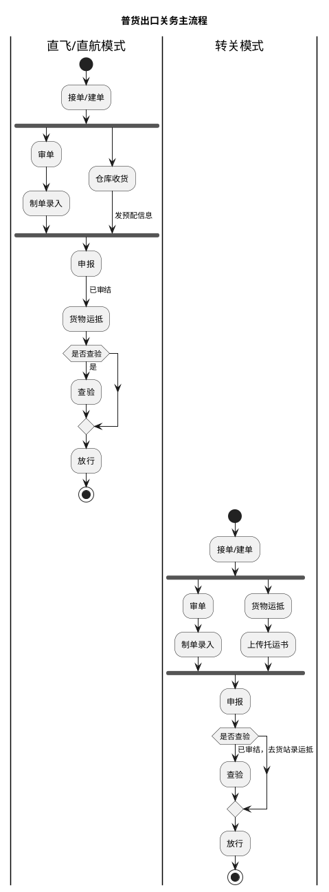
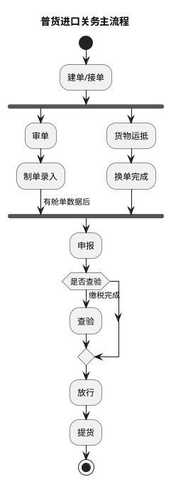
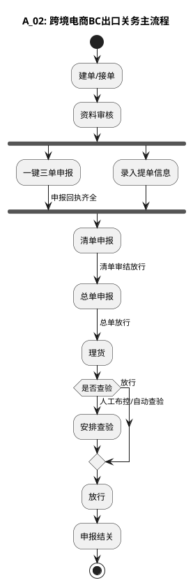
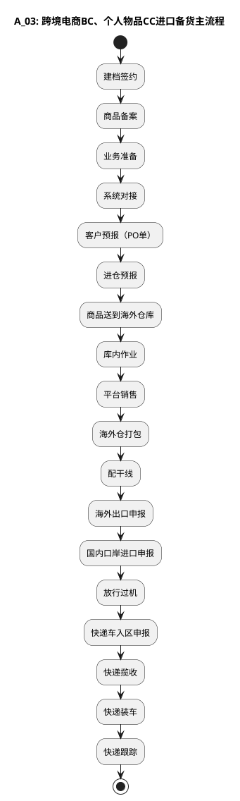
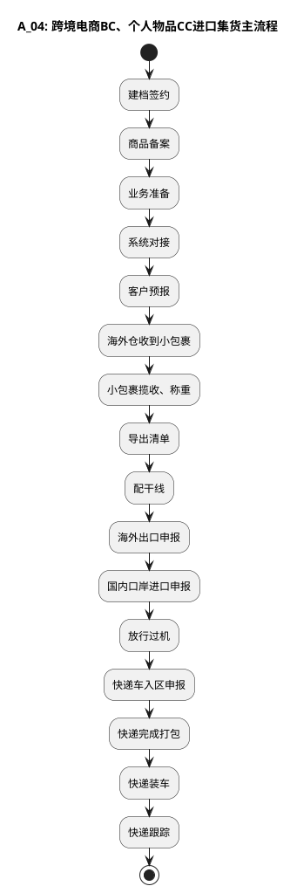
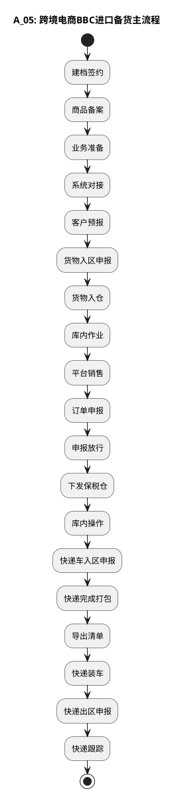

# 业务模式主流程总览（简化版）

本文整合高捷各业务模式的简化版主流程，用于横向比对普货进出口、跨境电商 BC 出口、BC/CC 进口（备货/集货）与 BBC 进口（备货）在主链路上的环节差异。各环节对应的详细操作流程见本目录后续篇章。

| 本节流程 | 来源文件 | 来源图 |
| --- | --- | --- |
| 普货出口/进口关务主流程 | `dsl-graph/A：简化版_主流程.1.md` | `temp/流程图SVG/A：简化版_主流程.1.svg`（Visio 跨职能流程图） |
| 跨境电商BC出口关务主流程 | `dsl-graph/A：简化版_主流程.2.md` | `temp/流程图SVG/A：简化版_主流程.2.svg` |
| 跨境电商BC、个人物品CC进口备货主流程 | `dsl-graph/A：简化版_主流程.3.md` | `temp/流程图SVG/A：简化版_主流程.3.svg` |
| 跨境电商BC、个人物品CC进口集货主流程 | `dsl-graph/A：简化版_主流程.4.md` | `temp/流程图SVG/A：简化版_主流程.4.svg` |
| 跨境电商BBC进口备货主流程 | `dsl-graph/A：简化版_主流程.5.md` | `temp/流程图SVG/A：简化版_主流程.5.svg` |

## 1. 普货出口关务主流程

出口分直飞/直航与转关两种模式：接单/建单后，单证链（审单→制单录入）与货物链并行汇入“申报”，申报审结后货物运抵，按需查验后放行。

## 2. 普货进口关务主流程

### 普货进出口图转换说明（来源 A.1）

- 原 SVG 中“查验”均存在旁路线（直飞/直航模式为 货物运抵→放行，转关模式为 申报→放行，进口为 换单完成→放行），均未标注分支条件；上表以“是否查验”判断节点统一表示，箭头文字（已审结、已审结，去货站录运抵、缴税完成）保留在“查验”分支上，与原图标注位置一致。
- 出口两条泳道（直飞/直航模式、转关模式）中，接单/建单后单证链（审单→制单录入）与货物链（直飞为仓库收货、转关为货物运抵→上传托运书）并行汇入“申报”，原图为汇聚连接，此处用 fork/join 表达并行汇聚。
- 进口原图中“换单完成”分别连线至“查验”（顶部）与“放行”（跨过“申报”），已按主流程归并为在“申报”前汇入；“有舱单数据后”原标注于 制单录入→申报 连线上。
- 进口流程原图无泳道，故进口图不设泳道分区。

## 3. 跨境电商BC出口关务主流程

### BC出口图转换说明（来源 A.2）

- 原图“资料审核”后分两路汇聚到“清单申报”（一键三单申报 / 录入提单信息），未标注并行或择一，此处按并行汇聚（fork/join）表达。
- 原图“理货”后有两条带标注的出口（人工布控/自动查验→安排查验，放行→直接放行），此处以“是否查验”判断节点表达，两条原标注分别保留在两个分支上。

## 4. 跨境电商BC、个人物品CC进口备货主流程

## 5. 跨境电商BC、个人物品CC进口集货主流程

## 6. 跨境电商BBC进口备货主流程

