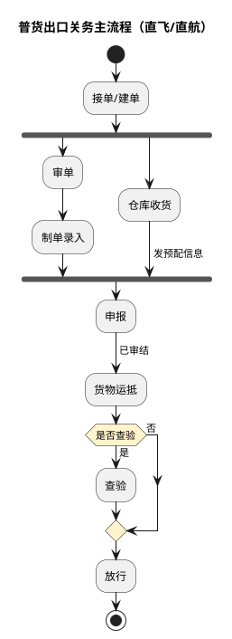
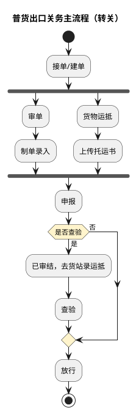
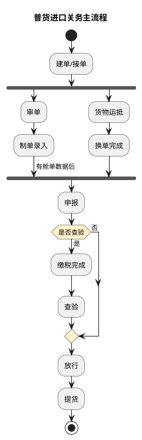
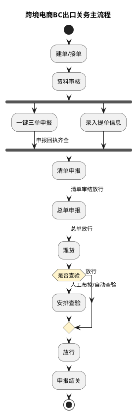
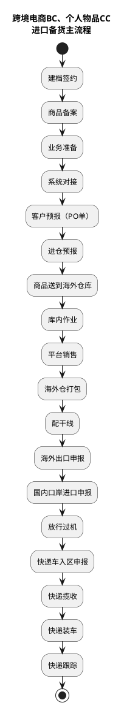
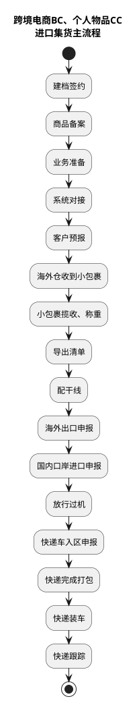
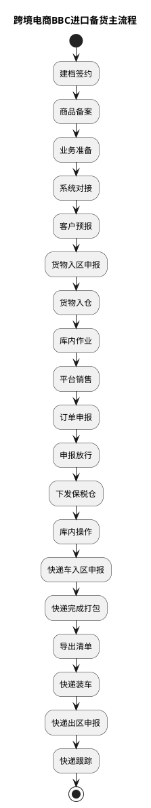

# 业务模式主流程总览

本文展示高捷各业务模式的主流程总览，说明普货进出口、跨境电商 BC 出口、BC/CC 进口（备货/集货）与 BBC 进口（备货）的主链路及环节差异。各环节的详细操作见本目录对应流程篇。

## 1. 普货出口关务主流程

出口分直飞/直航与转关两种模式：接单/建单后，单证链（审单→制单录入）与货物链并行汇入“申报”，申报审结后货物运抵，按需查验后放行。

## 2. 普货进口关务主流程

## 3. 跨境电商BC出口关务主流程

## 4. 跨境电商BC、个人物品CC进口备货主流程

## 5. 跨境电商BC、个人物品CC进口集货主流程

## 6. 跨境电商BBC进口备货主流程

