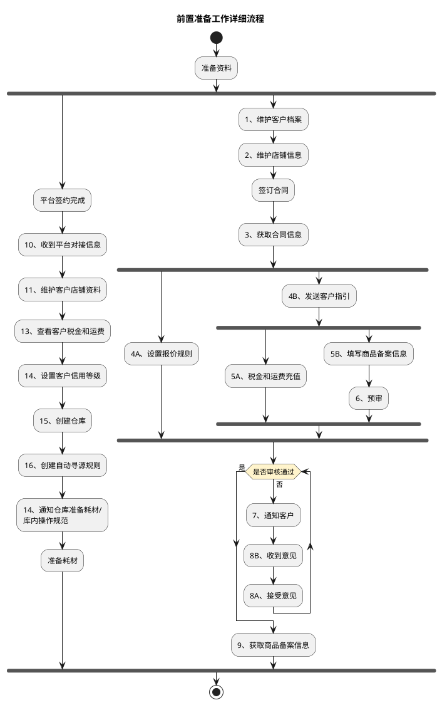
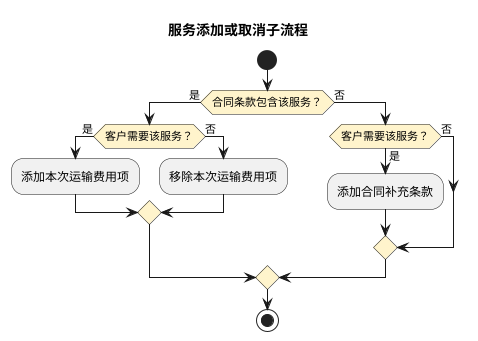

# 前置准备与服务开通流程

本文定义业务开展前的准备工作（建档签约、报价、商品备案、系统配置），以及订单级服务开通与取消流程。前置准备对应各业务模式主流程中的“建档签约→商品备案→业务准备→系统对接”环节。

## 1. 前置准备工作详细流程

“准备资料”后分两条无条件并行链：平台签约与系统配置链（平台签约完成→…→准备耗材）、客户合同与商品备案链（维护客户档案→…→获取商品备案信息）；商品备案经预审、审核未通过时通知客户并循环接受意见直至通过。

## 2. 服务添加或取消子流程

按“合同条款是否已包含该服务”与“客户是否需要该服务”两个判断决定：已包含且需要则添加本次运输费用项、已包含但不需要则移除本次运输费用项、未包含但需要则先添加合同补充条款。

