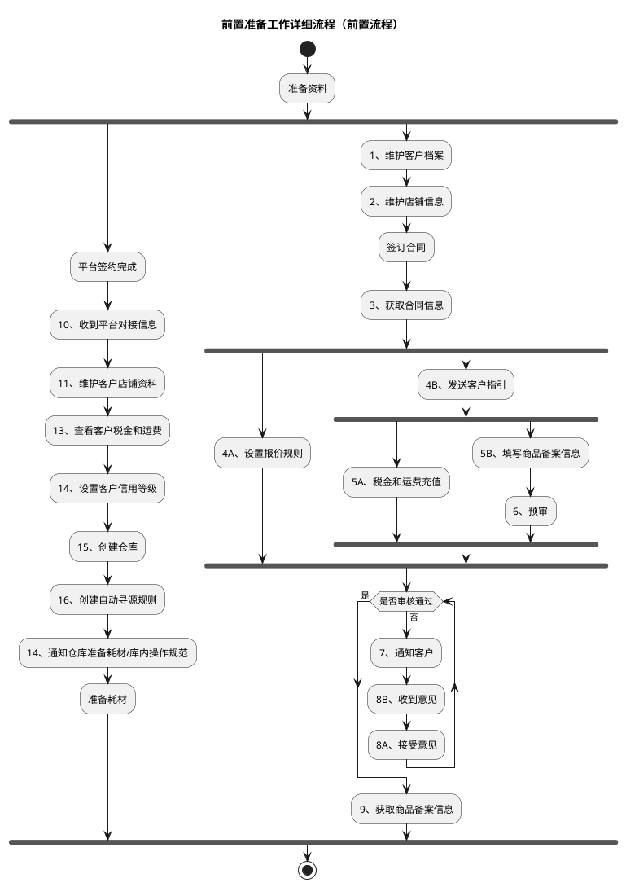
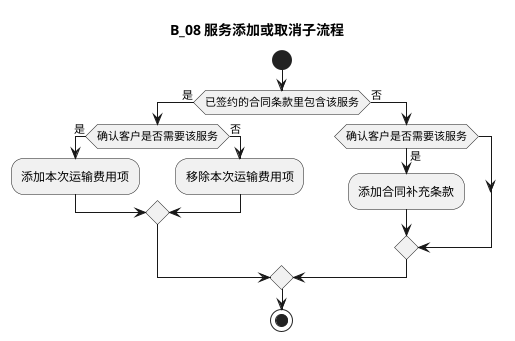

# 前置准备与服务开通流程

本文整合业务开展前的准备工作（建档签约、报价、商品备案、系统配置）与订单级服务开通/取消两条流程。前置准备是各业务模式主流程中“建档签约→商品备案→业务准备→系统对接”环节的展开。

| 本节流程 | 来源文件 | 来源图 |
| --- | --- | --- |
| 前置准备工作详细流程 | `dsl-graph/B：前置准备工作详细流程.md` | `temp/流程图SVG/B：前置准备工作详细流程.svg` |
| 服务添加或取消子流程 | `dsl-graph/H：服务添加或取消详细流程.md` | `temp/流程图SVG/H：服务添加或取消详细流程.svg` |

## 1. 前置准备工作详细流程

“准备资料”后分两条无条件并行链：平台签约与系统配置链（平台签约完成→…→准备耗材）、客户合同与商品备案链（维护客户档案→…→获取商品备案信息）；商品备案经预审、审核未通过时通知客户并循环接受意见直至通过。

### 转换说明（来源 B）

- 原图“准备资料”后分为两条无条件并行链：平台签约与系统配置链（平台签约完成→…→准备耗材）、客户合同与商品备案链（1、维护客户档案→…→9、获取商品备案信息），此处用嵌套 fork/join 表达。
- “3、获取合同信息”后的 4A/4B、“4B、发送客户指引”后的 5A/5B 均为无条件分支，同样按并行处理；其中 4A、5A 无后续连线。
- 审核未通过的回路（7、通知客户→8B、收到意见→8A、接受意见→重新判断）用 while 循环表达。
- 原图中的“文档”类注释形状（各步骤的说明文档）及右侧“优化点”批注栏未纳入流程图。

## 2. 服务添加或取消子流程

按“合同条款是否已包含该服务”与“客户是否需要该服务”两个判断决定：已包含且需要则添加本次运输费用项、已包含但不需要则移除本次运输费用项、未包含但需要则先添加合同补充条款。

### 转换说明（来源 H）

- 原图“添加合同补充条款”无后续连线，此处按流向汇入结束（“完成”）。
