# 普货进出口关务详细流程

本文定义普货进口（6 个子流程）与普货出口（5 个子流程）的详细操作，说明进出口两侧主流程、异常处理和退运/删单环节的差异。主流程总览见《业务模式主流程总览》第 1、2 节。

## 一、普货进口流程

### 1. 企业主动发起改单流程

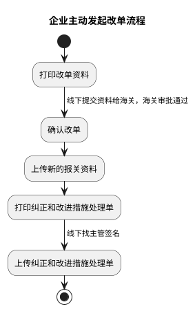
### 2. 退运及出口报关流程

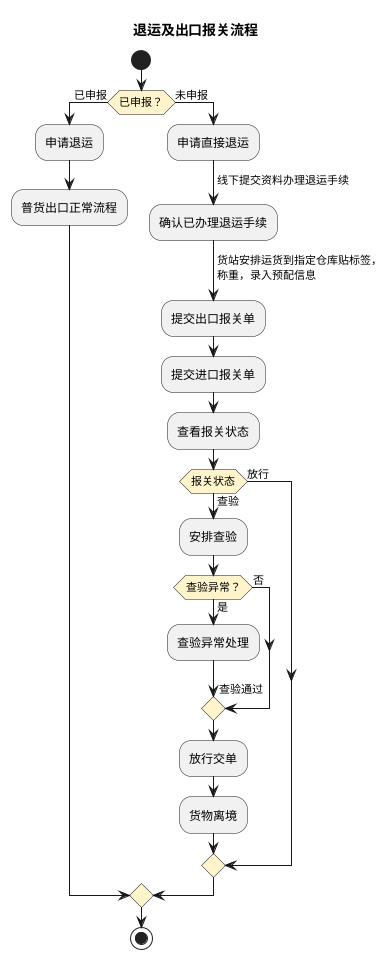
### 3. 普货进口卡航（国外空运—广州机场—卡车航班转运国内其他口岸）流程

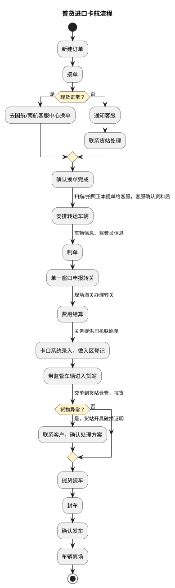

运输路线为国外空运至广州机场，再由卡车航班转运至国内其他口岸。

### 4. 转关车辆进仓流程

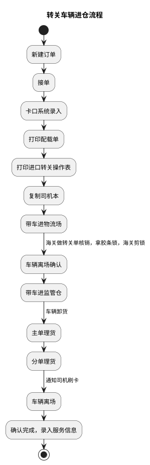

### 5. 到货换单理货流程

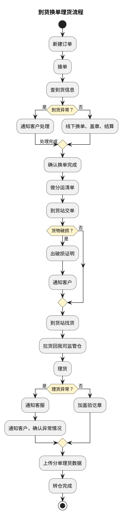

### 6. 普货进口主流程

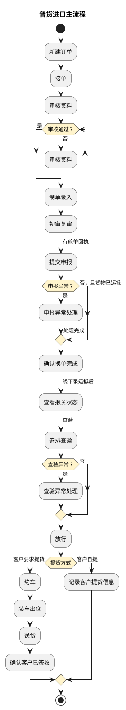

## 二、普货出口流程

### 1. 查验/申报异常处理流程

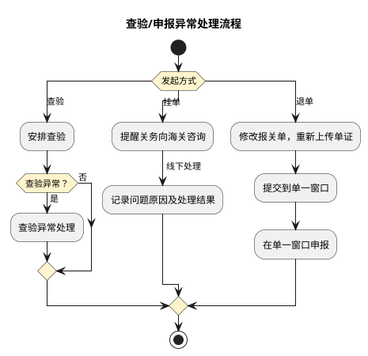

### 2. 出口退运删单流程

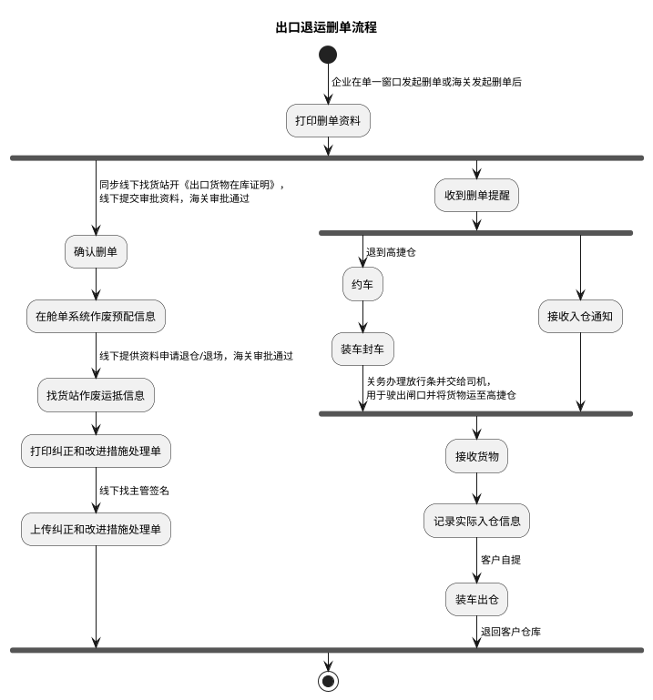

### 3. 出口主流程（公路预配舱单模式）

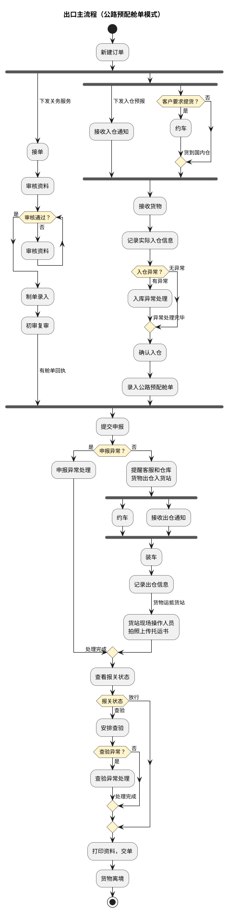
### 4. 出口主流程（货站录运抵模式）

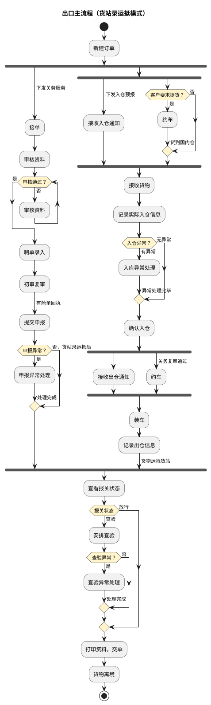
### 5. 出口主流程（深圳口岸空运预配模式）

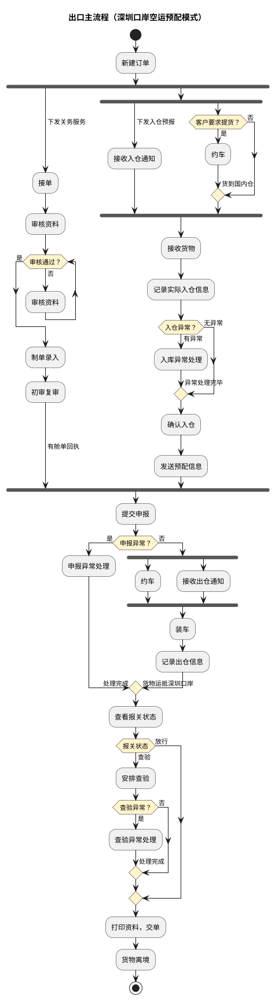
