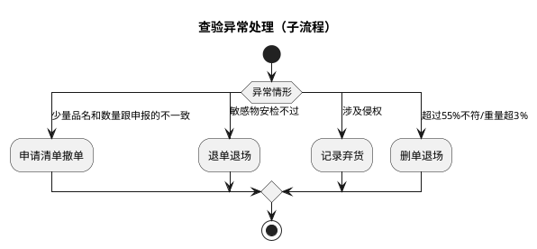
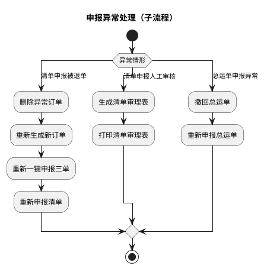
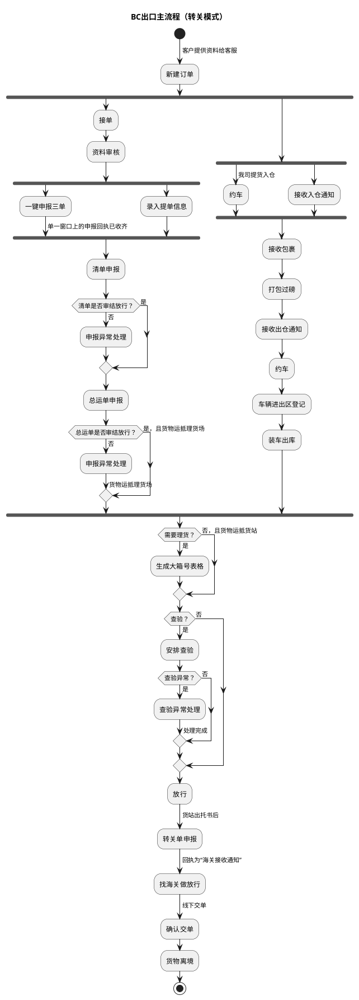
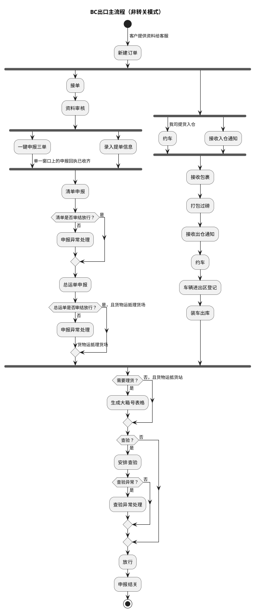
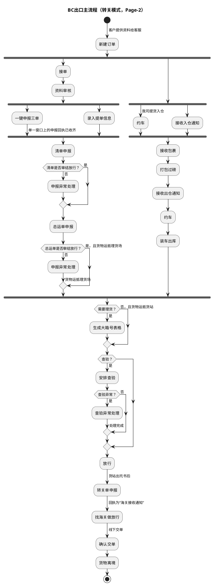

# 跨境电商BC出口关务详细流程

本文整合跨境电商 BC 出口的异常处理子流程与主流程（转关/非转关两种模式），并附 Page-2 版转关主流程变体供比对。主流程总览见《业务模式主流程总览》第 3 节。

| 本节流程 | 来源文件 | 来源图 |
| --- | --- | --- |
| 查验/申报异常处理子流程、BC出口主流程（转关/非转关） | `dsl-graph/D：跨境电商BC出口关务详细流程.1.md` | `temp/流程图SVG/D：跨境电商BC出口关务详细流程.1.svg`（含 4 个独立子流程区域） |
| BC出口主流程（转关模式，Page-2） | `dsl-graph/D：跨境电商BC出口关务详细流程-2.md` | `temp/流程图SVG/D：跨境电商BC出口关务详细流程-2.svg` |

## 1. 查验异常处理（子流程，标题为推断）

## 2. 申报异常处理（子流程，标题为推断）

## 3. BC出口主流程（转关模式，标题为推断）

## 4. BC出口主流程（非转关模式，标题为推断）

### 转换说明（来源 D.1）

- 原图 4 个泳道区域各含独立开始/结束，按内容拆为 4 张图；“异常情形”判断条件文字为补充，分支标注均为原图文字。
- 区域 1、2 即主流程中引用的“查验异常处理”“申报异常处理”子流程的展开。
- 区域 3、4 为同一主流程的两种结尾：转关模式（放行→转关单申报→找海关做放行→确认交单→货物离境）与非转关模式（放行→申报结关）。单证链与货物链在“新建订单”后并行、于“需要理货？”汇聚，按 fork/join 表达；“新建订单→接收入仓通知”为原图未标注连线。
- 区域 4 货物链中“接收出仓通知→约车→车辆进出区登记”两环原图连线缺失，按区域 3 的对应链路补齐。
- 原图中的“文档”类注释形状及右侧大段“优化”批注未纳入流程图。

## 5. BC出口主流程（转关模式，Page-2 变体）

本页为 BC 出口转关模式主流程的另一版本，与第 3 节结构相近（货物链少“车辆进出区登记”环节），两版并列便于比对差异。

### 转换说明（来源 D-2）

- “新建订单→接收入仓通知”为原图未标注连线；“接收出仓通知→约车→装车出库”两环原图连线缺失，按节点顺序补齐。
- 本页“查验？”仅有“是”分支连线，未查验直达“放行”的分支未标注、未纳入。
- 原图中的“文档”类注释形状（转关单申报、查验细化等说明）未纳入流程图。
