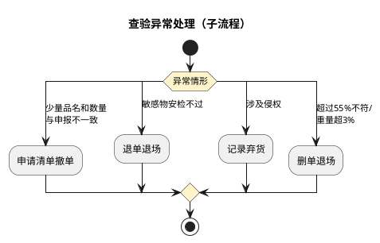
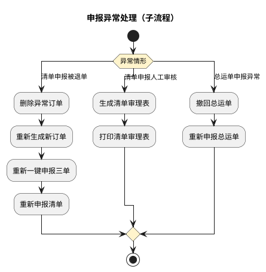
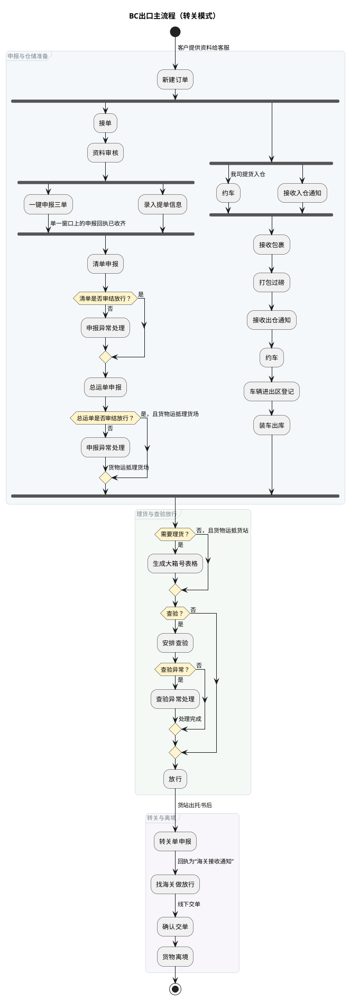
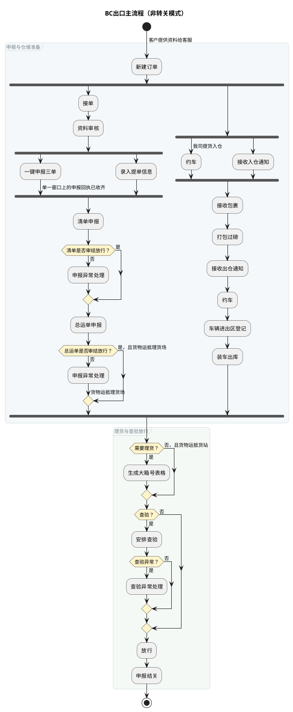
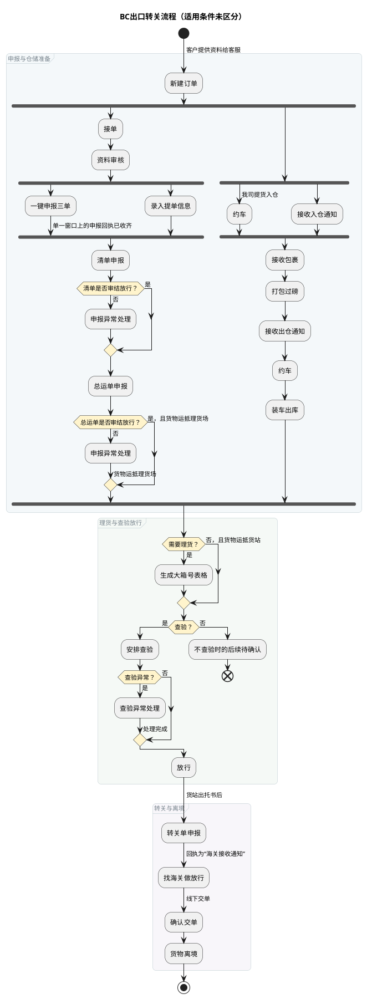

# 跨境电商BC出口关务详细流程

本文定义跨境电商 BC 出口的查验、申报异常处理，以及转关和非转关主流程。第 3、5 节均描述转关流程，但适用条件尚未区分；主流程总览见《业务模式主流程总览》第 3 节。

## 1. 查验异常处理

## 2. 申报异常处理

## 3. BC出口主流程（转关模式）

## 4. BC出口主流程（非转关模式）

## 5. BC出口转关流程（适用条件未区分）

本流程与第 3 节的适用条件尚未区分。本流程不包含“车辆进出区登记”，且“查验”判断未定义“不查验”分支；适用范围明确前，两套转关流程均不得作为唯一业务口径。图中的待确认终点仅标记已知流程边界，不表示业务完成。

