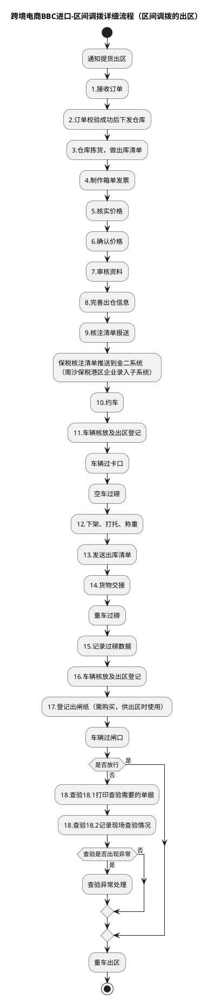
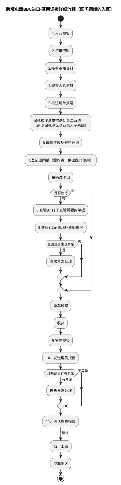
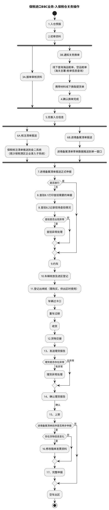
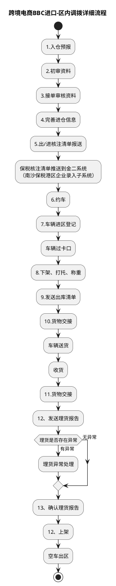
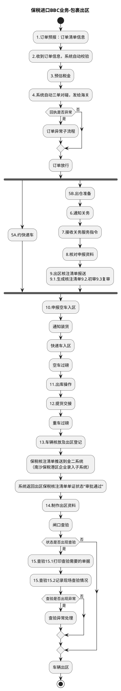
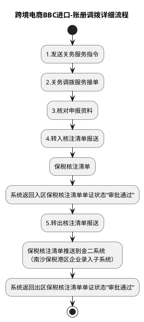

# 跨境电商BBC进口：入出区与调拨流程

本文定义 BBC 进口保税业务的货物进出区主干流程，包括区间调拨（出区/入区）、入保税仓关务操作、区内调拨、包裹出区和账册调拨，并说明入区与出区、三种调拨方式的环节差异。简单加工、退运、客退等特殊操作见《跨境电商BBC进口：特殊业务操作流程》。主流程总览见《业务模式主流程总览》第 6 节。

## 1. 区间调拨的出区

## 2. 区间调拨的入区

## 3. 入保税仓关务操作

## 4. 区内调拨

## 5. 包裹出区

## 6. 账册调拨

