# 跨境电商BBC进口详细流程

本文定义 BBC 进口保税业务的入出区、调拨和特殊业务操作流程。入出区与调拨包括区间调拨、入保税仓关务操作、区内调拨、包裹出区和账册调拨；特殊业务操作包括简单加工、退运、客退、物料进区、卡板出区和保税展示。业务模式之间的关系见《业务模式主流程总览》第 6 节。

## 1. 入出区与调拨

### 1.1 区间调拨的出区

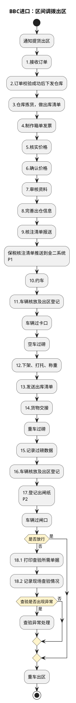

- P1：此处金二系统操作在“南沙保税港区企业录入子系统”完成。
- P2：出闸纸需购买，供出区时使用。

### 1.2 区间调拨的入区

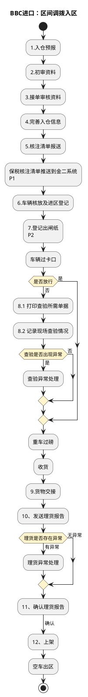

- P1：此处金二系统操作在“南沙保税港区企业录入子系统”完成。
- P2：出闸纸需购买，供出区时使用。

### 1.3 入保税仓关务操作

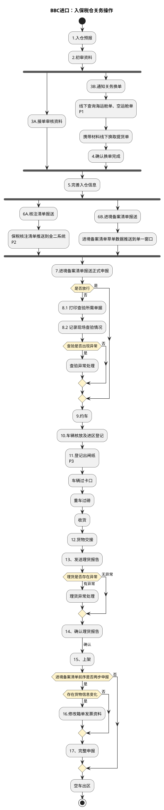

- P1：查询入口为“海关总署-舱单信息查询”。
- P2：此处金二系统操作在“南沙保税港区企业录入子系统”完成。
- P3：出闸纸需购买，供出区时使用。

### 1.4 区内调拨

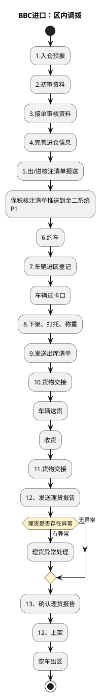

- P1：此处金二系统操作在“南沙保税港区企业录入子系统”完成。

### 1.5 包裹出区

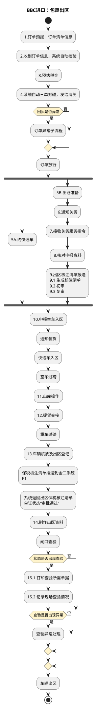

- P1：此处金二系统操作在“南沙保税港区企业录入子系统”完成。

### 1.6 账册调拨

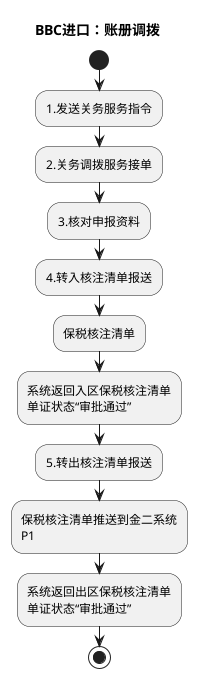

- P1：此处金二系统操作在“南沙保税港区企业录入子系统”完成。

## 2. 特殊业务操作

### 2.1 简单加工操作

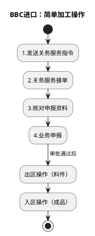

### 2.2 退运操作

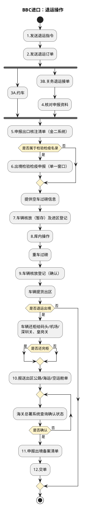

### 2.3 客退操作

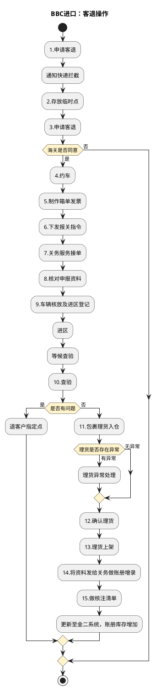

### 2.4 物料进区

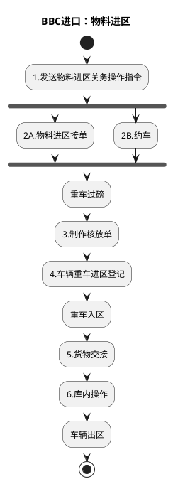

### 2.5 卡板出区

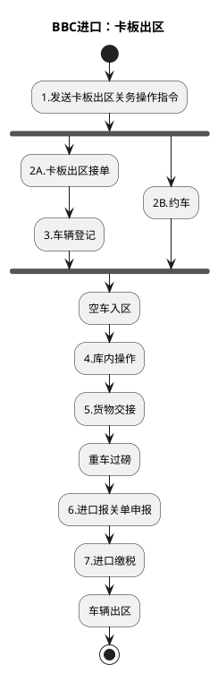

### 2.6 保税展示

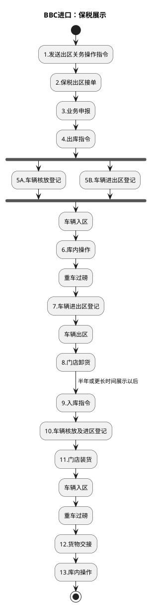
