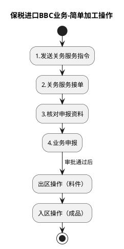
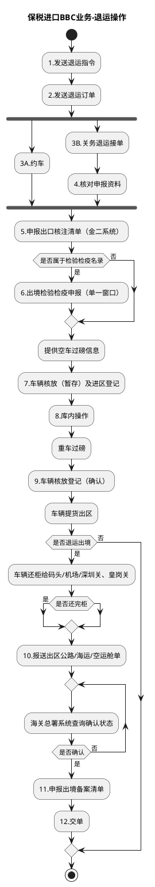
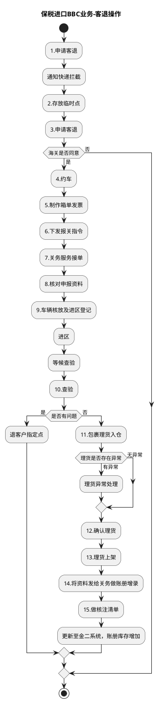
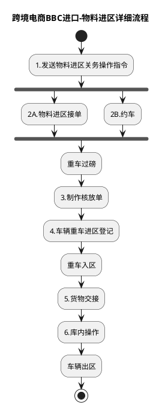
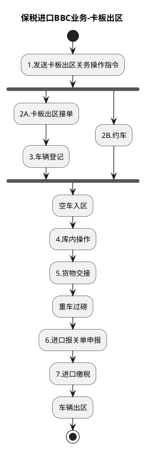
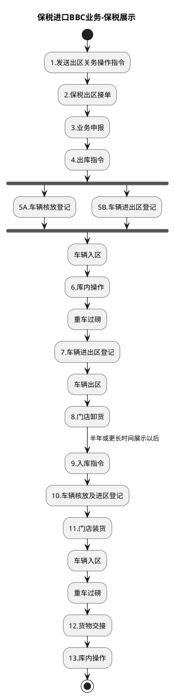

# 跨境电商BBC进口：特殊业务操作流程

本文定义 BBC 进口保税业务的特殊操作流程，包括简单加工、退运、客退、物料进区、卡板出区和保税展示。入出区与调拨主干流程见《跨境电商BBC进口：入出区与调拨流程》。

## 1. 简单加工操作

```plantuml
@startuml
title 保税进口BBC业务-简单加工操作
start
:1.发送关务服务指令;
:2.关务服务接单;
:3.核对申报资料;
:4.业务申报;
-> 审批通过后;
:出区操作（料件）;
:入区操作（成品）;
stop
@enduml
```

## 2. 退运操作

```plantuml
@startuml
title 保税进口BBC业务-退运操作
start
:1.发送退运指令;
:2.发送退运订单;
fork
  :3A.约车;
fork again
  :3B.关务退运接单;
  :4.核对申报资料;
end fork
:5.申报出口核注清单（金二系统）;
if (是否属于检验检疫名录) then (是)
  :6.出境检验检疫申报（单一窗口）;
else (否)
endif
:提供空车过磅信息;
:7.车辆核放（暂存）及进区登记;
:8.库内操作;
:重车过磅;
:9.车辆核放登记（确认）;
:车辆提货出区;
if (是否退运出境) then (是)
  :车辆还柜给码头/机场/深圳关、皇岗关;
  if (是否还完柜) then (是)
  endif
  :10.报送出区公路/海运/空运舱单;
  repeat
    :海关总署系统查询确认状态;
  repeat while (是否确认) is (否) not (是)
  :11.申报出境备案清单;
  :12.交单;
else (否)
endif
stop
@enduml
```

## 3. 客退操作

```plantuml
@startuml
title 保税进口BBC业务-客退操作
start
:1.申请客退;
:通知快递拦截;
:2.存放临时点;
:3.申请客退;
if (海关是否同意) then (是)
  :4.约车;
  :5.制作箱单发票;
  :6.下发报关指令;
  :7.关务服务接单;
  :8.核对申报资料;
  :9.车辆核放及进区登记;
  :进区;
  :等候查验;
  :10.查验;
  if (是否有问题) then (是)
    :退客户指定点;
  else (否)
    :11.包裹理货入仓;
    if (理货是否存在异常) then (有异常)
      :理货异常处理;
    else (无异常)
    endif
    :12.确认理货;
    :13.理货上架;
    :14.将资料发给关务做账册增录;
    :15.做核注清单;
    :更新至金二系统，账册库存增加;
  endif
else (否)
endif
stop
@enduml
```

## 4. 物料进区

```plantuml
@startuml
title 跨境电商BBC进口-物料进区详细流程
start
:1.发送物料进区关务操作指令;
fork
  :2A.物料进区接单;
fork again
  :2B.约车;
end fork
:重车过磅;
:3.制作核放单;
:4.车辆重车进区登记;
:重车入区;
:5.货物交接;
:6.库内操作;
:车辆出区;
stop
@enduml
```

## 5. 卡板出区

```plantuml
@startuml
title 保税进口BBC业务-卡板出区
start
:1.发送卡板出区关务操作指令;
fork
  :2A.卡板出区接单;
  :3.车辆登记;
fork again
  :2B.约车;
end fork
:空车入区;
:4.库内操作;
:5.货物交接;
:重车过磅;
:6.进口报关单申报;
:7.进口缴税;
:车辆出区;
stop
@enduml
```

## 6. 保税展示

```plantuml
@startuml
title 保税进口BBC业务-保税展示
start
:1.发送出区关务操作指令;
:2.保税出区接单;
:3.业务申报;
:4.出库指令;
fork
  :5A.车辆核放登记;
fork again
  :5B.车辆进出区登记;
end fork
:车辆入区;
:6.库内操作;
:重车过磅;
:7.车辆进出区登记;
:车辆出区;
:8.门店卸货;
-> 半年或更长时间展示以后;
:9.入库指令;
:10.车辆核放及进区登记;
:11.门店装货;
:车辆入区;
:重车过磅;
:12.货物交接;
:13.库内操作;
stop
@enduml
```
