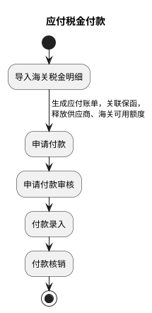
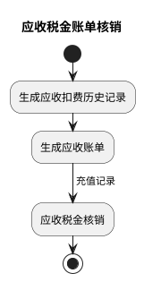
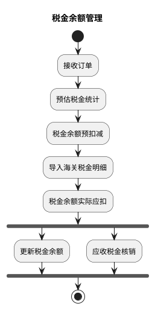
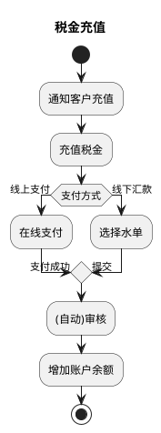
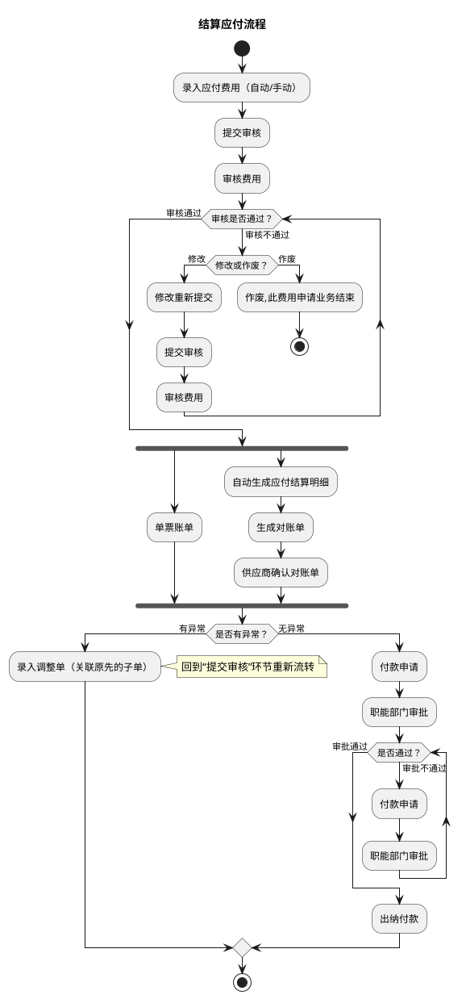
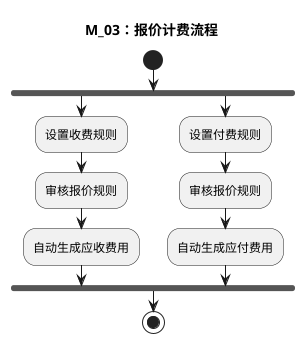

# 税金管理与财务结算流程

本文整合资金侧两类流程：税金管理（应付税金付款、应收税金核销、税金余额管理、税金充值）与财务结算（应付、应收、报价计费）。应收税金核销与财务应收流程、应付税金付款与结算应付流程可对照阅读；报价计费是应付/应收费用的上游来源。

| 本节流程 | 来源文件 | 来源图 |
| --- | --- | --- |
| 税金管理（4 个子流程） | `dsl-graph/G：税金管理详细流程.md` | `temp/流程图SVG/G：税金管理详细流程.svg`（含 4 个独立子流程） |
| 结算应付流程 | `dsl-graph/M：财务结算详细流程.1.md` | `temp/流程图SVG/M：财务结算详细流程.1.svg`（页面名 G） |
| 财务应收流程 | `dsl-graph/M：财务结算详细流程.2.md` | `temp/流程图SVG/M：财务结算详细流程.2.svg` |
| 报价计费流程 | `dsl-graph/M：财务结算详细流程.3.md` | `temp/流程图SVG/M：财务结算详细流程.3.svg` |

## 一、税金管理

### 1. 应付税金付款

### 2. 应收税金账单核销

### 3. 税金余额管理

### 4. 税金充值

### 税金管理图转换说明（来源 G）

- 原图 4 个泳道区域各含独立开始/结束，按内容拆为 4 个子流程图。
- 应付税金付款中，原图另有一条“申请付款→付款核销”的未标注直连线（跳过审核与录入），未纳入主链。
- 税金余额管理中“税金余额实际应扣”后无条件分为“更新税金余额”与“应收税金核销”（原图为子流程形状）两路，按并行汇聚表达。
- 税金充值的“线上支付/线下汇款”原为带标注分支，判断条件“支付方式”为补充，两个分支标注均为原图文字。
- 原图中的“文档”类注释形状（核销记录、付款记录、应收月结报表、余额计算公式等）未纳入流程图。

## 二、财务结算

### 1. 结算应付流程

#### 转换说明（来源 M.1）

- “审核不通过→修改重新提交→提交审核”与“审批不通过→付款申请”两处回退分别用 while 循环表达；“作废”分支用分支内 stop 表达业务终止。
- “审核通过”后“单票账单”（原图无后续连线）与“自动生成应付结算明细”对账链并行，按 fork/join 表达。
- “是否有异常？→有异常→录入调整单（关联原先的子单）→提交审核”为跨环节回退连线，活动图语法无法回跳，此处以注释说明，主线按无异常走向绘制。
- 原图中的“文档”类注释形状（对账单、银行水单、付款申请单等）未纳入流程图。

### 2. 财务应收流程

#### 转换说明（来源 M.2）

- “审核拒绝→修改/重新提交→提交审核”的回退用 while 循环表达；“作废”分支用分支内 stop 表达业务终止。
- “审核通过”后“单票账单”（原图无后续连线）与“自动生成应收结算明细”对账链并行；“收款申请”后“登记发票”（原图无后续连线）与线下收款链并行，均按 fork/join 表达。
- “是否有异常？→有异常→录入调整单（关联原先的子单）→提交审核”为跨环节回退连线，活动图语法无法回跳，此处以注释说明，主线按无异常走向绘制。
- 原图中的“文档”类注释形状（对账单、银行水单、应收发票等）未纳入流程图。

### 3. 报价计费流程

#### 转换说明（来源 M.3）

- 原图中两个“审核报价规则”节点之间有一条连线（审核报价规则→审核报价规则），此处按收费/付费两条并行链简化表达。
- 原图注释说明：根据订单下的服务单生成费用，形成费用后回到 M_01、M_02 的“提交审核”节点。
- 原图中的“文档”类注释形状（收费规则设置说明等）未纳入流程图。
