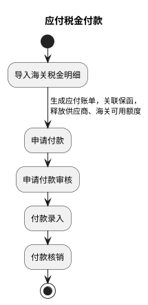
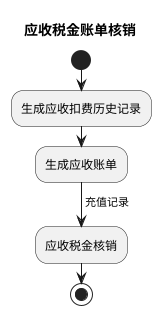
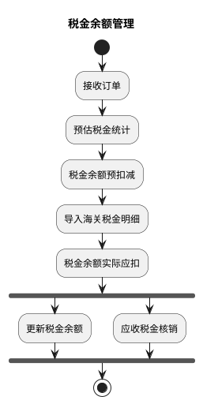
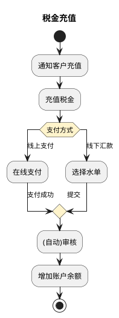
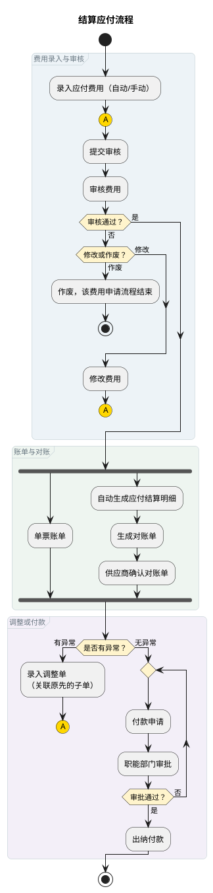
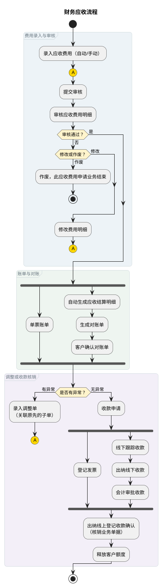
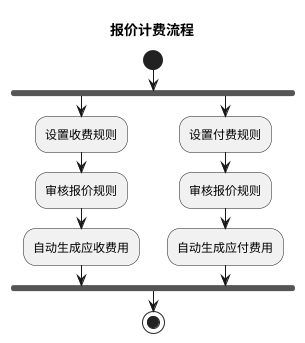

# 税金管理与财务结算流程

本文定义税金管理（应付税金付款、应收税金核销、税金余额管理、税金充值）与财务结算（应付、应收、报价计费）流程。应收税金核销衔接财务应收，应付税金付款衔接结算应付，报价计费是应付、应收费用的上游。

## 一、税金管理

### 1. 应付税金付款

### 2. 应收税金账单核销

### 3. 税金余额管理

### 4. 税金充值

## 二、财务结算

### 1. 结算应付流程

连接符 A：“修改费用”和“录入调整单”均返回“提交审核”。

### 2. 财务应收流程

连接符 A：“修改费用明细”和“录入调整单”均返回“提交审核”。

### 3. 报价计费流程

