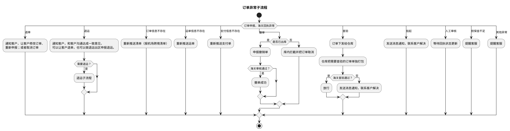
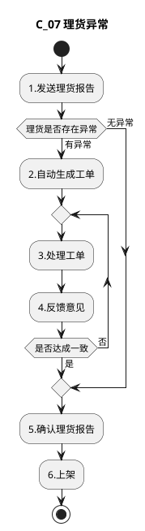
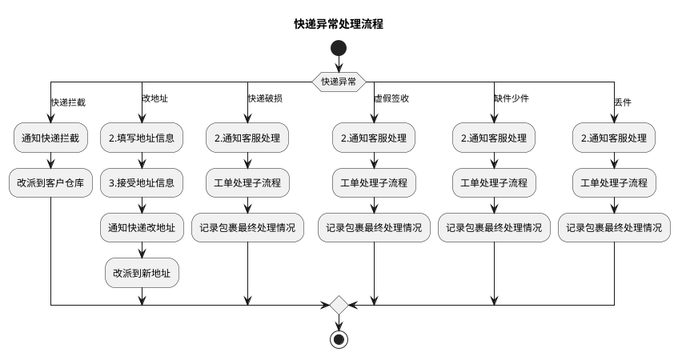
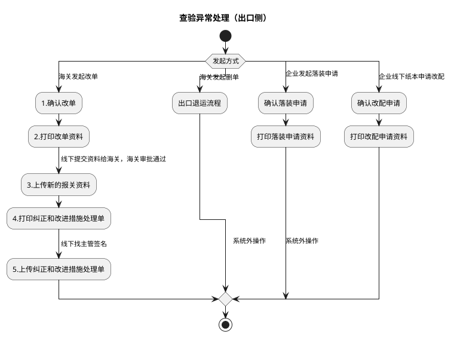
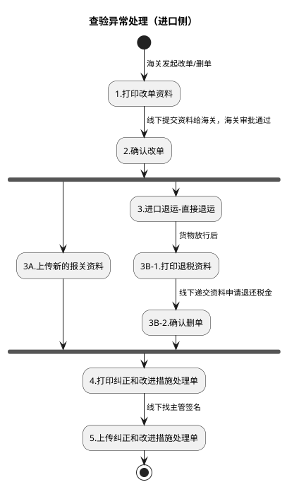

# 异常处理流程

本文整合四类异常处理子流程：订单异常、理货异常、快递异常、查验异常，便于横向比对各类异常的触发情形与处理路径。这些子流程被各业务模式主流程引用（如 BC 出口、BBC 进口流程中的“订单异常子流程”“查验异常处理”“理货异常处理”）；普货出口侧的查验/申报异常处理见《普货进出口关务详细流程》第二部分第 1 节，BC 出口侧的查验/申报异常处理见《跨境电商BC出口关务详细流程》第 1、2 节。

| 本节流程 | 来源文件 | 来源图 |
| --- | --- | --- |
| 订单异常子流程 | `dsl-graph/I：订单异常详细流程.md` | `temp/流程图SVG/I：订单异常详细流程.svg` |
| 理货异常处理 | `dsl-graph/J：理货异常处理详细流程.md` | `temp/流程图SVG/J：理货异常处理详细流程.svg`（泳道：电商客服） |
| 快递异常处理 | `dsl-graph/K：快递异常处理详细流程.md` | `temp/流程图SVG/K：快递异常处理详细流程.svg` |
| 查验异常处理（出口侧/进口侧） | `dsl-graph/L：查验异常处理详细流程.md` | `temp/流程图SVG/L：查验异常处理详细流程.svg`（含出口/进口两个泳道区域） |

## 1. 订单异常子流程

### 转换说明（来源 I）

- 原图中“撤单/查验/挂起/人工审核/担保金不足/其他异常”为连接线上的分支标注（Visio 动态连接线文字），此处作为 switch 分支条件保留；“退单/退运/订单信息不存在/运单信息不存在/支付信息不存在”同为原图分支标注。
- “挂起”分支按位置就近归入“发送消息通知，联系客户解决”（与查验不通过分支共用该节点）。
- 原图“需要退运？”仅有“是”分支连线、“海关审核通过？”仅有“是”分支连线，未标注的分支未纳入。
- “海关查验通过？→否→发送消息通知，联系客户解决”及两个“提醒客服”节点在原图中无后续连线，按流向汇入结束。

## 2. 理货异常处理

### 转换说明（来源 J）

- “是否达成一致→否→3.处理工单”的回退用 repeat while 循环表达。
- 原图单一泳道“电商客服”，未设泳道分区。

## 3. 快递异常处理

### 转换说明（来源 K）

- 原图判定“快递异常”的 6 条出口未在线上加标注，分支类型体现在各分支首节点（1A.快递拦截～1F.丢件），此处将类型名作为 switch 分支条件保留。
- “快递破损/虚假签收/缺件少件/丢件”四个分支的后续链路完全相同（通知客服处理→工单处理子流程→记录包裹最终处理情况），原图为四个同名独立节点，此处逐分支重复表达以保持结构一致。
- 原图“2.通知客服处理”另有未标注的直连结束连线，未纳入。
- 原图中的“文档”类注释形状（拦截/破损场景说明）未纳入流程图。

## 4. 查验异常处理（出口侧：改单/删单/落装/改配）

## 5. 查验异常处理（进口侧：改单/删单）

### 查验异常图转换说明（来源 L）

- 原图两个泳道区域分别对应出口（含出口退运流程）与进口（含进口退运-直接退运），拆为两张图；区域标题为按内容推断。
- 出口侧“开始”的 4 条出口均带原图标注（海关发起改单/海关发起删单/企业发起落装申请/企业线下纸本申请改配），作为 switch 分支保留；“发起方式”为补充的判断条件文字。
- 进口侧“2.确认改单”后无条件分为 3A 与退运退税两路并汇聚于“4.打印纠正和改进措施处理单”，按并行汇聚（fork/join）表达。
- 原图中的“文档”类注释形状（改单资料清单、落装/改配申请材料、操作记录说明等）未纳入流程图。
