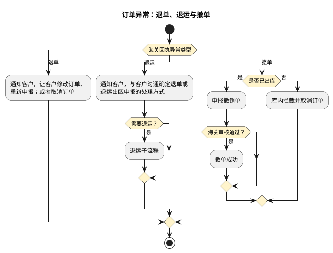
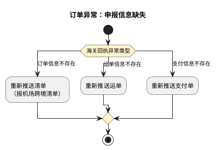
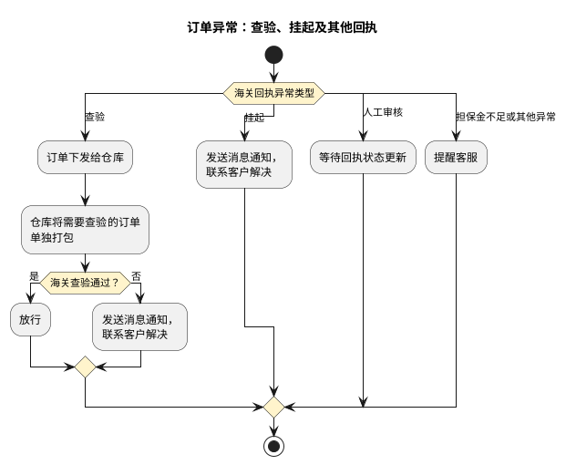
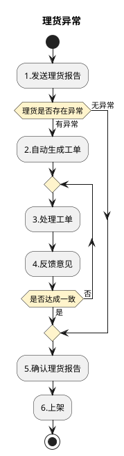
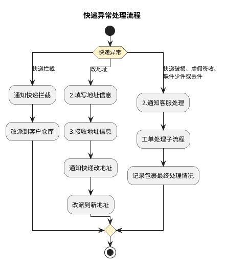
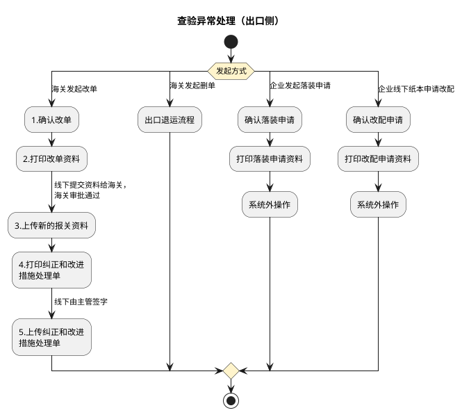
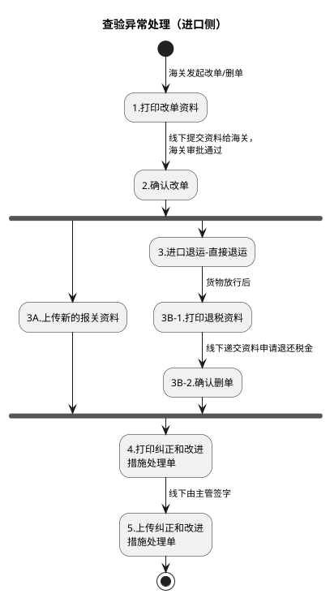

# 异常处理流程

本文定义订单异常、理货异常、快递异常和查验异常四类处理流程，并说明各类异常的触发情形与处理路径。各业务模式主流程引用相应子流程；普货出口侧的查验、申报异常处理见《普货进出口关务详细流程》第二部分第 1 节，BC 出口侧的查验、申报异常处理见《跨境电商BC出口关务详细流程》第 1、2 节。

## 1. 订单异常子流程

各类海关回执异常分别进入对应处理路径；下列三图按异常类型分组，不表示连续执行。图中终点仅表示本次处理阶段结束，不代表订单已完成。

## 2. 理货异常处理

## 3. 快递异常处理

## 4. 查验异常处理（出口侧：改单/删单/落装/改配）

## 5. 查验异常处理（进口侧：改单/删单）

