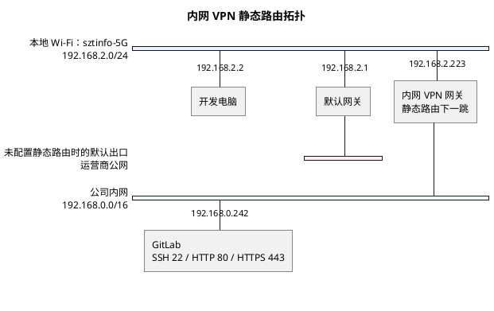

# 内网 VPN 静态路由

当本机位于 `192.168.2.0/24` 网段，并且需要通过内网 VPN 网关
`192.168.2.223` 访问其他内网地址时，可在 Windows 管理员终端中添加静态路由。

## 网络拓扑



静态路由生效后，访问 GitLab `192.168.0.242` 的流量将交给
`192.168.2.223`，而不是交给默认网关 `192.168.2.1` 发往公网。

- 普通网络：开发电脑 → 默认网关 → 运营商公网。
- `192.168.*.*`：开发电脑 → 内网 VPN 网关 → 公司内网。

## 路由命令说明

```powershell
route -p add 192.168.0.0 mask 255.255.0.0 192.168.2.223
```

该命令表示：访问 `192.168.0.0/16`（即 `192.168.0.0` 至
`192.168.255.255`）范围内的地址时，将数据交给 `192.168.2.223` 转发。

- `-p`：将路由永久保存，Windows 重启后仍然生效。
- `192.168.0.0 mask 255.255.0.0`：目标网段为 `192.168.0.0/16`。
- `192.168.2.223`：下一跳网关，即负责转发内网流量的 VPN 设备。

例如，访问 GitLab `192.168.0.242` 时，流量路径为：

```text
本机 -> 192.168.2.223 -> 192.168.0.242
```

> 注意：`255.255.0.0` 的覆盖范围较大，会影响所有 `192.168.*.*`
> 地址。如果只需要访问 `192.168.0.x` 网段，建议使用更精确的 `/24`
> 路由：

```powershell
route -p add 192.168.0.0 mask 255.255.255.0 192.168.2.223
```

## 删除路由

删除原有路由后，可以重新添加正确的路由：

```powershell
route delete 192.168.0.0
```

如需精确指定要删除的 `/16` 路由，可执行：

```powershell
route delete 192.168.0.0 mask 255.255.0.0 192.168.2.223
```

## 检查路由

```powershell
route print 192.168.0.242
ping 192.168.0.242
Test-NetConnection 192.168.0.242 -Port 443
```

路由生效还要求 `192.168.2.223` 已开启转发、能够到达目标网段，并且目标
网络具有返回 `192.168.2.0/24` 的路由。若路由存在但仍无法访问，应继续检查
VPN 状态、返回路由以及中间防火墙对 GitLab 端口（如 `22`、`80`、`443`）
的放行情况。
