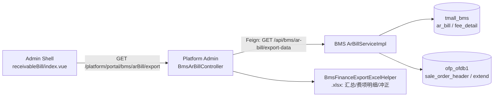
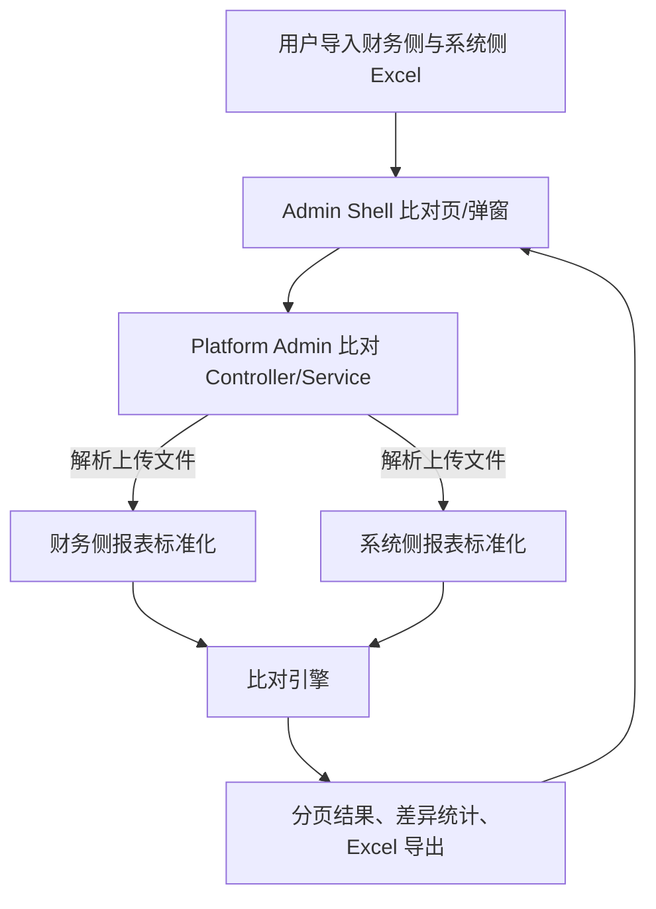

# 2026-07-10 BMS 财务侧与系统侧应收账单报表比对技术调整方案与计划

## 1. 文档目的与边界

本文将 `aidocs` 提交 `b0c4ea1679c2aa9d714b4541a62fe177ce9983d0` 新增的需求，结合当前 BMS、Platform Admin、Admin Shell 和数据库结构，整理为可实施的技术调整方案。

本能力的定位是**内部测试验证工具**：以业务订单号为粒度，将财务人工整理/历史报表与 BMS 应收账单导出数据并排比对，用于定位缺单、重复、费项映射与金额差异。它不属于客户对账单、不改变账单金额、不参与核销，也不得反写财务文件、来源订单或 BMS 账单数据。

本轮建议仅覆盖“应收账单”报表的文件比对；返款账单、跨账单合并和正式对账闭环不在本次范围内。用户分别导入财务侧报表和系统侧报表后，在同一窗口查看比对结果；不要求先选择或绑定 BMS 内的一张账单。

## 2. 提交内容整理

提交主题为“财务侧报表与系统侧报表比对-应收账单”，包含以下变更。

| 文件 | 提交内容 | 技术含义 |
| --- | --- | --- |
| `product-caliber/bms/prd/财务系统.PRD.md` | 新增 17.4.2“财务侧报表与系统侧报表比对” | 明确内部测试用途、订单级比对、动态费项成对列、差异与导出要求。 |
| `product-caliber/bms/prd/derivant/数据分析.md` | 新增参考 SQL | 给出一次测试数据的订单全集、财务侧聚合和系统侧并排查询样例。 |
| `product-caliber/bms/prd/derivant/需求方向沟通登记.md` | 删除空文件 | 无业务实现影响。 |

### 2.1 必须满足的需求规则

1. 以`业务订单号`作为两侧主键；核重时间只用于筛选、排序与辅助判断。
2. 两侧任一侧存在的订单都必须保留；结果需要分别标识“财务侧报表”“系统侧报表”是否存在。
3. 同一订单号在任一侧出现多行时，不能静默合并，必须提示重复并保留原始行号/可追溯信息。
4. 费项列取两侧费项名称的并集，并按`<费项><财务侧>`、`<费项><系统侧>`相邻成对输出。
5. 空值与零值必须区分：无订单、无费项金额显示为空；数值零必须显示`0`。
6. 缺单、仅一侧有金额、金额不一致均属于差异，须支持筛选、导出与按订单号定位。
7. 默认排序：核重时间倒序、业务订单号升序。
8. 参考 SQL 中“`/`订单号用承运单号回连”“收件人地址区分超材费/转板费/税金”“代收返款汇总”等仅是某次财务文件的示例口径，不能固化为 BMS 通用业务规则。

## 3. 现状核查结论

### 3.1 现有调用链

当前代码已存在“BMS 结构化导出 -> Platform Admin 写 Excel -> Admin Shell 下载”的完整链路：

对应实现位置：

| 层级 | 现有文件/能力 |
| --- | --- |
| Admin Shell | `admin_shell/src/views/billing/receivableBill/index.vue` 已有“导出明细”入口；`admin_shell/src/api/billing.js` 的 `exportArBillDetail` 调用 `/platform/portal/bms/arBill/export`。 |
| Platform Admin | `BmsArBillController.export()` 调用 BMS 导出接口；`BmsFinanceExportExcelHelper` 输出真实 `.xlsx`，已有“汇总”“费项明细”“往期账单冲正信息”3 个 Sheet。 |
| BMS API | `ArBillRemoteService.exportData()` / `ArBillController.exportData()` 已提供 `GET /api/bms/ar-bill/export-data`。 |
| BMS 组装 | `ArBillServiceImpl.exportData()` 按 `businessOrderNo` 聚合 `fee_detail`，返回 `ArBillFinanceExportRespDTO`、动态 `feeColumns`、费用单元格与调账信息。 |

### 3.2 与本需求的差距

现有导出解决的是“系统侧报表下载”，尚未实现下列比对能力：

1. 上传/读取财务侧 Excel，或保存本次文件的列定义与原始行号。
2. 财务侧列名到标准费项名称的可配置映射。
3. 财务侧与系统侧订单全集（full outer join 语义）。
4. 对重复订单、缺单、金额差异、时间差异的结构化判定。
5. 动态成对列的页面展示、差异筛选、比对结果 Excel 导出。
6. 对历史账单重复导出的数据版本/导出时间留痕。

### 3.3 数据库与关联关系核查

本次仅使用 `aidocs/technical-caliber/bms/deployment/env.md` 中连接信息进行只读结构和聚合查询，未修改该文件或数据库。

1. `tmall_bms.ar_bill` 以 `bill_no` 为唯一业务键，保存账单类型、状态、主体隔离字段、账期与金额汇总；当前未删除账单共 19 张。
2. `tmall_bms.fee_detail` 以 `fee_no`、`dedupe_key` 唯一约束保存费用快照，具备 `bill_id`、`bill_no`、`business_order_no`、`fee_code`、`fee_name`、`amount_bill_currency`、币种与汇率字段；`business_order_no` 已有 `idx_fee_order` 索引。
3. 当前 `fee_detail` 有 1,096 条 `NORMAL` 数据。因现有导出查询实际使用 `NORMAL`，本方案不得误写成 `VALID` 作为有效状态。
4. 来源库 `ofp_ofdb1.sale_order_header` 已具备 `order_code`、`delivery_order_code`、`measure_time`、`fee_weight`、`place_order_time`、`delivery_time`、`signed_time`、运单、收件信息等字段；`sale_order_header_extend` 以唯一 `sale_order_id` 补充订单完成时间和部分费用字段。
5. 当前 `ArBillServiceImpl` 会先按 `sale_order_header.order_code` 查询，未命中时再按 `delivery_order_code` 回补；并补查 `cxms.ob_shipping_package_header` 的报关单、清关单、子运单等字段。因此系统侧比对数据应优先复用 BMS 的导出模型，而非在 Platform Admin 重写一套跨库取数 SQL。
6. `bms-ar-bill-schema-relationship-diagram.md` 所述主链路 `ar_bill -> fee_detail -> main_order` 与本次一致；其中 `fee_detail.bill_id/bill_no` 是账单范围约束，`business_order_no` 是订单级比对键。图中关系为结构推断关系，库中没有物理外键。

## 4. 技术调整方案

### 4.1 总体设计

保持现有职责边界，不把 Excel 解析和比对计算放入 Admin Shell：

推荐采用“**一次上传、一次计算、默认不落库**”的第一阶段实现：Platform Admin 在请求内解析两份文件并生成结果，前端在同一窗口展示。为支持结果分页、筛选和导出，可使用带短时过期时间的内存会话保存标准化结果；会话失效后要求重新导入。这样不改变账单数据，也不引入测试文件持久化和清理风险。

若确认需要跨天复查、多人共享、超大文件异步处理或审计，再单独立项增加比对批次与明细表；不得在未确认前新增表或保存含个人信息的完整财务文件。

现有 BMS 应收账单导出链路仍可作为“生成系统侧报表”的辅助入口，但比对服务必须以本次用户上传的系统侧文件为准，不能在后台重新导出并替换该文件内容。

### 4.2 入口与接口设计

在应收账单列表/详情中增加“财务报表比对”入口，打开独立页面或弹窗。前端新增独立 API 模块，例如 `admin_shell/src/api/billingReconciliation.js`，统一通过 `@/utils/request` 调用；页面不得直接使用 axios。

建议 Platform Admin 增加以下接口，均限定当前登录人的 `scId`，并由服务端校验账单归属：

| 接口 | 方法 | 说明 |
| --- | --- | --- |
| `/platform/portal/bms/arBill/reconciliation/template` | `GET` | 下载财务上传模板及字段说明。 |
| `/platform/portal/bms/arBill/reconciliation/preview` | `POST multipart/form-data` | 参数：财务侧 Excel、系统侧 Excel、映射配置（可选）；返回首屏结果、动态列、重复/差异统计和会话标识。 |
| `/platform/portal/bms/arBill/reconciliation/page` | `POST` | 按会话标识、差异类型、订单号、分页参数查询结果。 |
| `/platform/portal/bms/arBill/reconciliation/export` | `POST` | 按同一会话与筛选条件导出结果 `.xlsx`。 |

`preview/page/export` 的 DTO 均使用明确的 DTO/VO，不使用 `Map` 作为 Controller 或 Service 入参/返回值。上传文件仅允许 `.xlsx`；限制文件大小、行数、Sheet 名称/数量与解析超时，避免大文件占满 Web 进程内存。

### 4.3 系统侧报表标准化规则

1. 以用户上传的系统侧 Excel 为本次比对唯一系统侧来源，解析时保留原始行号、原始列名与原始金额文本。
2. 两侧均按模板中的业务订单号进行匹配；订单号为空或为`/`时，按模板规定的主运单号替补。承运单号不得重复，重复即导入失败并提示对应行号。
3. 系统侧核重时间保留原值，仅用于排序和时间差提示，不作为匹配键。
4. 系统侧金额与财务侧金额均以结算币种金额读取；本轮前提是同一次比对内两侧仅有一种且相同的结算币种。若文件中币种缺失、不唯一或不一致，导入失败，不进入金额比较。
5. 现有 `ArBillRemoteService.exportData()` 产生的“费项明细”可以作为系统侧文件的来源之一，但上传后的内容才是比对依据。

### 4.4 财务文件标准化规则

财务侧与系统侧均使用已提供的模板。模板中至少包含：`业务订单号`、`主运单号`、`核重时间`、`结算币种`，以及任意数量的费项金额列。存在性列不要求在源文件中提供，由导入成功行自动标识。

1. 将 Excel 单元格读为“原始行 DTO”，保留 Excel 行号、订单号原文、核重时间原文、原始列名和原始金额文本。
2. 订单号 `null`、空白或`/`时，以主运单号作为替补匹配键；主运单号为空或重复即为格式错误，阻止导入。
3. 每个财务侧费项列先按字段名相近度自动匹配系统侧费项列；无法唯一确认时在页面中要求用户逐项确认。未确认列不得参与金额比较，也不得静默并入任一系统费项。
4. 金额以 `BigDecimal` 解析，统一按 4 位小数比较；Excel 中的 0 必须保留为 `BigDecimal.ZERO`，空单元格保持 `null`。
5. 同一订单出现多行时，结果中保留各原始行号及重复标记；仅在“财务侧汇总金额”展示中按同订单同标准费项求和，不能掩盖重复事实。

### 4.5 比对与差异判定

比对引擎在内存中建立`订单号 -> 财务侧行集合/系统侧行`索引，取两者订单号并集生成结果。固定列为：业务订单号、展示核重时间、财务侧报表、系统侧报表、财务原始行号、差异类型；之后拼接稳定排序的成对动态费项列。

| 场景 | 判定 | 展示/处理 |
| --- | --- | --- |
| 仅财务侧有订单 | `FINANCE_ONLY` | 系统侧存在标记为空；全部系统侧费项为空。 |
| 仅系统侧有订单 | `SYSTEM_ONLY` | 财务侧存在标记为空；全部财务侧费项为空。 |
| 任一侧同订单多行 | `DUPLICATE_ORDER` | 导入失败，显示重复键和原始行号；不生成可比较结果。 |
| 两侧均有订单、同费项金额绝对差额大于等于 1 | `AMOUNT_MISMATCH` | 显示两侧金额及`系统侧 - 财务侧`差额。 |
| 一侧费项有值、另一侧为空 | `FEE_MISSING` | 作为金额差异处理；零值不属于空值。绝对差额小于 1 时标记为提示，不计入金额差异。 |
| 两侧核重时间均有值且不同 | `MEASURE_TIME_MISMATCH` | 提示型异常，不影响订单主键匹配。 |
| 费项未映射/币种不一致 | `MAPPING_OR_CURRENCY_UNCONFIRMED` | 不自动相减，必须先完成映射或币种口径确认。 |

金额比对只能在同一标准费项、同一结算币种口径下进行。本次已确认两侧报表均为单一且相同的结算币种；若不满足此条件，不能直接比较。

### 4.6 页面与 Excel 输出

前端页面建议放在 `admin_shell/src/views/billing/receivableBill/` 下的子组件或同级独立页，避免侵入现有账单列表的大量逻辑。页面包含：账单信息、上传区、列映射确认、统计卡片、差异筛选、结果表、下载按钮。

导出的 Excel 至少包含：

1. `比对明细`：固定列 + 每个费项相邻的财务侧/系统侧两列 + 差额/差异类型。
2. `差异汇总`：双方订单数、仅财务侧、仅系统侧、重复订单、金额差异、待映射费项数。
3. `映射与规则`：本次财务列名、标准费项、金额口径、未映射列和比较精度。

动态费项列排序必须在一次比对会话内固定：先遵循已确认映射顺序，再按财务上传列出现顺序，最后按系统侧首次出现顺序追加。每组严格按“财务侧、系统侧、差额”相邻输出；若产品坚持 PRD 的两列格式，可在页面/导出中将差额移至统一的异常明细 Sheet，但不能失去差异可追溯性。

## 5. 调整范围与文件清单

| 模块 | 计划调整 | 不调整内容 |
| --- | --- | --- |
| `admin_shell` | 新增比对页/组件及 `src/api/` API 定义；从应收账单页增加入口。 | 不修改现有应收导出 blob 下载逻辑；不硬编码服务地址。 |
| `platform-admin` | 新增双文件上传、会话、分页和导出 Controller/Service/DTO；解析两侧文件、比对并写出 Excel。 | 不在 Controller 直接拼业务 SQL；不直接连接来源库重复取数。 |
| `bms` | 第一阶段不新增比对接口；既有导出仅作为生成系统侧文件的可选辅助。 | 不修改账单、费用、核销、账单状态与来源数据。 |
| `aidocs` | 新增本方案，后续补充字段映射和验收记录。 | 不改动 `deployment/env.md`。 |
| 数据库 | 第一阶段无 DDL、无业务数据写入。 | 不创建导入表、不写回 `ar_bill`/`fee_detail`/来源库。 |

## 6. 实施计划与验收

### 阶段 1：需求口径定稿

1. 基于已提供的模板固化两侧文件的 Sheet、表头、订单号、主运单号、核重时间和结算币种校验规则。
2. 确认字段名相近度的匹配算法、唯一匹配阈值和用户手工确认交互。
3. 固化`/`订单号/空订单号以主运单号替补的规则，以及承运单号重复即导入失败的校验。

交付：字段映射表、上传模板、差异类型枚举、验收样本。

### 阶段 2：Platform Admin 比对后端

1. 定义请求、响应、会话、行、动态费项单元格和统计 DTO。
2. 实现安全的双 XLSX 解析、模板校验、金额/单一结算币种校验、重复订单识别与标准化。
3. 实现两侧订单并集、自动/人工费项映射、绝对差额阈值、分页与导出。
4. 对上传大小、行数、会话有效期和导出数据量设置常量化上限。

验收：同一账单可生成可复现的比对结果；无数据库写操作；空值和零值区分正确。

### 阶段 3：Admin Shell 页面联调

1. 新增入口、上传、映射确认、结果表、差异筛选和下载交互。
2. 复用项目的 `request` 封装与 Element UI 上传/表格组件。
3. 校验选择账单、权限失败、空文件、未知列、超限文件、接口超时等提示。

验收：用户可从应收账单页完成“上传—预览—筛选—下载”闭环，不影响原有账单导出。

### 阶段 4：测试与业务验收

至少覆盖：

1. 两侧完全一致；财务侧仅有订单；系统侧仅有订单。
2. 任一侧重复订单、重复主运单号，均应阻断导入并定位行号。
3. 空金额、零金额、负数（冲正）、三位及四位小数，以及绝对差额小于 1/大于等于 1。
4. 财务费项独有、系统费项独有、名称相近自动匹配、用户确认映射、未映射费项。
5. 核重时间不一致、结算币种不唯一/不一致、`/`订单号、缺失订单号和主运单号替补。
6. 导出结果的动态列顺序、相邻侧别列、筛选结果与页面一致。

## 7. 已确认口径与剩余实现约束

以下内容已由需求方确认，并作为本次实施约束：

1. 两侧文件均有既定模板。
2. 两侧订单号语义一致；示例 SQL 已定义订单号与承运单号的例外处理。
3. 订单号为空或为`/`时暂按主运单号匹配；主运单号不允许重复，重复即报错。
4. 一次比对的两侧报表均假定为单一、相同的结算币种。
5. 导入时按字段名相近度自动配对费项；不能明确配对时由用户确认。
6. 不允许重复订单，发现重复订单即报错。
7. 金额绝对差额小于 1 时不计为金额差异。
8. 不需要跨天保存、共享或审计比对会话。
9. 用户自行导入财务侧与系统侧报表，点击比对后在同一窗口展示结果。
10. 无业务订单号时使用主运单号替补，遵循示例 SQL 的口径。

实施前仍需从已提供模板中固化具体 Sheet 名、表头名称和表头所在行；这属于实现配置，不改变以上业务口径。

## 8. 风险与控制

1. 不应复制参考 SQL 中的 `DATE_FORMAT`、`IF` 等在连接列上运算的写法到生产查询；本方案按结构化数据在应用层比较，避免对数据库索引列使用函数。
2. 用户上传的系统侧文件才是比对依据；若其由现有 BMS 导出生成，现有导出仍会跳过 `businessOrderNo` 为空的费用行。对这类数据需在系统侧文件生成阶段先按主运单号补齐，或在比对导入阶段按确认口径完成替补。
3. 财务文件可能含订单、地址、电话等敏感数据。第一阶段不落库，并限制日志不得打印原始行内容；如后续持久化，须增加权限、脱敏、过期清理与审计设计。
4. 现有数据库仅验证了结构与聚合数据，未用真实财务样本验证费项映射；上线前必须以已确认的同一账期样本完成端到端对比验收。

## 9. 结论

现有系统侧应收账单导出可继续作为系统侧文件的辅助来源，但本需求的核心是让用户导入两份已生成报表，并在 Platform Admin 完成“模板校验 + 费项自动/人工映射 + 订单并集比对 + 差异输出”，再由 Admin Shell 在同一窗口展示结果。第一阶段无需改 BMS 业务表或来源库，也不保存比对文件；已确认口径可直接进入详细接口与页面设计。
