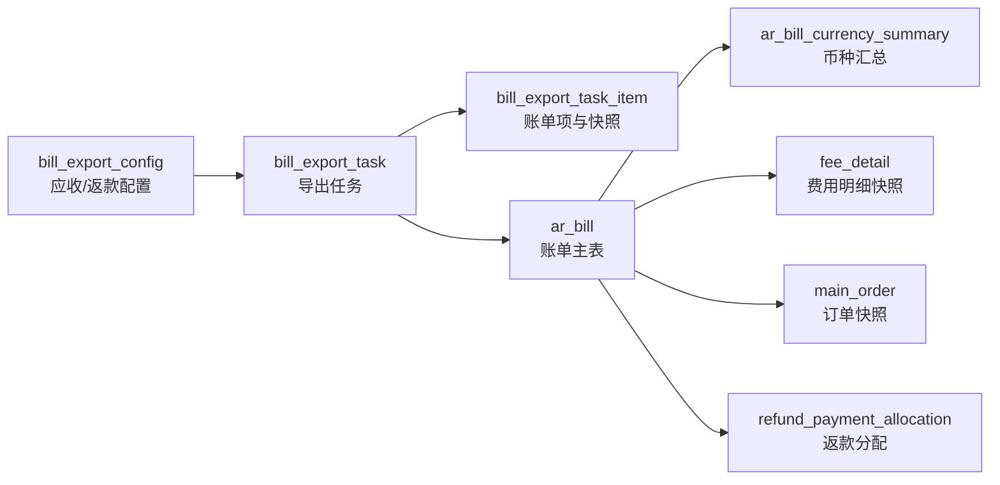
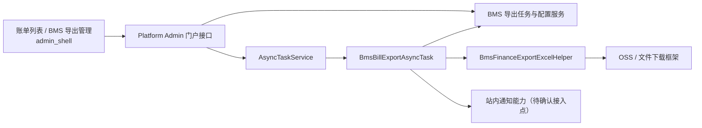

# 应收与返款账单异步导出技术调整方案与实施计划

**日期：** 2026-07-15  
**适用范围：** BMS 应收账单（`MEMBER_AR`）、返款账单（`COD_REFUND`）及 `admin_shell` 财务端。  
**需求依据：** `aidocs` 提交 `7036e9badb0237e1ac5632c1df9ef3261e4bdaa5` 中“17.6.1 对账报表导出”。

## 1. 目标与边界

将当前“选中单张账单后同步返回 Excel”的实现，调整为可多选、后台异步执行、在 **BMS 导出管理** 中查询和下载结果的能力。每张账单独立生成一个 Excel；批量任务将成功文件打包为 ZIP。

同时提供供应链级、按账单类型隔离的对账报表导出配置，并在 Sheet 1 追加如下固定信息区：

> 【本次更新：PRD 提交 `0111937ea46143f887c1e42b139109c7f7cd1819`】将原“账单告示/收款码”细化为客户告示、客服二维码和收款二维码；客服二维码同时适用于应收与返款账单。

| 账单类型 | 可配置内容 | 导出规则 |
| --- | --- | --- |
| 应收账单 | 客户告示、客服二维码、唯一对公收款账户、收款二维码 | 按“基本信息 → 币种汇总 → 客户告示 → 客服二维码 → 收款账户 → 收款二维码”输出；未配置项不留空白区。 |
| 返款账单 | 客户告示、客服二维码 | 按“基本信息 → 币种汇总 → 客户告示 → 客服二维码”输出；不输出收款账户和收款二维码。 |

本次不做以下内容：

1. 不新增用户自定义 Excel 模板、字段拖拽、任意 Sheet/列配置或表达式执行能力；PRD 已明确报表为固定三个 Sheet。
2. 不改变账单生成、审核、发送、核销、返款、调账和既有金额计算口径。
3. 不修改 `env.md`，不修改来源订单库数据。
4. 不将多张账单合并到同一工作簿；不扩展成本账单，除非产品另行确认。

## 2. 现状核查

### 2.1 前端

| 页面 | 当前入口与限制 | 当前 API |
| --- | --- | --- |
| `admin_shell/src/views/billing/receivableBill/index.vue` | 顶部导出按钮要求 `selectedRows.length === 1`；行操作和详情也可导出单张。 | `GET /platform/portal/bms/arBill/export?billNo=...` |
| `admin_shell/src/views/billing/refundBill/index.vue` | 与应收一致，仅能导出单张。 | `GET /platform/portal/bms/refundBill/export?billNo=...` |
| `admin_shell/src/api/billing.js` | 两个导出 API 均为 `responseType: 'blob'`。 | 浏览器收到响应后立即下载。 |

现有页面没有导出管理、配置页、任务轮询、批量选择确认或失败项重试能力。

### 2.2 后端与 Excel

1. `platform-admin` 的 `BmsArBillController#export`、`BmsRefundBillController#export` 均在请求线程内调用 BMS `exportData`，再调用 `BmsFinanceExportExcelHelper` 把文件写入 HTTP 响应。
2. BMS 已有 `ArBillRemoteService#exportData`、`RefundBillRemoteService#exportData`，负责按 `billNo + scId` 组装账单、币种汇总、明细、动态费项列及调账数据；数据组装应继续留在 BMS，不应在 Platform Admin 重算。
3. `BmsFinanceExportExcelHelper` 现固定输出“账单汇总、费项/返款明细、往期账单冲正信息”三个 Sheet。Sheet 1 当前只是键值对汇总，需按 PRD 重组为固定信息区并支持图片嵌入。
4. Platform Admin 已有 `AsyncTaskService`、`EntireFileDownloadTask`/`PageFileDownloadTask` 和下载链接能力。现有 `ClaimOrderExportTask` 等任务证明可由 `EntireFileDownloadTask` 输出文件列表；是否自动压缩多个文件、取消能力和文件删除回调需在实施前以框架版本验证。

### 2.3 数据关系与隔离

依据 `bms-ar-bill-schema-relationship-diagram.md` 及只读数据库核查：

`ar_bill` 是应收和返款共用账单主表，导出时必须以 `billNo + scId + billType` 校验；任务创建人、供应链和当前财务权限也必须在创建、执行、下载、重试各阶段重新校验。数据库中未发现可直接复用的“导出配置/导出任务/对公收款账户”表；`ar_bill_currency_summary.receipt_account_*` 是客户收款账户快照，不能作为对公收款账户配置复用。

## 3. 技术调整方案

### 3.1 架构与职责

| 模块 | 调整职责 |
| --- | --- |
| `bms/model` | 导出配置、任务、任务明细实体，以及创建、查询、详情、重试、取消、删除所需 DTO/VO；字段均有 JavaDoc。 |
| `bms/dao` | 新增三个 Mapper/XML；所有查询均以 `sc_id`、逻辑删除和任务/账单类型条件过滤。 |
| `bms/biz` | 负责配置保存、任务及账单项状态流转、权限复核、配置/账单数据快照、任务进度更新和导出终态站内通知落库；写操作使用 `@Transactional(rollbackFor = Exception.class)`。 |
| `bms/client`、`bms/web` | 发布 BMS 导出管理 Feign 契约；执行器按任务 ID 取得冻结快照和单项导出数据。 |
| `platform-admin` | 从登录态注入 `scId`、`userId`，转发 BMS 导出管理接口；新增 `BmsBillExportAsyncTask` 调用 BMS、渲染 Excel、交由现有文件任务框架保存。 |
| `admin_shell` | 账单列表改为可多选并提交任务；新增 BMS 导出管理页、对账报表导出配置及导出通知入口；请求统一放入 `src/api/billing.js`。 |

### 3.2 数据设计

新增表应同步完整 `CREATE TABLE` 至 `aidocs/technical-caliber/sql/ar_bill.sql`；以下是字段基线，最终 DDL 应按项目的审计列与索引规范落地。

> 【本次更新】配置及任务快照新增客服二维码文件键；原收款码文件键明确为仅应收使用的收款二维码文件键。收款账户按确认结论明文保存；导出终态通知采用 BMS 域内通知落库实现。

| 表 | 核心字段 | 说明与索引 |
| --- | --- | --- |
| `bill_export_config` | `sc_id`、`shop_id`、`user_id`、`bill_type`、`customer_notice_text`、`customer_service_qr_file_key`、`receipt_account_name`、`receipt_account_no`、`bank_name`、`receipt_qr_file_key` | 一种账单类型一条当前配置；唯一索引 `(sc_id, bill_type, is_deleted)`。配置为供应链级共享数据，`shop_id/user_id` 固定保存为全局占位值 `0`，不可作为查询过滤条件。返款账单的收款账户和收款二维码字段必须为空；账户编号按确认结论明文持久化。 |
| `bill_export_task` | `task_no`、`async_task_id`、`sc_id`、`shop_id`、`user_id`、`bill_type`、`task_status`、`total_count`、`processed_count`、`success_count`、`failed_count`、`config_snapshot_json`、`file_key`、`file_expire_at`、`finished_at` | 任务主记录；唯一索引 `task_no`，列表索引 `(sc_id, user_id, task_status, created_at)`。`config_snapshot_json` 固化客户告示、客服二维码、收款账户和收款二维码文件标识。 |
| `bill_export_task_item` | `task_id`、`sc_id`、`shop_id`、`user_id`、`bill_id`、`bill_no`、`item_status`、`data_snapshot_json`、`file_key`、`failure_reason`、`processed_at` | 每个账单一条，唯一索引 `(task_id, bill_no)`；用于进度、详情与仅重试失败项。`data_snapshot_json` 保存冻结的 BMS 导出数据，不保存临时下载 URL。 |
| `bill_export_notification` | `sc_id`、`shop_id`、`user_id`、`task_id`、`notice_type`、`title`、`content`、`redirect_path`、`read_status`、`read_at` | BMS 域内站内通知；任务终态向创建人写一条。唯一索引 `(task_id, notice_type)` 保证异步重试不重复通知，查询索引 `(sc_id, user_id, read_status, created_at)`；跳转地址固定为 BMS 导出管理的任务详情，不接受前端传入。 |

约束：

1. 所有新表均包含 `sc_id`、`shop_id`、`user_id`、逻辑删除和审计字段。配置维度仅为 `sc_id + bill_type`，由该供应链内所有客户共用，不按客户保存；应收、返款互不影响。
2. 客户告示和客服二维码在应收、返款两种配置中均可维护；收款账户和收款二维码仅允许应收配置，且应收最多一套。配置保存时校验：已填客服二维码必须是可用受控文件；应收已填收款账户时账户名称、账号、开户银行齐全；已填收款二维码必须是可用受控文件。
3. 任务、明细均保存 `sc_id`、创建/更新审计字段和逻辑删除标记；所有 SQL 先写隔离条件，不在 WHERE 列上使用函数。
4. 配置修改只更新当前配置；创建任务时 JSON 深拷贝客户告示、客服二维码文件键、收款账户和收款二维码文件键。因此后续配置变更不会影响待执行、执行中或已完成的任务。
5. `data_snapshot_json` 使用受控 DTO 序列化，不接受前端传入 JSON；动态费项列与单元格值须一并冻结。
6. 收款账户编号明文存储仅向财务管理员配置页、授权导出文件和任务快照开放；普通财务不得查询配置详情或通过任务接口取得配置明文。任务详情响应 DTO 不返回 `config_snapshot_json` 和账户编号字段。

### 3.3 任务创建、冻结与执行

1. 前端提交账单编号数组，后端限制账单类型一致、数组去重且数量上限由常量配置。
2. Platform Admin 从会话取得 `scId/userId`，不得信任前端传入的隔离字段；BMS 批量校验每张账单存在、归属供应链、类型匹配且当前用户仍有查看权限。
3. BMS 在创建事务内生成任务号和明细项，并冻结当前导出配置。为满足 PRD“任务创建时有效数据”要求，须同时调用现有 `exportData` 组装每张账单的导出 DTO，写入明细快照后才提交异步任务。
4. 成功创建后提交 Platform Admin 的 `BmsBillExportAsyncTask`；任务初始状态为 `WAITING`。若框架提交失败，BMS 任务标记为 `FAILED` 并保留失败原因，避免出现无执行器的假待执行任务。
5. 执行器逐项读取冻结 DTO 和配置快照，使用固定三 Sheet 渲染 Excel。单项失败只更新该项为 `FAILED`，继续处理其他项；每处理一项原子更新 `processed/success/failed` 计数。
6. 全部处理后：全成功为 `SUCCESS`，有成功有失败为 `PARTIAL_SUCCESS`，全失败为 `FAILED`；成功文件打 ZIP 并记录 `file_key`、`file_expire_at = finished_at + 1 天`。
7. 任意终态后由 BMS 在同一终态更新事务中向 `bill_export_notification` 写入创建人站内通知，内容包含任务状态、总数、成功数、失败数和任务详情跳转地址。通知落库失败应使该次终态更新回滚并交由异步任务重试，避免任务完成但没有通知。

### 3.4 状态、操作与幂等

| 状态 | 可执行操作 | 说明 |
| --- | --- | --- |
| `WAITING` | 取消、查看详情 | 取消成功后转 `CANCELLED`，不生成文件。 |
| `RUNNING` | 查看详情 | 禁止取消、删除、下载、重试。 |
| `SUCCESS` | 查看详情、下载（未过期）、删除 | 无失败项。 |
| `PARTIAL_SUCCESS` | 查看详情、下载（未过期）、重试失败项、删除 | 下载 ZIP 仅含成功 Excel。 |
| `FAILED` | 查看详情、重试失败项、删除 | 没有可下载文件。 |
| `CANCELLED` | 查看详情、删除 | 仍保留操作日志。 |

取消、删除、重试均以任务主表状态作条件更新，避免并发重复操作。执行器在每个账单项开始前及文件压缩前读取取消标记；已取消任务不再生成/上传文件。重试失败项必须新建任务，仅复制原任务失败账单号及**原任务的配置和数据快照**；不得混入当前配置或当前账单数据。执行器自行完成成功文件 ZIP 压缩；文件任务框架的下载文件在到期后由定时清理删除，任务删除时同步删除文件对象。删除仅逻辑删除 BMS 任务记录，操作日志和通知记录保留。

### 3.5 Excel 渲染调整

保留现有三 Sheet 和明细字段生成逻辑，调整 `BmsFinanceExportExcelHelper`：

> 【本次更新】Sheet 1 的图片区块由单一收款码拆分为“客服二维码”和“收款二维码”；返款账单也须渲染客服二维码。

1. Sheet 1 固定写“账单基本信息、结算币种分桶金额汇总、客户告示、客服二维码、收款账户、收款二维码”六个区块；返款只写前四个适用区块。
2. 金额区块逐条使用 `ar_bill_currency_summary` 的冻结数据；不再以单一账单币种替代分桶汇总。
3. 客户告示写多行单元格并启用自动换行；配置为空时整块不创建。
4. 客服二维码从冻结的 `customer_service_qr_file_key` 下载为图片后嵌入，应收和返款均适用；文件读取失败则该账单项失败，不生成误导性空码文件。
5. 收款账户写账户名称、账户编号、开户银行；收款二维码从冻结的 `receipt_qr_file_key` 下载为图片后嵌入，仅应收适用。账户编号按确认结论输出明文。客服二维码、收款二维码的展示尺寸、间距和图片对齐方式以产品提供的 UI 稿为唯一排版依据，不在后端硬编码独立样式口径；配置有误时，财务管理员修正对应配置后重新发起导出。
6. Sheet 2、Sheet 3 继续分别输出明细和往期冲正；无往期冲正仍输出 Sheet 3 表头。
7. 文件命名应含账单类型、账单编号和任务号，避免同批临时文件冲突；完成后清理本地临时文件。

### 3.6 API 与前端调整

建议统一门户前缀：`/platform/portal/bms/export`。所有写操作使用 POST，请求/响应均使用明确 DTO，不使用 `Map`。

> 【本次更新】对账报表导出配置表单按账单类型动态显示二维码字段：客服二维码两类账单都显示，收款二维码仅应收显示。

| API | 用途 |
| --- | --- |
| `POST /config/detail`、`POST /config/save` | 查询/保存当前账单类型的导出配置。 |
| `POST /task/create` | 传入 `billType + billNos`，返回任务号和状态。 |
| `POST /task/page`、`GET /task/detail` | 导出管理列表及单项失败原因、进度查询。 |
| `POST /task/cancel`、`POST /task/retry-failed`、`POST /task/delete` | 状态受控操作。 |
| `GET /task/download` | 校验创建人权限、任务终态和 1 天有效期后签发/代理下载。 |
| `POST /notification/page`、`POST /notification/read` | 查询当前用户导出终态通知、标记已读，并按通知中的受控任务 ID 跳转详情。 |

前端改动：

1. 应收、返款列表顶部导出按钮改为“至少选中一条可提交”；行操作及详情仍可一键创建单账单任务，不再下载 Blob。
2. 创建成功提示“已创建导出任务”，提供跳转 BMS 导出管理的入口；不在账单列表长轮询。
3. 新增导出管理路由、菜单权限码和页面：按任务号、账单类型、状态、创建人、创建时间筛选；展示进度、成功/失败数、完成时间、失效时间及受状态控制的操作。普通财务强制按当前 `userId` 查询，仅能查看和下载自己的任务；财务管理员可查询供应链内全部任务。
4. 导出配置入口在导出管理页；仅财务管理员拥有查看、保存和上传二维码权限。应收展示客户告示、客服二维码、收款账户、收款二维码字段，返款展示客户告示、客服二维码字段；普通财务不显示该入口。
5. 导出管理页增加当前用户未读导出通知入口，点击后跳转对应任务详情并标记已读。
6. `admin_shell/src/api/billing.js` 增加上述 API 定义；页面不得直接调用 axios，也不得硬编码服务地址。

## 4. 实施计划

| 阶段 | 工作项 | 产出与验收点 |
| --- | --- | --- |
| 1. 约束定稿 | 按第 5 节已确认约束冻结权限、明文存储、严格快照、二维码 UI 排版、文件生命周期和通知实现。 | 字段、状态枚举、权限码和验收口径定稿。 |
| 2. 数据与 BMS 领域 | 建表、归档 DDL、实体/DTO/枚举、Mapper XML、配置、任务与域内通知服务。 | 配置按类型隔离；客户告示、客服二维码、收款账户和收款二维码的快照均可追溯；终态通知可查询。 |
| 3. 异步执行 | 新增 BMS Feign 接口、Platform Admin 门户控制器和 `BmsBillExportAsyncTask`，实现 ZIP、取消标记、到期/删除文件清理、进度和通知。 | 单成功、部分成功、全失败、取消、删除、重试失败项均符合状态表。 |
| 4. Excel | 以冻结数据改造 Helper 的 Sheet 1 信息区及客服/收款二维码嵌入，保留 Sheet 2/3。 | 应收/返款各导出一份；二维码排版符合 UI 稿；未配置区块不留空白；无冲正仍有 Sheet 3 表头。 |
| 5. 前端 | 改造两个账单列表、新增导出管理与配置入口、补齐 API/路由/权限。 | 多选创建任务、查看进度、有效期下载、失败重试和取消/删除可用。 |
| 6. 联调验收 | 覆盖权限、快照、并发、文件过期、图片错误、部分失败与大批量。 | 不再依赖同步 Blob 导出；旧 `/export` 是否下线按灰度结果决定。 |

## 5. 已确认约束与实施决策

| 原疑问 | 已确认结论 | 方案落点 |
| --- | --- | --- |
| 1. 收款账户存储 | 账户编号明文存储。 | `bill_export_config.receipt_account_no` 和配置快照按明文保存；仅财务管理员可维护/查看配置，导出文件按授权下载。 |
| 2. 权限 | 导出配置仅财务管理员维护；普通财务只能查看自己的任务。 | 门户接口从登录态强制注入 `userId`；普通财务任务列表、详情、下载均限定创建人，管理员可查看供应链内任务。 |
| 3. 文件任务能力 | 必须支持 ZIP、取消、删除和 1 天失效。 | `BmsBillExportAsyncTask` 自行实现 ZIP 和取消检查；文件到期定时清理，任务删除同步删除文件。 |
| 4. 站内通知 | 采用 BMS 域内通知实现。 | 新增 `bill_export_notification`，任务终态写入创建人通知；导出管理页展示并跳转任务详情。 |
| 5. 快照时点 | 同意严格“创建时冻结”。 | 创建任务时同步生成受控导出 DTO 和配置 JSON 快照，再提交异步渲染任务。 |
| 6. 二维码排版 | 排版参考产品 UI。 | 后端仅嵌入冻结图片；尺寸、间距、对齐和图片占位以 UI 稿验收，不另行自定义视觉规则。 |
| 7. 成本账单 | 本期无需导出。 | 不新增成本账单入口、类型、配置或任务处理分支。 |

## 6. 实施前检查清单

- [ ] 按第 5 节实现并验证明文账户、管理员配置权限和普通财务任务隔离。
- [ ] 验证 `BmsBillExportAsyncTask` 的 ZIP、取消、OSS 过期/删除能力。
- [ ] 验证 BMS 域内通知的创建、未读查询、已读和任务详情跳转。
- [ ] 确认客服二维码、收款二维码的上传/受控访问方案，禁止将临时 URL 写入任务快照。
- [ ] 完成 DDL 后同步完整最新表结构到 `aidocs/technical-caliber/sql/ar_bill.sql`。
- [ ] 新增的实体、DTO 字段和 Controller 端点均补齐 JavaDoc/`@ApiOperation`。
- [ ] 所有写服务方法带 `@Transactional(rollbackFor = Exception.class)`，所有查询带供应链和权限校验。
