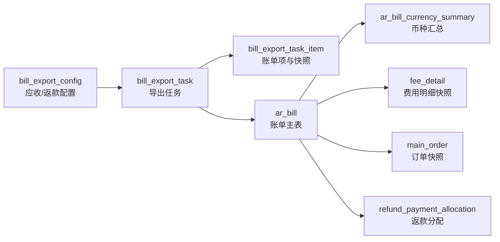
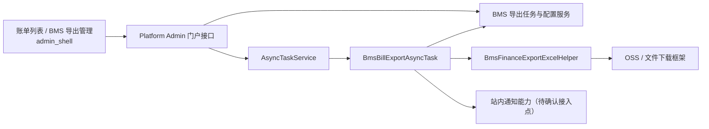

# 应收与返款账单异步导出技术调整方案与实施计划

**日期：** 2026-07-15  
**适用范围：** BMS 应收账单（`MEMBER_AR`）、返款账单（`COD_REFUND`）及 `admin_shell` 财务端。  
**需求依据：** `aidocs` 提交 `7036e9badb0237e1ac5632c1df9ef3261e4bdaa5` 中“17.6.1 对账报表导出”。

## 1. 目标与边界

将当前“选中单张账单后同步返回 Excel”的实现，调整为可多选、后台异步执行、在 **BMS 导出管理** 中查询和下载结果的能力。每张账单独立生成一个 Excel；批量任务将成功文件打包为 ZIP。

同时提供供应链级、按账单类型隔离的对账报表导出配置，并在 Sheet 1 追加如下固定信息区：

| 账单类型 | 可配置内容 | 导出规则 |
| --- | --- | --- |
| 应收账单 | 账单告示、唯一对公收款账户、收款码 | 按“基本信息 → 币种汇总 → 告示 → 收款账户 → 收款码”输出；未配置项不留空白区。 |
| 返款账单 | 账单告示 | 只输出告示；不输出收款账户和收款码。 |

本次不做以下内容：

1. 不新增用户自定义 Excel 模板、字段拖拽、任意 Sheet/列配置或表达式执行能力；PRD 已明确报表为固定三个 Sheet。
2. 不改变账单生成、审核、发送、核销、返款、调账和既有金额计算口径。
3. 不修改 `env.md`，不修改来源订单库数据。
4. 不将多张账单合并到同一工作簿；不扩展成本账单，除非产品另行确认。

## 2. 现状核查

### 2.1 前端

| 页面 | 当前入口与限制 | 当前 API |
| --- | --- | --- |
| `admin_shell/src/views/billing/receivableBill/index.vue` | 顶部导出按钮要求 `selectedRows.length === 1`；行操作和详情也可导出单张。 | `GET /platform/portal/bms/arBill/export?billNo=...` |
| `admin_shell/src/views/billing/refundBill/index.vue` | 与应收一致，仅能导出单张。 | `GET /platform/portal/bms/refundBill/export?billNo=...` |
| `admin_shell/src/api/billing.js` | 两个导出 API 均为 `responseType: 'blob'`。 | 浏览器收到响应后立即下载。 |

现有页面没有导出管理、配置页、任务轮询、批量选择确认或失败项重试能力。

### 2.2 后端与 Excel

1. `platform-admin` 的 `BmsArBillController#export`、`BmsRefundBillController#export` 均在请求线程内调用 BMS `exportData`，再调用 `BmsFinanceExportExcelHelper` 把文件写入 HTTP 响应。
2. BMS 已有 `ArBillRemoteService#exportData`、`RefundBillRemoteService#exportData`，负责按 `billNo + scId` 组装账单、币种汇总、明细、动态费项列及调账数据；数据组装应继续留在 BMS，不应在 Platform Admin 重算。
3. `BmsFinanceExportExcelHelper` 现固定输出“账单汇总、费项/返款明细、往期账单冲正信息”三个 Sheet。Sheet 1 当前只是键值对汇总，需按 PRD 重组为固定信息区并支持图片嵌入。
4. Platform Admin 已有 `AsyncTaskService`、`EntireFileDownloadTask`/`PageFileDownloadTask` 和下载链接能力。现有 `ClaimOrderExportTask` 等任务证明可由 `EntireFileDownloadTask` 输出文件列表；是否自动压缩多个文件、取消能力和文件删除回调需在实施前以框架版本验证。

### 2.3 数据关系与隔离

依据 `bms-ar-bill-schema-relationship-diagram.md` 及只读数据库核查：

`ar_bill` 是应收和返款共用账单主表，导出时必须以 `billNo + scId + billType` 校验；任务创建人、供应链和当前财务权限也必须在创建、执行、下载、重试各阶段重新校验。数据库中未发现可直接复用的“导出配置/导出任务/我司收款账户”表；`ar_bill_currency_summary.receipt_account_*` 是客户收款账户快照，不能作为“我司对公收款账户”配置复用。

## 3. 技术调整方案

### 3.1 架构与职责

| 模块 | 调整职责 |
| --- | --- |
| `bms/model` | 导出配置、任务、任务明细实体，以及创建、查询、详情、重试、取消、删除所需 DTO/VO；字段均有 JavaDoc。 |
| `bms/dao` | 新增三个 Mapper/XML；所有查询均以 `sc_id`、逻辑删除和任务/账单类型条件过滤。 |
| `bms/biz` | 负责配置保存、任务及账单项状态流转、权限复核、配置/账单数据快照和任务进度更新；写操作使用 `@Transactional(rollbackFor = Exception.class)`。 |
| `bms/client`、`bms/web` | 发布 BMS 导出管理 Feign 契约；执行器按任务 ID 取得冻结快照和单项导出数据。 |
| `platform-admin` | 从登录态注入 `scId`、`userId`，转发 BMS 导出管理接口；新增 `BmsBillExportAsyncTask` 调用 BMS、渲染 Excel、交由现有文件任务框架保存。 |
| `admin_shell` | 账单列表改为可多选并提交任务；新增 BMS 导出管理页和对账报表导出配置弹窗/页面；请求统一放入 `src/api/billing.js`。 |

### 3.2 数据设计

新增表应同步完整 `CREATE TABLE` 至 `aidocs/technical-caliber/sql/ar_bill.sql`；以下是字段基线，最终 DDL 应按项目的审计列与索引规范落地。

| 表 | 核心字段 | 说明与索引 |
| --- | --- | --- |
| `bill_export_config` | `sc_id`、`bill_type`、`notice_text`、`receipt_account_name`、`receipt_account_no`、`bank_name`、`payment_qr_file_key` | 一种账单类型一条当前配置；唯一索引 `(sc_id, bill_type, is_deleted)`。返款账单的收款字段必须为空。账号明文是否允许持久化见疑问 1。 |
| `bill_export_task` | `task_no`、`async_task_id`、`sc_id`、`creator_user_id`、`bill_type`、`task_status`、`total_count`、`processed_count`、`success_count`、`failed_count`、`config_snapshot_json`、`file_key`、`file_expire_at`、`finished_at` | 任务主记录；唯一索引 `task_no`，列表索引 `(sc_id, creator_user_id, task_status, created_at)`。`config_snapshot_json` 固化告示、账户和收款码文件标识。 |
| `bill_export_task_item` | `task_id`、`bill_id`、`bill_no`、`item_status`、`data_snapshot_json`、`file_key`、`failure_reason`、`processed_at` | 每个账单一条，唯一索引 `(task_id, bill_no)`；用于进度、详情与仅重试失败项。`data_snapshot_json` 保存冻结的 BMS 导出数据，不保存临时下载 URL。 |

约束：

1. 配置维度仅为 `sc_id + bill_type`，由该供应链内所有客户共用，不按客户保存；应收、返款互不影响。
2. 账户及二维码只允许应收配置，且应收最多一套；配置保存时校验账户名称、账号、开户银行和收款码文件完整性。
3. 任务、明细均保存 `sc_id`、创建/更新审计字段和逻辑删除标记；所有 SQL 先写隔离条件，不在 WHERE 列上使用函数。
4. 配置修改只更新当前配置；创建任务时 JSON 深拷贝配置。因此后续配置变更不会影响待执行、执行中或已完成的任务。
5. `data_snapshot_json` 使用受控 DTO 序列化，不接受前端传入 JSON；动态费项列与单元格值须一并冻结。

### 3.3 任务创建、冻结与执行

1. 前端提交账单编号数组，后端限制账单类型一致、数组去重且数量上限由常量配置。
2. Platform Admin 从会话取得 `scId/userId`，不得信任前端传入的隔离字段；BMS 批量校验每张账单存在、归属供应链、类型匹配且当前用户仍有查看权限。
3. BMS 在创建事务内生成任务号和明细项，并冻结当前导出配置。为满足 PRD“任务创建时有效数据”要求，须同时调用现有 `exportData` 组装每张账单的导出 DTO，写入明细快照后才提交异步任务。
4. 成功创建后提交 Platform Admin 的 `BmsBillExportAsyncTask`；任务初始状态为 `WAITING`。若框架提交失败，BMS 任务标记为 `FAILED` 并保留失败原因，避免出现无执行器的假待执行任务。
5. 执行器逐项读取冻结 DTO 和配置快照，使用固定三 Sheet 渲染 Excel。单项失败只更新该项为 `FAILED`，继续处理其他项；每处理一项原子更新 `processed/success/failed` 计数。
6. 全部处理后：全成功为 `SUCCESS`，有成功有失败为 `PARTIAL_SUCCESS`，全失败为 `FAILED`；成功文件打 ZIP 并记录 `file_key`、`file_expire_at = finished_at + 1 天`。
7. 任意终态后给创建人发送站内通知，通知包含任务状态、总数、成功数、失败数及 BMS 导出管理入口。通知失败不能回滚已完成导出，需写日志并可补偿。

### 3.4 状态、操作与幂等

| 状态 | 可执行操作 | 说明 |
| --- | --- | --- |
| `WAITING` | 取消、查看详情 | 取消成功后转 `CANCELLED`，不生成文件。 |
| `RUNNING` | 查看详情 | 禁止取消、删除、下载、重试。 |
| `SUCCESS` | 查看详情、下载（未过期）、删除 | 无失败项。 |
| `PARTIAL_SUCCESS` | 查看详情、下载（未过期）、重试失败项、删除 | 下载 ZIP 仅含成功 Excel。 |
| `FAILED` | 查看详情、重试失败项、删除 | 没有可下载文件。 |
| `CANCELLED` | 查看详情、删除 | 仍保留操作日志。 |

取消、删除、重试均以任务主表状态作条件更新，避免并发重复操作。重试失败项必须新建任务，仅复制原任务失败账单号及**原任务的配置和数据快照**；不得混入当前配置或当前账单数据。删除仅逻辑删除 BMS 任务记录并撤销/删除文件对象；异步框架和操作日志保留策略以疑问 3 为准。

### 3.5 Excel 渲染调整

保留现有三 Sheet 和明细字段生成逻辑，调整 `BmsFinanceExportExcelHelper`：

1. Sheet 1 固定写“账单基本信息、结算币种分桶金额汇总、账单告示、我司收款账户、我司收款码”五个区块，返款仅写前三个适用区块。
2. 金额区块逐条使用 `ar_bill_currency_summary` 的冻结数据；不再以单一账单币种替代分桶汇总。
3. 告示写多行单元格并启用自动换行；配置为空时整块不创建。
4. 对公账户写账户名称、账户编号、开户银行；收款码从冻结的受控文件键下载为图片后嵌入，图片读取失败则该账单项失败，不生成误导性空码文件。
5. Sheet 2、Sheet 3 继续分别输出明细和往期冲正；无往期冲正仍输出 Sheet 3 表头。
6. 文件命名应含账单类型、账单编号和任务号，避免同批临时文件冲突；完成后清理本地临时文件。

### 3.6 API 与前端调整

建议统一门户前缀：`/platform/portal/bms/export`。所有写操作使用 POST，请求/响应均使用明确 DTO，不使用 `Map`。

| API | 用途 |
| --- | --- |
| `POST /config/detail`、`POST /config/save` | 查询/保存当前账单类型的导出配置。 |
| `POST /task/create` | 传入 `billType + billNos`，返回任务号和状态。 |
| `POST /task/page`、`GET /task/detail` | 导出管理列表及单项失败原因、进度查询。 |
| `POST /task/cancel`、`POST /task/retry-failed`、`POST /task/delete` | 状态受控操作。 |
| `GET /task/download` | 校验创建人权限、任务终态和 1 天有效期后签发/代理下载。 |

前端改动：

1. 应收、返款列表顶部导出按钮改为“至少选中一条可提交”；行操作及详情仍可一键创建单账单任务，不再下载 Blob。
2. 创建成功提示“已创建导出任务”，提供跳转 BMS 导出管理的入口；不在账单列表长轮询。
3. 新增导出管理路由、菜单权限码和页面：按任务号、账单类型、状态、创建人、创建时间筛选；展示进度、成功/失败数、完成时间、失效时间及受状态控制的操作。
4. 导出配置入口在导出管理页；应收展示告示、账户、二维码字段，返款仅展示告示。账户/二维码权限需与财务导出权限分离或复用，见疑问 2。
5. `admin_shell/src/api/billing.js` 增加上述 API 定义；页面不得直接调用 axios，也不得硬编码服务地址。

## 4. 实施计划

| 阶段 | 工作项 | 产出与验收点 |
| --- | --- | --- |
| 1. 需求确认 | 关闭第 5 节疑问，确认快照时点、账户密文方案、通知/文件框架能力和权限码。 | 评审结论、字段及状态枚举定稿。 |
| 2. 数据与 BMS 领域 | 建表、归档 DDL、实体/DTO/枚举、Mapper XML、配置与任务服务。 | 配置按类型隔离；任务、项、配置快照均可追溯。 |
| 3. 异步执行 | 新增 BMS Feign 接口、Platform Admin 门户控制器和 `BmsBillExportAsyncTask`，接入 OSS/下载框架、进度和通知。 | 单成功、部分成功、全失败、取消、删除、重试失败项均符合状态表。 |
| 4. Excel | 以冻结数据改造 Helper 的 Sheet 1 信息区与二维码嵌入，保留 Sheet 2/3。 | 应收/返款各导出一份；未配置区块不留空白；无冲正仍有 Sheet 3 表头。 |
| 5. 前端 | 改造两个账单列表、新增导出管理与配置入口、补齐 API/路由/权限。 | 多选创建任务、查看进度、有效期下载、失败重试和取消/删除可用。 |
| 6. 联调验收 | 覆盖权限、快照、并发、文件过期、图片错误、部分失败与大批量。 | 不再依赖同步 Blob 导出；旧 `/export` 是否下线按灰度结果决定。 |

## 5. 待确认疑问

1. **收款账户的安全存储与来源：** 是否已有统一的公司对公账户/文件管理服务可调用？若没有，账户编号是否允许在 BMS 新表明文保存，还是必须接入现有密钥服务加密？这决定字段和展示/下载权限设计。
2. **权限与菜单：** “BMS 导出管理”和“对账报表导出配置”使用哪个后端菜单权限码？配置是否仅财务管理员可维护，而普通财务只可创建/查看自己的任务？
3. **异步框架能力：** 当前 `EntireFileDownloadTask` 是否原生支持多文件 ZIP、任务取消、物理文件删除和自定义文件过期？若不支持，需要确认是扩展框架，还是由本模块自行压缩、删除 OSS 文件和实现取消标识。
4. **站内通知接入点：** 当前工作区未定位到可直接复用的站内通知 Feign 契约。请确认通知中心服务、消息模板和跳转链接格式；否则只能先记录任务终态，无法满足 PRD 的通知条款。
5. **严格快照的性能取舍：** 现有应收 `exportData` 会读取 BMS 快照并补查来源订单库。PRD 要求以任务创建时数据为准，因此方案要求创建时同步冻结每个账单的导出 DTO，批量较大时提交耗时会上升。是否接受这一严格口径，或允许改为“任务开始执行时冻结”？后者性能更好，但不满足原文的创建时口径。
6. **收款码形态：** PRD 写“收款码图片”，但未明确一张二维码还是支付宝/微信两张，也未明确最大尺寸/格式；请确认后确定配置字段及 Sheet 1 的排版。
7. **成本账单范围：** PRD 的批量导出段落提到成本账单，但本次口头需求仅指定应收与返款。是否明确排除成本账单，避免后续接口和页面范围膨胀？

## 6. 实施前检查清单

- [ ] 确认疑问 1～7 并冻结字段、权限和快照口径。
- [ ] 核对异步任务框架版本与多文件 ZIP、取消、OSS 过期/删除能力。
- [ ] 确认通知中心接口和消息模板。
- [ ] 确认二维码文件上传/受控访问方案，禁止将临时 URL 写入任务快照。
- [ ] 完成 DDL 后同步完整最新表结构到 `aidocs/technical-caliber/sql/ar_bill.sql`。
- [ ] 新增的实体、DTO 字段和 Controller 端点均补齐 JavaDoc/`@ApiOperation`。
- [ ] 所有写服务方法带 `@Transactional(rollbackFor = Exception.class)`，所有查询带供应链和权限校验。
