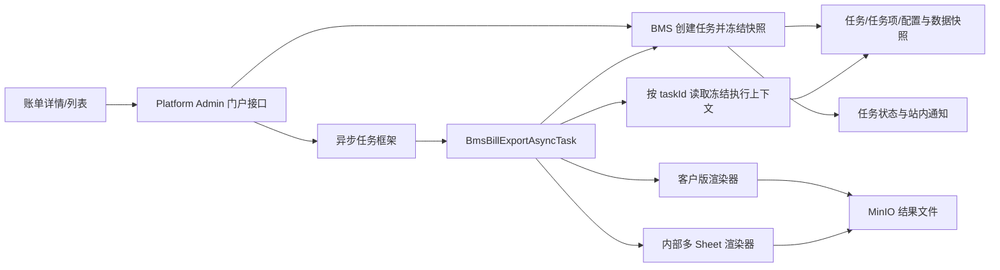

# 2026-07-21 BMS 应收账单内部明细导出技术调整方案与计划

**日期：** 2026-07-21  
**需求依据：** `aidocs` 提交 `cc761da8f8e15b3a4116ff8f30ad2445c02af887`（面向内部的对账报表导出）  
**适用范围：** `bms`、`platform-admin`、`admin_shell`、`aidocs/technical-caliber/sql/ar_bill.sql`  
**方案性质：** 在现有应收/返款账单异步导出能力上增量调整，不改账单生成、金额计算、审核、核销、返款和调账口径。

## 1. 提交内容整理

目标提交共调整 3 个产品文档文件，合计新增 242 行、删除 370 行：

| 文件 | 变更 | 与开发直接相关的内容 |
| --- | --- | --- |
| `product-caliber/bms/prd/财务系统.PRD.md` | 修改 | 将原“对账报表导出”明确拆为“导出给客户”和“导出给内部”；新增应收账单内部明细工作簿结构、导出入口、任务用途、结果文件类型、部分成功和失败重试规则。 |
| `product-caliber/bms/prd/derivant/概念实体关系图.md` | 修改 | 新增“导出管理”领域，补充导出配置、导出任务、任务账单和结果文件概念及关系；将技术约束与业务规则边界重新整理。 |
| `product-caliber/bms/prd/derivant/财务系统验收标准.md` | 删除 | 独立验收标准被移除，相关验收口径已并入主 PRD，开发与测试应以主 PRD 当前内容为准。 |

### 1.1 新增业务能力

1. 应收账单列表导出时必须由用户当次选择用途：
   - `导出给客户`：沿用客户对账报表结构，每张账单一个 Excel；多账单打 ZIP。
   - `导出给内部`：无论选择一张还是多张应收账单，都只生成一个 Excel；每张账单一个 Sheet。
2. 返款账单不提供内部导出，只允许`导出给客户`。
3. 应收/返款账单详情页导出固定为`导出给客户`，只处理当前账单，不弹出用途选择。
4. 内部 Excel 文件名为`应收账单内部费项明细_任务创建时间.xlsx`。
5. 内部 Excel 的 Sheet 按用户提交时的账单顺序排列。需求原文要求使用完整账单编号；经实施前确认，实际 Sheet 名遵循 Excel 约束，超长时允许截断。
6. 每个内部 Sheet 仅包含两个连续区域：
   - 账单基本信息；
   - 费项明细。
7. 内部导出不读取客户对账报表配置，不包含账单汇总、往期冲正、核销、客户告示、二维码或收款账户。
8. 导出管理新增`导出用途`、`结果文件类型`，任务详情新增`Sheet 名称或文件名称`。
9. 内部任务部分成功时，结果 Excel 只保留成功生成的 Sheet；失败项必须定位到具体账单。
10. 重试失败项后，在同一个任务下重新生成完整结果文件，并替换旧文件；旧文件立即失效。

### 1.2 保持不变的规则

1. 两类导出都只使用任务创建时冻结的账单结果，不读取历史账单快照，也不能在执行时读取最新账单结果替换任务快照。
2. 客户导出的三个 Sheet、动态费项、金额显示、3 位小数、`HALF_UP` 和客户可见信息边界不变。
3. 内部费项明细复用客户版 Sheet 2 的应收字段、动态费项、日期格式和金额格式。
4. 导出仍采用异步任务，支持进度、部分成功、下载、失败项重试、取消、删除、通知和文件失效。
5. 内部文件不得作为客户账单邮件附件，也不得被账单发送动作引用。

## 2. 现有代码核查结论

### 2.1 已具备的基础

| 能力 | 现有实现 |
| --- | --- |
| BMS 导出领域 | 已有 `bill_export_config`、`bill_export_task`、`bill_export_task_item`、`bill_export_notification` 四张表及实体、DTO、Mapper XML、Service、Feign 和 Controller。 |
| 账单快照组装 | `ArBillServiceImpl#exportData`、`RefundBillServiceImpl#exportData` 已能组装账单基础信息、明细、动态费项、汇总和冲正数据。 |
| Excel 渲染 | `BmsFinanceExportExcelHelper` 已能生成客户版应收/返款三 Sheet Excel，并支持对账配置和二维码。 |
| 异步执行 | `BmsBillExportAsyncTask` 已接入 `EntireFileDownloadTask`，可逐账单生成 Excel、压缩 ZIP、上传 MinIO 并回写进度。 |
| 前端管理页 | `admin_shell/src/views/billing/billExport/index.vue` 已有任务列表、详情、下载、取消、删除和导出配置界面。 |
| 列表批量入口 | 应收与返款列表在选择多张账单时已可创建异步任务。 |

### 2.2 与本次 PRD 的差距

| 编号 | 当前实现 | PRD 要求 | 调整结论 |
| --- | --- | --- | --- |
| G-01 | `BillExportTask` 没有导出用途、发起入口和结果文件类型。 | 管理页、通知和执行逻辑必须区分客户/内部用途。 | 任务主表及全链路 DTO 必须新增字段。 |
| G-02 | `BillExportTaskItem` 没有提交顺序、文件名称和 Sheet 名称。 | 内部 Sheet 保持所选顺序，详情展示文件名或 Sheet 名。 | 任务项新增顺序和结果名称字段。 |
| G-03 | 应收列表选中 1 张时直接调用旧同步 Blob；选中多张才创建异步任务。 | 列表导出无论 1 张或多张均先选择用途并创建异步任务。 | 统一改为任务入口。 |
| G-04 | 应收列表没有用途确认；返款列表也没有显式用途。 | 应收列表每次选择客户/内部；返款固定客户。 | 新增确认弹窗并由后端校验用途矩阵。 |
| G-05 | 账单详情仍调用同步 `/arBill/export`、`/refundBill/export`。 | 详情固定创建客户导出任务。 | 详情入口改走任务 API；旧接口仅灰度兼容。 |
| G-06 | 执行器固定“每账单一个 Excel + 全部 ZIP”。 | 客户单账单为 Excel、多账单为 ZIP；内部始终为单一 Excel、多账单多 Sheet。 | 执行器按用途拆分渲染策略。 |
| G-07 | 任务创建已保存 `config_snapshot_json` 和 `data_snapshot_json`，但执行器重新调用 `configDetail`、`exportData` 读取最新数据。 | 必须使用任务创建时冻结结果。 | 这是本次必须一并修复的正确性问题；执行器只能读取任务快照。 |
| G-08 | 异步参数直接携带 `billNos`，执行器不从 BMS 任务项读取顺序与快照。 | 执行结果必须以任务固化范围为准。 | 异步参数收敛为任务 ID 和隔离字段，任务内容由 BMS 返回。 |
| G-09 | 当前没有失败项重试 API/前端操作。 | 失败项可重试，成功后替换同任务完整结果文件。 | 新增同任务重试状态机和结果文件替换。 |
| G-10 | 取消只改 BMS 状态，执行器不检查取消标记；执行状态更新也没有期望状态条件。 | 待执行可取消，取消后不得继续生成并回写成功。 | 新增领取、取消检查和条件更新，防止终态被覆盖。 |
| G-11 | 删除任务只逻辑删除 BMS 记录，没有同步删除 MinIO 文件。 | 删除任务同步删除结果文件，日志保留。 | Platform Admin 删除流程增加受控文件删除。 |
| G-12 | 管理页没有用途/结果类型筛选与列，详情无结果名称，通知内容也无用途。 | 管理面板和通知明确区分用途。 | 补齐查询条件、响应字段和页面展示。 |
| G-13 | Platform Admin 将 `financeAdmin` 固定为 `false`，配置按钮未见管理员权限控制。 | PRD 原要求管理员与普通财务分权。 | 经实施前确认，首期不做角色判断：任务仍只允许本人查看和操作，导出配置不区分管理员角色。 |
| G-14 | 当前异步创建在 BMS 提交事务完成后才提交框架任务；提交失败会遗留 `WAITING` 任务。 | 创建失败必须有明确结果，不能留下无执行器任务。 | 增加提交失败补偿接口，将任务转失败并记录原因。 |
| G-15 | 已归档 DDL 中 `file_key` 注释固定为 ZIP，任务项也未保存结果名称。 | 结果可能是 XLSX 或 ZIP。 | 修改字段注释并补齐新字段；完整结构同步归档。 |

### 2.3 可复用数据与缺口

`ArBillFinanceExportRespDTO.bill` 已包含账单编号、状态、账期类型、账期、客户名称、客户编码、会员编码、业务板块、目的国、账单发送日和信用期结束日，因此内部 Sheet 的绝大部分基本信息可以直接使用冻结快照。

经实施前确认，内部 Sheet 的账单基本信息不写入店铺信息，因此无需补充账单级 `shopName`，也不从费项行反推店铺。

## 3. 总体技术方案

### 3.1 导出模式

| 账单类型 | 发起入口 | 导出用途编码 | 结果 |
| --- | --- | --- | --- |
| 应收 | 详情 | `CUSTOMER` | 当前账单一个客户版 Excel。 |
| 应收 | 列表 | `CUSTOMER` | 1 张为 Excel；多张为 ZIP，包内每账单一个客户版 Excel。 |
| 应收 | 列表 | `INTERNAL` | 始终一个 Excel，每张成功账单一个 Sheet。 |
| 返款 | 详情/列表 | `CUSTOMER` | 1 张为 Excel；多张为 ZIP。 |
| 返款 | 任意 | `INTERNAL` | 后端拒绝，不能只依赖前端隐藏。 |

建议新增枚举并集中管理，禁止继续在 Service 和执行器中散落字符串：

- `BillExportPurposeEnum`：`CUSTOMER`、`INTERNAL`；
- `BillExportSourceEnum`：`DETAIL`、`LIST`；
- `BillExportFileTypeEnum`：`XLSX`、`ZIP`。

任务创建时根据账单类型、入口、用途和账单数量计算结果类型，执行时不得重新推断。

### 3.2 链路调整

核心原则：异步执行器只负责读取冻结数据、渲染文件、上传结果和回写状态，不再调用账单实时查询接口或当前导出配置接口。

## 4. 后端调整方案

### 4.1 数据库调整

不新增业务表，在现有任务表和任务项表上增量扩展；实施时必须将变更后的完整 `CREATE TABLE` 同步到 `aidocs/technical-caliber/sql/ar_bill.sql`，不能只归档 `ALTER TABLE`。

#### `bill_export_task`

| 字段 | 类型建议 | 说明 |
| --- | --- | --- |
| `source_entry` | `varchar(32) NOT NULL` | 发起入口：`DETAIL`/`LIST`。 |
| `export_purpose` | `varchar(32) NOT NULL` | 导出用途：`CUSTOMER`/`INTERNAL`。 |
| `result_file_type` | `varchar(16) NOT NULL` | 结果文件类型：`XLSX`/`ZIP`。 |
| `data_frozen_at` | `datetime NOT NULL` | 任务数据冻结完成时间，用于审计“创建时快照”。 |
| `failure_reason` | `varchar(1000) NULL` | 任务级失败原因，如异步提交、合并工作簿、上传失败。 |

同时将 `file_key` 注释由“ZIP 文件键”改为“任务当前有效结果文件键”。分页索引建议调整为覆盖 `export_purpose`，具体以执行计划为准，避免重复保留高度相似索引。

#### `bill_export_task_item`

| 字段 | 类型建议 | 说明 |
| --- | --- | --- |
| `item_seq` | `int NOT NULL` | 用户提交顺序，从 1 开始；内部 Sheet 严格按此排序。 |
| `result_name` | `varchar(255) NULL` | 客户导出保存文件名；内部导出保存按 Excel 规则处理后的实际 Sheet 名。 |

`result_name` 用统一字段承接“文件名称或 Sheet 名称”，由任务用途解释，避免同时增加两个永远互斥的列。任务详情 DTO 对外仍可命名为 `resultName`。

#### 数据迁移

1. 历史任务回填：`source_entry=LIST`、`export_purpose=CUSTOMER`、`result_file_type=ZIP`。
2. 历史任务项按 `id` 在任务内生成 `item_seq`。
3. 历史任务结果名可为空，前端显示`-`；不根据旧文件键反向猜测包内文件名。
4. 新增非空字段时先加可空列、回填、校验，再改为非空，避免直接 DDL 阻塞或失败。

### 4.2 Model、DTO 与枚举

需要调整或新增：

1. `BillExportTask`、`BillExportTaskDTO`、`BillExportTaskQueryReqDTO`：增加发起入口、导出用途、结果文件类型、冻结时间和任务失败原因。
2. `BillExportTaskItem`、`BillExportTaskItemDTO`：增加提交顺序和结果名称。
3. `BillExportTaskCreateReqDTO`：增加 `sourceEntry`、`exportPurpose`；`scId/userId/operator` 仍由门户登录态覆盖。
4. `BillExportAsyncTaskParamDTO`：只保留 `taskId/scId/userId`，删除 `billType/billNos`，避免异步参数与任务库数据不一致。
5. 新增 `BillExportExecutionContextDTO`：返回任务用途、类型、结果类型、配置快照和有序任务项。
6. 新增 `BillExportExecutionItemDTO`：以明确 DTO 返回应收或返款冻结数据，不能用 `Map` 作为接口参数或返回值。
7. `BillExportTaskExecutionUpdateReqDTO`：增加任务失败原因、任务项结果名称，并增加期望状态或执行批次标识以防旧执行器覆盖新状态。

所有类和字段使用标准多行 JavaDoc；常量/枚举放在合适的公共模块，不在 Controller、Service、异步任务中新增魔法值。

### 4.3 任务创建与快照

1. 门户从登录态注入 `scId/userId/operator`，后端校验用途矩阵：
   - `DETAIL` 只能 `CUSTOMER` 且只能一个账单；
   - `COD_REFUND` 只能 `CUSTOMER`；
   - `INTERNAL` 只能 `MEMBER_AR + LIST`。
2. 使用 `LinkedHashSet` 去重并保留用户选择顺序，为每个任务项写入 `item_seq`。
3. 逐账单校验存在性、供应链归属、账单类型和当前用户访问权限；内部 Sheet 名按第 4.6 节规则规范化，不因账单编号超长直接失败。
4. 逐账单调用现有 `exportData` 组装受控快照并序列化到 `data_snapshot_json`；只在客户用途保存 `config_snapshot_json`，内部用途固定保存空对象，不读取导出配置。
5. 账单校验或快照构建失败时按任务项记录失败原因，不能因一张账单失败回滚其它合法账单。若全部失败，任务直接进入 `FAILED`，不提交异步执行器。
6. 快照完成后写入 `data_frozen_at`。异步执行阶段不得再调用 `ArBillRemoteService#exportData`、`RefundBillRemoteService#exportData` 或 `configDetail`。
7. 单次最多选择 50 张账单，该上限提取为常量或系统配置，并由前后端同时校验；快照总字节和单工作簿总行数的技术保护阈值通过压测确定，后端必须保留兜底限制。
8. Platform Admin 提交异步框架失败时调用任务提交失败补偿接口，将任务从 `WAITING` 条件更新为 `FAILED` 并保存失败原因。

### 4.4 执行接口与状态机

建议在现有 `BillExportRemoteService` 内增加只供执行器调用的明确接口：

| 接口 | 用途 |
| --- | --- |
| `POST /task/execution/claim` | `WAITING -> RUNNING` 条件领取，避免重复执行。 |
| `POST /task/execution/context` | 按 `taskId + scId` 获取用途、结果类型、配置快照和有序任务项。 |
| `POST /task/execution/item` | 分项读取已冻结的强类型导出快照，避免一次 Feign 响应过大。 |
| `POST /task/execution/item/update` | 回写任务项成功/失败、结果名称和失败原因。 |
| `POST /task/execution/finish` | 条件写入终态、计数、结果文件键、失效时间和通知。 |
| `POST /task/execution/submit-failed` | 异步框架提交失败补偿。 |

状态约束：

1. 领取只能 `WAITING -> RUNNING`；领取失败立即退出，不能继续生成。
2. 执行器处理每张账单前检查 `cancel_requested`；压缩、合并和上传前再次检查。
3. 运行进度和终态只能从当前执行批次、当前 `RUNNING` 状态更新，不能覆盖 `CANCELLED`。
4. `updateExecution`、创建、取消、删除、重试、终态更新等写操作均使用 `@Transactional(rollbackFor = Exception.class)`。
5. Mapper XML 的隔离条件先写 `sc_id`，同时带 `task_id`、逻辑删除和期望状态；不得在 WHERE 列上使用 SQL 函数。

### 4.5 客户导出执行策略

1. 单账单任务直接生成并上传一个 `.xlsx`，不再额外套 ZIP。
2. 多账单任务逐项从冻结快照生成客户版 Excel，成功文件压缩为一个 ZIP。
3. 配置使用任务的 `config_snapshot_json`；配置图片读取失败是否导致任务项失败应按既有确认口径执行，但绝不能改读当前配置。
4. 每个成功项的 `result_name` 保存 Excel 文件名；部分成功 ZIP 只包含成功项。
5. 保留现有三个 Sheet 和客户信息边界。

### 4.6 内部导出执行策略

在 `BmsFinanceExportExcelHelper` 增加内部工作簿写入能力，复用现有应收明细表头、动态费项列、日期单元格、金额数值/币种格式和样式，不复制一套独立字段口径。

每个 Sheet 的布局：

1. 顶部账单基本信息区输出：账单编号、账单状态、账期类型、账期、客户名称、客户编码、会员编码、业务板块、目的国、账单发送日、信用期结束日；经实施前确认，不写入店铺信息。
2. 账期格式：`YYYY/MM/DD - YYYY/MM/DD`。
3. 基本信息区结束后保留一行空行。
4. 下一行为费项明细表头，随后输出明细数据。
5. 不创建`账单汇总`、`往期账单冲正信息`等额外 Sheet。

生成流程：

1. 按 `item_seq` 读取任务项。
2. 每个任务项先生成安全 Sheet 名，再从冻结快照向同一个工作簿追加 Sheet。名称规则固定为：以账单编号为原始值，使用 Apache POI 的安全名称规则将 Excel 禁止字符替换为下划线；超过 31 个字符时截断；同一工作簿内截断后重名时预留后缀长度并追加 `~2`、`~3` 等序号，确保名称合法且唯一。空名称使用`账单`加任务项序号兜底。
3. 如果单个 Sheet 写入失败，移除该次创建的不完整 Sheet，将该任务项标记失败，继续处理下一项。
4. 至少一个 Sheet 成功时写出一个 `.xlsx` 并上传；全部失败时不生成结果文件。
5. 文件名中的任务创建时间使用固定格式（建议 `yyyyMMddHHmmss`），避免文件系统非法字符。
6. 任务项 `result_name` 保存最终实际 Sheet 名，任务 `result_file_type` 固定为 `XLSX`，任务详情据此展示截断或去重后的名称。
7. 内部模式完全忽略 `config_snapshot_json`，不下载二维码，也不写客户告示和收款信息。

若单次允许的账单数或明细行数较大，应在压测后决定继续使用 `XSSFWorkbook` 还是改用 `SXSSFWorkbook`。切换流式工作簿时需验证动态列、金额格式、自动列宽和临时文件清理，不可直接替换后默认行为一致。

### 4.7 失败重试与文件替换

本次按新 PRD 使用“同任务重试”，不新建任务：

1. 只有 `PARTIAL_SUCCESS`、`FAILED` 且存在失败项时允许重试。
2. 重试操作使用行锁锁定任务，生成新的执行批次号，将失败项转为 `WAITING`，任务转为 `WAITING`；原成功项及原冻结快照保持不变。
3. 执行器必须基于全部原成功项和本次重试项重新构建完整结果：
   - 客户导出重新生成单 Excel 或 ZIP；
   - 内部导出重新生成包含全部成功 Sheet 的单 Excel。
4. 新文件上传成功后，事务内将任务 `file_key` 切换到新文件键并更新计数/终态。
5. 已确认采用补偿清理：数据库切换成功后删除旧对象；若旧对象删除失败，记录清理补偿任务，不回滚已经可下载的新结果。
6. 旧下载地址在文件键切换后不再由任务接口签发，避免新旧结果并存。

为避免旧执行器回写，建议任务主表新增 `execution_version`；领取和所有状态更新都携带当前版本。若不新增版本字段，则至少使用 `updated_at + expectedStatus` 做乐观条件，但版本号方案更清晰可靠。

### 4.8 下载、删除与邮件隔离

1. 前端不得直接信任列表返回的 `fileKey` 调通用下载接口；新增任务下载接口，由门户再次校验供应链、任务创建人、任务状态和失效时间后签发地址。首期不提供管理员跨用户下载分支。
2. 删除已完成任务时先取得受控文件键，逻辑删除任务后删除 MinIO 对象；对象删除失败进入补偿记录。
3. 到期清理由定时任务按 `file_expire_at` 处理并清空/失效文件状态。
4. 邮件发送接口只能接受 `CUSTOMER` 用途的有效任务结果；`INTERNAL` 结果在服务端直接拒绝，不能依赖前端不展示。

## 5. 前端调整方案

### 5.1 应收账单列表

1. `exportSelectedBills` 不再对单张选择分流到同步 Blob。
2. 每次点击导出都弹出用途确认，展示：选择账单数、用途、预期文件结构。
3. 不记录、不自动复用上次用途。
4. `导出给客户`提交 `sourceEntry=LIST, exportPurpose=CUSTOMER`。
5. `导出给内部`提交 `sourceEntry=LIST, exportPurpose=INTERNAL`。
6. 创建成功后提示任务号并提供进入导出管理的入口。

### 5.2 应收/返款详情与返款列表

1. 详情页“导出账单”统一创建 `DETAIL + CUSTOMER` 单账单任务，不展示用途选择。
2. 返款列表创建 `LIST + CUSTOMER`，不展示内部选项。
3. 旧同步 Blob API 在灰度期保留但不再被新页面调用；验证稳定后另行下线。

### 5.3 导出管理

1. 筛选区增加`导出用途`；补齐创建人和创建时间条件。
2. 列表增加`导出用途`、`结果文件类型`，进度显示数量和百分比。
3. 详情顶部展示用途、发起入口、结果文件类型；任务项展示账单编号、处理结果、文件名称/Sheet 名称、失败原因和处理时间。
4. `PARTIAL_SUCCESS/FAILED` 且存在失败项时显示`重试失败项`。
5. 通知文案增加导出用途。
6. 首期不做财务管理员/普通财务角色判断：具有 BMS 导出管理页面访问能力的用户均可看到并维护供应链级对账报表配置；任务列表、详情、下载、取消、删除和重试仍严格限定当前创建人。
7. API 继续集中在 `admin_shell/src/api/billing.js`，页面使用 `@/utils/request`，不硬编码服务地址。
8. 沿用现有 BMS 导出管理菜单访问控制，不为本次导出配置新增管理员专属权限码；后续启用角色分权时另行补充按钮权限和后端鉴权。

## 6. 实施计划

| 阶段 | 工作内容 | 主要产出 | 验收点 |
| --- | --- | --- | --- |
| P0 口径固化 | 按第 7.1 节已确认决策固化用途/入口/文件类型枚举、50 张上限、Sheet 安全命名、不输出店铺、首期不分角色和旧文件补偿清理。 | 冻结接口与字段字典。 | 已确认决策全部映射到接口、DDL 和验收项。 |
| P1 数据与模型 | 扩展任务/任务项表，回填历史数据；更新完整 DDL；调整实体、DTO、枚举和 Mapper XML。 | DDL、模型、查询与映射。 | 新旧任务均可查询；隔离、索引、JavaDoc 符合规范。 |
| P2 快照与状态机 | 改造创建、领取、分项查询、状态条件更新、提交失败补偿、取消检查、同任务失败重试。 | BMS Service/Feign/Controller。 | 执行器无法读到最新账单替换快照；并发领取、取消、重试不串状态。 |
| P3 文件执行 | 拆分客户/内部执行策略；客户单 Excel/多 ZIP；内部单 Excel/多 Sheet；上传及旧文件替换。 | Platform Admin 异步任务和 Excel Helper。 | 四种导出组合、部分成功、全失败、重试均得到正确文件。 |
| P4 门户与访问边界 | 增加用途校验、仅创建人可访问的受控下载、删除文件和邮件用途拦截；首期不做角色分支。 | Platform Admin Controller/Service。 | 用户只能操作本人任务，内部文件不能用于客户发送。 |
| P5 前端 | 改造三个导出入口、用途弹窗、导出管理筛选/列/详情/重试；导出配置入口不做角色判断。 | `admin_shell` 页面、API、路由。 | 应收列表每次选择用途；详情和返款不出现内部选项。 |
| P6 联调与回归 | 构建、接口联调、Excel 内容核对、权限/并发/文件生命周期/大数据量验证。 | 联调记录和验收清单。 | 第 8 节场景全部通过后再隐藏旧同步入口。 |

推荐实施顺序为 BMS 数据与契约 → Platform Admin 执行器 → 前端，避免前端先上线后创建无法识别用途的旧任务。

## 7. 疑问点与建议默认决策

### 7.1 已确认实施决策

| 编号 | 已确认事项 | 实施结论 | 方案落点 |
| --- | --- | --- | --- |
| D-01 | Sheet 名遵循 Excel 约束。 | 禁止字符替换为下划线，超过 31 字符截断；截断后重名追加序号后缀，`result_name` 保存实际名称。 | 第 4.1、4.3、4.6 节。 |
| D-02 | 内部 Sheet 不写店铺信息。 | 基本信息区移除店铺，不增加 `shopName`，不从明细推导店铺。 | 第 2.3、4.6 节。 |
| D-03 | 同意批量与容量建议。 | 单次账单上限固定为 50；快照字节和工作簿行数保护阈值在压测后固化。 | 第 4.3、8.4 节。 |
| D-04 | 首期不做角色判断。 | 所有用户只访问本人任务；导出配置不区分管理员角色，具有页面访问能力即可维护。 | 第 4.8、5.3 节。 |
| D-05 | 同意旧文件补偿清理。 | 新结果切换成功后删除旧对象；删除失败进入补偿，不回滚新结果。 | 第 4.7、4.8 节。 |

### 7.2 待联调前确认

| 编号 | 疑问 | 建议默认决策 |
| --- | --- | --- |
| Q-06 | 账单状态在内部 Excel 展示编码还是中文？ | 输出前端当前同口径中文标签，同时保留统一枚举映射，未知状态回退原编码。 |
| Q-07 | `账单发送日`是只显示日期还是完整时间？ | 字段名为“日”，建议 `yyyy/MM/dd`；信用期结束日同格式。若产品要求审计时点，再统一改为完整时间。 |
| Q-08 | 客户导出单账单从列表发起时是否也返回 Excel 而不是 ZIP？ | 按 PRD“单张账单生成一份 Excel、多张打 ZIP”执行，详情与列表单张结果一致。 |
| Q-09 | 内部工作簿部分成功时，失败账单是否需要空白占位 Sheet？ | 不保留占位 Sheet；只输出成功 Sheet，失败原因仅在任务详情展示。 |
| Q-10 | 内部导出的账单基本信息排版是否有 UI/Excel 样稿？ | 无样稿时使用两列键值区，按 PRD 字段顺序纵向排列，之后空一行再输出明细。 |
| Q-11 | 旧同步导出接口何时删除？ | 本次仅停止前端调用并标记废弃；完成一轮生产灰度且确认无外部调用后另提删除任务。 |
| Q-12 | 文件保留 1 天是自然日还是完成时间起 24 小时？ | 延续现有实现，按 `finished_at + 24 小时`。 |

## 8. 验收与回归清单

### 8.1 功能

- [ ] 应收列表选择 1 张或多张时，每次都要求选择客户/内部用途。
- [ ] 应收详情固定创建客户导出任务，不出现用途弹窗。
- [ ] 返款详情和列表固定客户用途，后端拒绝返款内部导出请求。
- [ ] 客户单账单结果是 Excel，客户多账单结果是 ZIP。
- [ ] 内部 1 张或多张结果始终是一个 Excel，每张成功账单一个 Sheet。
- [ ] 内部 Sheet 顺序与提交顺序一致；禁止字符已替换、超长名称已截断、重名已追加序号，详情展示最终实际名称。
- [ ] 内部 Sheet 基本信息不包含店铺。
- [ ] 前后端均阻止一次提交超过 50 张账单。
- [ ] 内部 Sheet 只包含账单基本信息、空行和费项明细。
- [ ] 内部导出不出现汇总、冲正、核销、告示、二维码和收款信息。
- [ ] 动态费项列、日期时间、金额真实数值、币种显示格式、3 位小数和 `HALF_UP` 与客户版应收明细一致。
- [ ] 管理页可按用途筛选并展示结果文件类型；详情显示文件名或 Sheet 名。

### 8.2 快照与一致性

- [ ] 创建任务后修改账单、汇率、费项或导出配置，任务结果仍使用创建时快照。
- [ ] 内部任务不读取或保存客户导出配置内容。
- [ ] 多次执行/框架重复投递只能有一个执行器成功领取任务。
- [ ] 取消后执行器停止处理，旧执行器不能把任务覆盖为成功。
- [ ] 部分成功后重试失败项，结果文件被完整重建并替换，旧地址失效。
- [ ] 全部失败时无下载文件；部分成功时仅包含成功文件或成功 Sheet。

### 8.3 权限与安全

- [ ] 普通财务只能查询、下载、取消、删除、重试本人任务。
- [ ] 首期不区分财务管理员角色；所有用户只能访问本人任务，具有页面访问能力的用户可维护供应链级客户导出配置。
- [ ] 下载接口二次校验权限、终态和有效期，不直接暴露任意 `fileKey` 下载能力。
- [ ] 内部文件无法被账单发送/邮件接口引用。
- [ ] 所有任务操作、文件替换和删除均保留操作日志。

### 8.4 工程验证

- [ ] `bms` 执行 `mvn clean package -Pdev`。
- [ ] `platform-admin` 执行 `mvn clean package -Pdev`。
- [ ] `admin_shell` 执行 `npm run lint` 和 `npm run build:prod`。
- [ ] 使用 1、2、上限数量账单分别验证正常、部分失败和全失败。
- [ ] 对大明细、多动态费项、多币种和多 Sheet 工作簿进行内存与耗时压测。
- [ ] 核对 `aidocs/technical-caliber/sql/ar_bill.sql` 中四张导出表为实施后的完整最新结构。

## 9. 本次方案边界

1. 不改账单金额、币种换算、费项归集、冲正、审核和核销业务逻辑。
2. 不新增返款账单内部明细导出。
3. 不新增任意模板设计器、字段拖拽或客户级导出模板。
4. 不将内部文件用于客户邮件或账单发送。
5. 不在本方案中直接删除旧同步导出接口。
6. 不因本次调整顺带重构其它异步任务或通用 Excel 框架。
