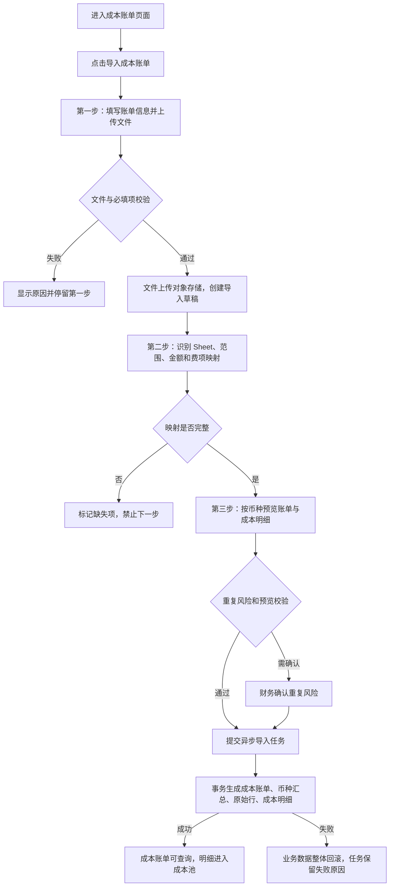

# 2026-07-27 BMS 成本账单导入与成本池需求落地方案及调整计划

## 1. 文档说明

本文是“成本账单导入到成本池”本期开发方案，依据以下内容编制：

1. 成本中心原型：`http://192.168.2.2:10100/`。
2. PRD：`aidocs/product-caliber/bms/prd/财务系统.PRD.md` 的 `13. 成本中心`。
3. 概念实体关系图：`aidocs/product-caliber/bms/prd/derivant/概念实体关系图.md`。
4. 已落地的供应商管理、成本费项索引方案及现有代码。
5. 2026-07-27 产品侧、技术侧疑问答复。

本文替代：

`2026-07-24-bms-成本账单与成本池需求落地方案及调整计划.md`

本次只调整实施方案，不修改业务代码、不执行数据库脚本。

## 2. 本期结论

### 2.1 一句话范围

本期只实现：

> 财务上传一份供应商成本账单，完成字段识别、费项映射和预览确认，系统异步生成成本账单，并把账单金额明细写入独立成本池。

### 2.2 技术边界

1. 成本业务独立建表，不读取、不写入、不修改 `ar_bill`、`fee_detail`。
2. 只复用：
   - `cost_supplier_profile` 等供应商基础资料。
   - `cost_fee_index` 成本费项索引。
   - 现有对象存储服务。
   - 现有数据库任务轮询、分页、操作日志等工程模式。
3. 成本账单和成本池只按 `sc_id` 隔离。
4. 本期不为未来能力预建结清、直接归属、分摊等业务表。

### 2.3 本期最小数据模型

```text
cost_bill_import_task
        │
        ├── 产生 1 个 cost_bill
        │                 │
        │                 ├── 1:N cost_bill_currency_summary
        │                 └── 1:N cost_detail
        │
        ├── 1:N cost_import_raw_row
        └── 覆盖更新 cost_import_setting_snapshot
```

成本金额事实：

1. 账单分币种汇总：`cost_bill_currency_summary`。
2. 成本池明细：`cost_detail`。
3. 原始导入金额永久保留。
4. 导入后不允许在成本账单、成本池页面直接修改金额。
5. 后续金额变化只能由调账中心承接，不能回写原始导入金额。

## 3. 已确认业务决策

| 编号 | 已确认口径 | 落地处理 |
| --- | --- | --- |
| D-01 | 按供应链隔离 | 所有成本业务表只保存 `sc_id`，所有查询首先使用 `sc_id` |
| D-02 | 本期只做成本账单导入到成本池 | 利润、报价覆盖、完整性分析不进入本期 |
| D-03 | 一张账单允许多个币种 | 账单按币种汇总；多数单币种账单仍走同一模型 |
| D-04 | 文件保存到现有对象存储 | 数据库保存文件链接、名称、哈希、大小和到期时间 |
| D-05 | 成本池不允许补录 | 页面和 API 均不提供补录入口 |
| D-06 | 供应商侧账单号必填 | 支持人工填写或人工点击生成；保存来源 |
| D-07 | 产品不限制 Sheet 数和行数，技术限制单文件 50 MB | 不设置产品层行数和 Sheet 数上限；解析使用异步流式处理 |
| D-08 | 本期不做菜单和按钮权限 | 不新增权限码校验；保留登录态和 `sc_id` 隔离 |
| D-09 | 原型中的相关分析面板本期不开放 | 不实现直接/间接、归属、分摊等 KPI 面板 |
| D-10 | 成本类型入口在第一步，第二步不再提供 | 本期第一步默认且只允许“间接成本”；导入后不允许切换 |
| D-11 | 账单日期取供应商账单落款日 | 无法识别时必须人工填写，不使用导入时间替代 |
| D-12 | 不允许按“已结清”状态导入 | 本期删除初始结清状态及结清数据输入 |
| D-13 | 原始文件和原始行保存 2 年 | 写入到期时间；到期清理任务另按运维任务实施 |
| D-14 | 本期不开发直接/间接成本区分逻辑 | 不做单号追溯、自动判型、直接归属和类型切换 |
| D-15 | 本期不开发成本分摊 | 不建分摊集、规则、执行和结果表 |
| D-16 | 本期不开发账单核销 | 不建结清记录、核销汇率、本位币核销金额 |

### 3.1 D-10 的具体解释

产品答复与技术答复合并后的口径为：

1. 成本类型字段放在导入第一步。
2. 本期默认值和唯一可提交值均为 `INDIRECT`。
3. 第二步的每个费项映射行不再显示成本类型下拉框。
4. 成本池不提供直接/间接切换。
5. 后续启动直接成本能力时，再扩展可选值和追溯校验；本期不提前开发。

### 3.2 D-07 的具体解释

1. 单个上传文件最大 50 MB。
2. 不定义固定工作表数量上限。
3. 不定义固定单表行数上限。
4. 正式导入必须异步执行，不能在 HTTP 请求中同步解析全量数据。
5. 使用流式读取，禁止把完整 Excel 和全部明细一次性放入 JVM 内存。
6. 文件损坏、压缩炸弹、对象存储下载失败或数据库容量不足时，任务失败并返回明确原因。

## 4. 本期范围

### 4.1 本期实现

#### 成本账单

1. 成本账单列表。
2. 成本账单详情。
3. 原始文件下载。
4. 三步导入向导。
5. 导入任务状态查询和失败原因展示。
6. 多币种账单金额汇总。

#### 成本池

1. 成本明细列表。
2. 成本明细详情。
3. 从成本明细追溯成本账单、导入任务、原始工作表和原始行。
4. 按供应商、板块、账期、成本费项、币种等条件查询。

#### 导入能力

1. 文件上传到现有对象存储。
2. 工作表识别。
3. 二维表范围和零散金额字段配置。
4. 供应商原始费项到标准成本费项映射。
5. 默认币种及逐金额字段币种覆盖。
6. 导入预览。
7. 异步整批落库。
8. 导入设置快照复用。
9. 重复账单识别和人工确认。

### 4.2 明确不实现

1. 成本池直接补录。
2. 成本池直接编辑、删除导入明细。
3. 初始已结清导入。
4. 登记结清、核销、反核销。
5. 核销汇率和本位币核销金额。
6. 直接成本识别、业务单号关系、直接归属。
7. 直接/间接成本切换。
8. 分摊规则、分摊集、分摊执行和分摊结果。
9. 利润、报价覆盖、完整性分析。
10. 菜单权限和按钮权限。
11. 原型中的直接/间接、归属和分摊分析面板。
12. 成本账单导出。

### 4.3 调账边界

1. 导入成功后，成本账单页面和成本池页面只读。
2. 需要修改账单金额时，必须从调账中心发起。
3. 本方案为调账保留 `imported_amount` 与 `effective_amount`：
   - `imported_amount`：导入原始金额，永不覆盖。
   - `effective_amount`：当前生效金额，只允许调账中心更新。
4. 经现有代码核查，当前调账中心的 Mapper 固定关联 `fee_detail`、`ar_bill`，当前不能直接调整 `cost_detail`、`cost_bill`。
5. 本期范围不包含调账中心的成本域适配，因此本期上线后成本数据保持只读；调账能力在下一期单独改造调账中心。
6. 不允许为了临时可改而在成本页面增加编辑入口。
7. 调账记录表及审批流程沿用或扩展调账中心时另行设计，本方案不新增第二套调账流程。

## 5. 现有实现基线

### 5.1 可以直接使用

1. BMS 已有供应商管理全链路。
2. BMS 已有成本费项索引全链路。
3. Platform Admin 已有供应商和成本费项代理模式。
4. Admin Shell 已有供应商、成本费项真实 API 接入。
5. 现有代码包含数据库任务轮询、对象存储、分页和 MyBatis XML 示例。
6. `platform-admin/web/src/main/java/com/szt/supplychain/platform/admin/web/utils/OSSUtil.java` 已实现阿里云 OSS 上传，并生成两年有效的签名访问链接，可作为成本账单原始文件上传实现基础。

### 5.2 当前缺口

1. `admin_shell/src/views/billing/costBill/index.vue` 仍是静态列表。
2. `admin_shell/src/views/billing/costPool/index.vue` 仍使用空数据脚手架。
3. Admin Shell 没有成本账单、导入和成本池 API。
4. BMS、Platform Admin 没有成本账单、导入和成本池接口。
5. 开发库没有独立成本账单、成本明细和导入表。
6. 当前 `FeeAdjustmentRecordServiceImpl`、`FeeAdjustmentRecord-mapper.xml` 依赖 `ar_bill`、`fee_detail`，尚不支持独立成本域。

### 5.3 旧表处理

1. 不修改 `ar_bill`。
2. 不修改 `fee_detail`。
3. 不通过 `bill_type` 把成本账单混入原账单。
4. 不把成本费项索引 ID 写入客户费项索引字段。
5. 原账单、原费项代码只作为工程模式参考。

## 6. 目标流程



### 6.1 核心业务规则

1. 一次导入只对应一个 `sc_id`、一个供应商、一张供应商账单和一个成本板块。
2. 供应商侧账单号必填。
3. 一张账单可以包含多个币种。
4. 同一金额字段只能对应一个标准成本费项和一个币种。
5. 一个原始行存在多个金额字段时，展开为多条 `cost_detail`。
6. 预览确认后整批成功或整批失败，不允许部分明细成功。
7. 本期所有成本明细的 `cost_type` 固定为 `INDIRECT`，不触发分摊。
8. 导入成功后原始金额、映射确认快照和原始行不可覆盖。

## 7. 页面落地方案

### 7.1 成本账单列表

#### 查询条件

1. 成本账单编号。
2. 供应商。
3. 成本板块。
4. 实际成本账期。
5. 供应商侧账单号。

本期移除结清状态筛选。

#### 列表字段

1. 成本账单编号。
2. 供应商。
3. 供应商侧账单号。
4. 成本板块。
5. 实际成本账期。
6. 分币种账单金额。
7. 成本明细数量。
8. 账单日期。
9. 导入时间。
10. 导入人。

#### 操作

1. 导入成本账单。
2. 查看详情。
3. 下载原始文件。

不展示登记结清、补录、类型切换、分摊等操作。

### 7.2 导入第一步：账单信息

| 字段 | 必填 | 规则 |
| --- | --- | --- |
| 供应商 | 是 | 只能选择启用的供应商财务档案 |
| 成本板块 | 是 | 必须是该供应商已启用板块 |
| 供应商侧账单号 | 是 | 人工填写或点击生成 |
| 账单号来源 | 系统 | `MANUAL/SYSTEM_GENERATED` |
| 默认币种 | 是 | 第二步可按金额字段覆盖 |
| 实际账期开始日 | 是 | 不晚于结束日 |
| 实际账期结束日 | 是 | 不早于开始日 |
| 账单日期 | 是 | 供应商账单落款日 |
| 成本类型 | 是 | 本期固定为间接成本 |
| 原始 Excel | 是 | 单文件不超过 50 MB |

供应商侧账单号生成功能：

1. 必须由用户主动点击。
2. 生成后允许用户在提交第一步前重新生成。
3. 格式建议：`CBS-{供应商编码}-{yyyyMMddHHmmss}-{6位随机串}`。
4. 保存 `supplier_bill_no_source = SYSTEM_GENERATED`。
5. 人工填写保存为 `MANUAL`。

### 7.3 导入第二步：识别与映射

保留：

1. 工作表导航。
2. 同一工作表并行提供“成本费项二维表”和“零散数值字段”两个页签，不再互斥切换识别模式。
3. 二维表起始行按表头所在 Excel 原始行号定义，实际数据从下一行开始，结束行按最后一条数据的原始行号定义。
4. 至多一个关键单号字段映射；没有可用单号时允许明确选择“无法映射到 OIS 单号”。
5. 二维表中每个金额列本身就是一个原始成本费项，逐列映射标准成本费项，不再配置“费项名称列”。
6. 金额字段、币种、正负方向映射。
7. 自动识别和重新识别。
8. 上次导入设置复用。

调整：

1. 删除每个费项行的成本类型下拉框。
2. 不做直接成本判定。
3. 不查询订单或尾程包裹。
4. 不生成归属结果和分摊建议。
5. 未映射标准成本费项的金额字段不能进入预览。
6. 工作表、二维表金额字段和零散数值字段均支持“是否入池”，未选中数据只保留在原始快照。
7. 本期虽固定为间接成本，仍保留原始关键单号类型和值，供后续追溯能力使用。

### 7.4 导入第三步：预览

预览汇总：

1. 工作表数量。
2. 纳入行数。
3. 展开后成本明细数量。
4. 按币种汇总的导入金额。
5. 未映射、非法金额、非法币种和重复风险数量。

预览明细：

1. Sheet 名称和原始行号。
2. 原始费项名称。
3. 标准成本费项。
4. 原始金额。
5. 币种。
6. 金额方向。
7. 成本类型，固定展示“间接成本”。
8. 校验结果。

本期不展示：

1. 初始结清状态。
2. 结清日期、汇率和凭证。
3. 直接归属结果。
4. 分摊集和分摊状态。

### 7.5 成本账单详情

#### 基本信息

1. 账单编号。
2. 供应商及快照。
3. 供应商侧账单号及来源。
4. 成本板块。
5. 实际账期。
6. 账单日期。
7. 成本类型。
8. 原始文件。
9. 导入任务编号、导入人和导入时间。

#### 币种汇总

每个币种展示：

1. 导入金额。
2. 当前生效金额。
3. 成本明细数量。

#### 成本明细

支持分页查看本账单对应的 `cost_detail`。

本期没有结清记录、归属或分摊页签。

### 7.6 成本池

#### 查询条件

1. 成本明细编号。
2. 成本账单编号。
3. 供应商。
4. 供应商侧账单号。
5. 成本板块。
6. 标准成本费项。
7. 币种。
8. 实际成本账期。

#### 列表字段

1. 成本明细编号。
2. 成本账单编号。
3. 供应商。
4. 成本板块。
5. 原始费项名称。
6. 标准成本费项。
7. 导入金额。
8. 当前生效金额。
9. 币种。
10. 实际成本账期。
11. Sheet 名称和原始行号。

#### 操作

1. 查看成本明细详情。
2. 查看所属成本账单。
3. 查看或下载原始文件。

不提供补录、编辑、删除、类型切换和分摊操作。

## 8. 数据库设计

### 8.1 设计原则

1. 只新增 6 张本期必需表。
2. 所有表只按 `sc_id` 隔离，这是本项目成本域的已确认例外口径。
3. 金额使用 `DECIMAL(18,4)`。
4. 原始导入金额和当前生效金额分开保存。
5. 每张表包含逻辑删除和审计字段。
6. 不建立数据库物理外键，由 Service 在事务内校验引用完整性。
7. WHERE 条件不对查询列使用函数。
8. 正式开发时将新增表完整结构同步到数据库结构归档文件。

### 8.2 成本账单

```sql
CREATE TABLE `cost_bill` (
  `id` bigint(20) unsigned NOT NULL AUTO_INCREMENT COMMENT '主键ID',
  `sc_id` bigint(20) NOT NULL COMMENT '供应链ID',
  `bill_no` varchar(64) NOT NULL COMMENT '成本账单编号',
  `supplier_id` bigint(20) unsigned NOT NULL COMMENT '供应商财务档案ID',
  `supplier_code_snapshot` varchar(64) NOT NULL COMMENT '供应商编码快照',
  `supplier_name_snapshot` varchar(128) NOT NULL COMMENT '供应商名称快照',
  `supplier_bill_no` varchar(128) NOT NULL COMMENT '供应商侧账单号',
  `supplier_bill_no_source` varchar(32) NOT NULL COMMENT '账单号来源：MANUAL/SYSTEM_GENERATED',
  `cost_board` varchar(32) NOT NULL COMMENT '成本板块',
  `cost_type` varchar(16) NOT NULL DEFAULT 'INDIRECT' COMMENT '成本类型；本期固定INDIRECT',
  `actual_period_start_date` date NOT NULL COMMENT '实际成本账期开始日',
  `actual_period_end_date` date NOT NULL COMMENT '实际成本账期结束日',
  `bill_date` date NOT NULL COMMENT '供应商账单落款日',
  `import_task_id` bigint(20) unsigned NOT NULL COMMENT '来源导入任务ID',
  `original_file_name` varchar(255) NOT NULL COMMENT '原始文件名',
  `original_file_url` varchar(1000) NOT NULL COMMENT '对象存储文件链接',
  `original_file_sha256` varchar(64) NOT NULL COMMENT '原始文件SHA-256',
  `original_file_size` bigint(20) unsigned NOT NULL COMMENT '原始文件字节数',
  `file_expire_at` datetime NOT NULL COMMENT '原始文件到期时间',
  `currency_count` int(11) NOT NULL DEFAULT 0 COMMENT '币种数量',
  `detail_count` int(11) NOT NULL DEFAULT 0 COMMENT '成本明细数量',
  `version` int(11) NOT NULL DEFAULT 0 COMMENT '乐观锁版本号',
  `is_deleted` tinyint(1) NOT NULL DEFAULT 0 COMMENT '逻辑删除：0正常 1删除',
  `created_by` varchar(64) NOT NULL COMMENT '创建人',
  `updated_by` varchar(64) NOT NULL COMMENT '最后更新人',
  `created_at` datetime NOT NULL DEFAULT CURRENT_TIMESTAMP COMMENT '创建时间',
  `updated_at` datetime NOT NULL DEFAULT CURRENT_TIMESTAMP ON UPDATE CURRENT_TIMESTAMP COMMENT '更新时间',
  PRIMARY KEY (`id`),
  UNIQUE KEY `uk_cost_bill_sc_no` (`sc_id`, `bill_no`),
  UNIQUE KEY `uk_cost_bill_supplier_no` (`sc_id`, `supplier_id`, `supplier_bill_no`),
  UNIQUE KEY `uk_cost_bill_import_task` (`import_task_id`),
  KEY `idx_cost_bill_supplier_period`
    (`sc_id`, `supplier_id`, `cost_board`, `actual_period_start_date`, `actual_period_end_date`),
  KEY `idx_cost_bill_date` (`sc_id`, `bill_date`, `is_deleted`)
) ENGINE=InnoDB DEFAULT CHARSET=utf8mb4 ROW_FORMAT=DYNAMIC COMMENT='成本账单';
```

### 8.3 成本账单币种汇总

```sql
CREATE TABLE `cost_bill_currency_summary` (
  `id` bigint(20) unsigned NOT NULL AUTO_INCREMENT COMMENT '主键ID',
  `sc_id` bigint(20) NOT NULL COMMENT '供应链ID',
  `cost_bill_id` bigint(20) unsigned NOT NULL COMMENT '成本账单ID',
  `cost_bill_no` varchar(64) NOT NULL COMMENT '成本账单编号',
  `currency` varchar(16) NOT NULL COMMENT '账单币种',
  `imported_amount` decimal(18,4) NOT NULL DEFAULT 0.0000 COMMENT '原始导入金额',
  `effective_amount` decimal(18,4) NOT NULL DEFAULT 0.0000 COMMENT '当前生效金额',
  `detail_count` int(11) NOT NULL DEFAULT 0 COMMENT '成本明细数量',
  `version` int(11) NOT NULL DEFAULT 0 COMMENT '乐观锁版本号',
  `is_deleted` tinyint(1) NOT NULL DEFAULT 0 COMMENT '逻辑删除：0正常 1删除',
  `created_by` varchar(64) NOT NULL COMMENT '创建人',
  `updated_by` varchar(64) NOT NULL COMMENT '最后更新人',
  `created_at` datetime NOT NULL DEFAULT CURRENT_TIMESTAMP COMMENT '创建时间',
  `updated_at` datetime NOT NULL DEFAULT CURRENT_TIMESTAMP ON UPDATE CURRENT_TIMESTAMP COMMENT '更新时间',
  PRIMARY KEY (`id`),
  UNIQUE KEY `uk_cost_bill_currency` (`cost_bill_id`, `currency`),
  KEY `idx_cost_bill_currency_no` (`sc_id`, `cost_bill_no`, `currency`, `is_deleted`)
) ENGINE=InnoDB DEFAULT CHARSET=utf8mb4 ROW_FORMAT=DYNAMIC COMMENT='成本账单币种汇总';
```

导入完成时：

```text
imported_amount = effective_amount
```

导入服务只写一次 `imported_amount`。后续只有调账中心可以改变 `effective_amount`。

### 8.4 成本账单导入任务

```sql
CREATE TABLE `cost_bill_import_task` (
  `id` bigint(20) unsigned NOT NULL AUTO_INCREMENT COMMENT '主键ID',
  `sc_id` bigint(20) NOT NULL COMMENT '供应链ID',
  `task_no` varchar(64) NOT NULL COMMENT '导入任务编号',
  `supplier_id` bigint(20) unsigned NOT NULL COMMENT '供应商财务档案ID',
  `supplier_code_snapshot` varchar(64) NOT NULL COMMENT '供应商编码快照',
  `supplier_name_snapshot` varchar(128) NOT NULL COMMENT '供应商名称快照',
  `supplier_bill_no` varchar(128) NOT NULL COMMENT '供应商侧账单号',
  `supplier_bill_no_source` varchar(32) NOT NULL COMMENT '账单号来源',
  `cost_board` varchar(32) NOT NULL COMMENT '成本板块',
  `cost_type` varchar(16) NOT NULL DEFAULT 'INDIRECT' COMMENT '成本类型；本期固定INDIRECT',
  `default_currency` varchar(16) NOT NULL COMMENT '默认币种',
  `actual_period_start_date` date NOT NULL COMMENT '实际成本账期开始日',
  `actual_period_end_date` date NOT NULL COMMENT '实际成本账期结束日',
  `bill_date` date NOT NULL COMMENT '供应商账单落款日',
  `original_file_name` varchar(255) NOT NULL COMMENT '原始文件名',
  `original_file_url` varchar(1000) NOT NULL COMMENT '对象存储文件链接',
  `original_file_sha256` varchar(64) NOT NULL COMMENT '原始文件SHA-256',
  `original_file_size` bigint(20) unsigned NOT NULL COMMENT '原始文件字节数',
  `file_expire_at` datetime NOT NULL COMMENT '原始文件到期时间',
  `file_structure_hash` varchar(64) DEFAULT NULL COMMENT '文件结构特征哈希',
  `duplicate_risk_flag` tinyint(1) NOT NULL DEFAULT 0 COMMENT '是否疑似重复',
  `duplicate_confirmed` tinyint(1) NOT NULL DEFAULT 0 COMMENT '是否已人工确认重复风险',
  `draft_mapping_json` json DEFAULT NULL COMMENT '当前导入草稿映射',
  `confirmed_mapping_json` json DEFAULT NULL COMMENT '最终确认映射快照',
  `preview_summary_json` json DEFAULT NULL COMMENT '预览汇总',
  `task_status` varchar(32) NOT NULL COMMENT 'DRAFT/PREVIEW_READY/PENDING/RUNNING/SUCCESS/FAILED/CANCELLED',
  `failure_stage` varchar(64) DEFAULT NULL COMMENT '失败阶段',
  `failure_reason` varchar(1000) DEFAULT NULL COMMENT '失败原因',
  `reserved_bill_no` varchar(64) NOT NULL COMMENT '预留成本账单编号',
  `cost_bill_id` bigint(20) unsigned DEFAULT NULL COMMENT '成功后生成的成本账单ID',
  `cost_bill_no` varchar(64) DEFAULT NULL COMMENT '成功后生成的成本账单编号',
  `idempotency_key` varchar(128) NOT NULL COMMENT '确认导入幂等键',
  `version` int(11) NOT NULL DEFAULT 0 COMMENT '乐观锁版本号',
  `is_deleted` tinyint(1) NOT NULL DEFAULT 0 COMMENT '逻辑删除：0正常 1删除',
  `created_by` varchar(64) NOT NULL COMMENT '创建人',
  `updated_by` varchar(64) NOT NULL COMMENT '最后更新人',
  `created_at` datetime NOT NULL DEFAULT CURRENT_TIMESTAMP COMMENT '创建时间',
  `confirmed_at` datetime DEFAULT NULL COMMENT '确认时间',
  `started_at` datetime DEFAULT NULL COMMENT '开始执行时间',
  `finished_at` datetime DEFAULT NULL COMMENT '完成时间',
  `updated_at` datetime NOT NULL DEFAULT CURRENT_TIMESTAMP ON UPDATE CURRENT_TIMESTAMP COMMENT '更新时间',
  PRIMARY KEY (`id`),
  UNIQUE KEY `uk_cost_import_task_no` (`sc_id`, `task_no`),
  UNIQUE KEY `uk_cost_import_idempotency` (`sc_id`, `idempotency_key`),
  UNIQUE KEY `uk_cost_import_reserved_bill` (`sc_id`, `reserved_bill_no`),
  KEY `idx_cost_import_queue` (`task_status`, `created_at`),
  KEY `idx_cost_import_supplier_no` (`sc_id`, `supplier_id`, `supplier_bill_no`),
  KEY `idx_cost_import_file_hash` (`sc_id`, `supplier_id`, `original_file_sha256`)
) ENGINE=InnoDB DEFAULT CHARSET=utf8mb4 ROW_FORMAT=DYNAMIC COMMENT='成本账单导入任务';
```

### 8.5 导入设置快照

```sql
CREATE TABLE `cost_import_setting_snapshot` (
  `id` bigint(20) unsigned NOT NULL AUTO_INCREMENT COMMENT '主键ID',
  `sc_id` bigint(20) NOT NULL COMMENT '供应链ID',
  `supplier_id` bigint(20) unsigned NOT NULL COMMENT '供应商财务档案ID',
  `cost_board` varchar(32) NOT NULL COMMENT '成本板块',
  `file_structure_hash` varchar(64) NOT NULL COMMENT '文件结构特征哈希',
  `file_structure_json` json NOT NULL COMMENT '工作表和表头结构特征',
  `sheet_range_json` json NOT NULL COMMENT '工作表数据范围配置',
  `scattered_value_json` json DEFAULT NULL COMMENT '零散金额字段配置',
  `business_field_mapping_json` json DEFAULT NULL COMMENT '业务字段映射',
  `amount_mapping_json` json NOT NULL COMMENT '金额、币种和方向映射',
  `fee_mapping_json` json NOT NULL COMMENT '原始费项到标准成本费项映射',
  `latest_import_task_id` bigint(20) unsigned NOT NULL COMMENT '最近导入任务ID',
  `version` int(11) NOT NULL DEFAULT 1 COMMENT '快照版本号',
  `is_deleted` tinyint(1) NOT NULL DEFAULT 0 COMMENT '逻辑删除：0正常 1删除',
  `created_by` varchar(64) NOT NULL COMMENT '创建人',
  `updated_by` varchar(64) NOT NULL COMMENT '最后更新人',
  `created_at` datetime NOT NULL DEFAULT CURRENT_TIMESTAMP COMMENT '创建时间',
  `updated_at` datetime NOT NULL DEFAULT CURRENT_TIMESTAMP ON UPDATE CURRENT_TIMESTAMP COMMENT '更新时间',
  PRIMARY KEY (`id`),
  UNIQUE KEY `uk_cost_import_snapshot`
    (`sc_id`, `supplier_id`, `cost_board`, `file_structure_hash`),
  KEY `idx_cost_import_snapshot_task` (`sc_id`, `latest_import_task_id`, `is_deleted`)
) ENGINE=InnoDB DEFAULT CHARSET=utf8mb4 ROW_FORMAT=DYNAMIC COMMENT='成本账单导入设置快照';
```

按 PRD 采用覆盖更新。历史成本明细保存本次确认映射结果，不反查当前快照。

### 8.6 导入原始行

```sql
CREATE TABLE `cost_import_raw_row` (
  `id` bigint(20) unsigned NOT NULL AUTO_INCREMENT COMMENT '主键ID',
  `sc_id` bigint(20) NOT NULL COMMENT '供应链ID',
  `import_task_id` bigint(20) unsigned NOT NULL COMMENT '导入任务ID',
  `sheet_name` varchar(128) NOT NULL COMMENT '工作表名称',
  `row_no` int(11) NOT NULL COMMENT 'Excel原始行号',
  `raw_data_json` json NOT NULL COMMENT '原始字段快照',
  `row_hash` varchar(64) NOT NULL COMMENT '原始行特征哈希',
  `row_status` varchar(32) NOT NULL COMMENT 'INCLUDED/EXCLUDED',
  `exclude_reason` varchar(500) DEFAULT NULL COMMENT '排除原因',
  `expire_at` datetime NOT NULL COMMENT '原始行到期时间',
  `is_deleted` tinyint(1) NOT NULL DEFAULT 0 COMMENT '逻辑删除：0正常 1删除',
  `created_by` varchar(64) NOT NULL COMMENT '创建人',
  `updated_by` varchar(64) NOT NULL COMMENT '最后更新人',
  `created_at` datetime NOT NULL DEFAULT CURRENT_TIMESTAMP COMMENT '创建时间',
  `updated_at` datetime NOT NULL DEFAULT CURRENT_TIMESTAMP ON UPDATE CURRENT_TIMESTAMP COMMENT '更新时间',
  PRIMARY KEY (`id`),
  UNIQUE KEY `uk_cost_raw_row` (`import_task_id`, `sheet_name`, `row_no`),
  KEY `idx_cost_raw_hash` (`sc_id`, `row_hash`),
  KEY `idx_cost_raw_expire` (`expire_at`, `is_deleted`)
) ENGINE=InnoDB DEFAULT CHARSET=utf8mb4 ROW_FORMAT=DYNAMIC COMMENT='成本账单导入原始行';
```

### 8.7 成本池明细

```sql
CREATE TABLE `cost_detail` (
  `id` bigint(20) unsigned NOT NULL AUTO_INCREMENT COMMENT '主键ID',
  `sc_id` bigint(20) NOT NULL COMMENT '供应链ID',
  `cost_detail_no` varchar(64) NOT NULL COMMENT '成本明细编号',
  `cost_bill_id` bigint(20) unsigned NOT NULL COMMENT '成本账单ID',
  `cost_bill_no` varchar(64) NOT NULL COMMENT '成本账单编号',
  `import_task_id` bigint(20) unsigned NOT NULL COMMENT '导入任务ID',
  `raw_row_id` bigint(20) unsigned NOT NULL COMMENT '原始行ID',
  `sheet_name` varchar(128) NOT NULL COMMENT '工作表名称快照',
  `source_row_no` int(11) NOT NULL COMMENT 'Excel原始行号',
  `source_amount_column` varchar(128) NOT NULL COMMENT '来源金额字段',
  `key_no_type` varchar(32) DEFAULT NULL COMMENT '关键单号类型；为空表示未选择关键单号',
  `key_no` varchar(255) DEFAULT NULL COMMENT '供应商原始关键单号',
  `supplier_id` bigint(20) unsigned NOT NULL COMMENT '供应商财务档案ID',
  `supplier_code_snapshot` varchar(64) NOT NULL COMMENT '供应商编码快照',
  `supplier_name_snapshot` varchar(128) NOT NULL COMMENT '供应商名称快照',
  `supplier_bill_no` varchar(128) NOT NULL COMMENT '供应商侧账单号',
  `cost_board` varchar(32) NOT NULL COMMENT '成本板块',
  `actual_period_start_date` date NOT NULL COMMENT '实际成本账期开始日',
  `actual_period_end_date` date NOT NULL COMMENT '实际成本账期结束日',
  `source_fee_name` varchar(255) NOT NULL COMMENT '供应商原始费项名称',
  `cost_fee_index_id` bigint(20) unsigned NOT NULL COMMENT '成本费项索引ID',
  `cost_fee_code_snapshot` varchar(64) NOT NULL COMMENT '标准成本费项编码快照',
  `cost_fee_name_snapshot` varchar(128) NOT NULL COMMENT '标准成本费项名称快照',
  `mapping_method` varchar(32) NOT NULL COMMENT 'SNAPSHOT/AUTO_SUGGEST/MANUAL',
  `mapping_confirmed_by` varchar(64) NOT NULL COMMENT '映射确认人',
  `mapping_confirmed_at` datetime NOT NULL COMMENT '映射确认时间',
  `currency` varchar(16) NOT NULL COMMENT '成本币种',
  `amount_direction` varchar(16) NOT NULL COMMENT '金额方向：POSITIVE/NEGATIVE',
  `imported_amount` decimal(18,4) NOT NULL COMMENT '有符号原始导入金额',
  `effective_amount` decimal(18,4) NOT NULL COMMENT '当前生效金额',
  `cost_type` varchar(16) NOT NULL DEFAULT 'INDIRECT' COMMENT '成本类型；本期固定INDIRECT',
  `version` int(11) NOT NULL DEFAULT 0 COMMENT '乐观锁版本号',
  `is_deleted` tinyint(1) NOT NULL DEFAULT 0 COMMENT '逻辑删除：0正常 1删除',
  `created_by` varchar(64) NOT NULL COMMENT '创建人',
  `updated_by` varchar(64) NOT NULL COMMENT '最后更新人',
  `created_at` datetime NOT NULL DEFAULT CURRENT_TIMESTAMP COMMENT '创建时间',
  `updated_at` datetime NOT NULL DEFAULT CURRENT_TIMESTAMP ON UPDATE CURRENT_TIMESTAMP COMMENT '更新时间',
  PRIMARY KEY (`id`),
  UNIQUE KEY `uk_cost_detail_no` (`sc_id`, `cost_detail_no`),
  UNIQUE KEY `uk_cost_detail_source`
    (`import_task_id`, `raw_row_id`, `source_amount_column`, `cost_fee_index_id`),
  KEY `idx_cost_detail_bill` (`sc_id`, `cost_bill_id`, `is_deleted`),
  KEY `idx_cost_detail_supplier_period`
    (`sc_id`, `supplier_id`, `actual_period_start_date`, `actual_period_end_date`),
  KEY `idx_cost_detail_fee_currency`
    (`sc_id`, `cost_fee_index_id`, `currency`, `is_deleted`),
  KEY `idx_cost_detail_key_no`
    (`sc_id`, `key_no_type`, `key_no`, `is_deleted`)
) ENGINE=InnoDB DEFAULT CHARSET=utf8mb4 ROW_FORMAT=DYNAMIC COMMENT='成本池明细';
```

导入完成时：

```text
imported_amount = effective_amount
```

导入服务不得在后续重试中覆盖已成功任务的成本明细。

## 9. 后端落地设计

### 9.1 BMS 模块

| 模块 | 新增内容 |
| --- | --- |
| `common` | 导入任务状态、成本类型、映射方式、金额方向、账单号来源枚举和常量 |
| `model` | 成本账单、币种汇总、导入任务、导入预览、成本明细实体及显式 DTO |
| `dao` | `CostBillMapper`、`CostImportMapper`、`CostDetailMapper` 及 MyBatis XML |
| `biz` | `CostBillService`、`CostImportService`、`CostPoolService` |
| `biz/task` | 成本导入任务轮询执行器 |
| `client` | 成本账单、成本导入、成本池 Feign 契约 |
| `web` | 对应 Controller |

约束：

1. Java 8。
2. 所有 SQL 放在 `dao/src/main/resources/sqlmap/`。
3. 不使用 SqlProvider 拼接动态 SQL。
4. Controller、Service 不使用 `Map` 作为参数或返回值。
5. 写操作使用 `@Transactional(rollbackFor = Exception.class)`。
6. 金额使用 `BigDecimal`。
7. 查询条件首先校验并使用 `sc_id`。

### 9.2 Platform Admin

新增：

1. `BmsCostBillController`。
2. `BmsCostImportController`。
3. `BmsCostPoolController`。

职责：

1. 从登录上下文取得 `scId` 和操作人。
2. 覆盖前端传入的 `scId`、创建人和更新人。
3. 调用现有对象存储服务上传文件。
4. 代理 BMS Feign 接口。
5. 不实现成本业务规则。

### 9.3 成本账单 API

基础路径：`/api/bms/cost-bill`

| 方法 | 路径 | 用途 |
| --- | --- | --- |
| `POST` | `/page` | 成本账单分页 |
| `GET` | `/detail` | 成本账单详情 |
| `GET` | `/original-file` | 获取原始文件受控下载信息 |

### 9.4 导入 API

基础路径：`/api/bms/cost-import`

| 方法 | 路径 | 用途 |
| --- | --- | --- |
| `POST` | `/supplier-bill-no/generate` | 人工触发生成供应商侧账单号 |
| `POST` | `/draft/create` | 上传文件并创建草稿 |
| `GET` | `/draft/detail` | 恢复草稿 |
| `POST` | `/recognize` | 识别工作表和候选字段 |
| `POST` | `/mapping/save` | 保存映射草稿 |
| `POST` | `/preview` | 生成预览 |
| `POST` | `/confirm` | 确认并提交异步导入 |
| `POST` | `/cancel` | 取消待执行任务 |
| `GET` | `/task/status` | 查询任务状态 |
| `GET` | `/task/result` | 查询成功结果或失败原因 |

### 9.5 成本池 API

基础路径：`/api/bms/cost-pool`

| 方法 | 路径 | 用途 |
| --- | --- | --- |
| `POST` | `/page` | 成本明细分页 |
| `GET` | `/detail` | 成本明细详情 |

本期不得新增：

1. `/manual-save`。
2. `/type-switch`。
3. `/relation-confirm`。
4. `/allocation-*`。
5. `/settle`。

## 10. 导入任务与事务

### 10.1 任务执行

1. 上传文件时校验扩展名、MIME、大小和文件哈希。
2. 文件上传对象存储成功后创建 `DRAFT` 任务。
3. `/confirm` 使用状态条件把任务改为 `PENDING`。
4. 定时执行器按创建时间抢占任务并改为 `RUNNING`。
5. 执行器流式解析对象存储文件。
6. 在一个业务事务中写入：
   - `cost_bill`。
   - `cost_bill_currency_summary`。
   - `cost_import_raw_row`。
   - `cost_detail`。
   - `cost_import_setting_snapshot`。
7. 任一业务写入失败，以上业务数据整体回滚。
8. 外层独立事务把任务改为 `FAILED` 并保存失败阶段和原因。
9. 成功后任务改为 `SUCCESS` 并保存账单 ID、账单编号。

### 10.2 幂等与重复校验

1. `/confirm` 必须携带 `idempotencyKey`。
2. 同一幂等键只允许生成一张成本账单。
3. 供应商侧账单号必填，并检查同一 `sc_id + supplier_id + supplier_bill_no`。
4. 同时使用文件哈希、供应商、板块、账期识别疑似重复。
5. 疑似重复必须由财务明确确认后才能提交。
6. 已成功任务再次执行时直接返回原结果，不能重新落库。

### 10.3 编号

```text
成本账单编号：APB-{供应商编码}-{账期开始日yyyyMMdd}-{导入摘要前6位}
导入任务编号：CIT-{yyyyMMddHHmmss}-{6位随机串}
成本明细编号：CFD-{yyyyMMddHHmmss}-{8位随机串}
```

编号生成必须有唯一索引兜底；冲突时有限次数重试。

## 11. 前端调整计划

### 11.1 Admin Shell API

在 `admin_shell/src/api/billing.js` 增加：

1. 成本账单分页、详情和原始文件接口。
2. 导入草稿、识别、映射、预览、确认和任务接口。
3. 成本池分页和详情接口。

所有请求继续通过 `@/utils/request`，不直接调用 axios，不硬编码基础 URL。

### 11.2 页面

1. `costBill/index.vue` 接入真实列表。
2. 新增成本账单导入向导。
3. 新增成本账单详情页。
4. `costPool/index.vue` 改为独立真实页面，不再使用通用空数据脚手架。
5. 新增成本明细详情页。

### 11.3 本期权限处理

1. 不新增菜单和按钮权限判断。
2. 不删除现有路由。
3. 仍要求用户处于有效登录态。
4. Platform Admin 必须覆盖 `scId`，不能信任前端隔离参数。
5. 后续启用权限时再补正式权限码，本期不预埋无效按钮判断。

## 12. 实施顺序

### P0：结构和枚举

1. 新建 6 张成本域表。
2. 增加本期必需枚举。
3. 完成 Mapper 和 XML 基础映射。
4. 同步数据库结构归档。

### P1：成本账单和成本池查询

1. 成本账单分页、详情和原始文件接口。
2. 成本池分页和详情接口。
3. Platform Admin 代理。
4. Admin Shell 列表和详情。

### P2：三步导入

1. 对象存储接入。
2. 第一、二、三步页面。
3. 工作表和字段识别。
4. 费项、币种、方向映射。
5. 预览和重复风险确认。

### P3：异步落库和验收

1. 数据库任务轮询。
2. 整批事务落库。
3. 失败回滚和任务结果。
4. 导入设置快照复用。
5. 50 MB、多 Sheet、多币种和大行数测试。

## 13. 验收标准

### 13.1 成本账单

- [ ] 按 `sc_id` 隔离，不存在跨供应链数据。
- [ ] 可按账单编号、供应商、供应商侧账单号、板块和账期查询。
- [ ] 多币种账单按币种分别展示，不跨币种相加。
- [ ] 可查看成本账单详情和下载原始文件。
- [ ] 页面没有结清、核销和调账直改入口。

### 13.2 导入

- [ ] 供应商侧账单号必填，可人工填写或人工触发生成。
- [ ] 单文件超过 50 MB 时在上传前或上传接口明确拒绝。
- [ ] 不因 Sheet 数或行数直接拒绝 50 MB 内的合法文件。
- [ ] 账单日期必填且表示供应商账单落款日。
- [ ] 第一阶段成本类型固定为间接成本。
- [ ] 第二步没有成本类型下拉框。
- [ ] 标准成本费项未确认时不能提交。
- [ ] 同一账单支持一个或多个币种。
- [ ] 不能选择已结清导入，也不填写核销信息。
- [ ] 疑似重复必须确认后才能提交。
- [ ] 成功时账单、币种汇总、原始行和成本明细整体提交。
- [ ] 失败时不保留部分成本账单或部分成本明细。
- [ ] 同一幂等键不会重复生成数据。

### 13.3 成本池

- [ ] 每条成本明细可追溯到成本账单、导入任务、Sheet 和原始行。
- [ ] 多金额字段按金额字段展开为多条成本明细。
- [ ] 原始费项和标准成本费项快照完整。
- [ ] `imported_amount` 与原始导入一致。
- [ ] 初始 `effective_amount = imported_amount`。
- [ ] 页面没有补录、编辑、删除、类型切换和分摊入口。
- [ ] 成本数据不写入 `fee_detail`。

### 13.4 文件保留

- [ ] 文件链接、哈希、大小和到期时间可查询。
- [ ] 原始行到期时间与文件保存周期一致。
- [ ] 保存周期为 2 年。
- [ ] 到期清理不影响成本账单、币种汇总和成本明细金额事实。

## 14. 风险与控制

### 14.1 超大 Excel

风险：50 MB Excel 可能包含大量行或高压缩比内容。

控制：

1. 异步流式解析。
2. 限制单文件 50 MB。
3. 检查压缩包结构和异常膨胀。
4. 分批写入临时解析结果，正式业务仍整批事务提交。
5. 失败时记录工作表、行号和阶段。

### 14.2 多币种误汇总

风险：把不同币种金额直接相加。

控制：

1. 币种是成本明细必填字段。
2. 汇总键包含成本账单和币种。
3. 页面按币种分桶。
4. 本期没有汇率折算和本位币汇总。

### 14.3 金额双写

风险：成本同时写入 `cost_detail` 和 `fee_detail`。

控制：

1. 导入服务只写成本域新表。
2. 成本金额查询只读 `cost_detail`。
3. 旧客户费项表不增加成本字段。

### 14.4 调账覆盖原始数据

风险：调账直接覆盖导入金额，失去审计依据。

控制：

1. `imported_amount` 永不修改。
2. 调账只更新 `effective_amount`。
3. 成本页面不提供金额编辑接口。
4. 调账动作必须由调账中心记录。

### 14.5 两年后文件清理

风险：文件删除后无法查看原始附件。

控制：

1. 到期前由对象存储生命周期或清理任务处理。
2. 成本账单和成本明细结构化数据不随文件删除。
3. 文件过期后页面明确展示“原始文件已按保留策略清理”。

## 15. 疑问答复状态

原 16 项疑问均已形成当前实施口径，无阻塞本期编码的问题。

需要注意的解释项：

1. 产品侧“文件没有上限”按业务含义解释为“不限制 Sheet 数和行数”；技术侧明确单文件 50 MB，最终以 50 MB 为上传限制。
2. 产品侧“暂不开放此面板”按本期范围解释为不开放直接/间接、归属和分摊相关分析面板。
3. 成本类型字段保留在第一步，但本期只允许间接成本；第二步和成本池均不提供类型操作。
4. 原始文件与原始行保留 2 年，成本账单及成本明细结构化数据不随之删除。
5. 利润、分摊、直接归属、结清核销和成本调账流程均不在本期展开。

## 16. 最终开发清单

本期实际交付应严格限制为：

1. 6 张独立成本域表。
2. 成本账单列表、详情、原始文件。
3. 三步导入向导。
4. 异步导入任务。
5. 成本池列表和详情。
6. 多币种原币金额。
7. 供应商、成本板块和标准成本费项关联。
8. 两年原始文件及原始行保留信息。

本期不交付：

1. 补录。
2. 类型切换。
3. 直接归属。
4. 分摊。
5. 结清核销。
6. 利润。
7. 权限。

这样可以在不混入未来能力的前提下，完成“供应商成本账单进入 BMS 成本池”的最小可用闭环。

## 17. 2026-07-27 首轮代码落地记录

1. 新增六张独立成本域表初始化脚本，未修改 `ar_bill`、`fee_detail`。
2. 新增成本账单、币种汇总、导入任务、原始行、导入设置快照、成本池明细模型和 Mapper。
3. 新增成本账单、成本池的 `sc_id` 隔离分页与详情接口。
4. 新增“草稿、识别、预览、确认、执行成功/失败”的导入状态机。
5. 沿用系统现有 Apache POI（`WorkbookFactory`）解析对象存储 Excel，不引入 EasyExcel；支持同一工作表并行配置二维表成本费项和零散数值字段。
6. 支持同一原始行多个金额字段展开、多币种、正负方向和标准成本费项映射。
7. 支持同供应商、成本板块和文件结构命中时复用上次导入设置。
8. 使用单事务生成成本账单、分币种汇总、原始行和成本池明细；失败整体回滚并保留任务失败原因。
9. Platform Admin 新增 OSS 上传入口并注入当前 `sc_id`、操作人。
10. Admin Shell 新增三步导入、任务轮询、成本账单列表/详情和成本池只读列表/详情。
11. 供应商账单号只允许手工填写或由用户主动点击生成，并保存来源。
12. 页面未提供补录、类型切换、分摊、核销、结清和利润入口。

## 18. 2026-07-27 第二步字段映射完善记录

1. 第二步界面按原型调整为左侧工作表导航、右侧双页签映射工作区，并显示各工作表已选二维表费项数和零散字段数。
2. 二维表映射调整为“表头行/结束行 + 至多一个关键单号列 + 多个成本金额列”，移除错误的“费项名称列”模型。
3. 每个成本金额列独立配置标准成本费项、币种、金额方向和是否入池；原始费项名称取当前金额列表头。
4. 零散数值字段与二维表不再互斥，可在同一工作表内同时进入预览与成本池。
5. 增加基于表头、成本费项名称及别名的自动识别；重新识别保留本次人工新增映射和全部零散字段。
6. 预览和执行统一按新映射解析，并把关键单号类型和值保存至 `cost_detail`。
7. 已建库环境需执行 `technical-caliber/sql/2026-07-27-cost-detail-key-no-migration.sql`；新环境直接执行初始化脚本。
8. Excel 解析改用系统已有 Apache POI `WorkbookFactory`，已移除 BMS 的 EasyExcel 依赖。
