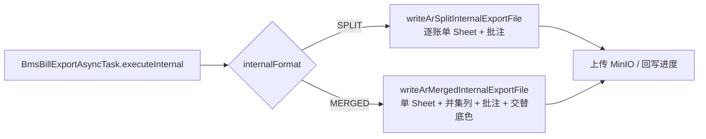

# 2026-08-05 BMS 应收账单内部导出【拆分式】与【合并式】技术调整方案与计划

**日期：** 2026-08-05
**需求依据：** `aidocs` 提交 `1700b4e233af64a2f81928b60b6ccd485a24a413`（面向财务的对账报表导出格式区分【合并式】和【拆分式】）
**适用范围：** `bms`、`platform-admin`、`admin_front`、`aidocs/technical-caliber/sql/ar_bill.sql`
**方案性质：** 在 2026-07-21 已落地的「应收账单内部明细导出」基础上做格式能力升级，不改账单生成、金额计算、审核、核销、返款和调账口径；客户导出（导出给客户）仅受费项展示顺序规则调整影响。

---

## 1. PRD 变更整理

目标提交只修改 `product-caliber/bms/prd/PRD.账单系统.md`，核心是把原「应收账单内部明细导出」重定义为「面向财务的对账报表导出」，内部导出细分为【拆分式】和【合并式】两种格式，同时调整费项展示顺序规则。

### 1.1 内部导出格式（18.6.2 全部重写）

| 需求点 | 拆分式（SPLIT） | 合并式（MERGED） |
| --- | --- | --- |
| 文件名 | `对账报表批量导出_拆分式_任务创建时间` | `对账报表批量导出_合并式_任务创建时间` |
| Sheet 结构 | 每张账单一个独立 Sheet | 全部账单费项明细进同一个名为`费项明细`的 Sheet |
| 适用目的 | 分账单查看账单基本信息和费项明细 | 跨账单筛选、汇总和数据透视 |
| 排序 | Sheet 按账期开始日升序、账单编号升序 | 账单数据区按账期开始日升序、账单编号升序，明细连续成块 |
| Sheet 名 | 完整账单编号，不得截断/缩写/替换为序号；不满足时该账单导出失败并提示原因 | 固定`费项明细` |
| 账单基本信息 | 不放表格上方，改为表头首个单元格的 Excel 批注 | 每张账单数据区首行首个单元格（即第一条明细的`账单编号`单元格）插入 Excel 批注 |
| 批注内容 | 11 个字段逐行展示：账单编号/账单状态/账期类型/账期/客户名称/客户编码/会员编码/业务板块/目的国/账单发送日/信用期结束日（产品确认：批注不含`店铺`，见 Q-04）；无值显示`-`，不得省略字段名称；账期格式 `YYYY/MM/DD - YYYY/MM/DD` | 同左 |
| 批注约束 | 不得改变表头首个单元格的字段名称、显示格式、筛选或排序能力 | 批注仅补充基本信息，不得改变首个单元格真实值/显示格式/排序能力 |
| 账单归属表达 | Sheet 名即账单编号 | `账单编号`作为第一列写入每条费项明细 |
| 动态费项列 | 按各账单实际包含的费项生成 | 取本次成功导出的全部账单费项**并集**；某账单未发生某费项时保留列并让单元格为空，不得重复生成同名列 |
| 视觉分组 | 无要求 | 同一账单数据区同色，相邻账单交替浅蓝 `#EAF3F8` / 浅绿 `#F1F6EC`；覆盖全部明细行及表头范围内全部列，不覆盖表头；空值单元格保持底色；底色仅视觉分组 |
| 表头 | 无新增要求 | 启用筛选并冻结；数据区不得插入重复表头、空白分隔行、合并单元格或账单汇总行 |

### 1.2 两种格式共同规则（18.6.2.4）

1. 费项明细字段、动态费项展开、日期时间格式、金额币种显示格式和 3 位小数精度与 18.6.1.4 / 18.6.1.6 应收口径一致。
2. 所有固定字段均须输出，无值时保留列并让单元格为空。
3. 内部导出只承接费项明细，不输出账单金额汇总、核销记录、调账/冲正明细或客户展示内容。
4. 内部导出文件不得作为客户账单邮件附件，也不得通过账单发送操作直接发送给客户。
5. 内部导出不读取`对账报表导出配置`，不输出客户告示、客服二维码、收款账户或收款二维码。

### 1.3 任务与入口规则（18.6.3）

1. 应收列表选择`导出给内部`后，**必须**继续选择`拆分式`或`合并式`，系统不得根据账单数量或上一次选择自动确定格式。
2. 导出确认页必须展示：所选账单数量、导出用途、内部导出格式、预期 Sheet 数量（拆分式=账单数，合并式=1）。
3. 内部导出格式随任务固化，任务重试不得切换格式；需要改用其它格式时重新创建导出任务。
4. 创建任务时固化发起入口、导出用途、**内部导出格式**和每张账单的导出数据。
5. 内部进度：两种内部格式均按**已处理账单数量**计算进度（不以 Sheet 数量或明细行数计）。
6. 部分成功：`拆分式`部分成功时 Excel 只包含成功账单的 Sheet；`合并式`部分成功时统一 Sheet 只包含成功账单的数据区，并按成功账单重新确定动态费项列、批注和交替底色。全部失败时不生成结果文件。
7. 重试失败项成功后，重新生成包含原成功项和本次新增成功项的完整结果文件，替换旧文件。

### 1.4 费项展示顺序（18.6.1.3.2 金额汇总、18.6.1.4 明细展开）

1. 费项展示顺序固定为`运费`、`派送费`、其它费项：`运费`和`派送费`分别优先作为第一个和第二个展示费项，其它费项按费项索引顺序排列（已确认 Q-01：`派送费`即现有费项名`派送附加费`，含`派送附加费【扣减】`；已确认 Q-02：其它费项按账单明细中首次出现顺序）。
2. 未发生的费项不输出空行；同一费项多个结算币种分别计入对应币种块。
3. 某一优先费项未发生时不保留空列，后续实际发生的费项顺位前移。
4. 该规则同时作用于客户导出 Sheet 1 金额汇总、Sheet 2 费项展开和内部导出（18.6.2.4 口径一致，Q-03 已确认）。
5. **金额汇总动态化（本次新增，Q-09/Q-10 已确认）**：客户导出 Sheet 1 金额汇总的参与费项为动态集合，跟随明细表头涉及的所有费项，按结算币种分别成块、块内按第 1 条费项顺序逐行输出`费项`+`结算币总计`；未发生费项不输出空行。现有固定 8 类单块输出将一并重构（见 §3.4）。

### 1.5 管理面板（18.6.3.2）

| 区域 | 变更 |
| --- | --- |
| 任务筛选 | 增加`内部导出格式`条件（只在导出用途为`导出给内部`时适用） |
| 导出任务列表 | 增加`内部导出格式`列；客户导出的该列显示`不适用` |
| 任务详情 | 增加`内部导出格式`；`拆分式`按账单展示对应 Sheet；`合并式`按账单展示是否成功写入统一 Sheet |
| 任务详情项 | `拆分式`的 Sheet 名称或文件名称展示实际 Sheet 名；`合并式`展示账单是否成功写入统一 Sheet |

### 1.6 保持不变

1. 详情入口固定`导出给客户`，不展示用途选择（现有行为不变）。
2. 返款账单固定`导出给客户`，不提供内部导出（现有行为不变）。
3. 任务创建时冻结数据快照，执行器只读快照（现有行为不变）。
4. 任务状态机、取消、删除、通知、文件失效（finished_at+24h）、下载鉴权等现有规则不变。

---

## 2. 现有代码核查结论

### 2.1 已具备的基础（2026-07-21 方案已落地）

| 能力 | 现状 |
| --- | --- |
| 导出领域 | `bill_export_config` / `bill_export_task` / `bill_export_task_item` / `bill_export_notification` 四表及实体、DTO、Mapper、Service、Feign、Controller 齐全。 |
| 用途与入口 | `BillExportPurposeEnum`(CUSTOMER/INTERNAL)、`BillExportSourceEntryEnum`(DETAIL/LIST)、`BillExportFileTypeEnum`(XLSX/ZIP) 已存在；用途矩阵校验在 `BillExportServiceImpl.normalizeAndValidateExportMode`。 |
| 冻结快照 | 创建时逐账单调 `ArBillServiceImpl.exportData` 固化 `data_snapshot_json`，含 `bill`（账期起止、状态、客户、会员、业务板块、目的国、发送日、信用期）与 `rows`/`feeColumns`；执行器只读快照。 |
| 内部渲染 | `BmsFinanceExportExcelHelper.writeArInternalExportFile`：每账单一个 Sheet（Sheet 名安全化、超 31 字符截断、重名加 `~N`），每个 Sheet = 11 字段键值基本信息区 + 空行 + 费项明细表（`includeShop=false`）。 |
| 异步执行 | `BmsBillExportAsyncTask.executeInternal` 逐账单解析快照、渲染、回写 `processed/success/failed`，**进度已按账单数计算**，终态按 successCount 判定 SUCCESS/PARTIAL_SUCCESS；同任务重试已支持。 |
| 费项列 | `ArBillServiceImpl.buildArFeeColumns` 固定前置`运费`、`运费【扣减】`、`派送附加费`、`派送附加费【扣减】`，其余按明细出现顺序入列；快照创建时固化。 |
| 前端 | 应收列表 `exportSelectedBills`（$confirm 二选一用途）+ 导出管理面板 `billExport/index.vue`（筛选/列表/详情/重试/下载）。 |

### 2.2 与本次 PRD 的差距

| 编号 | 当前实现 | PRD 要求 | 调整结论 |
| --- | --- | --- | --- |
| G-01 | 任务无内部导出格式概念，创建请求 `BillExportTaskCreateReqDTO` 无格式字段。 | 内部导出必须选择并固化拆分式/合并式。 | 任务主表、DTO、创建请求、执行上下文新增格式字段。 |
| G-02 | 内部 Sheet 按用户提交顺序（item_seq）输出。 | 拆分式/合并式均按账期开始日升序、账单编号升序。 | 渲染前按快照 `billingPeriodStartDate` + `billNo` 排序。 |
| G-03 | 内部 Sheet 基本信息为表头上方键值区（11 字段、无店铺）。 | 拆分式基本信息移入表头首个单元格批注；批注不含`店铺`（Q-04 已确认）。 | 重写内部 Sheet 渲染：键值区删除，新增批注写入（11 个字段）。 |
| G-04 | `uniqueSafeSheetName` 截断超长名称、重名追加序号。 | PRD 原文要求完整账单编号且不满足时失败；产品确认（Q-05）：直接沿用截断处理。 | 拆分式 Sheet 名继续沿用 `uniqueSafeSheetName`（非法字符替换、>31 截断、重名加 `~N`），`result_name` 存实际名称；合并式单 Sheet 名固定`费项明细`。 |
| G-05 | 无合并式渲染。 | 合并式：单 Sheet、账单编号第一列、费项并集列、批注、交替底色、筛选+冻结、无分隔行/合并单元格/汇总行。 | 新增合并式渲染器。 |
| G-06 | 内部文件名`应收账单内部费项明细_任务创建时间.xlsx`。 | `对账报表批量导出_拆分式_任务创建时间` / `对账报表批量导出_合并式_任务创建时间`。 | 文件名按格式区分。 |
| G-07 | `buildArFeeColumns`：运费/运费【扣减】/派送附加费/派送附加费【扣减】前置，其余按出现顺序。 | 费项顺序固定为`运费`、`派送费`（=现有`派送附加费`，Q-01 已确认）、其它按账单明细首次出现顺序（Q-02 已确认）。 | 实施核查：现有 `buildArFeeColumns` 前置顺序与确认规则完全一致，**无需代码调整**（见 §10）。 |
| G-08 | 列表批量导出确认弹窗只二选一用途，无格式选择、无预期 Sheet 数量。 | 确认页展示账单数量、用途、格式、预期 Sheet 数量；格式必选。 | 前端确认弹窗升级。 |
| G-09 | 内部部分成功只剔除失败 Sheet。 | 合并式部分成功需按成功账单重算并集列、批注和交替底色。 | 合并式渲染以“成功解析的账单集合”为输入整体计算。 |
| G-10 | 管理面板无格式筛选/列/详情。 | 筛选、列表、详情增加内部导出格式；客户导出显示`不适用`；详情项合并式展示是否写入统一 Sheet。 | 管理面板接口与页面补字段。 |
| G-11 | 历史 INTERNAL 任务无格式字段。 | 列表/详情需展示。 | 历史任务不做回填（Q-06 已确认）：`internal_format` 允许 NULL，前端对 INTERNAL+空值显示`历史任务`。 |
| G-12 | 客户导出 Sheet 1 金额汇总为固定 8 类单块输出，未按结算币种分块、未动态跟随明细费项。 | 金额汇总参与费项动态化，跟随明细表头所有费项、按结算币种分块逐行（Q-09/Q-10 已确认）。 | 重构应收 Sheet 1 金额汇总渲染（见 §3.4），返款 Sheet 1 不动。 |

### 2.3 可直接复用

1. `ArBillFinanceExportRespDTO.bill` 已含 `billingPeriodStartDate` / `billingPeriodEndDate`（Q-12 已确认：账期开始日不会为 null），拆分式/合并式排序与批注可直接使用冻结快照，无需补查。
2. `writeArDetailRows` 的固定字段与动态费项列、`feeCellValue`、币种金额写入、`applyAutoFilter`、`autoSize` 可整体复用；合并式只是把同一行写入逻辑搬到统一 Sheet 并前置`账单编号`列。
3. `executeInternal` 的进度回写、终态判定、文件上传、`removePreviousFile` 逻辑可原样沿用，仅渲染入口按格式分流。
4. 明细行 `ArBillFinanceExportRowDTO.feeCells`（feeName/settlementCurrency/settlementAmount）已随快照固化，可直接用于金额汇总按币种×费项聚合，无需改快照结构。

---

## 3. 总体技术方案

### 3.1 内部导出格式模型

新增枚举 `BillExportInternalFormatEnum`（放入 `bms/model` 公共枚举区）：

- `SPLIT`：拆分式，每张成功账单一个 Sheet；
- `MERGED`：合并式，全部成功账单进一个`费项明细` Sheet；
- `NOT_APPLICABLE`：非内部用途（客户导出 / 返款）占位，前端显示`不适用`。

`bill_export_task` 新增 `internal_format` 字段；创建时由用途矩阵决定：

| 账单类型 | 入口 | 用途 | internal_format | 结果 |
| --- | --- | --- | --- | --- |
| 应收 | 详情 | CUSTOMER | NOT_APPLICABLE | 单账单客户版 Excel |
| 应收 | 列表 | CUSTOMER | NOT_APPLICABLE | 1 张 Excel / 多张 ZIP |
| 应收 | 列表 | INTERNAL | SPLIT / MERGED（必选） | 单一 Excel |
| 返款 | 任意 | CUSTOMER | NOT_APPLICABLE | 1 张 Excel / 多张 ZIP |
| 返款 | 任意 | INTERNAL | 后端拒绝（现行为不变） | — |

校验规则（`BillExportServiceImpl` 扩展 `normalizeAndValidateExportMode`）：

1. `INTERNAL` 必须携带 `internalFormat ∈ {SPLIT, MERGED}`，缺省或非法直接拒绝并提示；
2. `CUSTOMER` 忽略传入值，统一落库 `NOT_APPLICABLE`；
3. 重试沿用任务已固化的 `internal_format`，创建/重试接口均不接受切换格式。

### 3.2 渲染前统一排序

拆分式与合并式在渲染前按 `(billingPeriodStartDate ASC, billNo ASC)` 对**成功解析快照的账单集合**排序（Q-12 已确认账期开始日不会为 null，实现仍保留防御性处理）。排序只影响工作簿内 Sheet/数据区顺序，不影响任务项、进度与详情展示（详情仍按账单编号查询）。

### 3.3 两种格式渲染入口

- `SPLIT`：输入 = 排序后的成功账单列表；逐账单创建 Sheet（Sheet 名=完整账单编号，严格校验），失败项移除 Sheet 并记失败，continue。
- `MERGED`：输入 = 排序后的成功账单列表；先跨账单合并费项列（见 3.4），再整体写入一个`费项明细` Sheet；单张账单数据区写入失败时，该项记失败并剔除该账单块（该账单块之前已写入的单元格不清理，按成功账单集合重算的列/底色在写入前已确定，因此剔除时仅需跳过该账单块并保证交替底色连续）。

### 3.4 费项列顺序统一规则

提取统一的费项列排序/合并逻辑（bms 侧 `ArBillServiceImpl`，客户与内部同源；Q-01/Q-02/Q-03 已确认）：

1. 单账单列顺序（现有 `buildArFeeColumns` 改造）：`运费` 固定第一（含`运费【扣减】`紧随其后），`派送费`（=现有费项名`派送附加费`，含`派送附加费【扣减】`）固定第二（含其`【扣减】`紧随），其余费项按账单明细中首次出现顺序排列。
2. 合并式跨账单并集：按上述优先级把各账单列合并去重，`运费`/`派送费`及其扣减列保持在最前，其余按首次出现顺序补位；某账单未发生的费项保留列、单元格留空。
3. **客户导出 Sheet 1 金额汇总动态化（本次新增，Q-09/Q-10 已确认）**：
   - 参与费项 = 该账单明细表头（Sheet 2）涉及的动态费项集合，即快照 `feeColumns` 中该账单实际发生的费项；
   - 按结算币种分别成块，块首展示`{结算币种名称}总计`，块内按第 1 条费项顺序逐行输出`费项` + 该币种下该费项的`结算币总计`；某币种下未发生的费项不输出空行；块末输出该币种账单总计；
   - 币种块顺序按明细数据中结算币种首次出现顺序；
   - 数据来源：渲染时从冻结快照 `rows[].feeCells`（feeName/settlementCurrency/settlementAmount）按币种×费项聚合，不改快照结构，历史快照兼容；
   - 返款账单 Sheet 1 保持现状（PRD 本次未调整返款金额汇总）。

### 3.5 批注写入

在 `BmsFinanceExportExcelHelper` 新增批注工具方法（基于 `XSSFDrawing.createCellComment` + `XSSFClientAnchor`，设置批注宽高与自动换行）：

- 拆分式：批注挂在费项明细**表头行首个单元格**（`业务订单号`表头单元格）；同一 Sheet 其它单元格不重复插入。
- 合并式：批注挂在每张账单**数据区首行首个单元格**（即该账单第一条明细的`账单编号`单元格）；同一账单其它单元格不重复插入。
- 批注文本按`字段名称：字段值`逐行排列，11 个字段固定顺序（Q-04 已确认不含`店铺`）；无值显示`-`，不得省略字段名称；账期 `YYYY/MM/DD - YYYY/MM/DD`（沿用 `formatDate` 口径）。
- 批注不改变宿主单元格的值、格式、筛选或排序能力（POI 批注天然满足，回归时验证）。

### 3.6 合并式底色

同一账单数据区所有单元格（该账单全部明细行 × 表头范围内全部列）使用同一背景色，相邻账单交替 `#EAF3F8` / `#F1F6EC`，不覆盖表头；空值单元格同样着色。底色仅视觉分组，账单归属以`账单编号`列值为准。实现上按账单块循环切换颜色，块内逐单元格设 `CellStyle`（复用/缓存样式对象控制样式数量）。

### 3.7 文件命名

`BmsBillExportAsyncTask.buildInternalFileName` 按格式区分：

- SPLIT：`对账报表批量导出_拆分式_{yyyyMMddHHmmss}.xlsx`
- MERGED：`对账报表批量导出_合并式_{yyyyMMddHHmmss}.xlsx`

任务创建时间沿用 `context.getCreatedAt()`。

---

## 4. 后端调整方案

### 4.1 数据库调整（同步归档 ar_bill.sql 完整 CREATE TABLE）

`bill_export_task` 新增字段：

| 字段 | 类型 | 说明 |
| --- | --- | --- |
| `internal_format` | `varchar(32) DEFAULT NULL` | 内部导出格式：`SPLIT`/`MERGED`/`NOT_APPLICABLE`；INTERNAL 用途取 SPLIT 或 MERGED，CUSTOMER 取 NOT_APPLICABLE，历史任务为 NULL（Q-06 已确认不做回填） |

创建时显式写入：CUSTOMER→`NOT_APPLICABLE`，INTERNAL→`SPLIT`/`MERGED`。历史任务（含历史 INTERNAL）保持 NULL，前端按用途+格式组合展示（见 §4.6/§5.2）。页查询索引 `idx_bill_export_task_page (sc_id,user_id,task_status,created_at)` 已覆盖主要筛选，`internal_format` 作为过滤条件选择性低，不单独建索引（与 `export_purpose` 组合筛选场景量级小，暂不加）。

`bill_export_task_item` 无结构变更；`result_name` 语义扩展：SPLIT 存实际 Sheet 名（=账单编号），MERGED 存统一 Sheet 名`费项明细`（详情据此展示“是否成功写入统一 Sheet”：item 成功 + resultName=`费项明细` 即写入成功）。

### 4.2 枚举、实体与 DTO

1. 新增 `BillExportInternalFormatEnum`（`SPLIT`/`MERGED`/`NOT_APPLICABLE`），集中管理，禁止魔法字符串。
2. `BillExportTask` / `BillExportTaskDTO` / `BillExportTaskQueryReqDTO`：新增 `internalFormat`。
3. `BillExportTaskCreateReqDTO`：新增 `internalFormat`（可空；CUSTOMER 忽略）。
4. `BillExportExecutionContextDTO`：新增 `internalFormat`，供执行器分流。
5. `BillExport-mapper.xml`：`TaskWhere` 增加 `internalFormat` 条件；`insertTask` 增加字段；`selectTaskPage` 增加列。

### 4.3 任务创建与校验（BillExportServiceImpl）

1. 扩展 `normalizeAndValidateExportMode`：INTERNAL 校验 `internalFormat` 必填且合法；CUSTOMER 归一为 `NOT_APPLICABLE`；返款 INTERNAL 仍拒绝。
2. 创建时把 `internalFormat` 写入任务主表；重试 `resetTaskForRetry` 不动该字段（格式固化）。
3. 快照/校验逻辑不变（逐账单校验存在性、归属、权限、冻结快照；单张失败按项记失败）。

### 4.4 执行器（BmsBillExportAsyncTask）

1. `executeInternal` 读取 `context.getInternalFormat()` 分流：
   - `SPLIT` → `writeArSplitInternalExportFile`
   - `MERGED` → `writeArMergedInternalExportFile`
   - 未知值 → 任务失败并给出明确原因（防御）。
2. 渲染输入：先解析全部成功快照项 → 按 3.2 排序 → 生成渲染清单（SPLIT 逐项、MERGED 整体）。
3. 进度、终态、上传、`removePreviousFile`、失败项 resultName/failureReason 回写逻辑沿用现状；`result_name` 按 4.1 语义写入。
4. 部分成功：
   - SPLIT：沿用现有“失败 Sheet 移除、Excel 只含成功 Sheet”；
   - MERGED：统一 Sheet 只写入成功账单数据区，并集列/批注/交替底色在写入前按成功账单集合一次性确定。
5. 文件名按 3.7 生成。

### 4.5 Excel 渲染（BmsFinanceExportExcelHelper）

1. 新任务一律按任务固化 `internal_format` 走新渲染器（SPLIT/MERGED）；历史任务（`internal_format` 为空，Q-06 不回填）重试时按 SPLIT 语义走新拆分式渲染器（历史 INTERNAL 形态即逐账单 Sheet，重试换新格式结果可接受）。旧键值区形态 `writeArInternalExportFile` 不再被新流程引用，灰度期可保留不删。
2. 新增 `writeArSplitInternalExportFile(List<ArBillFinanceExportRespDTO> sortedList, File file)`：
   - 逐账单创建 Sheet，Sheet 名 = 账单编号经 `uniqueSafeSheetName` 处理后的实际名称（非法字符替换、>31 字符截断、重名追加 `~N`，Q-05 已确认沿用截断）；`result_name` 存实际 Sheet 名。
   - 每个 Sheet：费项明细表头从第 0 行开始（不再写键值区、不再留空行），表头首单元格（`业务订单号`）插入批注；明细行沿用 `writeArDetailRows` 的字段/动态费项/金额逻辑（`includeShop=false`）。
3. 新增 `writeArMergedInternalExportFile(List<ArBillFinanceExportRespDTO> sortedList, File file)`：
   - 创建唯一 Sheet`费项明细`；表头 = `账单编号` + 固定字段（`includeShop=false` 口径）+ 并集费项列（按 3.4）+ 尾部字段；
   - 账单编号列写入每条明细对应账单编号（从快照 `bill.billNo` 取，不用 itemSeq 推导）；
   - 每账单数据区首行首单元格插入批注；
   - 按账单块交替底色（3.6）；`applyAutoFilter` + `createFreezePane(0, 1)` 冻结表头；
   - 数据区不插入重复表头/空行/合并单元格/汇总行。
4. 客户导出 Sheet 2 仅受 3.4 费项列顺序影响（`buildArFeeColumns` 调整在 bms 侧，快照创建时生效；旧快照保持旧序，符合 PRD 固化口径）。
5. 客户导出 Sheet 1 金额汇总按 §3.4 第 3 条动态化：新增按结算币种分块的动态费项汇总渲染，替换现有固定 8 类单块输出；数据从冻结快照 `rows[].feeCells` 聚合，返款 Sheet 1 不动。

### 4.6 管理面板接口

查询/列表/详情 DTO 透出 `internalFormat`；前端展示层处理文案映射：SPLIT=`拆分式`、MERGED=`合并式`、NOT_APPLICABLE=`不适用`、INTERNAL 用途且格式为空（历史任务）=`历史任务`。

---

## 5. 前端调整方案（admin_front）

### 5.1 应收账单列表导出确认（receivableBill/index.vue）

`exportSelectedBills` 从 `$confirm` 二选一升级为自绘确认弹窗（Element UI `el-dialog`），内容：

1. 顶部摘要：所选账单数量、导出用途（`导出给客户`/`导出给内部`）、预期文件结构说明；
2. 用途选择（radio：导出给客户 / 导出给内部）；
3. 选择`导出给内部`时展开格式选择（radio：拆分式 / 合并式 + 各自说明文案）与预期 Sheet 数量：
   - 拆分式：`N 个 Sheet`（每张账单一个）；
   - 合并式：`1 个 Sheet`（费项明细）；
4. 确认后 `submitBillExportTask(billNos, "LIST", exportPurpose, internalFormat)`，请求体 `createBillExportTask` 增加 `internalFormat`（CUSTOMER 不传或传空）。

### 5.2 导出管理面板（billExport/index.vue）

1. 筛选区：新增`内部导出格式`下拉（全部/拆分式/合并式），与导出用途联动（选择`导出给客户`时格式条件禁用/清空；历史任务格式为空，不参与格式筛选）。
2. 列表：新增`内部导出格式`列：CUSTOMER 显示`不适用`；INTERNAL 按格式显示`拆分式`/`合并式`；格式为空的 INTERNAL 历史任务显示`历史任务`。
3. 详情：顶部新增`内部导出格式`行（历史任务显示`历史任务`）；任务项列表按任务用途/格式解释 `resultName`：SPLIT 显示实际 Sheet 名，MERGED 成功项显示`费项明细`、失败项显示失败原因。

### 5.3 API（src/api/billing.js）

`createBillExportTask` 请求参数增加 `internalFormat`；其余接口不变。

---

## 6. 实施计划

| 阶段 | 工作内容 | 主要产出 | 验收点 |
| --- | --- | --- | --- |
| P0 口径确认 | 已完成：Q-01~Q-12 全部确认（见第 7 节），金额汇总动态化纳入本次范围。 | 冻结字段字典与格式规则。 | 已确认决策全部映射到接口、DDL、验收项。 |
| P1 数据与模型 | `bill_export_task` 加可空 `internal_format`（历史任务不回填，Q-06）；完整 CREATE TABLE 同步 `ar_bill.sql`；新增枚举；实体/DTO/Mapper XML 补字段。 | DDL、模型、映射。 | 新旧任务均可查询；历史任务 internal_format 为空、新任务按用途正确写入。 |
| P2 创建与校验 | `BillExportServiceImpl` 扩展用途矩阵校验、创建落库格式、执行上下文透出格式。 | BMS Service/Feign/Controller。 | INTERNAL 缺格式/非法格式被拒；CUSTOMER 归一 NOT_APPLICABLE；重试不切换格式。 |
| P3 Excel 渲染 | `BmsFinanceExportExcelHelper`：批注工具、拆分式渲染、合并式渲染（并集列/账单编号列/交替底色/筛选冻结）、费项列顺序规则调整（bms 侧 `buildArFeeColumns`）、客户 Sheet 1 金额汇总按币种分块动态化。 | Excel Helper + 费项列逻辑 + 金额汇总聚合。 | 拆分式/合并式样张逐项对照 PRD 18.6.2；费项顺序符合 18.6.1.4；金额汇总跟随明细表头费项并按币种分块。 |
| P4 执行器 | `BmsBillExportAsyncTask` 按格式分流、排序、文件名、部分成功与 result_name 语义。 | Platform Admin 异步任务。 | 两种格式的正常/部分成功/全失败/重试均产出正确文件与进度。 |
| P5 前端 | 应收列表确认弹窗、导出管理面板格式筛选/列/详情、API 参数。 | `admin_front` 页面与 API。 | 确认页展示数量/用途/格式/预期 Sheet 数；管理面板展示与筛选正确。 |
| P6 联调与回归 | 构建、接口联调、Excel 内容与批注核对、历史任务（空格式）展示与重试验证、`ar_bill.sql` 同步确认。 | 联调记录与验收清单。 | 第 8 节场景全部通过。 |

推荐实施顺序：BMS 数据与契约 → Platform Admin 执行器/渲染 → 前端。

---

## 7. 疑问点确认结论

12 项疑问点已与产品/财务逐条确认（2026-08-05），全部落地到方案正文：

| 编号 | 疑问 | 确认结论 | 方案落点 |
| --- | --- | --- | --- |
| Q-01 | `派送费`与现有费项名`派送附加费`的关系 | 确认`派送费`即现有费项名`派送附加费`（含`派送附加费【扣减】`）。 | §1.4、§3.4 |
| Q-02 | “其它费项按费项索引顺序”的含义 | 按账单明细中首次出现顺序（`ArBillFeeDetailDTO` 无索引字段，维持现有 LinkedHashSet 语义）。 | §1.4、§3.4 |
| Q-03 | 费项顺序规则作用范围 | 同时作用于客户导出 Sheet 1、Sheet 2 与内部导出。 | §1.4、§3.4 |
| Q-04 | 批注中的`店铺`字段 | 无需显示：批注不输出`店铺`字段（与 PRD 字段清单差异以产品确认为准），共 11 个字段。 | §1.1、§3.5、§4.5 |
| Q-05 | 拆分式 Sheet 名超长/非法字符处理 | 直接截断：沿用 `uniqueSafeSheetName`（非法字符替换、>31 截断、重名加 `~N`），不做失败处理；`result_name` 存实际名称。 | §2.2 G-04、§4.5 |
| Q-06 | 历史任务 `internal_format` 回填 | 不做处理：字段允许 NULL、不回填；前端对 INTERNAL+空值显示`历史任务`。 | §4.1、§4.6、§5.2 |
| Q-07 | 合并式任务详情项表达 | `result_name` 成功项存`费项明细`（文案“已写入统一 Sheet”）、失败项存失败原因。 | §4.1、§4.6、§5.2 |
| Q-08 | 确认页预期 Sheet 数量口径 | 按提交账单数展示：拆分式=N、合并式=1；实际以任务进度/详情为准。 | §5.1 |
| Q-09 | 客户 Sheet 1 金额汇总是否本次修复 | 确认纳入本次范围：参与费项动态化、跟随明细表头所有费项（见 Q-10 补充口径）。 | §1.4、§3.4、§4.5 |
| Q-10 | 批注可见性与尺寸 + 金额汇总口径补充 | 批注设置固定宽高并开启自动换行；金额汇总参与费项为动态集合，跟随明细表头涉及的所有费项（并入 Q-09）。 | §3.5、§3.4 |
| Q-11 | 合并式并集列多时的性能 | 沿用 50 张账单上限与 `XSSFWorkbook`；并集列/行数超阈值时按压测结论评估 `SXSSFWorkbook`。 | §3.3、§3.6 |
| Q-12 | 排序字段 `billingPeriodStartDate` 为 null | 不会存在 null；实现保留防御性处理。 | §3.2 |

### 7.2 已确认沿用（不重复讨论）

1. 内部导出不输出店铺列，批注亦不含`店铺`字段（Q-04），明细固定字段维持 `includeShop=false` 口径。
2. 进度按已处理账单数量计算（现状已满足，合并式同样适用）。
3. 内部文件不得作为客户邮件附件、不得被账单发送引用（现状服务端已拦截）。
4. 文件保留期 `finished_at + 24h`、下载鉴权、取消/删除状态机不变。

---

## 8. 验收与回归清单

### 8.1 拆分式

- [ ] 文件名为`对账报表批量导出_拆分式_任务创建时间.xlsx`；每张成功账单一个 Sheet。
- [ ] Sheet 按账期开始日升序、账单编号升序；Sheet 名为完整账单编号。
- [ ] Sheet 名沿用安全化规则：非法字符替换、>31 字符截断、重名追加序号（Q-05 已确认），`result_name` 为实际 Sheet 名。
- [ ] 每个 Sheet 只含一张连续费项明细表，无键值基本信息区、无汇总/冲正/告示/二维码/收款信息。
- [ ] 表头首个单元格存在批注，11 个字段逐行展示（不含店铺，Q-04），无值显示`-`，账期格式 `YYYY/MM/DD - YYYY/MM/DD`；批注不改变表头单元格值/格式/筛选/排序。
- [ ] 部分成功时 Excel 只含成功 Sheet，详情能定位失败账单与原因。

### 8.2 合并式

- [ ] 文件名为`对账报表批量导出_合并式_任务创建时间.xlsx`；只有一个名为`费项明细`的 Sheet。
- [ ] `账单编号`为第一列且每条明细有值；账单数据区按账期开始日升序、账单编号升序连续成块、互不交叉。
- [ ] 动态费项列为全部成功账单并集，按`运费`→`派送费`→其它顺序；未发生费项保留空列、不重复生成同名列。
- [ ] 每账单数据区首行首单元格有批注（11 字段、不含店铺，无值`-`）；批注不改变单元格真实值。
- [ ] 相邻账单交替浅蓝 `#EAF3F8` / 浅绿 `#F1F6EC`，覆盖全部明细行与表头范围全部列、不覆盖表头、空值保持底色。
- [ ] 表头启用筛选并冻结首行；数据区无重复表头、空行、合并单元格、汇总行。
- [ ] 部分成功时统一 Sheet 只含成功账单数据区，并集列/批注/交替底色按成功账单集合生成。

### 8.3 费项顺序

- [ ] 客户导出 Sheet 2 与内部导出费项列：`运费`（含扣减）第一、`派送费`（=派送附加费，含扣减）第二、其余按账单明细首次出现顺序；优先费项未发生不留空列、顺位前移。
- [ ] 客户导出 Sheet 1 金额汇总：参与费项 = 明细表头涉及的动态费项集合；按结算币种分块、块内按费项顺序逐行输出`费项`+`结算币总计`；未发生费项不输出空行；块末输出该币种账单总计；返款 Sheet 1 不变。

### 8.4 任务与管理面板

- [ ] 选择`导出给内部`必须选格式，不得自动确定/记忆上次选择。
- [ ] 确认页展示账单数量、用途、格式、预期 Sheet 数量。
- [ ] 格式随任务固化；重试不切换格式，需换格式须新建任务。
- [ ] 管理面板可按`内部导出格式`筛选；列表/详情展示格式：客户任务`不适用`，INTERNAL 历史任务（格式为空）`历史任务`。
- [ ] 详情项：拆分式显示实际 Sheet 名，合并式成功项显示`费项明细`（=已写入统一 Sheet）、失败项显示失败原因。
- [ ] 两种内部格式进度均按已处理账单数量计算。

### 8.5 回归与工程

- [ ] 历史任务不回填（internal_format 为空），列表/详情正确显示`历史任务`；新任务重试按任务固化格式产出文件并替换旧文件。
- [ ] 客户/返款导出、详情入口、返款列表行为不回归。
- [ ] `bms` 与 `platform-admin` 执行 `mvn -pl web -am package -Dmaven.test.skip=true` 通过。
- [ ] `admin_front` 构建通过（Node 14 环境）。
- [ ] 1/2/50 张账单的正常、部分失败、全失败、重试场景均通过；`ar_bill.sql` 已同步最新完整结构。

---

## 9. 本次方案边界

1. 不改账单金额、币种换算、费项归集、冲正、审核和核销业务逻辑。
2. 不新增返款账单内部导出；返款仍固定客户用途。
3. 不引入模板设计器、字段拖拽或客户级导出模板。
4. 客户导出 Sheet 1 金额汇总动态化已纳入本次范围；返款账单金额汇总保持现状。
5. 不因本次调整顺带重构其它异步任务或通用 Excel 框架。

---

## 10. 实施记录（2026-08-05 代码落地）

本方案已按确认结论完成代码实施，关键落点如下：

### 10.1 bms

1. 新增枚举 `BillExportInternalFormatEnum`（SPLIT/MERGED/NOT_APPLICABLE）。
2. `bill_export_task` 新增可空字段 `internal_format`，完整 DDL 已同步 `aidocs/technical-caliber/sql/ar_bill.sql`（历史任务不回填，Q-06）。
3. `BillExportTask`/`BillExportTaskCreateReqDTO`/`BillExportTaskQueryReqDTO`/`BillExportTaskDTO`/`BillExportExecutionContextDTO` 增加 `internalFormat`；`BillExport-mapper.xml` 的 resultMap/insertTask/TaskWhere/selectTaskPage 同步。
4. `BillExportServiceImpl.normalizeAndValidateExportMode`：INTERNAL 必填 SPLIT/MERGED，非法或缺省拒绝；CUSTOMER 归一 NOT_APPLICABLE；创建落库、执行上下文、列表/详情透出；通知标题改为“内部对账报表导出结果”。
5. **费项顺序核查结论**：现有 `ArBillServiceImpl.buildArFeeColumns` 已固定前置`运费`、`运费【扣减】`、`派送附加费`、`派送附加费【扣减】`，其余按明细出现顺序（LinkedHashSet），与 Q-01/Q-02 确认规则一致，**无需改动**。

### 10.2 platform-admin

1. `BmsBillExportAsyncTask.executeInternal` 按 `internalFormat` 分流：SPLIT 走 `writeArSplitInternalExportFile`，MERGED 走 `writeArMergedInternalExportFile`；渲染前按账期开始日升序、账单编号升序排序；文件名`对账报表批量导出_拆分式/合并式_{yyyyMMddHHmmss}.xlsx`；`result_name`：SPLIT 存实际 Sheet 名、MERGED 成功项存`费项明细`；非法格式防御；失败路径计数口径统一。
2. `BmsFinanceExportExcelHelper`：
   - 拆分式：每个 Sheet 仅费项明细表（第 0 行表头起），表头首单元格挂批注（11 字段、无店铺、无值`-`、账期 `YYYY/MM/DD - YYYY/MM/DD`），Sheet 名沿用 `uniqueSafeSheetName` 截断；
   - 合并式：单 Sheet`费项明细`，`账单编号`第一列，费项并集列按运费/派送费/其它首次出现顺序，每账单数据区首行首单元格批注，相邻账单交替 `#EAF3F8`/`#F1F6EC`，表头筛选+冻结，无分隔行/合并单元格/汇总行；单账单块写入失败（含空明细、结算币种非法）剔除该块并记失败，不影响其它账单；
   - 客户 Sheet 1 金额汇总动态化：按结算币种分块、块内按费项顺序动态逐行（跟随明细表头费项集合），块末账单总计；账期格式一并修正为 `YYYY/MM/DD`；
   - 批注固定宽高并开启自动换行（Q-10）。

### 10.3 admin_front

1. `receivableBill/index.vue`：批量导出确认弹窗（自绘 dialog）展示账单数量、导出用途、内部导出格式（必选，无默认值）与预期 Sheet 数；提交请求体增加 `internalFormat`。
2. `billExport/index.vue`：筛选区增加`内部导出格式`（用途非 INTERNAL 时禁用），列表增加格式列（客户显示`不适用`、INTERNAL 历史任务显示`历史任务`），详情顶部增加格式行，任务项按格式展示 Sheet 名/“已写入统一 Sheet”。

### 10.4 实施后审查修复

代码审查（子代理）发现并修复的问题：

| 编号 | 问题 | 修复 |
| --- | --- | --- |
| R-01 | 合并式无单账单失败隔离，单块异常拖垮整个任务 | 合并式渲染逐块 try + 写前可写性校验（空明细/结算币种非法跳过），返回逐项结果，执行器按项回写成功/失败 |
| R-02 | 执行失败路径 processed/failed 计数口径不一致 | 统一按 `items.size()` 作为已处理与失败数 |
| R-03 | 合并式空明细账单仍标 SUCCESS | 空明细块记失败，不写批注、不回写成功 |
| R-04 | `internalFormat` 非法值静默当拆分式 | 执行器前置校验，非法直接 FAILED 并说明原因 |
| R-05 | 金额汇总费项可能超出明细表头集合 | 汇总只输出 `feeColumns` 内费项 |
| R-06 | 批注账期格式为 `yyyy-MM-dd`，不符 PRD `YYYY/MM/DD` | 新增 `formatDateSlash`，批注与客户 Sheet1 账期统一为 `YYYY/MM/DD - YYYY/MM/DD` |
| R-07 | 内部格式默认选中 SPLIT，弱化“必须选择” | 弹窗重置后格式为空，须用户主动选择 |
| R-08 | 拆分式失败原因丢失具体异常 | 维持账单级定位（“内部明细Sheet生成失败”），异常细节不向外透出（已评估可接受） |

### 10.5 验证结论

1. `bms`（common/model/dao/biz/web）与 `platform-admin`（common/model/biz/web）`mvn compile` 全部通过；`bms -pl client -am install` 成功。
2. `admin_front` 两个改动页面 `eslint` 0 errors（82 个 warnings 均为既有注释模板缩进问题，非本次引入）。
3. 尚未进行：真实环境接口联调、Excel 内容/批注样张核对、50 张账单大数据量压测——建议按第 8 节验收清单在联调环境执行。
5. 内部文件不用于客户邮件或账单发送。
6. 不删除旧同步导出接口（维持 2026-07-21 方案的灰度策略）。
7. 不因本次调整重构其它异步任务或通用 Excel 框架。
